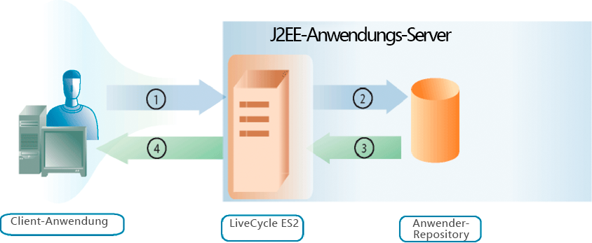

# Benutzer verwalten {#managing-users}

**Info zu User Management**

Mit der User Management-API können Sie Clientanwendungen erstellen, die Rollen, Berechtigungen und Prinzipale (d. h. Benutzer oder Gruppen) verwalten und Benutzer authentifizieren können. Die User Management-API besteht aus den folgenden AEM Forms-APIs:

* Directory Manager-Dienst-API
* Authentication Manager-Dienst-API
* Authorization Manager-Dienst-API

Mit User Management können Sie Rollen und Berechtigungen zuweisen, entfernen und festlegen. Außerdem können Sie Domänen, Benutzer und Gruppen zuweisen, entfernen und abfragen. Schließlich können Sie User Management verwenden, um Benutzer zu authentifizieren.

Beim [Hinzufügen von Benutzern](users.md#adding-users) erfahren Sie, wie Sie Benutzer programmatisch hinzufügen. In diesem Abschnitt wird die Directory Manager-Dienst-API verwendet.

Beim [Löschen von Benutzern](users.md#deleting-users) erfahren Sie, wie Benutzer programmgesteuert gelöscht werden. In diesem Abschnitt wird die Directory Manager-Dienst-API verwendet.

Unter [Verwalten von Benutzern und Gruppen](users.md#managing-users-and-groups) erfahren Sie mehr über den Unterschied zwischen einem lokalen Benutzer und einem Ordnerbenutzer. Außerdem finden Sie Beispiele für die Verwendung der Java- und Webdienst-APIs zum programmgesteuerten Verwalten von Benutzern und Gruppen. In diesem Abschnitt wird die Directory Manager-Dienst-API verwendet.

Unter [Verwalten von Rollen und Berechtigungen](users.md#managing-roles-and-permissions) erfahren Sie mehr über die Systemrollen und -berechtigungen und was Sie programmgesteuert tun können, um sie zu erweitern. Außerdem finden Sie Beispiele für die Verwendung der Java- und Webdienst-APIs zum programmgesteuerten Verwalten von Rollen und Berechtigungen. In diesem Abschnitt werden sowohl die Directory Manager-Dienst-API als auch die Authorization Manager-Dienst-API verwendet.

In der [Authentifizierung von Benutzern](users.md#authenticating-users) finden Sie Beispiele für die Verwendung der Java- und Webdienst-APIs zur programmatischen Authentifizierung von Benutzern. In diesem Abschnitt wird die Authorization Manager-Dienst-API verwendet.

**Authentifizierungsprozess**

User Management bietet integrierte Authentifizierungsfunktionen und die Möglichkeit, diese mit Ihrem eigenen Authentifizierungsanbieter zu verbinden. Wenn User Management eine Authentifizierungsanforderung erhält (z. B. wenn ein Benutzer versucht, sich anzumelden), werden Benutzerinformationen zur Authentifizierung an den Authentifizierungsanbieter weitergeleitet. User Management erhält die Ergebnisse vom Authentifizierungsanbieter, nachdem der Benutzer authentifiziert wurde.

Das folgende Diagramm zeigt die Interaktion zwischen einem Endbenutzer, der versucht, sich anzumelden, User Management und dem Authentifizierungsanbieter.

In der folgenden Tabelle werden die einzelnen Schritte des Authentifizierungsprozesses beschrieben.

<table>
 <thead>
  <tr>
   <th>
Schritt
</th>
   <th>
Beschreibung
</th>
  </tr>
 </thead>
 <tbody>
  <tr>
   <td>
1
</td>
   <td>
Ein Benutzer versucht, sich bei einem Dienst anzumelden, der User Management aufruft. Der Benutzer gibt einen Benutzernamen und ein Kennwort an. 
</td>
  </tr>
  <tr>
   <td>
2
</td>
   <td>
User Management sendet den Benutzernamen und das Kennwort sowie Konfigurationsinformationen an den Authentifizierungsanbieter.
</td>
  </tr>
  <tr>
   <td>
3
</td>
   <td>
Der Authentifizierungsanbieter stellt eine Verbindung zum Benutzerspeicher her und authentifiziert den Benutzer.
</td>
  </tr>
  <tr>
   <td>
4
</td>
   <td>
Der Authentifizierungsanbieter gibt die Ergebnisse an User Management zurück.
</td>
  </tr>
  <tr>
   <td>
5
</td>
   <td>
Mit der Benutzerverwaltung können Benutzer sich entweder anmelden oder den Zugriff auf das Produkt verweigern.
</td>
  </tr>
 </tbody>
</table>

>[!NOTE]
>
>Wenn sich die Zeitzone des Servers von der Zeitzone des Clients unterscheidet und der WSDL-Dienst für den Generate PDF-Dienst von AEM Forms auf einem nativen SOAP-Stapel mit einem .NET-Client auf einem WebSphere Application Server-Cluster verwendet wird, kann der folgende User Management-Authentifizierungsfehler auftreten:

`[com.adobe.idp.um.webservices.WSSecurityHandler] errorCode:12803 errorCodeHEX:0x3203 message:WSSecurityHandler: UM authenticate returns exception : An error was discovered processing the <wsse:Security> header. (WSSecurityEngine: Invalid timestamp The security semantics of message have expired).`

**Informationen zur Ordnerverwaltung**

User Management wird mit einem Ordnerdienstanbieter (dem DirectoryManagerService) verpackt, der Verbindungen zu LDAP-Ordnern unterstützt. Wenn Ihr Unternehmen Benutzerdatensätze mit einem Nicht-LDAP-Repository speichert, können Sie einen eigenen Ordnerdienstanbieter erstellen, der mit Ihrem Repository funktioniert.

Verzeichnisdienstanbieter rufen auf Anfrage von User Management Datensätze aus einem Benutzerspeicher ab. User Management speichert Benutzer- und Gruppendatensätze in der Datenbank regelmäßig zwischen, um die Leistung zu verbessern.

Mit dem Ordnerdienstanbieter kann die User Management-Datenbank mit dem Benutzerspeicher synchronisiert werden. Dieser Schritt stellt sicher, dass alle Benutzerordnerinformationen sowie alle Benutzer- und Gruppendatensätze auf dem neuesten Stand sind.

Darüber hinaus bietet der DirectoryManagerService die Möglichkeit, Domänen zu erstellen und zu verwalten. Domänen definieren unterschiedliche Benutzergrundlagen. Die Begrenzung einer Domäne wird in der Regel entsprechend der Struktur Ihres Unternehmens oder der Einrichtung Ihres Benutzerspeichers definiert. User Management-Domänen bieten Konfigurationseinstellungen, die von Authentifizierungsanbietern und Ordnerdienstanbietern verwendet werden.

In der Konfigurationsdatei, die User Management exportiert, enthält der Stammknoten mit dem Attributwert `Domains` ein XML-Element für jede für User Management definierte Domäne. Jedes dieser Elemente enthält andere Elemente, die Aspekte der Domäne definieren, die mit bestimmten Dienstanbietern verbunden sind.

**ObjekteSID-Werte verstehen**

Bei der Verwendung von Active Directory ist zu verstehen, dass ein `objectSID` Wert kein eindeutiges Attribut über mehrere Domänen hinweg ist. Dieser Wert speichert die Sicherheitskennung eines Objekts. In einer Umgebung mit mehreren Domänen (z. B. einer Struktur von Domänen) kann der `objectSID` Wert unterschiedlich sein.

Ein `objectSID` Wert würde sich ändern, wenn ein Objekt von einer Active Directory-Domäne in eine andere Domäne verschoben wird. Einige Objekte haben denselben `objectSID` Wert an einer beliebigen Stelle in der Domäne. Beispielsweise haben Gruppen wie &quot;BUILTIN\Administratoren&quot;, &quot;BUILTIN\Power Users&quot;usw. unabhängig von den Domänen denselben `objectSID` Wert. Diese `objectSID` Werte sind bekannt.

## Adding Users {#adding-users}

Sie können die Directory Manager-Dienst-API (Java und Webdienst) verwenden, um Benutzer programmgesteuert zu AEM Forms hinzuzufügen. Nachdem Sie einen Benutzer hinzugefügt haben, können Sie ihn bei einem Dienstvorgang verwenden, für den ein Benutzer erforderlich ist. Sie können dem neuen Benutzer beispielsweise eine Aufgabe zuweisen.

### Zusammenfassung der Schritte {#summary-of-steps}

So fügen Sie einen Benutzer hinzu:

1. Schließen Sie Projektdateien ein.
1. Erstellen Sie einen DirectoryManagerService-Client.
1. Legen Sie Benutzerinformationen fest.
1. Fügen Sie den Benutzer zu AEM Forms hinzu.
1. Überprüfen Sie, ob der Benutzer hinzugefügt wird.

**Projektdateien einschließen**

Schließen Sie die erforderlichen Dateien in Ihr Entwicklungsprojekt ein. Wenn Sie eine Clientanwendung mit Java erstellen, schließen Sie die erforderlichen JAR-Dateien ein. Wenn Sie Webdienste verwenden, schließen Sie die Proxydateien ein.

**Erstellen eines DirectoryManagerService-Clients**

Bevor Sie einen Directory Manager-Dienstvorgang programmgesteuert durchführen können, erstellen Sie einen Directory Manager-Dienst-API-Client.

**Benutzerinformationen definieren**

Wenn Sie einen neuen Benutzer mithilfe der Directory Manager-Dienst-API hinzufügen, definieren Sie Informationen für diesen Benutzer. Wenn Sie einen neuen Benutzer hinzufügen, definieren Sie normalerweise die folgenden Werte:

* **Domänenname**: Die Domäne, zu der der Benutzer gehört (z. B. `DefaultDom`).
* **Benutzerkennungswert**: Der Bezeichnerwert des Benutzers (z. B. `wblue`).
* **Prinzipaltyp**: Der Typ des Benutzers (Sie können beispielsweise angeben `USER)`.
* **Vorname**: Ein Vorname für den Benutzer (z. B. `Wendy`).
* **Nachname**: Der Nachname des Benutzers (z. B. `Blue)`.
* **Gebietsschema**: Gebietsschema-Informationen für den Benutzer.

**Benutzer zu AEM Forms hinzufügen**

Nachdem Sie Benutzerinformationen definiert haben, können Sie den Benutzer zu AEM Forms hinzufügen. Um einen Benutzer hinzuzufügen, rufen Sie die `DirectoryManagerServiceClient` Methode des `createLocalUser` Objekts auf.

**Überprüfen, ob der Benutzer hinzugefügt wurde**

Sie können überprüfen, ob der Benutzer hinzugefügt wurde, um sicherzustellen, dass keine Probleme aufgetreten sind. Suchen Sie den neuen Benutzer mithilfe des Benutzerkennungswerts.

**Siehe auch**

[Hinzufügen von Benutzern mit der Java-API](users.md#add-users-using-the-java-api)

[Hinzufügen von Benutzern mit der Webdienst-API](users.md#add-users-using-the-web-service-api)

[Einbeziehung von AEM Forms Java-Bibliotheksdateien](/help/forms/developing/invoking-aem-forms-using-java.md#including-aem-forms-java-library-files)

[Verbindungseigenschaften festlegen](/help/forms/developing/invoking-aem-forms-using-java.md#setting-connection-properties)

[Löschen von Benutzern](users.md#deleting-users)

### Hinzufügen von Benutzern mit der Java-API {#add-users-using-the-java-api}

Hinzufügen von Benutzern mithilfe der Directory Manager Service API (Java):

1. Schließen Sie Projektdateien ein.

   Schließen Sie Client-JAR-Dateien wie &quot;adobe-usermanager-client.jar&quot;im Klassenpfad Ihres Java-Projekts ein.

1. Erstellen Sie einen DirectoryManagerServices-Client.

   Erstellen Sie ein `DirectoryManagerServiceClient` Objekt, indem Sie dessen Konstruktor verwenden und ein `ServiceClientFactory` Objekt übergeben, das Verbindungseigenschaften enthält.

1. Legen Sie Benutzerinformationen fest.

   * Erstellen Sie ein Objekt `UserImpl`, indem Sie den Konstruktor verwenden.
   * Legen Sie den Standardnamen fest, indem Sie die `UserImpl` Objektmethode `setDomainName` aufrufen. Übergeben Sie einen Zeichenfolgenwert, der den Domänennamen angibt.
   * Legen Sie den Prinzipaltyp fest, indem Sie die `UserImpl` Objektmethode `setPrincipalType` aufrufen. Übergeben Sie einen Zeichenfolgenwert, der den Typ des Benutzers angibt. Sie können beispielsweise angeben `USER`.
   * Legen Sie den Wert der Benutzerkennung fest, indem Sie die `UserImpl` Objektmethode `setUserid` aufrufen. Übergeben Sie einen Zeichenfolgenwert, der den Wert der Benutzerkennung angibt. Sie können beispielsweise angeben `wblue`.
   * Legen Sie den kanonischen Namen fest, indem Sie die `UserImpl` Objektmethode `setCanonicalName` aufrufen. Übergeben Sie einen Zeichenfolgenwert, der den kanonischen Namen des Benutzers angibt. Sie können beispielsweise angeben `wblue`.
   * Legen Sie den angegebenen Namen fest, indem Sie die `UserImpl` Objektmethode `setGivenName` aufrufen. Übergeben Sie einen Zeichenfolgenwert, der den Vornamen des Benutzers angibt. Sie können beispielsweise angeben `Wendy`.
   * Legen Sie den Nachnamen fest, indem Sie die `UserImpl` Objektmethode `setFamilyName` aufrufen. Übergeben Sie einen Zeichenfolgenwert, der den Nachnamen des Benutzers angibt. Sie können beispielsweise angeben `Blue`.
   >[!NOTE]
   >
   >Rufen Sie eine Methode auf, die zum `UserImpl` Objekt gehört, um andere Werte festzulegen. Sie können beispielsweise den Wert des Gebietsschemas festlegen, indem Sie die `UserImpl` Objektmethode `setLocale` aufrufen.

1. Fügen Sie den Benutzer zu AEM Forms hinzu.

   Rufen Sie die `DirectoryManagerServiceClient` Objektmethode `createLocalUser` auf und übergeben Sie die folgenden Werte:

   * Das `UserImpl` Objekt, das den neuen Benutzer darstellt
   * Ein Zeichenfolgenwert, der das Kennwort des Benutzers darstellt
   Die `createLocalUser` Methode gibt einen Zeichenfolgenwert zurück, der den Wert der lokalen Benutzerkennung angibt.

1. Überprüfen Sie, ob der Benutzer hinzugefügt wurde.

   * Erstellen Sie ein Objekt `PrincipalSearchFilter`, indem Sie den Konstruktor verwenden.
   * Legen Sie den Wert der Benutzerkennung fest, indem Sie die `PrincipalSearchFilter` Objektmethode `setUserId` aufrufen. Übergeben Sie einen Zeichenfolgenwert, der den Wert der Benutzerkennung darstellt.
   * Invoke the `DirectoryManagerServiceClient` object’s `findPrincipals` method and pass the `PrincipalSearchFilter` object. Diese Methode gibt eine `java.util.List` Instanz zurück, bei der jedes Element ein `User` Objekt ist. Durchlaufen Sie die `java.util.List` Instanz, um den Benutzer zu suchen.

**Siehe auch**

[Zusammenfassung der Schritte](users.md#summary-of-steps)

[Kurzanleitung (SOAP-Modus): Hinzufügen von Benutzern mit der Java-API](/help/forms/developing/user-manager-java-api-quick.md#quick-start-soap-mode-adding-users-using-the-java-api)

[Einbeziehung von AEM Forms Java-Bibliotheksdateien](/help/forms/developing/invoking-aem-forms-using-java.md#including-aem-forms-java-library-files)

[Verbindungseigenschaften festlegen](/help/forms/developing/invoking-aem-forms-using-java.md#setting-connection-properties)

### Hinzufügen von Benutzern mit der Webdienst-API {#add-users-using-the-web-service-api}

Fügen Sie Benutzer mithilfe der Directory Manager-Dienst-API (Webdienst) hinzu:

1. Schließen Sie Projektdateien ein.

   Erstellen Sie ein Microsoft .NET-Projekt, das MTOM verwendet. Stellen Sie sicher, dass Sie die folgende WSDL-Definition für die Dienstreferenz verwenden: `http://localhost:8080/soap/services/DirectoryManagerService?WSDL&lc_version=9.0.1`.

   >[!NOTE]
   >
   >Ersetzen Sie dies `localhost` durch die IP-Adresse des Servers, auf dem AEM Forms gehostet wird.

1. Erstellen Sie einen DirectoryManagerService-Client.

   * Create a `DirectoryManagerServiceClient` object by using its default constructor.
   * Create a `DirectoryManagerServiceClient.Endpoint.Address` object by using the `System.ServiceModel.EndpointAddress` constructor. Übergeben Sie einen Zeichenfolgenwert, der die WSDL angibt, an den AEM Forms-Dienst (z. B. `http://localhost:8080/soap/services/DirectoryManagerService?blob=mtom`). Sie müssen das `lc_version` Attribut nicht verwenden. Dieses Attribut wird verwendet, wenn Sie eine Dienstreferenz erstellen. Stellen Sie sicher, dass Sie dies angeben `?blob=mtom`.
   * Erstellen Sie ein `System.ServiceModel.BasicHttpBinding` Objekt, indem Sie den Wert des `DirectoryManagerServiceClient.Endpoint.Binding` Felds abrufen. Wandeln Sie den Rückgabewert in `BasicHttpBinding` um.
   * Legen Sie für das `System.ServiceModel.BasicHttpBinding` Objektfeld `MessageEncoding` den Wert `WSMessageEncoding.Mtom`fest. Dieser Wert stellt sicher, dass MTOM verwendet wird.
   * Aktivieren Sie die einfache HTTP-Authentifizierung, indem Sie die folgenden Aufgaben ausführen:

      * Weisen Sie dem Feld den AEM Forms-Benutzernamen zu `DirectoryManagerServiceClient.ClientCredentials.UserName.UserName`.
      * Weisen Sie dem Feld den entsprechenden Kennwortwert zu `DirectoryManagerServiceClient.ClientCredentials.UserName.Password`.
      * Weisen Sie dem Feld den Konstantenwert `HttpClientCredentialType.Basic` zu `BasicHttpBindingSecurity.Transport.ClientCredentialType`.
      * Weisen Sie dem Feld den Konstantenwert `BasicHttpSecurityMode.TransportCredentialOnly` zu `BasicHttpBindingSecurity.Security.Mode`.

1. Legen Sie Benutzerinformationen fest.

   * Erstellen Sie ein Objekt `UserImpl`, indem Sie den Konstruktor verwenden.
   * Legen Sie den Hauptnamen fest, indem Sie dem `UserImpl` Objektfeld einen Zeichenfolgenwert zuweisen `domainName` .
   * Legen Sie den Prinzipaltyp fest, indem Sie dem `UserImpl` Objektfeld einen Zeichenfolgenwert zuweisen `principalType` . Sie können beispielsweise angeben `USER`.
   * Legen Sie den Wert der Benutzerkennung fest, indem Sie dem `UserImpl` Objektfeld einen Zeichenfolgenwert zuweisen `userid` .
   * Legen Sie den kanonischen Namenswert fest, indem Sie dem `UserImpl` Objektfeld einen Zeichenfolgenwert zuweisen `canonicalName` .
   * Legen Sie den Wert für den angegebenen Namen fest, indem Sie dem `UserImpl` Objektfeld einen Zeichenfolgenwert zuweisen `givenName` .
   * Legen Sie den Wert für den Nachnamen fest, indem Sie dem `UserImpl` Objektfeld einen Zeichenfolgenwert zuweisen `familyName` .

1. Fügen Sie den Benutzer zu AEM Forms hinzu.

   Rufen Sie die `DirectoryManagerServiceClient` Objektmethode `createLocalUser` auf und übergeben Sie die folgenden Werte:

   * Das `UserImpl` Objekt, das den neuen Benutzer darstellt
   * Ein Zeichenfolgenwert, der das Kennwort des Benutzers darstellt
   Die `createLocalUser` Methode gibt einen Zeichenfolgenwert zurück, der den Wert der lokalen Benutzerkennung angibt.

1. Überprüfen Sie, ob der Benutzer hinzugefügt wurde.

   * Erstellen Sie ein Objekt `PrincipalSearchFilter`, indem Sie den Konstruktor verwenden.
   * Legen Sie den Benutzer-ID-Wert des Benutzers fest, indem Sie dem Feld des `PrincipalSearchFilter` Objekts einen Zeichenfolgenwert zuweisen, der den Benutzer-ID-Wert `userId` darstellt.
   * Invoke the `DirectoryManagerServiceClient` object’s `findPrincipals` method and pass the `PrincipalSearchFilter` object. Diese Methode gibt ein `MyArrayOfUser` Collection-Objekt zurück, bei dem jedes Element ein `User` Objekt ist. Durchlaufen Sie die `MyArrayOfUser` Sammlung, um den Benutzer zu suchen.

**Siehe auch**

[Zusammenfassung der Schritte](users.md#summary-of-steps)

[Aufrufen von AEM Forms mithilfe von MTOM](/help/forms/developing/invoking-aem-forms-using-web.md#invoking-aem-forms-using-mtom)

[Aufrufen von AEM Forms mithilfe von SwaRef](/help/forms/developing/invoking-aem-forms-using-web.md#invoking-aem-forms-using-swaref)

## Löschen von Benutzern {#deleting-users}

Sie können die Directory Manager-Dienst-API (Java und Webdienst) verwenden, um Benutzer programmgesteuert aus AEM Forms zu löschen. Nach dem Löschen eines Benutzers kann der Benutzer nicht mehr für einen Dienstvorgang verwendet werden, für den ein Benutzer erforderlich ist. So können Sie beispielsweise einem gelöschten Benutzer keine Aufgabe zuweisen.

### Zusammenfassung der Schritte {#summary_of_steps-1}

So löschen Sie einen Benutzer:

1. Schließen Sie Projektdateien ein.
1. Erstellen Sie einen DirectoryManagerService-Client.
1. Geben Sie den zu löschenden Benutzer an.
1. Löschen Sie den Benutzer aus AEM Forms.

**Projektdateien einschließen**

Schließen Sie die erforderlichen Dateien in Ihr Entwicklungsprojekt ein. Wenn Sie eine Clientanwendung mit Java erstellen, schließen Sie die erforderlichen JAR-Dateien ein. Wenn Sie Webdienste verwenden, schließen Sie die Proxydateien ein.

**Erstellen eines DirectoryManagerService-Clients**

Bevor Sie einen Directory Manager-Dienst-API-Vorgang programmgesteuert durchführen können, erstellen Sie einen Directory Manager-Dienstclient.

**Benutzer zum Löschen angeben**

Sie können einen Benutzer angeben, der gelöscht werden soll, indem Sie den Bezeichnerwert des Benutzers verwenden.

**Benutzer aus AEM Forms löschen**

Um einen Benutzer zu löschen, rufen Sie die `DirectoryManagerServiceClient` Methode des `deleteLocalUser` Objekts auf.

**Siehe auch**

[Benutzer mit der Java-API löschen](users.md#delete-users-using-the-java-api)

[Löschen von Benutzern mit der Webdienst-API](users.md#delete-users-using-the-web-service-api)

[Einbeziehung von AEM Forms Java-Bibliotheksdateien](/help/forms/developing/invoking-aem-forms-using-java.md#including-aem-forms-java-library-files)

[Verbindungseigenschaften festlegen](/help/forms/developing/invoking-aem-forms-using-java.md#setting-connection-properties)

[Hinzufügen von Benutzern](users.md#adding-users)

### Benutzer mit der Java-API löschen {#delete-users-using-the-java-api}

Löschen Sie Benutzer mithilfe der Directory Manager Service API (Java):

1. Schließen Sie Projektdateien ein.

   Schließen Sie Client-JAR-Dateien wie &quot;adobe-usermanager-client.jar&quot;im Klassenpfad Ihres Java-Projekts ein.

1. Erstellen Sie einen DirectoryManagerService-Client.

   Erstellen Sie ein `DirectoryManagerServiceClient` Objekt, indem Sie dessen Konstruktor verwenden und ein `ServiceClientFactory` Objekt übergeben, das Verbindungseigenschaften enthält.

1. Geben Sie den zu löschenden Benutzer an.

   * Erstellen Sie ein Objekt `PrincipalSearchFilter`, indem Sie den Konstruktor verwenden.
   * Legen Sie den Wert der Benutzerkennung fest, indem Sie die `PrincipalSearchFilter` Objektmethode `setUserId` aufrufen. Übergeben Sie einen Zeichenfolgenwert, der den Wert der Benutzerkennung darstellt.
   * Invoke the `DirectoryManagerServiceClient` object’s `findPrincipals` method and pass the `PrincipalSearchFilter` object. Diese Methode gibt eine `java.util.List` Instanz zurück, bei der jedes Element ein `User` Objekt ist. Durchlaufen Sie die `java.util.List` Instanz, um den zu löschenden Benutzer zu suchen.

1. Löschen Sie den Benutzer aus AEM Forms.

   Rufen Sie die `DirectoryManagerServiceClient` Methode des `deleteLocalUser` Objekts auf und übergeben Sie den Wert des Felds des `User` Objekts `oid` . Rufen Sie die `User` Methode des `getOid` Objekts auf. Verwenden Sie das `User` Objekt, das von der `java.util.List` Instanz abgerufen wird.

**Siehe auch**

[Zusammenfassung der Schritte](users.md#summary-of-steps)

[Kurzanleitung (EJB-Modus): Löschen von Benutzern mit der Java-API](/help/forms/developing/user-manager-java-api-quick.md#quick-start-soap-mode-deleting-users-using-the-java-api)

[Kurzanleitung (SOAP-Modus): Löschen von Benutzern mit der Java-API](/help/forms/developing/user-manager-java-api-quick.md#quick-start-soap-mode-deleting-users-using-the-java-api)

[Einbeziehung von AEM Forms Java-Bibliotheksdateien](/help/forms/developing/invoking-aem-forms-using-java.md#including-aem-forms-java-library-files)

[Verbindungseigenschaften festlegen](/help/forms/developing/invoking-aem-forms-using-java.md#setting-connection-properties)

### Löschen von Benutzern mit der Webdienst-API {#delete-users-using-the-web-service-api}

Löschen Sie Benutzer mithilfe der Directory Manager-Dienst-API (Webdienst):

1. Schließen Sie Projektdateien ein.

   Schließen Sie Client-JAR-Dateien wie &quot;adobe-usermanager-client.jar&quot;im Klassenpfad Ihres Java-Projekts ein.

1. Erstellen Sie einen DirectoryManagerService-Client.

   * Create a `DirectoryManagerServiceClient` object by using its default constructor.
   * Create a `DirectoryManagerServiceClient.Endpoint.Address` object by using the `System.ServiceModel.EndpointAddress` constructor. Übergeben Sie einen Zeichenfolgenwert, der die WSDL angibt, an den AEM Forms-Dienst (z. B. `http://localhost:8080/soap/services/DirectoryManagerService?blob=mtom`). Sie müssen das `lc_version` Attribut nicht verwenden. Dieses Attribut wird verwendet, wenn Sie eine Dienstreferenz erstellen. Stellen Sie sicher, dass Sie `blob=mtom.`
   * Erstellen Sie ein `System.ServiceModel.BasicHttpBinding` Objekt, indem Sie den Wert des `DirectoryManagerServiceClient.Endpoint.Binding` Felds abrufen. Wandeln Sie den Rückgabewert in `BasicHttpBinding` um.
   * Legen Sie für das `System.ServiceModel.BasicHttpBinding` Objektfeld `MessageEncoding` den Wert `WSMessageEncoding.Mtom`fest. Dieser Wert stellt sicher, dass MTOM verwendet wird.
   * Aktivieren Sie die einfache HTTP-Authentifizierung, indem Sie die folgenden Aufgaben ausführen:

      * Weisen Sie dem Feld den AEM Forms-Benutzernamen zu `DirectoryManagerServiceClient.ClientCredentials.UserName.UserName`.
      * Weisen Sie dem Feld den entsprechenden Kennwortwert zu `DirectoryManagerServiceClient.ClientCredentials.UserName.Password`.
      * Weisen Sie dem Feld den Konstantenwert `HttpClientCredentialType.Basic` zu `BasicHttpBindingSecurity.Transport.ClientCredentialType`.
      * Weisen Sie dem Feld den Konstantenwert `BasicHttpSecurityMode.TransportCredentialOnly` zu `BasicHttpBindingSecurity.Security.Mode`.

1. Geben Sie den zu löschenden Benutzer an.

   * Erstellen Sie ein Objekt `PrincipalSearchFilter`, indem Sie den Konstruktor verwenden.
   * Legen Sie den Wert der Benutzerkennung fest, indem Sie dem `PrincipalSearchFilter` Objektfeld einen Zeichenfolgenwert zuweisen `userId` .
   * Invoke the `DirectoryManagerServiceClient` object’s `findPrincipals` method and pass the `PrincipalSearchFilter` object. Diese Methode gibt ein `MyArrayOfUser` Collection-Objekt zurück, bei dem jedes Element ein `User` Objekt ist. Durchlaufen Sie die `MyArrayOfUser` Sammlung, um den Benutzer zu suchen. Das vom `User` Sammlungsobjekt abgerufene `MyArrayOfUser` Objekt wird zum Löschen des Benutzers verwendet.

1. Löschen Sie den Benutzer aus AEM Forms.

   Löschen Sie den Benutzer, indem Sie den `User` Feldwert des `oid` Objekts an die `DirectoryManagerServiceClient` Objektmethode `deleteLocalUser` übergeben.

**Siehe auch**

[Zusammenfassung der Schritte](users.md#summary-of-steps)

[Aufrufen von AEM Forms mithilfe von MTOM](/help/forms/developing/invoking-aem-forms-using-web.md#invoking-aem-forms-using-mtom)

[Aufrufen von AEM Forms mithilfe von SwaRef](/help/forms/developing/invoking-aem-forms-using-web.md#invoking-aem-forms-using-swaref)

## Erstellen von Gruppen    {#creating-groups}

Sie können die Directory Manager-Dienst-API (Java und Webdienst) verwenden, um AEM Forms-Gruppen programmgesteuert zu erstellen. Nachdem Sie eine Gruppe erstellt haben, können Sie diese Gruppe verwenden, um einen Dienstvorgang durchzuführen, für den eine Gruppe erforderlich ist. Beispielsweise können Sie der neuen Gruppe einen Benutzer zuweisen. (See [Managing Users and Groups](users.md#managing-users-and-groups).)

### Zusammenfassung der Schritte {#summary_of_steps-2}

So erstellen Sie eine Gruppe:

1. Schließen Sie Projektdateien ein.
1. Erstellen Sie einen DirectoryManagerService-Client.
1. Stellen Sie fest, dass die Gruppe nicht vorhanden ist.
1. Erstellen Sie die Gruppe.
1. Führen Sie eine Aktion mit der Gruppe durch.

**Projektdateien einschließen**

Schließen Sie die erforderlichen Dateien in Ihr Entwicklungsprojekt ein. Wenn Sie eine Clientanwendung mit Java erstellen, schließen Sie die erforderlichen JAR-Dateien ein.

Die folgenden JAR-Dateien müssen dem Klassenpfad Ihres Projekts hinzugefügt werden:

* adobe-livecycle-client.jar
* adobe-usermanager-client.jar
* adobe-utilities.jar (Erforderlich, wenn AEM Forms auf JBoss bereitgestellt wird)
* jbossall-client.jar (Erforderlich, wenn AEM Forms auf JBoss bereitgestellt wird)

For information about the location of these JAR files, see [Including AEM Forms Java library files](/help/forms/developing/invoking-aem-forms-using-java.md#including-aem-forms-java-library-files).

**Erstellen eines DirectoryManagerService-Clients**

Bevor Sie einen Directory Manager-Dienstvorgang programmgesteuert durchführen können, erstellen Sie einen Directory Manager-Dienst-API-Client.

**Bestimmen, ob die Gruppe vorhanden ist**

Stellen Sie beim Erstellen einer Gruppe sicher, dass die Gruppe nicht in derselben Domäne vorhanden ist. Das heißt, zwei Gruppen können nicht denselben Namen innerhalb derselben Domäne haben. Um diese Aufgabe durchzuführen, führen Sie eine Suche durch und filtern Sie die Suchergebnisse anhand zweier Werte. Stellen Sie den Prinzipaltyp so ein, `com.adobe.idp.um.api.infomodel.Principal.PRINCIPALTYPE_GROUP` dass nur Gruppen zurückgegeben werden. Achten Sie außerdem darauf, den Domänennamen anzugeben.

**Gruppe erstellen**

Nachdem Sie festgestellt haben, dass die Gruppe nicht in der Domäne vorhanden ist, erstellen Sie die Gruppe und geben Sie die folgenden Attribute an:

* **CommonName**: Der Name der Gruppe.
* **Domäne**: Die Domäne, in der die Gruppe hinzugefügt wird.
* **Beschreibung**: Eine Beschreibung der Gruppe.

**Durchführen einer Aktion mit der Gruppe**

Nachdem Sie eine Gruppe erstellt haben, können Sie eine Aktion mit der Gruppe durchführen. Sie können der Gruppe beispielsweise einen Benutzer hinzufügen. Um einen Benutzer zu einer Gruppe hinzuzufügen, rufen Sie den eindeutigen Bezeichnerwert des Benutzers und der Gruppe ab. Übergeben Sie diese Werte an die `addPrincipalToLocalGroup` Methode.

**Siehe auch**

[Gruppen mit der Java-API erstellen](users.md#create-groups-using-the-java-api)

[Einbeziehung von AEM Forms Java-Bibliotheksdateien](/help/forms/developing/invoking-aem-forms-using-java.md#including-aem-forms-java-library-files)

[Verbindungseigenschaften festlegen](/help/forms/developing/invoking-aem-forms-using-java.md#setting-connection-properties)

[Hinzufügen von Benutzern](users.md#adding-users)

[Löschen von Benutzern](users.md#deleting-users)

### Gruppen mit der Java-API erstellen {#create-groups-using-the-java-api}

Erstellen Sie eine Gruppe mithilfe der Directory Manager Service API (Java):

1. Schließen Sie Projektdateien ein.

   Schließen Sie Client-JAR-Dateien wie &quot;adobe-usermanager-client.jar&quot;im Klassenpfad Ihres Java-Projekts ein.

1. Erstellen Sie einen DirectoryManagerService-Client.

   Erstellen Sie ein `DirectoryManagerServiceClient` Objekt, indem Sie dessen Konstruktor verwenden und ein `ServiceClientFactory` Objekt übergeben, das Verbindungseigenschaften enthält.

1. Bestimmen Sie, ob die Gruppe vorhanden ist.

   * Erstellen Sie ein Objekt `PrincipalSearchFilter`, indem Sie den Konstruktor verwenden.
   * Legen Sie den Prinzipaltyp fest, indem Sie das `PrincipalSearchFilter` Objekt `setPrincipalType` aufrufen. Übergeben Sie den Wert `com.adobe.idp.um.api.infomodel.Principal.PRINCIPALTYPE_GROUP`.
   * Legen Sie die Domäne durch Aufrufen des `PrincipalSearchFilter` Objekts `setSpecificDomainName` fest. Übergeben Sie einen Zeichenfolgenwert, der den Domänennamen angibt.
   * Um eine Gruppe zu suchen, rufen Sie die `DirectoryManagerServiceClient` Methode des `findPrincipals` Objekts auf (ein Prinzipal kann eine Gruppe sein). Übergeben Sie das `PrincipalSearchFilter` Objekt, das den Prinzipaltyp und den Domänennamen angibt. Diese Methode gibt eine `java.util.List` Instanz zurück, bei der jedes Element eine `Group` Instanz ist. Jede Gruppeninstanz entspricht dem mit dem `PrincipalSearchFilter` Objekt angegebenen Filter.
   * Durchlaufen der `java.util.List` Instanz. Rufen Sie für jedes Element den Gruppennamen ab. Stellen Sie sicher, dass der Gruppenname nicht dem neuen Gruppennamen entspricht.

1. Erstellen Sie die Gruppe.

   * Wenn die Gruppe nicht vorhanden ist, rufen Sie die `Group` Methode des `setCommonName` Objekts auf und übergeben Sie einen Zeichenfolgenwert, der den Gruppennamen angibt.
   * Rufen Sie die `Group` Objektmethode auf und übergeben Sie einen Zeichenfolgenwert, der die Gruppenbeschreibung angibt `setDescription` .
   * Rufen Sie die `Group` Methode des `setDomainName` Objekts auf und übergeben Sie einen Zeichenfolgenwert, der den Domänennamen angibt.
   * Invoke the `DirectoryManagerServiceClient` object’s `createLocalGroup` method and pass the `Group` instance.
   Die `createLocalUser` Methode gibt einen Zeichenfolgenwert zurück, der den Wert der lokalen Benutzerkennung angibt.

1. Führen Sie eine Aktion mit der Gruppe durch.

   * Erstellen Sie ein Objekt `PrincipalSearchFilter`, indem Sie den Konstruktor verwenden.
   * Legen Sie den Wert der Benutzerkennung fest, indem Sie die `PrincipalSearchFilter` Objektmethode `setUserId` aufrufen. Übergeben Sie einen Zeichenfolgenwert, der den Wert der Benutzerkennung darstellt.
   * Invoke the `DirectoryManagerServiceClient` object’s `findPrincipals` method and pass the `PrincipalSearchFilter` object. Diese Methode gibt eine `java.util.List` Instanz zurück, bei der jedes Element ein `User` Objekt ist. Durchlaufen Sie die `java.util.List` Instanz, um den Benutzer zu suchen.
   * Fügen Sie der Gruppe einen Benutzer hinzu, indem Sie die `DirectoryManagerServiceClient` Methode des `addPrincipalToLocalGroup` Objekts aufrufen. Übergeben Sie den Rückgabewert der `User` Objektmethode `getOid` . Übergeben Sie den Rückgabewert der `Group` Methode des `getOid` Objekts (verwenden Sie die `Group` Instanz, die die neue Gruppe darstellt).

**Siehe auch**

[Zusammenfassung der Schritte](users.md#summary-of-steps)

[Einbeziehung von AEM Forms Java-Bibliotheksdateien](/help/forms/developing/invoking-aem-forms-using-java.md#including-aem-forms-java-library-files)

[Verbindungseigenschaften festlegen](/help/forms/developing/invoking-aem-forms-using-java.md#setting-connection-properties)

## Verwalten von Benutzern und Gruppen {#managing-users-and-groups}

In diesem Thema wird beschrieben, wie Sie Domänen, Benutzer und Gruppen programmgesteuert zuweisen, entfernen und abfragen können (Java).

>[!NOTE]
>
>Beim Konfigurieren einer Domäne müssen Sie den eindeutigen Bezeichner für Gruppen und Benutzer festlegen. Das ausgewählte Attribut muss nicht nur innerhalb der LDAP-Umgebung eindeutig sein, sondern muss auch unveränderlich sein und darf sich nicht im Ordner ändern. Dieses Attribut muss auch ein einfacher Zeichenfolgendatentyp sein (die einzige Ausnahme, die derzeit für Active Directory 2000/2003 zulässig ist `"objectsid"`, ist ein binärer Wert). Das Novell eDirectory-Attribut `"GUID"`ist beispielsweise kein einfacher String-Datentyp und funktioniert daher nicht.

* Verwenden Sie für Active Directory `"objectsid"`.
* Verwenden Sie SunOne `"nsuniqueid"`.

>[!NOTE]
>
>Das Erstellen mehrerer lokaler Benutzer und Gruppen während der Synchronisierung des LDAP-Ordners wird nicht unterstützt. Wird dies dennoch versucht, können Fehler auftreten.

### Zusammenfassung der Schritte {#summary_of_steps-3}

So verwalten Sie Benutzer und Gruppen:

1. Schließen Sie Projektdateien ein.
1. Erstellen Sie einen DirectoryManagerService-Client.
1. Rufen Sie die entsprechenden Benutzer- oder Gruppenvorgänge auf.

**Projektdateien einschließen**

Schließen Sie die erforderlichen Dateien in Ihr Entwicklungsprojekt ein. Wenn Sie eine Clientanwendung mit Java erstellen, schließen Sie die erforderlichen JAR-Dateien ein. Wenn Sie Webdienste verwenden, stellen Sie sicher, dass Sie die Proxydateien einschließen.

**Erstellen eines DirectoryManagerService-Clients**

Bevor Sie einen Directory Manager-Dienstvorgang programmgesteuert durchführen können, müssen Sie einen Directory Manager-Dienstclient erstellen. Mit der Java-API wird dies durch Erstellen eines `DirectoryManagerServiceClient` Objekts erreicht. Mit der Web-Service-API wird dies durch Erstellen eines `DirectoryManagerServiceService` Objekts erreicht.

**Aufrufen der entsprechenden Benutzer- oder Gruppenvorgänge**

Nachdem Sie den Dienstclient erstellt haben, können Sie die Benutzer- oder Gruppenverwaltungsvorgänge aufrufen. Mit dem Dienstclient können Sie Domänen, Benutzer und Gruppen zuweisen, entfernen und abfragen. Beachten Sie, dass es möglich ist, einer lokalen Gruppe entweder einen Ordnerprinzipal oder einen lokalen Prinzipal hinzuzufügen, es ist jedoch nicht möglich, einen lokalen Prinzipal zu einer Ordnergruppe hinzuzufügen.

**Siehe auch**

[Verwalten von Benutzern und Gruppen mithilfe der Java-API](users.md#managing-users-and-groups-using-the-java-api)

[Verwalten von Benutzern und Gruppen mithilfe der Webdienst-API](users.md#managing-users-and-groups-using-the-web-service-api)

[Einbeziehung von AEM Forms Java-Bibliotheksdateien](/help/forms/developing/invoking-aem-forms-using-java.md#including-aem-forms-java-library-files)

[Verbindungseigenschaften festlegen](/help/forms/developing/invoking-aem-forms-using-java.md#setting-connection-properties)

[Benutzermanager-API - Kurzanleitungen](/help/forms/developing/user-manager-java-api-quick.md#user-manager-java-api-quick-start-soap)

### Verwalten von Benutzern und Gruppen mithilfe der Java-API {#managing-users-and-groups-using-the-java-api}

Führen Sie die folgenden Aufgaben aus, um Benutzer, Gruppen und Domänen programmgesteuert mit Java zu verwalten:

1. Schließen Sie Projektdateien ein.

   Schließen Sie Client-JAR-Dateien wie &quot;adobe-usermanager-client.jar&quot;im Klassenpfad Ihres Java-Projekts ein. Weitere Informationen über den Speicherort dieser Dateien finden Sie unter [Einbeziehung von AEM Forms Java-Bibliotheksdateien](/help/forms/developing/invoking-aem-forms-using-java.md#including-aem-forms-java-library-files).

1. Erstellen Sie einen DirectoryManagerService-Client.

   Erstellen Sie ein `DirectoryManagerServiceClient` Objekt, indem Sie dessen Konstruktor verwenden und ein `ServiceClientFactory` Objekt übergeben, das Verbindungseigenschaften enthält. Weitere Informationen finden Sie unter [Verbindungseigenschaften](/help/forms/developing/invoking-aem-forms-using-java.md#setting-connection-properties)*festlegen.*

1. Rufen Sie die entsprechenden Benutzer- oder Gruppenvorgänge auf.

   Um einen Benutzer oder eine Gruppe zu suchen, rufen Sie eine der Methoden des `DirectoryManagerServiceClient` Objekts auf, um Prinzipale zu finden (da Prinzipale ein Benutzer oder eine Gruppe sein können). Im folgenden Beispiel wird die `findPrincipals` Methode mit einem Suchfilter (einem `PrincipalSearchFilter` Objekt) aufgerufen.

   Da der Rückgabewert in diesem Fall ein `java.util.List` Objekt ist, das `Principal` Objekte enthält, durchlaufen Sie das Ergebnis und werfen Sie die `Principal` Objekte in ein `User` oder `Group` ein Objekt.

   Rufen Sie mithilfe des Zielobjekts `User` oder `Group` -Objekts (die beide von der `Principal` Oberfläche übernehmen) die Informationen ab, die Sie in Ihren Workflows benötigen. Beispielsweise können Domänennamen und kanonische Namenswerte in Kombination einen Prinzipal eindeutig identifizieren. Diese werden durch Aufrufen der `Principal` Objektmethoden `getDomainName` und `getCanonicalName` -methoden abgerufen.

   Um einen lokalen Benutzer zu löschen, rufen Sie die `DirectoryManagerServiceClient` Methode des `deleteLocalUser` Objekts auf und übergeben Sie die ID des Benutzers.

   Um eine lokale Gruppe zu löschen, rufen Sie die `DirectoryManagerServiceClient` Methode des `deleteLocalGroup` Objekts auf und übergeben Sie die Kennung der Gruppe.

**Siehe auch**

[Zusammenfassung der Schritte](users.md#summary-of-steps)

[Einbeziehung von AEM Forms Java-Bibliotheksdateien](/help/forms/developing/invoking-aem-forms-using-java.md#including-aem-forms-java-library-files)

[Verbindungseigenschaften festlegen](/help/forms/developing/invoking-aem-forms-using-java.md#setting-connection-properties)

### Verwalten von Benutzern und Gruppen mithilfe der Webdienst-API {#managing-users-and-groups-using-the-web-service-api}

Führen Sie die folgenden Aufgaben aus, um Benutzer, Gruppen und Domänen mit der Directory Manager-Dienst-API (Webdienst) programmgesteuert zu verwalten:

1. Schließen Sie Projektdateien ein.

   * Erstellen Sie eine Microsoft .NET-Client-Assembly, die die Directory Manager-WSDL verwendet. (Siehe [Aufrufen von AEM Forms mithilfe der Base64-Kodierung](/help/forms/developing/invoking-aem-forms-using-web.md#invoking-aem-forms-using-base64-encoding).)
   * Verweisen Sie auf die Microsoft .NET-Clientassembly. (Siehe [Erstellen einer .NET-Client-Assembly, die Base64-Kodierung](/help/forms/developing/invoking-aem-forms-using-web.md#creating-a-net-client-assembly-that-uses-base64-encoding)verwendet.)

1. Erstellen Sie einen DirectoryManagerService-Client.

   Erstellen Sie ein `DirectoryManagerServiceService` Objekt mit dem Konstruktor der Proxyklasse.

1. Rufen Sie die entsprechenden Benutzer- oder Gruppenvorgänge auf.

   Um einen Benutzer oder eine Gruppe zu suchen, rufen Sie eine der Methoden des `DirectoryManagerServiceService` Objekts auf, um Prinzipale zu finden (da Prinzipale ein Benutzer oder eine Gruppe sein können). Im folgenden Beispiel wird die `findPrincipalsWithFilter` Methode mit einem Suchfilter (einem `PrincipalSearchFilter` Objekt) aufgerufen. Bei Verwendung eines `PrincipalSearchFilter` Objekts werden lokale Prinzipale nur zurückgegeben, wenn die `isLocal` Eigenschaft auf `true`. Dieses Verhalten unterscheidet sich von dem mit der Java-API.

   >[!NOTE]
   >
   >Wenn die maximale Anzahl von Ergebnissen nicht im Suchfilter (durch das `PrincipalSearchFilter.resultsMax` Feld) angegeben ist, werden maximal 1000 Ergebnisse zurückgegeben. Dieses Verhalten unterscheidet sich von dem, was mit der Java-API passiert, bei der 10 Ergebnisse das standardmäßige Maximum sind. Außerdem `findGroupMembers` ergeben die Suchmethoden wie z. B. keine Ergebnisse, es sei denn, die maximale Anzahl der Ergebnisse wird im Suchfilter angegeben (z. B. über das `GroupMembershipSearchFilter.resultsMax` Feld). Dies gilt für alle Suchfilter, die von der `GenericSearchFilter` Klasse erben. For more information, see [AEM Forms API Reference](https://www.adobe.com/go/learn_aemforms_javadocs_63_en).

   Da der Rückgabewert in diesem Fall ein `object[]` Objekt ist, das `Principal` Objekte enthält, durchlaufen Sie das Ergebnis und werfen Sie die `Principal` Objekte in ein `User` oder `Group` ein Objekt.

   Rufen Sie mithilfe des Zielobjekts `User` oder `Group` -Objekts (die beide von der `Principal` Oberfläche übernehmen) die Informationen ab, die Sie in Ihren Workflows benötigen. Beispielsweise können Domänennamen und kanonische Namenswerte in Kombination einen Prinzipal eindeutig identifizieren. Diese werden durch Aufrufen der `Principal` Objektfelder `domainName` und `canonicalName` Felder abgerufen.

   Um einen lokalen Benutzer zu löschen, rufen Sie die `DirectoryManagerServiceService` Methode des `deleteLocalUser` Objekts auf und übergeben Sie die ID des Benutzers.

   Um eine lokale Gruppe zu löschen, rufen Sie die `DirectoryManagerServiceService` Methode des `deleteLocalGroup` Objekts auf und übergeben Sie die Kennung der Gruppe.

**Siehe auch**

[Zusammenfassung der Schritte](users.md#summary-of-steps)

[Aufrufen von AEM Forms mithilfe von MTOM](/help/forms/developing/invoking-aem-forms-using-web.md#invoking-aem-forms-using-mtom)

## Rollen und Berechtigungen verwalten {#managing-roles-and-permissions}

In diesem Thema wird beschrieben, wie Sie mit der Authorization Manager Service API (Java) Rollen und Berechtigungen programmgesteuert zuweisen, entfernen und festlegen können.

In AEM Forms ist eine *Rolle* eine Gruppe von Berechtigungen für den Zugriff auf eine oder mehrere Ressourcen auf Systemebene. Diese Berechtigungen werden über User Management erstellt und von den Dienstkomponenten erzwungen. Beispielsweise könnte ein Administrator einer Benutzergruppe die Rolle &quot;Richtliniensatzautor&quot;zuweisen. Rights Management würde es dann den Benutzern dieser Gruppe mit dieser Rolle ermöglichen, Richtliniensätze über Administration Console zu erstellen.

Es gibt zwei Arten von Rollen: *Standardrollen* und *benutzerdefinierte Rollen*. Standardrollen (*Systemrollen)* befinden sich bereits in AEM Forms. Es wird davon ausgegangen, dass Standardrollen vom Administrator möglicherweise nicht gelöscht oder geändert werden und daher unveränderlich sind. Benutzerdefinierte Rollen, die vom Administrator erstellt wurden und diese später ändern oder löschen können, sind somit veränderlich.

Rollen erleichtern die Verwaltung von Berechtigungen. Wenn einem Prinzipal eine Rolle zugewiesen wird, wird diesem Prinzipal automatisch eine Reihe von Berechtigungen zugewiesen, und alle spezifischen Entscheidungen zum Zugriff für den Prinzipal basieren auf dieser Gesamtzahl zugewiesener Berechtigungen.

### Zusammenfassung der Schritte {#summary_of_steps-4}

So verwalten Sie Rollen und Berechtigungen:

1. Schließen Sie Projektdateien ein.
1. Erstellen Sie einen AuthorizationManagerService-Client.
1. Rufen Sie die entsprechenden Rollen- oder Berechtigungsvorgänge auf.

**Projektdateien einschließen**

Schließen Sie die erforderlichen Dateien in Ihr Entwicklungsprojekt ein. Wenn Sie eine Clientanwendung mit Java erstellen, schließen Sie die erforderlichen JAR-Dateien ein. Wenn Sie Webdienste verwenden, stellen Sie sicher, dass Sie die Proxydateien einschließen.

**Erstellen eines AuthorizationManagerService-Clients**

Bevor Sie einen User Management AuthorizationManagerService-Vorgang programmgesteuert durchführen können, müssen Sie einen AuthorizationManagerService-Client erstellen. Mit der Java-API wird dies durch Erstellen eines `AuthorizationManagerServiceClient` Objekts erreicht.

**Aufrufen der entsprechenden Rollen- oder Berechtigungsvorgänge**

Nachdem Sie den Dienstclient erstellt haben, können Sie die Rollen- oder Berechtigungsvorgänge aufrufen. Mit dem Dienstclient können Sie Rollen und Berechtigungen zuweisen, entfernen und festlegen.

**Siehe auch**

[Rollen und Berechtigungen mithilfe der Java-API verwalten](users.md#managing-roles-and-permissions-using-the-java-api)

[Rollen und Berechtigungen mithilfe der Webdienst-API verwalten](users.md#managing-roles-and-permissions-using-the-web-service-api)

[Einbeziehung von AEM Forms Java-Bibliotheksdateien](/help/forms/developing/invoking-aem-forms-using-java.md#including-aem-forms-java-library-files)

[Verbindungseigenschaften festlegen](/help/forms/developing/invoking-aem-forms-using-java.md#setting-connection-properties)

[Benutzermanager-API - Kurzanleitungen](/help/forms/developing/user-manager-java-api-quick.md#user-manager-java-api-quick-start-soap)

### Rollen und Berechtigungen mithilfe der Java-API verwalten {#managing-roles-and-permissions-using-the-java-api}

Führen Sie die folgenden Aufgaben aus, um Rollen und Berechtigungen mithilfe der Authorization Manager Service API (Java) zu verwalten:

1. Schließen Sie Projektdateien ein.

   Schließen Sie Client-JAR-Dateien wie &quot;adobe-usermanager-client.jar&quot;im Klassenpfad Ihres Java-Projekts ein.

1. Erstellen Sie einen AuthorizationManagerService-Client.

   Erstellen Sie ein `AuthorizationManagerServiceClient` Objekt, indem Sie dessen Konstruktor verwenden und ein `ServiceClientFactory` Objekt übergeben, das Verbindungseigenschaften enthält.

1. Rufen Sie die entsprechenden Rollen- oder Berechtigungsvorgänge auf.

   Um einem Prinzipal eine Rolle zuzuweisen, rufen Sie die `AuthorizationManagerServiceClient` Methode des `assignRole` Objekts auf und übergeben Sie die folgenden Werte:

   * Ein `java.lang.String` Objekt, das die Rollenkennung enthält
   * Ein Array von `java.lang.String` Objekten, die die Hauptkennungen enthalten.
   Um eine Rolle aus einem Prinzipal zu entfernen, rufen Sie die `AuthorizationManagerServiceClient` Methode des `unassignRole` Objekts auf und übergeben Sie die folgenden Werte:

   * Ein `java.lang.String` Objekt, das die Rollenkennung enthält.
   * Ein Array von `java.lang.String` Objekten, die die Hauptkennungen enthalten.

**Siehe auch**

[Zusammenfassung der Schritte](users.md#summary-of-steps)

[Kurzanleitung (SOAP-Modus):Rollen und Berechtigungen mithilfe der Java-API verwalten](/help/forms/developing/user-manager-java-api-quick.md#quick-start-soap-mode-managing-roles-and-permissions-using-the-java-api)

[Einbeziehung von AEM Forms Java-Bibliotheksdateien](/help/forms/developing/invoking-aem-forms-using-java.md#including-aem-forms-java-library-files)

[Verbindungseigenschaften festlegen](/help/forms/developing/invoking-aem-forms-using-java.md#setting-connection-properties)

### Rollen und Berechtigungen mithilfe der Webdienst-API verwalten {#managing-roles-and-permissions-using-the-web-service-api}

Rollen und Berechtigungen mithilfe der Authorization Manager-Dienst-API (Webdienst) verwalten:

1. Schließen Sie Projektdateien ein.

   Erstellen Sie ein Microsoft .NET-Projekt, das MTOM verwendet. Stellen Sie sicher, dass Sie die folgende WSDL-Definition verwenden: `http://localhost:8080/soap/services/AuthorizationManagerService?WSDL&lc_version=9.0.1`.

   >[!NOTE]
   >
   >Ersetzen Sie dies `localhost` durch die IP-Adresse des Servers, auf dem AEM Forms gehostet wird.

1. Erstellen Sie einen AuthorizationManagerService-Client.

   * Erstellen Sie ein `AuthorizationManagerServiceClient` Objekt mit dem Standardkonstruktor.
   * Erstellen Sie ein `AuthorizationManagerServiceClient.Endpoint.Address` Objekt mithilfe des `System.ServiceModel.EndpointAddress` Konstruktors. Übergeben Sie einen Zeichenfolgenwert, der die WSDL angibt, an den AEM Forms-Dienst (z. B. `http://localhost:8080/soap/services/AuthorizationManagerService?blob=mtom`). Sie müssen das `lc_version` Attribut nicht verwenden. Dieses Attribut wird verwendet, wenn Sie eine Dienstreferenz erstellen.
   * Erstellen Sie ein `System.ServiceModel.BasicHttpBinding` Objekt, indem Sie den Wert des `AuthorizationManagerServiceClient.Endpoint.Binding` Felds abrufen. Wandeln Sie den Rückgabewert in `BasicHttpBinding` um.
   * Legen Sie für das `System.ServiceModel.BasicHttpBinding` Objektfeld `MessageEncoding` den Wert `WSMessageEncoding.Mtom`fest. Dieser Wert stellt sicher, dass MTOM verwendet wird.
   * Aktivieren Sie die einfache HTTP-Authentifizierung, indem Sie die folgenden Aufgaben ausführen:

      * Weisen Sie dem Feld den AEM Forms-Benutzernamen zu `AuthorizationManagerServiceClient.ClientCredentials.UserName.UserName`.
      * Weisen Sie dem Feld den entsprechenden Kennwortwert zu `AuthorizationManagerServiceClient.ClientCredentials.UserName.Password`.
      * Weisen Sie dem Feld den Konstantenwert `HttpClientCredentialType.Basic` zu `BasicHttpBindingSecurity.Transport.ClientCredentialType`.
      * Weisen Sie dem Feld den Konstantenwert `BasicHttpSecurityMode.TransportCredentialOnly` zu `BasicHttpBindingSecurity.Security.Mode`.

1. Rufen Sie die entsprechenden Rollen- oder Berechtigungsvorgänge auf.

   Um einem Prinzipal eine Rolle zuzuweisen, rufen Sie die `AuthorizationManagerServiceClient` Methode des `assignRole` Objekts auf und übergeben Sie die folgenden Werte:

   * Ein `string` Objekt, das die Rollenkennung enthält
   * Ein `MyArrayOf_xsd_string` Objekt, das die Hauptkennungen enthält.
   Um eine Rolle aus einem Prinzipal zu entfernen, rufen Sie die `AuthorizationManagerServiceService` Methode des `unassignRole` Objekts auf und übergeben Sie die folgenden Werte:

   * Ein `string` Objekt, das die Rollenkennung enthält.
   * Ein Array von `string` Objekten, die die Hauptkennungen enthalten.

**Siehe auch**

[Zusammenfassung der Schritte](users.md#summary-of-steps)

[Aufrufen von AEM Forms mithilfe von MTOM](/help/forms/developing/invoking-aem-forms-using-web.md#invoking-aem-forms-using-mtom)

## Authentifizierung von Benutzern {#authenticating-users}

In diesem Thema wird beschrieben, wie Sie mit der Authentication Manager Service API (Java) die programmgesteuerte Authentifizierung von Benutzern durch Clientanwendungen aktivieren können.

Die Benutzerauthentifizierung ist ggf. erforderlich, um mit einer Unternehmensdatenbank oder anderen Enterprise-Repositorys zu interagieren, die sichere Daten speichern.

Beispiel: Ein Benutzer gibt einen Benutzernamen und ein Kennwort auf einer Webseite ein und sendet die Werte an einen J2EE-Anwendungsserver, auf dem Forms gehostet wird. Eine benutzerdefinierte Forms-Anwendung kann den Benutzer mit dem Authentication Manager-Dienst authentifizieren.

Bei erfolgreicher Authentifizierung greift die Anwendung auf eine gesicherte Unternehmensdatenbank zu. Andernfalls wird eine Meldung gesendet, dass der Benutzer kein autorisierter Benutzer ist.

Das folgende Diagramm zeigt den logischen Ablauf der Anwendung.

Die folgende Tabelle beschreibt die Schritte in diesem Diagramm

<table>
 <thead>
  <tr>
   <th>
Schritt
</th>
   <th>
Beschreibung
</th>
  </tr>
 </thead>
 <tbody>
  <tr>
   <td>
1
</td>
   <td>
Der Benutzer greift auf eine Website zu und gibt einen Benutzernamen und ein Kennwort an. Diese Informationen werden an einen J2EE-Anwendungsserver gesendet, der als Host für AEM Forms dient.
</td>
  </tr>
  <tr>
   <td>
2
</td>
   <td>
Die Benutzeranmeldeinformationen werden beim Authentication Manager-Dienst authentifiziert. Wenn die Benutzerberechtigungen gültig sind, fährt der Workflow mit Schritt 3 fort. Andernfalls wird eine Meldung gesendet, dass der Benutzer kein autorisierter Benutzer ist.
</td>
  </tr>
  <tr>
   <td>
3
</td>
   <td>
Benutzerinformationen und Formularentwürfe werden aus einer geschützten Unternehmensdatenbank abgerufen. 
</td>
  </tr>
  <tr>
   <td>
4
</td>
   <td>
Benutzerinformationen werden mit einem Formularentwurf zusammengeführt und das Formular wird dem Benutzer wiedergegeben. 
</td>
  </tr>
 </tbody>
</table>

### Zusammenfassung der Schritte {#summary_of_steps-5}

So authentifizieren Sie einen Benutzer programmatisch:

1. Schließen Sie Projektdateien ein.
1. Erstellen Sie einen AuthenticationManagerService-Client.
1. Rufen Sie den Authentifizierungsvorgang auf.
1. Rufen Sie bei Bedarf den Kontext ab, damit die Clientanwendung ihn zur Authentifizierung an einen anderen AEM Forms-Dienst weiterleiten kann.

**Projektdateien einschließen**

Schließen Sie die erforderlichen Dateien in Ihr Entwicklungsprojekt ein. Wenn Sie eine Clientanwendung mit Java erstellen, schließen Sie die erforderlichen JAR-Dateien ein. Wenn Sie Webdienste verwenden, stellen Sie sicher, dass Sie die Proxydateien einschließen.

**Erstellen eines AuthenticationManagerService-Clients**

Bevor Sie einen Benutzer programmgesteuert authentifizieren können, müssen Sie einen AuthenticationManagerService-Client erstellen. Erstellen Sie bei Verwendung der Java-API ein `AuthenticationManagerServiceClient` Objekt.

**Authentifizierungsvorgang aufrufen**

Nachdem Sie den Dienstclient erstellt haben, können Sie den Authentifizierungsvorgang aufrufen. Dieser Vorgang erfordert Informationen zum Benutzer, z. B. den Namen und das Kennwort des Benutzers. Wenn der Benutzer sich nicht authentifiziert, wird eine Ausnahme ausgelöst.

**Authentifizierungskontext abrufen**

Nachdem Sie den Benutzer authentifiziert haben, können Sie einen Kontext erstellen, der auf dem authentifizierten Benutzer basiert. Anschließend können Sie den Inhalt verwenden, um weitere AEM Forms-Dienste aufzurufen. Beispielsweise können Sie mithilfe des Kontexts ein PDF-Dokument erstellen `EncryptionServiceClient` und mit einem Kennwort verschlüsseln. Stellen Sie sicher, dass der authentifizierte Benutzer über die Rolle verfügt, die zum Aufrufen des AEM Forms-Dienstes erforderlich ist `Services User` .

**Siehe auch**

[Einbeziehung von AEM Forms Java-Bibliotheksdateien](/help/forms/developing/invoking-aem-forms-using-java.md#including-aem-forms-java-library-files)

[Verbindungseigenschaften festlegen](/help/forms/developing/invoking-aem-forms-using-java.md#setting-connection-properties)

[Benutzermanager-API - Kurzanleitungen](/help/forms/developing/user-manager-java-api-quick.md#user-manager-java-api-quick-start-soap)

[PDF-Dokumente mit einem Kennwort verschlüsseln](/help/forms/developing/encrypting-decrypting-pdf-documents.md#encrypting-pdf-documents-with-a-password)

### Benutzer mit der Java-API authentifizieren {#authenticate-a-user-using-the-java-api}

Authentifizieren Sie einen Benutzer mit der Authentication Manager Service API (Java):

1. Schließen Sie Projektdateien ein.

   Schließen Sie Client-JAR-Dateien wie &quot;adobe-usermanager-client.jar&quot;im Klassenpfad Ihres Java-Projekts ein.

1. Erstellen Sie einen AuthenticationManagerServices-Client.

   Erstellen Sie ein `AuthenticationManagerServiceClient` Objekt, indem Sie dessen Konstruktor verwenden und ein `ServiceClientFactory` Objekt übergeben, das Verbindungseigenschaften enthält.

1. Rufen Sie den Authentifizierungsvorgang auf.

   Rufen Sie die `AuthenticationManagerServiceClient` Objektmethode `authenticate` auf und übergeben Sie die folgenden Werte:

   * Ein `java.lang.String` Objekt, das den Namen des Benutzers enthält.
   * Ein Bytearray (ein `byte[]` Objekt), das das Kennwort des Benutzers enthält. Sie können das `byte[]` Objekt abrufen, indem Sie die `java.lang.String` Objektmethode `getBytes` aufrufen.
   Die Methode authentication gibt ein `AuthResult` Objekt zurück, das Informationen zum authentifizierten Benutzer enthält.

1. Abrufen des Authentifizierungskontexts.

   Rufen Sie die `ServiceClientFactory` Methode des `getContext` Objekts auf, die ein `Context` Objekt zurückgibt.

   Rufen Sie dann die `Context` Methode des `initPrincipal` Objekts auf und übergeben Sie die `AuthResult`.

### Authentifizieren eines Benutzers mit der Webdienst-API {#authenticate-a-user-using-the-web-service-api}

Authentifizieren Sie einen Benutzer mit der Authentication Manager Service API (Webdienst):

1. Schließen Sie Projektdateien ein.

   * Erstellen Sie eine Microsoft .NET-Client-Assembly, die die WSDL des Authentication Manager verwendet. (Siehe [Aufrufen von AEM Forms mithilfe der Base64-Kodierung](/help/forms/developing/invoking-aem-forms-using-web.md#invoking-aem-forms-using-base64-encoding).)
   * Verweisen Sie auf die Microsoft .NET-Clientassembly. (Siehe &quot;Referenzieren der .NET-Clientassembly&quot;in [Aufrufen von AEM Forms mithilfe der Base64-Kodierung](/help/forms/developing/invoking-aem-forms-using-web.md#invoking-aem-forms-using-base64-encoding).)

1. Erstellen Sie einen AuthenticationManagerService-Client.

   Erstellen Sie ein `AuthenticationManagerServiceService` Objekt mit dem Konstruktor der Proxyklasse.

1. Rufen Sie den Authentifizierungsvorgang auf.

   Rufen Sie die `AuthenticationManagerServiceClient` Objektmethode `authenticate` auf und übergeben Sie die folgenden Werte:

   * Ein `string` Objekt, das den Namen des Benutzers enthält
   * Ein Bytearray (ein `byte[]` Objekt), das das Kennwort des Benutzers enthält. Sie können das `byte[]` Objekt abrufen, indem Sie ein `string` Objekt, das das Kennwort enthält, mithilfe der im folgenden Beispiel gezeigten Logik in ein `byte[]` Array konvertieren.
   * Der zurückgegebene Wert ist ein `AuthResult` Objekt, mit dem Informationen über den Benutzer abgerufen werden können. Im unten stehenden Beispiel werden die Informationen des Benutzers abgerufen, indem zunächst das `AuthResult` Objektfeld abgerufen und anschließend die `authenticatedUser` entsprechenden `User` Objektfelder `canonicalName` und - `domainName` felder abgerufen werden.

**Siehe auch**

[Aufrufen von AEM Forms mithilfe von MTOM](/help/forms/developing/invoking-aem-forms-using-web.md#invoking-aem-forms-using-mtom)

[Aufrufen von AEM Forms mithilfe von SwaRef](/help/forms/developing/invoking-aem-forms-using-web.md#invoking-aem-forms-using-swaref)

## Programmgesteuertes Synchronisieren von Benutzern {#programmatically-synchronizing-users}

Sie können Benutzer mithilfe der User Management-API programmgesteuert synchronisieren. Wenn Sie Benutzer synchronisieren, aktualisieren Sie AEM Forms mit Benutzerdaten, die sich im Benutzerrepository befinden. Angenommen, Sie fügen Ihrem Benutzerrepository neue Benutzer hinzu. Nachdem Sie einen Synchronisierungsvorgang durchgeführt haben, werden die neuen Benutzer AEM Forms-Benutzer. Außerdem werden Benutzer, die sich nicht mehr in Ihrer Benutzerrolle befinden, aus AEM Forms entfernt.

Das folgende Diagramm zeigt die Synchronisierung von AEM Forms mit einem Benutzerverantwortlichen.

Die folgende Tabelle beschreibt die Schritte in diesem Diagramm

<table>
 <thead>
  <tr>
   <th>
Schritt
</th>
   <th>
Beschreibung
</th>
  </tr>
 </thead>
 <tbody>
  <tr>
   <td>
1
</td>
   <td>
Eine Clientanwendung fordert von AEM Forms einen Synchronisierungsvorgang an.
</td>
  </tr>
  <tr>
   <td>
2
</td>
   <td>
AEM Forms führt einen Synchronisierungsvorgang durch.
</td>
  </tr>
  <tr>
   <td>
3
</td>
   <td>
Benutzerinformationen werden aktualisiert.
</td>
  </tr>
  <tr>
   <td>
4
</td>
   <td>
Ein Benutzer kann die aktualisierten Benutzerinformationen anzeigen. 
</td>
  </tr>
 </tbody>
</table>

### Zusammenfassung der Schritte {#summary_of_steps-6}

So synchronisieren Sie Benutzer programmgesteuert:

1. Schließen Sie Projektdateien ein.
1. Erstellen Sie einen UserManagerUtilServiceClient-Client.
1. Geben Sie die Unternehmensdomäne an.
1. Rufen Sie den Authentifizierungsvorgang auf.
1. Überprüfen Sie, ob der Synchronisierungsvorgang abgeschlossen ist.

**Projektdateien einschließen**

Schließen Sie die erforderlichen Dateien in Ihr Entwicklungsprojekt ein. Wenn Sie eine Clientanwendung mit Java erstellen, schließen Sie die erforderlichen JAR-Dateien ein. Wenn Sie Webdienste verwenden, stellen Sie sicher, dass Sie die Proxydateien einschließen.

**UserManagerUtilServiceClient erstellen**

Bevor Sie Benutzer programmgesteuert synchronisieren können, müssen Sie ein `UserManagerUtilServiceClient` Objekt erstellen.

**Unternehmensdomäne angeben**

Bevor Sie einen Synchronisierungsvorgang mit der User Management-API durchführen, geben Sie die Unternehmensdomäne an, zu der die Benutzer gehören. Sie können eine oder mehrere Unternehmensdomänen angeben. Bevor Sie einen Synchronisierungsvorgang programmgesteuert durchführen können, müssen Sie eine Unternehmensdomäne mit Administration Console einrichten. (Siehe [Administration-Hilfe](https://www.adobe.com/go/learn_aemforms_admin_63).)

**Synchronisierungsvorgang aufrufen**

Nachdem Sie eine oder mehrere Unternehmensdomänen angegeben haben, können Sie den Synchronisierungsvorgang durchführen. Die für die Durchführung dieses Vorgangs benötigte Zeit hängt von der Anzahl der Benutzerdatensätze ab, die sich im Benutzerrepository befinden.

**Überprüfen Sie, ob der Synchronisierungsvorgang abgeschlossen ist.**

Nachdem Sie einen Synchronisierungsvorgang programmgesteuert durchgeführt haben, können Sie feststellen, ob der Vorgang abgeschlossen ist.

**Siehe auch**

[Einbeziehung von AEM Forms Java-Bibliotheksdateien](/help/forms/developing/invoking-aem-forms-using-java.md#including-aem-forms-java-library-files)

[Verbindungseigenschaften festlegen](/help/forms/developing/invoking-aem-forms-using-java.md#setting-connection-properties)

[Benutzermanager-API - Kurzanleitungen](/help/forms/developing/user-manager-java-api-quick.md#user-manager-java-api-quick-start-soap)

[PDF-Dokumente mit einem Kennwort verschlüsseln](/help/forms/developing/encrypting-decrypting-pdf-documents.md#encrypting-pdf-documents-with-a-password)

### Programmierbare Synchronisierung von Benutzern mit der Java-API {#programmatically-synchronizing-users-using-the-java-api}

Synchronisieren Sie Benutzer mithilfe der User Management API (Java):

1. Schließen Sie Projektdateien ein.

   Schließen Sie Client-JAR-Dateien wie &quot;adobe-usermanager-client.jar&quot;und &quot;adobe-usermanager-util-client.jar&quot;im Klassenpfad Ihres Java-Projekts ein.

1. Erstellen Sie einen UserManagerUtilServiceClient-Client.

   Erstellen Sie ein `UserManagerUtilServiceClient` Objekt, indem Sie dessen Konstruktor verwenden und ein `ServiceClientFactory` Objekt übergeben, das Verbindungseigenschaften enthält.

1. Geben Sie die Unternehmensdomäne an.

   * Rufen Sie die `UserManagerUtilServiceClient` Methode des `scheduleSynchronization` Objekts auf, um den Benutzersynchronisierungsvorgang zu starten.
   * Erstellen Sie eine `java.util.Set` Instanz mit einem `HashSet` Konstruktor. Stellen Sie sicher, dass Sie `String` als Datentyp angeben. Diese `Java.util.Set` Instanz speichert die Domänennamen, für die der Synchronisierungsvorgang gilt.
   * Rufen Sie für jeden Domänennamen die Methode add des `java.util.Set` Objekts auf und übergeben Sie den Domänennamen.

1. Rufen Sie den Synchronisierungsvorgang auf.

   Rufen Sie die `ServiceClientFactory` Methode des `getContext` Objekts auf, die ein `Context` Objekt zurückgibt.

   Rufen Sie dann die `Context` Methode des `initPrincipal` Objekts auf und übergeben Sie die `AuthResult`.

**Siehe auch**

[Programmgesteuertes Synchronisieren von Benutzern](users.md#programmatically-synchronizing-users)

[Einbeziehung von AEM Forms Java-Bibliotheksdateien](/help/forms/developing/invoking-aem-forms-using-java.md#including-aem-forms-java-library-files)

[Verbindungseigenschaften festlegen](/help/forms/developing/invoking-aem-forms-using-java.md#setting-connection-properties)
