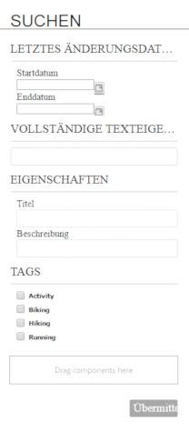
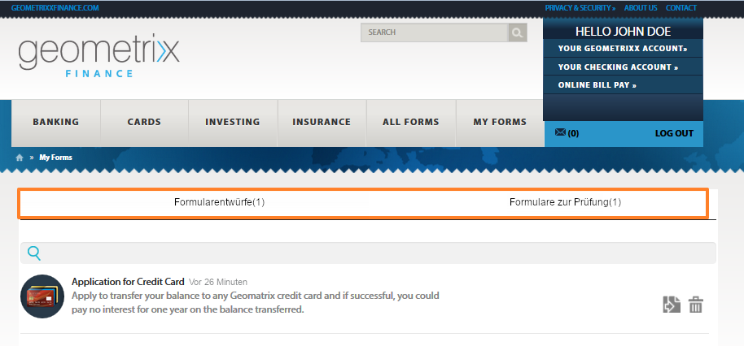
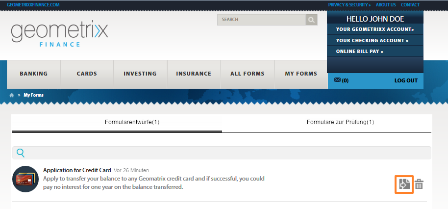

# Öffnen und Ausfüllen veröffentlichter Formulare{#accessing-and-filling-published-forms}

In einer formularzentrierten Bereitstellung sind die Entwicklung von Formularen und die Entwicklung von Portalen zwei verschiedene Aktivitäten. Während Formularentwickler Formulare in einem Repository erstellen und speichern, erstellen Webentwickler eine Webanwendung, um Formulare aufzulisten und gesendete Formulare zu verarbeiten. Formulare werden dann in die Webstufe kopiert, da keine Kommunikation zwischen dem Formular-Repository und der Webanwendung besteht.

Dies führt häufig zu Problemen bei der Verwaltung der Einrichtung sowie zu Produktionsverzögerungen. Wenn beispielsweise eine neuere Version eines Formulars im Repository verfügbar ist, ersetzt der Formularentwickler das Formular auf der Webstufe, ändert die Webanwendung und stellt das Formular erneut auf der öffentlichen Site bereit. Die erneute Bereitstellung der Webanwendung kann einen Serverausfall verursachen. Da der Serverausfall eine geplante Aktivität ist, können die Änderungen nicht sofort an die öffentliche Site gesendet werden.

Forms Portal reduziert den Verwaltungsaufwand und Produktionsverzögerungen. Es bietet Webentwicklern Komponenten zum Erstellen und Anpassen von Formularportalen auf mit Adobe Experience Manager (AEM) erstellten Websites. 

Weitere Informationen zu Forms Portal und seinen Funktionen finden Sie unter [Einführung in das Veröffentlichen von Formularen in einem Portal](/help/forms/using/introduction-publishing-forms.md).

## Erste Schritte mit Forms Portal {#getting-started-with-forms-portal}

Navigieren Sie zur veröffentlichten Forms Portal-Seite. Weitere Informationen zum Erstellen einer Forms Portal-Seite finden Sie unter [Erstellen einer Forms Portal-Seite](../../forms/using/creating-form-portal-page.md).

Die Komponente „Search &amp; Lister“ von Forms Portal zeigt die in der Veröffentlichungsinstanz des AEM-Servers verfügbaren Formulare. Diese Liste enthält alle Formulare oder die im Filter angegebenen Formulare zum Zeitpunkt der Bearbeitung der Forms Portal-Seite. Eine Forms Portal-Seite ist ähnlich der in der folgenden Abbildung gezeigten:

Beispiel für die Forms Portal-Seite

### Search &amp; Lister {#search-and-lister}

Die Komponente „Search &amp; Lister“ ermöglicht das Hinzufügen der folgenden Funktion zu Ihrem Forms Portal:

* Auflisten von Formularen in der Bereich-, Karten- oder Rasteransicht, die direkt verfügbar sind. Es werden auch benutzerdefinierte templatesList-Formulare aus bestimmten Ordnern in Forms Manager unterstützt.
* Geben Sie an, wie Formulare wiedergegeben werden: HTML5, PDF oder beides.
* Geben Sie an, wie PDF- und XFA-Formulare wiedergegeben werden: HTML5, PDF oder beides. Nicht-XFA-Formulare wie HTML5.
* Aktivieren Sie die Suche nach Formularen anhand von Kriterien wie zum Beispiel Formulareigenschaften, Metadaten und Tags.
* Senden von Formulardaten an ein Servlet.
* Verwenden Sie benutzerdefinierte Style Sheets (CSS), um das Erscheinungsbild des Portals anzupassen.
* Erstellen von Links zu Formularen.

Sie können mithilfe der folgenden Optionen auf der Forms Portal-Seite nach Formularen suchen:

* Volltextsuche
* Erweiterte Suche

Mit der Volltextsuche können Sie anhand der angegebenen Schlüsselwörter Formulare suchen und auflisten.

Dialogfeld für die erweiterte Suche

Die erweiterte Suche ermöglicht das Suchen nach Formularen anhand der festgelegten Formulareigenschaften. Sie bietet genauere Ergebnisse als die Volltextsuche. Die erweiterte Suche umfasst die Suche auf Basis von Tags, Eigenschaften (wie Autor, Beschreibung und Titel), Änderungsdatum und Volltext.

Lister zeigt Formulare anhand der Suchparameter. Jedes Formular im Suchergebnis wird mit einem Symbol angezeigt, das mit einem Hyperlink zum dazugehörigen Formular versehen ist. Klicken Sie auf das Symbol, um das Formular zu öffnen und damit zu arbeiten.

### Ausfüllen eines Formulars {#filling-a-form}

Beispiel für ein adaptives Formular

Der Zugriff auf die Formulare ist über den Link möglich, der in der Komponente „Search &amp; Lister“ der Seite neben dem Formular zur Verfügung steht.

Jedes Formular enthält Hilfeinformationen, mit denen Benutzer das Formular ausfüllen können.

#### Formular und übermittelte Formulare  {#drafts-and-submission}

Benutzer haben die Möglichkeit, den Entwurf eines Formulars zu speichern, indem sie auf die Schaltfläche „Speichern“ klicken. Dadurch können sie über einen längeren Zeitraum an einem Formular arbeiten, bevor sie es übermitteln.

Die im Formular eingetragenen Daten (einschließlich Anlagen) werden als Entwurf auf dem Server gespeichert. Der Entwurf eines Formulars kann beliebig oft gespeichert werden. Das gespeicherte Formular wird auf der Registerkarte „Formular“ der Komponente „Drafts and Submissions“ der Seite angezeigt.

Nach dem Ausfüllen des Formulars versenden Benutzer die Formulare, indem sie auf dem Formular auf die Schaltfläche „Übermitteln“·klicken. Die übermittelten Formulare werden auf der Registerkarte „Übermittelte Formulare“ der Komponente „Drafts and Submissions“ der Seite angezeigt.

>[!NOTE]
>
>Gesendete Formulare werden auf der Registerkarte &quot;Gesendete Forms&quot;nur angezeigt, wenn die Sendeaktion für das adaptive Formular als Forms Portal-Sendeaktion konfiguriert ist. Weitere Informationen zu Sendeaktionen finden Sie unter [Konfigurieren der Sendeaktion](../../forms/using/configuring-submit-actions.md).

Komponente „Drafts and Submissions“

## Erstellen ein neues Formular mit den gesendeten Formulardaten {#start-a-new-form-using-submitted-form-data}

Es gibt bestimmte Formulare, die Sie relativ häufig ausfüllen und senden müssen. Beispielsweise wird das Formular zur Steuererklärung jedes Jahr gesendet. Dabei ändern sich zwar einige Angaben von Jahr zu Jahr, andere wie zur Person oder zur Familie jedoch nicht. Trotzdem müssen Sie das Formular jedes Mal von Grund auf neu ausfüllen.

AEM Forms trägt zu einem optimierten Benutzererlebnis beim Ausfüllen von Formularen bei und reduziert dafür benötigte Zeit erheblich. Endbenutzer können für ein neues Formular die Daten von einem früher gesendeten Formular verwenden. Diese Funktion ist integriert in der [Komponente „Drafts and Submissions“](../../forms/using/draft-submission-component.md). Wenn Sie die Komponente „Drafts and Submissions“ zu Ihrer Forms Portal-Seite hinzufügen und sie veröffentlichen, finden Endbenutzer auf der Registerkarte „Gesendete Formulare und Entwurfsformulare“ die Option, ein neues Formular mit den Daten eines zuvor gesendeten Formulars zu beginnen. Auf der folgenden Abbildung ist diese Option hervorgehoben.

Wenn Sie auf die Schaltfläche klicken, um ein neues Formular zu starten, wird ein neues Formular mit Daten aus dem entsprechenden gesendeten Formular gestartet. Sie können jetzt die Informationen überprüfen, ggf. aktualisieren und das Formular senden.
