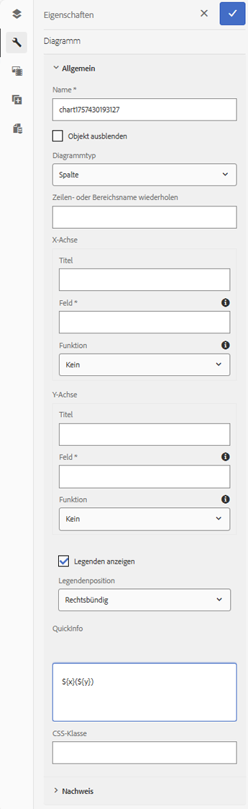
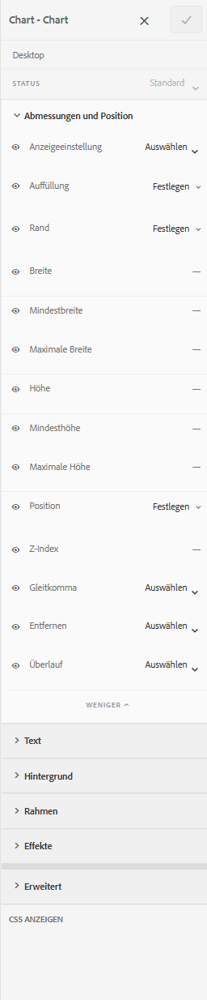
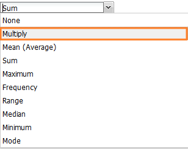
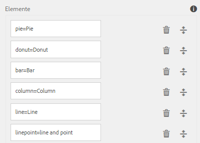
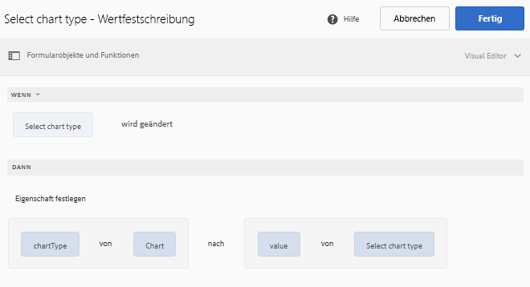
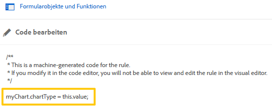

# Diagramme für adaptive Formulare {#af-charts}


Ein Diagramm oder Graph ist eine visuelle Darstellung von Daten. Dadurch können Sie große Mengen an Informationen zu einem einfach zu verständlichen und visuellen Format zusammenfassen, sodass Sie komplexe Daten besser visualisieren, interpretieren und analysieren können.
Das AEM Forms Add-On-Paket bietet eine vordefinierte Diagrammkomponente. Sie können in Ihren adaptiven Formularen und Dokumenten zweidimensionale Daten in wiederholbaren Bereichen und Tabellen visuell darstellen. Mit der Diagrammkomponente können Sie die folgenden Arten von Diagrammen hinzufügen und konfigurieren:

1. Kreisdiagramm
1. Spalte
1. Donut
1. Balken
1. Linie
1. Linie und Punkt
1. Punkt
1. Bereich

Die Diagrammkomponente unterstützt und bietet integrierte statistische Funktionen - Summe, Mittel, Maximum, Minimum, Modus, Median, Bereich und Häufigkeit - zum Berechnen und Zeichnen von Werten in einem Diagramm. Zusätzlich zu den standardmäßig verfügbaren Funktionen können Sie eigene benutzerdefinierte Funktionen schreiben und für die Verwendung in Diagrammen verfügbar machen.

Im Folgenden wird beschrieben, wie Sie die Diagrammkomponente hinzufügen und konfigurieren:

## Diagramm hinzufügen {#add-chart}

Die Diagrammkomponente ist standardmäßig in AEM Seitenleiste verfügbar. Sie können die Diagrammkomponente aus AEM Seitenleiste in das adaptive Formular oder Dokument im Bearbeitungsmodus ziehen. Wenn Sie die Komponente ablegen, wird ein Platzhalter für ein Diagramm erstellt.

## Diagramm konfigurieren {#configure-chart}

>[!NOTE]
> 
> Stellen Sie vor dem Konfigurieren des Diagramms sicher, dass das Bedienfeld oder die Tabellenzeile, für die Sie das Diagramm konfigurieren, auf wiederholbar eingestellt ist. Sie können Mindest- und Höchstzahlen für wiederholbare Bedienfelder oder Tabellenzeilen im Dialogfeld &quot;Komponente bearbeiten&quot;auf der Registerkarte &quot;Wiederholungseinstellungen&quot;angeben.

Klicken Sie zum Konfigurieren des Diagramms mit der rechten Maustaste auf die Diagrammkomponente und klicken Sie auf Bearbeiten , um das Dialogfeld Diagramm bearbeiten zu öffnen. Das Dialogfeld enthält die Registerkarten Titel und Text, Konfiguration, Erweiterte Optionen und Formatierung , mit denen Sie das Diagramm konfigurieren können.

### Einfach {#basic}

Auf der Registerkarte Allgemein können Sie die folgenden Eigenschaften konfigurieren:



* **Elementname**: Eine Kennung für das Diagrammelement in der JCR-Inhaltsstruktur. Sie ist nicht im Diagramm sichtbar, hilft aber beim Verweis auf das Element aus anderen Komponenten, Skripten und SOM-Ausdrücken.
* **Diagrammtyp**: Gibt den Typ des Diagramms an, das Sie generieren möchten. Die verfügbaren Optionen sind Tortendiagramm, Ringdiagramm, Balken, Spalten, Linien, Linien, Linien und Punkte, Punkt und Bereich. Im Beispiel ist der Diagrammtyp Spalte.
* **Wiederholender Zeilenname für Datenquelle**: Gibt den Elementnamen der Tabellenzeile oder des wiederholbaren Bereichs an, aus dem die Daten bezogen werden. Im Beispiel ist statementDetails der Elementname der wiederholbaren Zeile in der Tabelle mit den Anweisungsdetails.
* **X-Achse > Titel**: Gibt den Titel für die X-Achse an. In diesem Beispiel lautet der Titel für die X-Achse Kategorie.
* **X-Achse > Feld**: Gibt den Elementnamen des auf der X-Achse abzubildenden Felds (oder einer Zelle in einer Tabelle) an. Im Beispiel werden Kategorien auf der X-Achse konfiguriert. Der Elementname für die Tabellenzelle in der Spalte Kategorie der Beispieltabelle ist Kategorie.
* **X-Achse > Funktion verwenden**: Gibt die statistische Funktion an, die für die Berechnung der Werte auf der X-Achse verwendet werden soll. Im Beispiel ist die ausgewählte Option Ohne. Weitere Informationen zu Funktionen finden Sie unter Funktionen im Diagramm verwenden.
* **Y-Achse > Titel**: Gibt den Titel für die Y-Achse an. In diesem Beispiel lautet der Titel für die Y-Achse &quot;Kosten&quot;.
* **Y-Achse > Feld**: Gibt den Elementnamen des auf der Y-Achse abzubildenden Felds (oder der Zelle in einer Tabelle) an. Konfigurieren Sie im Beispiel den Betrag auf der Y-Achse. Der Elementname für die Tabellenzelle in der Spalte &quot;Betrag&quot;der Beispieltabelle ist Betrag.
* **Y-Achse > Funktion verwenden**: Gibt die statistische Funktion an, die für die Berechnung der Werte auf der Y-Achse verwendet werden soll. Im Beispiel wird der in jeder Kategorie ausgegebene Betrag hinzugefügt und der berechnete Wert wird auf der Y-Achse dargestellt. Wählen Sie daher aus der Dropdownliste Funktion verwenden die Option Summe aus. Weitere Informationen zu Funktionen finden Sie unter Funktionen im Diagramm verwenden.
* **Legendenposition**: Gibt die Position der Legende in Bezug auf das Diagramm an. Die verfügbaren Optionen sind rechts, links, oben und unten.
* **Legende anzeigen**: Zeigt eine Legende für das Diagramm an, wenn diese aktiviert ist.
* **QuickInfo**: Gibt das Format an, in dem die QuickInfo beim Bewegen der Maus über einen Datenpunkt in der Grafik angezeigt wird. Der Standardwert ist **\${x}(\${y})**. Je nach Diagrammtyp können die Variablen beim Bewegen der Maus auf einen Punkt, ein Balken oder einen Ausschnitt im Diagramm verwendet werden **\${x}** und **\${y}** dynamisch durch die entsprechenden Werte auf der X- und Y-Achse ersetzt und in der QuickInfo angezeigt werden. Wie im folgenden Beispiel gezeigt, wird die QuickInfo wie folgt angezeigt: **Einzelhandelsgeschäfte(5870)** wenn Sie mit der Maus auf die Spalte Einzelhandelsgeschäfte zeigen. Lassen Sie das Feld QuickInfo leer, um die QuickInfo zu deaktivieren. Diese Option gilt nicht für Linien- und Flächendiagramme.
* **Diagrammspezifische Konfigurationen**: Zusätzlich zu den allgemeinen Konfigurationen ist die folgende Diagrammkonfiguration verfügbar:
* **Innerer Radius**: Verfügbar für Ringdiagramme, um den Radius (in Pixel) des inneren Kreises im Diagramm anzugeben.
* **Linienfarbe**: Verfügbar für Linien-, Linien- und Punkt- sowie Flächendiagramme, um den hexadezimalen Farbwert für die Linie im Diagramm anzugeben.
* **Punktfarbe**: Verfügbar für Punkt- und Linien- und Punktdiagramme, um den hexadezimalen Farbwert für die Punkte im Diagramm anzugeben.
* **Bereichsfarbe**: Verfügbar für Bereichsdiagramme, um den hexadezimalen Farbwert für den Bereich unter der Linie im Diagramm anzugeben.
* **CSS-Klasse**: Geben Sie den Namen einer CSS-Klasse im CSS-Klassenfeld an, um benutzerdefinierte Stile auf das Diagramm anzuwenden.

### Konfiguration {#configuration}

Im Tab Allgemein definieren Sie den Diagrammtyp, das Quellfeld oder die Tabellenzeile, die Daten enthalten, die Werte, die auf der X- und Y-Achse des Diagramms dargestellt werden sollen, und optional die statistische Funktion, um die Werte für die grafische Darstellung im Diagramm zu berechnen.

Anhand eines Beispiels einer wiederholbaren Tabelle in einem Kreditkartenauszug werden die Informationen auf dieser Registerkarte im Einzelnen erläutert. Angenommen, Sie möchten ein Diagramm erstellen, in dem die Gesamtausgaben in verschiedenen Kategorien im Abschnitt &quot;Kontodetails&quot;eines Kreditkartenauszugs dargestellt und korreliert werden, wie unten dargestellt.

Um dies zu erreichen, müssen Sie Kategorien auf der X-Achse und auf der Y-Achse zeichnen, die Gesamtausgaben in jeder Kategorie.


Der in diesem Beispiel verwendete Kreditkartenauszug ist ein adaptives Dokument und der Abschnitt mit den Anweisungsdetails ist eine Tabelle, die im Authoring-Modus wie folgt aussieht.


Betrachten wir die folgenden Anforderungen und Bedingungen zum Generieren der Grafik:

* Das Diagramm zeigt die Gesamtausgaben in jeder Kategorie in der Tabelle mit den Auszugsdetails an.
* Der Diagrammtyp ist Spalte , Sie können jedoch auch einen beliebigen anderen Diagrammtyp auswählen.
* Die Tabellenzeile in der Tabelle mit den Anweisungsdetails ist wiederholbar. Sie können sie im Feld Wiederholungseinstellungen der Tabellenzeileneigenschaften konfigurieren.
* Der Elementname für die Zeile ist statementDetails. Sie können sie in den Eigenschaften der Tabellenzeile konfigurieren.
* Der Elementname für die Tabellenzelle in der Spalte Kategorie ist Kategorie. Sie können sie inline angeben. Wählen Sie die Zelle aus und tippen Sie auf die Schaltfläche Bearbeiten .
* Der Elementname für die Tabellenzelle in der Spalte &quot;Betrag&quot;ist Betrag. Außerdem handelt es sich bei der Tabellenzelle in der Spalte &quot;Betrag&quot;um ein numerisches Feld.
* Mit der angegebenen Konfiguration wird das Säulendiagramm im Beispiel wie folgt angezeigt. Jede Farbe stellt eine Kategorie dar und einzelne Zeileneinträge oder Beträge für eine Kategorie werden in der Grafik addiert.

  

Die Legende und die QuickInfo werden wie folgt angezeigt.


### Stile {#styling}

Im Stilmodus können Sie die Breite (in Prozent der Gesamtbreite, die im Formular oder Dokument verfügbar ist) und die Höhe (in Pixel) für das Diagramm konfigurieren. Weitere Optionen sind Text, Hintergrund, Rahmen, Effekte und CSS-Überschreibungen.

So wechseln Sie in der Seitensymbolleiste zum Formatierungsmodus: **Tippen> > Stil**.



## Verwenden von Funktionen im Diagrammen {#use-functions}

Sie können ein Diagramm so konfigurieren, dass es mithilfe statistischer Funktionen Werte aus den Quelldaten für die Darstellung im Diagramm berechnet. Während die Diagrammkomponente einige integrierte Funktionen enthält, können Sie eigene Funktionen schreiben und sie für die Verwendung in der Diagrammkonfiguration verfügbar machen.

>[!NOTE]
>
> Sie können Funktionen verwenden, um Werte für die X- oder Y-Achse in einem Diagramm zu berechnen.

### Standardfunktionen {#default-functions}

Die folgenden Funktionen sind standardmäßig in der Diagrammkomponente verfügbar:

* **Mittel (Durchschnitt)**: Gibt den Durchschnittswert der Werte auf der X- oder Y-Achse für einen bestimmten Wert auf der anderen Achse an.
* **Summe**: Gibt die Summe aller Werte auf der X- oder Y-Achse für einen bestimmten Wert auf der anderen Achse an.
* **Maximum**: Gibt das Maximum der Werte auf der X- oder Y-Achse für einen bestimmten Wert auf der anderen Achse an.
* **Häufigkeit**: Gibt die Anzahl der Werte auf der X- oder Y-Achse für einen bestimmten Wert auf der anderen Achse an.
* **Bereich**: Gibt die Differenz zwischen dem Maximum und Minimum der Werte auf der X- oder Y-Achse für einen bestimmten Wert auf der anderen Achse an.
* **Median**: Gibt den Wert zurück, der auf der X- oder Y-Achse für einen bestimmten Wert auf der anderen Achse die höheren und niedrigeren Werte in der Hälfte trennt.
* **Minimum**: Gibt das Minimum der Werte auf der X- oder Y-Achse für einen bestimmten Wert auf der anderen Achse an.
* **Modus**: Gibt den Wert mit den meisten Vorkommen auf der X- oder Y-Achse für einen bestimmten Wert auf der anderen Achse zurück.

### Benutzerdefinierte Funktionen {#custom-functions}

Neben der Verwendung der Standardfunktionen in Diagrammen können Sie auch benutzerdefinierte Funktionen in JavaScript schreiben und in der Funktionsliste der Diagrammkomponente verfügbar machen.

Eine Funktion akzeptiert ein Array oder Werte sowie einen Kategorienamen als Eingaben und gibt einen Wert zurück. Beispiel:

```
Multiply(valueArray, category) {
    var val = 1;
    _.each(valueArray, function(value) {
        val = val * value;
    });
    return val;
}
```

Nachdem Sie eine benutzerdefinierte Funktion geschrieben haben, führen Sie die folgenden Schritte aus, um sie für die Verwendung in der Diagrammkonfiguration verfügbar zu machen:

1. Fügen Sie die benutzerdefinierte Funktion in der Client-Bibliothek hinzu, die mit dem adaptiven Formular oder Dokument verknüpft ist.
1. Erstellen Sie unter CRXDE Lite einen nt:unstructured -Knoten im Anwendungsordner mit den folgenden Eigenschaften:
   * Setzen Sie guideComponentType auf fd/af/Reducer. (mandatory)
   * Setzen Sie den Wert auf einen vollständig qualifizierten Namen der benutzerdefinierten JavaScript-Funktion. (mandatory)
   * Setzen Sie jcr:description auf einen aussagekräftigen Namen. Sie wird im **Funktion verwenden** Dropdown-Liste. Beispiel:**Multiplizieren**. 
   * Setzen Sie qtip auf eine kurze Beschreibung der Funktion. Es wird als QuickInfo angezeigt, wenn Sie den Mauszeiger über den Funktionsnamen in der Dropdown-Liste Funktion verwenden bewegen.
   * Klicken Sie auf **Alles Speichern**, um die Konfiguration zu speichern.
   * Die Funktion ist jetzt für die Verwendung im Diagramm verfügbar.




## Diagramm zur automatischen Aktualisierung {#auto-refresh-chart}

Ein Diagramm wird automatisch aktualisiert, wenn Benutzer einen der folgenden Schritte ausführen:
* Fügen Sie eine Instanz des Datenquellenbereichs oder der Tabellenzeile hinzu oder entfernen Sie sie.
* Ändern Sie alle Werte, die auf der X- oder Y-Achse im Datenquellenbereich oder in der Tabellenzeile dargestellt werden.
* Ändern Sie den Diagrammtyp.

## Verwenden des Diagrammtyps in adaptiven Formularregeln {#chart-in-rules}

Die chartType -Eigenschaft gibt den Diagrammtyp an. Die möglichen Werte sind Torten, Donut, Balken, Linie, Linie, Punkt, Punkt und Bereich. Dies ist eine skriptfähige Eigenschaft, d. h. Sie können sie in [adaptive Formularregeln](/help/forms/using/rule-editor.md) um Diagrammkonfigurationen zu bearbeiten. Verstehen wir es mithilfe eines Beispiels.

Beachten Sie, dass Sie ein Säulendiagramm konfiguriert haben. Sie möchten den Benutzern jedoch auch die Möglichkeit geben, einen anderen Diagrammtyp aus einer Dropdown-Liste auszuwählen und die Grafik neu zu zeichnen. Sie können dies mit der Eigenschaft chartType in einer Regel wie folgt erreichen:

1. Ziehen Sie eine Dropdown-Listenkomponente aus AEM Seitenleiste in das adaptive Formular.
1. Wählen Sie die Komponente aus und tippen Sie auf .
1. Geben Sie einen Titel für die Dropdownliste an. Wählen Sie beispielsweise Grafiktyp aus.
1. Fügen Sie unterstützte Diagrammtypen im Abschnitt Elemente hinzu, um die Dropdownliste zu füllen. Klicken Sie auf **Fertig**.
   

1. Wählen Sie die Dropdownkomponente aus und tippen Sie auf . Erstellen Sie im Regeleditor eine Regel im visuellen Regeleditor, wie unten dargestellt.
   

   In diesem Beispiel lautet der Elementname der Diagrammkomponente **myChart**.

   Alternativ können Sie die folgenden Regeln im Code-Editor schreiben.

   

   Weitere Informationen zum Erstellen von Regeln finden Sie unter [Regeleditor](/help/forms/using/rule-editor.md)

1. Klicken Sie auf Fertig , um die Regel zu speichern.

Jetzt können Sie einen Diagrammtyp aus der Dropdownliste auswählen und auf Aktualisieren klicken, um das Diagramm neu zu zeichnen.


