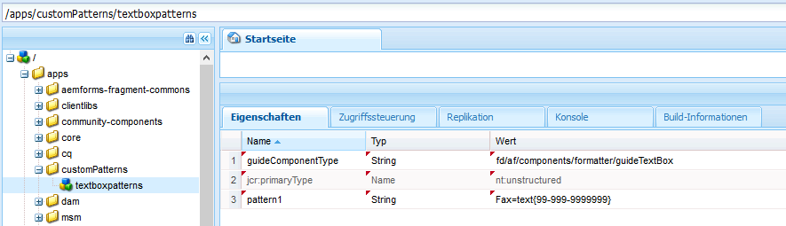

# Adaptive Formularausdrücke{#adaptive-form-expressions}

Adaptive Formulare bieten ein optimiertes und vereinfachtes Ausfüllen von Formularen für Endbenutzer mit Kenntnissen in der dynamischen Skripterstellung. Dadurch können Sie Ausdrücke schreiben, um verschiedene Verhaltensweisen hinzuzufügen, z. B. dynamische Ein-/Ausblendfelder und Bedienfelder. Außerdem können Sie damit berechnete Felder hinzufügen, Felder schreibgeschützt machen, Überprüfungslogik hinzufügen und vieles mehr. Das dynamische Verhalten basiert auf der Benutzereingabe oder vorausgefüllten Daten.

JavaScript ist die Ausdruckssprache für adaptive Formulare. Alle Ausdrücke sind gültige JavaScript-Ausdrücke und verwenden Skriptmodell-APIs für adaptive Formulare. Diese Ausdrücke geben Werte bestimmter Typen zurück. Eine vollständige Liste der Klassen, Ereignisse, Objekte und öffentlichen APIs für adaptive Formulare finden Sie unter [JavaScript Library API-Referenz für adaptive Formulare](https://helpx.adobe.com/de/experience-manager/6-5/forms/javascript-api/index.html).

## Empfohlene Vorgehensweisen zum Schreiben von Ausdrücken {#best-practices-for-writing-expressions}

* Beim Schreiben von Ausdrücken können Sie für den Zugriff auf Felder und Fenster den Feld- oder den Fensternamen verwenden. Für den Zugriff auf den Wert eines Felds können Sie die Werteigenschaft verwenden. Beispiel: `field1.value`
* Verwenden Sie im gesamten Formular eindeutige Namen für Felder und Fenster. Auf diese Weise können Sie mögliche Konflikte mit beim Schreiben von Ausdrücken verwendeten Feldnamen vermeiden.
* Beim Schreiben von mehrzeiligen Ausdrücken, müssen Sie ein Semikolon verwenden, um eine Anweisung zu beenden. 

## Empfohlene Vorgehensweisen für Ausdrücke in Verbindung mit Wiederholungsfeldern  {#best-practices-for-expressions-involving-repeating-panel}

Wiederholungsfelder sind Instanzen eines Fensters, das mithilfe einer Skripterstellungs-API oder vorausgefüllten Daten dynamisch hinzugefügt oder entfernt wird. Ausführliche Informationen zum Verwenden von Wiederholungsfeldern finden Sie unter [Erstellen von Formularen mit Wiederholungsfeldern](/help/forms/using/creating-forms-repeatable-sections.md).

* Öffnen Sie zum Erstellen eines Wiederholungsfelds im Fensterdialogfeld die Einstellungen und legen Sie den Wert des Felds für die maximale Anzahl auf einen Wert größer als 1 fest.
* Der Wert für die minimale Anzahl der Feldwiederholungseinstellungen kann eins oder höher sein, er darf jedoch nicht über dem Wert für die maximale Anzahl liegen.
* Wenn ein Ausdruck sich auf ein Feld eines Wiederholungsfelds bezieht, werden die Feldnamen im Ausdruck in das nächstgelegene Wiederholungselement aufgelöst.
* Adaptive Formulare bieten einige spezifische Funktionen zum Vereinfachen der Berechnungen für die wiederholbaren Felder wie etwa „sum“, „count“, „min“, „max“, „filter“ und viele mehr. Eine vollständige Liste der Funktionen finden Sie unter [JavaScript Library API-Referenz für adaptive Formulare](https://helpx.adobe.com/aem-forms/6/javascript-api/af.html)
* Es gibt folgende APIs zum Manipulieren von Instanzen von Wiederholungsfeldern:

   * So fügen Sie eine Bedienfeldinstanz hinzu: `panel1.instanceManager.addInstance()`
   * So rufen Sie einen Wiederholungsindex für Bedienfelder ab: `panel1.instanceIndex`
   * So rufen Sie den instanceManager eines Bedienfelds ab: `_panel1 or panel1.instanceManager`
   * So entfernen Sie eine Instanz eines Bedienfelds: `_panel1.removeInstance(panel1.instanceIndex)`

## Ausdruckstypen {#expression-types}

In adaptiven Formularen können Sie Ausdrücke schreiben, um Verhaltensweisen wie dynamische Ein-/Ausblendfelder und Bereiche hinzuzufügen. Sie können auch Ausdrücke schreiben, um berechnete Felder hinzuzufügen, Felder schreibgeschützt zu machen, Überprüfungslogik zu verwenden und vieles mehr. Adaptive Formulare unterstützen folgende Ausdrücke:

* **[Ausdrücke für den Zugriff](#access-expression-enablement-expression)**: Zum Aktivieren/Deaktivieren eines Felds.
* **[Ausdrücke für die Berechnung](#calculate-expression)**: Zum automatischen Berechnen des Werts eines Felds.
* **[Ausdruck für ein Klickereignis](#click-expression)**: Zum Verarbeiten von Aktionen beim Klicken auf eine Schaltfläche.
* **[Initialisierungsskript](#initialization-script):** Durchführen einer Aktion zum Initialisieren eines Felds.
* **[Ausdruck für Optionen](#options-expression)**: Zum dynamischen Ausfüllen einer Dropdown-Liste.
* **[Zusammenfassungsausdruck](#summary)**: Zum dynamischen Berechnen des Titels eines Akkordeons.
* **[Ausdrücke für die Überprüfung](#validate-expression)**: Zum Überprüfen eines Felds.
* **[Skript zum Bestätigen von Werten](#value-commit-script):**  Zum Ändern der Komponenten eines Formulars, nachdem der Wert eines Felds geändert wurde.
* **[Ausdruck für die Sichtbarkeit](#visibility-expression)**: Zum Steuern der Sichtbarkeit eines Felds oder Bereichs.
* **[Ausdruck zum Abschluss von Schritten](#step-completion-expression)**: Um zu vermeiden, dass ein Benutzer zum nächsten Schritt eines Assistenten geht.

### Ausdruck für den Zugriff (Ausdruck für die Aktivierung) {#access-expression-enablement-expression}

Sie können den Ausdruck für den Zugriff zum Aktivieren oder Deaktivieren eines Felds verwenden. Wenn der Ausdruck den Wert eines Felds verwendet, wird der Ausdruck erneut ausgelöst, sobald der Wert des Felds sich ändert.

**Gilt für**: Felder

**Rückgabetyp**: Der Ausdruck gibt einen booleschen Wert zurück, der den Aktivierungsstatus des Felds wiedergibt. **true** bedeutet, dass das Feld aktiviert ist, und **false** bedeutet, dass das Feld deaktiviert ist.

**Beispiel**: Um ein Feld nur zu aktivieren, wenn der Wert von  **field1**  auf  **X** gesetzt ist, lautet der Zugriffsausdruck:  `field1.value == "X"`

### Ausdruck für die Berechnung {#calculate-expression}

Der Ausdruck für die Berechnung wird verwendet, um den Wert eines Felds unter Verwendung eines Ausdrucks automatisch zu berechnen. Normalerweise verwendet ein Ausdruck dieser Art die Werteigenschaften anderer Felder. Beispiel: `field2.value + field3.value`. Sobald sich der Wert für `field2` oder `field3` ändert, wird der Ausdruck erneut ausgelöst und der Wert neu berechnet.

**Gilt für**: Felder

**Rückgabetyp**: Der Ausdruck gibt einen Wert zurück, der mit dem Feld kompatibel ist, in dem das Ergebnis des Ausdrucks angezeigt wird (z. B. dezimal).

**Beispiel**: Der Berechnungsausdruck, der die Summe zweier Felder in  **field1**  anzeigt, lautet: 
`field2.value + field3.value`

### Ausdruck für ein Klickereignis {#click-expression}

Der Ausdruck für ein Klickereignis verarbeitet die Aktionen, die beim Klicken auf eine Schaltfläche durchgeführt werden. GuideBridge ist sofort einsetzbar und bietet APIs zum Ausführen verschiedener Funktionen wie dem Senden oder Überprüfen, die in Verbindung mit dem Ausdruck für ein Klickereignis Anwendung finden. Eine vollständige Liste der APIs finden Sie in den [GuideBridge-APIs](https://helpx.adobe.com/aem-forms/6/javascript-api/GuideBridge.html).

**Gilt für**: Felder mit Schaltfläche

**Rückgabetyp:** Der Ausdruck für ein Klickereignis gibt keinen Wert zurück. Wenn ein Ausdruck einen Wert zurückgibt, wird dieser Wert ignoriert.

**Beispiel**: Zum Ausfüllen eines Textfelds  **textbox1**  beim Klicken auf eine Schaltfläche mit dem Wert  **AEM Forms** lautet der Ausdruck für das Klicken der Schaltfläche  `textbox1.value="AEM Forms"`

### Initialisierungsskript {#initialization-script}

Das Initialisierungsskript wird ausgelöst, wenn ein adaptives Formular initialisiert wird. Je nach Szenario verhält sich das Initialisierungsscript wie folgt:

* Wenn ein adaptives Formular ohne vorausgefüllte Daten wiedergegeben wird, wird das Initialisierungsskript nach der Initialisierung des Formulars ausgeführt.
* Wenn ein adaptives Formular mit vorausgefüllten Daten wiedergegeben wird, wird das Skript nach Abschluss des Vorab-Ausfüllvorgangs ausgeführt.
* Wenn eine erneute serverseitige Überprüfung eines adaptiven Formulars ausgelöst wird, wird das Initialisierungsskript ausgeführt.

**Gilt für:** Felder und Fenster

**Rückgabetyp:** Der Ausdruck für das Initialisierungsskript gibt keinen Wert zurück. Wenn ein Ausdruck einen Wert zurückgibt, wird dieser Wert ignoriert.

**Beispiel:** Um in einem Szenario mit vorausgefüllten Daten Felder mit dem Standardwert auszufüllen,  `'Adaptive Forms'` wenn ihr Wert als null gespeichert wird, lautet der Initialisierungsscript-Ausdruck: 
`if(this.value==null) this.value='Adaptive Forms';`

### Ausdruck für Optionen {#options-expression}

Der Ausdruck für Optionen wird zum dynamischen Ausfüllen von Optionen in einem Dropdown-Listenfeld verwendet.

**Gilt für**: Dropdown-Listenfelder

**Rückgabetyp**: Der Ausdruck für Optionen gibt ein Array von Zeichenfolgenwerten zurück. Jeder Wert kann aus einer einfachen Zeichenfolge wie etwa **Male** oder aus einer Zeichenfolge in Form eines Schlüsselwertpaars wie etwa **1=Male** bestehen.

**Beispiel**: Das Ausfüllen eines Felds mit einem auf einem anderen Wert basierenden Wert ist mit einem einfachen Ausdruck für Optionen möglich. Beispiel: Um ein Feld **Anzahl Kinder** basierend auf dem Wert **Familienstand** eines anderen Felds auszufüllen, lautet der Ausdruck wie folgt:

**`marital_status.value == "married" ? ["1=One", "2=two"] : ["0=Zero"]`.**

Sobald sich der Wert des Felds **marital_status** ändert, wird der Ausdruck erneut ausgelöst. Sie können das Dropdown-Menü auch von einem REST-Dienst aus auffüllen. Ausführliche Informationen finden Sie unter [Dynamisches Auffüllen von Dropdown-Listen](../../forms/using/dynamically-populate-dropdowns.md).

### Zusammenfassungsausdruck {#summary}

Der Zusammenfassungsausdruck berechnet dynamisch den Titel eines untergeordneten Bedienfelds eines Akkordeon-Layout-Bedienfelds. Sie können den Zusammenfassungsausdruck in einer Regel festlegen, die ein Formularfeld oder eine benutzerdefinierte Logik verwendet, um den Titel zu bewerten. Der Ausdruck wird ausgeführt, wenn das Formular initialisiert wird. Wenn Sie ein Formular im Voraus ausfüllen, wird der Ausdruck ausgeführt, nachdem die Daten vorausgefüllt wurden oder sich der Wert der abhängigen Felder ändert, die im Ausdruck verwendet werden.

Der Zusammenfassungsausdruck wird in der Regel für das Wiederholen von untergeordneten Elementen eines Akkordeon-Layout-Bedienfelds verwendet, um einen aussagekräftigen Titel für jedes untergeordnete Bedienfeld zur Verfügung zu stellen.

**Gilt für:** Bedienfelder, die direkt untergeordnete Elemente eines Bedienfelds sind, dessen Layout als Akkordeon konfiguriert ist.

**Rückgabetyp:** Der Ausdruck gibt eine Zeichenfolge zurück, die zum Titel des Accordions wird.

**Beispiel:** &quot;Kontonummer : &quot;+ textbox1.value

### Ausdruck für die Überprüfung {#validate-expression}

Der Ausdruck für die Überprüfung wird zur Überprüfung der Felder unter Verwendung des entsprechenden Ausdrucks verwendet. Normalerweise verwenden solche Ausdrücke reguläre Ausdrücke zusammen mit dem Feldwert, um ein Feld zu validieren. Der Ausdruck wird bei jeder Änderung am Wert des Feldes erneut ausgelöst und der Überprüfungsstatus des Felds wird erneut berechnet.

**Gilt für**: Felder

**Rückgabetyp**: Der Ausdruck gibt einen booleschen Wert zurück, der den Überprüfungsstatus des Felds darstellt. Der Wert **false** bedeutet, dass das Feld ungültig ist, und **true** bedeutet, dass das Feld gültig ist.
**Beispiel**: Für ein Feld, das eine britische Postleitzahl enthalten soll, lautet der Ausdruck für die Überprüfung wie folgt:

(**this.value** &amp;&amp; `this.value.match(/^(GIR 0AA|[A-Z]{1,2}\d[A-Z0-9]? ?[0-9][A-Z]{2}\s*)$/i) == null) ? false : true`

Wenn im vorstehenden Beispiel der nicht leere Wert nicht mit dem Muster übereinstimmt, gibt der Ausdruck **false** zurück und zeigt damit an, dass das Feld nicht gültig ist.

>[!NOTE]
>
>Wenn Sie einen Überprüfungsausdruck für ein nicht obligatorisches oder ein obligatorisches Feld eingeben, wird der Ausdruck unabhängig vom Sichtbarkeitsstatus des Feldes bewertet. Um die Überprüfung der ausgeblendeten Felder zu beenden, legen Sie die Eigenschaft „validationsDisabled “ in der Initialisierung oder das Wertfestschreibungsskript auf „true“ fest. Beispiel: `this.validationsDisabled=true`

### Skript zum Bestätigen von Werten {#value-commit-script}

Das Skript zum Bestätigen von Werten wird ausgelöst, wenn

* ein Benutzer den Wert eines Felds der Benutzeroberfläche ändert.
* sich der Wert eines Felds programmgesteuert ändert, aufgrund einer Änderung in einem anderen Feld.

**Gilt für:** Felder

**Rückgabetyp:** Der Ausdruck für das Skript zum Bestätigen von Werten gibt keinen Wert zurück. Wenn ein Ausdruck einen Wert zurückgibt, wird dieser Wert ignoriert.

**Beispiel:**Der Ausdruck zum Konvertieren der Schreibung im Feld eingegebener alphabetischer Zeichen in Großschreibung bei Bestätigung lautet wie folgt:
`this.value=this.value.toUpperCase()`

>[!NOTE]
>
>Sie können die Ausführung des Skripts zum Bestätigen von Werten deaktivieren, wenn der Wert eines Felds programmgesteuert geändert wird. Gehen Sie dazu zu https://&#39;[server]:[port]&#39;/system/console/configMgr und ändern Sie **Adaptive Forms-Version für Kompatibilität** in **AEM Forms 6.1**. Dann wird das Skript zum Bestätigen von Werten nur ausgeführt, wenn der Benutzer den Wert des Felds in der Benutzeroberfläche ändert.

### Ausdruck für die Sichtbarkeit  {#visibility-expression}

Der Ausdruck für die Sichtbarkeit wird verwendet, um die Sichtbarkeit eines Felds/Fensters zu steuern. Normalerweise verwendet der Ausdruck für die Sichtbarkeit die Werteigenschaft eines Felds und wird erneut ausgelöst, sobald sich dieser Wert ändert.

**Gilt für**: Felder und Fenster

**Rückgabetyp**: Der Ausdruck gibt einen booleschen Wert zurück, der den Sichtbarkeitsstatus des Felds/Fensters wiedergibt. **false** bedeutet, dass das Feld oder das Fenster nicht sichtbar ist, und „true“ bedeutet, dass das Feld oder Fenster sichtbar ist.

**Beispiel**: Für ein Fenster, das nur sichtbar wird, wenn der Wert von **** auf **Male** festgelegt ist, lautet der Ausdruck für die Sichtbarkeit wie folgt: `field1.value == "Male"`field1.

### Ausdruck zum Abschluss von Schritten {#step-completion-expression}

Der Ausdruck zum Abschluss von Schritten dient der Vermeidung, dass ein Benutzer in einem Assistenten-Layout zum nächsten Schritt geht. Diese Ausdrücke werden verwendet, wenn Fenster ein Assistenten-Layout haben (ein Formular mit mehreren Schritten, bei dem immer nur ein Schritt angezeigt wird). Der Benutzer kann nur dann zum nächsten Schritt, Fenster oder Unterabschnitt wechseln, wenn alle erforderlichen Werte im aktuellen Abschnitt ausgefüllt und gültig sind.

**Gilt für**: Fenster mit Layout der Elemente im Stil eines Assistenten.

**Rückgabetyp**: Der Ausdruck gibt einen booleschen Wert zurück, der den Gültigkeitsstatus des aktuellen Fensters wiedergibt. **True** bedeutet, dass das aktuelle Fenster gültig ist und der Benutzer zum nächsten Fenster navigieren kann.

**Beispiel**: In einem in mehrere Fenster organisierten Formular wird vor dem Navigieren zum nächsten Fenster das aktuelle Fenster überprüft. In diesen Fällen werden Ausdrücke zum Abschluss von Schritten verwendet. Im Allgemeinen verwenden diese Ausdrücke die Überprüfungs-API GuideBridge. Ein Beispiel für einen Ausdruck zum Abschluss von Schritten ist:
`window.guideBridge.validate([],this.panel.navigationContext.currentItem.somExpression)`

## Überprüfungen in adaptiven Formularen {#validations-in-adaptive-form}

Es gibt mehrere Methoden zum Hinzufügen von Feldüberprüfungen zu einem adaptiven Formular. Wenn einem Feld eine Überprüfung hinzugefügt wird, bedeutet **True**, dass der in das Feld eingegeben Wert gültig ist. **False** bedeutet, dass der Wert ungültig ist. Wenn Sie durch Drücken der Tabulatortaste in ein Feld springen oder das Feld verlassen, wird die Fehlermeldung nicht generiert.

Es gibt folgende Methoden zum Hinzufügen von Überprüfungen zu Feldern:

### Erforderlich {#required}

Damit eine Komponente obligatorisch wird, können Sie im Dialogfeld **Bearbeiten** der Komponente die Option **Titel und Text > Erforderlich** auswählen. Sie können auch die gewünschte **Erforderliche Meldung** (optional) hinzufügen.

### Überprüfungsmuster {#validation-patterns}

Für ein Feld stehen mehrere Überprüfungsmuster für den sofortigen Einsatz zur Verfügung. Suchen Sie zum Auswählen eines Überprüfungsmusters im Dialogfeld **Bearbeiten** der Komponente den Abschnitt **Muster** und wählen Sie **Muster** aus. Sie können im Textfeld **Muster** Ihr eigenes, benutzerdefiniertes Überprüfungsmuster erstellen. Als Überprüfungsstatus wird nur dann **True** zurückgegeben, wenn die ausgefüllten Daten mit dem Überprüfungsmuster übereinstimmen. Andernfalls wird **False** zurückgegeben. Informationen zum Schreiben Ihres eigenen benutzerdefinierten Überprüfungsmusters finden Sie unter [Unterstützung für HTML5-Formulare](/help/forms/using/picture-clause-support.md). 

### Ausdrücke für die Überprüfung {#validation-expressions}

Die Überprüfung eines Felds kann auch mithilfe von Ausdrücken für verschiedene Felder berechnet werden. Diese Ausdrücke werden in das Feld **Gültigkeitsprüfungsskript** der Registerkarte **Skript** des Dialogfelds **Bearbeiten** der Komponente geschrieben. Der Validierungsstatus eines Felds hängt von dem Wert ab, den der Ausdruck zurückgibt. Informationen zum Schreiben solcher Ausdrücke finden Sie unter [Ausdruck für die Überprüfung](../../forms/using/adaptive-form-expressions.md#p-validate-expression-p).

## Zusätzliche Informationen {#additional-information}

### Anzeigeformat „Feld“ verwenden {#using-field-display-format}

Das Anzeigeformat kann zum Anzeigen von Daten in verschiedenen Formaten verwendet werden. Sie können das Anzeigeformat beispielsweise dazu verwenden, eine Telefonnummer mit Bindestrichen anzuzeigen oder eine Postleitzahl oder eine Datumsauswahl zu formatieren. Die Darstellungsmuster können im Abschnitt **Muster** des Dialogfelds „Bearbeiten“ einer Komponente ausgewählt werden. Ähnlich wie bei den oben erwähnten Überprüfungsmustern können Sie benutzerdefinierte Darstellungsmuster schreiben.

### GuideBridge – APIs und Ereignisse  {#guidebridge-apis-and-events}

GuideBridge ist eine Sammlung von APIs, die für die Interaktion mit adaptiven Formularen im Speichermodell eines Browsers verwendet werden können. Eine ausführliche Einführung in die API, die Klassenmethoden, und die bereitgestellten Ereignisse in Guide Bridge finden Sie in der [JavaScript Library API-Referenz für adaptive Formulare](https://helpx.adobe.com/aem-forms/6/javascript-api/).

>[!NOTE]
>
>Es wird empfohlen, die GuideBridge-Ereignis-Listener nicht in Ausdrücken zu verwenden.

#### GuideBridge-Verwendung in verschiedenen Ausdrücken  {#guidebridge-usage-in-various-expressions}

* Um Formularfelder zurückzusetzen, können Sie die API `guideBridge.reset()` auf dem Ausdruck für ein Klickereignis einer Schaltfläche Trigger haben. Ebenso gibt es eine Sende-API, die als Ausdruck für ein Klickereignis aufgerufen werden kann `guideBridge.submit()`**.**

* Sie können die `setFocus()`-API verwenden, um den Fokus über verschiedene Felder oder Bereiche hinweg festzulegen (der Bereichsfokus wird automatisch auf das erste Feld gesetzt). `setFocus()`bietet eine breite Palette von Optionen zum Navigieren, z. B. Navigation über Bedienfelder hinweg, vorheriger/nächster Durchlauf, Fokus auf ein bestimmtes Feld legen und vieles mehr. Um beispielsweise zum nächsten Bereich zu wechseln, können Sie Folgendes verwenden: `guideBridge.setFocus(this.panel.somExpression, 'nextItem').`

* Um ein adaptives Formular oder seine spezifischen Bedienfelder zu überprüfen, verwenden Sie `guideBridge.validate(errorList, somExpression).`

#### GuideBridge außerhalb von Ausdrücken verwenden  {#using-guidebridge-outside-expressions-nbsp}

Sie können die GuideBridge-APIs auch außerhalb von Ausdrücken verwenden. Sie können die GuideBridge-API beispielsweise dazu verwenden, die Kommunikation zwischen Seiten-HTML, in der das adaptive Formular integriert ist, und dem Formularmodell festzulegen. Darüber hinaus können Sie den Wert festlegen, der aus dem übergeordneten Element von Iframe stammt, in dem das Formular gehostet wird.

Zum Verwenden der GuideBridge-API im oben erwähnten Beispiel erfassen Sie eine Instanz von GuideBridge. Um die Instanz zu erfassen, überwachen Sie das `bridgeInitializeStart`Ereignis eines `window`Objekts:

```javascript
window.addEventListener("bridgeInitializeStart", function(evnt) {

     // get hold of the guideBridge object

     var gb = evnt.detail.guideBridge;

     //wait for the completion of AF

     gb.connect(function (){

        //this function will be called after Adaptive Form is initialized

     })

})
```

>[!NOTE]
>
>In AEM empfiehlt es sich, Code in eine clientLib zu schreiben und ihn in Ihre Seite aufzunehmen (header.jsp oder footer.jsp der Seite).

Um GuideBridge nach der Initialisierung des Formulars zu verwenden (das `bridgeInitializeComplete`-Ereignis wird ausgelöst), rufen Sie die GuideBridge-Instanz mit `window.guideBridge` auf. Sie können den GuideBridge-Initialisierungsstatus mithilfe der `guideBride.isConnected`-API überprüfen.

#### GuideBridge-Ereignisse {#guidebridge-events}

GuideBridge bietet auch bestimmte Ereignisse für externe Skripte auf der Seite, die als Host fungiert. Externe Skripte können diese Ereignisse überwachen und verschiedene Vorgänge durchführen. Beispiel: Sobald sich der Benutzername in einem Formular ändert, ändert sich der in der Kopfzeile der Seite angezeigte Name ebenfalls. Weitere Informationen zu solchen Ereignissen finden Sie unter [JavaScript Library API-Referenz für adaptive Formulare](https://helpx.adobe.com/aem-forms/6/javascript-api/GuideBridge.html).

Verwenden Sie folgenden Code zum Registrieren von Handlern:

```javascript
guideBridge.on("elementValueChanged", function (event, data)  {

      // execute some logic when value of a field is changed

});
```

### Benutzerdefinierte Muster für ein Feld erstellen  {#creating-custom-patterns-for-a-field}

Wie oben erwähnt lassen adaptive Formulare das Bereitstellen von Überprüfungsmustern oder Anzeigeformaten durch den Autor zu. Über die Verwendung von Mustern für den sofortigen Einsatz können Sie wiederverwendbare benutzerdefinierte Muster für eine Komponente eines adaptiven Formulars verwenden. Beispiel: Sie können ein Textfeld oder ein numerisches Feld definieren. Sobald die Definition abgeschlossen ist, können Sie diese Muster in allen Formularen für einen bestimmten Komponententyp verwenden. Sie können beispielsweise ein benutzerdefiniertes Muster für ein Textfeld erstellen und es in den Textfeldern in den adaptiven Formularen verwenden. Sie können das benutzerdefinierte Muster auswählen, indem Sie auf den Musterabschnitt im Dialogfeld „Bearbeiten“ einer Komponente zugreifen. Ausführliche Informationen zu Musterdefinitionen oder -formaten finden Sie unter [Unterstützung für HTML5 Forms](/help/forms/using/picture-clause-support.md). 

Führen Sie die folgenden Schritte durch, um ein benutzerdefiniertes Muster für einen bestimmten Feldtyp zu erstellen und ihn für alle Felder desselben Typs wiederzuverwenden:

1. Navigieren Sie auf Ihrer Authoring-Instanz zu CRXDE Lite.
1. Erstellen Sie einen Ordner zum Aufbewahren Ihrer benutzerdefinierten Muster. Erstellen Sie im Ordner „/apps“ einen Knoten des Typs „sling:folder“. Beispiel: Erstellen Sie einen Knoten mit dem Namen `customPatterns`. Erstellen Sie unter diesem Knoten einen weiteren Knoten des Typs `nt:unstructed` und nennen Sie ihn `textboxpatterns`. Dieser Knoten enthält verschiedene benutzerdefinierte Muster, die Sie hinzufügen möchten.
1. Öffnen Sie die Registerkarte „Eigenschaften“ des erstellten Knotens. Beispiel: Öffnen Sie die Registerkarte „Eigenschaften“ von `textboxpatterns`. Fügen Sie diesem Knoten die Eigenschaft `guideComponentType` hinzu und legen Sie ihren Wert auf *fd/af/components/formatter/guideTextBox*.

1. Der Wert dieser Eigenschaft variiert je nach dem Feld, für das Sie die Muster definieren möchten. Bei numerischen Feldern lautet der Wert von `guideComponentType` *fd/af/components/formatter/guideNumericBox*. Der Wert für das Feld „Datepicker“ lautet *fd/af/components/formatter/guideDatepicker*.
``
1. Sie können ein benutzerdefiniertes Muster hinzufügen, indem Sie dem Knoten `textboxpatterns` eine Eigenschaft zuweisen. Fügen Sie eine Eigenschaft mit einem Namen (z. B. `pattern1`) hinzu und legen Sie ihren Wert auf das hinzuzufügende Muster fest. Beispiel: Fügen Sie eine Eigenschaft `pattern1` mit dem Wert „Fax=text{99-999-9999999}“ hinzu. Das Muster ist für alle Textfelder verfügbar, die Sie in adaptiven Formularen verwenden.

   

   Benutzerdefinierte Muster erstellen
