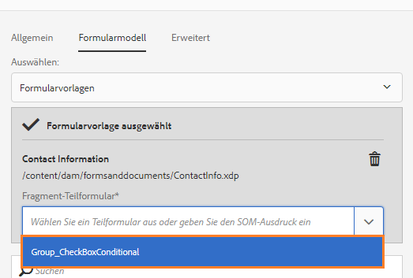
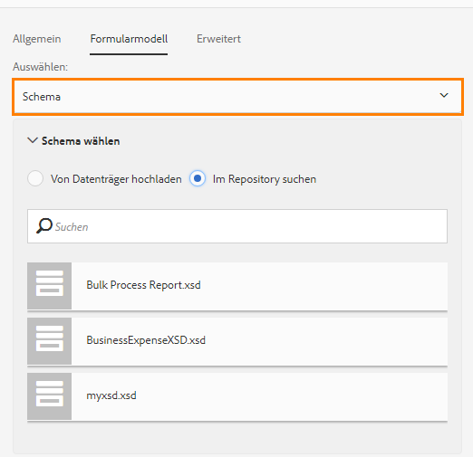

# Adaptive Formularfragmente{#adaptive-form-fragments}

Zwar wurde jedes Formular für einen bestimmten Zweck entwickelt, aber es gibt gängige Segmente in den meisten Formularen (z. B. für persönliche Angaben wie Name und Anschrift, Familienmitglieder, Einkommen usw.). Ein Formularentwickler muss diese gängigen Segmente jedes Mal erstellen, wenn ein neues Formular erstellt wird.

Adaptive Formulare bieten einen praktischen Mechanismus, um Formularsegmente wie ein Feld oder eine Gruppe von Feldern nur einmal zu erstellen und sie in adaptiven Formularen wiederzuverwenden. Diese wiederverwendbaren, unabhängigen Segmente werden als „adaptive Formularfragmente“ bezeichnet.

## Fragment erstellen {#create-a-fragment}

Sie können adaptive Formularfragmente von Grund auf neu erstellen oder ein Fenster in einem vorhandenen adaptiven Formular als Fragment speichern.

### Erstellen Sie Fragmente von Grund auf neu {#create-fragment-from-scratch}

1. Melden Sie sich bei der AEM Forms-Autoreninstanz unter https://[*Hostname*]:[*Anschluss*]/aem/forms.html an.
1. Klicken Sie auf **Erstellen > Adaptives Formularfragment**.
1. Geben Sie Titel, Name, Beschreibung und Tags für das Fragment an.

   >[!NOTE]
   >
   >Stellen Sie sicher, dass Sie einen eindeutigen Namen für das Fragment eingeben. Wenn bereits ein anderes Fragment mit demselben Namen vorhanden ist, kann das Fragment nicht erstellt werden.

1. Klicken Sie, um die Registerkarte **Formularmodell** zu öffnen. Wählen Sie dann aus der Dropdownliste **Auswählen aus** eines der folgenden Fragmentmodelle:

   * **Kein**: Das Fragment wird von Grund auf ohne Formularmodell erstellt.
   * **Formularvorlage**: Das Fragment mit mithilfe einer XDP-Vorlage erstellt, die auf AEM Forms hochgeladen wurde. Wählen Sie die entsprechende XDP-Vorlage als Formularmodell für das Fragment aus.

   

   Die Teilformulare, die als Fragmente in der ausgewählten Vorlage markiert sind, werden ebenfalls angezeigt. Sie können ein Teilformular für ein adaptives Formularfragment aus der Dropdownliste wählen.

   

   Außerdem können Sie ein adaptives Formularfragment aus Teilformularen erstellen, die nicht als Fragmente in der Formularvorlage markiert sind, indem Sie den SOM-Ausdruck für das Teilformular in der Dropdownliste angeben.

   * **XML-Schema**: Das Fragment wird mithilfe eines XML-Schemas erstellt, das auf AEM Forms hochgeladen wurde. Sie können ein XML-Schema als Formularmodell hochladen oder aus den verfügbaren Schemata wählen.

   

   Sie können ein adaptives Formularfragment auch erstellen, indem Sie einen „complexType“ im ausgewählten Schema aus der Dropdownliste wählen.

   

1. Klicken Sie auf **Erstellen** und dann auf **Öffnen**, um das Fragment mit einer Standardvorlage im Bearbeitungsmodus zu öffnen.

Im Bearbeitungsmodus können Sie eine beliebige adaptive Formularkomponente aus dem AEM Sidekick auf das Fragment ziehen. Weitere Informationen zu adaptiven Formularkomponenten finden Sie unter [Einführung zum Erstellen adaptiver Formulare](../../forms/using/introduction-forms-authoring.md).

Wenn Sie ein XML-Schema oder eine XDP-Formularvorlage als Formularmodell für das Fragment ausgewählt haben, wird eine neue Registerkarte mit der Formularmodellhierarchie in der Inhaltssuche angezeigt. Sie können dann Formularmodellelemente auf das Fragment ziehen. Die hinzugefügten Formularmodellelemente werden in Formularkomponenten konvertiert, wobei die ursprünglichen Eigenschaften des verbundenen XDP oder XSD beibehalten werden.

### Bereich als Fragment speichern  {#save-panel-as-a-fragment}

1. Öffnen Sie ein adaptives Formular, das dieses Bedienfeld enthält, das Sie als adaptives Formularfragment speichern möchten.
1. Klicken Sie in der Symbolleiste des Bedienfelds auf **[!UICONTROL Als Fragment zu speichern]**. Das Dialogfeld „Als Fragment speichern“ wird geöffnet.

   >[!NOTE]
   >
   >Wenn das Bedienfeld, das Sie gerade speichern, ein untergeordnetes Bedienfeld enthält, wird dieses auch im resultierenden Fragment enthalten sein.

1. Geben Sie im Bereich Dialogfeld „Fragmenterstellung“ die folgenden Informationen an:

   * **Name**: Name des Fragments. Der Standardwert ist der Elementname des Bedienfelds. Dies ist ein Pflichtfeld.
      >[!NOTE]
      >
      >Stellen Sie sicher, dass Sie einen eindeutigen Namen für das Fragment eingeben. Wenn bereits ein anderes Fragment mit demselben Namen vorhanden ist, kann das Fragment nicht erstellt werden.

   * **Title**: Titel des Formulars. Der Standardwert ist der Titel des Bedienfelds. 

   * **Description**: Beschreibung des Fragments.

   * **Tags**: Tagmetadaten für das Fragment. 

   * **Zielpfad**: Pfad für das Repository, in dem das Fragment gespeichert wird. Wenn Sie keinen Pfad angeben, wird ein Knoten mit demselben Namen wie der des Fragments neben dem Knoten erstellt, der das adaptive Formular enthält. Das Fragment wird in diesem Knoten gespeichert. 

   * **Formularmodell**: Je nach Formularmodell für das adaptive Formular wird das **XML-Schema**, die **Formularvorlage** oder **Ohne** angezeigt. Dies ist ein Feld, das nicht bearbeitet werden kann.

   * **Fragmentmodellstamm**: Diese Option wird nur in XSD-basierten adaptiven Formularen angezeigt. Es gibt den Stamm für das Fragmentmodell an. Sie können auch **/** oder den komplexen XSD-Typ Dropdown-Liste auswählen. Beachten Sie, dass Sie das Fragment nur in einem anderen adaptiven Formular wiederverwenden können, wenn Sie den komplexen Typ als Fragmentmodellstamm auswählen.
Wenn Sie **/** als Fragmentmodellstamm auswählen, wird die vollständige XSD-Struktur vom Stamm in der Registerkarte für das Datenmodell des adaptiven Formulars angezeigt. Für Fragmentmodellstamm eines komplexen Typs werden lediglich die untergeordneten Elemente des ausgewählten komplexen Typs in der Registerkarte des Datenmodells des adaptiven Formulars angezeigt. 

   * **XSD-REF**: Diese Option ist nur in den XSD-basierten adaptiven Formularen verfügbar. Es zeigt den Ort des XML-Schemas an.

   * **XDP-REF**: Diese Option ist nur in den XDP-basierten adaptiven Formularen verfügbar. Es wird der Speicherort der XDP-Vorlage angezeigt.

   

   Dialogfeld „Als Fragment speichern“.

1. Klicken Sie auf **OK**.

   Das Fenster wird am angegebenen oder am Standardspeicherort im Repository gespeichert. In einem adaptiven Formular wird das Fenster durch einen Schnappschuss des Fragments ersetzt. Wie unten gezeigt, wird das Bedienfeld „Allgemeine Informationen“ und seine untergeordneten Bedienfelder, „Persönliche Informationen“ und „Adresse“, als Fragment gespeichert.

   Um das Fragment zu bearbeiten, klicken Sie in der Symbolleiste des Bedienfelds auf das Symbol **[!UICONTROL Element]** bearbeiten. Das Fragment wird in einer neuen Registerkarte oder einem neuen Fenster im Bearbeitungsmodus geöffnet.

   

## Arbeiten mit Fragmenten {#working-with-fragments}

### Konfigurieren Sie das Erscheinungsbild der Fragmente {#configure-fragment-appearance}

Alle Fragmente, die Sie in adaptive Formulare einfügen, werden als Platzhalterbild angezeigt. Der Platzhalter zeigt Titel bis zu maximal zehn untergeordneten Bedienfeldern im Fragment an. Sie können AEM Forms konfigurieren, um das vollständige Fragment anstelle des Platzhalterbildes anzuzeigen.

Führen Sie die folgenden Schritte aus, um vollständige Fragmente in Formularen anzuzeigen:

1. Wechseln Sie zu AEM Web-Konsolenkonfigurationsseite unter https:[*host*]:[*port*]/system/console/configMgr.

1. Suchen Sie nach **[!UICONTROL Konfigurationsdienst für adaptive Formulare]** und klicken Sie darauf, um die Funktion im Bearbeitungsmodus zu öffnen.
1. Deaktivieren Sie das Kontrollkästchen **[!UICONTROL Platzhalter anstelle von Fragment aktivieren]**, um das vollständige Fragment anstelle des Platzhalterbildes anzuzeigen.

### Einfügen eines Formularfragments in ein adaptives Formular  {#insert-a-fragment-in-an-adaptive-form}

Die adaptive Formularfragmente, die Sie erstellen, werden auf der Registerkarte „Adaptive Formularfragmente“ der AEM Inhaltssuche angezeigt. Einfügen eines adaptiven Formularfragments in ein adaptives Formular

1. Öffnen Sie das adaptive Formular im Erstellungsmodus, in das Sie ein adaptives Formularfragment einfügen möchten.
1. Klicken Sie in der Seitenleiste auf **Assets** . Wählen Sie im Assets-Browser **Adaptive Formularfragmente** aus der Dropdownliste.

   Sie können auch festlegen, dass alle adaptiven Formularfragmente angezeigt oder nach Formularmodell (Formularvorlage, XML-Schema oder Allgemein) gefiltert werden.

1. Ziehen Sie ein adaptives Formularfragment auf das adaptive Formular.

   >[!NOTE]
   >
   >Das Fragment des adaptiven Formulars ist nicht für das Authoring vom adaptiven Formular aus aktiviert. Darüber hinaus ist es nicht möglich, ein XSD-basiertes Fragment in einem JSON-basierten adaptiven Formular und umgekehrt zu verwenden.

Das adaptive Formularfragment wird als Verweis in das adaptive Formular eingefügt und mit dem eigenständigen adaptiven Formularfragment synchronisiert. Das bedeutet, wenn Sie das adaptive Formularfragment aktualisieren, werden die Änderungen in allen adaptiven Formularen übernommen, in denen das Fragment verwendet wird.

### Einbetten eines Formularfragments in ein adaptives Formular  {#embed-a-fragment-in-adaptive-form}

Sie können ein adaptives Formularfragment in ein adaptives Formular einbetten, indem Sie in der Symbolleiste des hinzugefügten Fragments auf **Fragment einbetten:&lt;*fragmentName*>** (siehe Beispielbild unten) klicken.

>[!NOTE]
>
>Das eingebettete Fragment wird jedoch nicht mehr mit dem eigenständigen Fragment verknüpft. Sie können die Komponenten im eingebetteten Fragment aus dem adaptiven Formular heraus bearbeiten.

### Verwenden von Fragmenten innerhalb von Fragmenten  {#using-fragments-within-fragments}

Sie können verschachtelte adaptive Formularfragmente erstellen, d. h. ein Fragment in ein anderes Fragment ziehen, um eine verschachtelte Fragmentstruktur zu erstellen.

### Fragmente ändern  {#change-fragments}

Sie können ein adaptives Formularfragment ändern oder durch ein anderes ersetzen, indem Sie die Eigenschaft **Fragmentasset auswählen** im Dialogfeld „Komponente bearbeiten“ eines adaptiven Formularfragments verwenden.

## Automatisches Zuordnen von Fragmenten für die Datenbindung  {#auto-mapping-of-fragments-for-data-binding}

Wenn Sie ein adaptives Formularfragment mithilfe einer XFA-Formularvorlage oder einem komplexen XSD-Typ erstellen und es auf ein adaptives Formular ziehen, wird das XFA-Fragment bzw. der komplexe XSD-Typ automatisch durch das entsprechende adaptive Formularfragment ersetzt, dessen Fragmentmodellstamm dem XFA-Fragment bzw. komplexen XSD-Typ zugeordnet ist.

Sie können das Fragmentasset und dessen Bindungen im Dialogfeld „Komponente bearbeiten“ ändern.

>[!NOTE]
>
>Sie können auch ein gebundenes adaptives Formularfragment aus der Adaptiven Formularfragment-Bibliothek in der AEM Inhaltssuche ziehen und den richtigen Bindungsverweis aus dem Dialogfeld „Komponente bearbeiten“ des Bereichs „Adaptives Formularfragment“ angeben.

## Fragmente verwalten  {#manage-fragments}

Sie können mehrere Vorgänge auf adaptive Formularfragmente mithilfe von AEM Forms ausführen.

1. Rufen Sie `https://[hostname]:'port'/aem/forms.html` auf.

1. Klicken Sie in der Symbolleiste von AEM Forms auf **Auswählen** und wählen Sie ein adaptives Formularfragment aus. Die Symbolleiste enthält die folgenden Vorgänge, die Sie auf dem ausgewählten adaptiven Formularfragment ausführen können.

<table>
 <tbody>
  <tr>
   <td>
<strong>Vorgang</strong>
 </td>
   <td>
<strong>Beschreibung</strong>
 </td>
  </tr>
  <tr>
   <td>
Öffnen
 </td>
   <td>
Öffnet das Dialogfeld adaptive Formularfragment im Bearbeitungsmodus.    
 </td>
  </tr>
  <tr>
   <td>
Eigenschaften anzeigen
 </td>
   <td>
Öffnet den Bereich „Eigenschaften“. Im Bereich „Eigenschaften“ können Sie Eigenschaften anzeigen und bearbeiten, eine Vorschau erstellen und eine Miniatur für das ausgewählte Fragment hochladen. Weitere Informationen finden Sie unter <a href="../../forms/using/manage-form-metadata.md" target="_blank">Verwalten von Metadaten</a>.    
 </td>
  </tr>
  <tr>
   <td>
Kopieren
 </td>
   <td>
Kopiert das ausgewählte Fragment. Das Symbol „Einfügen“ wird in der Symbolleiste angezeigt.    
 </td>
  </tr>
  <tr>
   <td>
Download
 </td>
   <td>
Lädt das ausgewählte Fragment herunter.    
 </td>
  </tr>
  <tr>
   <td>
Vorschau
 </td>
   <td>
Enthält Optionen zum Anzeigen einer HTML- oder benutzerdefinierten Vorschau des Fragments durch Zusammenführen von Daten aus einer XML-Datei und dem Fragment. Weitere Informationen finden Sie unter <a href="/help/forms/using/previewing-forms.md" target="_blank">Erstellen einer Vorschau für ein Formular</a>.   
 </td>
  </tr>
  <tr>
   <td>
Review starten/verwalten
 </td>
   <td>
Initiieren und Verwalten einer Review des ausgewählten Fragments. Weitere Informationen finden Sie unter <a href="../../forms/using/create-reviews-forms.md" target="_blank">Erstellen und Verwalten von Reviews</a>.   
 </td>
  </tr>
  <tr>
   <td>
Wörterbuch erstellen
 </td>
   <td>
Erstellt ein Wörterbuch zum Lokalisieren des ausgewählten Fragments. Weitere Informationen finden Sie unter <a href="/help/forms/using/lazy-loading-adaptive-forms.md" target="_blank">Lokalisieren adaptiver Formulare</a>.   
 </td>
  </tr>
  <tr>
   <td>
Veröffentlichen/Veröffentlichung rückgängig machen
 </td>
   <td>
Veröffentlicht das ausgewählte Fragment bzw. macht die Veröffentlichung rückgängig.    
 </td>
  </tr>
  <tr>
   <td>
Löschen
 </td>
   <td>
Löscht das ausgewählte Fragment.    
 </td>
  </tr>
 </tbody>
</table>

## Lokalisieren von adaptiven Formularen mit Fragmenten  {#localizing-adaptive-form-containing-fragments}

Zum Lokalisieren eines adaptiven Formulars, das adaptive Formularfragmente enthält, müssen Sie das Fragment und das Formular separat lokalisieren. Auf diese Weise muss ein Fragment nur einmal lokalisiert werden und kann dann später in mehreren adaptiven Formularen wiederverwendet werden.

>[!NOTE]
>
>Die Lokalisierungsschlüssel im Fragment werden nicht in der XLIFF-Datei für ein adaptives Formular angezeigt.

## Wichtige Hinweise zum Arbeiten mit Fragmenten  {#key-points-to-remember-when-working-with-fragments}

* Stellen Sie sicher, dass der Fragmentname eindeutig ist. Wenn bereits ein anderes Fragment mit demselben Namen vorhanden ist, kann das Fragment nicht erstellt werden.
* Wenn Sie in einem XDP-basierten adaptiven Formular ein Bedienfeld, das ein anderes XDP-Fragment enthält, als Fragment speichern, wird das daraus resultierende Fragment automatisch an das XDP-Fragment des untergeordneten Elements gebunden. Im Falle eines XSD-basierten adaptiven Formulars ist das resultierende Fragment an den Schemastamm gebunden.
* Wenn Sie ein adaptives Formularfragment erstellen, wird ein Fragmentknoten erstellt, der dem Knoten „guideContainer“ für ein adaptives Formular in CRXDe Lite ähnelt.
* Ein Fragment in einem adaptiven Formular, das ein anderes Formulardatenmodell verwendet, wird nicht unterstützt. Zum Beispiel wird ein XDP-basiertes Fragment in einem XSD-basierten adaptiven Formular nicht unterstützt und umgekehrt.
* Adaptive Formularfragmente sind auf der Registerkarte „Adaptive Formularfragmente“ in der AEM Inhaltssuche verfügbar.
* Alle Ausdrücke, Skripts oder Stile in einem eigenständigen adaptiven Formularfragment bleiben erhalten, wenn es als Verweis eingefügt oder in ein adaptives Formular eingebettet wird.
* Sie können adaptive Formularfragmente, die als Verweis eingefügt wurden, nicht innerhalb eines adaptiven Formulars bearbeiten. Sie bearbeiten stattdessen entweder das eigenständige adaptive Formularfragment oder betten das Fragment in das adaptive Formular ein.
* Wenn Sie ein adaptives Formular veröffentlichen, müssen Sie das eigenständige adaptive Formularfragment veröffentlichen, das als Verweis im adaptiven Formular eingefügt wurde.
* Wenn Sie ein aktualisiertes adaptives Formularfragment veröffentlichen, werden die Änderungen in den veröffentlichten Instanzen des adaptiven Formulars vorgenommen, in denen das Fragment verwendet wird.
* Adaptive Formulare, die die Verify-Komponente enthalten, unterstützen keine anonymen Benutzer. Außerdem wird nicht empfohlen, die Verify-Komponente in einem adaptiven Formularfragment zu verwenden.
* (**Nur Mac**) Um sicherzustellen, dass die Formularfragmentfunktionalität in allen Szenarien einwandfrei funktioniert, fügen Sie den folgenden Eintrag zur Datei &quot;/private/etc/hosts&quot;hinzu:
   `127.0.0.1 <Host machine>` **Hostcomputer**: Der Apple Mac-Computer, auf dem AEM Forms bereitgestellt wird.

## Referenzfragmente {#reference-fragments}

Es sind Referenzfragmente für adaptive Formulare vorhanden, die Sie verwenden können, um die Formular zu erstellen. Weitere Informationen finden Sie unter[ Referenzfragmente](../../forms/using/reference-adaptive-form-fragments.md).
