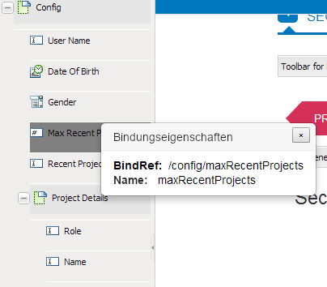

# Adaptive Formulare mithilfe des XML-Schemas erstellen {#creating-adaptive-forms-using-xml-schema}

<span class="preview"> Adobe empfiehlt, die modernen und erweiterbaren [Kernkomponenten](https://experienceleague.adobe.com/docs/experience-manager-core-components/using/adaptive-forms/introduction.html?lang=de) zur Datenerfassung zu verwenden, um [neue adaptive Formulare zu erstellen](/help/forms/using/create-an-adaptive-form-core-components.md) oder [adaptive Formulare zu AEM Sites-Seiten hinzuzufügen](/help/forms/using/create-or-add-an-adaptive-form-to-aem-sites-page.md). Diese Komponenten stellen einen bedeutenden Fortschritt bei der Erstellung adaptiver Formulare dar und sorgen für beeindruckende Anwendererlebnisse. In diesem Artikel wird der ältere Ansatz zum Erstellen adaptiver Formulare mithilfe von Foundation-Komponenten beschrieben. </span>

## Voraussetzungen {#prerequisites}

Für die Erstellung eines adaptiven Formulars mit einem XML-Schema als zugehöriges Formularmodell sind grundlegende Kenntnisse zu XML-Schemata erforderlich. Außerdem wird empfohlen, folgenden Inhalt vor diesem Artikel durchzulesen.

* [Erstellen eines adaptiven Formulars](creating-adaptive-form.md)
* [XML-Schema](https://www.w3.org/TR/xmlschema-2/)

## Verwenden eines XML-Schemas als Formularmodell {#using-an-xml-schema-as-form-model}

[!DNL Experience Manager Forms] unterstützt die Erstellung eines adaptiven Formulars mit einem vorhandenen XML-Schema als Formularmodell. Dieses XML-Schema stellt die Struktur dar, in der Daten vom Back-End-System in Ihrer Organisation produziert oder genutzt werden.

Dies sind die Hauptfunktionen bei der Verwendung eines XML-Schemas:

* Die XSD-Struktur wird als Baumstruktur auf der Registerkarte für die Inhaltssuche im Authoring-Modus für ein adaptives Formular angezeigt. Sie können Elemente aus der XSD-Hierarchie in das adaptive Formular ziehen.
* Sie können das Formular mit XML vorausfüllen, das mit dem zugehörigen Schema konform ist.
* Bei der Übermittlung werden die von der Benutzerin oder dem Benutzer eingegebenen Daten im XML-Format gesendet, das dem zugehörigen Schema entspricht.

Ein XML-Schema besteht aus einfachen und komplexen Elementtypen. Die Elemente weisen Attribute auf, die dem Element Regeln hinzufügen. Wenn diese Elemente und Attribute in ein adaptives Formular gezogen werden, werden sie automatisch der entsprechenden Komponente des adaptiven Formulars zugeordnet.

Diese Zuordnung von XML-Elementen zu Komponenten adaptiver Formulare sieht wie folgt aus:

<table>
 <tbody>
  <tr>
   <th><strong>XML-Element oder -Attribut </strong></th>
   <th><strong>Komponente des adaptiven Formulars</strong></th>
  </tr>
  <tr>
   <td><code>xs:string</code></td>
   <td>Textfeld</td>
  </tr>
  <tr>
   <td><code>xs:boolean</code></td>
   <td>Kontrollkästchen</td>
  </tr>
  <tr>
   <td>
    <ul>
     <li><code>xs:unsignedInt</code></li>
     <li><code>xs:xs:int</code></li>
     <li><code class="code">xs:decimal
        </code></li>
     <li>Alle Arten numerischer Werte</li>
    </ul> </td>
   <td>Numerisches Feld</td>
  </tr>
  <tr>
   <td><code>xs:date</code></td>
   <td>Datumsauswahl</td>
  </tr>
  <tr>
   <td><code class="code">xs:enumeration
      </code></td>
   <td>Dropdown</td>
  </tr>
  <tr>
   <td>Jedes Element mit komplexem Typ</td>
   <td>Bedienfeld</td>
  </tr>
 </tbody>
</table>

## Beispiel-XML-Schema {#sample-xml-schema}

Im Folgenden finden Sie ein Beispiel eines XML-Schemas.

```xml
<?xml version="1.0" encoding="utf-8" ?>
    <xs:schema targetNamespace="https://adobe.com/sample.xsd"
                    xmlns="https://adobe.com/sample.xsd"
                    xmlns:xs="https://www.w3.org/2001/XMLSchema"
                >

        <xs:element name="sample" type="SampleType"/>

        <xs:complexType name="SampleType">
            <xs:sequence>
                <xs:element name="leaderName" type="xs:string" default="Enter Name"/>
                <xs:element name="assignmentStartBirth" type="xs:date"/>
                <xs:element name="gender" type="GenderEnum"/>
                <xs:element name="noOfProjectsAssigned" type="IntType"/>
                <xs:element name="assignmentDetails" type="AssignmentDetails"
                                            minOccurs="0" maxOccurs="10"/>
            </xs:sequence>
        </xs:complexType>

        <xs:complexType name="AssignmentDetails">
            <xs:attribute name="name" type="xs:string" use="required"/>
            <xs:attribute name="durationOfAssignment" type="xs:unsignedInt" use="required"/>
            <xs:attribute name="numberOfMentees" type="xs:unsignedInt" use="required"/>
             <xs:attribute name="descriptionOfAssignment" type="xs:string" use="required"/>
             <xs:attribute name="financeRelatedProject" type="xs:boolean"/>
       </xs:complexType>
  <xs:simpleType name="IntType">
            <xs:restriction base="xs:int">
            </xs:restriction>
        </xs:simpleType>
  <xs:simpleType name="GenderEnum">
            <xs:restriction base="xs:string">
                <xs:enumeration value="Female"/>
                <xs:enumeration value="Male"/>
            </xs:restriction>
        </xs:simpleType>
    </xs:schema>
```

>[!NOTE]
>
>Stellen Sie sicher, dass das XML-Schema nur ein Stammelement hat. Ein XML-Schema mit mehreren Stammelementen wird nicht unterstützt.

## Hinzufügen spezieller Eigenschaften zu Feldern mithilfe eines XML-Schemas {#adding-special-properties-to-fields-using-xml-schema}

Sie können die folgenden Attribute zu XML-Schemaelementen hinzufügen, um spezielle Eigenschaften zu den Feldern des zugehörigen adaptiven Formulars hinzuzufügen.

<table>
 <tbody>
  <tr>
   <th><strong>Schemaeigenschaft</strong></th>
   <th><strong>Verwendung im adaptiven Formular</strong></th>
   <th><strong>Unterstützt in </strong></th>
  </tr>
  <tr>
   <td><code>use=required </code></td>
   <td>Markiert ein Feld als Pflichtfeld<br /> </td>
   <td>Attribut</td>
  </tr>
  <tr>
   <td><code>default="default value"</code></td>
   <td>Fügt einen Standardwert hinzu.</td>
   <td>Element und Attribut</td>
  </tr>
  <tr>
   <td><code>minOccurs="3"</code></td>
   <td><p>Gibt minimale Vorkommen an.</p> <p>(Für wiederholbare Teilformulare (komplexe Typen).)</p> </td>
   <td>Element (komplexer Typ)</td>
  </tr>
  <tr>
   <td><code class="code">maxOccurs="10"
      </code></td>
   <td><p>Gibt maximale Vorkommen an.</p> <p>(Für wiederholbare Teilformulare (komplexe Typen).)</p> </td>
   <td>Element (komplexer Typ)</td>
  </tr>
 </tbody>
</table>

>[!NOTE]
>
>Wenn Sie ein Schemaelement in ein adaptives Formular ziehen, wird wie folgt eine Standardbeschriftung erstellt:
>
>* Großschreibung des ersten Zeichens des Elementnamens
>* Einfügen eines Leerzeichens bei Binnenmajuskeln
>
>Wenn Sie beispielsweise das Schemaelement `userFirstName` hinzufügen, wird `User First Name` als Beschriftung im adaptiven Formular erstellt.

## Einschränken der gültigen Werte für eine Komponente eines adaptiven Formulars {#limit-acceptable-values-for-an-adaptive-form-component}

Sie können die folgenden Einschränkungen zu XML-Schemaelementen hinzufügen, um die Werte zu beschränken, die für eine Komponente eines adaptiven Formulars gültig sind:

<table>
 <tbody>
  <tr>
   <td><p><strong> Schemaeigenschaft</strong></p> </td>
   <td><p><strong>Datentyp</strong></p> </td>
   <td><p><strong>Beschreibung</strong></p> </td>
   <td><p><strong>Komponente</strong></p> </td>
  </tr>
  <tr>
   <td><p><code>totalDigits</code></p> </td>
   <td><p>Zeichenfolge</p> </td>
   <td><p>Legt die zulässige Höchstzahl von Stellen in einer Komponente fest. Die Anzahl der Stellen muss größer als null sein.</p> </td>
   <td>
    <ul>
     <li>Numerisches Feld</li>
     <li>Numerische Schritte</li>
    </ul> </td>
  </tr>
  <tr>
   <td><p><code>maximum</code></p> </td>
   <td><p>Zeichenfolge</p> </td>
   <td><p>Legt die Obergrenze für numerische Werte und Daten fest. Standardmäßig ist der Höchstwert enthalten.</p> </td>
   <td>
    <ul>
     <li>Numerisches Feld</li>
     <li>Numerische Schritte<br /> </li>
     <li>Datumsauswahl</li>
    </ul> </td>
  </tr>
  <tr>
   <td><p><code>minimum</code></p> </td>
   <td><p>Zeichenfolge</p> </td>
   <td><p>Legt die Untergrenze für numerische Werte und Daten fest. Standardmäßig ist der Mindestwert enthalten.</p> </td>
   <td>
    <ul>
     <li>Numerisches Feld</li>
     <li>Numerische Schritte</li>
     <li>Datumsauswahl</li>
    </ul> </td>
  </tr>
  <tr>
   <td><p><code>exclusiveMaximum</code></p> </td>
   <td><p>Boolesch</p> </td>
   <td><p>Wenn „true“, muss der numerische Wert oder das Datum, der bzw. das in der Komponente des Formulars festgelegt ist, kleiner sein als der numerische Wert oder das Datum, der bzw. das für die Eigenschaft „maximum“ angegeben ist.</p> <p>Wenn „false“, muss der numerische Wert oder das Datum, der bzw. das in der Komponente des Formulars festgelegt ist, kleiner oder gleich dem numerischen Wert oder Datum sein, der bzw. das für die Eigenschaft „maximum“ angegeben ist.</p> </td>
   <td>
    <ul>
     <li>Numerisches Feld</li>
     <li>Numerische Schritte</li>
     <li>Datumsauswahl</li>
    </ul> </td>
  </tr>
  <tr>
   <td><p><code>exclusiveMinimum</code></p> </td>
   <td><p>Boolesch</p> </td>
   <td><p>Wenn „true“, muss der numerische Wert oder das Datum, der bzw. das in der Komponente des Formulars festgelegt ist, größer sein als der numerische Wert oder das Datum, der bzw. das für die Eigenschaft „minimum“ angegeben ist.</p> <p>Wenn „false“, muss der numerische Wert oder das Datum, der bzw. das in der Komponente des Formulars festgelegt ist, größer oder gleich dem numerischen Wert oder Datum sein, der bzw. das für die Eigenschaft „minimum“ angegeben ist.</p> </td>
   <td>
    <ul>
     <li>Numerisches Feld</li>
     <li>Numerische Schritte</li>
     <li>Datumsauswahl</li>
    </ul> </td>
  </tr>
  <tr>
   <td><p><code>minLength</code></p> </td>
   <td><p>Zeichenfolge</p> </td>
   <td><p>Legt die zulässige Mindestanzahl von Zeichen in einer Komponente fest. Die minimale Länge muss größer oder gleich null sein.</p> </td>
   <td>
    <ul>
     <li>Textfeld</li>
    </ul> </td>
  </tr>
  <tr>
   <td><p><code>maxLength</code></p> </td>
   <td><p>Zeichenfolge</p> </td>
   <td><p>Legt die zulässige Höchstzahl von Zeichen in einer Komponente fest. Die maximale Länge muss größer als null sein.</p> </td>
   <td>
    <ul>
     <li>Textfeld</li>
    </ul> </td>
  </tr>
  <tr>
   <td><p><code>length</code></p> </td>
   <td><p>Zeichenfolge</p> </td>
   <td><p>Legt die genaue Anzahl von Zeichen in einer Komponente fest. Die Länge muss größer oder gleich null sein.</p> </td>
   <td>
    <ul>
     <li>Textfeld</li>
    </ul> </td>
  </tr>
  <tr>
   <td><p><code>fractionDigits</code></p> </td>
   <td><p>Zeichenfolge</p> </td>
   <td><p>Legt die zulässige Höchstzahl von Dezimalstellen in einer Komponente fest. Der fractionDigits-Wert muss größer oder gleich null sein.</p> </td>
   <td>
    <ul>
     <li> Numerisches Feld mit Datentyp „Gleitkomma“ oder „Dezimal“.</li>
    </ul> </td>
  </tr>
  <tr>
   <td><p><code>pattern</code></p> </td>
   <td><p>Zeichenfolge</p> </td>
   <td><p>Legt die Reihenfolge der Zeichen fest. Eine Komponente akzeptiert die Zeichen, wenn sie dem angegebenen Muster entsprechen.</p> <p>Die Eigenschaft „pattern“ ist dem Überprüfungsmuster der entsprechenden Komponente des adaptiven Formulars zugeordnet.</p> </td>
   <td>
    <ul>
     <li>Alle adaptiven Formulare, die einem XSD-Schema zugeordnet sind </li>
    </ul> </td>
  </tr>
 </tbody>
</table>

## Häufig gestellte Fragen  {#frequently-asked-questions}

**Woher weiß ich, welches Element in der Baumstruktur mit welchem XML-Element verknüpft ist?**

Wenn Sie auf ein Element in der Inhaltssuche doppelklicken, wird ein Popup-Menü mit einem Feldnamen und einer Eigenschaft namens `bindRef` angezeigt. Diese Eigenschaft ordnet das Baumstrukturelement dem Element oder Attribut im Schema zu.



Das Feld <code>bindRef</code> zeigt die Verknüpfung zwischen einem Element der Baumstruktur und einem Element oder Attribut in einem Schema an.

>[!NOTE]
>
>Attribute weisen ein `@`-Symbol in ihrem `bindRef`-Wert auf, wodurch sie von Elementen unterschieden werden können. Beispiel: `/config/projectDetails/@duration`.

**Warum kann ich nicht einzelne Elemente eines Teilformulars (Struktur aus einem komplexen Typ generiert) für wiederholbare Teilformulare ziehen (Wert von „minOccurs“ oder „maxOccurs“ ist größer als 1)?**

In einem wiederholbaren Teilformular müssen Sie das gesamte Teilformular verwenden. Wenn Sie nur einzelne Felder nutzen möchten, verwenden Sie die gesamte Struktur und löschen Sie unerwünschte Felder.

**Ich habe eine lange komplexe Struktur in der Inhaltssuche. Wie kann ich ein bestimmtes Element suchen?**

Es gibt zwei Optionen:

* Scrollen Sie durch die Baumstruktur
* Verwenden Sie das Suchfeld, um ein Element zu finden

**Was ist bindRef?**

`bindRef` ist die Verbindung zwischen einer Komponente eines adaptiven Formulars und einem Schemaelement oder -attribut. Dieses Element gibt den `XPath` vor, in dem der Wert, der von dieser Komponente oder diesem Feld erfasst wird, in der Ausgabe-XML verfügbar ist. Ein `bindRef`wird auch verwendet, wenn ein Feldwert aus (vorausgefüllter) XML im Voraus gefüllt wird.
