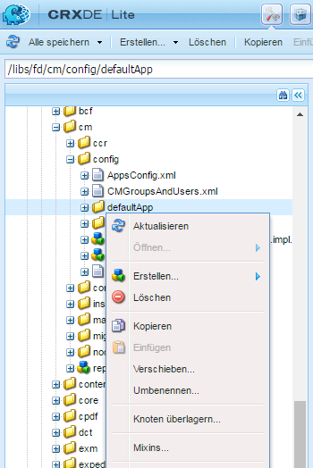
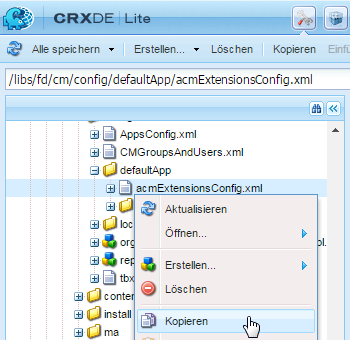
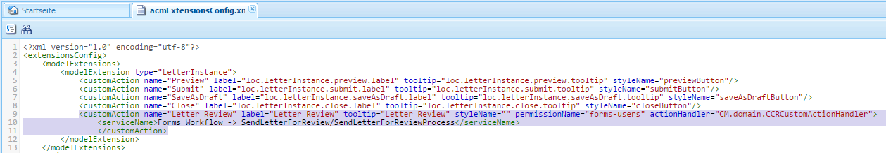
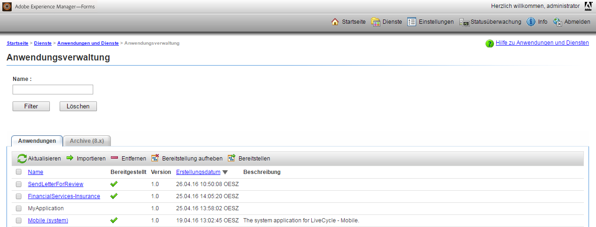
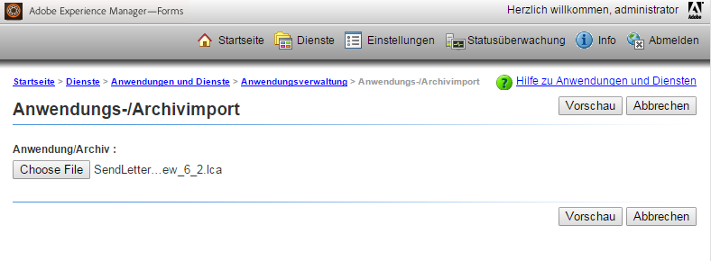

# Fügen Sie benutzerdefinierte Aktionen/Schaltflächen der Benutzeroberfläche „Korrespondenz erstellen“ hinzu {#add-custom-action-button-in-create-correspondence-ui}

## Überblick {#overview}

Correspondence Management Solution ermöglicht es Ihnen, benutzerdefinierte Aktionen der Benutzeroberfläche „Korrespondenz erstellen“ hinzufügen.

Das Szenario in diesem Dokument erläutert, wie Sie eine Schaltfläche in der Benutzeroberfläche &quot;Korrespondenz erstellen&quot;erstellen können, um einen Brief als Review-PDF freizugeben, das an eine E-Mail angehängt ist.

### Voraussetzungen {#prerequisites}

Um dieses Beispiel auszuführen, benötigen Sie Folgendes:

* Kenntnisse von CRX und JavaScript
* LiveCycle-Server

## Szenario: Erstellen Sie die Schaltfläche in der Benutzeroberfläche „Korrespondenz erstellen“, um ein Schreiben zum Review zu senden {#scenario-create-the-button-in-the-create-correspondence-user-interface-to-send-a-letter-for-review}

Hinzufügen einer Schaltfläche mit einer Aktion (hier Buchstaben zum Review senden) zur Benutzeroberfläche „Korrespondenz erstellen“. Diese enthält Folgendes:

1. Hinzufügen der Schaltfläche „Korrespondenz erstellen“ zur Benutzeroberfläche 
1. Hinzufügen der Aktionsbearbeitung zur Schaltfläche
1. Hinzufügen eines LiveCycle-Prozesses, um die Aktionsbearbeitung zu aktivieren

### Hinzufügen der Schaltfläche „Korrespondenz erstellen“ zur Benutzeroberfläche {#add-the-button-to-the-create-correspondence-user-interface}

1. Gehen Sie zu `https://'[server]:[port]'/[ContextPath]/crx/de` und melden Sie sich als Administrator an.
1. Erstellen Sie im Apps-Ordner einen Ordner mit dem Namen `defaultApp` mit einem ähnlichen Pfad/einer ähnlichen Struktur wie der Ordner defaultApp (der sich im config -Ordner befindet). Mit den folgenden Schritten können Sie den Ordner erstellen:

   1. Klicken Sie mit der rechten Maustaste auf den Ordner **defaultApp** im folgenden Pfad und wählen Sie **Überlagerungsknoten** aus:

      /libs/fd/cm/config/defaultApp/

      

   1. Stellen Sie sicher, dass das Dialogfeld „Überlagerungsknoten“ die folgenden Werte enthält:

      **Pfad:** /libs/fd/cm/config/defaultApp/

      **Überlagerungsspeicherort:** /apps/

      **Knotentypen abgleichen:** Überprüft

      

   1. Klicken Sie auf **OK**.
   1. Klicken Sie auf **Alle speichern**.

1. Erstellen Sie eine Kopie der acmExtensionsConfig.xml-Datei (vorhanden unter der /libs-Verzweigung) unter der /apps-Verzweigung.

   1. Wechseln Sie zu „/libs/fd/cm/config/defaultApp/acmExtensionsConfig.xml“

   1. Klicken Sie mit der rechten Maustaste auf die Datei acmExtensionsConfig.xml und wählen Sie **Copy** aus.

      

   1. Klicken Sie mit der rechten Maustaste auf den Ordner **defaultApp** unter „/apps/fd/cm/config/defaultApp/,“ und wählen Sie **Einfügen**.
   1. Klicken Sie auf **Alle speichern**.

1. Doppelklicken Sie auf die Kopie von „acmExtentionsConfig.xml“, die Sie im Apps-Ordner neu erstellten haben. Die Datei wird zur Bearbeitung geöffnet.
1. Suchen Sie folgenden Code:

   ```xml
   <?xml version="1.0" encoding="utf-8"?>
   <extensionsConfig>
       <modelExtensions>
           <modelExtension type="LetterInstance">
     <customAction name="Preview" label="loc.letterInstance.preview.label" tooltip="loc.letterInstance.preview.tooltip" styleName="previewButton"/>
               <customAction name="Submit" label="loc.letterInstance.submit.label" tooltip="loc.letterInstance.submit.tooltip" styleName="submitButton" permissionName="forms-users"/>
               <customAction name="SaveAsDraft" label="loc.letterInstance.saveAsDraft.label" tooltip="loc.letterInstance.saveAsDraft.tooltip" styleName="submitButton" permissionName="forms-users"/>
               <customAction name="Close" label="loc.letterInstance.close.label" tooltip="loc.letterInstance.close.tooltip" styleName="closeButton"/>
           </modelExtension>
       </modelExtensions>
   </extensionsConfig>
   ```

1. Um ein Schreiben per E-Mail zu versenden, können Sie den LiveCycle Forms-Arbeitsablauf verwenden. Fügen Sie ein customAction-Tag unter dem modelExtension-Tag in acmExtensionsConfig.xml wie folgt hinzu:

   ```xml
    <customAction name="Letter Review" label="Letter Review" tooltip="Letter Review" styleName="" permissionName="forms-users" actionHandler="CM.domain.CCRCustomActionHandler">
         <serviceName>Forms Workflow -> SendLetterForReview/SendLetterForReviewProcess</serviceName>
       </customAction>
   ```

   

   Das modelExtension-Tag besitzt eine Reihe von untergeordneten customAction-Tags, die die Aktion, die Berechtigungen und das Erscheinungsbild der Aktionsschaltfläche konfigurieren. Im Folgenden finden Sie eine Liste der customAction Konfigurations-Tags:

   | **Name** | **Beschreibung** |
   |---|---|
   | name | Der alphanumerische Name für die auszuführende Aktion. Der Wert dieses Tags wird benötigt, muss eindeutig sein (d. h. innerhalb des modelExtension-Tags) und muss mit einem Buchstaben beginnen. |
   | label | Die Beschriftung der Aktionsschaltfläche |
   | tooltip | QuickInfo-Text der Schaltfläche, der angezeigt wird, wenn der Benutzer den Cursor auf der Schaltfläche bewegt. |
   | styleName | Name des benutzerdefinierten Stils, der auf die Aktionsschaltfläche angewendet wird. |
   | permissionName | Die entsprechende Aktion wird nur angezeigt, wenn der Benutzer über die von permissionName angegebene Berechtigung verfügt. Wenn Sie permissionName als `forms-users` angeben, erhalten alle Benutzer Zugriff auf diese Option. |
   | actionHandler | Vollqualifizierter Name der ActionHandler-Klasse, die aufgerufen wird, wenn der Benutzer auf die Schaltfläche klickt. |

   Neben den oben genannten Parametern kann es weitere Konfigurationen geben, die mit einer customAction verknüpft sind. Diese zusätzlichen Konfigurationen werden dem Handler über das CustomAction -Objekt zur Verfügung gestellt.

   | **Name** | **Beschreibung** |
   |---|---|
   | serviceName | Wenn eine customAction ein untergeordnetes Tag mit dem Namen serviceName enthält, wird beim Klicken auf die entsprechende Schaltfläche/Verknüpfung ein Prozess mit dem Namen aufgerufen, der durch das Tag serviceName repräsentiert wird. Stellen Sie sicher, dass dieser Prozess dieselbe Signatur wie der Brief PostProcess hat. Fügen Sie das Präfix „Forms-Arbeitsablauf“ zum Servicenamen hinzu. |
   | Parameter, die das Präfix cm_ im Tag-Namen enthalten | Wenn eine customAction untergeordnete Tags enthält, die mit dem Namen cm_ beginnen, dann sind diese Parameter im Nachbearbeitungsprozess (sei es Brief-Nachbearbeitungsprozess oder der spezielle Prozess, der durch das serviceName -Tag dargestellt wird) im Eingabe-XML-Code unter dem relevanten Tag verfügbar, wobei das Präfix cm_ entfernt wird. |
   | actionName | Wenn ein Nachbearbeitungsprozess auf einen Klick zurückzuführen ist, enthält die gesendete XML ein spezielles Tag mit dem Namen unter dem Tag mit dem Namen der Benutzeraktion. |

1. Klicken Sie auf **Alle speichern**.

#### Erstellen Sie einen lokalen Ordner mit der Eigenschaftendatei in der /apps-Verzweigung  {#create-a-locale-folder-with-properties-file-in-the-apps-branch}

Die Datei ACMExtensionsMessages.properties enthält Beschriftungen und QuickInfo-Meldungen verschiedener Felder in der Benutzeroberfläche &quot;Korrespondenz erstellen&quot;. Damit die benutzerdefinierten Aktionen/Schaltflächen funktionieren, müssen Sie eine Kopie dieser Datei in der /apps-Verzweigung erstellen.

1. Klicken Sie mit der rechten Maustaste auf den Ordner **locale** im folgenden Pfad und wählen Sie **Überlagerungsknoten** aus:

   /libs/fd/cm/config/defaultApp/locale

1. Stellen Sie sicher, dass das Dialogfeld „Überlagerungsknoten“ die folgenden Werte enthält:

   **Pfad:** /libs/fd/cm/config/defaultApp/locale

   **Überlagerungsspeicherort:** /apps/

   **Knotentypen abgleichen:** Überprüft

1. Klicken Sie auf **OK**.
1. Klicken Sie auf **Alle speichern**.
1. Klicken Sie mit der rechten Maustaste auf die folgende Datei und wählen Sie **Kopieren**:

   `/libs/fd/cm/config/defaultApp/locale/ACMExtensionsMessages.properties`

1. Klicken Sie mit der rechten Maustaste auf den Ordner **locale** unter folgendem Pfad und wählen Sie die Option **Einfügen**:

   `/apps/fd/cm/config/defaultApp/locale/`

   ACMExtensionsMessages.properties-Datei wird in den Ordner „locale“ kopiert.

1. Um die Titel der neu hinzugefügten benutzerdefinierten Aktion/Schaltfläche zu lokalisieren, erstellen Sie die Datei ACMExtensionsMessages.properties für das entsprechende Gebietsschema in `/apps/fd/cm/config/defaultApp/locale/`.

   Beispiel für die Lokalisierung der benutzerdefinierten Aktion/Schaltfläche, die in diesem Artikel erstellt wurde, erstellen Sie eine Datei mit dem Namen ACMExtensionsMessages_fr.properties mit folgendem Eintrag:

   `loc.letterInstance.letterreview.label=Revue De Lettre`

   Auf ähnliche Weise können Sie in dieser Datei weitere Eigenschaften hinzufügen, z. B. für QuickInfo und Stil.

1. Klicken Sie auf **Alle speichern**.

#### Starten Sie das Asset Composer-Baustein-Bundle von Adobe neu  {#restart-the-adobe-asset-composer-building-block-bundle}

Nachdem Sie serverseitige Änderungen vorgenommen haben, starten Sie das Asset Composer-Baustein-Bundle von Adobe neu. In diesem Szenario werden die Dateien acmExtensionsConfig.xml und ACMExtensionsMessages.properties auf der Serverseite bearbeitet. Daher erfordert das Adobe Asset Composer-Baustein-Bundle einen Neustart.

>[!NOTE]
>
>Möglicherweise müssen Sie die Daten im Browsercache löschen.

1. Rufen Sie `https://[host]:'port'/system/console/bundles` auf. Falls erforderlich, melden Sie sich als Administrator an.

1. Suchen Sie das Asset Composer-Baustein-Bundle von Adobe. Starten Sie das Bundle neu: Klicken Sie auf „Anhalten“ und klicken Sie dann auf „Start“.

   

Nachdem das Asset Composer-Baustein-Bundle von Adobe neu gestartet wurde, wird die benutzerdefinierte Schaltfläche in der Benutzeroberfläche „Korrespondenz erstellen“ angezeigt. Sie können ein Schreiben in der Benutzeroberfläche „Korrespondenz erstellen“ öffnen, um eine benutzerdefinierte Schaltfläche in der Vorschau anzuzeigen.

### Hinzufügen der Aktionsbearbeitung zur Schaltfläche  {#add-action-handling-to-the-button}

Die Benutzeroberfläche „Korrespondenz erstellen“ ist standardmäßig in der Implementierung der ActionHandler cm.domain.js-Datei am folgenden Speicherort:

/libs/fd/cm/ccr/gui/components/admin/clientlibs/ccr/js/cm.domain.js

Erstellen Sie für die benutzerdefinierte Aktionsbearbeitung eine Überlagerung der cm.domain.js-Datei in der /apps-Verzweigung von CRX.

Das Bearbeiten der Aktion/der Schaltfläche beim Klicken auf die Aktion/Schaltfläche beinhaltet Logik für:

* Ein-/Ausblenden der neu hinzugefügten Aktion: durch Überschreiben der Funktion „actionVisible()“.
* Neu hinzugefügte Aktion aktivieren/deaktivieren: , indem die Funktion actionEnabled() überschrieben wird.
* Tatsächlicher Umgang mit Aktionen, wenn der Benutzer auf die Schaltfläche klickt: , indem die Implementierung der Funktion handleAction() überschrieben wird.

1. Rufen Sie `https://'[server]:[port]'/[ContextPath]/crx/de` auf. Falls erforderlich, melden Sie sich als Administrator an.

1. Erstellen Sie im Anwendungsordner einen Ordner mit dem Namen`js`   in der /apps-Verzweigung von CRX, mit einer ähnlichen Struktur des folgenden Ordners:

   `/libs/fd/cm/ccr/gui/components/admin/clientlibs/ccrui/js`

   Mit den folgenden Schritten können Sie den Ordner erstellen:

   1. Klicken Sie mit der rechten Maustaste auf den Ordner **js** im folgenden Pfad und wählen Sie **Überlagerungsknoten** aus:

      `/libs/fd/cm/ccr/gui/components/admin/clientlibs/ccrui/js`

   1. Stellen Sie sicher, dass das Dialogfeld „Überlagerungsknoten“ die folgenden Werte enthält:

      **Pfad:**  /libs/fd/cm/ccr/gui/components/admin/clientlibs/ccrui/js

      **Überlagerungsspeicherort:** /apps/

      **Knotentypen abgleichen:** Überprüft

   1. Klicken Sie auf **OK**.
   1. Klicken Sie auf **Alle speichern**.

1. Erstellen Sie im Ordner js eine Datei mit dem Namen ccrcustomization.js mit dem Code für die Aktionsbearbeitung der Schaltfläche, indem Sie die folgenden Schritte durchführen:

   1. Klicken Sie mit der rechten Maustaste auf den Ordner **js** im folgenden Pfad und wählen Sie **Erstellen > Datei erstellen** aus:

      `/apps/fd/cm/ccr/gui/components/admin/clientlibs/ccrui/js`

      Benennen Sie die Datei als ccrcustomization.js.

   1. Doppelklicken Sie auf die ccrcustomization.js-Datei, um sie in CRX zu öffnen.
   1. Fügen Sie in die Datei den folgenden Code und klicken Sie auf **Alle speichern**:

      ```javascript
      /* for adding and handling custom actions in Extensible Toolbar.
        * One instance of handler will be created for each action.
        * CM.domain.CCRCustomActionHandler is actionHandler class.
        */
      var CCRCustomActionHandler;
          CCRCustomActionHandler = CM.domain.CCRCustomActionHandler = new Class({
              className: 'CCRCustomActionHandler',
              extend: CCRDefaultActionHandler,
              construct : function(action,model){
              }
          });
          /**
           * Called when user user click an action
           * @param extraParams additional arguments that may be passed to handler (For future use)
           */
          CCRCustomActionHandler.prototype.handleAction = function(extraParams){
              if (this.action.name == CCRCustomActionHandler.SEND_FOR_REVIEW) {
                  var sendForReview = function(){
                      var serviceName = this.action.actionConfig["serviceName"];
                      var inputParams = {};
                      inputParams["dataXML"] = this.model.iccData.data;
                      inputParams["letterId"] = this.letterVO.id;
                      inputParams["letterName"] = this.letterVO.name;
                      inputParams["mailId"] = $('#email').val();
                      /*function to invoke the LivecyleService */
                      ServiceDelegate.callJSONService(this,"lc.icc.renderlib.serviceInvoker.json","invokeProcess",[serviceName,inputParams],this.onProcessInvokeComplete,this.onProcessInvokeFail);
                      $('#ccraction').modal("hide");
                  }
                  if($('#ccraction').length == 0){
                      /*For first click adding popup & setting letterName.*/
                      $("body").append(popUp);
                      $("input[id*='letterName']").val(this.letterVO.name);
                      $(document).on('click',"#submitLetter",$.proxy( sendForReview, this ));
                  }
                  $('#ccraction').modal("show");
              }
          };
          /**
           * Should the action be enabled in toolbar
           * @param extraParams additional arguements that may be passed to handler (For future use)
           * @return flag indicating whether the action should be enabled
           */
         CCRCustomActionHandler.prototype.actionEnabled = function(extraParams){
                  /*can be customized as per user requirement*/
                  return true;
          };
          /**
           * Should the action be visible in toolbar
           * @param extraParams additional arguments that may be passed to handler (For future use)
           * @return flag indicating whether the action should be enabled
           */
          CCRCustomActionHandler.prototype.actionVisible = function(extraParams){
              /*Check can be enabled for Non-Preview Mode.*/
              return true;
          };
          /*SuccessHandler*/
          CCRCustomActionHandler.prototype.onProcessInvokeComplete = function(response) {
              ErrorHandler.showSuccess("Letter Sent for Review");
          };
          /*FaultHandler*/
          CCRCustomActionHandler.prototype.onProcessInvokeFail = function(event) {
              ErrorHandler.showError(event.message);
          };
          CCRCustomActionHandler.SEND_FOR_REVIEW  = "Letter Review";
      /*For PopUp*/
          var popUp = '<div class="modal fade" id="ccraction" tabindex="-1" role="dialog" aria-hidden="true">'+
          '<div class="modal-dialog modal-sm">'+
              '<div class="modal-content">' +
                  '<div class="modal-header">'+
                      '<button type="button" class="close" data-dismiss="modal" aria-label="Close"><span aria-hidden="true">&times;</code></button>'+
                      '<h4 class="modal-title"> Send Review </h4>'+
                  '</div>'+
                  '<div class="modal-body">'+
                      '<form>'+
                          '<div class="form-group">'+
                              '<label class="control-label">Email Id</label>'+
                              '<input type="text" class="form-control" id="email">'+
                          '</div>'+
                          '<div class="form-group">'+
                              '<label  class="control-label">Letter Name</label>'+
                              '<input id="letterName" type="text" class="form-control" readonly>'+
                          '</div>'+
                          '<div class="form-group">'+
                              '<input id="letterData" type="text" class="form-control hide" readonly>'+
                          '</div>'+
                      '</form>'+
                  '</div>'+
                  '<div class="modal-footer">'+
                     '<button type="button" class="btn btn-default" data-dismiss="modal"> Cancel </button>'+
                     '<button type="button" class="btn btn-primary" id="submitLetter"> Submit </button>'+
                  '</div>'+
              '</div>'+
          '</div>'+
      '</div>';
      ```

### Fügen Sie den LiveCycle-Prozess hinzu, um die Aktions<span class="acrolinxCursorMarker"></code>bearbeitung zu aktivieren  {#add-the-livecycle-process-to-enable-action-span-class-acrolinxcursormarker-span-handling}

Aktivieren Sie in diesem Szenario die folgenden Komponenten, die Teil der angehängten Datei components.zip sind:

* DSC-Komponente JAR-Datei (DSCSample.jar)
* Brief zum Review-Prozess LCA senden(SendLetterForReview.lca)

Laden Sie die Datei components.zip herunter und entpacken Sie sie, um die Dateien DSCSample.jar und SendLetterForReview.lca zu erhalten. Verwenden Sie diese Dateien, wie in den folgenden Verfahren angegeben.
components.zip

#### Konfigurieren Sie den LiveCycle-Server, um den LCA-Vorgang auszuführen  {#configure-the-livecycle-server-to-run-the-lca-process}

>[!NOTE]
>
>Dieser Schritt ist nur erforderlich, wenn Sie ein OSGi-Setup verwenden und die LC-Integration für die Art der Anpassung, die Sie implementieren, erforderlich ist.

Der LCA-Vorgang wird auf dem LiveCycle-Server ausgeführt und erfordert die Serveradresse und die Anmeldeinformationen.

1. Gehen Sie zu `https://'[server]:[port]'/system/console/configMgr` und melden Sie sich als Administrator an.
1. Suchen Sie nach Adobe LiveCycle Client SDK-Konfiguration und klicken Sie auf **Bearbeiten** (Bearbeiten-Symbol). Das Konfigurationsfenster öffnet sich.

1. Geben Sie die folgenden Details ein und klicken Sie auf **Save**:

   * **Server-URL**: URL des LC-Servers, dessen Dienst &quot;Send For Review&quot;vom Aktionsbearbeitungscode verwendet wird.
   * **Benutzername**: Administratorbenutzername des LC-Servers
   * **Kennwort:** Kennwort des Adminbenutzernamens 

   

#### Installieren des LiveCycle Archivs (LCA) {#install-livecycle-archive-lca}

Der erforderliche LiveCycle-Prozess, der den E-Mail-Dienstprozess aktiviert.

>[!NOTE]
>
>Wenn Sie sehen möchten, wie dieser Vorgang funktioniert oder wenn Sie ähnliche Vorgänge selbst erstellen möchten, benötigen Sie Workbench.

1. Melden Sie sich unter `https:/[lc server]/:[lc port]/adminui` als Administrator bei der LiveCycle-Server-Administration an.

1. Navigieren Sie zu **Startseite > Dienste > Anwendungen und Dienste > Anwendungsverwaltung**.

1. Wenn die Anwendung SendLetterForReview bereits vorhanden ist, überspringen Sie die verbleibenden Schritte in diesem Verfahren, fahren Sie ansonsten mit den nächsten Schritten fort.

   

1. Wählen Sie **Importieren**.

1. Klicken Sie auf **Wählen Sie Datei** und wählen Sie SendLetterForReview.lca.

   

1. Klicken Sie auf **Vorschau**.  

1. Wählen Sie **Bereitstellen von Assets zur Laufzeit, wenn der Import abgeschlossen ist**.

1. Wählen Sie **Importieren**.

#### Hinzufügen von ServiceName zur Zulassungsliste Service-Liste {#adding-servicename-to-the-allowlist-service-list}

Erwähnen Sie im AEM-Server der LiveCycle-Dienste, dass Sie auf den AEM-Server zugreifen möchten.

1. Melden Sie sich als Administrator bei `https:/[host]:'port'/system/console/configMgr` an.

1. Suchen und klicken Sie auf **Adobe LiveCycle Client SDK Configuration**. Das Bedienfeld Adobe LiveCycle Client SDK-Konfiguration wird angezeigt.
1. Klicken Sie in der Liste Dienstname auf das Symbol + und fügen Sie einen serviceName **SendLetterForReview/SendLetterForReviewProcess** hinzu.

1. Klicken Sie auf **Speichern**.

#### E-Mail-Dienst konfigurieren  {#configure-the-email-service}

In diesem Szenario müssen Sie den E-Mail-Dienst im LifeCycle-Server konfigurieren, damit Correspondence Management eine E-Mail senden kann.

1. Melden Sie sich unter `https:/[lc server]:[lc port]/adminui` mit Administratorberechtigungen bei der LiveCycle-Server-Administration an.

1. Navigieren Sie zu **Startseite > Dienste > Anwendungen und Dienste > Dienstverwaltung**.

1. Suchen Sie nach der Option **EmailService** und klicken Sie darauf.

1. Konfigurieren Sie in **SMTP Host** den E-Mail-Dienst.

1. Klicken Sie auf **Speichern**.

#### DSC-Dienst konfigurieren {#configure-the-dsc-service}

Um die Correspondence Management-API zu verwenden, laden Sie die DSCSample.jar (angehängt in diesem Dokument als Teil von components.zip) herunter und laden Sie sie auf den LiveCycle-Server hoch. Nachdem die Datei DSCSample.jar auf den LiveCycle-Server hochgeladen wurde, verwendet der AEM-Server die Datei DSCSample.jar , um auf die renderLetter-API zuzugreifen.

Weitere Informationen finden Sie unter [Verbinden von AEM Forms mit der Adobe LiveCycle](/help/forms/using/aem-livecycle-connector.md).

1. Aktualisieren Sie die AEM-Server-URL in cmsa.properties in DSCSample.jar, das sich am folgenden Speicherort befindet:

   DSCSample.jar\com\adobe\livecycle\cmsa.properties

1. Stellen Sie die folgenden Parameter in der Konfigurationsdatei bereit:

   * **crx.serverUrl**=https:/host:port/[Kontextpfad]/[AEM URL]
   * **crx.username** = AEM-Benutzername
   * **crx.password** = AEM Kennwort
   * **crx.appRoot** = /content/apps/cm

   >[!NOTE]
   >
   >Jedes Mal, wenn Sie Änderungen auf Serverseite vornehmen, müssen Sie den LiveCycle-Server neu starten. Informationen über das Erstellen Ihrer eigenen Livecycle-Komponente finden Sie unter [ Erweiterung der LiveCycle ES-Software durch kundenspezifische DSC-Entwicklung](https://www.adobe.com/devnet/livecycle/articles/dsc_development.html).

   Die DSCSample.jar-Datei verwendet die renderLetter-API. Weitere Informationen zur renderLetter-API finden Sie unter [Interface LetterRenderService](https://helpx.adobe.com/aem-forms/6-1/javadocs/com/adobe/icc/ddg/api/LetterRenderService.html).

#### Importieren von DSC in LiveCycle {#import-dsc-to-livecyle}

Die DSCSample.jar-Datei verwendet die renderLetter-API zum Rendern von Briefen als PDF-Bytes aus XML-Daten, die C als Eingabe gibt. Weitere Informationen zu renderLetter und andere APIs finden Sie unter[ Brief-Render-Dienst](https://helpx.adobe.com/aem-forms/6-2/javadocs/com/adobe/icc/ddg/api/LetterRenderService.html).

1. Anfang Workbench und melden Sie sich an.
1. Wählen Sie **Fenster > Ansichten anzeigen > Komponenten** aus. Die Ansicht &quot;Components&quot;wird zu Workbench ES2 hinzugefügt.

1. Klicken Sie mit der rechten Maustaste auf **Komponenten** und wählen Sie **Komponente installieren**.

1. Wählen Sie die Datei **DSCSample.jar** über den Dateibrowser aus und klicken Sie auf **Öffnen**.
1. Klicken Sie mit der rechten Maustaste auf **RenderWrapper** und wählen Sie **Start Component** aus. Wenn die Komponente gestartet wird, erscheint ein grüner Pfeil neben dem Komponentennamen.

## Schreiben an Review senden {#send-letter-for-review}

Nachdem Sie die Aktion und Schaltfläche zum Versenden des Schreibens an den Review konfiguriert haben:

1. Löschen Sie den Browsercache.

1. Klicken Sie in der Benutzeroberfläche „Korrespondenz erstellen“ auf **Brief-Review** und geben Sie die E-Mail-ID des Überprüfers an.

1. Klicken Sie auf **Übermitteln**.


Der Reviewer erhält eine E-Mail von einem System mit dem Schreiben als PDF-Anlage.
