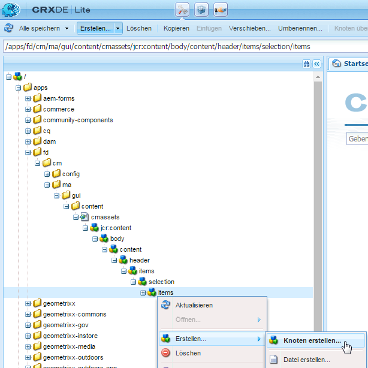
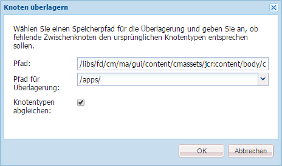
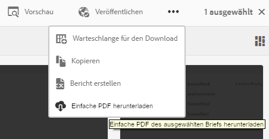
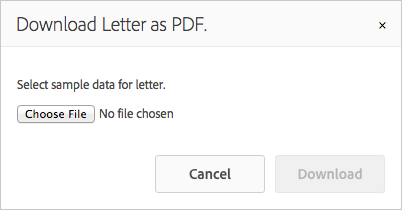

# Hinzufügen benutzerdefinierter Aktionen zur Ansicht „Asset-Auflistung“{#add-custom-action-to-the-asset-listing-view}

## Überblick {#overview}

Correspondence Management Solution ermöglicht es Ihnen, benutzerdefinierte Aktionen der Benutzeroberfläche „Assets verwalten“ hinzuzufügen.

Sie können eine benutzerdefinierte Aktion für folgende Zwecken der Ansicht „Asset-Auflistung“ hinzufügen:

* Ein oder mehr Asset-Typen oder Briefe
* Ausführung (Aktion/Befehl wird aktiv) bei Auswahl eines einzelnen Assets/Briefs oder mehrerer Assets/Briefe oder ohne Auswahl

Diese Anpassung wird anhand des Szenarios zum Hinzufügen eines Befehls „Einfache PDF herunterladen“ zur Ansicht „Asset-Auflistung“ für Briefe erläutert. Mit diesem Anpassungsszenario können Ihre Benutzer einfache PDF-Dateien eines einzelnen ausgewählten Briefs herunterladen.

### Voraussetzungen {#prerequisites}

Um das folgende oder ein diesem ähnliches Szenario abzuschließen, müssen Sie Kenntnisse über Folgendes haben:

* CRX
* JavaScript
* Java

## Szenario: Der Benutzeroberfläche mit der Liste „Briefe“ einen Befehl zum Herunterladen der einfachen PDF-Version eines Briefes hinzufügen {#addcommandtoletters}

In den nachstehenden Schritten wird der Ansicht „Asset-Auflistung“ für Briefe ein Befehl „Einfache PDF herunterladen“ hinzugefügt, mit dem Ihre Benutzer eine einfache PDF des ausgewählten Briefs herunterladen können. Indem Sie diese Schritte mit dem entsprechenden Code und den entsprechenden Parametern durchführen, können Sie andere Funktionen für ein anderes Asset hinzufügen, wie etwa Datenwörterbücher oder Texte.

Um Correspondence Management so anzupassen, dass Ihre Benutzer eine einfache PDF von Briefen herunterladen können, führen Sie folgende Schritte aus:

1. Gehen Sie zu `https://'[server]:[port]'/[ContextPath]/crx/de` und melden Sie sich als Administrator an.

1. Erstellen Sie im Ordner &quot;apps&quot;einen Ordner mit dem Namen &quot;items&quot;mit einem ähnlichen Pfad/einer ähnlichen Struktur zum Ordner &quot;items&quot;im Auswahlordner, indem Sie folgende Schritte durchführen:

   1. Klicken Sie mit der rechten Maustaste auf den Ordner **items** im folgenden Pfad und wählen Sie **Überlagerungsknoten** aus:

      `/libs/fd/cm/ma/gui/content/cmassets/jcr:content/body/content/header/items/selection/items`

      >[!NOTE]
      >
      >Dieser Pfad ist spezifisch für das Erstellen einer Aktion, die in Verbindung mit der Auswahl eines oder mehrerer Assets/Briefe funktioniert. Wenn Sie eine Aktion erstellen möchten, die ohne Auswahl funktioniert, müssen Sie stattdessen einen Überlagerungsknoten für den folgenden Pfad erstellen und die verbleibenden Schritte entsprechend durchführen:
      >
      >
      >`/libs/fd/cm/ma/gui/content/cmassets/jcr:content/body/content/header/items/default/items`

      

   1. Stellen Sie sicher, dass das Dialogfeld „Überlagerungsknoten“ die folgenden Werte enthält:

      **Pfad:**  /libs/fd/cm/ma/gui/content/cmassets/jcr:content/body/content/header/items/selection/items

      **Speicherort:** /apps/

      **Knotentypen abgleichen:** Ausgewählt

      

   1. Klicken Sie auf **OK**. Die Ordnerstruktur wird im Apps-Ordner erstellt.

      Klicken Sie auf **Alle speichern**.

1. Fügen Sie unter dem neu erstellten Ordner &quot;items&quot;einen Knoten für die benutzerdefinierte Schaltfläche/Aktion in einem bestimmten Asset hinzu (Beispiel: downloadFlatPDF) mit den folgenden Schritten:

   1. Klicken Sie mit der rechten Maustaste auf den Ordner **items** und wählen Sie **Erstellen** > **Knoten erstellen**.

   1. Stellen Sie sicher, dass das Dialogfeld „Knoten erstellen“ folgende Werte aufweist und klicken Sie auf **OK**:

      **Name:** downloadFlatPDF (oder der Name, den Sie dieser Eigenschaft geben möchten)

      **Typ:** nt:unstructured

   1. Klicken Sie auf den von Ihnen erstellten Knoten (hier: downloadFlatPDF). CRX zeigt die Eigenschaften des Knotens an.

   1. Fügen Sie dem Knoten (hier: downloadFlatPDF) die folgenden Eigenschaften hinzu und klicken Sie auf **Alle speichern**:

      <table>
        <tbody>
        <tr>
        <td><strong>Name</strong></td>
        <td><strong>Typ</strong></td>
        <td><strong>Wert und Beschreibung</strong></td>
        </tr>
        <tr>
        <td>Klasse</td>
        <td>Zeichenfolge</td>
        <td>foundation-collection-action</td>
        </tr>
        <tr>
        <td>foundation-collection-action</td>
        <td>Zeichenfolge</td>
        <td><p>{"target": ".cq-manageasset-admin-childpages", "activeSelectionCount": "single","type": "LETTER"}<br /> <br /> <br /> <strong>activeSelectionCount</strong> kann einzeln oder mehrmals sein, um die Auswahl einzelner oder mehrerer Assets zu ermöglichen, für die die benutzerdefinierte Aktion ausgeführt wird.</p> <p><strong></strong> typecan einer oder mehreren der folgenden Werte sein (Komma, der mehrere Einträge getrennt hat): LETTER,TEXT,LIST,CONDITION,DATADICTIONARY</p> </td>
        </tr>
        <tr>
        <td>icon</td>
        <td>Zeichenfolge</td>
        <td>icon-download<br /> <br /> Das Symbol, das Correspondence Management auf der linken Seite Ihres Befehls/Menüs anzeigt. Informationen zu den verfügbaren Symbolen und Einstellungen finden Sie in der <a href="https://docs.adobe.com/docs/en/aem/6-3/develop/ref/coral-ui/coralui3/Coral.Icon.html" target="_blank">CoralUI Icons-Dokumentation</a>.<br /> </td>
        </tr>
        <tr>
        <td>jcr:primaryType</td>
        <td>Name</td>
        <td>nt:unstructured</td>
        </tr>
        <tr>
        <td>rel</td>
        <td>Zeichenfolge</td>
        <td>download-flat-pdf-button</td>
        </tr>
        <tr>
        <td>sling:resourceType</td>
        <td>Zeichenfolge</td>
        <td>granite/ui/components/endor/actionbar/button</td>
        </tr>
        <tr>
        <td>text</td>
        <td>Zeichenfolge</td>
        <td>Einfache PDF herunterladen (oder eine beliebige andere Beschriftung)<br /> <br /> Der Befehl, der in der Benutzeroberfläche von „Asset-Auflistung“ angezeigt wird</td>
        </tr>
        <tr>
        <td>title</td>
        <td>Zeichenfolge</td>
        <td>Einfache PDF des ausgewählten Briefs herunterladen (oder eine beliebige andere Beschriftung/alternativer Text)<br /> <br /> Der Titel ist der alternative Text, den Correspondence Management anzeigt, wenn ein Benutzer den Mauszeiger auf den benutzerdefinierten Befehl bewegt.</td>
        </tr>
        </tbody>
       </table>

1. Erstellen Sie im Apps-Ordner einen Ordner mit dem Namen js mit einem ähnlichen Pfad/einer ähnlichen Struktur zum items-Ordner im Admin-Ordner, indem Sie folgende Schritte durchführen:

   1. Klicken Sie mit der rechten Maustaste auf den Ordner **js** im folgenden Pfad und wählen Sie **Überlagerungsknoten** aus:

      `/libs/fd/cm/ma/gui/components/admin/clientlibs/admin/js`

   1. Stellen Sie sicher, dass das Dialogfeld „Überlagerungsknoten“ die folgenden Werte enthält:

      **Pfad:**  /libs/fd/cm/ma/gui/components/admin/clientlibs/admin/js

      **Speicherort:** /apps/

      **Knotentypen abgleichen:** Ausgewählt

   1. Klicken Sie auf **OK**. Die Ordnerstruktur wird im Apps-Ordner erstellt. Klicken Sie auf **Alle speichern**.

1. Erstellen Sie im Ordner „js“ eine Datei mit dem Namen „formaction.js“ mit dem Code für Aktionsbearbeitung der Schaltfläche, indem Sie folgende Schritte durchführen:

   1. Klicken Sie mit der rechten Maustaste auf den Ordner **js** im folgenden Pfad und wählen Sie **Erstellen > Datei erstellen** aus:

      `/apps/fd/cm/ma/gui/components/admin/clientlibs/admin/js`

      Benennen Sie die Datei mit &quot;formaction.js&quot;.

   1. Doppelklicken Sie auf die Datei, um sie in CRX zu öffnen.
   1. Kopieren Sie in der Datei „formaction.js“ (unter der /apps-Verzweigung), den Code aus der Datei „formaction.js“ am folgenden Speicherort:

      `/libs/fd/cm/ma/gui/components/admin/clientlibs/admin/js/formaction.js`

      Hängen Sie dann den folgenden Code an das Ende der Datei &quot;formaction.js&quot;(unter der /apps-Verzweigung) an und klicken Sie auf **Alle speichern**:

      ```javascript
      /* Action url for xml file to be added.*/
      var ACTION_URL = "/apps/fd/cm/ma/gui/content/commons/actionhandlers/items/letterpdfdownloader.html";
      
      /* File upload handling*/
      var fileSelectedHandler = function(e){
          if(e && e.target && e.target.value)
              $(".downloadLetterPDFBtn").removeAttr('disabled');
          else
              $(".downloadLetterPDFBtn").attr('disabled','disabled');
      }
      
      /*Handing of Download button in pop up.*/
      var downloadClickHandler = function(){
          $('#downloadLetterPDFDilaog').modal("hide");
          var element = $('.foundation-selections-item');
          var path = $(element).data("path");
          $("#fileUploadForm").attr('action', ACTION_URL + "?letterId="+path).submit();
      }
      
      /*Click handling on action button.*/
      $(document).on("click",'.download-flat-pdf-button',function(e){
          $("#uploadSamepledata").val("");
           if($('#downloadLetterPDFDilaog').length == 0){
              $(document).on("click",".downloadLetterPDFBtn",downloadClickHandler);
              $(document).on("change","#uploadSamepledata",fileSelectedHandler);
              $("body").append(downloadLetterPDFDilaog);
          }
            $('#downloadLetterPDFDilaog').modal("show");
      });
      
      /*Download popup.*/
      var downloadLetterPDFDilaog = '<div id="downloadLetterPDFDilaog" class="coral-Modal notice " role="dialog"  aria-hidden="true">'+
          '<form id="fileUploadForm" method="POST" enctype="multipart/form-data">'+
              '<div class="coral-Modal-header">'+
                  '<h2 class="coral-Modal-title coral-Heading coral-Heading--2" id="modal-header1443020790107-label" tabindex="0">Download Letter as PDF.</h2>'+
                  '<button type="button" class="coral-MinimalButton coral-Modal-closeButton" data-dismiss="modal">×</button>'+
              '</div>'+
              '<div class="coral-Modal-body" id="modal-header1443020790107-message" role="document" tabindex="0">'+
                  '<div class="coral-Modal-message">'+
                      '<p></p>'+
                  '</div>'+
                  '<div class="coral-Modal-uploader">'+
                      '<p>Select sample data for letter.</p>'+
                      '<input type="file" id="uploadSamepledata" name="file" accept=".xml" size="70px">'+
                  '</div>'+
              '</div>'+
           '</form>'+
              '<div class="coral-Modal-footer">'+
                  '<button type="button" class="coral-Button" data-dismiss="modal">Cancel</button>'+
                  '<button type="button" class="coral-Button coral-Button--primary downloadLetterPDFBtn" disabled="disabled">Download</button>'+
              '</div>'+
      '</div>';
      ```

      Der von Ihnen in diesem Schritt hinzugefügte Code überschreibt den Code unter dem Ordner „libs“. Kopieren Sie also den vorherigen Code in die Datei „formaction.js“ in der /apps-Verzweigung. Durch das Kopieren des Codes von der /libs-Verzweigung in die /apps-Verzweigung wird sichergestellt, dass die vorherigen Funktionen ebenfalls funktionieren.

      Der oben genannte Code ist für die briefspezifische Aktionsbearbeitung des in diesem Verfahren erstellten Befehls vorgesehen. Zur Aktionsbearbeitung anderer Assets müssen Sie den JavaScript-Code ändern.

1. Erstellen Sie im Ordner &quot;apps&quot;einen Ordner mit dem Namen &quot;items&quot;mit einem ähnlichen Pfad/einer ähnlichen Struktur zum Ordner &quot;items&quot;im Ordner &quot;actionhandlers&quot;, indem Sie folgende Schritte durchführen:

   1. Klicken Sie mit der rechten Maustaste auf den Ordner **items** im folgenden Pfad und wählen Sie **Überlagerungsknoten** aus:

      `/libs/fd/cm/ma/gui/content/commons/actionhandlers/items/`

   1. Stellen Sie sicher, dass das Dialogfeld „Überlagerungsknoten“ die folgenden Werte enthält:

      **Pfad:** /libs/fd/cm/ma/gui/content/commons/actionhandlers/items/

      **Speicherort:** /apps/

      **Knotentypen abgleichen:** Ausgewählt

   1. Klicken Sie auf **OK**. Die Ordnerstruktur wird im Apps-Ordner erstellt.

   1. Klicken Sie auf **Alle speichern**.

1. Fügen Sie unter dem neu erstellten Knoten &quot;items&quot;einen Knoten für die benutzerdefinierte Schaltfläche/Aktion in einem bestimmten Asset hinzu (Beispiel: letterpdfdownloader) verwenden, die die folgenden Schritte ausführen:

   1. Klicken Sie mit der rechten Maustaste auf den Ordner „items“ und wählen Sie **Erstellen > Knoten erstellen**.

   1. Stellen Sie sicher, dass das Dialogfeld „Knoten erstellen“ folgende Werte aufweist und klicken Sie auf **OK**:

      **Name:** letterpdfdownloader (oder der Name, den Sie dieser Eigenschaft geben möchten - muss eindeutig sein. Wenn Sie hier einen anderen Namen verwenden, geben Sie denselben auch in der Variablen ACTION_URL der Datei &quot;formaction.js&quot;an.)

      **Typ:** nt:unstructured

   1. Klicken Sie auf den von Ihnen erstellten Knoten (hier: downloadFlatPDF). CRX zeigt die Eigenschaften des Knotens an.

   1. Fügen Sie dem Knoten (hier: letterpdfdownloader) die folgenden Eigenschaften hinzu und klicken Sie auf **Alle speichern**:

      | **Name** | **Typ** | **Wert** |
      |---|---|---|
      | sling:resourceType | Zeichenfolge | fd/cm/ma/gui/components/admin/clientlibs/admin |

1. Erstellen Sie eine Datei mit dem Namen POST.jsp mit dem Code für die Aktionsbearbeitung des Befehls am folgenden Speicherort:

   /apps/fd/cm/ma/gui/components/admin/clientlibs/admin

   1. Klicken Sie mit der rechten Maustaste auf den Ordner **admin** im folgenden Pfad und wählen Sie **Erstellen > Datei erstellen** aus:

      /apps/fd/cm/ma/gui/components/admin/clientlibs/admin

      Benennen Sie die Datei als „POST.jsp“. (Der Dateiname darf nur „POST.jsp“ lauten.)

   1. Doppelklicken Sie auf die Datei **POST.jsp**, um sie in CRX zu öffnen.
   1. Fügen Sie der Datei „POST.jsp“ folgenden Code hinzu und klicken Sie auf **Alle speichern**:

      Dieser Code ist spezifisch für den Brief-Wiedergabedienst. Bei allen anderen Assets müssen Sie diesem Code die Java-Bibliotheken dieses Assets hinzufügen. Weitere Informationen zu AEM Forms-APIs finden Sie unter [AEM Forms-API](https://adobe.com/go/learn_aemforms_javadocs_63_en).

      Weitere Informationen zu AEM-Bibliotheken finden Sie unter den AEM-[Komponenten](/help/sites-developing/components.md).

      ```xml
      /*Import libraries. Here we are downloading letter flat pdf with input xml data so we require letterRender Api. For any other Module functionality we need to first import that library. */
      <%@include file="/libs/foundation/global.jsp"%>
      <!DOCTYPE html lang="en" PUBLIC "-//W3C//DTD XHTML 1.1//EN" "https://www.w3.org/TR/xhtml11/DTD/xhtml11.dtd">
      <%@page import="com.adobe.icc.ddg.api.*"%>
      <%@page import="com.adobe.icc.dbforms.obj.*"%>
      <%@page import="com.adobe.icc.render.obj.*" %>
      <%@page import="com.adobe.icc.services.api.*" %>
      <%@page import="org.apache.sling.api.resource.*" %>
      <%@page import="java.io.File" %>
      <%@page import="java.util.*" %>
      <%@page import="com.adobe.livecycle.content.appcontext.AppContextManager"%>
      <%@page import=" com.adobe.icc.dbforms.exceptions.ICCException"%>
      <%@page import="java.io.InputStream" %>
      <%@page import="java.io.FileInputStream" %>
      <%@page import="org.apache.commons.io.IOUtils" %>
      <%@page session="false" contentType="text/html; charset=utf-8"%>
      <%@taglib prefix="sling" uri="https://sling.apache.org/taglibs/sling/1.0"%>
      <%@taglib prefix="cq" uri="https://www.day.com/taglibs/cq/1.0" %>
       <%@page session="false" contentType="text/html; charset=utf-8"%>
      <%
         AppContextManager.setCurrentAppContext("/content/apps/cm");
         /*Get letter id sent in js file.*/
          String letterId = request.getParameter("letterId");
          if(letterId.lastIndexOf("?") != -1)
              letterId = letterId.substring(0, letterId.indexOf("?"));
          String fileName = null;
          String letterName = null;
          InputStream inputStream = null;
          /*Get xml file data*/
          if (slingRequest.getRequestParameter("file") != null)
              inputStream = slingRequest.getRequestParameter("file").getInputStream();
          if(letterId != null){
              String xmlData = null;
              try{
                  xmlData = IOUtils.toString(inputStream, "UTF-8");
              }
              catch (Exception e) {
                  log.error("Xml data does not exists.");
              }
              /*letter Name from letter letter id.*/
              letterName = letterId.substring(letterId.lastIndexOf("/")+1);
              /*Invoking letter render services API.*/
              LetterRenderService letterRenderService = sling.getService(LetterRenderService.class);
              /*using CM renderLetter api to get pdfbytes.*/
              PDFResponseType  pdfResponseType= letterRenderService.renderLetter(letterId,xmlData,true,false,false,false);
              byte[] bytes = null;
              /*Downloading pdf bytes as pdf.*/
              if(pdfResponseType != null && pdfResponseType.getFile() != null){
                  bytes = pdfResponseType.getFile().getDocument();
                  /*set the response header to enable download*/
                  response.setContentType("application/OCTET-STREAM");
                  response.setHeader("Content-Disposition", "attachment;filename=\"" + letterName + ".pdf\"");
                  response.setHeader("Pragma", "cache");
                  response.setHeader("Cache-Control", "private");
                  out.clear();
                  response.getOutputStream().write(bytes);
              }
          }
          else{
              log.error("Letter id does not exists.");
          }
      %>
      ```

## Herunterladen einer einfachen PDF eines Briefs mithilfe von benutzerdefinierten Funktionen {#download-flat-pdf-of-a-letter-using-the-custom-functionality}

Nachdem Sie eine benutzerdefinierte Funktion zum Herunterladen einer einfachen PDF Ihrer Briefe hinzugefügt haben, können Sie eine einfache PDF-Version des von Ihnen ausgewählten Briefs herunterladen, indem Sie folgende Schritte durchführen:

1. Gehen Sie zu `https://'[server]:[port]'/[ContextPath]/projects.html` und melden Sie sich an.

1. Wählen Sie **Formulare > Briefe**. Correspondence Management listet die im System verfügbaren Briefe auf.
1. Klicken Sie auf **Wählen Sie** und klicken Sie dann auf einen Brief, um ihn auszuwählen.
1. Wählen Sie **Mehr** > **&lt;Flat PDF herunterladen>** (Die benutzerdefinierte Funktion, die mit den Anweisungen in diesem Artikel erstellt wurde). Das Dialogfeld „Brief als PDF herunterladen“ wird angezeigt.

   Der Name, die Funktionalität und der Alternativtext des Menüelements entsprechen der unter [Szenario erstellten Anpassung: Fügen Sie der Benutzeroberfläche der Liste &quot;Briefe&quot;einen Befehl hinzu, um eine einfache PDF-Version eines Briefs herunterzuladen.](#addcommandtoletters)

   

1. Wählen Sie im Dialogfeld Brief als PDF herunterladen die relevante XML-Datei aus, aus der Sie die Daten in der PDF-Datei ausfüllen möchten.

   >[!NOTE]
   >
   >Bevor Sie den Brief als einfache PDF herunterladen, können Sie die XML-Datei mit den Daten im Brief mit der Option **Bericht erstellen** erstellen.

   

   Der Brief wird als einfache PDF auf Ihren Computer heruntergeladen.
