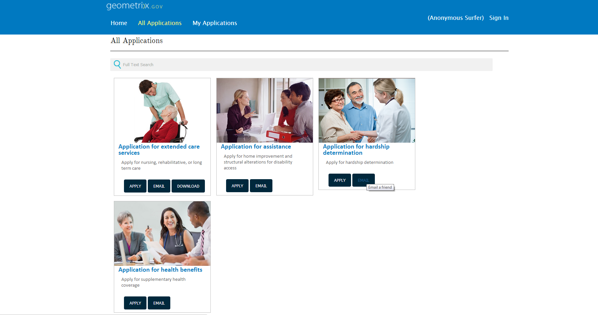

# Hinzufügen benutzerdefinierter Aktionen zu Elementen im Formularauflister{#adding-custom-action-on-form-lister-items}

In AEM Forms können Sie eine Portalseite erstellen, in der die verfügbaren Formulare aufgelistet werden. Standardmäßig können Sie Formulare auf einer Portalseite suchen und auflisten. Sie können Formulare zum Ausfüllen öffnen und Ihre Angaben übermitteln. Bei Formularen, die auf einer Portalseite gelistet sind, stehen für den sofortigen Einsatz nur Render-Aktionen zur Verfügung. Weitere Informationen über die verfügbaren Aktionen auf einer Portalseite finden Sie unter [Erstellen einer Forms Portal-Seite](../../forms/using/creating-form-portal-page.md).

Sie können der Portalseite weitere Optionen hinzufügen. Diese Optionen bzw. Aktionen können angepasst werden, indem die Formularportal-Vorlage angepasst wird.

In diesem Artikel wird beschrieben, wie Sie eine Schaltfläche erstellen, um den Link eines Formulars direkt von einer Formularportalseite zu senden. Diese Anpassung erfordert eine Aktualisierung der Vorlage für die Komponente „Suche und Auflister“.

Der erforderliche Code zum Hinzufügen der Aktion zur Vorlage ist unten zu finden. Das `onclick`-Attribut im Codebeispiel enthält ein Skript, um die Verknüpfung eines Formulars per E-Mail zu senden.

```html
<div class="__FP_boxes-container __FP_single-color">
    <div class="boxes __FP_boxes __FP_single-color" data-repeatable="true">
  <div class="__FP_boxes-thumbnail">
            
        </div>
        <h3 class="__FP_single-color" title="${name}" tabindex="0">${name}</h3>
        <p>${description}</p>
        <div class="boxes-icon-cont __FP_boxes-icon-cont">
            <div class="op-dow">
                <a href="${formUrl}" target="_blank" class="__FP_button ${htmlStyle}" title="${config-htmlLinkText}">Apply</a>
                <a class="__FP_button" title="Email a friend" href="#" onclick="javascript:window.location=&apos;mailto:?subject=Interesting information&body=I thought you might find {name} form helpful :  &apos;+window.location.protocol+window.location.host+&apos;${formUrl}&apos; ;">Email</a>
                <a href="${pdfUrl}" class="__FP_button ${pdfStyle}" title="${config-pdfLinkText}">Download</a>
            </div>
        </div>
    </div>
</div>
```

Sie können ähnliche Aktionen in Ihrer benutzerdefinierten Vorlage hinzufügen. Um eine JavaScript-Funktion zu definieren, fügen Sie die Funktion in einem Skript auf Seitenebene hinzu und verknüpfen Sie sie mit dem erforderlichen HTML-Element. Im Beispiel oben ist der `onclick`-Ausdruck die verknüpfte Funktion.

Nachdem Sie die Änderungen an der Vorlage vorgenommen haben, enthält die Portal-Beispielseite, wie nachfolgend in der Abbildung dargestellt, eine Schaltfläche, um die Verknüpfung des Formulars per E-Mail zu senden.


