# Fügen Sie benutzerdefinierte Eigenschaften den Correspondence Management-Assets hinzu{#add-custom-properties-to-correspondence-management-assets}

## Übersicht {#overview}

Sie können die Benutzeroberfläche von Correspondence Management anpassen und Benutzern einen maßgeschneiderten Satz von Eigenschaften und Registerkarten präsentieren. Diese Anpassung beinhaltet das Hinzufügen benutzerdefinierter Felder/Eigenschaften und Registerkarten zu bestimmten Assettypen/Briefen oder zu allen Assettypen und Briefen.

## Hinzufügen benutzerdefinierter Eigenschaften zu Correspondence Management-Assets {#adding-custom-properties-to-correspondence-management-assets}

Die folgenden Szenarien zeigen, wie Sie Eigenschaften/Registerkarten zu Correspondence Management-Assets und -Briefen hinzufügen können:

* Hinzufügen einer gemeinsamen Eigenschaft zu allen Asset-Typen
* Hinzufügen einer gemeinsamen Registerkarte zu allen Asset-Typen
* Hinzufügen benutzerdefinierter Eigenschaften zu bestimmten Asset-Typen

Wenn Sie die Eigenschaften, Pfade und Werte in diesen Szenarien anpassen, können Sie benutzerdefinierte Eigenschaften und Registerkarten zu einem anderen Asset-Satz hinzufügen, der Ihren Anforderungen entspricht.

### Szenario: Hinzufügen eines gemeinsamen Felds (Eigenschaft) zu allen Asset-Typen {#scenario-adding-a-common-field-property-to-all-the-asset-types}

Dieses Szenario zeigt, wie Sie eine benutzerdefinierte Eigenschaft zu allen Asset-Typen (Text, Liste, Bedingung und Layout-Fragmente) und den Briefen hinzufügen können. Mithilfe dieses Szenarios können Sie eine Eigenschaft, nämlich den Ort der Empfänger, allen Assets und Briefen hinzufügen. Die Eigenschaft des Orts des Empfängers dient zur Identifizierung des geografischen Gebiets, das für die Bereitstellung eines Assets oder Briefes relevant ist.

>[!NOTE]
>
>Wenn Sie bereits eine benutzerdefinierte Eigenschaft hinzugefügt haben, wird die Eigenschaft auf der Seite zur Asset-Erstellung angezeigt. Informationen zum Ausblenden einer solchen Eigenschaft finden Sie unter Einblenden/Ausblenden benutzerdefinierter Eigenschaften auf den Seiten &quot;Asset-Erstellung&quot;und &quot;Eigenschaften&quot;.

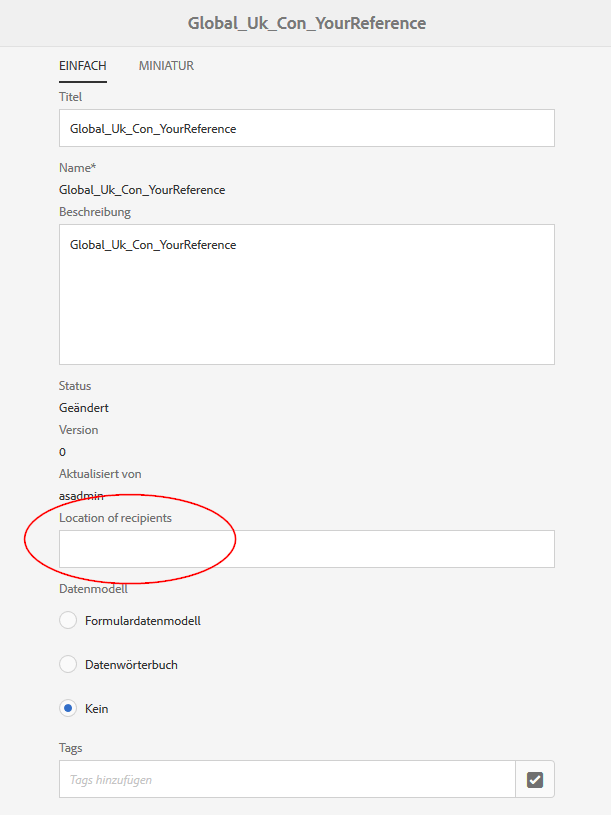

Führen Sie die folgenden Schritte aus, um eine benutzerdefinierte Eigenschaft zu allen Assettypen und Briefen hinzuzufügen:

1. Wechseln Sie zu `https://'[server]:[port]'/[ContextPath]/crx/de` und melden Sie sich als „Administrator“ an.
1. Erstellen Sie im Apps-Ordner einen Ordner mit dem Namen css mit einem ähnlichen Pfad/einer ähnlichen Struktur wie der css-Ordner (im ccrui-Ordner), indem Sie folgende Schritte durchführen:

   1. Klicken Sie mit der rechten Maustaste auf den Elementordner in folgendem Pfad und wählen Sie **Überlagerungsknoten**:

      `/libs/fd/cm/ma/gui/content/cmmetadataproperties/commonproperties/col1/items`

      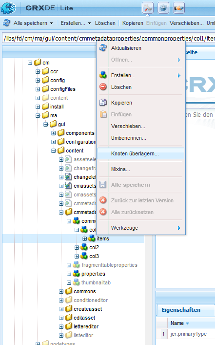

   1. Stellen Sie sicher, dass das Dialogfeld „Überlagerungsknoten“ die folgenden Werte enthält:

      **Pfad:** /libs/fd/cm/ma/gui/content/cmmetadataproperties/commonproperties/col1/items

      **Speicherort**: /apps/

      **Knotentypen abgleichen**: Ausgewählt

      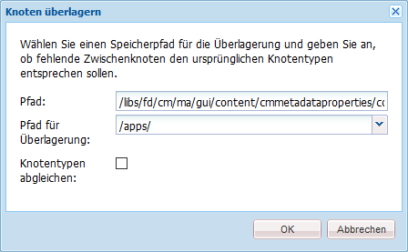

   1. Klicken Sie auf **OK**. Die Ordnerstruktur wird im Apps-Ordner erstellt.

   1. Klicken Sie auf **Alle speichern**.

1. Fügen Sie unter dem neu erstellten Elementordner einen Knoten für die benutzerdefinierte Eigenschaft bei allen Assets hinzu (Beispiel: GeoLocation), indem Sie die folgenden Schritte ausführen:

   1. Klicken Sie mit der rechten Maustaste auf den Ordner items und wählen Sie **Erstellen** > **Knoten erstellen**.

      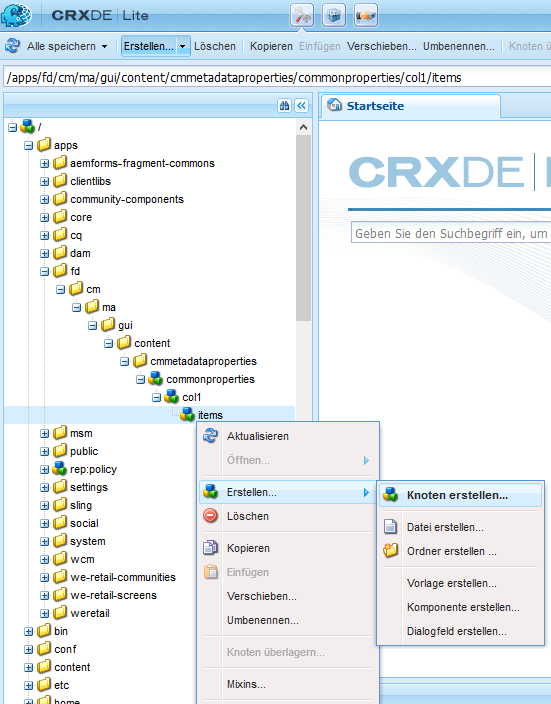

   1. Stellen Sie sicher, dass das Dialogfeld „Knoten erstellen“ folgende Werte aufweist und klicken Sie auf **OK**:

      **Name:** GeoLocation (oder der Name, den Sie dieser Eigenschaft geben möchten)

      **Typ:** nt:unstructured

      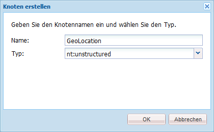

   1. Klicken Sie auf den neuen Knoten, den Sie erstellt haben (hier: GeoLocation). CRX zeigt die Eigenschaften des Knotens an.
   1. Fügen Sie dem Knoten (hier GeoLocation) die folgenden Eigenschaften hinzu:

      | **Name** | **Typ** | **Wert** |
      |---|---|---|
      | fieldLabel | Zeichenfolge | Der Name, den Sie dem Feld/der Eigenschaft geben möchten. (Hier: Ort der Empfänger) |
      | name | Zeichenfolge | `./extendedproperties/GeoLocation` (Verwenden Sie denselben Wert wie bei dem Feldnamen, den Sie unter dem Knoten „items“ erstellt haben) |
      | renderReadOnly | Boolesch | Ja |
      | sling:resourceType | Zeichenfolge | `granite/ui/components/coral/foundation/form/textfield` |

   1. Klicken Sie auf **Alle speichern**.

1. Um Ihre Anpassung anzuzeigen, bewegen Sie den Mauszeiger über ein Asset (Text, Liste, Bedingung oder Layout-Fragment) oder einen Brief, klicken Sie auf **Eigenschaften anzeigen** und klicken Sie auf **Bearbeiten**. Das neue Feld (Ort der Empfänger) wird auf der Registerkarte Allgemein in den Asset-/Briefeigenschaften angezeigt.

   >[!NOTE]
   >
   >Möglicherweise müssen Sie den Browser-Cache löschen, bevor Ihre Anpassung in der Benutzeroberfläche angezeigt wird.

   

   >[!NOTE]
   >
   >Die allgemeinen Eigenschaften für alle von Ihnen hinzugefügten Assets werden auf der Registerkarte &quot;Standard&quot;der Asset-Eigenschaften angezeigt. Standardmäßig werden die allgemeinen Eigenschaften, die für alle Assets hinzugefügt werden, auf der Seite &quot;Eigenschaften&quot;und auf der Seite zur Asset-Erstellung angezeigt. Um die allgemeinen Eigenschaften auszublenden, müssen Sie <!--link to show / hide properties]-->.

### Szenario: Benutzerdefinierte Dropdown-Liste und Werte zu einer benutzerdefinierten Eigenschaft/einem benutzerdefinierten Feld hinzufügen {#scenario-add-custom-drop-down-and-values-to-a-custom-property-field}

Dieses Szenario zeigt, wie Sie eine benutzerdefinierte Eigenschaft zu allen Asset-Typen hinzufügen und ihnen Dropdown-Werte hinzufügen können.

1. Klicken Sie mit der rechten Maustaste auf den Elementordner an folgendem Speicherort und wählen Sie **Überlagerungsknoten** aus:

   `/libs/fd/cm/ma/gui/content/cmmetadataproperties/commonproperties/col1/items`

1. Im neu erstellten Überlagerungsknoten (/apps/fd/cm/ma/gui/content/cmmetadataproperties/commonproperties/col1/items) 
Erstellen Sie einen Knoten für jede Eigenschaft (Felder), für die Sie ein Dropdown-Menü (hier `geographicallocation` ) des Typs nt:unstructured erstellen möchten.
1. Fügen Sie dem Knoten (hier: geographicallocation) die folgenden Eigenschaften hinzu und klicken Sie auf **Alle speichern**:

   <table>
   <tbody>
   <tr>
      <td><strong>Name</strong></td>
      <td><strong>Typ</strong></td>
      <td><strong>Wert</strong></td>
   </tr>
   <tr>
      <td>fieldLabel</td>
      <td>Zeichenfolge</td>
      <td>Der Name, den Sie dem Feld/der Eigenschaft geben möchten. (Hier: geographicallocation)</td>
   </tr>
   <tr>
      <td>name</td>
      <td>Zeichenfolge</td>
      <td>./extendedproperties/geographicallocation (Verwenden Sie denselben Wert wie für den Feldnamen, den Sie unter dem items-Knoten erstellt haben)</td>
   </tr>
   <tr>
      <td>renderReadOnly</td>
      <td>Boolesch</td>
      <td>Ja</td>
   </tr>
   <tr>
      <td>sling:resourceType</td>
      <td>Zeichenfolge</td>
      <td>granite/ui/components/coral/foundation/form/select<br /> </td>
   </tr>
   </tbody>
   </table>

1. Fügen Sie unter dem property-Knoten (hier geographicallocation) einen neuen Knoten mit dem Namen `items` hinzu. Fügen Sie unter dem Knoten items jeweils einen Knoten für die Werte in der Dropdown-Liste hinzu. Als Best Practice empfiehlt es sich, den ersten Knoten als leer hinzuzufügen, um als Standardwert der Dropdown-Liste zu dienen, und dem Benutzer die Option, keinen Wert für das Feld anzugeben. Um mehrere Optionen/Dropdown-Werte hinzuzufügen, wiederholen Sie die folgenden Schritte:

   1. Klicken Sie auf den property-Knoten, (hier: geographicallocation) mit der rechten Maustaste und wählen Sie **Erstellen** > **Knoten erstellen**.
   1. Geben Sie `item1,` als Namen des Felds ein, behalten Sie als Typ „nt:unstructured“ bei und klicken Sie auf **OK**.
   1. Fügen Sie die folgenden Eigenschaften dem neu erstellten Knoten (hier: item1) hinzu und klicken Sie auf **Alle speichern**:

      <table>
         <tbody>
         <tr>
          <td><strong>Name</strong></td>
          <td><strong>Typ</strong></td>
          <td><strong>Wert</strong></td>
         </tr>
         <tr>
          <td>text</td>
          <td>Zeichenfolge</td>
          <td>Dies ist der Wert der Dropdown-Option, die für den Benutzer sichtbar ist. Leer lassen für den leeren (Standardwert) Wert oder geben Sie den Wert ein, z. B. <strong>International</strong> oder <strong>Innerhalb der USA</strong>.<br /> </td>
         </tr>
         <tr>
          <td>value</td>
          <td>Zeichenfolge</td>
          <td>Wert gespeichert in CRXDE für den Text. Geben Sie einen beliebigen eindeutigen Suchbegriff ein. <br /> </td>
         </tr>
         </tbody>
   </table>

   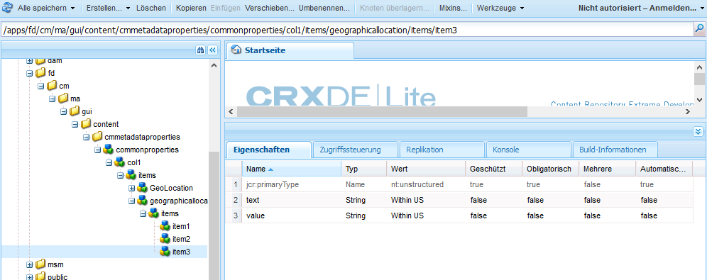

Das benutzerdefinierte Dropdown-Menü wird als nächstes in den Asset-Eigenschaften angezeigt:

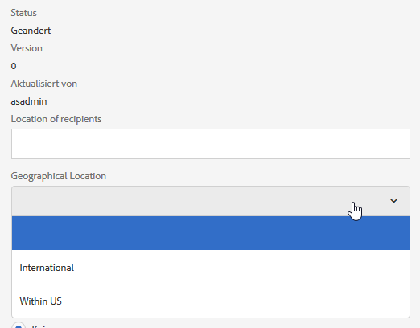

### Szenario: Registerkarte &quot;Allgemein&quot;für alle Asset-Typen {#scenario-common-tab-for-all-asset-types}

Dieses Szenario zeigt, wie Sie eine benutzerdefinierte Registerkarte, Empfänger, zu allen Asset-Typen (Text, Liste, Bedingung und Layout-Fragmente) und den Briefen hinzufügen können. Im Tab Empfänger können Sie alle benutzerdefinierten Eigenschaften festlegen, die für die Empfänger relevant sind.


Mithilfe des folgenden Verfahrens können Sie eine Registerkarte mit einem Feld zu allen Assets hinzufügen:

1. Wechseln Sie zu `https://'[server]:[port]'/[ContextPath]/crx/de` und melden Sie sich als Administrator an.
1. Erstellen Sie im Apps-Ordner einen Ordner mit dem Namen cmmetadataproperties mit einem ähnlichen Pfad/einer ähnlichen Struktur zum Ordner cmmetadataproperties (im Inhaltsordner), indem Sie folgende Schritte durchführen:

   1. Klicken Sie mit der rechten Maustaste auf den Ordner „cmmetadataproperties“ im folgenden Pfad und wählen Sie **Überlagerungsknoten**:

      `/libs/fd/cm/ma/gui/content/cmmetadataproperties`

      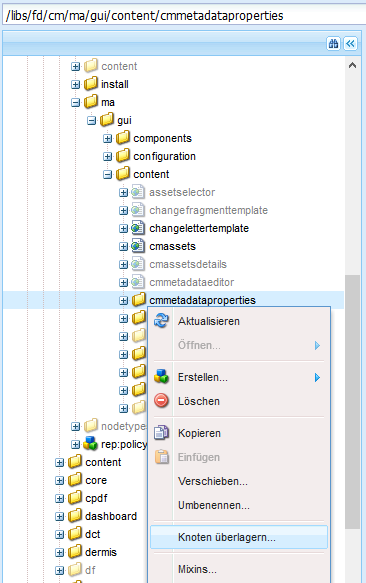

   1. Stellen Sie sicher, dass das Dialogfeld „Überlagerungsknoten“ die folgenden Werte enthält:

      **Pfad**: /libs/fd/cm/ma/gui/content/cmmetadataproperties

      **Speicherort**: /apps/

      **Übereinstimmende Knotentypen:** Ausgewählt

   1. Klicken Sie auf **OK**. Die Ordnerstruktur wird im Apps-Ordner erstellt.

      

      Klicken Sie auf **Alle speichern**.

1. Fügen Sie unter dem Ordner „cmmetadataproperties“ einen Knoten für die Erstellung einer benutzerspezifischen Registerkarte für alle Assets hinzu (Beispiel: commontab), indem Sie die folgenden Schritte ausführen:

   1. Klicken Sie mit der rechten Maustaste auf den Ordner cmmetadataproperties und wählen Sie **Erstellen** > **Knoten erstellen**.

      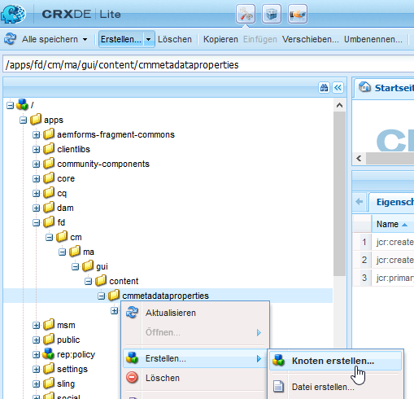

   1. Stellen Sie sicher, dass das Dialogfeld „Knoten erstellen“ folgende Werte aufweist und klicken Sie auf **OK**:

      **Name**: commontab (oder der Name, den Sie dieser Eigenschaft geben möchten)

      **Typ:** nt:unstructured

   1. Klicken Sie auf den neuen Knoten, den Sie erstellt haben (hier: commontab). CRX zeigt die Eigenschaften des Knotens an.
   1. Fügen Sie folgende Eigenschaften dem Knoten hinzu (hier: commontab):

      <table>
         <tbody>
         <tr>
          <td><strong>Name</strong></td>
          <td><strong>Typ</strong></td>
          <td><strong>Wert</strong></td>
         </tr>
         <tr>
          <td>jcr:title</td>
          <td>Zeichenfolge</td>
          <td>Der Name, den Sie der Spalte geben möchten. (Hier: Empfänger)</td>
         </tr>
         <tr>
          <td>sling:resourceType</td>
          <td>Zeichenfolge</td>
          <td>granite/ui/components/coral/foundation/container<br /> </td>
   </tr>
         </tbody>
       </table>

   1. Klicken Sie auf **Alle speichern**.

1. Erstellen Sie für den im letzten Schritt erstellten Registerkarten-Knoten (hier &quot;commontab&quot;) einen Knoten namens item mithilfe des folgenden Schritts:

   1. Klicken Sie auf den entsprechenden Knoten (hier: commontab) mit der rechten Maustaste und wählen Sie **Erstellen** > **Knoten erstellen**.
   1. Stellen Sie sicher, dass das Dialogfeld „Knoten erstellen“ folgende Werte aufweist, und klicken Sie auf **OK**:

      **Name:** items

      **Typ:** nt:unstructured

   1. Klicken Sie auf **Alle speichern:**

1. Im item-Knoten, den Sie im vorherigen Schritt (unter commontab) erstellt haben, fügen Sie einen Knoten für die Erstellung einer Spalte (hier: Column1) auf der benutzerdefinierten Registerkarte (commontab) mit folgenden Schritten hinzu (um weitere Spalten hinzuzufügen, wiederholen Sie diesen Schritt):

   1. Klicken Sie mit der rechten Maustaste auf den Knoten items und wählen Sie **Erstellen** > **Knoten erstellen**.
   1. Stellen Sie sicher, dass das Dialogfeld „Knoten erstellen“ folgende Werte aufweist, und klicken Sie auf **OK**:

      **Name:** Column1 (oder der Name, den Sie dem Knoten geben möchten – dieser Name wird nicht in der Benutzeroberfläche angezeigt.)

      **Typ:** nt:unstructured

   1. Fügen Sie dem Knoten (hier: Column1) die folgenden Eigenschaften hinzu und klicken Sie auf **Alle speichern**:

      <table>
         <tbody>
         <tr>
           <td><strong>Name</strong></td>
           <td><strong>Typ</strong></td>
           <td><strong>Wert</strong></td>
         </tr>
         <tr>
           <td>sling:resourceType</td>
           <td>Zeichenfolge</td>
           <td>granite/ui/components/coral/foundation/container<br /> </td>
         </tr>
         </tbody>
       </table>

1. Fügen Sie im Knoten, den Sie im vorherigen Schritt (hier Column1) erstellt haben, anhand der folgenden Schritte einen Knoten namens „items“ hinzu:

   1. Klicken Sie mit der rechten Maustaste auf den Knoten (hier Column1) und wählen Sie **Erstellen** > **Knoten erstellen**.
   1. Stellen Sie sicher, dass das Dialogfeld „Knoten erstellen“ folgende Werte aufweist, und klicken Sie auf **OK**:

      **Name:** items

      **Typ:** nt:unstructured

   1. Klicken Sie auf **Alle speichern**.

1. Um ein Feld auf der benutzerdefinierten Registerkarte (hier Empfänger) zu erstellen, fügen Sie einen Knoten hinzu (hier GeographicalLocation). Diese Eigenschaft entspricht der von Ihnen erstellten Spalte. Führen Sie die folgenden Schritte aus, um das Feld zu erstellen (um weitere Felder/Knoten zu erstellen, wiederholen Sie diese Schritte.):

   1. Klicken Sie mit der rechten Maustaste auf den Knoten items und wählen Sie **Erstellen** > **Knoten erstellen**.
   1. Stellen Sie sicher, dass das Dialogfeld „Knoten erstellen“ folgende Werte aufweist, und klicken Sie auf **OK**:

      **Name:** GeographicalLocation (oder ein anderer Name für die Feldeigenschaft)

      **Typ:** nt:unstructured

   1. Fügen Sie die folgenden Eigenschaften zum Feldknoten (hier GeographicalLocation) hinzu und klicken Sie auf **Alle speichern**.

      | **Name** | **Typ** | **Wert** |
      |---|---|---|
      | fieldLabel | Zeichenfolge | Speicherort der Empfänger (oder der Name, den Sie dem Feld geben möchten.) |
      | name | Zeichenfolge | ./extendedproperties/GeographicalLocation |
      | renderReadOnly | Boolesch | Ja |
      | sling:resourceType | Zeichenfolge | `/libs/granite/ui/components/coral/foundation/form/textfield` |

1. Um diese Registerkarte für Briefe hinzuzufügen, erstellen Sie einen Überlagerungsordner mit dem Pfad/der Struktur ähnlich dem folgenden items-Ordner unter folgendem Pfad:

   `/libs/fd/cm/ma/gui/content/cmmetadataproperties/properties/letter/items/tabs/items`

   Um eine Überlagerung für einen Brief oder ein anderes Asset zu erstellen, verwenden Sie den folgenden Pfad, indem Sie [assettype] durch Text, Bedingung, Liste, Datenwörterbuch oder Fragment ersetzen:

   `/libs/fd/cm/ma/gui/content/cmmetadataproperties/properties/[assettype]/items/tabs/items`

   1. Klicken Sie mit der rechten Maustaste auf den Elementordner an folgendem Speicherort und wählen Sie **Überlagerungsknoten**:

      `/libs/fd/cm/ma/gui/content/cmmetadataproperties/properties/letter/items/tabs/items`

   1. Stellen Sie sicher, dass das Dialogfeld „Überlagerungsknoten“ die folgenden Werte enthält:

      **Pfad:** `/libs/fd/cm/ma/gui/content/cmmetadataproperties/properties/letter/items/tabs/items`

      **Speicherort:** /apps/

      **Übereinstimmende Knotentypen:** Ausgewählt

   1. Klicken Sie auf **OK**. Der Ordner wird erstellt. Klicken Sie auf **Alle speichern**.

1. Fügen Sie im neu erstellten Ordner „items“ einen Knoten für die benutzerdefinierte Registerkarte im Asset (hier: mytab - dieser Name wird nicht auf der Benutzeroberfläche gezeigt) hinzu, indem Sie folgende Schritte verwenden:

   1. Klicken Sie mit der rechten Maustaste auf den Ordner items und wählen Sie **Erstellen** > **Knoten erstellen**.
   1. Stellen Sie sicher, dass das Dialogfeld „Knoten erstellen“ folgende Werte aufweist, und klicken Sie auf **OK**:

      **Name:** mytab (oder der Name, den Sie dieser Eigenschaft geben möchten)

      **Typ:** nt:unstructured

   1. Klicken Sie auf den neuen Knoten, den Sie erstellt haben (hier mytab). CRX zeigt die Eigenschaften des Knotens an.
   1. Fügen Sie die folgenden zwei Eigenschaften zum Knoten hinzu (hier customtab):

      <table>
         <tbody>
         <tr>
           <td><strong>Name</strong></td>
           <td><strong>Typ</strong></td>
           <td><strong>Wert</strong></td>
         </tr>
         <tr>
           <td>path<br /> </td>
           <td>Zeichenfolge</td>
           <td>fd/cm/ma/gui/content/cmmetadataproperties/commontab<br /> </td>
         </tr>
         <tr>
           <td>sling:resourceType</td>
           <td>Zeichenfolge</td>
           <td>granite/ui/components/coral/foundation/include<br /> </td>
         </tr>
         </tbody>
       </table>

   1. Klicken Sie auf **Alle speichern**.

1. Um Ihre Anpassung anzuzeigen, bewegen Sie den Mauszeiger über das relevante Asset (hier ein Brief), klicken Sie auf Eigenschaften anzeigen und klicken Sie auf **Bearbeiten**. Die neue Registerkarte (Empfänger) und das Feld (Ort der Empfänger) werden in der Benutzeroberfläche angezeigt.

   >[!NOTE]
   >
   >Möglicherweise müssen Sie den Browser-Cache löschen, bevor Ihre Anpassung in der Benutzeroberfläche angezeigt wird.

   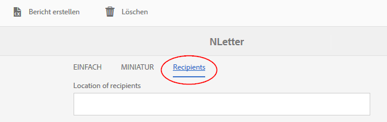

### Szenario: Hinzufügen benutzerdefinierter Eigenschaften für bestimmte Asset-Typen {#scenario-adding-custom-properties-for-specific-asset-types}

Dieses Szenario zeigt, wie Sie eine Eigenschaft zu einem bestimmten Asset-Typ hinzufügen können, z. B. ein Feld zu allen Text-Assets. Mithilfe dieses Prozesses können Sie einer der folgenden Eigenschaften hinzufügen:

* Text
* Bedingung
* Liste
* Layout-Fragment
* Datenwörterbuch
* Brief

Sie möchten z. B. nur zu den Text-Assets eine Eigenschaft, nämlich den Ort der Empfänger, hinzufügen, um zu ermitteln, für welches geografische Gebiet ein Asset relevant ist. 

Um eine Eigenschaft einem Assettyp hinzuzufügen, führen Sie die folgenden Schritte aus:

1. Wechseln Sie zu `https://'[server]:[port]'/[ContextPath]/crx/de` und melden Sie sich als Administrator an.
1. Um eine Registerkarte in einem Asset-Typ zu erstellen (z. B. Text), erstellen Sie die folgende Ordnerstruktur im Programmordner:

   `/libs/fd/cm/ma/gui/content/cmmetadataproperties/properties/[AssetType]/items/tabs/items`

   [AssetType] = Text, Bedingung, Liste, Brief, Datenwörterbuch oder Fragment

   Führen Sie die folgenden Schritte aus, um diese Ordnerstruktur zu erstellen:

   1. Klicken Sie mit der rechten Maustaste auf den Ordner „items“ unter folgendem Pfad und wählen Sie **Überlagerungsknoten**:

      `/libs/fd/cm/ma/gui/content/cmmetadataproperties/properties/[AssetType]/items/tabs/items`

      Wenn Sie beispielsweise eine Eigenschaft für Textassets erstellen möchten, markieren Sie den folgenden Ordner:

      `/libs/fd/cm/ma/gui/content/cmmetadataproperties/properties/text/items/tabs/items`

      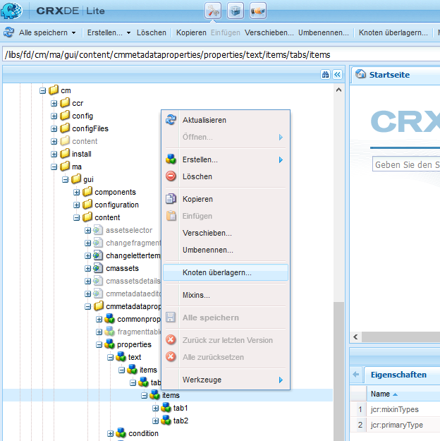

   1. Stellen Sie sicher, dass das Dialogfeld „Überlagerungsknoten“ die folgenden Werte enthält:

      **Pfad**: /libs/fd/cm/ma/gui/content/cmmetadataproperties/properties/[AssetType]/items/tabs/items

      **Speicherort**: /apps/

      **Übereinstimmende Knotentypen:** Ausgewählt

   1. Klicken Sie auf **OK**. Die Ordnerstruktur wird im Apps-Ordner erstellt.

      Klicken Sie auf **Alle speichern**.

1. Fügen Sie unter dem neu erstellten Ordner „items“ einen Knoten für die benutzerdefinierte Registerkarte im Asset hinzu (Beispiel: customtab), indem Sie folgende Schritte durchführen:

   1. Klicken Sie mit der rechten Maustaste auf den Ordner items und wählen Sie **Erstellen** > **Knoten erstellen**.
   1. Stellen Sie sicher, dass das Dialogfeld „Knoten erstellen“ folgende Werte aufweist, und klicken Sie auf **OK**:

      **Name:** customtab (oder der Name, den Sie dieser Eigenschaft geben möchten)

      **Typ:** nt:unstructured

   1. Klicken Sie auf den neuen Knoten, den Sie erstellt haben (hier customtab). CRX zeigt die Eigenschaften des Knotens an.
   1. Fügen Sie die folgenden zwei Eigenschaften zum Knoten hinzu (hier customtab):

      | **Name** | **Typ** | **Wert** |
      |---|---|---|
      | sling:resourceType | Zeichenfolge | granite/ui/components/coral/foundation/container |
      | jcr:title | Zeichenfolge | Der Name des Felds auf der Benutzeroberfläche (hier Registerkarte &quot;My&quot;) |

   1. Klicken Sie auf **Alle speichern**.

1. Klicken Sie im Knoten, den Sie im vorherigen Schritt (hier customtab) erstellt haben, fügen Sie einen Knoten namens „items“ mittels folgender Schritte hinzu:

   1. Klicken Sie mit der rechten Maustaste auf den Knoten (hier customtab) und wählen Sie **Erstellen** > **Knoten erstellen**.
   1. Stellen Sie sicher, dass das Dialogfeld „Knoten erstellen“ folgende Werte aufweist, und klicken Sie auf **OK**:

      **Name:** items

      **Typ:** nt:unstructured

   1. Klicken Sie auf **Alle speichern**.

1. Im item-Knoten, den Sie im vorherigen Schritt (unter customtab) erstellt haben, fügen Sie einen Knoten für die Erstellung einer Spalte (hier: Column1) auf der benutzerdefinierten Registerkarte mittels folgender Schritten hinzu (um weitere Spalten hinzuzufügen, wiederholen Sie diesen Schritt):

   1. Klicken Sie mit der rechten Maustaste auf den Knoten items und wählen Sie **Erstellen** > **Knoten erstellen**.
   1. Stellen Sie sicher, dass das Dialogfeld „Knoten erstellen“ folgende Werte aufweist, und klicken Sie auf **OK**:

      **Name:** Column1 (oder der Name, den Sie dem Knoten geben möchten)

      **Typ:** nt:unstructured

   1. Fügen Sie dem Knoten (hier: Column1) die folgenden Eigenschaften hinzu und klicken Sie auf **Alle speichern**:

      <table>
         <tbody>
         <tr>
           <td><strong>Name</strong></td>
           <td><strong>Typ</strong></td>
           <td><strong>Wert</strong></td>
         </tr>
         <tr>
           <td>sling:resourceType</td>
           <td>Zeichenfolge</td>
           <td>granite/ui/components/coral/foundation/container<br /> </td>
         </tr>
         </tbody>
       </table>

1. Erstellen Sie für jede erstellte Spalte (wie im vorherigen Schritt angegeben - hier Column1) einen Knoten, der „items“ heißt, anhand der folgenden Schritte:

   1. Klicken Sie mit der rechten Maustaste auf den relevanten Spaltenknoten (hier Column1) und wählen Sie **Erstellen** > **Knoten erstellen**.
   1. Stellen Sie sicher, dass das Dialogfeld „Knoten erstellen“ folgende Werte aufweist, und klicken Sie auf **OK**:

      **Name:** items

      **Typ:** nt:unstructured

   1. Klicken Sie auf **Alle speichern:**

1. Erstellen Sie für jede der erstellten Spalten einen Knoten unter dem Knoten items , um auf der neuen Registerkarte in der Benutzeroberfläche ein Feld zu erstellen. Wiederholen Sie diesen Schritt, um weitere Felder in der Spalte zu erstellen:

   1. Klicken Sie mit der rechten Maustaste auf die entsprechenden Knoten (hier items unter Column1) und wählen Sie **Erstellen** > **Knoten erstellen**.
   1. Stellen Sie sicher, dass das Dialogfeld „Knoten erstellen“ folgende Werte aufweist, und klicken Sie auf **OK**:

      **Name:** Ein Name Ihrer Wahl (hier: GeoLocation)

      **Typ:** nt:unstructured

   1. Fügen Sie dem Knoten die folgenden Eigenschaften hinzu und klicken Sie auf **Alle speichern**:

      | **Name** | **Typ** | **Wert** |
      |---|---|---|
      | fieldLabel | Zeichenfolge | Speicherort der Empfänger (oder der Name, den Sie dem Feld geben möchten.) |
      | name | Zeichenfolge | `./extendedproperties/GeoLocation` |
      | renderReadOnly | Boolesch | Ja |
      | sling:resourceType | Zeichenfolge | granite/ui/components/coral/foundation/form/textfield |

1. Um Ihre Anpassung anzuzeigen, bewegen Sie den Mauszeiger über das relevante Asset (hier ein Text), klicken Sie auf Eigenschaften anzeigen und klicken Sie auf **Bearbeiten**. Die neue Registerkarte und das neue Feld (Ort der Empfänger) werden in der Benutzeroberfläche angezeigt.

   >[!NOTE]
   >
   >Möglicherweise müssen Sie den Browser-Cache löschen, bevor Ihre Anpassung in der Benutzeroberfläche angezeigt wird.

   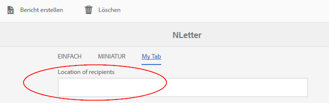

### Zeigen Sie benutzerdefinierte Eigenschaften auf der Seite „Asset-Erstellung“ an {#display-custom-properties-on-the-asset-creation-page}

Standardmäßig sind die benutzerdefinierten Eigenschaften, die neuen Registerkarten hinzugefügt werden, auf der Seite „Asset-Erstellung“ sichtbar, da diese Seite kein Registerkartenlayout hat. Um die benutzerdefinierten Eigenschaften auf der Seite „Asset-Erstellung“ zusammen mit anderen Eigenschaften anzuzeigen, müssen Sie die folgenden Schritte ausführen:

1. Klicken Sie mit der rechten Maustaste auf den Elementordner an folgendem Speicherort und wählen Sie **Überlagerungsknoten**:

   `/libs/fd/cm/ma/gui/content/createasset/createletter/jcr:content/body/items/form/items/letterWizard/items/properties/items/properties/items/letterproperties/items`

1. Stellen Sie sicher, dass das Dialogfeld „Überlagerungsknoten“ die folgenden Werte für Brief enthält: Für andere Asset-Typen wird der Pfad in der folgenden Tabelle angegeben:

   **Pfad:** /libs/fd/cm/ma/gui/content/createasset/createletter/jcr:content/body/items/form/items/letterWizard/items/properties/items/properties/items/letterproperties/items

   **Speicherort:** /apps/

   **Knotentypen abgleichen:** Ausgewählt

   Je nach Asset-Typ muss der Pfad Folgendes sein:

   | **Asset-/Dokumenttyp** | **Pfad, der hinzugefügt werden soll** |
   |---|---|
   | Text | /libs/fd/cm/ma/gui/content/createasset/createtext/jcr:content/body/items/form/items/textwzard/items/editproperties/items/properties/items/tabs/items/tab1/items |
   | Liste | /libs/fd/cm/ma/gui/content/createasset/createlist/jcr:content/body/items/form/items/listwizard/items/editproperties/items/properties/items/tabs/items/tab1/items |
   | Bedingung | /libs/fd/cm/ma/gui/content/createasset/createcondition/jcr:content/body/items/form/items/condition/wizard/items/editproperties/items/properties/items/tabs/items/tab1/items |
   | Fragment | /libs/fd/cm/ma/gui/content/createasset/createfragment/jcr:content/body/items/form/items/fragmentwizard/items/properties/items/properties/items/tabs2/items/tab1/items |
   | Brief | /libs/fd/cm/ma/gui/content/createasset/createletter/jcr:content/body/items/form/items/letterWizard/items/properties/items/properties/items/letterproperties/items |

1. Klicken Sie auf **OK**. Die Ordnerstruktur wird im Apps-Ordner erstellt.

1. Mit dem Überlagerungsknoten „items“, den Sie erstellt haben, erstellen Sie einen Knoten mit dem Namen col4 (oder einem anderen Namen) und klicken auf **Alle speichern**.

   Beispielsweise ist Folgendes der Überlagerungsknoten, der für Briefe erstellt wird.

   `/apps/fd/cm/ma/gui/content/createasset/createletter/jcr:content/body/items/form/items/letterWizard/items/properties/items/properties/items/letterproperties/items`

1. Fügen Sie die folgenden Eigenschaften dem neu erstellten Knoten (hier „col4“) hinzu und klicken Sie auf **Alle speichern**:

<table>
 <tbody>
  <tr>
   <td><strong>Name</strong></td>
   <td><strong>Typ</strong></td>
   <td><strong>Wert</strong></td>
  </tr>
  <tr>
   <td>path</td>
   <td>Zeichenfolge</td>
   <td><p>Dieser Pfad zeigt auf die Spalte, die in erstellt wurde:</p>
    <ul>
     <li>Für die Registerkarte „Allgemein“ für alle Asset-Typen: /apps/fd/cm/ma/gui/content/cmmetadataproperties/commontab/items/col1</li>
     <li>Für verschiedene Eigenschaften für unterschiedliche Medieneöement-Typen: /apps/fd/cm/ma/gui/content/cmmetadataproperties/properties//items/tabs/items/customtab/items/col1</li>
    </ul> </td>
  </tr>
  <tr>
   <td>sling:resourceType</td>
   <td>Zeichenfolge</td>
   <td> granite/ui/components/coral/foundation/include<br /> </td>
  </tr>
 </tbody>
</table>

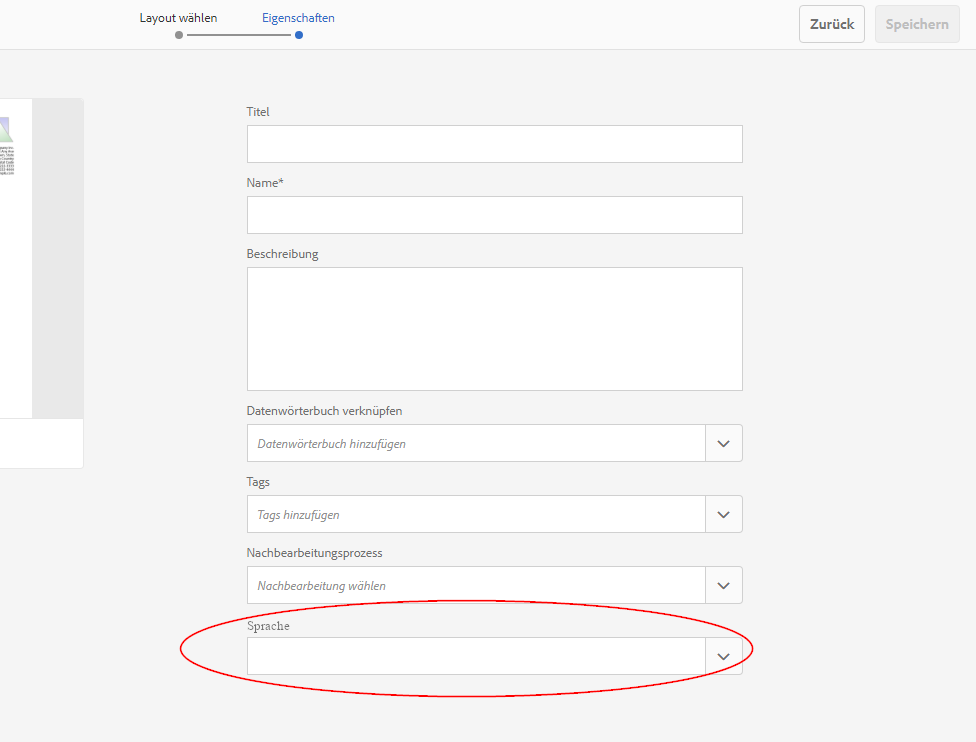

Benutzerdefinierte Eigenschaft, Sprache, die in der Benutzeroberfläche zum Erstellen eines Briefs angezeigt wird

## Anpassen der Listenansicht zum Anzeigen benutzerdefinierter Eigenschaften {#customize-the-list-view-to-show-custom-properties}

Nachdem Sie den Correspondence Management-Assets eine benutzerdefinierte Eigenschaft hinzugefügt haben, müssen Sie weitere Änderungen in CRX/DE vornehmen, um sicherzustellen, dass die benutzerdefinierte Eigenschaft in der Correspondence Management-Benutzeroberfläche angezeigt wird.

Führen Sie die folgenden Schritte aus, um die benutzerdefinierte Eigenschaft in der UI der Bestandsliste von Correspondence Management anzuzeigen:

1. Gehen Sie zu `https://'[server]:[port]'/[ContextPath]/crx/de` und melden Sie sich als Administrator an.
1. Erstellen Sie die folgende Ordnerstruktur im Apps-Ordner:

   `/libs/fd/cm/ma/gui/content/cmassets/jcr:content/views/lists/columns`

   Führen Sie die folgenden Schritte aus, um diese Ordnerstruktur zu erstellen:

   1. Klicken Sie mit der rechten Maustaste auf den Ordner „Spalten“ im folgenden Pfad und wählen Sie **Überlagerungsknoten**:

      `/libs/fd/cm/ma/gui/content/cmassets/jcr:content/views/lists/columns`

   1. Stellen Sie sicher, dass das Dialogfeld „Überlagerungsknoten“ die folgenden Werte enthält:

      **Pfad:** /libs/fd/cm/ma/gui/content/cmassets/jcr:content/views/lists/columns

      **Speicherort:** /apps/

      **Übereinstimmende Knotentypen:** Ausgewählt

   1. Klicken Sie auf **OK**. Die Ordnerstruktur wird im Apps-Ordner erstellt.

      Klicken Sie auf **Alle speichern**.

1. Erstellen Sie für jede der erstellten Eigenschaften einen Knoten unter dem Spaltenknoten, um eine Spalte in der Benutzeroberfläche zu erstellen. Wiederholen Sie diesen Schritt, um weitere Spalten in der Benutzeroberfläche zu erstellen:

   1. Klicken Sie mit der rechten Maustaste auf den entsprechenden Knoten (Spalten) und wählen Sie **Erstellen** > **Knoten erstellen**.
   1. Stellen Sie sicher, dass das Dialogfeld „Knoten erstellen“ folgende Werte aufweist, und klicken Sie auf **OK**:

      **Name:** Ein frei wählbarer Name (hier GeographicalLocation)

      **Typ:** nt:unstructured

   1. Fügen Sie dem Knoten die folgenden Eigenschaften hinzu und klicken Sie auf **Alle speichern**:

      <table>
         <tbody>
         <tr>
           <td><strong>Name</strong></td>
           <td><strong>Typ</strong></td>
           <td><strong>Wert</strong></td>
         </tr>
         <tr>
           <td>jcr:primaryType</td>
           <td>Name</td>
           <td><p>nt:unstructured</p> </td>
         </tr>
         <tr>
           <td>jcr:title</td>
           <td>Zeichenfolge</td>
           <td><p>GeographicalLocation</p> <p>Dieser Wert wird als Spaltenüberschrift in der Benutzeroberfläche angezeigt. </p> </td>
         </tr>
         <tr>
           <td>sortable</td>
           <td>Boolesch</td>
           <td><p>Ja</p> <p>Der Wert true bedeutet, dass der Benutzer die Werte in dieser Spalte sortieren kann. </p> </td>
         </tr>
         </tbody>
       </table>

1. Erstellen Sie die folgende Ordnerstruktur im Apps-Ordner:

   `/libs/fd/cm/ma/gui/components/admin/childpagerenderer/childlistpage`

   Führen Sie die folgenden Schritte aus, um diese Ordnerstruktur zu erstellen:

   1. Klicken Sie mit der rechten Maustaste auf den Ordner „Spalten“ im folgenden Pfad und wählen Sie **Überlagerungsknoten**:

      `/libs/fd/cm/ma/gui/components/admin/childpagerenderer/childlistpage`

   1. Stellen Sie sicher, dass das Dialogfeld „Überlagerungsknoten“ die folgenden Werte enthält:

      **Pfad:** /libs/fd/cm/ma/gui/components/admin/childpagerenderer/childlistpage

      **Speicherort** /apps/

      **Übereinstimmende Knotentypen:** Ausgewählt

   1. Klicken Sie auf **OK**. Die Ordnerstruktur wird im Apps-Ordner erstellt.

      Klicken Sie auf **Alle speichern**.

1. Kopieren Sie die Datei „childlistpage.jsp“ vom folgenden Speicherort:

   /libs/fd/cm/ma/gui/components/admin/childpagerenderer/childlistpage/childlistpage.jsp

   Fügen Sie die Datei am folgenden Speicherort ein:

   /apps//fd/cm/ma/gui/components/admin/childpagerenderer/childlistpage/.

1. Öffnen Sie die Datei &quot;childlistpage.jsp&quot;(/apps/fd/cm/ma/gui/components/admin/childpagerenderer/childlistpage/childlistpage.jsp) und nehmen Sie die folgenden Änderungen vor:

   1. Fügen Sie Zeile 19 der Datei Folgendes hinzu (folgen Sie der Urheberrechtserklärung).

      ```jsp
      <%@page import="java.util.Map"%>
      ```

   1. Fügen Sie am Ende der Datei den folgenden Code einer Funktion hinzu, die einen Wert für jede benutzerdefinierte Eigenschaft abruft:

      ```jsp
      <%!
          private String getCustomPropertyValue(Map<String, Object> extendedProperties, String propertyName) {
      
              String propertyValue = "";
              if (extendedProperties.containsKey(propertyName)) {
                  propertyValue = (String) extendedProperties.get(propertyName);
              }
      
              return propertyValue;
          }
      %>
      ```

   1. Fügen Sie Folgendes vor Beginn des Tags &lt;tr> (&lt;tr &lt;%= attrs.build() %>>) hinzu:

      ```jsp
      <%
          String GeoLocation = "";
          if (asset != null) {
                  Map<String, Object> extendedProperties = asset.getExtendedProperties();
                  if (extendedProperties != null) {
                      GeoLocation = getCustomPropertyValue(extendedProperties,"GeoLocation");
                  }
          }
      %>
      ```

      Im Code ist GeoLocation der Wert, den Sie beim Erstellen des benutzerdefinierten Knotens/Felds in der Eigenschaft name festgelegt haben. Beim Erstellen eines benutzerdefinierten Knotens/Felds haben Sie den Namen der Eigenschaft mit angegeben.Präfix /extendedproperties/: ./extendedproperties/GeoLocation. Im Code ist das Präfix nicht erforderlich.

   1. Zum Anzeigen der neuen Eigenschaft auf der Benutzeroberfläche fügen Sie einen TD-Tag vor dem schließenden tr(&lt;/tr>)-Tag hinzu:

      ```jsp
      <td is="coral-td" value="<%= xssAPI.encodeForHTMLAttr(geographicalLocation) %>"><%= xssAPI.encodeForHTML(geographicalLocation) %></td>
      ```

      Um weitere Spalten hinzuzufügen, wiederholen Sie die Schritte 6.3 und 6.4.

   1. Klicken Sie auf **Alle speichern**.

1. Um Ihre Anpassung anzuzeigen, öffnen Sie die Listenansicht von Dokumentfragmenten oder Briefen, in denen Sie die benutzerdefinierte Eigenschaft hinzugefügt haben.

   Die Spalte und Eigenschaft der Benutzeroberfläche, die in diesem Verfahren hinzugefügt werden, wird für alle Asset-Typen angezeigt. Die Werte in diesen Eigenschaften können jedoch nur für die Asset-Typen eingegeben und angezeigt werden, für die Sie die benutzerdefinierte Eigenschaft ursprünglich hinzugefügt haben.

   Beispielsweise mithilfe des Szenarios: Zum Hinzufügen von benutzerdefinierten Eigenschaften für bestimmte Arten von Assets können Sie benutzerdefinierte Eigenschaft zu Text-Assets hinzufügen. Wenn jedoch diese benutzerdefinierte Eigenschaft auf der Benutzeroberfläche angezeigt wird, wird die Spalte für alle Assettypen.

   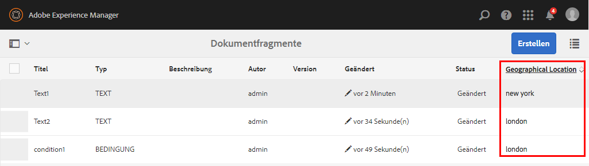

1. (Optional) Standardmäßig wird die neue Spalte als letzte Spalte in der Benutzeroberfläche angezeigt. Damit die Spalte an einer bestimmten Position angezeigt wird, fügen Sie dem Spaltenknoten die folgende Eigenschaft hinzu:

<table>
 <tbody>
  <tr>
   <td><strong>Name</strong></td>
   <td><strong>Typ</strong></td>
   <td><strong>Wert</strong></td>
  </tr>
  <tr>
   <td>sling:orderBefore</td>
   <td>Zeichenfolge</td>
   <td><p>Der Name des Spaltenknotens im Pfad "/libs/fd/cm/ma/gui/content/cmassets/jcr:content/views/list/columns", vor dem die benutzerdefinierte Spalte in der Benutzeroberfläche angezeigt werden muss.</p> <p>Wenn die Spalte "Geografischer Standort"vor (links von) der Spalte "Version"angezeigt werden soll, fügen Sie die Eigenschaft sling:orderBefore zum Knoten GeoLocation unter dem Pfad "/apps/fd/cm/ma/gui/content/cmassets/jcr:content/views/list/columns/GeoLocation"hinzu und legen Sie den Wert der Eigenschaft auf Version fest.</p> </td>
  </tr>
 </tbody>
</table>

Wenn Sie die Eigenschaft sling:orderBefore hinzufügen, um den Spaltenspeicherort anzugeben, müssen Sie auch die Reihenfolge der entsprechenden &lt;td> Tag, das in Schritt 6.4 dieses Verfahrens angegeben wird. In diesem Fall müssen Sie beispielsweise sicherstellen, dass die Variable &lt;td> Tag des geografischen Standorts wird vor &lt;td> Tag der Spalte Version :

```xml
<td is="coral-td" value="<%= xssAPI.encodeForHTMLAttr(geographicalLocation) %>"><%= xssAPI.encodeForHTML(geographicalLocation) %></td>
<td is="coral-td" value="<%= xssAPI.encodeForHTMLAttr(version) %>"><%= xssAPI.encodeForHTML(version) %></td>
```

## Suche für benutzerdefinierte Eigenschaften aktivieren {#enable-search-for-custom-properties}

Standardmäßig enthält die Volltextsuche keine benutzerdefinierten Eigenschaften, die Sie der Benutzeroberfläche mit CRX/DE hinzufügen.

Um die benutzerdefinierten Eigenschaften in die Suche einzubeziehen, müssen Sie die Indizierung benutzerdefinierter Eigenschaften zulassen.

Um die Indexerstellung von benutzerdefinierten Eigenschaften zu ermöglichen, führen Sie die folgenden Schritte aus:

1. Wechseln Sie zu `https://'[server]:[port]'/[ContextPath]/crx/de` und melden Sie sich als „Administrator“ an.
1. Navigieren Sie zu `/oak:index/cmLucene` und fügen Sie darunter einen Knoten mit dem Namen **aggregates** hinzu.

   1. Klicken Sie mit der rechten Maustaste auf den Ordner cmLucene und wählen Sie **Erstellen** > **Knoten erstellen**.
   1. Stellen Sie sicher, dass das Dialogfeld „Knoten erstellen“ folgende Werte aufweist, und klicken Sie auf **OK**:

      **Name:** Aggregate

      **Typ:** nt:unstructured

   1. Klicken Sie auf **Alle speichern**.

1. Fügen Sie im neu erstellten aggregates-Ordner einen Knoten namens „cm:ressource“ hinzu. Und fügen Sie unter cm:resource einen Knoten mit dem Namen „include0“ hinzu.

   1. Klicken Sie mit der rechten Maustaste auf den Ordner Aggregate und wählen Sie **Erstellen** > **Knoten erstellen**. Stellen Sie sicher, dass das Dialogfeld „Knoten erstellen“ folgende Werte aufweist und klicken Sie auf **OK**:

      **Name:** cm:resource

      **Typ:** nt:unstructured

   1. Klicken Sie mit der rechten Maustaste auf den Ordner cm:resource und wählen Sie **Erstellen** > **Knoten erstellen**. Stellen Sie sicher, dass das Dialogfeld „Knoten erstellen“ folgende Werte aufweist und klicken Sie auf **OK**:

      **Name:** include0

      **Typ:** nt:unstructured

   1. Klicken Sie auf den neuen Knoten, den Sie erstellt haben (hier include0). CRX zeigt die Eigenschaften des Knotens an.
   1. Fügen Sie folgende Eigenschaften dem Knoten hinzu (hier: include0):

      <table>
         <tbody>
         <tr>
           <td><strong>Name</strong></td>
           <td><strong>Typ</strong></td>
           <td><strong>Wert</strong></td>
         </tr>
         <tr>
           <td>path</td>
           <td>Zeichenfolge</td>
           <td>extendedProperties<br /> </td>
         </tr>
         </tbody>
       </table>

   1. Klicken Sie auf **Alle speichern**.

1. Gehen Sie zu den Eigenschaften am folgenden Speicherort und fügen Sie darunter einen Knotenspeicherort hinzu: `/oak:index/cmLucene/indexRules/cm:resource/properties`

   Wiederholen Sie diesen Schritt für jede der benutzerdefinierten Eigenschaften, die Sie der Suche hinzufügen möchten.

   1. Klicken Sie mit der rechten Maustaste auf den Ordner &quot;properties&quot;und wählen Sie **Erstellen** > **Knoten erstellen**.
   1. Stellen Sie sicher, dass das Dialogfeld „Knoten erstellen“ folgende Werte aufweist, und klicken Sie auf **OK**:

      **Name:** Speicherort (oder der Name der benutzerdefinierten Eigenschaft, die Sie der Suche hinzufügen möchten)

      **Typ:** nt:unstructured

   1. Klicken Sie auf den neuen Knoten, den Sie erstellt haben (hier: Speicherort). CRX zeigt die Eigenschaften des Knotens an.
   1. Fügen Sie folgende Eigenschaften dem Knoten hinzu (hier: location):

      | **Name** | **Typ** | **Wert** |
      |---|---|---|
      | analyzed | Zeichenfolge | Ja |
      | name | Zeichenfolge | extendedProperties/location (oder der Name der Eigenschaft, die Sie zur Suche hinzufügen möchten) |
      | propertyIndex | Boolesch | Ja |
      | useInSuggest | Boolesch | Ja |

   1. Klicken Sie auf **Alle speichern**.

1. Jetzt können Sie benutzerdefinierte Eigenschaftswerte bei der Volltextsuche verwenden, um relevante Assets zu finden.

>[!NOTE]
>
>Wenn Sie immer noch nicht suchen können, liegt dies möglicherweise an einem Indizierungsproblem. Für die neue Indexerstellung navigieren Sie zu folgendem Knoten und ändern den Wert der Eigenschaft „re-index“ in „true“:
>
>/oak:index/cmLucene&quot; und ändern Sie den Wert der Eigenschaft

## Standardansicht der Suchseite ändern {#change-default-view-of-the-search-page}

1. Gehen Sie zu `https://'[server]:[port]'/[ContextPath]/crx/de` und melden Sie sich als Administrator an.
1. Erstellen Sie im Apps-Ordner einen Ordner mit dem Namen list mit einem ähnlichen Pfad/einer ähnlichen Struktur wie der Listenordner in /libs/granite/ui/content/shell/omnisearch/searchresults/singleresults/views:

   1. Klicken Sie mit der rechten Maustaste auf den Ordner „Elemente“ im folgenden Pfad und wählen Sie **Überlagerungsknoten**:

      `/libs/granite/ui/content/shell/omnisearch/searchresults/singleresults/views/list`

   1. Stellen Sie sicher, dass das Dialogfeld „Überlagerungsknoten“ die folgenden Werte enthält:

      **Pfad:** /libs/granite/ui/content/shell/omnisearch/searchresults/singleresults/views/list

      **Speicherort:** /apps/

      **Übereinstimmende Knotentypen:** Ausgewählt

   1. Klicken Sie auf **OK**. Die Ordnerstruktur wird im Apps-Ordner erstellt.

   1. Klicken Sie auf **Alle speichern**.

1. Fügen Sie im neu erstellten Knoten list die folgende Eigenschaft hinzu und klicken Sie auf **Alle speichern**:

   <table>
   <tbody>
   <tr>
      <td><strong>Name</strong></td>
      <td><strong>Typ</strong></td>
      <td><strong>Wert</strong></td>
   </tr>
   <tr>
      <td>sling:orderBefore<br /> </td>
      <td>Zeichenfolge</td>
      <td>card</td>
   </tr>
   </tbody>
   </table>

1. Die Anpassung zeigt Suchergebnisse in der Listenansicht für alle Konsolen an, einschließlich Forms und Dokumente, Assets und Sites.

## Standardansicht der Asset-Seite ändern {#change-default-view-of-the-assets-page}

>[!NOTE]
>
>Mit diesen Schritten wird die Standardansicht aller Konsolen wie Forms und Dokumente, Assets und Sites geändert.

1. Wechseln Sie zu `https://'[server]:[port]'/[ContextPath]/crx/de` und melden Sie sich als „Administrator“ an.
1. Erstellen Sie im Apps-Ordner einen Ordner mit dem Namen list mit einem ähnlichen Pfad/einer ähnlichen Struktur wie der Listenordner in:

   /libs/fd/cm/ma/gui/content/cmassets/jcr:content/views/

   1. Klicken Sie mit der rechten Maustaste auf den Elementordner an folgendem Speicherort und wählen Sie **Überlagerungsknoten**:

      `/libs/fd/cm/ma/gui/content/cmassets/jcr:content/views/list`

   1. Stellen Sie sicher, dass das Dialogfeld „Überlagerungsknoten“ die folgenden Werte enthält:

      **Pfad:** /libs/fd/cm/ma/gui/content/cmassets/jcr:content/views/list

      **Speicherort:** /apps/

      **Übereinstimmende Knotentypen:** Ausgewählt

   1. Klicken Sie auf **OK**. Die Ordnerstruktur wird im Apps-Ordner erstellt.

   1. Klicken Sie auf **Alle speichern**.

1. Fügen Sie im neu erstellten Knoten list die folgende Eigenschaft hinzu und klicken Sie auf **Alle speichern**:

   <table>
   <tbody>
   <tr>
      <td><strong>Name</strong></td>
      <td><strong>Typ</strong></td>
      <td><strong>Wert</strong></td>
   </tr>
   <tr>
      <td>sling:orderBefore<br /> </td>
      <td>Zeichenfolge</td>
      <td>card</td>
   </tr>
   </tbody>
   </table>

1. Löschen Sie die Browser-Cookies oder verwenden Sie den Inkognito-Modus Ihres Browsers, um die Assets anzuzeigen. Die Asset-Seite wird standardmäßig im Kartenlayout angezeigt.

## Einblenden/Ausblenden benutzerdefinierter Eigenschaften auf den Seiten &quot;Asset-Erstellung&quot;und &quot;Eigenschaften&quot; {#show-hide-custom-properties-on-asset-creation-and-properties-pages}

Führen Sie die folgenden Schritte aus, um die benutzerdefinierten Eigenschaften ein- oder auszublenden:

1. Erstellen Sie unter dem benutzerdefinierten Eigenschaftsknoten, z. B. geographicallocation, einen Knoten mit dem Namen &quot;granite:rendercondition&quot;vom Typ &quot;nt:unstructured&quot;.
1. Fügen Sie dem Knoten die folgenden Eigenschaften hinzu und klicken Sie auf **Alle speichern**:

   <table>
   <tbody>
   <tr>
      <td><strong>Name</strong></td>
      <td><strong>Typ</strong></td>
      <td><strong>Wert</strong></td>
   </tr>
   <tr>
      <td>sling:resourceType<br /> </td>
      <td>Zeichenfolge</td>
      <td>fd/cm/ma/gui/components/admin/assetsproperties/custompropertyconfig<br /> </td>
   </tr>
   </tbody>
   </table>

1. Um diese Eigenschaft auf der Seite „Asset-Erstellung“ auszublenden, fügen Sie folgende Eigenschaft hinzu und klicken Sie auf **Alle speichern**:

   <table>
   <tbody>
   <tr>
      <td><strong>Name</strong></td>
      <td><strong>Typ</strong></td>
      <td><strong>Wert</strong></td>
   </tr>
   <tr>
      <td>hideOnCreate<br /> </td>
      <td>Boolesch</td>
      <td>Ja<br /> </td>
   </tr>
   </tbody>
   </table>

1. Um die benutzerdefinierte Eigenschaft auf der Eigenschaftsseite der Assets auszublenden, fügen Sie ihr die folgende Eigenschaft hinzu und klicken Sie auf **Alle speichern**:

   <table>
   <tbody>
   <tr>
      <td><strong>Name</strong></td>
      <td><strong>Typ</strong></td>
      <td><strong>Wert</strong></td>
   </tr>
   <tr>
      <td>hideOnEdit<br /> </td>
      <td>Boolesch</td>
      <td>Ja<br /> </td>
   </tr>
   </tbody>
   </table>

   Wenn Sie die Werte wieder anzeigen möchten, legen Sie die Eigenschaftswerte wieder auf`false` fest oder löschen Sie die entsprechenden Eigenschafteneinträge.
