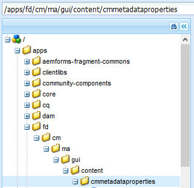

# Fügen Sie benutzerdefinierte Eigenschaften den Correspondence Management-Assets hinzu{#add-custom-properties-to-correspondence-management-assets}

## Überblick {#overview}

Sie können die Correspondence Management-Benutzeroberfläche anpassen und Benutzern ein angepasstes Set an Eigenschaften und Registerkarten bieten. Diese Anpassung umfasst das Hinzufügen benutzerdefinierter Felder/Eigenschaften und Registerkarten zu bestimmten Asset-Typen/Briefen oder allen Asset-Typen und Briefen.

## Hinzufügen benutzerdefinierter Eigenschaften zu Correspondence Management-Assets {#adding-custom-properties-to-correspondence-management-assets}

Die folgenden Fälle zeigen, wie Sie Eigenschaften/Registerkarten zu Correspondence Management-Assets und Briefen hinzufügen können:

* Hinzufügen einer allgemeinen Eigenschaft zu allen Assettypen
* Hinzufügen einer allgemeinen Registerkarte zu allen Assettypen
* Hinzufügen von benutzerdefinierten Eigenschaften zu bestimmten Assettypen

Durch Anpassen der Eigenschaften, Pfade und Werte in diesen Szenarios können Sie benutzerdefinierte Eigenschaften und Registerkarten zu einem anderen Assetsset gemäß Ihren Anforderungen hinzufügen.

### Szenario: Hinzufügen eines allgemeinen Felds (Eigenschaft) zu allen Assettypen {#scenario-adding-a-common-field-property-to-all-the-asset-types}

Dieses Beispiel zeigt, wie Sie eine benutzerdefinierte Eigenschaft allen Assettypen (Text, Liste, Bedingung und Layout-Fragmente) und Briefen hinzufügen können. In diesem Szenario können Sie allen Assets und Briefen die Eigenschaft &quot;Speicherort der Empfänger&quot;hinzufügen. Die Eigenschaft &quot;Speicherort von Empfängern&quot;hilft zu identifizieren, für welches geografische Gebiet eines Versands ein Vermögenswert oder Brief relevant ist.

>[!NOTE]
>
>Wenn Sie bereits eine benutzerdefinierte Eigenschaft hinzugefügt haben, wird die Eigenschaft auf der Seite zur Asset-Erstellung angezeigt. Um eine solche Eigenschaft auszublenden, finden Sie weitere Informationen unter „Benutzerdefinierte Eigenschaften auf Asset-Erstellung und Eigenschaften“.


Führen Sie die folgenden Schritte aus, um eine benutzerdefinierte Eigenschaft zu allen Assettypen und Briefen hinzuzufügen:

1. Gehen Sie zu `https://'[server]:[port]'/[ContextPath]/crx/de` und melden Sie sich als Administrator an.
1. Erstellen Sie im Anwendungsordner einen Ordner mit dem Namen css mit einem ähnlichen Pfad/einer ähnlichen Struktur wie der css-Ordner (im ccrui-Ordner), indem Sie die folgenden Schritte durchführen:

   1. Klicken Sie mit der rechten Maustaste auf den Ordner items im folgenden Pfad und wählen Sie **Überlagerungsknoten**:

      `/libs/fd/cm/ma/gui/content/cmmetadataproperties/commonproperties/col1/items`

      

   1. Stellen Sie sicher, dass das Dialogfeld „Überlagerungsknoten“ die folgenden Werte enthält:

      **Pfad:** /libs/fd/cm/ma/gui/content/metadataproperties/commonproperties/col1/items

      **Ort:** /Apps/

      **Knotentypen abgleichen:** Ausgewählt

      

   1. Klicken Sie auf **OK**. Die Ordnerstruktur wird im Apps-Ordner erstellt.

   1. Klicken Sie auf **Alle speichern**.

1. Fügen Sie unter dem neu erstellten Ordner &quot;items&quot;einen Knoten für die benutzerdefinierte Eigenschaft in allen Assets hinzu (Beispiel: GeoLocation) mit den folgenden Schritten:

   1. Klicken Sie mit der rechten Maustaste auf den Ordner „items“ und wählen Sie **Erstellen** > **Knoten erstellen**.

      

   1. Stellen Sie sicher, dass das Dialogfeld „Knoten erstellen“ folgende Werte aufweist und klicken Sie auf **OK**:

      **Name:** GeoLocation (oder der Name, den Sie dieser Eigenschaft geben möchten)

      **Typ:** nt:unstructured

      

   1. Klicken Sie auf den von Ihnen erstellten Knoten (hier: GeoLocation). CRX zeigt die Eigenschaften des Knotens an.
   1. Fügen Sie folgende Eigenschaften dem Knoten hinzu (hier: Geolocation):

      | **Name** | **Typ** | **Wert** |
      |---|---|---|
      | fieldLabel | Zeichenfolge | Der Name, den Sie dem Feld/der Eigenschaft geben möchten. (Hier: Ort des Empfängers) |
      | name | Zeichenfolge | `./extendedproperties/GeoLocation` (Beibehalten des Werts mit dem Feldnamen, den Sie unter dem Elementknoten erstellt haben) |
      | renderReadOnly | Boolesch | true |
      | sling:resourceType | Zeichenfolge | `granite/ui/components/coral/foundation/form/textfield` |

   1. Klicken Sie auf **Alle speichern**.

1. Um Ihre Anpassungen anzuzeigen, bewegen Sie den Mauszeiger über ein Asset (Text, Liste, Bedingung oder Layout-Fragment) oder einen Brief, klicken Sie auf **Eigenschaften anzeigen** und klicken Sie auf **Bearbeiten**. Das neue Feld (Ort der Empfänger) wird auf der Registerkarte „Grundeinstellungen“ in den Asset-/Briefeigenschaften angezeigt.

   >[!NOTE]
   >
   >Möglicherweise müssen Sie den Cache Ihres Browsers leeren, bevor Ihre Anpassungen in der Benutzeroberfläche angezeigt werden.

   

   >[!NOTE]
   >
   >Die gängigsten Eigenschaften für alle Assets, die Sie hinzufügen, werden auf der Registerkarte „Grundeinstellungen“ der Asset-Eigenschaften angezeigt. Standardmäßig werden die allgemeinen Eigenschaften, die für alle Assets hinzugefügt werden, auf der Seite „Eigenschaften“ sowie auf der Seite „Erstellung“ angezeigt. Um die allgemeinen Eigenschaften auszublenden, müssen Sie <!--link to show / hide properties]-->.

### Szenario: Hinzufügen eines benutzerdefinierte Dropdown-Menüs und von Werten zu einer benutzerdefinierten Eigenschaft/einem benutzerdefinierten Feld {#scenario-add-custom-drop-down-and-values-to-a-custom-property-field}

Dieses Beispiel zeigt, wie Sie eine benutzerdefinierte Eigenschaft allen Asset-Typen hinzufügen und Dropdown-Menü-Werten der hinzufügen können.

1. Klicken Sie mit der rechten Maustaste auf den Ordner items im folgenden Pfad und wählen Sie **Überlagerungsknoten**:

   `/libs/fd/cm/ma/gui/content/cmmetadataproperties/commonproperties/col1/items`

1. Unter dem neu erstellten Überlagerungsknoten (/apps/fd/cm/ma/gui/content/metadataproperties/commonproperties/col1/items)
Erstellen Sie für jede Eigenschaft (Felder), für die Sie eine Dropdown-Liste (hier `geographicallocation`) des Typs nt:unstructured erstellen müssen, einen Knoten.
1. Fügen Sie dem Knoten (hier: geographicallocation) die folgenden Eigenschaften hinzu und klicken Sie auf **Alle speichern**:

   <table>
   <tbody>
   <tr>
      <td><strong>Name</strong></td>
      <td><strong>Typ</strong></td>
      <td><strong>Wert</strong></td>
   </tr>
   <tr>
      <td>fieldLabel</td>
      <td>Zeichenfolge</td>
      <td>Der Name, den Sie dem Feld/der Eigenschaft geben möchten. (Hier: geographicallocation)</td>
   </tr>
   <tr>
      <td>name</td>
      <td>Zeichenfolge</td>
      <td>./extendedproperties/geographicalmapping (Der Wert sollte mit dem Feldnamen übereinstimmen, den Sie unter dem Knoten items erstellt haben)</td>
   </tr>
   <tr>
      <td>renderReadOnly</td>
      <td>Boolesch</td>
      <td>true</td>
   </tr>
   <tr>
      <td>sling:resourceType</td>
      <td>Zeichenfolge</td>
      <td>granite/ui/components/coral/foundation/form/select<br /> </td>
   </tr>
   </tbody>
   </table>

1. Fügen Sie unter dem property-Knoten (hier geographicallocation) einen neuen Knoten mit dem Namen `items` hinzu. Fügen Sie unter dem items-Knoten jeweils einen Knoten für die Werte im Dropdown-Menü hinzu. Als bewährte Methode fügen Sie den ersten Knoten als leer hinzu, um als Standardwert des Dropdown-Menüs zu dienen und eine Option für den Benutzer, damit dieser einen Wert für das Feld angeben kann. Um mehrere Optionen/Drop-Down-Werte hinzuzufügen, wiederholen Sie die folgenden Schritte:

   1. Klicken Sie auf den property-Knoten, (hier: geographicallocation) mit der rechten Maustaste und wählen Sie **Erstellen** >**Knoten erstellen**.
   1. Geben Sie den Namen des Felds als &quot;`item1,`&quot;beibehalten als nt:unstructured&quot;ein und klicken Sie auf &quot;**OK**&quot;.
   1. Fügen Sie die folgenden Eigenschaften dem neu erstellten Knoten (hier: item1) hinzu und klicken Sie auf **Alle speichern**:

      <table>
         <tbody>
         <tr>
          <td><strong>Name</strong></td>
          <td><strong>Typ</strong></td>
          <td><strong>Wert</strong></td>
         </tr>
         <tr>
          <td>text</td>
          <td>Zeichenfolge</td>
          <td>Dies ist der Wert der Dropdown-Menüoption, die für den Benutzer sichtbar ist. Lassen Sie das Feld leer für den (Standard-)Wert oder geben Sie den Wert ein, z. B. <strong>International</strong> oder<strong> Innerhalb der USA</strong>.<br /> </td>
         </tr>
         <tr>
          <td>value</td>
          <td>Zeichenfolge</td>
          <td>In CRXDE gespeicherter Wert für den Text. Geben Sie einen beliebigen eindeutigen Suchbegriff ein. <br /> </td>
         </tr>
         </tbody>
   </table>

   

Das benutzerdefinierte Dropdown-Menü wird als nächstes in den Asset-Eigenschaften angezeigt:


### Szenario: Registerkarte „Allgemein“ für alle Assettypen {#scenario-common-tab-for-all-asset-types}

Dieses Beispiel zeigt, wie Sie eine benutzerdefinierte Registerkarte, Empfänger, allen Assettypen (Text, Liste, Bedingung und Layout-Fragmente) und Briefen hinzufügen können. Auf der Registerkarte „Empfänger“ können Sie alle benutzerdefinierten Eigenschaften, die für den Empfänger relevant sind, festlegen.


Mithilfe des folgenden Verfahrens können Sie eine Registerkarte mit einem Feld zu allen Assets hinzufügen:

1. Gehen Sie zu `https://'[server]:[port]'/[ContextPath]/crx/de` und melden Sie sich als Administrator an.
1. Erstellen Sie im Apps-Ordner einen Ordner mit dem Namen cmmetadataproperties mit einem ähnlichen Pfad/einer ähnlichen Struktur wie der Ordner &quot;cmmetadataproperties&quot;(im Inhaltsordner), indem Sie die folgenden Schritte durchführen:

   1. Klicken Sie mit der rechten Maustaste auf den Ordner &quot;cmmetadataproperties&quot;im folgenden Pfad und wählen Sie **Überlagerungsknoten**:

      `/libs/fd/cm/ma/gui/content/cmmetadataproperties`

      

   1. Stellen Sie sicher, dass das Dialogfeld „Überlagerungsknoten“ die folgenden Werte enthält:

      **Pfad:** /libs/fd/cm/ma/gui/content/metadataproperties

      **Ort:** /Apps/

      **Knotentypen abgleichen:** Ausgewählt

   1. Klicken Sie auf **OK**. Die Ordnerstruktur wird im Apps-Ordner erstellt.

      

      Klicken Sie auf **Alle speichern**.

1. Fügen Sie im Ordner &quot;cmmetadataproperties&quot;einen Knoten zum Erstellen einer benutzerdefinierten Registerkarte für alle Assets hinzu (Beispiel: commontab), indem Sie die folgenden Schritte ausführen:

   1. Klicken Sie mit der rechten Maustaste auf den Ordner „items“ und wählen Sie **Erstellen** > **Knoten erstellen**.

      

   1. Stellen Sie sicher, dass das Dialogfeld „Knoten erstellen“ folgende Werte aufweist und klicken Sie auf **OK**:

      **Name:** commontab (oder der Name, den Sie dieser Eigenschaft geben möchten)

      **Typ:** nt:unstructured

   1. Klicken Sie auf den von Ihnen erstellten Knoten (hier: commontab). CRX zeigt die Eigenschaften des Knotens an.
   1. Fügen Sie folgende Eigenschaften dem Knoten hinzu (hier: commontab):

      <table>
         <tbody>
         <tr>
          <td><strong>Name</strong></td>
          <td><strong>Typ</strong></td>
          <td><strong>Wert</strong></td>
         </tr>
         <tr>
          <td>jcr:title</td>
          <td>Zeichenfolge</td>
          <td>Der Name, den Sie der Spalte geben möchten. (Hier: Empfänger)</td>
         </tr>
         <tr>
          <td>sling:resourceType</td>
          <td>Zeichenfolge</td>
          <td>granite/ui/components/coral/foundation/container<br /> </td>
   </tr>
         </tbody>
       </table>

   1. Klicken Sie auf **Alle speichern**.

1. Für den Registerkartenknoten, den Sie im vorherigen Schritt erstellt haben (hier commontab) erstellen Sie zunächst einen Knoten, der „item“ heißt, indem Sie folgende Schritte ausführen:

   1. Klicken Sie auf den entsprechenden Knoten (hier: commontab) mit der rechten Maustaste und wählen Sie **Erstellen** >**Knoten erstellen**.
   1. Stellen Sie sicher, dass das Dialogfeld „Knoten erstellen“ folgende Werte aufweist und klicken Sie auf **OK:**

      **Name:** items

      **Typ:** nt:unstructured

   1. Klicken Sie auf **Alle speichern:**

1. Fügen Sie in der Node &quot;items&quot;, die Sie im vorherigen Schritt (unter &quot;commontab&quot;) erstellt haben, einen Knoten zum Erstellen einer Spalte (hier Spalte1) auf der Registerkarte &quot;custom&quot;(commontab) hinzu, indem Sie die folgenden Schritte ausführen (um weitere Spalten hinzuzufügen, wiederholen Sie diesen Schritt):

   1. Klicken Sie mit der rechten Maustaste auf den Ordner items und wählen Sie **Erstellen** > **Knoten erstellen**.
   1. Stellen Sie sicher, dass das Dialogfeld „Knoten erstellen“ folgende Werte aufweist und klicken Sie auf **OK**:

      **Name:** Spalte1 (oder der Name, den Sie der Node geben möchten - dieser Name wird nicht in der Benutzeroberfläche angezeigt.)

      **Typ:** nt:unstructured

   1. hinzufügen Sie die folgende Eigenschaft auf den Knoten (Hier Spalte1) und klicken Sie dann auf **Alle speichern**:

      <table>
         <tbody>
         <tr>
           <td><strong>Name</strong></td>
           <td><strong>Typ</strong></td>
           <td><strong>Wert</strong></td>
         </tr>
         <tr>
           <td>sling:resourceType</td>
           <td>Zeichenfolge</td>
           <td>granite/ui/components/coral/foundation/Container<br /> </td>
         </tr>
         </tbody>
       </table>

1. Fügen Sie in der Node, die Sie im vorherigen Schritt (hier Spalte 1) erstellt haben, eine Node namens items mithilfe der folgenden Schritte hinzu:

   1. Klicken Sie mit der rechten Maustaste auf den Knoten (hier Column1) und wählen Sie **Erstellen** > **Knoten erstellen**.
   1. Stellen Sie sicher, dass das Dialogfeld „Knoten erstellen“ folgende Werte aufweist und klicken Sie auf **OK**:

      **Name:** Elemente

      **Typ:** nt:unstructured

   1. Klicken Sie auf **Alle speichern**.

1. Wenn Sie ein Feld in der Registerkarte „Benutzerdefiniert“ (hier: Empfänger) erstellen möchten, fügen Sie einen Knoten (hier: GeographicalLocation) hinzu. Diese Eigenschaft entspricht der Spalte, die Sie erstellt haben. Führen Sie die folgenden Schritte aus, um das Feld zu erstellen (um mehr Felder/Knoten zu erstellen, wiederholen Sie diese Schritte.):

   1. Klicken Sie mit der rechten Maustaste auf den Ordner items und wählen Sie **Erstellen** > **Knoten erstellen**.
   1. Stellen Sie sicher, dass das Dialogfeld „Knoten erstellen“ folgende Werte aufweist und klicken Sie auf **OK**:

      **Name:** GeographicalLocation (oder ein anderer Namen für die Feldeigenschaft)

      **Typ:** nt:unstructured

   1. Fügen Sie dem Knoten (hier: GeographicalLocation) die folgenden Eigenschaften hinzu und klicken Sie auf **Alle speichern**.

      | **Name** | **Typ** | **Wert** |
      |---|---|---|
      | fieldLabel | Zeichenfolge | Ort der Empfänger (oder der Name, den Sie dem Feld geben möchten.) |
      | name | Zeichenfolge | ./extendedproperties/GeographicalLocation |
      | renderReadOnly | Boolesch | true |
      | sling:resourceType | Zeichenfolge | `/libs/granite/ui/components/coral/foundation/form/textfield` |

1. Um diese Registerkarte für Briefe hinzuzufügen, erstellen Sie einen Überlagerungsordner mit dem Pfad/der Struktur ähnlich dem folgenden items-Ordner unter folgendem Pfad:

   `/libs/fd/cm/ma/gui/content/cmmetadataproperties/properties/letter/items/tabs/items`

   Um Überlagerungen für Briefe oder andere Assets zu erstellen, verwenden Sie den folgenden Pfad, indem Sie [assettype] durch Text, Bedingung, Liste, Datenwörterbuch oder Fragment ersetzen:

   `/libs/fd/cm/ma/gui/content/cmmetadataproperties/properties/[assettype]/items/tabs/items`

   1. Klicken Sie mit der rechten Maustaste auf den Ordner items im folgenden Pfad und wählen Sie **Überlagerungsknoten**:

      `/libs/fd/cm/ma/gui/content/cmmetadataproperties/properties/letter/items/tabs/items`

   1. Stellen Sie sicher, dass das Dialogfeld „Überlagerungsknoten“ die folgenden Werte enthält:

      **Pfad:** `/libs/fd/cm/ma/gui/content/cmmetadataproperties/properties/letter/items/tabs/items`

      **Ort:** /Apps/

      **Knotentypen abgleichen:** Ausgewählt

   1. Klicken Sie auf **OK**. Der Ordner wird erstellt. Klicken Sie auf **Alle speichern**.

1. Fügen Sie im neu erstellten Ordner &quot;items&quot;einen Knoten für die benutzerdefinierte Registerkarte des Assets hinzu (hier &quot;mytab&quot;- dieser Name wird nicht in der Benutzeroberfläche angezeigt), indem Sie folgende Schritte durchführen:

   1. Klicken Sie mit der rechten Maustaste auf den Ordner „items“ und wählen Sie **Erstellen** > **Knoten erstellen**.
   1. Stellen Sie sicher, dass das Dialogfeld „Knoten erstellen“ folgende Werte aufweist und klicken Sie auf **OK**:

      **Name:** mytab (oder der Name, den Sie dieser Eigenschaft geben möchten)

      **Typ:** nt:unstructured

   1. Klicken Sie auf den von Ihnen erstellten Knoten (hier: mytab). CRX zeigt die Eigenschaften des Knotens an.
   1. Fügen Sie die folgenden zwei Eigenschaften zum Knoten hinzu (hier customtab):

      <table>
         <tbody>
         <tr>
           <td><strong>Name</strong></td>
           <td><strong>Typ</strong></td>
           <td><strong>Wert</strong></td>
         </tr>
         <tr>
           <td>path<br /> </td>
           <td>Zeichenfolge</td>
           <td>fd/cm/ma/gui/content/cmmetadataproperties/commontab<br /> </td>
         </tr>
         <tr>
           <td>sling:resourceType</td>
           <td>Zeichenfolge</td>
           <td>granite/ui/components/coral/foundation/include<br /> </td>
         </tr>
         </tbody>
       </table>

   1. Klicken Sie auf **Alle speichern**.

1. Um Ihre Anpassungen anzuzeigen, bewegen Sie den Mauszeiger über das entsprechende Asset (hier: ein Brief), klicken Sie auf „Eigenschaften anzeigen“ und klicken Sie auf **Bearbeiten**. Die neue Registerkarte (Empfänger) und das Feld (Ort der Empfänger) werden in der Benutzeroberfläche angezeigt.

   >[!NOTE]
   >
   >Möglicherweise müssen Sie den Cache Ihres Browsers leeren, bevor Ihre Anpassungen in der Benutzeroberfläche angezeigt werden.

   

### Szenario: Hinzufügen von benutzerdefinierten Eigenschaften für bestimmte Assettypen {#scenario-adding-custom-properties-for-specific-asset-types}

Dieses Beispiel zeigt, wie Sie eine Eigenschaft einem bestimmten Assettyp hinzufügen können, z. B. ein Feld zu allen Textassets. Mithilfe dieses Prozesses können Sie die Eigenschaften zu einer der folgenden Optionen inzufügen:

* Text
* Bedingung
* Liste
* Layout-Fragment
* Datenwörterbuch
* Brief

Sie möchten beispielsweise nur die Textelemente mit der Eigenschaft &quot;Speicherort der Empfänger&quot;versehen, um zu ermitteln, für welchen geografischen Bereich ein Asset relevant ist.  

Um eine Eigenschaft einem Assettyp hinzuzufügen, führen Sie die folgenden Schritte aus:

1. Gehen Sie zu `https://'[server]:[port]'/[ContextPath]/crx/de` und melden Sie sich als Administrator an.
1. Um eine Registerkarte in einem Asset-Typ (z. B. Text) zu erstellen, erstellen Sie die folgende Ordnerstruktur im Apps-Ordner:

   `/libs/fd/cm/ma/gui/content/cmmetadataproperties/properties/[AssetType]/items/tabs/items`

   [AssetType] = Text, Bedingung, Liste, Brief, Datenwörterbuch oder Fragment

   Führen Sie die folgenden Schritte aus, um diese Ordnerstruktur zu erstellen:

   1. Klicken Sie mit der rechten Maustaste auf den Ordner items im folgenden Pfad und wählen Sie **Überlagerungsknoten**:

      `/libs/fd/cm/ma/gui/content/cmmetadataproperties/properties/[AssetType]/items/tabs/items`

      Wenn Sie beispielsweise eine Eigenschaft für Textassets erstellen möchten, markieren Sie den folgenden Ordner:

      `/libs/fd/cm/ma/gui/content/cmmetadataproperties/properties/text/items/tabs/items`

      

   1. Stellen Sie sicher, dass das Dialogfeld „Überlagerungsknoten“ die folgenden Werte enthält:

      **Pfad:** /libs/fd/cm/ma/gui/content/metadataproperties/properties/[AssetType]/items/tabs/items/items/items/items

      **Ort:** /Apps/

      **Knotentypen abgleichen:** Ausgewählt

   1. Klicken Sie auf **OK**. Die Ordnerstruktur wird im Apps-Ordner erstellt.

      Klicken Sie auf **Alle speichern**.

1. Fügen Sie im neu erstellten Ordner &quot;items&quot;einen Knoten für die benutzerdefinierte Registerkarte des Assets hinzu (Beispiel: customtab) mit den folgenden Schritten:

   1. Klicken Sie mit der rechten Maustaste auf den Ordner „items“ und wählen Sie **Erstellen** > **Knoten erstellen**.
   1. Stellen Sie sicher, dass das Dialogfeld „Knoten erstellen“ folgende Werte aufweist und klicken Sie auf **OK**:

      **Name:** customtab (oder der Name, den Sie dieser Eigenschaft geben möchten)

      **Typ:** nt:unstructured

   1. Klicken Sie auf den von Ihnen erstellten Knoten (hier: customtab). CRX zeigt die Eigenschaften des Knotens an.
   1. Fügen Sie die folgenden zwei Eigenschaften zum Knoten hinzu (hier customtab):

      | **Name** | **Typ** | **Wert** |
      |---|---|---|
      | sling:resourceType | Zeichenfolge | granite/ui/components/coral/foundation/container |
      | jcr:title | Zeichenfolge | Der Name des Felds auf der Benutzeroberfläche (hier: My tab) |

   1. Klicken Sie auf **Alle speichern**.

1. Fügen Sie dem Knoten, den Sie im vorherigen Schritt erstellt haben (hier &quot;customtab&quot;), einen Knoten namens items mithilfe der folgenden Schritte hinzu:

   1. Klicken Sie auf den Knoten (hier customtab) mit der rechten Maustaste und wählen **Sie Erstellen** >**Erstellen Knoten**.
   1. Stellen Sie sicher, dass das Dialogfeld „Knoten erstellen“ folgende Werte aufweist und klicken Sie auf **OK**:

      **Name:** Elemente

      **Typ:** nt:unstructured

   1. Klicken Sie auf **Alle speichern**.

1. Fügen Sie in der Node &quot;items&quot;, die Sie im vorherigen Schritt (unter &quot;customtab&quot;) erstellt haben, einen Knoten zum Erstellen einer Spalte (hier Spalte1) auf der Registerkarte &quot;custom&quot;hinzu, indem Sie die folgenden Schritte durchführen (um weitere Spalten hinzuzufügen, wiederholen Sie diesen Schritt):

   1. Klicken Sie mit der rechten Maustaste auf den Ordner items und wählen Sie **Erstellen** > **Knoten erstellen**.
   1. Stellen Sie sicher, dass das Dialogfeld „Knoten erstellen“ folgende Werte aufweist und klicken Sie auf **OK**:

      **Name:** Spalte1 (oder der Name, den Sie der Node geben möchten)

      **Typ:** nt:unstructured

   1. hinzufügen Sie die folgende Eigenschaft auf den Knoten (Hier Spalte1) und klicken Sie dann auf **Alle speichern**.

      <table>
         <tbody>
         <tr>
           <td><strong>Name</strong></td>
           <td><strong>Typ</strong></td>
           <td><strong>Wert</strong></td>
         </tr>
         <tr>
           <td>sling:resourceType</td>
           <td>Zeichenfolge</td>
           <td>granite/ui/components/coral/foundation/Container<br /> </td>
         </tr>
         </tbody>
       </table>

1. Erstellen Sie für jede erstellte Spalte (wie im vorherigen Schritt angegeben - hier Column1) einen Knoten, der „items“ heißt, anhand der folgenden Schritte:

   1. Klicken Sie mit der rechten Maustaste auf den relevanten Spaltenknoten (hier Column1) und wählen Sie **Erstellen** > **Knoten erstellen**.
   1. Stellen Sie sicher, dass das Dialogfeld „Knoten erstellen“ folgende Werte aufweist und klicken Sie auf **OK**:

      **Name:** Elemente

      **Typ:** nt:unstructured

   1. Klicken Sie auf **Alle speichern:**

1. Erstellen Sie für jede der erstellten Spalten einen Knoten unter dem item-Knoten zum Erstellen eines Felds auf der neuen Registerkarte auf der Benutzeroberfläche. Wiederholen Sie diesen Schritt, um weitere Felder in der Spalte zu erstellen:

   1. Klicken Sie mit der rechten Maustaste auf die entsprechenden Knoten (hier items unter Column1) und wählen Sie **Erstellen** >**Knoten erstellen**.
   1. Stellen Sie sicher, dass das Dialogfeld „Knoten erstellen“ folgende Werte aufweist und klicken Sie auf **OK**:

      **Name:** Ein Name Ihrer Wahl (hier GeoLocation)

      **Typ:** nt:unstructured

   1. Fügen Sie dem Knoten die folgenden Eigenschaften hinzu und klicken Sie auf **Alle speichern**:

      | **Name** | **Typ** | **Wert** |
      |---|---|---|
      | fieldLabel | Zeichenfolge | Ort der Empfänger (oder der Name, den Sie dem Feld geben möchten.) |
      | name | Zeichenfolge | `./extendedproperties/GeoLocation` |
      | renderReadOnly | Boolesch | true |
      | sling:resourceType | Zeichenfolge | granite/ui/components/coral/foundation/form/textfield |

1. Um Ihre Anpassungen anzuzeigen, bewegen Sie den Mauszeiger über das entsprechende Asset (hier: ein Text), klicken Sie auf „Eigenschaften anzeigen“ und klicken Sie auf **Bearbeiten**. Die neue Registerkarte und das Feld (Ort der Empfänger) werden auf der Benutzeroberfläche angezeigt.

   >[!NOTE]
   >
   >Möglicherweise müssen Sie den Cache Ihres Browsers leeren, bevor Ihre Anpassungen in der Benutzeroberfläche angezeigt werden.

   

### Zeigen Sie benutzerdefinierte Eigenschaften auf der Seite „Asset-Erstellung“ an {#display-custom-properties-on-the-asset-creation-page}

Standardmäßig sind die benutzerdefinierten Eigenschaften, die neuen Registerkarten hinzugefügt werden, nur auf der Seite &quot;Eigenschaften&quot;und nicht auf der Seite &quot;Asset-Erstellung&quot;sichtbar, da die Seite &quot;Asset-Erstellung&quot;kein Registerkartenlayout hat. Um die benutzerdefinierten Eigenschaften auf der Seite „Asset-Erstellung“ zusammen mit anderen Eigenschaften anzuzeigen, müssen Sie die folgenden Schritte ausführen:

1. Klicken Sie mit der rechten Maustaste auf den Ordner items im folgenden Pfad und wählen Sie **Überlagerungsknoten**:

   `/libs/fd/cm/ma/gui/content/createasset/createletter/jcr:content/body/items/form/items/letterWizard/items/properties/items/properties/items/letterproperties/items`

1. Stellen Sie sicher, dass das Dialogfeld „Überlagerungsknoten“ die folgenden Werte für Brief enthält: Bei anderen Assettypen ist der Pfad in der folgenden Tabelle vorgegeben:

   **Pfad:** /libs/fd/cm/ma/gui/content/createasset/createletter/jcr:content/body/items/form/items/letter/items/items/properties/properties/items/items/letterproperties/items

   **Ort:** /Apps/

   **Knotentypen abgleichen:** Ausgewählt

   Je nach Art des Assets, muss der Pfad wie folgt lauten:

   | **Asset/Dokumenttyp** | **Pfad, der hinzugefügt werden soll** |
   |---|---|
   | Text | /libs/fd/cm/ma/gui/content/createasset/createtext/jcr:content/body/items/form/items/textwizard/items/editproperties/items/properties/items/tabs/items/tab1/items |
   | Liste | /libs/fd/cm/ma/gui/content/createasset/createlist/jcr:content/body/items/form/items/listwizard/items/editproperties/items/properties/items/tabs/items/tab1/items |
   | Bedingung | /libs/fd/cm/ma/gui/content/createasset/createcondition/jcr:content/body/items/form/items/conditionwizard/items/editproperties/items/properties/items/tabs/items/tab1/items |
   | Fragment | /libs/fd/cm/ma/gui/content/createasset/createfragment/jcr:content/body/items/form/items/fragmentwizard/items/properties/items/properties/items/tabs2/items/tab1/items |
   | Brief | /libs/fd/cm/ma/gui/content/createasset/createletter/jcr:content/body/items/form/items/letterWizard/items/properties/items/properties/items/letterproperties/items |

1. Klicken Sie auf **OK**. Die Ordnerstruktur wird im Apps-Ordner erstellt.

1. Erstellen Sie unter dem von Ihnen erstellten Knoten &quot;Überlagerungselemente&quot;eine Node des Namens col4 (oder einen anderen Namen) und klicken Sie auf **Alle speichern**.

   Beispielsweise ist Folgendes der Überlagerungsknoten, der für Briefe erstellt wird.

   `/apps/fd/cm/ma/gui/content/createasset/createletter/jcr:content/body/items/form/items/letterWizard/items/properties/items/properties/items/letterproperties/items`

1. Fügen Sie die folgenden Eigenschaften dem neu erstellten Knoten (hier „col4“) hinzu und klicken Sie auf **Alle speichern**:

<table>
 <tbody>
  <tr>
   <td><strong>Name</strong></td>
   <td><strong>Typ</strong></td>
   <td><strong>Wert</strong></td>
  </tr>
  <tr>
   <td>path</td>
   <td>Zeichenfolge</td>
   <td><p>Dieser Pfad ist der Zeiger auf die Spalte, die erstellt wird in:</p>
    <ul>
     <li>Für allgemeine Registerkarte für alle Asset-Typen: /apps/fd/cm/ma/gui/content/metadataproperties/commontab/items/col1</li>
     <li>Für verschiedene Eigenschaften für verschiedene Asset-Typen: /apps/fd/cm/ma/gui/content/metadataproperties/properties/items/tabs/items/customtab/items/col1</li>
    </ul> </td>
  </tr>
  <tr>
   <td>sling:resourceType</td>
   <td>Zeichenfolge</td>
   <td> granite/ui/components/coral/foundation/include<br /> </td>
  </tr>
 </tbody>
</table>


Benutzerdefinierte Eigenschaft, Sprache, die auf der Benutzeroberfläche für die Erstellung eines Briefs angezeigt werden

## Anpassen der Listenansicht, um benutzerdefinierte Eigenschaften anzuzeigen  {#customize-the-list-view-to-show-custom-properties}

Nachdem Sie eine benutzerdefinierte Eigenschaft zu Correspondence Management-Assets hinzugefügt haben, müssen Sie weitere Änderungen in CRX/DE vornehmen, um sicherzustellen, dass die benutzerdefinierte Eigenschaft auf der Correspondence Management-Benutzeroberfläche angezeigt wird.

Führen Sie die folgenden Schritte aus, um die benutzerdefinierte Eigenschaft in der Benutzeroberfläche der Asset-Liste von Correspondence Management anzuzeigen:

1. Gehen Sie zu `https://'[server]:[port]'/[ContextPath]/crx/de` und melden Sie sich als Administrator an.
1. Erstellen Sie die folgende Ordnerstruktur im Apps-Ordner:

   `/libs/fd/cm/ma/gui/content/cmassets/jcr:content/views/lists/columns`

   Führen Sie die folgenden Schritte aus, um diese Ordnerstruktur zu erstellen:

   1. Klicken Sie mit der rechten Maustaste auf den Spaltenordner unter folgendem Pfad und wählen Sie **Überlagerungsknoten**:

      `/libs/fd/cm/ma/gui/content/cmassets/jcr:content/views/lists/columns`

   1. Stellen Sie sicher, dass das Dialogfeld „Überlagerungsknoten“ die folgenden Werte enthält:

      **Pfad:** /libs/fd/cm/ma/gui/content/cmassets/jcr:content/Ansichten/Listen/columns

      **Ort:** /Apps/

      **Knotentypen abgleichen:** Ausgewählt

   1. Klicken Sie auf **OK**. Die Ordnerstruktur wird im Apps-Ordner erstellt.

      Klicken Sie auf **Alle speichern**.

1. Erstellen Sie für jede der erstellten Eigenschaften einen Knoten unter dem Spaltenknoten zum Erstellen einer Spalte auf der Benutzeroberfläche. Wiederholen Sie diesen Schritt, um weitere Spalten auf der Benutzeroberfläche zu erstellen:

   1. Klicken Sie mit der rechten Maustaste auf den entsprechenden Knoten (Spalten) und wählen Sie **Erstellen** >**Knoten erstellen**.
   1. Stellen Sie sicher, dass das Dialogfeld „Knoten erstellen“ folgende Werte aufweist und klicken Sie auf **OK**:

      **Name:** Ein Name Ihrer Wahl (hier Geografischer Standort)

      **Typ:** nt:unstructured

   1. Fügen Sie dem Knoten die folgenden Eigenschaften hinzu und klicken Sie auf **Alle speichern**:

      <table>
         <tbody>
         <tr>
           <td><strong>Name</strong></td>
           <td><strong>Typ</strong></td>
           <td><strong>Wert</strong></td>
         </tr>
         <tr>
           <td>jcr:primaryType</td>
           <td>Name</td>
           <td><p>nt:unstructured</p> </td>
         </tr>
         <tr>
           <td>jcr:title</td>
           <td>Zeichenfolge</td>
           <td><p>GeographicalLocation</p> <p>Dieser Wert erscheint als Spaltenüberschrift in der Benutzeroberfläche. </p> </td>
         </tr>
         <tr>
           <td>sortable</td>
           <td>Boolesch</td>
           <td><p>true</p> <p>Der Wert „true“ zeigt an, dass der Benutzer die Werte in der Spalte sortieren kann. </p> </td>
         </tr>
         </tbody>
       </table>

1. Erstellen Sie die folgende Ordnerstruktur im Apps-Ordner:

   `/libs/fd/cm/ma/gui/components/admin/childpagerenderer/childlistpage`

   Führen Sie die folgenden Schritte aus, um diese Ordnerstruktur zu erstellen:

   1. Klicken Sie mit der rechten Maustaste auf den Spaltenordner unter folgendem Pfad und wählen Sie **Überlagerungsknoten**:

      `/libs/fd/cm/ma/gui/components/admin/childpagerenderer/childlistpage`

   1. Stellen Sie sicher, dass das Dialogfeld „Überlagerungsknoten“ die folgenden Werte enthält:

      **Pfad:** /libs/fd/cm/ma/gui/components/admin/bispagerenderer/childlistpage

      **Ort:** /Apps/

      **Knotentypen abgleichen:** Ausgewählt

   1. Klicken Sie auf **OK**. Die Ordnerstruktur wird im Apps-Ordner erstellt.

      Klicken Sie auf **Alle speichern**.

1. Kopieren Sie die Datei &quot;kindlistpage.jsp&quot;aus dem folgenden Speicherort:

   /libs/fd/cm/ma/gui/components/admin/childpagerenderer/childlistpage/childlistpage.jsp

   Fügen Sie die Datei im folgenden Speicherort ein:

   /apps//fd/cm/ma/gui/components/admin/childpagerenderer/childlistpage/.

1. Öffnen Sie die childlistpage.jsp-Datei (/apps/fd/cm/ma/gui/components/admin/childpagerenderer/childlistpage/childlistpage.jsp) und nehmen Sie die folgenden Änderungen vor:

   1. Fügen Sie Folgendes zu Zeile 19 der Datei hinzu (folgen Sie der Copyright-Aussage).

      ```jsp
      <%@page import="java.util.Map"%>
      ```

   1. Fügen Sie am Ende der Datei den folgenden Code der Funktion hinzu, die den Wert für jede benutzerdefinierte Eigenschaft erhält:

      ```jsp
      <%!
          private String getCustomPropertyValue(Map<String, Object> extendedProperties, String propertyName) {
      
              String propertyValue = "";
              if (extendedProperties.containsKey(propertyName)) {
                  propertyValue = (String) extendedProperties.get(propertyName);
              }
      
              return propertyValue;
          }
      %>
      ```

   1. hinzufügen Sie Folgendes vor dem Start des &lt;tr>-Tags (&lt;tr &lt;%= attrs.build() %>):

      ```jsp
      <%
          String GeoLocation = "";
          if (asset != null) {
                  Map<String, Object> extendedProperties = asset.getExtendedProperties();
                  if (extendedProperties != null) {
                      GeoLocation = getCustomPropertyValue(extendedProperties,"GeoLocation");
                  }
          }
      %>
      ```

      Geolocation im Code ist der Wert, den Sie in die name-Eigenschaft beim Erstellen des benutzerdefinierten Knotens/Felds festlegen. Beim Erstellen eines benutzerdefinierten Felds/Knotens haben Sie den Namen der Eigenschaft angegeben./extendedproperties/ prefix: ./extendedproperties/GeoLocation. Im Code ist das Präfix nicht erforderlich.

   1. Zum Anzeigen der neuen Eigenschaft auf der Benutzeroberfläche fügen Sie einen TD-Tag vor dem schließenden tr(&lt;/tr>)-Tag hinzu:

      ```jsp
      <td is="coral-td" value="<%= xssAPI.encodeForHTMLAttr(geographicalLocation) %>"><%= xssAPI.encodeForHTML(geographicalLocation) %></td>
      ```

      Um eine größere Anzahl von Spalten hinzuzufügen, wiederholen Sie die Schritte 6.3 und 6.4.

   1. Klicken Sie auf **Alle speichern**.

1. Um Ihre Anpassungen anzuzeigen, öffnen Sie die Listenansicht der Dokumentfragmente oder Briefe, in denen Sie die benutzerdefinierte Eigenschaft hinzugefügt haben.

   Die Spalten „Benutzeroberfläche“ und „Eigenschaft“, die in diesem Verfahren hinzugefügt wurden, werden für alle Asset-Typen angezeigt. Jedoch können die Werte in diesen Eigenschaften nur für die Assettypen implementiert und angezeigt werden, für die Sie die benutzerdefinierte Eigenschaft hinzugefügt haben.

   Beispiel: Verwenden des Szenarios: Wenn Sie benutzerdefinierte Eigenschaften für bestimmte Asset-Typen hinzufügen, die Sie zu Textelementen hinzufügen, können Sie nur benutzerdefinierte Eigenschaften für Textelemente eingeben. Wenn jedoch diese benutzerdefinierte Eigenschaft auf der Benutzeroberfläche angezeigt wird, wird die Spalte für alle Assettypen.

   

1. (Optional) Standardmäßig wird die neue Spalte als die letzte Spalte auf der Benutzeroberfläche angezeigt. Damit die Spalte an einer bestimmten Position angezeigt wird, fügen Sie die folgende Eigenschaft zum Knoten „Spalte“ hinzu:

<table>
 <tbody>
  <tr>
   <td><strong>Name</strong></td>
   <td><strong>Typ</strong></td>
   <td><strong>Wert</strong></td>
  </tr>
  <tr>
   <td>sling:orderBefore</td>
   <td>Zeichenfolge</td>
   <td><p>Der Name des Spaltenknotens im Pfad „/libs/fd/cm/ma/gui/content/cmassets/jcr:content/views/list/columns“ vor dem die benutzerdefinierte Spalte auf der Benutzeroberfläche angezeigt werden soll.</p> <p>Wenn Sie möchten, dass hier die Spalte „Geographischer Standort“ vor (links) der Spalte „Version“ anzeigen wird, fügen Sie die Eigenschaft „sling:orderBefore“ dem Knoten „GeoLocation“ im Pfad „/apps/fd/cm/ma/gui/content/cmassets/jcr:content/views/list/columns/GeoLocation“ hinzu und legen Sie den Wert der Eigenschaft fest.</p> </td>
  </tr>
 </tbody>
</table>

Wenn Sie die Eigenschaft „sling:orderBefore“ hinzufüge, um die Spalte „Standort“ anzugeben, müssen Sie auch die Reihenfolge des entsprechenden &lt;td>-Tags aktualisieren, was in Schritt 6.4 dieses Verfahrens erklärt wird. Beispiel: In diesem Fall müssen Sie sicherstellen, dass der &lt;td>-Tag des geografischen Standorts vor &lt;td>-Tag der Spalte „Version“ platziert wird:

```xml
<td is="coral-td" value="<%= xssAPI.encodeForHTMLAttr(geographicalLocation) %>"><%= xssAPI.encodeForHTML(geographicalLocation) %></td>
<td is="coral-td" value="<%= xssAPI.encodeForHTMLAttr(version) %>"><%= xssAPI.encodeForHTML(version) %></td>
```

## Aktivieren der Suche nach benutzerdefinierten Eigenschaften  {#enable-search-for-custom-properties}

Standardmäßig enthält die Volltextsuche keine benutzerdefinierten Eigenschaften, die Sie zur Benutzeroberfläche mit CRX/DE hinzufügen.

Um die benutzerdefinierten Eigenschaften in die Suche einzubeziehen, müssen Sie die Indexerstellung von benutzerdefinierten Eigenschaften ermöglichen.

Um die Indexerstellung von benutzerdefinierten Eigenschaften zu ermöglichen, führen Sie die folgenden Schritte aus:

1. Gehen Sie zu `https://'[server]:[port]'/[ContextPath]/crx/de` und melden Sie sich als Administrator an.
1. Wechseln Sie zu `/oak:index/cmLucene`und fügen Sie einen Knoten mit dem Namen **Aggregat** hinzu.

   1. Klicken Sie mit der rechten Maustaste auf den Ordner „cmLucene“ und wählen Sie **Erstellen** > **Knoten erstellen**.
   1. Stellen Sie sicher, dass das Dialogfeld „Knoten erstellen“ folgende Werte aufweist und klicken Sie auf **OK**:

      **Name:** aggregates

      **Typ:** nt:unstructured

   1. Klicken Sie auf **Alle speichern**.

1. Fügen Sie unter dem neu erstellten Ordner &quot;Aggregats&quot;den Knoten cm:resource hinzu. Und fügen Sie unter cm:resource einen Knoten mit dem Namen „include0“ hinzu.

   1. Klicken Sie mit der rechten Maustaste auf den Ordner „aggregates“ und wählen Sie **Erstellen** > **Knoten erstellen**. Stellen Sie sicher, dass das Dialogfeld „Knoten erstellen“ folgende Werte aufweist und klicken Sie auf **OK**:

      **Name:** cm:resource

      **Typ:** nt:unstructured

   1. Klicken Sie mit der rechten Maustaste auf den Ordner cm:resource und wählen Sie **Create** > **Create Node**. Stellen Sie sicher, dass das Dialogfeld „Knoten erstellen“ folgende Werte aufweist und klicken Sie auf **OK**:

      **Name:** include0

      **Typ:** nt:unstructured

   1. Klicken Sie auf den von Ihnen erstellten Knoten (hier: include0). CRX zeigt die Eigenschaften des Knotens an.
   1. Fügen Sie folgende Eigenschaften dem Knoten hinzu (hier: include0):

      <table>
         <tbody>
         <tr>
           <td><strong>Name</strong></td>
           <td><strong>Typ</strong></td>
           <td><strong>Wert</strong></td>
         </tr>
         <tr>
           <td>path</td>
           <td>Zeichenfolge</td>
           <td>extendedProperties<br /> </td>
         </tr>
         </tbody>
       </table>

   1. Klicken Sie auf **Alle speichern**.

1. Gehen Sie zu Eigenschaften am folgenden Speicherort und fügen Sie einen Knotenspeicherort darunter hinzu: `/oak:index/cmLucene/indexRules/cm:resource/properties`

   Wiederholen Sie diesen Schritt für jede der benutzerdefinierten Eigenschaften, die Sie der Suche hinzufügen möchten.

   1. Klicken Sie mit der rechten Maustaste auf den Ordner „Eigenschaften“ und wählen Sie **Erstellen** > **Knoten erstellen**.
   1. Stellen Sie sicher, dass das Dialogfeld „Knoten erstellen“ folgende Werte aufweist und klicken Sie auf **OK**:

      **Name:** Ort (oder der Name der benutzerdefinierten Eigenschaft, die Sie der Suche hinzufügen möchten)

      **Typ:** nt:unstructured

   1. Klicken Sie auf den von Ihnen erstellten Knoten (hier: location). CRX zeigt die Eigenschaften des Knotens an.
   1. Fügen Sie folgende Eigenschaften dem Knoten hinzu (hier: location):

      | **Name** | **Typ** | **Wert** |
      |---|---|---|
      | analyzed | Zeichenfolge | true |
      | name | Zeichenfolge | extendedProperties/location (oder der Name der Eigenschaft, die Sie zur Suche hinzufügen möchten) |
      | propertyIndex | Boolesch | true |
      | useInSuggest | Boolesch | true |

   1. Klicken Sie auf **Alle speichern**.

1. Jetzt können Sie benutzerdefinierte Eigenschaftswerte in der Volltextsuche verwenden, um relevante Assets zu suchen.

>[!NOTE]
>
>Wenn Sie immer noch nicht suchen können, gibt es möglicherweise ein Problem bei der Indexerstellung. Gehen Sie zur Neuindizierung zum folgenden Knoten und ändern Sie den Wert der Eigenschaft &quot;re-index&quot;in true:
>
>/oak:index/cmLucene“ und ändern Sie den Wert der Eigenschaft

## Ändern Sie die Standardanzeige der Seite „Suche“  {#change-default-view-of-the-search-page}

1. Gehen Sie zu `https://'[server]:[port]'/[ContextPath]/crx/de` und melden Sie sich als Administrator an.
1. Erstellen Sie im Ordner &quot;apps&quot;einen Ordner mit dem Namen &quot;Liste&quot;mit einem ähnlichen Pfad/einer ähnlichen Struktur wie der Liste-Ordner unter /libs/granite/ui/content/shell/omnisearch/searresults/singleresults/Ansichten:

   1. Klicken Sie mit der rechten Maustaste auf den Ordner items im folgenden Pfad und wählen Sie **Überlagerungsknoten**:

      `/libs/granite/ui/content/shell/omnisearch/searchresults/singleresults/views/list`

   1. Stellen Sie sicher, dass das Dialogfeld „Überlagerungsknoten“ die folgenden Werte enthält:

      **Pfad:** /libs/granite/ui/content/shell/omnisearch/searchresults/singleresulfments/Ansichten/Liste

      **Ort:** /Apps/

      **Knotentypen abgleichen:** Ausgewählt

   1. Klicken Sie auf **OK**. Die Ordnerstruktur wird im Apps-Ordner erstellt.

   1. Klicken Sie auf **Alle speichern**.

1. Fügen Sie im neu erstellten Knoten „list“ die folgende Eigenschaft hinzu, und klicken Sie auf **Alle speichern**:

   <table>
   <tbody>
   <tr>
      <td><strong>Name</strong></td>
      <td><strong>Typ</strong></td>
      <td><strong>Wert</strong></td>
   </tr>
   <tr>
      <td>sling:orderBefore<br /> </td>
      <td>Zeichenfolge</td>
      <td>card</td>
   </tr>
   </tbody>
   </table>

1. Die Anpassung zeigt Suchergebnisse in der Listenansicht für alle Konsolen, einschließlich Formulare und Dokumente, Assets und Websites.

## Ändern Sie die Standardanzeige der Seite „Assets“{#change-default-view-of-the-assets-page}

>[!NOTE]
>
>Diese Schritte ändern die Standardansicht aller Konsolen wie Formulare und Dokumente, Assets und Websites.

1. Gehen Sie zu `https://'[server]:[port]'/[ContextPath]/crx/de` und melden Sie sich als Administrator an.
1. Erstellen Sie im Anwendungsordner einen Ordner mit dem Namen &quot;Liste&quot;mit einem ähnlichen Pfad/einer ähnlichen Struktur wie der Liste-Ordner in:

   /libs/fd/cm/ma/gui/content/cmassets/jcr:content/views/

   1. Klicken Sie mit der rechten Maustaste auf den Ordner items im folgenden Pfad und wählen Sie **Überlagerungsknoten**:

      `/libs/fd/cm/ma/gui/content/cmassets/jcr:content/views/list`

   1. Stellen Sie sicher, dass das Dialogfeld „Überlagerungsknoten“ die folgenden Werte enthält:

      **Pfad:** /libs/fd/cm/ma/gui/content/cmassets/jcr:content/Ansichten/Liste

      **Ort:** /Apps/

      **Knotentypen abgleichen:** Ausgewählt

   1. Klicken Sie auf **OK**. Die Ordnerstruktur wird im Apps-Ordner erstellt.

   1. Klicken Sie auf **Alle speichern**.

1. Fügen Sie im neu erstellten Knoten „list“ die folgende Eigenschaft hinzu, und klicken Sie auf **Alle speichern**:

   <table>
   <tbody>
   <tr>
      <td><strong>Name</strong></td>
      <td><strong>Typ</strong></td>
      <td><strong>Wert</strong></td>
   </tr>
   <tr>
      <td>sling:orderBefore<br /> </td>
      <td>Zeichenfolge</td>
      <td>card</td>
   </tr>
   </tbody>
   </table>

1. Löschen Sie die Browser-Cookies oder verwenden Sie den Inkognitomodus Ihres Browsers, um die Elemente anzuzeigen. Die Assets-Seite wird standardmäßig im Kartenlayout angezeigt.

## Einblenden/Ausblenden benutzerdefinierter Eigenschaften auf den Seiten „Asseterstellung“ und „Eigenschaften“  {#show-hide-custom-properties-on-asset-creation-and-properties-pages}

Um die benutzerdefinierten Eigenschaften ein- bzw. auszublenden, führen Sie die folgenden Schritte aus:

1. Erstellen Sie unter dem Knoten für benutzerdefinierte Eigenschaften, z. B. geografische Zuordnung, einen neuen Knoten mit dem Namen &quot;granite:renderbedingung&quot;vom Typ &quot;nt:unstructured&quot;.
1. Fügen Sie dem Knoten die folgenden Eigenschaften hinzu und klicken Sie auf **Alle speichern**:

   <table>
   <tbody>
   <tr>
      <td><strong>Name</strong></td>
      <td><strong>Typ</strong></td>
      <td><strong>Wert</strong></td>
   </tr>
   <tr>
      <td>sling:resourceType<br /> </td>
      <td>Zeichenfolge</td>
      <td>fd/cm/ma/gui/components/admin/assetsproperties/custompropertyconfig<br /> </td>
   </tr>
   </tbody>
   </table>

1. Um diese Eigenschaft auf der Seite „Asset-Erstellung“ auszublenden, fügen Sie folgende Eigenschaft hinzu und klicken Sie auf **Alle speichern**:

   <table>
   <tbody>
   <tr>
      <td><strong>Name</strong></td>
      <td><strong>Typ</strong></td>
      <td><strong>Wert</strong></td>
   </tr>
   <tr>
      <td>hideOnCreate<br /> </td>
      <td>Boolesch</td>
      <td>true<br /> </td>
   </tr>
   </tbody>
   </table>

1. Um die benutzerdefinierte Eigenschaft auf der Seite „Eigenschaften“ von Asets auszublenden, fügen Sie folgende Eigenschaft dazu und klicken Sie auf **Alle speichern**:

   <table>
   <tbody>
   <tr>
      <td><strong>Name</strong></td>
      <td><strong>Typ</strong></td>
      <td><strong>Wert</strong></td>
   </tr>
   <tr>
      <td>hideOnEdit<br /> </td>
      <td>Boolesch</td>
      <td>true<br /> </td>
   </tr>
   </tbody>
   </table>

   Wenn Sie die Werte wieder anzeigen möchten, legen Sie die Eigenschaftswerte wieder auf`false`   fest oder löschen Sie die entsprechenden Eigenschafteneinträge.
