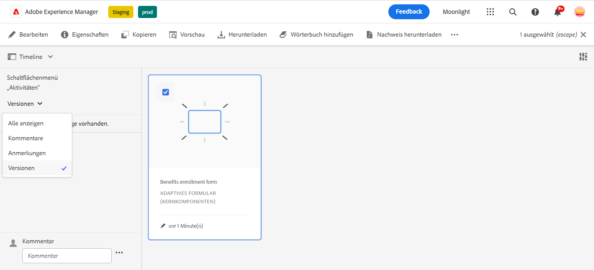
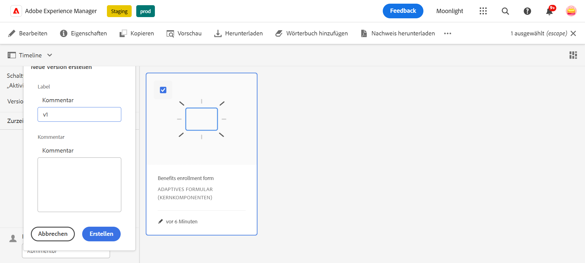
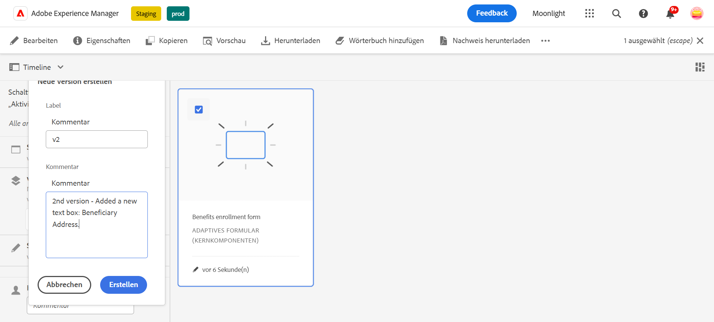
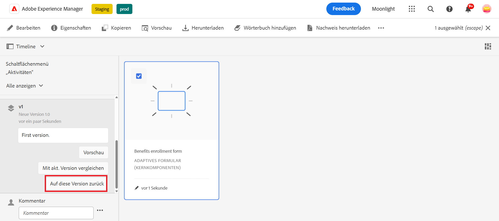
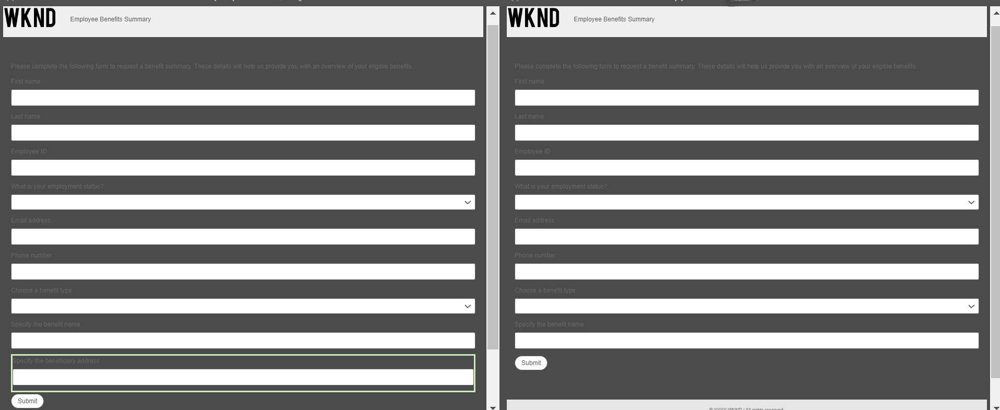
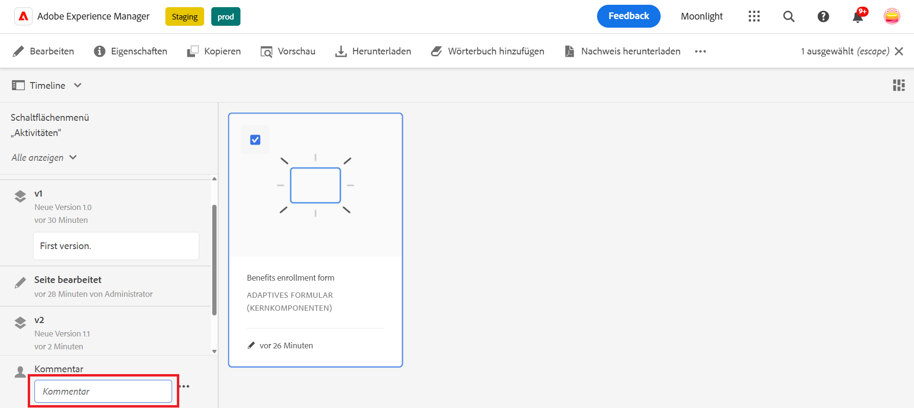
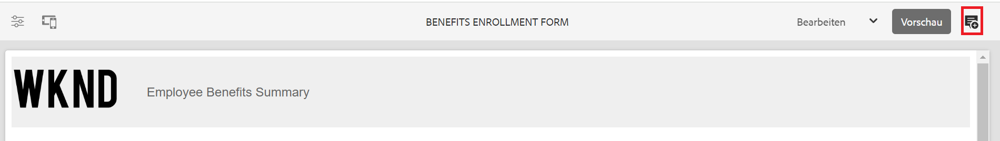
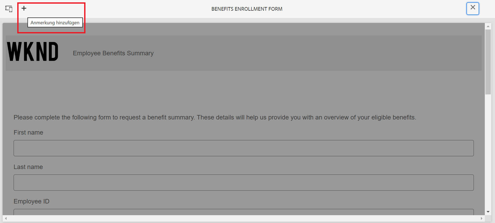
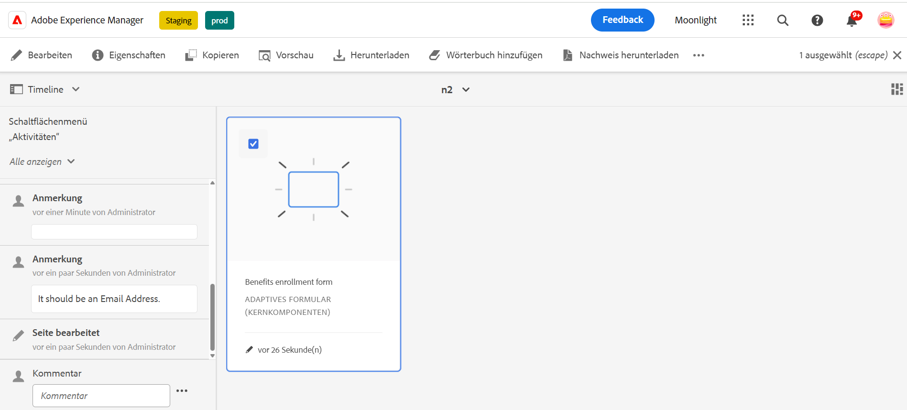

# Versionierung, Überprüfung und Kommentierung eines adaptiven Formulars

<!--
 This feature is under the early adopter program. If you’re interested in joining our early access program for this feature, send an email from your official address to aem-forms-ea@adobe.com to request access 
-->

Diese Funktion ist standardmäßig nicht aktiviert. Sie können an Ihre offizielle Adresse aem-forms-ea@adobe.com schreiben, um Zugriff auf die Funktion zu beantragen.

Kernkomponenten für adaptive Formulare ermöglichen es Formularautoren, Formularen Versionierung, Kommentare und Anmerkungen hinzuzufügen. Diese Funktionen vereinfachen die Formularentwicklung, indem sie es Benutzenden ermöglichen, mehrere Versionen zu erstellen und zu verwalten, Kommentare zu erstellen und Notizen zu bestimmten Formularabschnitten hinzuzufügen, wodurch die Formularerstellung verbessert wird.

## Voraussetzung {#prerequisite-versioning}

Um Versionierungs-, Kommentar- und Anmerkungsfunktionen in einem adaptiven Formular zu verwenden, stellen Sie sicher, dass [Kernkomponenten für adaptive Formulare](https://experienceleague.adobe.com/de/docs/experience-manager-65/content/forms/adaptive-forms-core-components/enable-adaptive-forms-core-components) in Ihrer AEM 6.5 Forms-Umgebung aktiviert sind.

## Versionierung adaptiver Formulare {#adaptive-form-versioning}

Durch die Versionierung adaptiver Formulare können Versionen zu einem Formular hinzugefügt werden. Formularautoren und -autorinnen können einfach mehrere Versionen eines Formulars erstellen und schließlich die Version verwenden, die für die jeweiligen Geschäftsziele geeignet ist. Darüber hinaus haben Formularbenutzende die Möglichkeit, das Formular auf vorherige Versionen zurückzusetzen. Außerdem können Autorinnen und Autoren zwei Versionen eines Formulars vergleichen, indem sie sie in einer Vorschau anzeigen und so im Kontext der Benutzeroberfläche besser analysieren können. Im Folgenden werden die einzelnen Funktionen für die Versionierung adaptiver Formulare genauer beschrieben:

### Erstellen einer Formularversion {#create-a-form-version}

Gehen Sie wie folgt vor, um eine Version eines Formulars zu erstellen:

1. Navigieren Sie in Ihrer AEM Forms-Umgebung zu **[!UICONTROL Formular]**>**[!UICONTROL Forms und]** und wählen Sie Ihr **Formular** aus.
1. Wählen Sie aus dem Dropdown-Menü „Auswahl“ im linken Bereich **[!UICONTROL Versionen]** aus.
   
1. Klicken Sie im unteren Bedienfeld auf der linken Seite auf die Punkte **drei Punkte** und klicken Sie auf **[!UICONTROL Als Version speichern]**.
1. Geben Sie der Formularversion einen Titel und Sie können Informationen über das Formular durch einen Kommentar hinzufügen.
   

### Aktualisieren einer Formularversion {#update-a-form-version}

Nachdem Sie das Formular bearbeitet und aktualisiert haben, fügen Sie eine neue Version zum Formular hinzu. Führen Sie die im letzten Abschnitt beschriebenen Schritte aus, um eine neue Version des Formulars zu benennen, wie in der folgenden Abbildung dargestellt:

### Wiederherstellen einer Formularversion {#revert-a-form-version}

Um eine Formularversion wieder auf die vorherige Version zurückzusetzen, wählen Sie eine Formularversion aus und klicken Sie auf **[!UICONTROL Auf diese Version zurück]**.

### Vergleichen von Formularversionen {#compare-form-versions}

Formularautorinnen und -autoren können zwei verschiedene Versionen eines Formulars zu Vorschauzwecken vergleichen. Um Versionen zu vergleichen, wählen Sie eine beliebige Formularversion aus und klicken Sie auf **[!UICONTROL Mit aktueller Version vergleichen]**. Es werden zwei verschiedene Formularversionen im Vorschaumodus angezeigt.

## Hinzufügen von Kommentaren {#add-comments}

Bei einer Überprüfung handelt es sich um einen Mechanismus, mit dem ein oder mehrere Überprüfungspersonen zu Formularen Kommentare abgeben können. Alle Formularbenutzenden können ein Formular kommentieren oder anhand von Kommentaren einer Überprüfung unterziehen. Um ein Formular zu kommentieren, wählen Sie ein **[!UICONTROL Formular]** aus und fügen Sie dem Formular einen **[!UICONTROL Kommentar]** hinzu.

>[!NOTE]
> Wenn Sie Kommentare in Kernkomponenten für adaptive Formulare wie oben beschrieben verwenden, ist die Formularfunktion [Hinzufügen von Reviewern zu Formularen](/help/forms/using/create-reviews-forms.md) deaktiviert.

## Hinzufügen von Anmerkungen {#adaptive-form-annotations}

In vielen Fällen müssen Benutzende von Formulargruppen einem Formular Anmerkungen zu Überprüfungszwecken hinzufügen, z. B. auf einer bestimmten Registerkarte oder bei Komponenten eines Formulars. In solchen Fällen können Autoren Anmerkungen verwenden.
Um Anmerkungen zu einem Formular hinzuzufügen, führen Sie die folgenden Schritte aus:

1. Öffnen Sie ein Formular im **[!UICONTROL Bearbeitungsmodus]**.

1. Klicken Sie auf das Symbol **Hinzufügen** in der oberen rechten Leiste, wie in der folgenden Abbildung dargestellt.
   

1. Klicken Sie nun auf das **Hinzufügen**-Symbol in der linken oberen Leiste, wie in der Abbildung dargestellt, um die Anmerkung hinzuzufügen.
   

1. Nun können Sie Formularkomponenten Kommentare hinzufügen oder diese mit mehrfarbigen Skizzen versehen.

1. Um alle zu einem Formular hinzugefügten Anmerkungen anzuzeigen, wählen Sie Ihr Formular aus und Sie sehen, dass die Anmerkungen, die im linken Bereich hinzugefügt wurden, wie in der Abbildung dargestellt.

   

## Siehe auch

* [Vergleichen von Kernkomponenten für adaptive Forms](/help/forms/using/compare-forms-core-components.md)
