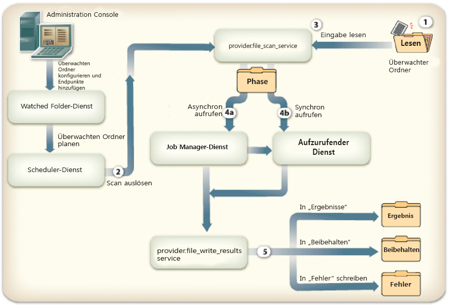
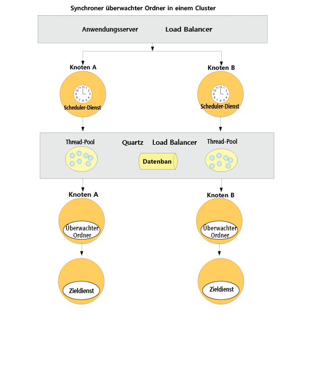
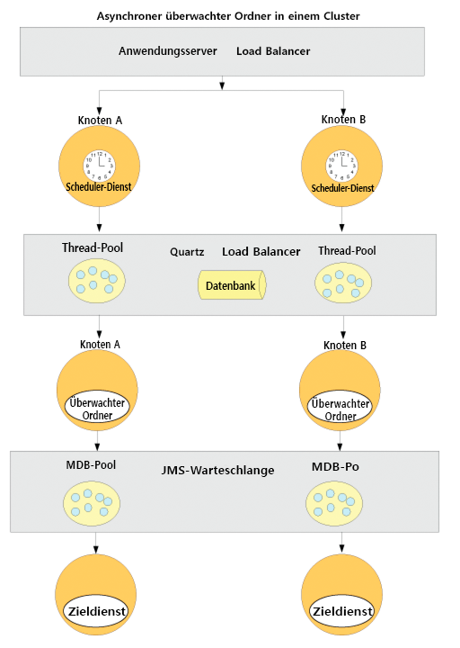

# Endpunkte des Typs „Überwachter Ordner“ konfigurieren {#configuring-watched-folder-endpoints}

Ein Administrator kann einen Netzwerkordner konfigurieren, der als *überwachter Ordner* bezeichnet wird, sodass ein konfigurierter Dienstvorgang zur Verarbeitung einer Datei aufgerufen wird, wenn ein Benutzer eine Datei (z. B. eine PDF-Datei) in diesem überwachten Ordner ablegt. Nachdem der Dienst den vorgesehenen Vorgang ausgeführt hat, wird die geänderte Datei in einem angegebenen Ausgabeordner gespeichert.

## Watched Folder-Dienst konfigurieren {#configuring-the-watched-folder-service}

Bevor Sie einen überwachten Ordner als Endpunkt konfigurieren, konfigurieren Sie den Watched Folder-Dienst. Die Konfigurationsparameter des Watched Folder-Dienstes haben zwei Verwendungszwecke:

* Das Konfigurieren von Attributen, die für alle Endpunkte des Typs „Überwachter Ordner“ gültig sind
* Das Bereitstellen von Standardwerten für alle Endpunkte des Typs „Überwachter Ordner“

Im Anschluss an die Konfiguration des Watched Folder-Dienstes fügen Sie einen Endpunkt des Typs „Überwachter Ordner“ für den Zieldienst hinzu. Beim Hinzufügen des Endpunktes legen Sie Werte fest, z. B. den Dienstnamen und den Vorgangsnamen, die aufgerufen werden sollen, wenn Dateien oder Ordner im Eingabeordner des konfigurierten Watched Folder-Dienstes abgelegt werden. Weitere Informationen zum Konfigurieren des Watched Folder-Dienstes finden Sie unter [Einstellungen des Watched Folder-Dienstes](/help/forms/using/admin-help/configure-service-settings.md#watched-folder-service-settings).

## Überwachten Ordner erstellen  {#creating-a-watched-folder}

Es gibt zwei Möglichkeiten, einen überwachten Ordner zu erstellen:

* Geben Sie bei der Konfiguration der Einstellungen für einen Endpunkt des Typs „Überwachter Ordner“ den vollständigen Pfad zum übergeordneten Ordner ein und hängen Sie den Namen des zu erstellenden überwachten Ordners an. Beispiel:
   `  C:\MyPDFs\MyWatchedFolder`Da der Ordner „MyWatchedFolder“ noch nicht vorhanden ist, versucht AEM Forms, ihn an diesem Speicherort zu erstellen.

* Erstellen Sie vor dem Konfigurieren eines Endpunktes des Typs „Überwachter Ordner“ einen Ordner im Dateisystem und geben Sie anschließend den vollständigen Pfad in das Feld „Pfad“ ein.

In einer Clusterumgebung muss der Ordner, der als überwachter Ordner verwendet wird, zugriffsbereit sein, Schreibzugriff bieten und im Dateisystem oder Netzwerk freigegeben sein. In diesen Szenario muss jede Anwendungsserverinstanz des Clusters Zugriff auf denselben freigegebenen Ordner haben.

Wird der Anwendungsserver unter Windows als Dienst ausgeführt, muss er durch eine der folgenden Methoden mit dem entsprechenden Zugriff auf den freigegebenen Ordner gestartet werden:

* Konfigurieren Sie den **Parameter** „Log On As“ des Anwendungsserverdiensts so, dass er als spezifischer Benutzer mit geeignetem Zugriff auf den freigegebenen überwachten Ordner gestartet wird.
* Konfigurieren Sie die Option „Start as Local System“ des Anwendungsserverdiensts so, dass die Interaktion des Diensts mit dem Desktop zulässig ist. Diese Option erfordert, dass der freigegebene überwachte Ordner für alle zugriffsbereit ist und Schreibzugriff bietet.

## Überwachte Ordner verketten  {#chaining-together-watched-folders}

Überwachte Ordner können miteinander verkettet werden, sodass ein Zieldokument eines überwachten Ordners das Eingabedokument des nächsten überwachten Ordners wird. Jeder überwachte Ordner kann einen anderen Dienst aufrufen. Indem überwachte Ordner auf diese Weise konfiguriert werden, können mehrere Dienste aufgerufen werden. Beispiel: Ein überwachter Ordner kann PDF-Dateien in Adobe PostScript® und ein anderer PostScript-Dateien in PDF/A konvertieren. Legen Sie dazu den *Ergebnisordner* des ersten überwachten Ordners, der vom ersten Endpunkt definiert wird, so fest, dass dieser auf den *Eingabeordner* des überwachten Ordners zeigt, der vom zweiten Endpunkt festgelegt ist.

Die Ausgabe der ersten Konvertierung wird an „\Pfad\result“ übergeben. Als Eingabe der zweiten Konvertierung dient „\Pfad\result“, und die Ausgabe der zweiten Konvertierung wird in „\Pfad\result\result“ oder den Ordner übertragen, den Sie im Feld „Ergebnisordner“ für die zweite Konvertierung angegeben haben.

## Anleitung zum Arbeiten mit überwachten Ordnern {#how-users-interact-with-watched-folders}

Bei Endpunkten des Typs „überwachter Ordner“ können Benutzer Dateien oder Ordner vom Desktop in einen überwachten Ordner kopieren oder ziehen. Die Dateien werden in der Reihenfolge ihres Eingangs verarbeitet.

Wenn bei Endpunkten des Typs „überwachter Ordner“ der Auftrag nur eine Eingabedatei erfordert, kann der Benutzer diese Datei in den Stammordner des überwachten Ordners kopieren.

Wenn der Auftrag mehrere Eingabedateien umfasst, muss der Benutzer einen Ordner außerhalb der Hierarchie des überwachten Ordners erstellen, der alle erforderlichen Dateien enthält. Dieser neue Ordner muss die Eingabedateien und optional eine DDX-Datei enthalten, falls dies vom Prozess angefordert wird. Nachdem der Auftragsordner erstellt wurde, kopiert ihn der Benutzer in den Eingabeordner des überwachten Ordners.

>[!NOTE]
>
>Stellen Sie sicher, dass der Anwendungsserver Löschzugriff auf die Dateien im überwachten Ordner hat. Wenn AEM Forms die Dateien nicht aus dem Eingabeordner löschen kann, nachdem sie durchsucht wurden, wird der dazugehörige Prozess unendlich oft aufgerufen.

## Ausgabe des überwachten Ordners  {#watched-folder-output}

Wenn die Eingabe ein Ordner ist und die Ausgabe mehrere Dateien umfasst, erstellt AEM Forms einen Ausgabeordner mit dem Namen des Eingabeordners und kopiert die Ausgabedateien in diesen Ordner. Besteht die Ausgabe aus einer Dokumentzuordnung mit einem Schlüssel-/Wert-Paar, wie z. B. die Ausgabe eines Output-Prozesses, wird der Schlüssel als Ausgabedateiname verwendet.

Die Ausgabedateinamen, die aus einem Endpunktprozess resultieren, dürfen keine anderen Zeichen als Buchstaben, Zahlen und einen Punkt (.) vor der Dateinamenerweiterung enthalten. AEM Forms konvertiert andere Zeichen in Hexadezimalwerte.

Clientanwendungen rufen die Zieldokumente aus dem Ergebnisordner des überwachten Ordners ab. Prozessfehler werden im Fehlerordner des überwachten Ordners protokolliert.

## Funktionsweise überwachter Ordner  {#how-watched-folder-works}

Das Watched Folder-Modul enthält folgende Dienste:

* Watched Folder-Dienst
* provider.file_scan_service
* provider.file_write_results_service

Zusätzlich zu diesen Diensten hängt der Watched Folder-Dienst auch von anderen Diensten ab, z. B. dem Scheduler-Dienst für das Planen der Aufträge und dem Job Manager-Dienst zur Unterstützung des asynchronen Aufrufs von Zieldiensten.

### Aufrufanforderung durch den Watched Folder-Dienst verarbeiten  {#how-watched-folder-processes-an-invocation-request}

Der Watched Folder-Dienst verarbeitet das Erstellen, Aktualisieren und Löschen der Endpunkte. Nachdem der Administrator die Endpunkte erstellt hat, werden sie für eine Auslösung durch den Scheduler-Dienst basierend auf dem angegebenen Wiederholungsintervall oder Cron-Ausdruck geplant.

Dieses Diagramm zeigt, wie eine Aufrufanforderung von Watched Folder-Prozessen verarbeitet wird.

Der Prozess des Aufrufens eines Dienstes mithilfe überwachter Ordner läuft folgendermaßen ab:

1. Eine Clientanwendung legt Dateien oder Ordner im Eingabeordner des überwachten Ordners ab.
1. Wenn das Auftragssuchintervall abgelaufen ist, ruft der Scheduler-Dienst den „provider.file_scan_service“-Dienst auf, um die Dateien oder Ordner im Eingabeordner zu verarbeiten.
1. Der „provider.file_scan_service“-Dienst führt die folgenden Aufgaben aus:

   * Der Dienst durchsucht den Eingabeordner nach Dateien oder Ordnern, die dem Muster für einzuschließende Dateien entsprechen, und schließt Dateien oder Ordner aus, die dem Muster für auszuschließende Dateien entsprechen. Die ältesten Dateien oder Ordner werden zuerst ausgewählt. Dateien und Ordner, die älter als die Wartezeit sind, werden ebenfalls ausgewählt. In einem Suchvorgang basiert die Anzahl der verarbeiteten Dateien bzw. Ordner auf der Batchgröße. Informationen zu Dateimustern finden Sie unter [Grundlegendes zu Dateimustern](configuring-watched-folder-endpoints.md#about-file-patterns). Informationen zum Einstellen der Stapelgröße finden Sie unter [Einstellungen des Watched Folder-Dienstes](/help/forms/using/admin-help/configure-service-settings.md#watched-folder-service-settings).
   * Der Dienst wählt die zu verarbeitenden Dateien oder Ordner aus. Wenn die Dateien oder Ordner nicht vollständig heruntergeladen wurden, werden sie im nächsten Suchvorgang ausgewählt. Um sicherzustellen, dass Ordner vollständig heruntergeladen werden, müssen Administratoren unter Verwendung des Musters für auszuschließende Dateien einen benannten Ordner erstellen. Nachdem der Ordner alle Dateien enthält, muss er in das Muster umbenannt werden, das im Muster für einzuschließende Dateien angegeben ist. Dieser Schritt gewährleistet, dass der Ordner alle erforderlichen Dateien zum Aufrufen des Dienstes enthält. Informationen zum Sicherstellen, dass Ordner vollständig heruntergeladen sind, finden Sie unter [Tipps und Tricks für überwachte Ordner](configuring-watched-folder-endpoints.md#tips-and-tricks-for-watched-folders).
   * Der Dienst verschiebt die Dateien oder Ordner in den Bereitstellungsordner, nachdem sie zur Verarbeitung ausgewählt wurden.
   * Der Dienst konvertiert die Dateien oder Ordner im Bereitstellungsordner basierend auf den Parameterzuordnungen für die Endpunkteingabe. Beispiele für Zuordnungen von Eingabeparametern finden Sie unter [Tipps und Tricks für überwachte Ordner](configuring-watched-folder-endpoints.md#tips-and-tricks-for-watched-folders).

1. Der für den Endpunkt konfigurierte Zieldienst wird entweder synchron oder asynchron aufgerufen. Der Zieldienst wird unter Verwendung des Benutzernamens und Kennworts aufgerufen, die für den Endpunkt konfiguriert sind.

   * Bei einem synchronen Aufruf wird der Zieldienst direkt aufgerufen, woraufhin die Antwort unmittelbar verarbeitet wird.
   * Bei einem asynchronen Aufruf wird der Zieldienst über den Job Manager-Dienst aufgerufen, der die Anforderung in einer Warteschlange ablegt. Der Job Manager-Dienst ruft wiederum den „provider.file_write_results_service“-Dienst auf, um die Ergebnisse zu verarbeiten.

1. Der „provider.file_write_results_service“-Dienst verarbeitet die Antwort oder das Fehlschlagen des Zieldienstaufrufs. Bei erfolgreichem Abschluss wird die Ausgabe auf Grundlage der Endpunktkonfiguration im Ergebnisordner gespeichert. Der „provider.file_write_results_service“-Dienst behält auch die Quelle bei, wenn der Endpunkt für die Beibehaltung der Ergebnisse nach einem erfolgreichen Abschluss konfiguriert ist.

   Wenn der Aufruf des Zieldienstes fehlschlägt, protokolliert der „provider.file_write_results_service“-Dienst den Grund in der Datei „failure.log“ und legt diese Datei im Fehlerordner ab. Der Fehlerordner wird auf Grundlage der für den Endpunkt angegebenen Konfigurationsparameter erstellt. Wenn der Administrator die Option „Bei Fehler beibehalten“ für die Endpunktkonfiguration festlegt, kopiert der „provider.file_write_results_service“-Dienst auch die Quelldateien in den Fehlerordner. Informationen zum Wiederherstellen von Dateien aus dem Fehlerordner finden Sie unter [Fehlerquellen und Wiederherstellung](configuring-watched-folder-endpoints.md#failure-points-and-recovery).

## Einstellungen für Endpunkte des Typs „Überwachter Ordner“  {#watched-folder-endpoint-settings}

Mithilfe der folgenden Einstellungen können Sie einen Endpunkt des Typs „überwachter Ordner“ konfigurieren.

**Name:**  (Obligatorisch) Gibt den Endpunkt an. Der Name darf kein &lt;-Zeichen enthalten, weil dadurch die Anzeige des Namens in Workspace abgeschnitten wird. Wenn Sie eine URL als Name des Endpunktes angeben, vergewissern Sie sich, dass sie den in RFC1738 angegebenen Syntaxregeln entspricht.

**Beschreibung:** Eine Beschreibung des Endpunkts. Der Name darf kein &lt;-Zeichen enthalten, weil dadurch die Anzeige des Namens in Workspace abgeschnitten wird.

**Pfad:**  (Obligatorisch) Gibt den Speicherort des überwachten Ordners an. In einer Clusterumgebung muss diese Einstellung auf einen freigegebenen Netzwerkordner zeigen, auf den alle Computer im Cluster zugreifen können.

**Asynchron:** Identifiziert den Aufruftyp als asynchron oder synchron. Der Standardwert ist „asynchron“. „Asynchron“ wird für langlebige Prozesse empfohlen, während „synchron“ für transiente und kurzlebige Prozesse empfohlen wird.

**Cron-Ausdruck:** Geben Sie einen Cron-Ausdruck ein, wenn der überwachte Ordner mithilfe eines Cron-Ausdrucks geplant werden muss. Wenn diese Einstellung konfiguriert ist, wird „Repeat Interval“ ignoriert.

**Wiederholungsintervall:** Das Intervall in Sekunden, in dem der überwachte Ordner auf Eingaben überprüft wird. Außer wenn die Einstellung „Einschränken“ aktiviert ist, muss „Wiederholungsintervall“ größer als die Dauer zum Verarbeiten eines durchschnittlichen Auftrags sein. Andernfalls kann das System überlastet werden. Der Standardwert ist „5“. Weitere Informationen finden Sie in der Beschreibung für die Stapelgröße.

**Wiederholungsanzahl:** Gibt an, wie oft der überwachte Ordner den Ordner überprüft. Der Wert „-1“ bedeutet uneingeschränktes Überprüfen („unendlich“). Der Standardwert ist -1.

**Einschränken:** Wenn diese Option aktiviert ist, wird die Anzahl der Aufträge für den überwachten Ordner begrenzt, die AEM Formularprozesse zu jeder Zeit verarbeiten. Die maximale Anzahl von Aufträgen wird durch den Wert von „Stapelgröße“ bestimmt. (Siehe Informationen zu Einschränkungen.)

**Benutzername:**  (Obligatorisch) Der Benutzername, der beim Aufrufen eines Zieldienstes aus dem überwachten Ordner verwendet wird. Der Standardwert ist „SuperAdmin“.

**Domänenname:**  (Obligatorisch) Die Domäne des Benutzers. Der Standardwert ist „DefaultDom“.

**Stapelgröße:** Die Anzahl der Dateien oder Ordner, die pro Überprüfung aufgenommen werden. Mit dieser Einstellung können Sie eine Überlastung des Systems verhindern, da das gleichzeitige Überprüfen zu vieler Dateien zu einem Absturz führen kann. Der Standardwert ist 2. 

Die Einstellungen für Wiederholungsintervall und Stapelgröße bestimmen, wie viele Dateien bei jeder Überprüfung vom Watched Folder-Dienst ausgewählt werden. Der Watched Folder-Dienst verwendet einen Quartz-Threadpool, um den Eingabeordner zu überprüfen. Der Threadpool wird mit anderen Diensten gemeinsam verwendet. Wenn das Überprüfungsintervall kurz ist, wird der Eingabeordner häufig von den Threads überprüft. Falls häufig Dateien im überwachten Ordner abgelegt werden, sollten Sie ein kurzes Überprüfungsintervall wählen. Wenn Dateien nicht häufig abgelegt werden, verwenden Sie ein größeres Überprüfungsintervall, damit die anderen Dienste die Threads verwenden können.

Falls eine große Anzahl von Dateien abgelegt wird, wählen Sie eine große Stapelgröße. Wenn beispielsweise der vom Endpunkt des Typs „überwachter Ordner“ aufgerufene Dienst 700 Dateien pro Minute verarbeiten kann und die Benutzer Dateien mit derselben Rate im Eingabeordner ablegen, verbessert das Festlegen der Stapelgröße auf 350 und des Wiederholungsintervalls auf 30 Sekunden die Leistung des Watched Folder-Dienstes, ohne dass der überwachte Ordner allzu häufig überprüft werden muss.

Wenn Dateien im überwachten Ordner abgelegt werden, werden die Dateien in der Eingabe aufgelistet. Dadurch kann die Leistung reduziert werden, wenn jede Sekunde eine Überprüfung stattfindet. Durch Erhöhen des Überprüfungsintervalls kann die Leistung verbessert werden. Wenn das Volumen der abgelegten Dateien gering ist, passen Sie die Stapelgröße und das Wiederholungsintervall entsprechend an. Wenn beispielsweise jede Sekunde 10 Dateien abgelegt werden, probieren Sie ein Wiederholungsintervall von 1 Sekunde und eine Stapelgröße von 10 aus. 

**Wartezeit:** Die Zeit in Millisekunden, die gewartet wird, bevor ein Ordner oder eine Datei nach der Erstellung überprüft wird. Wenn die Wartezeit beispielsweise 3.600.000 Millisekunden (eine Stunde) beträgt und die Datei vor einer Minute erstellt wurde, wird diese Datei nach Ablauf von mindestens 59 Minuten abgerufen. Der Standardwert ist 0.

Diese Einstellung ist nützlich, um sicherzustellen, dass eine Datei oder ein Ordner vollständig in den Eingabeordner kopiert wurde. Wenn Sie beispielsweise eine große Datei verarbeiten müssen und das Herunterladen der Datei zehn Minuten dauert, legen Sie die Wartezeit auf 10&amp;ast;60 &amp;ast;1000 Millisekunden fest. Dies verhindert, dass der überwachte Ordner die Datei überprüft, wenn sie nicht 10 Minuten alt ist.

**Muster für auszuschließende Dateien:** Ein Semikolon  **; eine durch** Trennzeichen getrennte Liste von Mustern, mit denen ein überwachter Ordner bestimmt, welche Dateien und Ordner überprüft und aufgenommen werden sollen. Alle Dateien oder Ordner, die diesem Muster entsprechen, werden nicht für die Verarbeitung überprüft.

Diese Einstellung ist hilfreich, wenn die Eingabe aus einem Ordner mit mehreren Dateien besteht. Der Inhalt des Ordners kann in einen Ordner mit einem Namen kopiert werden, der vom überwachten Ordner aufgenommen wird. Dies verhindert, dass der überwachte Ordner einen Ordner für die Verarbeitung aufnimmt, bevor dieser vollständig in den Eingabeordner kopiert ist.

Sie können Dateimuster verwenden, um Folgendes auszuschließen:

* Dateien mit bestimmten Dateinamenerweiterungen; Beispiel: &amp;ast;.dat, &amp;ast;.xml, &amp;ast;.pdf.
* Dateien mit bestimmten Namen, z. B. data.&amp;ast; würde Dateien und Ordner mit den Namen *data1*, *data2* usw. ausschließen.
* Dateien mit zusammengesetzten Ausdrücken in Name und Erweiterung, wie in den folgenden Beispielen:

   * Data[0-9][0-9][0-9].[dD][aA]&#39;port&#39;
   * &amp;ast;.[dD][Aa]&#39;port&#39;
   * &amp;ast;.[Xx][Mm][Ll]

Informationen zu Dateimustern finden Sie unter [Grundlegendes zu Dateimustern](configuring-watched-folder-endpoints.md#about-file-patterns).

**Muster für einzuschließende Dateien:** (Obligatorisch) Ein Semikolon  **; eine** Liste mit Mustern, die vom überwachten Ordner verwendet werden, um zu bestimmen, welche Ordner und Dateien überprüft und aufgenommen werden sollen. Beispiel: Wenn das Muster für einzuschließende Dateien &quot;input&amp;ast;&quot;lautet, werden alle Dateien und Ordner angezeigt, die mit &quot;input&amp;ast&quot;übereinstimmen. abgeholt werden. Hierzu gehören auch Dateien und Ordner namens „input1“, „input2“ usw.

Der Standardwert ist &amp;ast; und zeigt alle Dateien und Ordner an.

Sie können Dateimuster verwenden, um Folgendes einzuschließen:

* Dateien mit bestimmten Dateinamenerweiterungen; Beispiel: &amp;ast;.dat, &amp;ast;.xml, &amp;ast;.pdf.
* Dateien mit bestimmten Namen, z. B. data.&amp;ast; würde Dateien und Ordner namens *data1*, *data2* usw. enthalten.
* Dateien mit zusammengesetzten Ausdrücken in Name und Erweiterung, wie in den folgenden Beispielen:

   * Data[0-9][0-9][0-9].[dD][aA]&#39;port&#39;
   * &amp;ast;.[dD][Aa]&#39;port&#39;
   * &amp;ast;.[Xx][Mm][Ll]

Informationen zu Dateimustern finden Sie unter [Grundlegendes zu Dateimustern](configuring-watched-folder-endpoints.md#about-file-patterns).

**Ergebnisordner:** Der Ordner, in dem die gespeicherten Ergebnisse gespeichert werden. Wenn die Ergebnisse nicht in diesem Ordner angezeigt werden, überprüfen Sie den Fehlerordner. Schreibgeschützte Dateien werden nicht verarbeitet und im Fehlerordner gespeichert. Dieser Wert kann ein absoluter oder relativer Pfad mit folgendem Dateimuster sein:

* %F = Dateinamenpräfix
* %E = Dateinamenerweiterung
* %Y = Jahr (vollständig)
* %y = Jahr (letzte zwei Stellen)
* %M = Monat
* %D = Tag des Monats
* %d = Tag des Jahres
* %H = Stunde (24-Stunden-Format)
* %h = Stunde (12-Stunden-Format)
* %m = Minute
* %s = Sekunde
* %l = Millisekunde
* %R = Zufallszahl (zwischen 0 und 9)
* %P = Prozess- oder Auftrags-ID

Wenn es beispielsweise am 17. Juli 2009 20 Uhr ist und Sie `C:/Test/WF0/failure/%Y/%M/%D/%H/` angeben, ist der Ergebnisordner `C:/Test/WF0/failure/2009/07/17/20`.

Wenn der Pfad nicht absolut, sondern relativ ist, wird der Ordner im überwachten Ordner erstellt. Der Standardwert ist „result/%Y/%M/%D/“, der Ergebnisordner im überwachten Ordner. Informationen zu Dateimustern finden Sie unter [Grundlegendes zu Dateimustern](configuring-watched-folder-endpoints.md#about-file-patterns).

>[!NOTE]
>
>Je kleiner die Größe des Ergebnisordners ist, desto höher wird die Watched Folder-Leistung sein. Wenn beispielsweise die geschätzte Belastung für den überwachten Ordner bei 1000 Dateien pro Stunde liegt, sollten Sie ein Muster wie `result/%Y%M%D%H` verwenden, sodass jede Stunde ein neuer Unterordner erstellt wird. Wenn die Belastung geringer ist (z. B. 1000 Dateien pro Tag), können Sie ein Muster wie das folgende verwenden: `result/%Y%M%D`.

**Ordner beibehalten:** Der Speicherort, an dem Dateien nach erfolgreichem Prüfen und Abrufen gespeichert werden. Dies kann ein absoluter, relativer oder leerer Ordnerpfad sein. Sie können Dateimuster verwenden, wie für „Ergebnisordner“ beschrieben. Der Standardwert ist „preserve/%Y/%M/%D/“.

**Fehlerordner:** Der Ordner, in dem Fehlerdateien gespeichert werden. Dieser Speicherort ist stets relativ zum überwachten Ordner. Sie können Dateimuster verwenden, wie für „Ergebnisordner“ beschrieben.

Schreibgeschützte Dateien werden nicht verarbeitet und im Fehlerordner gespeichert.

Der Standardwert ist „failure/%Y/%M/%D/“.

**Bei Fehler beibehalten:** Behält die Eingabedateien bei, wenn der Vorgang für einen Dienst nicht ausgeführt werden konnte. Der Standardwert lautet true.

**Doppelte Dateinamen überschreiben:** Bei Festlegung auf &quot;True&quot;werden Dateien im Ergebnisordner und im Aufbewahrungsordner überschrieben. Bei Festlegung auf „False“ wird an die Namen von Dateien und Ordnern ein numerisches Indexsuffix angehängt. Der Standardwert ist „False“.

**Bereinigungsdauer:**  (Obligatorisch) Dateien und Ordner im Ergebnisordner werden bereinigt, wenn sie älter als dieser Wert sind. Dieser Wert wird in Tagen gemessen. Diese Einstellung hilft dafür zu sorgen, dass der Ergebnisordner nicht voll wird.

Ein Wert von „-1“ Tage bedeutet, dass der Ergebnisordner nie gelöscht wird. Der Standardwert ist -1.

**Vorgangsname:**  (Obligatorisch) Eine Liste von Vorgängen, die dem Endpunkt des überwachten Ordners zugewiesen werden können.

**Zuordnungen von Eingabeparametern:** Wird zum Konfigurieren der für die Verarbeitung des Dienstes und Vorgangs erforderlichen Eingabe verwendet. Die verfügbaren Einstellungen hängen davon ab, welcher Dienst den überwachten Ordner-Endpunkt verwendet. Es gibt zwei Eingabetypen:

**Literal:** Der überwachte Ordner verwendet den in das Feld eingegebenen Wert so, wie er angezeigt wird. Alle grundlegenden Java-Typen werden unterstützt. Wenn eine API beispielsweise Eingaben wie String, Long, Int oder Boolean verwendet, wird die Zeichenfolge in einen ordnungsgemäßen Typ konvertiert und der Dienst aufgerufen.

**Variable:** Der eingegebene Wert ist ein Dateimuster, mit dem der überwachte Ordner die Eingabe auswählt. Beispielsweise kann der Benutzer im Fall des Kennwortdienstes, bei dem das Eingabedokument eine PDF-Datei sein muss, &amp;ast;.pdf als Dateimuster verwenden. Der überwachte Ordner nimmt alle Dateien im überwachten Ordner auf, die diesem Muster entsprechen, und ruft für jede Datei den Dienst auf. Wenn eine Variable verwendet wird, werden alle Eingabedateien in Dokumente konvertiert. Nur APIs, die „Document“ als Eingabetyp verwenden, werden unterstützt.

**Zuordnungen von Ausgabeparametern:** Wird zum Konfigurieren der Ausgaben des Dienstes und Vorgangs verwendet. Die verfügbaren Einstellungen hängen davon ab, welcher Dienst den überwachten Ordner-Endpunkt verwendet.

Die Watched Folder-Ausgabe kann ein einzelnes Dokument, eine Liste von Dokumenten oder eine Zuordnung von Dokumenten sein. Diese Ausgabe-Dokumente werden anschließend mithilfe des in der Ausgabeparameterzuordnung angegebenen Musters im Ergebnisordner gespeichert.

>[!NOTE]
>
>Das Angeben von Namen, die zu eindeutigen Ausgabedateinamen führen, verbessert die Leistung. Betrachten Sie beispielsweise den Fall, dass der Dienst ein Ausgabedokument zurückgibt und die Ausgabeparameterzuordnung es `%F.%E` (dem Dateinamen und der Erweiterung der Eingabedatei) zuordnet. In diesem Fall, wenn der Benutzer jede Minute Dateien mit demselben Namen ablegt und der Ergebnisordner auf `result/%Y/%M/%D` konfiguriert ist und die Einstellung „Doppelt vorhandene Dateinamen überschreiben“ deaktiviert ist, versucht der Watched Folder-Dienst die doppelten Dateinamen aufzulösen. Der Prozess des Auflösens von doppelten Dateinamen kann Auswirkungen auf die Leistung haben. In diesem Fall kann die Leistung durch Ändern der Ausgabeparameterzuordnung auf `%F_%h_%m_%s_%l` verbessert werden, um dem Namen Stunden, Minuten, Sekunden und Millisekunden hinzuzufügen oder sicherzustellen, dass abgelegte Dateien über eindeutige Namen verfügen.

## Informationen zu Dateimustern {#about-file-patterns}

Administratoren können den Dateityp angeben, von dem ein Dienst aufgerufen werden kann. Für jeden überwachten Ordner können mehrere Dateimuster angegeben werden. Ein Dateimuster kann eine der folgenden Dateieigenschaften sein:

* Dateien mit bestimmten Dateinamenerweiterungen; Beispiel: &amp;ast;.dat, &amp;ast;.xml, &amp;ast;.pdf,;
* Dateien mit bestimmten Namen, z. B. data.&amp;ast;
* Dateien mit zusammengesetzten Ausdrücken in Name und Erweiterung, wie in den folgenden Beispielen:

   * Data[0-9][0-9][0-9].[dD][aA]&#39;port&#39;
   * &amp;ast;.[dD][Aa]&#39;port&#39;
   * &amp;ast;.[Xx][Mm][Ll]

Der Administrator kann das Dateimuster für den Ausgabeordner definieren, in dem die Ergebnisse gespeichert werden sollen. Für die Ausgabeordner (Ergebnis, Beibehalten und Fehler; „result“, „preserve“ und „failure“) kann der Administrator jedes der folgenden Dateimuster angeben:

* %Y = Jahr (vollständig)
* %y = Jahr (letzte zwei Stellen)
* %M = Monat
* %D = Tag des Monats
* %d = Tag des Jahres
* %h = Stunde
* %m = Minute
* %s = Sekunde
* %R = Zufallszahl zwischen 0 und 9
* %J = Auftragsname

Der Pfad zum Ergebnisordner kann beispielsweise `C:\Adobe\Adobe_Experience_Manager_forms\BarcodedForms\%y\%m\%d` lauten.

Über Zuordnungen von Ausgabeparametern können außerdem zusätzliche Muster angegeben werden, wie z. B.:

* %F = Quelldateiname
* %E = Quelldateinamenerweiterung

Wenn das Muster der Zuordnung von Ausgabeparametern mit „File.separator“ (dem Pfadtrennzeichen) endet, wird ein Ordner erstellt und der Inhalt in diesen Ordner kopiert. Endet das Muster nicht mit „File.separator“, wird der Inhalt (Ergebnisdatei oder -ordner) mit diesem Namen erstellt. Weitere Informationen zu Zuordnungen von Ausgabeparametern finden Sie unter [Tipps und Tricks für überwachte Ordner](configuring-watched-folder-endpoints.md#tips-and-tricks-for-watched-folders).

## Informationen zu Einschränkungen {#about-throttling}

Wenn Einschränkungen für einen Endpunkt des Typs „überwachter Ordner“ aktiviert ist, wird die Anzahl Watched Folder-Aufträge, die zu jeder Zeit verarbeitet werden können, begrenzt. Die maximale Anzahl von Aufträgen wird durch den Wert von „Stapelgröße“ bestimmt, der ebenfalls im Endpunkt des Typs „überwachter Ordner“ konfiguriert werden kann. In den Eingabeordner des überwachten Ordners eingehende Dokumente werden nicht mehr abgerufen, wenn der Grenzwert für „Einschränken“ erreicht wurde. Die Dokumente bleiben ebenfalls im Eingabeordner, bis andere Watched Folder-Aufträge abgeschlossen wurden und ein erneuter Abrufversuch unternommen wird. Im Falle der synchronen Verarbeitung werden alle in einem einzigen Abruf verarbeiteten Aufträge für die Berechnung des Grenzwertes für „Einschränken“ berücksichtigt, auch wenn die Aufträge nacheinander in einem einzigen Thread verarbeitet werden.

>[!NOTE]
>
>Die Funktion „Einschränken“ ist in Clustern nicht skalierbar. Bei aktiviertem „Einschränken“ verarbeitet der Cluster zu keiner Zeit insgesamt mehr Aufträge als vom Wert „Stapelgröße“ angegeben ist. Dieser Grenzwert ist clusterweit gültig und nicht für jeden Knoten im Cluster spezifisch. Bei einer Stapelgröße von 2 kann der Grenzwert für „Einschränken“ beispielsweise von einem einzelnen Knoten bereits mit der Verarbeitung von zwei Aufträgen erreicht werden, sodass keine anderen Knoten mehr den Eingabeordner abrufen, bevor nicht einer der Aufträge abgeschlossen ist.

### Funktionsweise von „Einschränken“  {#how-throttling-works}

Der Watched Folder-Dienst überprüft den Eingabeordner zum jeweiligen Wiederholungsintervall, nimmt die in „Stapelgröße“ angegebene Anzahl von Dateien auf und ruft den Zieldienst für jede dieser Dateien auf. Wenn die Stapelgröße beispielsweise 4 beträgt, nimmt der Watched Folder-Dienst bei jeder Überprüfung vier Dateien auf, erstellt vier Aufrufanforderungen und ruft den Zieldienst auf. Wenn der Watched Folder-Dienst vor Abschluss dieser Anforderungen erneut aufgerufen wird, werden unabhängig davon, ob die vorherigen vier Aufträge abgeschlossen sind, erneut vier Aufträge gestartet.

„Einschränken“ hindert den Watched Folder-Dienst am Aufrufen neuer Aufträge, wenn vorherige Aufträge noch nicht abgeschlossen sind. Der Watched Folder-Dienst erkennt in der Bearbeitung befindliche Aufträge und verarbeitet neue Aufträge auf Grundlage der Stapelgröße abzüglich der in Bearbeitung befindlichen Aufträge. Wenn zum Zeitpunkt des zweiten Aufrufs beispielsweise erst drei Aufträge abgeschlossen sind und ein Auftrag noch in Bearbeitung ist, ruft der Watched Folder-Dienst nur drei neue Aufträge auf.

* Der Watched Folder-Dienst verwendet zur Bestimmung der Anzahl der in Bearbeitung befindlichen Aufträge die Anzahl der im Bereitstellungsordner vorhandenen Dateien. Verbleiben Dateien unverarbeitet im Bereitstellungsordner, werden keine weiteren Aufträge vom Watched Folder-Dienst aufgerufen. Wenn die Stapelgröße beispielsweise 4 beträgt und drei Aufträge angehalten sind, ruft der Watched Folder-Dienst bei Folgeaufrufen nur einen weiteren Auftrag auf. Es gibt mehrere Szenarien, in denen Dateien unverarbeitet im Bereitstellungsordner verbleiben können. Wenn Aufträge angehalten sind, können die dazugehörigen Prozesse vom Administrator auf der Seite „Verwaltung des Arbeitsablaufs für Formulare“ beendet werden, sodass diese Dateien vom Watched Folder-Dienst aus dem Bereitstellungsordner verschoben werden.
* Wenn der Formularserver heruntergefahren wird, bevor der Watched Folder-Dienst die Aufträge aufrufen kann, kann der Administrator die Dateien aus dem Bereitstellungsordner verschieben. Weitere Informationen finden Sie unter [Fehlerquellen und Wiederherstellung](configuring-watched-folder-endpoints.md#failure-points-and-recovery).
* Wenn zwar der Formularserver, aber nicht der Watched Folder-Dienst ausgeführt wird, während der Job Manager-Dienst zurückruft (wozu es kommt, wenn Dienste nicht in der richtigen Reihenfolge starten), kann der Administrator die Dateien aus dem Bereitstellungsordner verschieben. Weitere Informationen finden Sie unter [Fehlerquellen und Wiederherstellung](configuring-watched-folder-endpoints.md#failure-points-and-recovery).

## Leistung und Skalierbarkeit  {#performance-and-scalability}

Der Watched Folder-Dienst kann insgesamt 100 Ordner auf einem einzelnen Knoten verarbeiten. Die Leistung des Watched Folder-Dienstes ist von der Leistung des Formularservers abhängig. Bei asynchronem Aufruf ist die Leistung stärker von der Systemauslastung sowie von Aufträgen abhängig, die sich in der Job Manager-Warteschlange befinden.

Die Leistung des Watched Folder-Dienstes kann durch Hinzufügen von Knoten zum Cluster verbessert werden. Watched Folder-Aufträge werden durch den Quartz Scheduler auf den Clusterknoten bzw. im Falle asynchroner Anforderungen vom Job Manager-Dienst verteilt. Alle Aufträge sind persistent in der Datenbank gespeichert.

Der Watched Folder-Dienst ist bei der Zeitplanung, Aufhebung von Zeitplanungen und der erneuten Zeitplanung der Aufträge vom Scheduler-Dienst abhängig. Es stehen noch andere Dienste zur Verfügung, wie z. B. Event Management-Dienst, User Manager-Dienst oder Email Provider-Dienst, die den Threadpool des Scheduler-Dienstes gemeinsam nutzen. Dies kann sich auf die Leistung des Watched Folder-Dienstes auswirken. Wenn alle Dienste beginnen, den Threadpool des Scheduler-Dienstes zu verwenden, wird eine Leistungsoptimierung erforderlich.

## Überwachte Ordner in einem Cluster  {#watched-folders-in-a-cluster}

In einem Cluster ist der Watched Folder-Dienst beim Lastenausgleich und Failover vom Quartz Scheduler und vom Job Manager-Dienst abhängig. Weitere Informationen zum Quartz-Clusterverhalten finden Sie in der [Quartz-Dokumentation.](https://www.quartz-scheduler.org/documentation)

Der Watched Folder-Dienst führt bei jedem Abruf die folgenden drei Hauptaufgaben aus:

* Überprüfen des Ordners
* Aufrufen des Zieldienstes
* Verarbeiten der Ergebnisse

Das Lastenausgleich- und Failoververhalten ändert sich in Abhängigkeit davon, ob der überwachte Ordner für synchronen oder asynchronen Aufruf konfiguriert ist.

### Synchroner überwachter Ordner in einem Cluster  {#synchronous-watched-folder-in-a-cluster}

Bei synchronen Aufrufen entscheidet der Quartz-Lastenausgleich, welchem Knoten das Abrufereignis zugeteilt wird. Der Knoten, dem das Abrufereignis zugeteilt wird, führt alle Aufgaben aus: Überprüfen des Ordners, Aufrufen des Zieldienstes und Verarbeiten der Ergebnisse.

Wenn bei einem synchronen Aufruf ein Fehler bei einem Knoten auftritt, sendet der Quartz Scheduler neue Abrufereignisse an andere Knoten. Auf dem fehlerhaften Knoten gestartete Aufrufe gehen verloren. Weitere Informationen zum Wiederherstellen der dem fehlerhaften Auftrag zugeordneten Dateien finden Sie unter [Fehlerquellen und Wiederherstellung](configuring-watched-folder-endpoints.md#failure-points-and-recovery).

### Asynchroner überwachter Ordner in einem Cluster  {#asynchronous-watched-folder-in-a-cluster}

Bei asynchronen Aufrufen entscheidet der Quartz-Lastenausgleich, welchem Knoten das Abrufereignis zugeteilt wird. Der Knoten, dem das Abrufereignis zugeteilt wird, überprüft den Eingabeordner und ruft den Zieldienst auf, indem die Anforderung in die Warteschlange des Job Manager-Dienstes gestellt wird. Der Lastenausgleich des Job Manager-Dienstes ist dagegen für die Entscheidung verantwortlich, von welchem Knoten die Aufrufanforderung verarbeitet wird. Es ist möglich, dass eine Anforderung auf Knoten B verarbeitet wird, auch wenn die Aufrufanforderung von Knoten B erstellt wurde. Natürlich kann es auch passieren, dass der Knoten, von dem die Aufrufanforderung gestartet wurde, am Ende die Verarbeitung der Anforderung übernimmt.

Wenn bei einem asynchronen Aufruf ein Fehler bei einem Knoten auftritt, sendet der Quartz Scheduler neue Abrufereignisse an andere Knoten. Aufrufanforderungen, die auf dem fehlerhaften Knoten erstellt wurden, befinden sich in der Warteschlange des Job Manager-Dienstes und werden zur Verarbeitung an andere Knoten gesendet. Dateien, für die keine Aufrufanforderungen erstellt wurden, bleiben im Bereitstellungsordner. Weitere Informationen zum Wiederherstellen der dem fehlerhaften Auftrag zugeordneten Dateien finden Sie unter [Fehlerquellen und Wiederherstellung](configuring-watched-folder-endpoints.md#failure-points-and-recovery).

## Fehlerquellen und Wiederherstellung  {#failure-points-and-recovery}

Bei jedem Abrufereignis sperrt der Watched Folder-Dienst den Eingabeordner, verschiebt die Dateien, die dem Muster für einzuschließende Dateien entsprechen, in den Bereitstellungsordner und hebt anschließend die Sperrung des Eingabeordners wieder auf. Die Sperrung ist erforderlich, damit nicht dieselben Dateien von zwei Threads aufgenommen und doppelt verarbeitet werden. Die Wahrscheinlichkeit, dass es hierzu kommt, steigen mit einem kurzen Wiederholungsintervall und einer hohen Stapelgröße. Nachdem Dateien in den Bereitstellungsordner verschoben wurden, wird die Sperrung des Eingabeordners aufgehoben, damit andere Threads den Ordner überprüfen können. Dieser Schritt hilft bei der Bereitstellung eines hohen Durchsatzes, weil andere Threads eine Überprüfung ausführen können, während die Dateien bereits von einem Thread verarbeitet werden.

Nachdem Dateien in den Bereitstellungsordner verschoben wurden, werden für jede Datei Aufrufanforderungen erstellt und der Zieldienst aufgerufen. Es kann vorkommen, dass der Watched Folder-Dienst die Dateien im Bereitstellungsordner nicht wiederherstellen kann:

* Wird der Server heruntergefahren, bevor der Watched Folder-Dienst die Aufrufanforderung erstellen konnte, bleiben die im Bereitstellungsordner befindlichen Dateien darin und werden nicht wiederhergestellt.
* Wurden die Aufrufanforderungen für alle Dateien im Bereitstellungsordner erfolgreich vom Watched Folder-Dienst erstellt und der Server stürzt ab, gibt es zwei Verhaltensweisen in Abhängigkeit vom Aufruftyp:

**Synchron:** Wenn der Watched Folder-Dienst für den synchronen Aufruf des Dienstes konfiguriert ist, bleiben alle Dateien im Bereitstellungsordner unverarbeitet darin.

**Asynchron:** In diesem Fall ist der Watched Folder-Dienst vom Job Manager-Dienst abhängig. Wenn der Job Manager-Dienst den Watched Folder-Dienst zurückruft, werden die Dateien im Bereitstellungsordner auf Grundlage der Ergebnisse des jeweiligen Aufrufs in den Aufbewahrungs- oder Fehlerordner verschoben. Ruft der Job Manager-Dienst den Watched Folder-Dienst nicht zurück, bleiben die Dateien unverarbeitet im Bereitstellungsordner. Diese Situation tritt ein, wenn der Watched Folder-Dienst bei Rückruf des Job Managers nicht ausgeführt wird.

### Nicht verarbeitete Quelldateien im Bereitstellungsordner wiederherstellen  {#recovering-unprocessed-source-files-in-the-stage-folder}

Wenn die Quelldateien im Bereitstellungsordner nicht vom Watched Folder-Dienst verarbeitet werden können, können Sie diese wiederherstellen.

1. Starten Sie den Anwendungsserver oder Knoten neu.
1. (Optional) Beenden Sie den Watched Folder-Dienst, sodass keine neuen Eingabedateien verarbeitet werden. Wenn Sie diesen Schritt auslassen, wird es wesentlich schwerer zu bestimmen sein, welche Dateien im Bereitstellungsordner nicht verarbeitet sind. Führen Sie eine der folgenden Aufgaben aus, um den Watched Folder-Dienst an der Verarbeitung neuer Eingabedateien zu hindern:

   * Ändern Sie in „Anwendungen und Dienste“ den Parameter „Muster für einzuschließende Dateien“ für den überwachten Ordner-Endpunkt in ein Muster, das keiner der neuen Eingabedateien entspricht (geben Sie beispielsweise `NOMATCH` ein).
   * Setzen Sie den Prozess aus, der neue Eingabedateien erstellt.
   Warten Sie, bis AEM Forms alle der Dateien wiederherstellt und verarbeitet. Die Mehrheit der Dateien sollte wiederhergestellt und alle neuen Eingabedateien ordnungsgemäß verarbeitet werden. Der Zeitraum, den Sie darauf warten müssen, dass der Watched Folder-Dienst die Dateien wiederherstellt und verarbeitet, hängt von der Dauer des aufzurufenden Vorgangs sowie von der Anzahl wiederherzustellender Dateien ab.

1. Ermitteln Sie, welche Dateien nicht verarbeitet werden können. Wenn Sie ausreichend lange gewartet und den vorangehenden Schritt ausgeführt haben, sich aber immer noch nicht verarbeitete Dateien im Bereitstellungsordner befinden, fahren Sie mit dem nächsten Schritt fort.

   >[!NOTE]
   >
   >Sie können das Datum und den Zeitstempel der Dateien im Bereitstellungsordner überprüfen. In Abhängigkeit von der Anzahl der Dateien und der normalen Verarbeitungsdauer können Sie ermitteln, welche Dateien so alt sind, dass sie als blockiert betrachtet werden können.

1. Kopieren Sie die nicht verarbeiteten Dateien aus dem Bereitstellungsordner in den Eingabeordner.
1. Wenn der Watched Folder-Dienst in Schritt 2 an der Verarbeitung neuer Eingabedateien gehindert wurde, ändern Sie den Parameter „Muster für einzuschließende Dateien“ in den vorherigen Wert zurück oder aktivieren Sie den zuvor deaktivierten Prozess erneut.

## Überlegungen zur Sicherheit von überwachten Ordnern  {#security-considerations-for-watched-folders}

Jeder überwachte Ordner ist mit einem Benutzernamen und einem Kennwort konfiguriert. Diese Anmeldeinformationen werden beim Aufrufen des Dienstes verwendet. Der Watched Folder-Dienst basiert auf der Tatsache, dass der freigegebene Ordner durch das zugrunde liegende Sicherheitsdateisystem geschützt ist, sodass nur der Besitzer des überwachten Ordners auf den freigegebenen Ordner zugreifen kann.

## Tipps und Tricks für überwachte Ordner  {#tips-and-tricks-for-watched-folders}

Im Folgenden finden Sie einige Tipps und Tricks zum Konfigurieren des Endpunkts des Typs „überwachter Ordner“:

* Bei einem überwachten Ordner unter Windows, der Bilddateien verarbeitet, geben Sie Werte für die Optionen „Muster für einzuschließende Dateien“ bzw. „Muster für auszuschließende Dateien“ an, um zu verhindern, dass die automatisch von Windows erzeugte Datei „Thumbs.db“ vom überwachten Ordner abgerufen wird.
* Wenn ein Cron-Ausdruck angegeben ist, wird das Wiederholungsintervall ignoriert. Die Verwendung des Cron-Ausdrucks basiert auf dem Open-Source-Auftragsplanungssystem Quartz, Version 1.4.0.
* Die Stapelgröße ist die Anzahl der Dateien und Ordner, die bei jeder Überprüfung des überwachten Ordners aufgenommen wird. Wenn die Stapelgröße auf 2 festgelegt ist und zehn Dateien oder Ordner im überwachten Ordner abgelegt werden, werden bei jeder Überprüfung nur zwei aufgenommen. Bei der nächsten Überprüfung, die nach dem im Wiederholungsintervall angegebenen Zeitraum eintritt, werden die nächsten zwei Dateien aufgenommen.
* Administratoren können reguläre Ausdrücke mit der zusätzlichen Unterstützung durch Platzhalterzeichenmuster als Dateimuster angeben. Der Watched Folder-Dienst ändert den regulären Ausdruck, um Platzhaltermuster wie &amp;ast; zu unterstützen.&amp;ast; oder &amp;ast;.pdf. Diese Platzhalterzeichenmuster werden nicht von regulären Ausdrücken unterstützt.
* Der Watched Folder-Dienst überprüft den Eingabeordner auf Eingaben und erkennt nicht, ob die Quelldatei bzw. der Quellordner bereits vollständig in den Eingabeordner kopiert ist, bevor die Verarbeitung der Datei oder des Ordners begonnen wird. Führen Sie folgende Aufgaben durch, um sicherzustellen, dass die Quelldatei bzw. der Quellordner vollständig in den Eingabeordner des überwachten Ordners kopiert ist, bevor die Datei oder der Ordner aufgenommen wird:

   * Verwenden Sie „Wartezeit“, wobei es sich um den Zeitraum in Millisekunden handelt, den der Watched Folder-Dienst ab dem Zeitpunkt der letzten Änderung wartet. Verwenden Sie dieses Feature, wenn große Dateien verarbeitet werden. Wenn das Herunterladen einer Datei z. B. 10 Minuten dauert, geben Sie die Wartezeit als 10&amp;ast;60 &amp;ast;1000 Millisekunden an. Dies verhindert, dass der Watched Folder-Dienst die Datei aufnimmt, wenn sie nicht bereits 10 Minuten alt ist.
   * Verwenden Sie „Muster für auszuschließende Dateien“ und „Muster für einzuschließende Dateien“. Wenn das Muster für auszuschließende Dateien beispielsweise `ex*` lautet und das Muster für einzuschließende Dateien `in*` lautet, nimmt der Watched Folder-Dienst die Dateien auf, die mit &quot;in&quot;beginnen, und nicht die Dateien, die mit &quot;ex&quot;beginnen. Benennen Sie zum Kopieren großer Dateien oder Ordner zuerst die Datei bzw. den Ordner so um, dass der Name mit „ex“ beginnt. Nachdem die Datei oder der Ordner mit dem Namen &quot;ex&quot;vollständig in den überwachten Ordner kopiert wurde, benennen Sie sie in &quot;in&amp;ast;&quot;um.

* Verwenden Sie die „Bereinigungszeit“, um den Ergebnisordner leer zu halten. Der Watched Folder-Dienst bereinigt alle Dateien, die älter als die unter „Bereinigungszeit“ angegebene Dauer sind. Die Dauer wird in Tagen angegeben.
* Wenn ein Endpunkt des Typs „überwachter Ordner“ hinzugefügt wird, wird nach der Auswahl des Vorgangsnamens die Zuordnung von Eingabeparametern ausgefüllt. Für jede Eingabe des Vorgangs wird ein Feld für die Zuordnung von Eingabeparametern erzeugt. Im Folgenden finden Sie Beispiele für Zuordnungen von Eingabeparametern:

   * Für die Eingabe `com.adobe.idp.Document` gilt: Wenn der Eingabetyp des Dienstvorgangs `Document` ist, kann der Administrator den Zuordnungstyp als `Variable` angeben. Der Watched Folder-Dienst nimmt die Eingabe aus dem Eingabeordner des überwachten Ordners auf Grundlage des im Eingabeparameter angegebenen Dateimusters auf. Wenn der Administrator `*.pdf` als Parameter angibt, wird jede Datei mit der Erweiterung .pdf abgerufen, in `com.adobe.idp.Document` konvertiert und der Dienst aufgerufen.
   * Für `java.util.Map` Eingabe: Wenn der Dienstvorgang eine Eingabe vom Typ `Map` aufweist, kann der Administrator den Zuordnungstyp als `Variable` angeben und einen Zuordnungswert mit einem Muster wie `*.pdf` eingeben. Angenommen ein Dienst benötigt eine Zuordnung von zwei `com.adobe.idp.Document`-Objekten, die zwei Dateien im Eingabeordner repräsentieren, z. B „1.pdf“ und „2.pdf“. Der Watched Folder-Dienst erstellt eine Zuordnung mit dem Dateinamen als Schlüssel und dem Wert `com.adobe.idp.Document`.
   * Für `java.util.List` Eingabe: Wenn der Dienstvorgang eine Eingabe vom Typ List aufweist, kann der Administrator den Zuordnungstyp als `Variable` angeben und einen Zuordnungswert mit einem Muster wie `*.pdf` eingeben. Wenn PDF-Dateien im Eingabeordner abgelegt werden, erstellt der Watched Folder-Dienst eine Liste der `com.adobe.idp.Document`-Objekte, die diese Dateien repräsentiert, und ruft den Zieldienst auf.
   * Für `java.lang.String` gilt: Der Administrator hat zwei Möglichkeiten. Zunächst kann der Administrator den Zuordnungstyp als `Literal` angeben und einen Zuordnungswert als Zeichenfolge eingeben, z. B. `hello.` Der Watched Folder-Dienst ruft den Dienst mit der Zeichenfolge `hello` auf. Zweitens kann der Administrator den Zuordnungstyp als `Variable` angeben und einen Zuordnungswert mit einem Muster wie `*.txt` eingeben. Im zweiten Fall werden Dateien mit der TXT-Endung als Dokument gelesen, das zwangsweise in eine Zeichenfolge umgewandelt ist, um den Dienst aufzurufen.
   * Der Administrator kann den Zuordnungstyp als `Literal` angeben und den Wert vorgeben. Der Watched Folder-Dienst ruft den Dienst mit dem angegebenen Wert auf.

* Der Watched Folder-Dienst ist für die Arbeit mit Dokumenten konzipiert. Die unterstützten Ausgaben sind `com.adobe.idp.Document`, `org.w3c.Document`, `org.w3c.Node` sowie eine Liste und Zuordnung dieser Typen. Jeder andere Typ führt zu einer Fehlerausgabe im Fehlerordner.
* Wenn die Ergebnisse nicht im Ergebnisordner sind, überprüfen Sie den Fehlerordner, um herauszufinden, ob ein Fehler aufgetreten ist.
* Der Watched Folder-Dienst funktioniert optimal im asynchronen Modus. In diesem Modus stellt der Watched Folder-Dienst die Aufrufanforderung in die Warteschlange und ruft zurück. Die Warteschlange wird dann asynchron verarbeitet. Wenn die Option „Asynchron“ nicht festgelegt ist, ruft der Watched Folder-Dienst den Zieldienst synchron auf und die Prozess-Engine wartet, bis der Dienst die Anforderung abgeschlossen und Ergebnisse erzeugt hat. Wenn der Zieldienst lange für die Verarbeitung der Anforderung braucht, kann es im Watched Folder-Dienst zu Zeitüberschreitungsfehlern kommen.
* Beim Erstellen von überwachten Ordnern für Import- und Exportvorgänge ist keine Abstraktion von Dateinamenerweiterungen zulässig. Wenn der Form Data Integration-Dienst bei Verwendung von überwachten Ordnern aufgerufen wird, stimmt der Dateinamenerweiterungstyp für die Ausgabedatei möglicherweise nicht mit dem beabsichtigten Ausgabeformat für den Dokumentobjekttyp überein. Wenn die Eingabedatei für einen überwachten Ordner, von dem der Exportvorgang aufgerufen wird, ein XFA-Formular ist, das Daten enthält, muss die Ausgabedatei eine XDP-Datendatei sein. Um eine Ausgabedatei mit der richtigen Dateinamenerweiterung zu erhalten, können Sie diese in den „Zuordnungen von Ausgabeparametern“ angeben. In diesem Beispiel können Sie „%F.xdp“ für die Ausgabeparameterzuordnung verwenden.
* Eingabedateien werden von einem überwachten Ordner möglicherweise verarbeitet, bevor sie vollständig in den Ordner kopiert wurden. Unter UNIX ist das Sperren von Dateien nicht wie unter Windows obligatorisch. Aus diesem Grund kann eine Datei, die in einen überwachten Ordner kopiert wird, von diesem überwachten Ordner in „stage“ verschoben werden, ohne den Abschluss des Kopiervorgangs abzuwarten. Bei diesem Verhalten wird nur ein Teil der Eingabedatei verarbeitet. Zurzeit gibt es zwei vorläufige Lösungen:

   * Vorläufige Lösung 1

      1. Geben Sie ein Muster für das Muster für auszuschließende Dateien an, z. B. temp&amp;ast;.ps.
      1. Kopieren Sie Dateien, die mit &quot;temp&quot;beginnen (z. B. &quot;temp1.ps&quot;), in den überwachten Ordner.
      1. Nachdem die Datei vollständig in den überwachten Ordner kopiert wurde, benennen Sie die Datei entsprechend dem für &quot;Muster für einzuschließende Dateien&quot;angegebenen Muster um. Die vollständige Datei wird dann vom überwachten Ordner in „stage“ verschoben.
   * Vorläufige Lösung 2

      Wenn die maximale Dauer für den Kopiervorgang der Dateien in einen überwachten Ordner bekannt ist, geben Sie diesen Zeitraum in Sekunden für „Wartezeit“ an. Der überwachte Ordner lässt dann immer zuerst den angegebenen Zeitraum verstreichen, bevor die Datei in „stage“ verschoben wird.

      Dieses Problem tritt bei Dateien unter Windows nicht auf, weil eine Datei unter Windows von einem schreibenden Thread gesperrt wird. Es ist aber ein Problem für Ordner unter Windows. Für Ordner befolgen Sie die unter „Vorläufige Lösung 1“ aufgeführten Schritte.

* Wenn das Endpunktattribut „Preserve Folder Name“ für den Watched Folder-Dienst auf einen leeren Ordnerpfad (null) festgelegt ist, wird der Testordner nicht wie erforderlich geleert. Der Ordner enthält dann immer noch die verarbeitete Datei sowie den temporären Ordner.

## Dienstspezifische Empfehlungen für überwachte Ordner  {#service-specific-recommendations-for-watched-folders}

Für alle Dienste müssen die Stapelgröße und das Wiederholungsintervall des überwachten Ordners so angepasst werden, dass die Häufigkeit, mit der neue Dateien und Ordner vom Watched Folder-Dienst zur Verarbeitung aufgenommen werden, nicht die ausführbare Verarbeitungsrate des AEM Forms-Servers für Aufträge überschreitet. Die tatsächlich zu verwendenden Parameter können abweichen, je nachdem, wie viele überwachte Ordner konfiguriert sind, welche Dienste überwachte Ordner verwenden und wie intensiv die Aufträge den Prozessor auslasten.

### Empfehlungen für den Generate PDF-Dienst  {#generate-pdf-service-recommendations}

* Der Generate PDF-Dienst kann bei folgenden Dateitypen nur eine Datei gleichzeitig konvertieren: Microsoft Word, Microsoft Excel, Microsoft PowerPoint, Microsoft Project, AutoCAD, Adobe Photoshop®, Adobe FrameMaker® und Adobe PageMaker®. Hierbei handelt es sich um Aufträge, deren Ausführung lange dauert. Stellen Sie daher sicher, dass die Stapelgröße niedrig eingestellt ist. Erhöhen Sie außerdem das Wiederholungsintervall, wenn weitere Knoten im Cluster vorhanden sind.
* Für PS (PostScript)-, EPS (Encapsulated PostScript)- und Bilddateitypen kann der Generate PDF-Dienst mehrere Dateien parallel verarbeiten. Optimieren Sie sorgfältig die Session Beans-Poolgröße (von der die Anzahl der parallel ausgeführten Konvertierungen gesteuert wird) in Abhängigkeit von der Kapazität Ihres Servers sowie der Anzahl der im Cluster vorhandenen Knoten. Erhöhen Sie dann die Stapelgröße auf einen Wert, der der Session Beans-Poolgröße für die Dateitypen entspricht, die konvertiert werden sollen. Die Abrufhäufigkeit sollte von der Anzahl der Knoten im Cluster bestimmt werden. Da Diese Arten von Aufträgen vom Generate PDF-Dienst jedoch recht schnell verarbeitet werden, kann das Wiederholungsintervall auf einen so niedrigen Wert wie 5 oder 10 konfiguriert werden.
* Auch wenn der Generate PDF-Dienst nur eine OpenOffice-Datei gleichzeitig verarbeiten kann, erfolgt die Konvertierung recht schnell. Die weiter oben erläuterte Logik für PS-, EPS- und Bildkonvertierungen gilt ebenfalls für OpenOffice-Konvertierungen.
* Halten Sie zur Aktivierung einer gleichmäßigen Lastverteilung im Cluster die Stapelgröße niedrig und erhöhen Sie das Wiederholungsintervall.

### Empfehlungen für den Barcoded Forms-Dienst  {#barcoded-forms-service-recommendations}

* Geben Sie zur Erzielung einer optimalen Leistung bei der Verarbeitung von Formularen mit Strichcode (kleine Dateien) als Stapelgröße `10` und als Wiederholungsintervall `2` ein.
* Befinden sich viele Dateien im Eingabeordner, kann es zu Fehlern mit ausgeblendeten Dateien namens „*thumbs.db*“ kommen. Es wird daher empfohlen, das Muster für einzuschließende Dateien auf denselben Wert festzulegen, der für die Eingabevariable festgelegt wurde (z. B. `*.tiff`). Auf diese Weise wird der Watched Folder-Dienst daran gehindert, die DB-Dateien zu verarbeiten.
* Eine Stapelgröße von `5` und ein Wiederholungsintervall von `2` sind normalerweise ausreichend, da der Barcoded Forms-Dienst für gewöhnlich ungefähr 0,5 Sekunden für die Verarbeitung eines Strichcodes benötigt.
* Der Watched Folder-Dienst wartet nicht auf den Abschluss des Auftrags durch die Prozess-Engine, bevor neue Dateien oder Ordner aufgenommen werden. Der überwachte Ordner wird weiterhin überprüft und der Zieldienst aufgerufen. Durch dieses Verhalten kann die Prozess-Engine überlastet werden, was zu Ressourcenproblemen und Zeitüberschreitungen führt. Stellen Sie sicher, dass Sie mithilfe des Wiederholungsintervalls und der Stapelgröße die Watched Folder-Eingabe einschränken. Sie können das Wiederholungsintervall erhöhen und die Stapelgröße verringern, wenn mehr überwachte Ordner vorhanden sind, oder die Funktion „Einschränken“ am Endpunkt aktivieren. Informationen zur Funktion „Einschränken“ finden Sie unter [Informationen zu Einschränkungen](configuring-watched-folder-endpoints.md#about-throttling).
* Der Watched Folder-Dienst nimmt die Identität des im Benutzer- und Domänennamen angegebenen Benutzers an. Der Watched Folder-Dienst ruft den Dienst als dieser Benutzer auf, wenn er direkt aufgerufen wird oder wenn der Prozess eine kurze Lebensdauer hat. Bei einem Prozess mit langer Lebensdauer wird dieser mit dem Systemkontext aufgerufen. Administratoren können Betriebssystemrichtlinien für den Watched Folder-Dienst festlegen, um zu bestimmen, welchen Benutzern der Zugriff gewährt oder verweigert werden soll.
* Organisieren Sie die Ergebnis-, Fehler- und Aufbewahrungsordner mithilfe von Dateimustern. (Siehe [Informationen zu Dateimustern](configuring-watched-folder-endpoints.md#about-file-patterns).)

* Der Watched Folder-Dienst verwendet zum Überprüfen der überwachten Ordner den Quartz Scheduler. Der Quartz Scheduler verfügt über einen Threadpool zum Überprüfen der Ordner. Wenn das Wiederholungsintervall für den überwachten Ordner sehr niedrig (&lt; 5 Sekunden) und die Stapelgröße hoch ist (> 2), tritt eine Racebedingung ein. Wenn diese Bedingung eintritt, wird eine Datei von zwei Quartz-Threads aufgenommen:

   * Einer der Threads findet die Datei erfolgreich und ruft den Zieldienst mit der Datei auf.
   * Der zweite Thread sieht zwar die Datei, schlägt aber bei der Überprüfung der Gültigkeit der Datei fehl (Lesen oder Schreiben der Datei), wodurch falsch positive Fehler erzeugt werden, die anzeigen, dass der Dateiinhalt nicht verarbeitet werden kann, weil die Datei schreibgeschützt ist. Dies tritt nur ein, wenn das Wiederholungsintervall niedrig und die Stapelgröße hoch sind.
