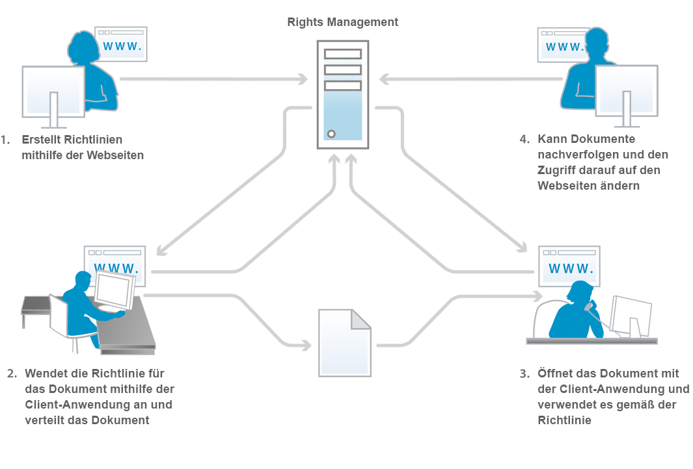
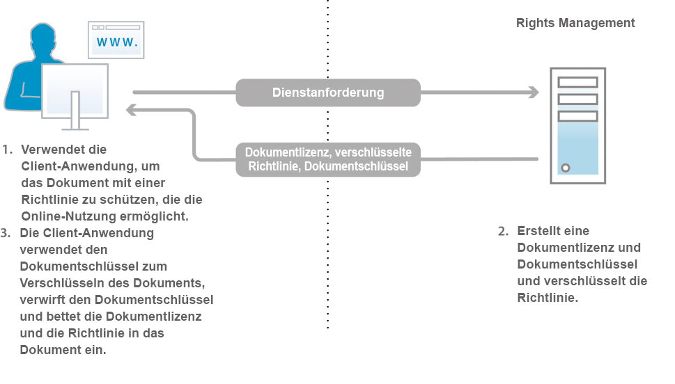
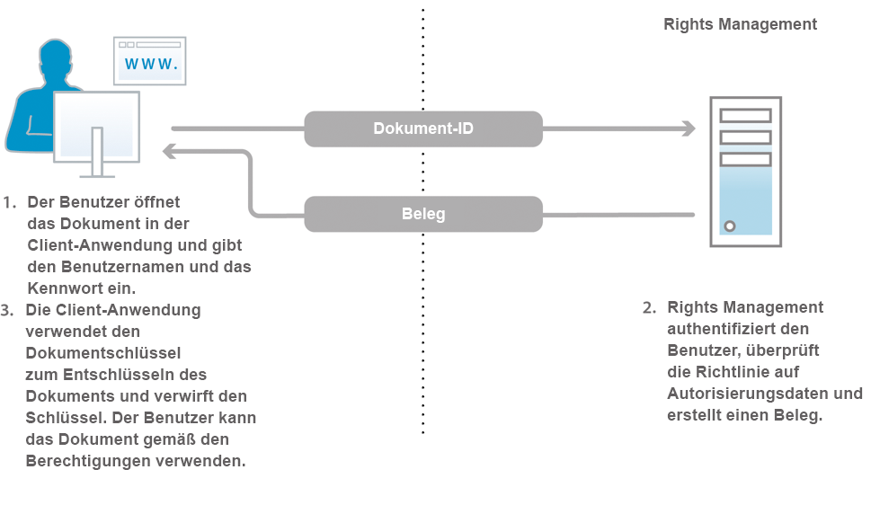

# Informationen zu Document Security {#about-document-security}

Document Security stellt sicher, dass Ihre Dokumente nur von autorisierten Benutzern genutzt werden können. Mithilfe von Document Security können Sie Informationen sicher verteilen, die Sie in einem unterstützten Format gespeichert haben. Unterstützte Dateiformate sind:

* Adobe PDF-Dateien
* Microsoft® Word-, Excel- und PowerPoint-Dateien

Weitere Informationen dazu, wie Richtlinien unterstützte Dateitypen schützen, finden Sie unter [Weitere Document Security-Informationen](https://www.adobe.com/go/learn_aemforms_doc_security_65).

Mit Document Security können Sie vordefinierte Vertraulichkeitseinstellungen mühelos erstellen, speichern und auf Dokumente anwenden. Um zu verhindern, dass Informationen über Ihren Einflussbereich hinaus verteilt werden, können Sie auch überwachen und steuern, wie Empfänger Ihre Dokumente nutzen, nachdem Sie sie verteilt haben.

Sie können Dokumente durch Richtlinien schützen. Eine *Richtlinie* ist eine Zusammenstellung von Informationen, die unter anderem Vertraulichkeitseinstellungen und eine Liste berechtigter Benutzer umfasst. Die Vertraulichkeitseinstellungen, die Sie in einer Richtlinie angeben, bestimmen, wie ein Empfänger ein Dokument nutzen darf, auf das Sie die Richtlinie anwenden. Sie können beispielsweise angeben, ob Empfänger Folgendes dürfen: Text drucken, kopieren oder bearbeiten, geschützten Dokumenten Signaturen und Kommentare hinzufügen.

Document Security-Benutzer definieren Richtlinien auf den Endbenutzer-Webseiten. Administratoren erstellen auf den Document Security-Webseiten Richtliniensätze mit gemeinsam genutzten Richtlinien, die allen autorisierten Benutzern zur Verfügung stehen.

Richtlinien werden zwar in Document Security gespeichert, Sie wenden sie jedoch über Ihre Clientanwendung auf Dokumente an. Eine detaillierte Beschreibung der Anwendung von Richtlinien auf PDF-Dokumente finden Sie in der *Acrobat-Hilfe*. Das Anwenden von Richtlinien mithilfe anderer Anwendungen wie Microsoft® Office wird in der *Acrobat Reader DC Extensions-Hilfe* für die Anwendung beschrieben.

Wenn Sie eine Richtlinie auf ein Dokument anwenden, werden die in der Datei enthaltenen Informationen durch die in der Richtlinie angegebenen Vertraulichkeitseinstellungen geschützt. Durch die Vertraulichkeitseinstellungen werden auch alle Dateien (Text, Audio oder Video) innerhalb eines PDF-Dokuments geschützt. Sie können das richtliniengeschützte Dokument an Empfänger verteilen, die durch die Richtlinie autorisiert sind.

**Zugriff auf Dokumente steuern und überwachen**

Durch das Schützen eines Dokuments mit einer Richtlinie behalten Sie die Kontrolle über das Dokument, auch nachdem es verteilt wurde. Sie können das Dokument überwachen, die Richtlinie ändern, Benutzer am weiteren Zugriff auf das Dokument hindern und die Richtlinie wechseln, die auf das Dokument angewendet wird.

Über Document Security können Sie richtliniengeschützte Dokumente überwachen und Ereignisse nachverfolgen, z. B. wenn ein autorisierter oder nicht autorisierter Benutzer versucht, das Dokument zu öffnen.

**Komponenten**

Document Security besteht aus einem Server und einer Benutzeroberfläche:

**Server:** Der Server ist die zentrale Komponente, über die Document Security Transaktionen wie z. B. die Authentifizierung von Benutzern, die Richtlinienverwaltung in Echtzeit und das Durchsetzen der Vertraulichkeit ausführt. Der Server dient auch als zentraler Speicherort für Richtlinien, Prüfaufzeichnungen und andere dazugehörige Informationen.

**Webseiten:** Die Oberfläche, auf der Sie Richtlinien erstellen, richtliniengeschützte Dokumente verwalten und Ereignisse im Zusammenhang mit richtliniengeschützten Dokumenten überwachen. Administratoren können auch globale Optionen konfigurieren, z. B. die Benutzerauthentifizierung, Prüfungen und Nachrichten an eingeladene Benutzer, sowie Konten eingeladener Benutzer verwalten.

Die Abbildung zeigt die folgenden Schritte:

1. Der Dokumenteigentümer erstellt Richtlinien mithilfe der Webseiten. Dokumenteigentümer können persönliche Richtlinien erstellen, auf die nur sie zugreifen dürfen. Administratoren und Richtliniensatzkoordinatoren können innerhalb von Richtliniensätzen freigegebene Richtlinien erstellen, auf die autorisierte Benutzer zugreifen dürfen.
1. Der Dokumenteigentümer wendet die Richtlinie an. Anschließend speichert und verteilt er das Dokument. Das Dokument kann per E-Mail, über einen Netzwerkordner oder auf einer Website verteilt werden.
1. Der Empfänger öffnet das Dokument in der entsprechenden Clientanwendung. Der Empfänger kann das Dokument gemäß der geltenden Richtlinie nutzen.
1. Der Dokumenteigentümer, Richtliniensatzkoordinator oder Administrator kann Dokumente nachverfolgen und den Zugriff darauf auf den Webseiten ändern.

## Informationen zu Document Security-Benutzern {#about-document-security-users}

Mit Document Security arbeiten verschiedene Benutzer, um unterschiedliche Aufgaben zu erledigen:

* Der Systemadministrator oder ein anderer IT-Mitarbeiter installiert und konfiguriert Document Security. Diese Person ist ggf. auch für das Konfigurieren globaler Einstellungen für den Server, die Webseiten sowie die Richtlinien und Dokumente zuständig.

   Zu diesen Einstellungen können beispielsweise eine Document Security-URL, Prüfungs- und Datenschutzbenachrichtigungen, Registrierungshinweise für eingeladene Benutzer und die standardmäßige Offline-Nutzungsdauer gehören.

* Document Security-Administratoren erstellen Richtlinien und Richtliniensätze, und sie verwalten bei Bedarf richtliniengeschützte Dokumente für Benutzer. Sie erstellen außerdem Konten für eingeladene Benutzer und überwachen System-, Dokument-, Benutzer-, Richtlinien-, Richtliniensatz- und benutzerdefinierte Ereignisse. Sie sind ggf. auch in Zusammenarbeit mit einem Systemadministrator für das Konfigurieren globaler Server-, Webseiten- und Richtlinieneinstellungen zuständig.

   Administratoren können Benutzern im User Management-Bereich von Administration Console die folgenden Rollen zuweisen. Benutzer, denen diese Rollen zugewiesen wurden, führen ihre Aufgaben im Benutzeroberflächenbereich von Document Security in Administration Console aus.

   **Document Security-Superadministrator**

   Benutzer mit dieser Rolle haben Zugriff auf alle Document Security-Einstellungen in Administration Console. Diese Berechtigungen sind mit der Rolle verknüpft:

   * Konfiguration verwalten
   * Richtlinien verwalten
   * Richtliniensätze verwalten
   * Dokumente verwalten
   * Herausgeber des Dokuments verwalten
   * Verwalten eingeladener und lokaler Benutzer
   * Ereignisse anzeigen
   * Delegieren
   * Externe Benutzer einladen

   **Document Security-Administrator**

   Benutzer mit dieser Rolle können den Document Security-Server mithilfe der Seite „Konfiguration“ im Document Security-Abschnitt von Administration Console konfigurieren. Diese Berechtigung ist mit der Rolle „Konfiguration verwalten“ verknüpft.

   >[!NOTE]
   >
   >Benutzer mit dieser Rolle müssen außerdem über die Rolle „Administration Console-Benutzer“ verfügen, um sich bei Administration Console anzumelden und Konfigurationseinstellungen zu bearbeiten.

   **Document Security-Richtliniensatz-Administrator**

   Benutzer mit dieser Rolle können den Abschnitt „Document Security“ in Administration Console verwenden, um die Richtlinien anderer Benutzer zu bearbeiten und Richtliniensätze zu erstellen, zu bearbeiten und zu löschen. Wenn ein Richtliniensatz-Administrator einen Richtliniensatz erstellt, kann diesem Richtliniensatz ein Richtliniensatz-Koordinator zugewiesen werden. Diese Berechtigungen sind mit der Rolle verknüpft:

   * Richtlinien verwalten
   * Richtliniensätze verwalten
   * Dokumente verwalten
   * Herausgeber des Dokuments verwalten
   * Ereignisse anzeigen
   * Delegieren

   >[!NOTE]
   >
   >Benutzer mit dieser Rolle müssen außerdem über die Rolle „Administration Console-Benutzer“ verfügen, um sich bei Administration Console anzumelden und Konfigurationseinstellungen zu bearbeiten.

   **Document Security verwaltet eingeladene und lokale Benutzer**

   Benutzer mit dieser Rolle können alle für eingeladene und lokale Benutzer erforderlichen Verwaltungsaufgaben auf den entsprechenden Document Security-Webseiten ausführen. Diese Berechtigungen sind mit der Rolle verknüpft:

   * Verwalten eingeladener und lokaler Benutzer
   * Externe Benutzer einladen
   * Auf Webseiten für Endbenutzer zugreifen

   >[!NOTE]
   >
   >Benutzer mit dieser Rolle müssen außerdem über die Rolle „Administration Console-Benutzer“ verfügen, um sich bei Administration Console anzumelden und Konfigurationseinstellungen zu bearbeiten.

   **Document security – Benutzer einladen**

   Benutzer mit dieser Rollen können Benutzer einladen. Diese Berechtigungen sind mit der Rolle verknüpft:

   * Externe Benutzer einladen
   * Auf Webseiten für Endbenutzer zugreifen

   **Document Security-Endbenutzer**

   Benutzer mit dieser Rolle können auf Document Security-Webseiten für Endbenutzer zugreifen. Diese Rolle kann auch Administratoren zugewiesen werden, damit diese auf den Endbenutzerseiten Richtlinien erstellen können. Diese Berechtigung ist mit der Rolle „Auf Webseiten für Endbenutzer zugreifen“ verknüpft:

* Benutzer innerhalb des Unternehmens, die über gültige Document Security-Konten verfügen, erstellen eigene Richtlinien, nutzen Richtlinien zum Schützen von Dokumenten, verfolgen und verwalten ihre richtliniengeschützten Dokumente und überwachen Ereignisse im Zusammenhang mit ihren Dokumenten.
* Richtliniensatzkoordinatoren verwalten Dokumente, zeigen Ereignisse an und verwalten andere Richtliniensatzkoordinatoren (basierend auf ihren Berechtigungen). Administratoren geben Benutzer als Richtliniensatzkoordinatoren für bestimmte Richtliniensätze an.
* Firmenexterne Benutzer (z. B. Geschäftspartner) können richtliniengeschützte Dokumente nutzen, wenn sie im Document Security-Ordner enthalten sind, der Administrator ein Konto für sie erstellt oder sie sich bei Document Security über einen automatisierten E-Mail-Einladungsprozess registrieren. Abhängig davon, wie der Administrator die Zugriffseinstellungen aktiviert, sind die eingeladenen Benutzer eventuell auch dazu berechtigt, Richtlinien auf Dokumente anzuwenden, eigene Richtlinien zu erstellen, zu ändern und zu löschen und andere externe Benutzer zur Nutzung ihrer richtliniengeschützten Dokumente einzuladen.
* Entwickler verwenden das AEM Forms SDK, um benutzerdefinierte Anwendungen in Document Security zu integrieren.

Document Security-Administratoren können unter Verwendung der folgenden Berechtigungen in User Management benutzerdefinierte Rollen erstellen:

* Document Security – Konfiguration verwalten
* Document Security – eingeladene und lokale Benutzer verwalten
* Document Security – Richtliniensätze verwalten
* Document Security – Richtliniensätze verwalten
* Document Security – Serverereignisse anzeigen
* Document Security – Richtlinieneigentümer ändern

## Informationen zu Richtlinien und richtliniengeschützten Dokumenten {#policies-and-policy-protected-documents}

Eine *Richtlinie* definiert einen Satz von Vertraulichkeitseinstellungen und Benutzern, die auf ein Dokument zugreifen dürfen, für das die Richtlinie gilt. Eine Richtlinie ermöglicht auch eine dynamische Änderung der für ein Dokument geltenden Berechtigungen. Sie berechtigt den Benutzer, der das Dokument absichert, zum Ändern der Vertraulichkeitseinstellungen, um den Zugriff auf das Dokument zu sperren, oder das Wechseln der Richtlinie.

Der Richtlinienschutz kann über Adobe Acrobat® Pro und Acrobat Standard für ein PDF-Dokument aktiviert werden. Der Richtlinienschutz kann auf andere Dateitypen wie Microsoft® Word-, Excel- und PowerPoint-Dateien angewendet werden, indem die Clientanwendung mit den entsprechenden installierten Acrobat Reader DC-Erweiterungen verwendet wird.

### Funktionsweise von Richtlinien {#how-policies-work}

Richtlinien enthalten Informationen zu den autorisierten Benutzern und den Vertraulichkeitseinstellungen, die auf Dokumente angewendet werden sollen. Bei den Benutzern kann es sich um unternehmensinterne Personen oder externe Personen mit einem Konto handeln. Wenn der Administrator die Benutzereinladungsfunktion aktiviert, können sogar neu eingeladene Benutzer zu Richtlinien hinzugefügt werden, wodurch ein E-Mail-basierter Einladungsprozess zur Registrierung eingeleitet wird.

Die Vertraulichkeitseinstellungen in einer Richtlinie bestimmen, wie die Empfänger das Dokument nutzen können. Sie können beispielsweise angeben, ob Empfänger Folgendes dürfen: Text drucken oder kopieren, Änderungen vornehmen oder geschützten Dokumenten Signaturen und Kommentare hinzufügen. Dieselbe Richtlinie kann auch für bestimmte Benutzer unterschiedliche Vertraulichkeitseinstellungen angeben.

>[!NOTE]
>
>Vertraulichkeitseinstellungen, die über eine Richtlinie angewendet werden, setzen Einstellungen außer Kraft, die eventuell in Acrobat über die Kennwort- oder Zertifikatsicherheitsoptionen auf ein PDF-Dokument angewendet wurden. (Weitere Informationen finden Sie in der Acrobat-Hilfe.)

Auf den Document Security-Webseiten können Benutzer und Administratoren Richtlinien erstellen. Für ein Dokument kann immer nur eine Richtlinie gleichzeitig gelten. Sie können eine Richtlinie mithilfe einer dieser Methoden anwenden:

* Öffnen Sie das Dokument in Acrobat oder einer anderen Clientanwendung und wählen Sie eine Richtlinie zum Schützen des Dokuments aus.
* Senden Sie ein Dokument als E-Mail-Anhang in Microsoft® Outlook. In diesem Fall können Sie eine Richtlinie in einer Liste mit Richtlinien oder eine automatisch generierte Richtlinie auswählen, die Acrobat mit einem Standardsatz von Vertraulichkeitseinstellungen erstellt, um das Dokument ausschließlich für die Empfänger der E-Mail-Nachricht zu schützen.

In der Clientanwendung kann eine Richtlinie aus einem Dokument entfernt werden.

Die Abbildung zeigt die folgenden Schritte:

1. Der Dokumenteigentümer sichert das Dokument in einer unterstützten Clientanwendung mit einer Richtlinie, die die Online-Nutzung erlaubt.
1. Document Security erstellt eine Dokumentlizenz und Dokumentschlüssel und verschlüsselt die Richtlinie. Die Dokumentlizenz, die verschlüsselte Richtlinie und der Dokumentschlüssel werden zurück an die Clientanwendung gesendet.
1. Das Dokument wird mit dem Dokumentschlüssel verschlüsselt, der anschließend gelöscht wird. Die Lizenz und die Richtlinie sind nun im Dokument eingebettet. Diese Schritte erfolgen in der unterstützten Clientanwendung.

Wenn Sie eine Richtlinie auf ein Dokument anwenden, werden die im Dokument enthaltenen Informationen, einschließlich beliebiger Dateien (Text, Audio oder Video) in PDF-Dokumenten, durch die Vertraulichkeitseinstellungen geschützt, die in der Richtlinie angegeben sind. Document Security generiert eine Lizenz sowie Verschlüsselungsinformationen, die anschließend im Dokument eingebettet werden. Wenn Sie das Dokument verteilen, kann Document Security die Empfänger authentifizieren, die versuchen, das Dokument zu öffnen, und den Zugriff gemäß den in der Richtlinie angegebenen Berechtigungen erlauben.

Wenn die Offline-Nutzung aktiviert ist, können Empfänger auch offline (ohne aktive Internet- oder Netzwerkverbindung) für die in der Richtlinie angegebene Dauer mit richtliniengeschützten Dokumenten arbeiten.

### Funktionsweise richtliniengeschützter Dokumente {#how-policy-protected-documents-work}

Um richtliniengeschützte Dokumente öffnen und verwenden zu können, muss die Richtlinie Ihren Namen als Empfänger enthalten. Außerdem müssen Sie ein gültiges Document Security-Konto haben. Für PDF-Dokumente benötigen Sie Acrobat oder Adobe Reader®. Für andere Dateitypen benötigen Sie die entsprechende Anwendung für die Datei, in der die Acrobat Reader DC-Erweiterungen installiert sind.

Wenn Sie versuchen, ein richtliniengeschütztes Dokument zu öffnen, stellt Acrobat, Adobe Reader oder die Acrobat Reader DC-Erweiterungen eine Verbindung zu Document Security her, um Sie zu authentifizieren. Anschließend können Sie sich anmelden. Wenn die Dokumentnutzung überwacht wird, erscheint eine Benachrichtigung. Nachdem Document Security die zu erteilenden Dokumentberechtigungen bestimmt hat, übernimmt das Programm die Entschlüsselung des Dokuments. Sie können das Dokument anschließend gemäß den Vertraulichkeitseinstellungen in der Richtlinie nutzen.

Die Abbildung zeigt die folgenden Schritte:

1. Der Dokumentbenutzer öffnet das Dokument in einer unterstützten Clientanwendung und authentifiziert sich beim Server. Die Dokument-ID wird zum Document Security-Server gesendet.
1. Document Security authentifiziert die Benutzer, überprüft die Richtlinie auf Autorisierungsdaten und erstellt einen Beleg. Der Beleg (mit dem Dokumentschlüssel und den Berechtigungen) wird zurück an die Clientanwendung gesendet.
1. Das Dokument wird mit dem Dokumentschlüssel entschlüsselt, der anschließend gelöscht wird. Das Dokument kann anschließend gemäß den Vertraulichkeitseinstellungen der Richtlinie genutzt werden. Diese Schritte erfolgen in der unterstützten Clientanwendung.

Sie können ein Dokument entsprechend den folgenden Angaben weiter verwenden:

* Unbegrenzt oder für die in der Richtlinie angegebene Gültigkeitsdauer
* Bis der Administrator oder die Person, welche die Richtlinie aktiviert hat, den Zugriff auf das Dokument aufhebt oder die Richtlinie ändert

Sie können richtliniengeschützte Dokumente auch offline verwenden (ohne aktive Internet- oder Netzwerkverbindung), wenn die Richtlinie den Offline-Zugriff zulässt. Sie müssen sich zuerst bei Document Security anmelden, um das Dokument zu synchronisieren. Sie können anschließend das Dokument für die in der Richtlinie angegebene Offline-Nutzungsdauer verwenden.

Nach Ende der Offline-Nutzungsdauer muss der Benutzer das Dokument wieder mit Document Security synchronisieren, indem er entweder online geht und ein richtliniengeschütztes Dokument öffnet oder einen Befehl in der Clientanwendung aufruft. (Weitere Informationen finden Sie unter *Acrobat-Hilfe* oder in der entsprechenden *Hilfe zu Acrobat Reader DC-Erweiterungen*.)

Wenn Sie eine Kopie eines richtliniengeschützten Dokuments mit dem Menübefehl „Speichern“ oder „Speichern unter“ speichern, wird die Richtlinie automatisch angewendet und für das neue Dokument erzwungen. Ereignisse, z. B. Versuche, das neue Dokument zu öffnen, werden für das ursprüngliche Dokument geprüft und aufgezeichnet.

## Richtliniensätze {#policy-sets}

*Richtliniensätze* dienen zum Gruppieren verschiedener Richtlinien mit einem gemeinsamen Zweck.  Diese Richtliniensätze werden meist einer Teilmenge der Benutzer im System zur Verfügung gestellt.

Jedem Richtliniensatz ist mindestens ein Richtliniensatzkoordinator zugeordnet. Der Richtliniensatzkoordinator ist ein Administrator oder Benutzer mit mehr Berechtigungen. Der *Richtliniensatzkoordinator* ist in der Regel ein Spezialist im Unternehmen, der die Richtlinien in einem bestimmten Richtliniensatz am besten verwalten kann.

Richtliniensatzkoordinatoren können diese Aufgaben ausführen:

* Neue Richtlinien erstellen
* Richtlinien in einem Richtliniensatz bearbeiten und löschen
* Richtliniensatzeinstellungen bearbeiten
* Richtliniensatzkoordinatoren hinzufügen und entfernen
* Richtlinien- und Dokumentereignisse für die Richtlinien oder Dokumente im Richtliniensatz anzeigen
* Den Zugriff auf Dokumente aufheben
* Richtlinien für das Dokument wechseln

>[!NOTE]
>
>Sie können mit der API `getAllPolicysetnames()` maximal 1.000 Richtliniensatznamen aus der Datenbank abrufen.

Richtliniensätze werden auf den Document Security-Administrationswebseiten von Administratoren und Richtliniensatzkoordinatoren erstellt und gelöscht, denen die entsprechenden Berechtigungen erteilt wurden.

Richtliniensätze werden meist einer begrenzten Anzahl von Benutzern zur Verfügung gestellt, indem die Benutzer oder Gruppen in einer Domäne angegeben werden, die Richtlinien im Richtliniensatz zum Schützen von Dokumenten verwenden dürfen.

Bei der Installation von Document Security wird standardmäßig ein so genannter *globaler Richtliniensatz* erstellt. Dieser Richtliniensatz wird von dem Administrator verwaltet, der die Software installiert hat.

## Best Practices {#best-practices}

Richtlinien sind wiederverwendbare Berechtigungssätze und Benutzergruppen, die auf verschiedene Dokumente angewendet werden können. Für die geschützten Dokumente. Diese Richtlinien stellen sicher, dass nur autorisierte Benutzer die zulässigen Funktionen verwenden können. Es wird erwartet, dass die Anzahl der Richtlinien und Richtliniensätze mit einem Anstieg der verschiedenen Benutzerrollen und Dokumente in einer Abteilung wächst. Im Folgenden finden Sie einige Überlegungen und Best Practices zum Erstellen und Verwalten von Richtlinien:

* **Erstellen wiederverwendbarer Richtlinien:** Adobe empfiehlt, Richtlinien in verschiedenen Dokumenten wiederzuverwenden. Dies trägt dazu bei, die Anzahl der Richtlinien auf ein Minimum zu beschränken, eine optimale Leistung zu erzielen und die Verwaltung der Richtlinien zu vereinfachen. So erstellen Sie eine wiederverwendbare Richtlinie:

1. Definition und Definition von Zugriffskontrollanforderungen auf Abteilungen- und Organisationsebene.

1. Erstellen Sie Benutzergruppen und fügen Sie diesen Gruppen Benutzer hinzu.

1. Erstellen Sie einen Richtliniensatz.

1. Öffnen Sie den Richtliniensatz und erstellen Sie eine Richtlinie. Fügen Sie Benutzergruppen hinzu und legen Sie Vertraulichkeitseinstellungen (Zugriffskontrolle) für die Richtlinie fest.

Fügen Sie Benutzergruppen zu Richtlinien anstelle einzelner Benutzer hinzu. Dies erleichtert die Verwaltung und Anwendung von Richtlinien für eine große Anzahl von Benutzern.

* **Erstellen benutzerdefinierter Richtliniensätze:** Ein Richtliniensatz kombiniert mehrere Richtlinien zu einer verwaltbaren Entität. Erstellen Sie benutzerdefinierte Richtliniensätze für Ihre Organisation oder Abteilung, verwenden Sie sie zur Gruppierung verwandter Richtlinien und stellen Sie sie einer Untergruppe von Benutzern im System zur Verfügung.

   Die Verwendung von Richtliniensätzen erleichtert die Zuweisung und Verwaltung von verwandten Richtlinien zu bestimmten Benutzern in einer Organisation oder Abteilung. So können beispielsweise separate Richtliniensätze für die Finanz- und Personalabteilung dazu beitragen, die damit verbundenen Politiken einfach zu verwalten und auf Dokumente anzuwenden, die für die entsprechenden Abteilungen benannt wurden.

* **Verwenden Sie einen externen Autorisierer, um Berechtigungen dynamisch anzuwenden:** Sie können  [externe ](https://help.adobe.com/en_US/livecycle/11.0/ProgramLC/WS624e3cba99b79e12e69a9941333732bac8-6f26.2.html) Autorisierer verwenden, um Berechtigungen anhand externer Bedingungen auszuwerten und dynamisch anzuwenden. Wenn die Berechtigungen dynamisch anhand externer Bedingungen ausgewertet werden, können Sie:

   * Stellen Sie eine zentralisierte Zugriffskontrolle für Dokumente in Ihrem Unternehmen bereit.

   * Steuern Sie den Zugriff auf richtliniengeschützte Dokumente, indem Sie dynamisch bestimmen, ob Benutzer auf ein richtliniengeschütztes Dokument zugreifen können. Zum Beispiel entscheidet dynamisch, ob ein Benutzer ein richtliniengeschütztes Dokument drucken kann.

   * Verwenden Sie zusätzlich zum standardmäßigen Prozess zur Richtlinienbewertung einen Zugriffskontrollmechanismus, den Ihr Content-Management-System verwendet. Wenn der Dienst beispielsweise bestimmt, ob ein Benutzer ein richtliniengeschütztes Dokument drucken kann, kann er den standardmäßigen Prozess zur Richtlinienbewertung und den Zugriffskontrollmechanismus verwenden, den Ihr Content Management System verwendet.
   Obwohl es möglich ist, den Prozess zur Bewertung von Document Security-Richtlinien vollständig durch einen externen Autorisierungs-Handler zu ersetzen, wird empfohlen, einen externen Autorisierungs-Handler in Verbindung mit dem Prozess zur Richtlinienbewertung zu verwenden. Daher kann der Dokumentzugriff über denselben Kontrollmechanismus gesteuert werden, den Ihr Content Management-System verwendet. Wenn beispielsweise der Document Security-Dienst bestimmt, ob ein Benutzer ein richtliniengeschütztes Dokument drucken kann, verwendet er den standardmäßigen Prozess zur Richtlinienbewertung und den Zugriffskontrollmechanismus, den Ihr Content Management-System verwendet. Weitere Informationen finden Sie unter [Erstellen externer Autorisierungshandler](https://help.adobe.com/en_US/livecycle/11.0/ProgramLC/WS624e3cba99b79e12e69a9941333732bac8-6f26.2.html).

* **Lassen Sie die Richtliniensätze auf eine begrenzte Anzahl begrenzt:** Verschiedene Faktoren führen zu einem ständigen Wachstum der Politik und der politischen Strategien. Einige häufig auftretende Faktoren sind:

   * Erhöhung der Benutzerrollen, Abteilungen und Dokumente innerhalb eines Unternehmens über einen bestimmten Zeitraum.
   * Die Abteilungen einer Organisation arbeiten isoliert und kontrollieren die abteilungsspezifischen Politiken. Dies führt zu identischen Richtlinien innerhalb einer Organisation.

   Adobe empfiehlt, die Anzahl der Richtlinien und Richtliniensätze auf ein Minimum zu beschränken. Dies erleichtert die einfache Verwaltung von Richtlinien und Richtliniensätzen und sorgt für eine bessere Leistung. So halten Sie die Anzahl auf ein Minimum beschränkt:

   * Erstellen wiederverwendbarer Richtlinien. Diese können für mehrere Abteilungen freigegeben werden.
   * Erwägen Sie die Erstellung von unternehmensweiten Richtliniensätzen, wenn einige Richtlinien für mehrere Abteilungen gelten und nicht für jeden Bereich einen individuellen Richtliniensatz.
   * Gruppenbezogene Richtlinien in einem Richtliniensatz. Erstellen Sie nicht für jede Richtlinie einen separaten Richtliniensatz.
   * Verwenden Sie einen externen Autorisierer, um Benutzerberechtigungen dynamisch zu steuern.

   >[!NOTE]
   >
   > Sie können die API [getAllPolicySetNames()](https://helpx.adobe.com/experience-manager/6-5/forms/programlc/javadoc/com/adobe/livecycle/rightsmanagement/client/PolicyManager.html) verwenden, um maximal 1000 Richtliniensatznamen abzurufen. Intern ruft die API maximal 1.000 Richtlinien ab, für die der API-Aufrufer über die Berechtigung des Dokumentherausgebers verfügt, und erstellt dann eine Liste eindeutiger Richtliniensatznamen, die mit abgerufenen Richtlinien verknüpft sind, und gibt diese an Sie zurück. Wenn die API beispielsweise 1000 Richtlinien abruft und die abgerufenen Richtlinien insgesamt 200 Richtliniensätzen zugeordnet sind, gibt die API nur 200 Richtliniensatznamen zurück.
