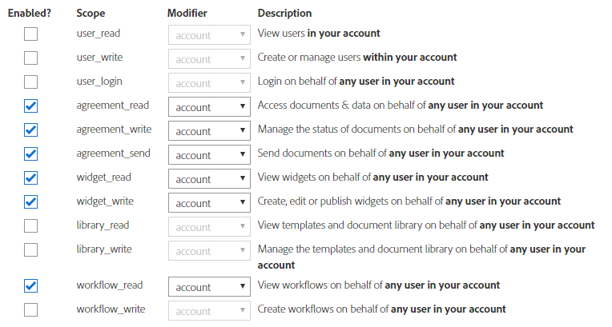

# [!DNL Adobe Sign] mit AEM [!DNL Forms]{#integrate-adobe-sign-with-aem-forms} integrieren

[!DNL Adobe Sign] aktiviert Workflows für adaptive Formulare. E-Signaturen verbessern die Workflows bei der Verarbeitung von Dokumenten in den Bereichen Recht, Vertrieb, Gehaltsabrechnung, Personalverwaltung u. a.

In einem typischen Szenario mit [!DNL Adobe Sign] und adaptiven Formularen füllt ein Benutzer ein adaptives Formular mit **für einen Dienst**. Dies könnte beispielsweise ein Antrag für eine Kreditkarte oder ein Formular für Dienstleistungen für Bürger. Wenn ein Benutzer das Antragsformular ausfüllt und signiert, wird dieses zur Bearbeitung an den Dienstanbieter gesendet. Dienstleister prüft die Anwendung und verwendet [!DNL Adobe Sign], um die genehmigte Anwendung zu markieren. Um ähnliche Workflows zu aktivieren, können Sie [!DNL Adobe Sign] mit AEM [!DNL Forms] integrieren.

Um [!DNL Adobe Sign] mit AEM [!DNL Forms] zu verwenden, konfigurieren Sie [!DNL Adobe Sign] in AEM Cloud-Diensten:

## Voraussetzungen {#prerequisites}

Sie benötigen Folgendes, um [!DNL Adobe Sign] mit AEM [!DNL Forms] zu integrieren:

* Ein gültiges[ Adobe Sign-Entwicklerkonto.](https://acrobat.adobe.com/de/de/why-adobe/developer-form.html) 
* Ein [SSL-aktivierter ](/help/sites-administering/ssl-by-default.md) AEM [!DNL Forms]-Server.
* Eine[ Adobe Sign API-Anwendung](https://www.adobe.io/apis/documentcloud/sign/docs.html#!adobedocs/adobe-sign/master/gstarted/create_app.md).
* Anmeldeinformationen (Client-ID und geheimer Clientschlüssel) der [!DNL Adobe Sign]-API-Anwendung.
* Entfernen Sie bei der Neukonfiguration die vorhandene [!DNL Adobe Sign]-Konfiguration aus der Autor- und der Veröffentlichungsinstanz.
* Verwenden Sie [identische crypto-Taste](/help/sites-administering/security-checklist.md#make-sure-you-properly-replicate-encryption-keys-when-needed) für Autoren- und Veröffentlichungsinstanzen.

## [!DNL Adobe Sign] mit AEM [!DNL Forms] {#configure-adobe-sign-with-aem-forms} konfigurieren

Nachdem die Voraussetzungen erfüllt sind, führen Sie die folgenden Schritte aus, um [!DNL Adobe Sign] mit AEM [!DNL Forms] für die Autoreninstanz zu konfigurieren:

1. Navigieren Sie AEM [!DNL Forms] Autoreninstanz zu **Tools**  > **[!UICONTROL Allgemein]** > **[!UICONTROL Konfigurationsbrowser]**.
1. Tippen Sie auf der Seite **[!UICONTROL Configuration Browser]** auf **[!UICONTROL Create]**.
   * Weitere Informationen finden Sie in der Dokumentation zum [Konfigurationsbrowser](/help/sites-administering/configurations.md).
1. Geben Sie im Dialogfeld **[!UICONTROL Konfiguration erstellen]** einen **[!UICONTROL Titel]** für die Konfiguration ein, aktivieren Sie **[!UICONTROL Cloud-Konfigurationen]** und tippen Sie auf **[!UICONTROL Erstellen]**. Es wird ein Konfigurationscontainer für Cloud-Dienste erstellt.
1. Navigieren Sie zu **Tools**  > **[!UICONTROL Cloud Services]** > **[!UICONTROL Adobe Sign]** und wählen Sie den Konfigurationsvorgang, den Sie im obigen Schritt erstellt haben.

   >[!NOTE]
   >
   >Sie können entweder die Schritte 1 bis 4 ausführen, um einen neuen Konfigurationsordner zu erstellen und eine [!DNL Adobe Sign]-Konfiguration im Container zu erstellen, oder den vorhandenen `global`-Container unter **Tools**  > **[!UICONTROL Cloud Services]** > **[!UICONTROL Adobe Sign]** verwenden. Wenn Sie die Konfiguration im neuen Configuration Container erstellen, geben Sie beim Erstellen eines adaptiven Formulars den Container im Feld **[!UICONTROL Configuration Container]** an.

   >[!NOTE]
   Vergewissern Sie sich, dass die URL der Cloud-Dienste-Konfigurationsseite mit **HTTPS** beginnt. Ist dies nicht der Fall, aktivieren Sie SSL](/help/sites-administering/ssl-by-default.md) für AEM [!DNL Forms]-Server.[

1. Tippen Sie auf der Konfigurationsseite auf **[!UICONTROL Create]**, um [!DNL Adobe Sign]-Konfiguration in AEM [!DNL Forms] zu erstellen.
1. Geben Sie auf der Registerkarte **[!UICONTROL Allgemein]** der Seite **[!UICONTROL Adobe Sign-Konfiguration erstellen]** einen **[!UICONTROL Namen]** für die Konfiguration ein und tippen Sie auf **[!UICONTROL Weiter]**. Sie können optional einen Titel angeben und durchsuchen, um ein Miniaturbild für die Konfiguration auszuwählen.

1. Kopieren Sie die URL im aktuellen Browserfenster auf ein Notizblock. Es ist erforderlich, die [!DNL Adobe Sign]-Anwendung mit AEM[!DNL Forms] zu konfigurieren.

1. OAuth-Einstellungen für die Anwendung [!DNL Adobe Sign] konfigurieren:

   1. Öffnen Sie ein Browserfenster und melden Sie sich beim [!DNL Adobe Sign]-Entwicklerkonto an.
   1. Wählen Sie die Anwendung aus, die für AEM [!DNL Forms] konfiguriert wurde, und tippen Sie auf **[!UICONTROL OAuth für Anwendung konfigurieren]**.
   1. Kopieren Sie die **[!UICONTROL Client-ID]** und **[!UICONTROL Client-Geheimnis]** in ein Notebook.
   1. Fügen Sie im Feld **[!UICONTROL Umleitungs-URL]** die im vorherigen Schritt kopierte HTTPS-URL hinzu.
   1. Aktivieren Sie die folgenden OAuth-Einstellungen für die Anwendung [!DNL Adobe Sign] und klicken Sie auf **[!UICONTROL Speichern]**.
   * aggrement_read
   * aggrement_write
   * aggrement_send
   * widget_write
   * workflow_read

   Schrittweise Informationen zum Konfigurieren der OAuth-Einstellungen für eine [!DNL Adobe Sign]-Anwendung und zum Abrufen der Schlüssel finden Sie in der Entwicklerdokumentation unter [Auth-Einstellungen konfigurieren.](https://www.adobe.io/apis/documentcloud/sign/docs.html#!adobedocs/adobe-sign/master/gstarted/configure_oauth.md)

   

1. Kehren Sie zur Seite **[!UICONTROL Adobe Sign-Konfiguration erstellen]** zurück. Auf der Registerkarte **[!UICONTROL Einstellungen]** wird im Feld **[!UICONTROL OAuth URL]** die folgende Standard-URL angegeben:

   https://secure.na1.echosign.com/public/oauth

   hierbei gilt:

   **na1** bezieht sich auf die Standarddatenbank-Shard.

   Sie können den Wert für die Datenbank-Shard ändern. Starten Sie den Server neu, um den neuen Wert für die Datenbank-Shard verwenden zu können.

   >[!NOTE]
   Vergewissern Sie sich, dass die Konfigurationen der Autoren- und Veröffentlichungsinstanzen auf dieselbe Freigabe verweisen. Wenn Sie mehrere Adobe Sign-Konfigurationen für ein Unternehmen erstellen, stellen Sie sicher, dass alle Konfigurationen dieselbe Freigabe verwenden.

1. Geben Sie die in Schritt 8 kopierte **Client-ID** (auch als Anwendungs-ID bezeichnet) und **Clientgeheimnis** an. Wählen Sie die Option **[!UICONTROL auch für Anhänge aktivieren]**, um Dateien, die an einem adaptiven Formular angehängt sind, an ein entsprechendes Adobe Sign-Dokument, das zum Signiren geschickt wurde, anzuhängen.[!DNL Adobe Sign]

   Tippen Sie auf **[!UICONTROL Verbindung zu Adobe Sign]** herstellen. Wenn Sie zur Eingabe der Anmeldeinformationen aufgefordert werden, geben Sie Benutzername und Kennwort des Kontos ein, das beim Erstellen der [!DNL Adobe Sign]-Anwendung verwendet wird.

   Tippen Sie auf **[!UICONTROL Create]**, um die [!DNL Adobe Sign]-Konfiguration zu erstellen.

1. Öffnen Sie die AEM Web-Konsole. Die URL lautet `https://'[server]:[port]'/system/console/configMgr`
1. Öffnen Sie **[!UICONTROL Forms Common Configuration Service].**.
1. Wählen Sie im Feld **[!UICONTROL Zulassen]** **Alle Benutzer - Alle Benutzer, anonym oder angemeldet, können Anlagen Vorschauen durchführen, Formulare überprüfen und signieren und auf**[!UICONTROL  Speichern] klicken.**** Die Autoreninstanz ist für die Verwendung konfiguriert  [!DNL Adobe Sign].
1. Veröffentlichen Sie die Konfiguration.
1. Verwenden Sie [Replikation](https://docs.adobe.com/content/help/en/experience-manager-65/deploying/configuring/replication.html), um eine identische Konfiguration für die entsprechenden Veröffentlichungsinstanzen zu erstellen.

[!DNL Adobe Sign] ist jetzt in AEM [!DNL Forms] integriert und kann in adaptiven Formularen verwendet werden. Um [Adobe Sign service in einem adaptiven Formular zu nutzen](../../forms/using/working-with-adobe-sign.md#configure-adobe-sign-for-an-adaptive-form), geben Sie den Konfigurationscontainer an, der oben in den Einstellungen für adaptive Formulare erstellt wurde.

## [!DNL Adobe Sign]-Planung zum Synchronisieren des Signaturstatus {#configure-adobe-sign-scheduler-to-sync-the-signing-status} konfigurieren

Ein [!DNL Adobe Sign]-aktiviertes adaptives Formular wird erst gesendet, nachdem alle Unterzeichner den Unterzeichnungsvorgang abgeschlossen haben. Standardmäßig ist geplant, dass die [!DNL Adobe Sign]-Planung-Dienste die Signiererantwort alle 24 Stunden überprüfen (abfragen). Sie können das Standardintervall für Ihre Umgebung ändern. Führen Sie die folgenden Schritte aus, um das Standardintervall zu ändern:

1. Melden Sie sich bei AEM [!DNL Forms]-Server mit Administratorberechtigungen an und navigieren Sie zu **Tools** > **[!UICONTROL Vorgänge]** > **[!UICONTROL Webkonsole]**.

   Sie können auch die folgende URL in einem Browserfenster öffnen:
   `https://[localhost]:'port'/system/console/configMgr`

1. Suchen und öffnen Sie die Option **[!UICONTROL Adobe Sign-Konfigurationsdienst]**. Geben Sie einen[ Cron-Ausdruck](https://en.wikipedia.org/wiki/Cron#CRON_expression) in das Feld **[!UICONTROL Status-Aktualisierungs-Scheduler-Ausdruck]** und klicken Sie auf **[!UICONTROL Speichern]**. Um beispielsweise den Konfigurationsdienst täglich um 00:00 Uhr auszuführen, geben Sie `0 0 0 1/1 * ? *` im Ausdruck **[!UICONTROL Statusupdate-Planung]** an.

Das Standardintervall für die Synchronisierung des Status von [!DNL Adobe Sign] wird jetzt geändert.

## Verwandte Artikel {#related-articles}

* [Verwenden von Adobe Sign in einem adaptiven Formular](../../forms/using/working-with-adobe-sign.md)
* [Verwenden von Adobe Sign mit AEM Forms (Video)](https://helpx.adobe.com/experience-manager/kt/forms/using/adobe-sign-integration-feature-video.html)

