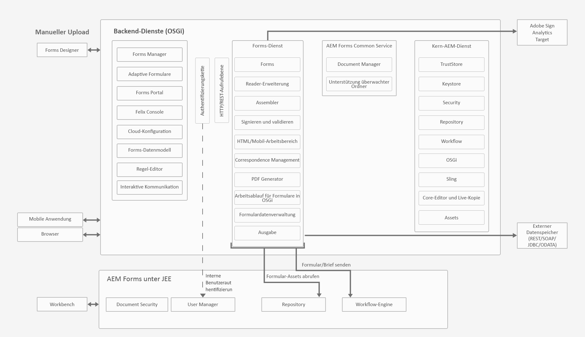
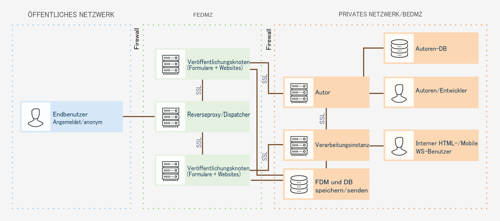
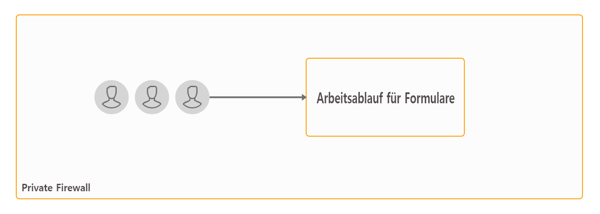
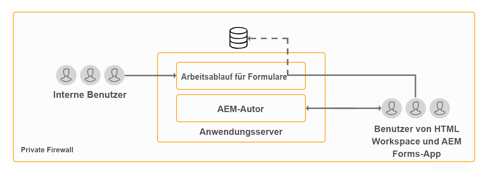
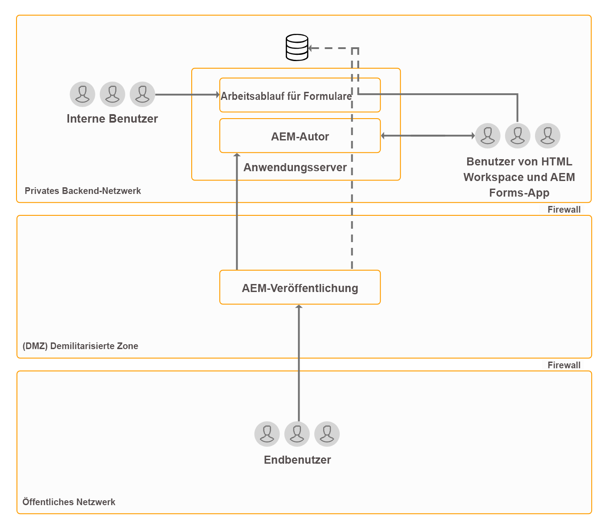
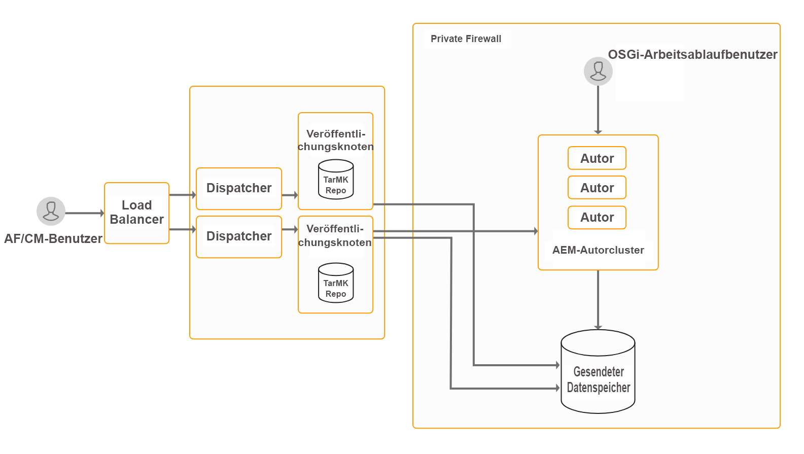
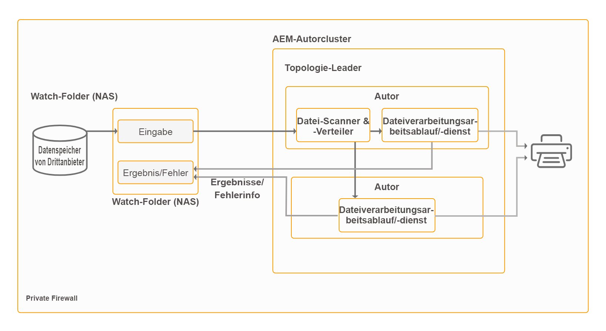
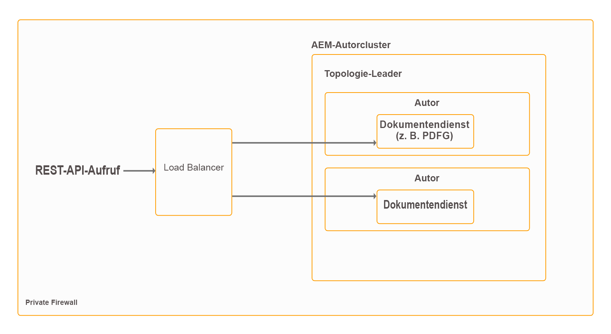

# Architektur und Bereitstellungstopologien für AEM Forms {#architecture-and-deployment-topologies-for-aem-forms}

## Architektur {#architecture}

AEM Forms ist eine Anwendung, die in AEM als AEM bereitgestellt wird. Das Paket wird als AEM Forms Add-On-Paket bezeichnet. Das AEM Forms Add-On-Paket enthält sowohl Dienste (API-Anbieter), die im AEM OSGi-Container bereitgestellt werden, als auch Servlets oder JSPs (mit Frontend- und REST-API-Funktionen), die vom AEM Sling-Framework verwaltet werden. Das folgende Diagramm zeigt diese Einrichtung:

Die Architektur für AEM Forms beinhaltet die folgenden Komponenten:

* **Kern-AEM-Dienste:** Grundlegende Dienste, die von AEM für eine bereitgestellte Anwendung verfügbar gemacht werden. Zu diesen Diensten gehören ein JCR-kompatibles Inhalts-Repository, ein OSGi-Dienstcontainer, eine Workflow-Engine, ein Trust Store, ein Key Store usw. Diese Dienste sind für die AEM Forms-Anwendung verfügbar, werden aber nicht von AEM Forms-Paketen bereitgestellt. Diese Dienste sind ein integraler Bestandteil des gesamten AEM-Stapels, und verschiedene AEM Forms-Komponenten verwenden diese Dienste.
* **Forms-Dienste:**  Bieten formularbezogene Funktionen wie das Erstellen, Zusammenführen, Verteilen und Archivieren von PDF-Dokumenten, das Hinzufügen digitaler Signaturen zum Beschränken des Zugriffs auf Dokumente und das Dekodieren von Barcoded Forms. Diese Dienste sind öffentlich für den Gebrauch durch benutzerdefinierten Code verfügbar, der in AEM gemeinsam bereitgestellt wird.
* **Weblayer:** JSPs oder Servlets, die auf allgemeine Dienste oder Formulardienste aufgesetzt wurden und folgende Funktionalität bieten:

   * **Authoring-Frontend**: Eine Benutzeroberfläche zum Erstellen und Verwalten von Formularen.
   * **Formularwiedergabe und -übermittlungs-Frontend**: Eine Benutzeroberfläche für Endbenutzer von AEM Forms (z. B. Bürger, die auf eine Behördenseite zugreifen). Dadurch werden Formularwiedergabe (Formular in einem Webbrowser anzeigen) und Sendefunktionen bereitgestellt.
   * **REST APIs**: JSPs und Servlets exportieren einen Teil der Formulardienste zur Nutzung durch HTTP-basierte Clients wie das SDK für mobile Formulare.

**AEM Forms on OSGi:** Eine AEM Forms in einer OSGi-Umgebung ist die standardmäßige AEM-Autorenumgebung oder AEM-Veröffentlichung mit AEM Forms-Paket, das darauf bereitgestellt wird. Sie können AEM Forms unter OSGi in einer [Einzelserverumgebung, Farm- und Cluster-Setups](/help/sites-deploying/recommended-deploys.md) ausführen. Die Clustereinrichtung ist nur für AEM-Autoreninstanzen verfügbar.

**AEM Forms on JEE:** AEM Forms on JEE ist der AEM Forms-Server, der auf dem JEE-Stapel ausgeführt wird. Es verfügt über AEM Author mit AEM Forms-Add-On-Paketen und zusätzliche AEM Forms JEE-Funktionen, die gemeinsam auf einem einzigen JEE-Stapel bereitgestellt werden, der auf einem Anwendungsserver ausgeführt wird. Sie können AEM Forms on JEE in Einzelserver- und Cluster-Setups ausführen. AEM Forms on JEE ist nur erforderlich, um Document Security, Process Management und LiveCycle-Kunden, die auf AEM Forms aktualisieren, auszuführen. Im Folgenden finden Sie einige zusätzliche Szenarien für die Verwendung von AEM Forms on JEE:

* **HTML Workspace-Unterstützung (für Kunden, die HTML Workspace verwenden):** AEM Forms on JEE ermöglicht die einmalige Anmeldung mit Verarbeitungsinstanzen, stellt bestimmte Assets bereit, die auf Verarbeitungsinstanzen wiedergegeben werden, und verarbeitet die Übermittlung von Formularen, die im HTML Workspace wiedergegeben werden.
* **Erweiterte zusätzliche Verarbeitung von Formular-/interaktiven Kommunikationsdaten**: AEM Forms on JEE kann in komplexen Anwendungsfällen, in denen erweiterte Prozessverwaltungsfunktionen erforderlich sind, zur zusätzlichen Verarbeitung von Formular-/interaktiven Kommunikationsdaten (und zum Speichern der Ergebnisse in einem geeigneten Datenspeicher) verwendet werden.

AEM Forms on JEE umfasst auch die folgenden unterstützenden Dienste für die AEM Komponenten:

* **Integrierte Benutzerverwaltung:** Ermöglicht die Erkennung von Benutzern von AEM Forms on JEE als AEM Formulare unter OSGi-Benutzern und die Aktivierung der einmaligen Anmeldung für OSGi- und JEE-Benutzer. Dies ist für Fälle erforderlich, in denen eine einmalige Anmeldung für AEM Formulare in OSGi und AEM Forms on JEE erforderlich ist (z. B. HTML Workspace).
* **Asset-Hosting:** AEM Forms on JEE kann Assets (z. B. HTML5-Formulare) bereitstellen, die auf AEM Forms unter OSGi wiedergegeben werden.

Die AEM Forms-Authoring-Benutzeroberfläche unterstützt nicht das Erstellen von Datensatzdokumenten (DOR), PDF forms und HTML5-Forms. Solche Assets werden mit der eigenständigen Forms Designer-Anwendung erstellt und einzeln in AEM Forms Manager hochgeladen. Alternativ können Formulare für AEM Forms on JEE als Anwendungs-Assets (in AEM Forms Workbench) entworfen und auf dem AEM Forms on JEE-Server bereitgestellt werden.

AEM Forms on OSGi und AEM Forms on JEE verfügen beide über Workflow-Funktionen. Sie können grundlegende Workflows für verschiedene Aufgaben in den AEM Forms auf OSGi schnell erstellen und bereitstellen, ohne die vollständige Prozessverwaltungsfunktion von AEM Forms on JEE installieren zu müssen. Die [Funktionen des formularzentrierten Workflows in AEM Forms unter OSGi und die Prozessverwaltungsfunktion von AEM Forms on JEE](capabilities-osgi-jee-workflows.md) unterscheiden sich. Die Entwicklung und Verwaltung formularzentrierter Workflows in AEM Forms on OSGi verwendet die bekannten Funktionen AEM Workflows und AEM Posteingang.

## Begriffe {#terminologies}

Das folgende Bild zeigt verschiedene AEM Forms-Serverkonfigurationen und ihre Komponenten, die in einer typischen AEM Forms-Bereitstellung verwendet werden: 

**Autor:** Eine Autoreninstanz ist ein AEM Forms-Server, der im Standardmodus „Autor“ ausgeführt wird. Dies kann AEM Forms on JEE oder AEM Forms on OSGi-Umgebung sein. Dies ist für interne Benutzer, Designer von Formularen und interaktiver Kommunikation und Entwickler vorgesehen. Ermöglicht werden folgende Funktionen:

* **Erstellen und Verwalten von Formularen und interaktiver Kommunikation:** Designer und Entwickler können adaptive Formulare und interaktive Kommunikation erstellen und bearbeiten, extern erstellte Formulare anderer Art, z. B. in Adobe Forms Designer erstellte Formulare, hochladen und diese Elemente mithilfe der Forms Manager-Konsole verwalten.
* **Veröffentlichen von Formularen und interaktiver Kommunikation:** In einer Autoreninstanz gehostete Assets können in einer Veröffentlichungsinstanz veröffentlicht werden, um Laufzeitvorgänge durchzuführen. Asset-Veröffentlichung verwendet die Replikationsfunktionen von AEM. Adobe empfiehlt, auf jeder Autoreninstanz einen Replikationsagenten für die manuelle Übertragung von veröffentlichten Formularen an die Verarbeitungsinstanzen und auf jeder Verarbeitungsinstanz einen Replikationsagenten mit aktiviertem Auslöser *Bei Empfang* zu konfigurieren, damit die empfangenen Formulare automatisch zur Veröffentlichung repliziert werden.

**Veröffentlichen:** Eine Veröffentlichungsinstanz ist ein AEM Forms-Server, der im standardmäßigen Veröffentlichungsmodus ausgeführt wird. Veröffentlichungsinstanzen sind für Endbenutzer von formularbasierten Anwendungen vorgesehen, z. B. Benutzer, die auf eine öffentliche Website zugreifen und Formulare senden. Ermöglicht werden folgende Funktionen:

* Rendern und Senden von Formularen für Endbenutzer.
* Transport unbearbeiteter gesendeter Formulardaten zur weiteren Verarbeitung an Verarbeitungsinstanzen und zum Speichern im endgültigen Aufzeichnungssystem. Die Standardimplementierung in AEM Forms erreicht dies mit den von AEM bereitgestellten Funktionen zur Rückwärtsreplikation. Eine alternative Implementierung ist auch das direkte Weiterleiten der Formulardaten an Verarbeitungsserver, anstatt sie zuerst lokal zu speichern (letzteres ist eine Voraussetzung für die Aktivierung der Rückwärtsreplikation ). Kunden, die Bedenken bei der Speicherung potenziell vertraulicher Daten auf Veröffentlichungsinstanzen haben, können diese [alternative Implementierung](/help/forms/using/configuring-draft-submission-storage.md) verwenden, da sich Verarbeitungsinstanzen normalerweise in einer sichereren Zone befinden.
* Rendern und Senden interaktiver Kommunikation und Briefe: Interaktive Kommunikation und Brief werden auf Veröffentlichungsinstanzen gerendert und die entsprechenden Daten werden zur Speicherung und Nachbearbeitung an Verarbeitungsinstanzen übermittelt. Die Daten können entweder lokal in einer Veröffentlichungsinstanz gespeichert und später an eine Verarbeitungsinstanz rückrepliziert (Standardoption) oder ohne Speicherung auf der Veröffentlichungsinstanz direkt an die Verarbeitungsinstanz gesendet wrden. Die letztere Implementierung ist für sicherheitsbewusste Kunden nützlich.

**Verarbeitung:** Eine Instanz von AEM Forms, die im Ausführungsmodus &quot;Autor&quot;ausgeführt wird und der Formularmanagergruppe keine Benutzer zugewiesen sind. Sie können AEM Forms on JEE oder AEM Forms unter OSGi als Verarbeitungsinstanz bereitstellen. Die Benutzer werden nicht zugewiesen, um sicherzustellen, dass die Authoring- und Verwaltungsaktivitäten für Formulare nicht auf der Verarbeitungsinstanz und nur auf der Autoreninstanz ausgeführt werden. Eine Verarbeitungsinstanz ermöglicht die folgenden Funktionen:

* **Verarbeitung von Formularrohdaten aus einer Veröffentlichungsinstanz:**  Dies wird hauptsächlich auf einer Verarbeitungsinstanz über AEM Workflows erreicht, die beim Eintreffen der Daten an den Trigger gesendet werden. Die Workflows können den standardmäßig bereitgestellten Schritt Formulardatenmodell verwenden, um die Daten oder Dokumente in einem geeigneten Datenspeicher zu archivieren.
* **Sicheres Speichern der Formulardaten**: Die Verarbeitung bietet ein hinter der Firewall befindliches Repository für Formularrohdaten, auf das die Benutzer keinen Zugriff haben. Weder Formularentwickler in der Autoreninstanz noch Endbenutzer in der Veröffentlichungsinstanz können auf dieses Repository zugreifen.

   >[!NOTE]
   >
   > Adobe empfiehlt die Verwendung eines Datenspeichers von Drittanbietern zum Speichern abgeschlossener verarbeiteter Daten, anstatt AEM Repository zu verwenden.

* **Speicherung und Nachbearbeitung von Korrespondenzdaten aus einer Veröffentlichungsinstanz:** AEM Workflows führen die optionale Nachbearbeitung der entsprechenden Briefdefinitionen durch. Diese Workflows können die endgültigen verarbeiteten Daten in geeigneten externen Datenspeichern speichern. 

* **HTML Workspace-Hosting**: Eine Verarbeitungsinstanz hostet das Frontend für HTML Workspace. HTML Workspace bietet die Benutzeroberfläche für die zugehörige Aufgaben-/Gruppenzuweisung für Review- und Genehmigungsprozesse.

Eine Verarbeitungsinstanz ist so konfiguriert, dass sie im Ausführungsmodus &quot;Autor&quot;ausgeführt wird, weil:

* Dies ermöglicht die Rückwärtsreplikation von Formularrohdaten aus der Veröffentlichungsinstanz. Der standardmäßige Datenspeicher-Handler erfordert die Funktion zur Rückwärtsreplikation.
* AEM Workflows, die die Hauptmethode zur Verarbeitung von Formularrohdaten aus einer Veröffentlichungsinstanz sind, werden empfohlen, auf einem Authoring-System ausgeführt zu werden.

## Physiche Beispieltopologien für AEM Forms on JEE {#sample-physical-topologies-for-aem-forms-on-jee}

Die unten empfohlenen AEM Forms on JEE-Topologien richten sich vor allem an Kunden, die ein Upgrade von LiveCycle oder einer früheren Version von AEM Forms on JEE durchführen. Adobe empfiehlt die Verwendung von AEM Forms unter OSGi für Neuinstallationen. Eine Neuinstallation von AEM Forms on JEE wird nur für die Verwendung von Document Security- und Process Management-Funktionen empfohlen.

### Topologie für die Verwendung von Document Services oder Document Security-Funktionen {#topology-for-using-document-services-or-document-security-capabilities}

AEM Forms-Kunden, die nur Dokumentdienste oder Document Security-Funktionen verwenden möchten, können eine ähnliche Topologie nutzen wie die unten abgebildete. Diese Topologie empfiehlt die Verwendung einer einzigen Instanz von AEM Forms. Sie können bei Bedarf auch einen Cluster oder eine Farm von AEM Forms-Servern erstellen. Diese Topologie wird empfohlen, wenn die meisten Benutzer programmatisch auf die Funktionen des AEM Forms-Servers zugreifen und die Eingriffe über die Benutzeroberfläche minimal sind. Die Topologie ist bei der Stapelverarbeitung von Document Services hilfreich. Verwenden Sie beispielsweise den Ausgabedienst, um täglich Hunderte von nicht bearbeitbaren PDF-Dokumenten zu erstellen.

AEM Forms ermöglicht es Ihnen zwar, alle Funktionen von einem einzigen Server aus einzurichten und auszuführen, Sie sollten jedoch Kapazitätsplanung und Lastenausgleich durchführen und dedizierte Server für bestimmte Funktionen in einer Produktionsumgebung einrichten. Richten Sie beispielsweise für eine Umgebung, in der der PDF Generator-Dienst zum Konvertieren Tausender von Seiten pro Tag und zum Hinzufügen digitaler Signaturen zum Beschränken des Zugriffs auf Dokumente verwendet wird, separate AEM Forms-Server für den PDF Generator-Dienst und die Funktionen für digitale Signaturen ein. Dies bietet optimale Leistung und skaliert die Server unabhängig voneinander.

### Topologie für die Verwendung der AEM Forms-Prozessverwaltung {#topology-for-using-aem-forms-process-management}

AEM Forms-Kunden, die Prozessverwaltungsfunktionen von AEM Forms verwenden möchten, z. B. kann HTML Workspace eine ähnliche Topologie wie die unten angezeigte haben. Der AEM Forms on JEE-Server kann sich in einer Einzelserver- oder Clusterkonfiguration befinden.

Wenn Sie von LiveCycle ES4 aktualisieren, entspricht diese Topologie genau dem, was Sie bereits in LiveCycle haben, mit Ausnahme der Hinzufügung von AEM Author in AEM Forms on JEE. Darüber hinaus ändern sich die Clusteranforderungen für Kunden, die ein Upgrade durchführen, nicht. Wenn Sie AEM Forms in einer Clusterumgebung verwendet haben, können Sie in AEM 6.5 Forms mit dem gleichen Schritt fortfahren. Für eine Neuinstallation von AEM Forms of JEE für die Verwendung von HTML Workspace ist die Ausführung AEM in die JEE-Umgebung integrierten Autoreninstanz eine zusätzliche Anforderung.

Der Formulardatenspeicher ist ein Drittanbieter-Datenspeicher, der zum Speichern von endgültigen verarbeiteten Daten von Formularen und interaktiver Kommunikation verwendet wird. Dies ist ein optionales Element in der Topologie. Sie können auch eine Verarbeitungsinstanz einrichten und bei Bedarf ihr Repository als endgültiges Aufzeichnungssystem verwenden.

Die Topologie wird Kunden empfohlen, die AEM Forms on JEE-Server für Prozessverwaltungsfunktionen (HTML Workspace) verwenden möchten, ohne Nachbearbeitung, adaptive Formulare, HTML5-Formulare und interaktive Kommunikationsfunktionen zu verwenden.

### Topologie für die Verwendung adaptiver Formulare, HTML5-Formulare, interaktive Kommunikationsfunktionen {#topology-for-using-adaptive-forms-html-forms-interactive-communication-capabilities}

AEM Forms-Kunden, die AEM Forms-Datenerfassungsfunktionen verwenden möchten, z. B. adaptive Formulare, HTML5 Formulare, PDF-Formulare, können eine ähnliche Topologie nutzen wie die unten abgebildete. Diese Topologie wird auch für die Verwendung interaktiver Kommunikationsfunktionen von AEM Forms empfohlen.

Sie können die folgenden Änderungen/Anpassungen an der oben vorgeschlagenen Topologie vornehmen:

* Für die Verwendung von HTML Workspace und AEM Forms App ist eine AEM Autoren- oder Verarbeitungsinstanz erforderlich. Sie können die AEM-Autoreninstanz verwenden, die in AEM Forms on JEE-Server integriert ist, anstatt einen zusätzlichen externen AEM-Autorenserver einzurichten.
* Eine AEM-Autoren- oder Verarbeitungsinstanz ist nur für Forms-orientierte Workflows in OSGi, adaptiven Formularen, Formularportalen und interaktiver Kommunikation erforderlich.
* Die Benutzeroberfläche des interaktiven Kommunikationsagenten wird im Allgemeinen innerhalb des Unternehmens ausgeführt. Sie können also einen Veröffentlichungsserver für die Benutzeroberfläche von Agenten im privaten Netzwerk belassen.
* AEM Formulare auf der OSGi-Instanz, die auf dem AEM Forms on JEE-Server integriert sind, können auch Forms-orientierte Workflows auf OSGi- und überwachten Ordnern ausführen.

## Beispiele für physikalische Topologien für die Verwendung von AEM Forms on OSGi {#sample-physical-topologies-for-using-aem-forms-on-osgi}

### Topologie für Datenerfassung, interaktive Kommunikation, formularzentrierter Workflow für OSGi-Funktionen {#topology-for-data-capture-interactive-communication-form-centric-workflow-on-osgi-capabilities}

AEM Forms-Kunden, die AEM Forms-Datenerfassungsfunktionen verwenden möchten, z. B. adaptive Formulare, HTML5 Formulare, PDF-Formulare, können eine ähnliche Topologie nutzen wie die unten abgebildete. Diese Topologie wird auch für die Verwendung interaktiver Kommunikation und formularzentrierte Workflows für OSGi empfohlen, z. B. für die Verwendung von AEM Inbox und AEM Forms App für Geschäftsprozess-Workflows.

### Topologie für die Verwendung von Funktionen für überwachte Ordner für die Offline-Stapelverarbeitung {#topology-for-using-watched-folder-capabilities-for-offline-batch-processing}

AEM Forms-Kunden, die überwachte Ordner für die Stapelverarbeitung verwenden möchten, können eine ähnliche Topologie wie die unten gezeigte nutzen. Die Topologie zeigt eine Clusterumgebung an, Sie entscheiden sich jedoch, je nach Auslastung eine einzelne Instanz oder eine Farm mit AEM Forms-Servern zu verwenden. Die Drittanbieter-Datenquelle ist Ihr eigenes System von Datensätzen. Es fungiert als Eingabequelle für überwachte Ordner. Die Topologie zeigt auch die Ausgabe in Form einer gedruckten Datei an. Sie können den Ausgabeinhalt auch in einem Dateisystem speichern, per E-Mail senden und andere benutzerdefinierte Methoden verwenden, um die Ausgabe zu nutzen.

### Topologie für die Verwendung von Document Service-Funktionen für die API-basierte Offline-Verarbeitung {#topology-for-using-document-services-capabilities-for-offline-api-based-processing}

AEM Forms-Kunden, die nur Document Services-Funktionen verwenden möchten, können eine ähnliche Topologie wie die unten angezeigte nutzen. Für diese Topologie empfiehlt sich die Verwendung eines Clusters von AEM Forms auf OSGi-Servern. Diese Topologie wird empfohlen, wenn die meisten Benutzer programmatisch (über APIs) auf die Funktionen des AEM Forms-Servers zugreifen und das Eingreifen über die Benutzeroberfläche minimal ist. Die Topologie ist in mehreren Software-Client-Szenarien sehr hilfreich. Beispiel: Mehrere Clients, die PDF Generator-Dienst verwenden, um PDF-Dokumente bei Bedarf zu erstellen.

Obwohl Sie in AEM Forms alle Funktionen von einem einzelnen Server einrichten und ausführen können, sollten Sie Kapazitätsplanung und Lastenausgleich durchführen und dedizierte Server für bestimmte Funktionen in einer Produktionsumgebung festlegen. So sollten Sie beispielsweise in einer Umgebung, in der mit dem PDF-Generator-Dienst Tausende von Seiten pro Tag konvertiert und mithilfe mehrerer adaptiver Formulare Daten erfasst werden, separate AEM Forms-Server für den PDF Generator-Dienst und adaptive Formularfunktionen einrichten. Dies bietet optimale Leistung und skaliert die Server unabhängig voneinander.

