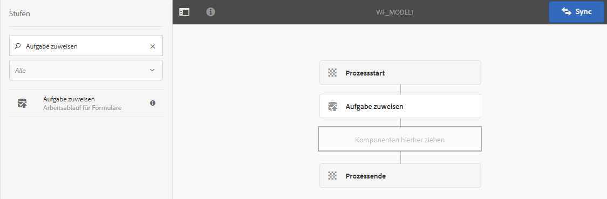
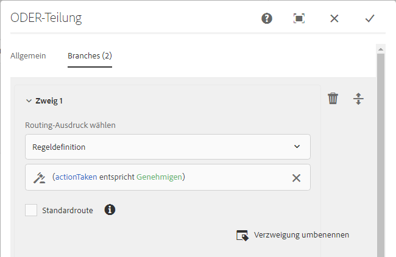
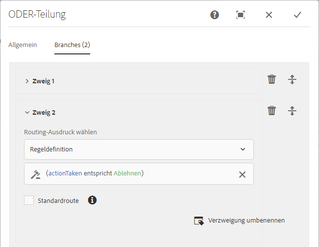
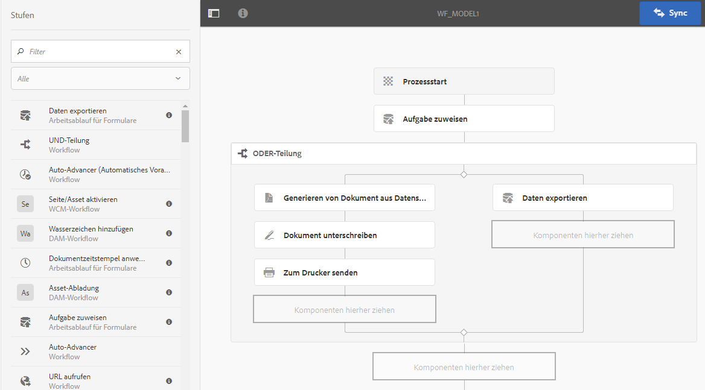

# Formularzentrierte Workflows in OSGi{#forms-centric-workflow-on-osgi}

Unternehmen erfassen Daten aus Hunderten und Tausenden von Formularen, verschiedenen Back-End-Systemen sowie Online- und Offline-Datenquellen. Darüber hinaus ist eine dynamische Gruppe von Benutzern vorhanden, die Entscheidungen bezüglich der Daten treffen, was iterative Prüfungs- und Genehmigungsprozesse beinhaltet.

In großen Organisationen und Unternehmen fallen außer Workflows für die Prüfung und Genehmigung auch Aufgaben an, die sich wiederholen. Dazu gehört beispielsweise das Konvertieren von PDF-Dokumenten in andere Formate. Werden diese Aufgaben manuell durchgeführt, nehmen sie viel Zeit und Ressourcen in Anspruch. Unternehmen müssen darüber hinaus gesetzliche Anforderungen erfüllen, Dokumente digital zu signieren und Formulardaten zur späteren Verwendung in vordefinierten Formaten zu archivieren..

## Einführung in den formularzentrierten Workflow in OSGi {#introduction-to-forms-centric-workflow-on-osgi}

Sie können mit AEM-Workflows rasch Workflows auf Basis adaptiver Formulare erstellen. Diese Workflows können für Prüfungen und Genehmigungen, Geschäftsprozessabläufe, zum Starten von Document Services, zur Integration in Signatur-Workflows mit Adobe Sign und ähnliche Vorgänge verwendet werden. Dazu gehören beispielsweise die Verarbeitung von Kreditkartenanträgen, Workflows für die Genehmigung von Urlaub für Mitarbeiter oder das Speichern von Formularen als PDF-Dokument. Darüber hinaus können diese Workflows innerhalb eines Unternehmens oder verwendet werden und eine Netzwerk-Firewall passieren.

Mit formularzentrierten Workflows in OSGi können Sie schnell Workflows für verschiedene Aufgaben auf dem OSGi-Stapel erstellen und bereitstellen, ohne die komplette Prozessverwaltungsfunktion auf dem JEE-Stapel zu installieren. Die Bereitstellung und Verwaltung der Workflows verwendet die gewohnten Funktionen von AEM-Workflow und AEM-Posteingang. Workflows bilden die Grundlage für die Automatisierung realer Geschäftsprozesse, an denen mehrere Softwaresysteme, Netzwerke, Abteilungen und sogar Unternehmen beteiligt sind.

Nachdem Sie diese Workflows eingerichtet haben, können Sie sie manuell auslösen, um einen definierten Prozess auszuführen, oder sie können als Programm ablaufen, wenn Benutzer Formulare oder Briefe aus [Correspondence Management](/help/forms/using/cm-overview.md) senden. AEM Forms bietet mit diesen verbesserten AEM-Workflow-Funktionen zwei verschiedene, aber ähnliche Funktionen. Entscheiden Sie im Rahmen Ihrer Bereitstellungsstrategie, welche für Sie geeignet ist. Siehe einen [Vergleich](capabilities-osgi-jee-workflows.md) der Forms-zentrierten AEM Workflows unter OSGi und Process Management on JEE. Weitere Informationen zur Bereitstellungstopologie finden Sie unter [Architektur- und Bereitstellungstopologien für AEM Forms](/help/forms/using/aem-forms-architecture-deployment.md).

Der formularzentrierte Workflow für OSGi erweitert den [AEM-Posteingang](/help/sites-authoring/inbox.md) und bietet zusätzliche Komponenten (Schritte) für den AEM-Workflow-Editor an, um Unterstützung für AEM Forms-zentrierte Workflows hinzuzufügen. Der erweiterte AEM-Posteingang bietet ähnliche Funktionen wie [AEM Forms Workspace](introduction-html-workspace.md). Sie können mithilfe von AEM-Workflows sowohl Workflows verwalten, die durch Personen ausgeführt werden müssen (Genehmigung, Prüfung usw.), als auch Vorgänge für [Document Services](/help/sites-developing/workflows-step-ref.md) (z. B. Generate PDF) automatisieren und Dokumente elektronisch (mit Adobe Sign) signieren.

Alle AEM Forms-Workflow-Schritte unterstützen die Verwendung von Variablen. Variablen ermöglichen Workflow-Schritte zum Speichern und Übergeben von Metadaten zur Laufzeit über mehrere Schritte hinweg. Sie können verschiedene Typen von Variablen zum Speichern verschiedener Datentypen erstellen. Sie können auch Variablensammlungen (Array) erstellen, um mehrere Instanzen verwandter, vom selben Typ stammender Daten zu speichern. In der Regel verwenden Sie eine Variable oder eine Sammlung von Variablen, wenn Sie eine Entscheidung basierend auf dem Wert treffen müssen, den sie enthält, oder Informationen speichern möchten, die Sie später in einem Prozess benötigen. Weitere Informationen zur Verwendung von Variablen in diesen Forms-zentrierten Workflow-Komponenten (Schritte) finden Sie unter [Forms-zentrierter Workflow unter OSGi - Schrittreferenz](../../forms/using/aem-forms-workflow-step-reference.md). Informationen zum Erstellen und Verwalten von Variablen finden Sie unter [Variablen in AEM Workflows](../../forms/using/variable-in-aem-workflows.md).

Das folgende Diagramm zeigt einen End-to-End-Vorgang zum Erstellen, Ausführen und Überwachen eines formularzentrierten Workflows in OSGi.

## Bevor Sie beginnen {#before-you-start}

* Ein Workflow ist eine Darstellung eines realen Geschäftsprozesses. Halten Sie Ihren realen Geschäftsprozess und die Liste der Teilnehmer am Geschäftsprozess bereit. Außerdem müssen Sie die zusätzlichen Dokumente (adaptive Formulare, PDF-Dokumente usw.) bereithalten, bevor Sie einen Workflow erstellen.
* Ein Workflow kann mehrere Phasen haben. Diese Phasen werden im AEM-Posteingang angezeigt und helfen, den Fortschritt des Workflows zu melden. Teilen Sie Ihren Geschäftsprozess in logische Phasen ein.
* Sie können den Schritt „Aufgabe zuweisen“ von AEM-Workflows so konfigurieren, dass E-Mail-Benachrichtigungen an die Benutzer oder Bevollmächtigten gesendet werden. Sie sollten daher [E-Mail-Benachrichtigungen aktivieren](#configure-email-service).
* Ein Workflow kann darüber hinaus Adobe Sign für digitale Signaturen verwenden. Wenn Sie beabsichtigen, Adobe Sign in einem Workflow zu verwenden, [konfigurieren Sie Adobe Sign für AEM Forms](../../forms/using/adobe-sign-integration-adaptive-forms.md), bevor Sie es im Workflow einsetzen.

## Workflow-Modell erstellen {#create-a-workflow-model}

Ein Workflow-Modell besteht aus der Logik und dem Ablauf eines Geschäftsprozesses. Es setzt sich aus einer Reihe von Schritten zusammen. Diese Schritte sind AEM-Komponenten. Sie können Schritte des Arbeitsablaufs nach Bedarf mit Parametern und Skripten erweitern, um einen größeren Funktionsumfang und mehr Kontrollmöglichkeiten zu erzielen. AEM Forms bietet außer den vordefinierten AEM-Schritten einige weitere Schritte. Eine detaillierte Liste der AEM- und AEM Forms-Schritte finden Sie in der [Referenz zu Workflow-Schritten](/help/sites-developing/workflows-step-ref.md) und in [Formularzentrierte Workflows in OSGi - Schritt-Referenz](../../forms/using/aem-forms-workflow.md).

AEM bietet eine intuitive Benutzeroberfläche, über die ein Workflow-Modell unter Verwendung der bereitgestellten Workflow-Schritte erstellt werden kann. Eine schrittweise Anleitung zum Erstellen eines Workflow-Modells finden Sie unter [Erstellung von Modellen für den Arbeitsablauf](/help/sites-developing/workflows-models.md). Das folgende Beispiel zeigt schrittweise Anweisungen zum Erstellen eines Workflow-Modells für einen Genehmigungs- und Prüfungs-Workflow:

>[!NOTE]
>
>Um ein Workflow-Modell zu erstellen oder zu bearbeiten, müssen Sie zur Gruppe „workflow-editor“ gehören.

### Modell für einen Workflow zur Genehmigung und Prüfung erstellen {#create-a-model-for-an-approval-and-review-workflow}

Genehmigungs- und Prüfungs-Workflow sind für Aufgaben vorgesehen, bei denen Entscheidungen von Personen getroffen werden müssen. Im folgenden Beispiel wird ein Workflow-Modell für einen Hypothekenantrag erstellt, der von einem Front-End-Bankmitarbeiter ausgefüllt werden soll. Sobald der Antrag ausgefüllt ist, wird er zur Genehmigung übermittelt. Später wird der genehmigte Antrag zur elektronischen Signatur mit Adobe Sign an den Antragsteller gesendet.

Das Beispiel ist als Paket verfügbar und ist unten angehängt. Importieren und installieren Sie das Beispiel mithilfe von Package Manager. Sie können darüber hinaus die folgenden Schritte ausführen, um das Workflow-Modell für den Antrag manuell zu erstellen:

In diesem Beispiel wird ein Workflow-Modell für einen Hypothekenantrag erstellt, der von einem Front-End-Bankmitarbeiter ausgefüllt werden soll. Der ausgefüllte Antrag wird zur Genehmigung übermittelt. Der genehmigte Antrag wird später zur elektronischen Unterzeichnung mit Adobe Sign an den Kunden gesendet. Sie können das Beispiel mit dem Package Manager importieren und installieren.

[Datei laden](assets/example-mortgage-loan-application.zip)

1. Öffnen Sie die Konsole für Arbeitsablaufmodelle. Die Standardeinstellung ist `https://[server]:[port]/libs/cq/workflow/admin/console/content/models.html/etc/workflow/models`
1. Wählen Sie dann **Erstellen** und dann **Modell erstellen** aus. Das Dialogfeld Arbeitsablaufmodell hinzufügen wird angezeigt.
1. Geben Sie den **Titel** und den **Namen** ein (optional). Beispiel: Hypothekenantrag. Tippen Sie auf **Fertig**.
1. Wählen Sie das neu erstellte Workflow-Modell aus und tippen Sie auf **Bearbeiten**. Jetzt können Sie Workflow-Schritte hinzufügen, um Geschäftslogik zu erstellen. Wenn Sie ein Workflow-Modell neu erstellen, enthält dieses zunächst:

   * Die Schritte für Flussstart und Flussende. Diese Schritte geben den Anfang und das Ende des Workflows an. Diese Schritte sind obligatorisch und können nicht bearbeitet oder entfernt werden.
   * Ein Beispiel für einen Teilnehmer-Schritt namens Schritt 1. Dieser Schritt ist so konfiguriert, dass er dem Admin-Benutzer ein Arbeitselement zuordnet. Entfernen Sie diesen Schritt.

1. Aktivieren Sie E-Mail-Benachrichtigungen. Sie können einen Forms-orientierten Workflow in OSGi konfigurieren, um E-Mail-Benachrichtigungen an Benutzer oder Bevollmächtigte zu senden. Führen Sie die folgenden Konfigurationen durch, um E-Mail-Benachrichtigungen zu aktivieren:

   1. Wechseln Sie zum AEM Configuration Manager unter `https://[server]:[port]/system/console/configMgr`.
   1. Öffnen Sie die Konfiguration des **[!UICONTROL Day CQ Mail Service]**. Geben Sie Werte in die Felder **[!UICONTROL SMTP-Server-Hostname]**, **[!UICONTROL SMTP-Server-Anschluss]** und **[!UICONTROL Absenderadresse]** ein. Klicken Sie auf **[!UICONTROL Speichern]**.
   1. Öffnen Sie die Konfiguration **[!UICONTROL Day CQ Link Externalizer]**. Geben Sie im Feld **[!UICONTROL Domänen]** den tatsächlichen Hostnamen/die IP-Adresse und die Portnummer für lokale Instanzen sowie Authoring- und Veröffentlichungsinstanzen an. Klicken Sie auf **[!UICONTROL Speichern]**.

1. Erstellen Sie Workflow-Phasen. Ein Workflow kann mehrere Phasen haben. Diese Phasen werden im AEM-Posteingang angezeigt und geben den Fortschritt des Workflow an.

   Um eine Bühne zu definieren, tippen Sie auf das Symbol , um Workflow-Modelleigenschaften zu öffnen, öffnen Sie die Registerkarte **Stages**, fügen Sie Bühnen für das Workflow-Modell hinzu und tippen Sie auf **Speichern und schließen**. Für einen Hypothekenantrag könnten Sie beispielsweise die folgenden Phasen erstellen: Darlehensantrag, Status des Darlehensantrags, zu signierende Dokumente und signiertes Antragsdokument.

1. Ziehen Sie den Schritt-Browser **Aufgabe zuweisen** in den Arbeitsablaufmodell. Definieren Sie ihn als ersten Schritt im Modell.

   Die Komponente „Aufgabe zuweisen“ weist die durch den Workflow erstellte Aufgabe einem Benutzer oder einer Gruppe zu. Sie können mithilfe der Komponente zusammen mit der Zuweisung der Aufgabe auch das adaptive Formular oder die nicht-interaktive PDF-Datei für die Aufgabe angeben. Das adaptive Formular ist erforderlich, damit die Benutzer Eingaben vornehmen können, und die nicht-interaktive PDF-Datei oder ein schreibgeschütztes adaptives Formular wird in Workflows verwendet, die nur zur Prüfung dienen.

   Sie können mithilfe dieses Schritts auch das Verhalten der Aufgabe steuern. Dies betrifft beispielsweise das automatische Erstellen eines Datensatzdokuments, die Zuweisung der Aufgabe an einen bestimmten Benutzer oder eine Gruppe, den Pfad der übermittelten Daten, den Pfad der im Voraus auszufüllenden Daten sowie Standardaktionen. Ausführliche Informationen zu den Optionen des Schritts &quot;Aufgabe zuweisen&quot;finden Sie im Dokument [Forms-zentrierter Workflow unter OSGi - Schrittreferenz](../../forms/using/aem-forms-workflow.md) .

   

   Konfigurieren Sie im Beispiel für den Hypothekenantrag  den Schritt „Aufgabe zuweisen“ so, dass ein schreibgeschütztes adaptives Formular verwendet und das PDF-Dokument angezeigt wird, nachdem die Aufgabe abgeschlossen ist. Wählen Sie außerdem die Benutzergruppe aus, die zum Genehmigen des Darlehensantrags berechtigt ist. Deaktivieren Sie auf der Registerkarte **Aktionen** die Option **Senden**. Erstellen Sie eine **actionTaken**-Variable des Datentyps String und geben Sie die Variable als **Route-Variable** an. Dies könnte beispielsweise „actionTaken“ sein. Fügen Sie außerdem die Routen zu Genehmigen und Ablehnen hinzu. Die Routen werden als separate Aktionen (Schaltflächen) im AEM-Posteingang angezeigt. Der Workflow wählt die passende Verzweigung für die Aktion (Schaltfläche), auf die der Benutzer klickt.

   Sie können das Beispielpaket, das am Anfang des Abschnitts zum Download zur Verfügung steht, importieren, um sämtliche Werte aller Felder im Schritt „Aufgabe zuweisen“ zu erhalten, der für das Beispiel des Hypothekenantrags konfiguriert wurde.

1. Ziehen Sie die Komponente „ODER-Teilung“ aus der Seitenleiste in das Workflow-Modell. Die ODER-Teilung erstellt eine Verzweigung im Workflow, nach nur einer der beiden Zweige aktiv bleibt. Mit diesem Schritt können Sie bedingte Prozesspfade in einem Workflow einrichten. Sie fügen jeder Verzweigung nach Bedarf Workflow-Schritte hinzu.

   Sie können Routing-Ausdrücke für eine Verzweigung mithilfe einer Regeldefinition, eines ECMA-Skripts oder eines externen Skripts definieren.

   Verwenden Sie den Ausdruckseditor, um Routing-Ausdrücke für Verzweigung 1 und Verzweigung 2 zu erstellen. Diese Routing-Ausdrücke helfen bei der Auswahl einer Verzweigung, die auf der Benutzeraktion in AEM Posteingang basiert.

   **Routing-Ausdruck für Verzweigung 1**

   Wenn ein Benutzer im Posteingang auf **Approve** tippt, wird Verzweigung 1 aktiviert.

   

   **Routing-Ausdruck für Verzweigung 2**

   Wenn ein Benutzer im Posteingang auf **Ablehnen** tippt, wird Verzweigung 2 aktiviert.

   

   Informationen zum Erstellen von Routing-Ausdrücken mithilfe von Variablen finden Sie unter [Variablen in AEM Forms-Workflows](../../forms/using/variable-in-aem-workflows.md).

1. Fügen Sie weitere Workflow-Schritte hinzu, um die Geschäftslogik zu erstellen.

   Fügen Sie für das Hypothekenbeispiel in Verzweigung 1 einen Schritt zum Generieren des Datensatzdokuments, zwei Schritte zum Zuweisen einer Aufgabe und einen Schritt zum Signieren des Dokuments hinzu wie in der Abbildung unten gezeigt. Ein Schritt „Aufgabe zuweisen“ dient zum Anzeigen und Senden **zu unterzeichnender Darlehensdokumente an den Antragsteller** und der zweite Schritt „Aufgabe zuweisen“ dient zum **Anzeigen der unterzeichneten Dokumente**. Fügen Sie auch Verzweigung 2 einen Schritt „Aufgabe zuweisen“ hinzu. Wird aktiviert, wenn ein Benutzer im Posteingang auf Ablehnen klicktAEM

   Um den vollständige Satz der Werte in allen Feldern für die Schritte „Aufgabe zuweisen“ sowie die Schritte für das Datensatzdokument und zum Unterzeichnen des Dokuments zu erhalten, die für den Beispielhypothekenantrag konfiguriert sind, importieren Sie das Beispielpaket, das am Anfang dieses Abschnitts zur Verfügung steht.

   Damit ist das Workflow-Modell einsatzbereit. Sie können den Workflow über verschiedene Methoden starten. Weitere Informationen finden Sie unter [Starten eines formularzentrierten Workflow auf OSGi](#launch).

   

## Formularzentrierte Workflow-Anwendung erstellen {#create-a-forms-centric-workflow-application}

Die Anwendung ist das mit dem Workflow verknüpfte adaptive Formular. Wenn eine Anwendung über den Posteingang gesendet wird, wird der zugehörige Workflow gestartet. Um einen Forms-Workflow als Anwendung in AEM Inbox und AEM Forms-Apps verfügbar zu machen, führen Sie folgende Schritte aus, um eine Workflow-Anwendung zu erstellen:

>[!NOTE]
>
>Sie müssen Mitglied der Gruppe „fd-administrator“ sein, um Workflow-Anwendungen erstellen und verwalten zu können.

1. Wechseln Sie in Ihrer AEM-Autoreninstanz zu  > **[!UICONTROL Forms]** > **[!UICONTROL Workflow-Anwendung verwalten]** und tippen Sie auf **[!UICONTROL Erstellen]**.
1. Geben Sie im Fenster Workflow-Anwendung erstellen Eingaben für die folgenden Felder ein und tippen Sie auf **Erstellen**. Eine neue Anwendung wird erstellt und im Bildschirm „Workflow-Anwendungen“ aufgeführt.

<table>
 <tbody>
  <tr>
   <td>Feld</td>
   <td>Beschreibung</td>
  </tr>
  <tr>
   <td>Titel</td>
   <td>Der Titel ist im AEM-Posteingang sichtbar und hilft Benutzern bei der Auswahl einer Anwendung. Achten Sie darauf, einen beschreibenden Titel anzugeben. Beispiel: Antrag auf Eröffnung eines Sparkontos.  </td>
  </tr>
  <tr>
   <td>Name </td>
   <td>Geben Sie den Namen der Anwendung an. Zeichen, die keine Buchstaben, Ziffern, Bindestriche oder Unterstriche sind, werden durch Bindestriche ersetzt. </td>
  </tr>
  <tr>
   <td>Beschreibung</td>
   <td>Die Beschreibung wird im AEM-Posteingang angezeigt. Geben Sie detaillierte Informationen zur Anwendung in den Beschreibungsfeldern an. Beispielsweise Zweck der Anwendung.  </td>
  </tr>
  <tr>
   <td>Adaptives Formular</td>
   <td>
Geben Sie den Pfad eines adaptiven Formulars an. Wenn ein Benutzer die Anwendung startet, wird das angegebene adaptive Formular angezeigt.
 
<strong>Hinweis:</strong> Workflow-Anwendungen unterstützen keine Formulare und PDF-Dokumente, die länger als eine Seite sind oder auf dem Apple iPad gescrollt werden müssen. Wenn eine Anwendung auf dem Apple iPad geöffnet wird und das adaptive Formular oder das PDF-Dokument länger als eine Seite ist, gehen die Formularfelder und der Inhalt auf der zweiten Seite verloren.
 </td>
  </tr>
  <tr>
   <td>Zugriffsgruppe</td>
   <td>
Wählen Sie eine Gruppe. Die Anwendung wird nur für die Mitglieder der ausgewählten Gruppe in AEM Inbox angezeigt. Die Option „Zugriffsgruppe“ stellt alle Gruppen der Workflow-Benutzergruppe zur Auswahl bereit. 
   </td>
  </tr>
  <tr>
   <td>Vorbefüllungs-Dienst</td>
   <td>Wählen Sie einen <a href="../../forms/using/prepopulate-adaptive-form-fields.md#aem-forms-custom-prefill-service" target="_blank">Vorbefüllungs-Dienst</a> für das adaptive Formular aus.  </td>
  </tr>
  <tr>
   <td>Workflow-Modell</td>
   <td>Wählen Sie ein <a href="../../forms/using/aem-forms-workflow.md#create-a-workflow-model">Workflow-Modell</a> für die Anwendung. Ein Workflow-Modell besteht aus Logik und Fluss des Geschäftsprozesses. </td>
  </tr>
  <tr>
   <td>Datendateipfad</td>
   <td>Geben Sie den Pfad der Datendatei im CRX-Repository an. Der Pfad wird relativ zu den Nutzdaten des adaptiven Formulars angegeben und enthält den Namen der Datendatei. Geben Sie immer den vollständigen Namen der Datei einschließlich gegebenenfalls der Dateierweiterung an. Beispiel: [Nutzdaten]/data.xml. </td>
  </tr>
  <tr>
   <td>Anlagenpfad</td>
   <td>Geben Sie den Pfad des Ordners für Anhänge im CRX-Repository an. Der Pfad für Anhänge wird relativ zum Speicherort der Nutzdaten angegeben. Beispiel: [Nutzdaten]/data.xml. </td>
  </tr>
  <tr>
   <td>Pfad für Datensatzdokument</td>
   <td>Geben Sie den Pfad der Datei für das Datensatzdokument im CRX-Repository an. Der Pfad wird relativ zum Speicherort der Nutzdaten für das adaptive Formular angegeben. Geben Sie immer den vollständigen Namen der Datei einschließlich gegebenenfalls der Dateierweiterung an. Beispiel: [Nutzdaten]/DOR/creditcard.pdf.</td>
  </tr>
 </tbody>
</table>

## Starten eines formularzentrierten Workflow auf OSGi {#launch}

Sie können einen formularzentrierten Workflow wie folgt starten oder auslösen:

* [Senden einer Anwendung aus dem AEM-Posteingang](#inbox)
* [Senden einer Anwendung aus der AEM Forms-App](#afa)

* [Senden eines adaptiven Formulars](#af)
* [Verwenden eines überwachten Ordners](#watched)

* [Senden einer interaktiven Kommunikation oder eines Briefes](#letter)

### Senden einer Anwendung aus AEM Inbox {#inbox}

Die von Ihnen erstellte Workflow-Anwendung ist als Anwendung im Posteingang verfügbar. Benutzer, die Mitglieder der Gruppe „workflow-users“ sind, können den Antrag ausfüllen und senden, der den zugehörigen Workflow auslöst. Weitere Informationen zur Verwendung des AEM-Posteingangs zum Senden von Anwendungen und Verwalten von Aufgaben finden Sie unter [Verwalten von Forms-Anwendungen und Aufgaben im AEM-Posteingang](../../forms/using/manage-applications-inbox.md).

### Senden einer Anwendung aus der AEM Forms-App {#afa}

Die AEM Forms-App synchronisiert die Daten mit einem AEM Forms-Server und ermöglicht es Ihnen, Änderungen an den Formulardaten an Aufgaben, an Workflow-Anwendungen und gespeicherten Informationen (Entwürfe/Vorlagen) in Ihrem Konto vorzunehmen. Weitere Informationen finden Sie unter [AEM Forms-App](/help/forms/using/aem-forms-app.md) und zugehörige Artikel.

### Senden eines adaptiven Formulars {#af}

Sie können die Übermittlungsaktionen eines adaptiven Formulars konfigurieren, sodass bei Übermittlung des adaptiven Formulars ein Workflow gestartet wird. Bei adaptiven Formularen steht die Übermittlungsaktion **AEM-Workflow aufrufen** zur Verfügung, die bewirkt, dass ein Workflow bei der Übermittlung eines adaptiven Formulars gestartet wird. Ausführliche Informationen zu Übermittlungsaktionen finden Sie unter [Konfigurieren der Übermittlungsaktion](../../forms/using/configuring-submit-actions.md). Um ein adaptives Formular über die AEM Forms-App zu senden, aktivieren Sie in den Eigenschaften des adaptiven Formulars die Option „Mit AEM Forms App synchronisieren“.

Sie können ein adaptives Formular zum Synchronisieren, Senden und Auslösen eines Workflows über die AEM Forms-App konfigurieren. Einzelheiten finden Sie unter [Arbeiten mit einem Formular](/help/forms/using/working-with-form.md).

### Überwachten Ordner verwenden {#watched}

Ein Administrator (ein Mitglied der Gruppe „fd-administrators“) kann einen Netzwerkordner konfigurieren, um einen vorkonfigurierten Workflow auszuführen, wenn ein Benutzer eine Datei (z. B. eine PDF-Datei) in diesem Ordner ablegt. Nachdem der Arbeitsablauf abgeschlossen ist, kann die Ergebnisdatei in einem angegebenen Ausgabeordner gespeichert werden. Ein solcher Ordern wird als [überwachter Ordner](../../forms/using/watched-folder-in-aem-forms.md) bezeichnet. Führen Sie das folgende Verfahren aus, um einen überwachten Ordner zum Starten eines Workflows zu konfigurieren:

1. Wechseln Sie in Ihrer AEM-Autoreninstanz zu  > **[!UICONTROL Forms]** > **[!UICONTROL Überwachten Ordner konfigurieren]**. . Eine Liste der bereits konfigurierten überwachten Ordner wird angezeigt.
1. Tippen Sie auf **[!UICONTROL Neu]**. Eine Liste von Feldern wird angezeigt. Geben Sie Werte für die folgenden Felder ein, um einen überwachten Ordner für einen Workflow zu konfigurieren:

<table>
 <tbody>
  <tr>
   <td>Feld</td>
   <td>Beschreibung</td>
  </tr>
  <tr>
   <td>Name</code></td>
   <td>Geben Sie den Namen für den überwachten Ordner ein. In diesem Feld muss ein alphanumerischer Wert eingegeben werden.</td>
  </tr>
  <tr>
   <td>Pfad</code></td>
   <td>Geben Sie den physischen Speicherort des überwachten Ordners ein. Verwenden Sie in einer Clusterumgebung einen freigegebenen Netzwerkordner, auf den über einen AEM-Clusterknoten zugegriffen werden kann.</td>
  </tr>
  <tr>
   <td>Prozessdateien, die Folgendes verwenden:</code></td>
   <td>Wählen Sie die Option Workflow </code>aus. </code></td>
  </tr>
  <tr>
   <td>Workflow-Modell</code></td>
   <td>Wählen Sie ein Workflow-Modell.  </td>
  </tr>
  <tr>
   <td>Ausgabedateimuster</code></td>
   <td>Geben Sie die Ordnerstruktur für die Ausgabedateien und -ordner an. Sie können auch ein <a href="/help/forms/using/admin-help/configuring-watched-folder-endpoints.md" target="_blank">Muster für die Ausgabe von Dateien und Ordnern</a> angeben.</td>
  </tr>
 </tbody>
</table>

1. Tippen Sie auf **Erweitert**. Geben Sie einen Wert für das folgende Feld ein und tippen Sie auf **Erstellen**. Damit ist der überwachte Ordner so konfiguriert, dass er einen Arbeitsablauf startet. Wenn nun eine Datei im Eingabeverzeichnis des überwachten Ordners abgelegt wird, wird der angegebene Workflow ausgelöst.

   | Feld | Beschreibung |
   |---|---|
   | Payload Mapper-Filter | Wenn Sie einen überwachten Ordner erstellen, erstellt er eine Ordnerstruktur im CRX-Repository. Die Ordnerstruktur kann als Nutzdaten für den Workflow dienen. Sie können ein Skript schreiben, um einen AEM-Workflow zuzuordnen und Eingaben von der überwachten Ordnerstruktur zu übernehmen. Eine standardmäßige Implementierung ist verfügbar und im Payload-Mapper-Filter aufgeführt. Wenn Sie keine benutzerdefinierte Implementierung haben, wählen Sie die Standardimplementierung aus. |

   Die Registerkarte „Erweitert“ enthält weitere Felder. Die meisten dieser Felder enthalten einen Standardwert. Weitere Informationen zu allen Feldern finden Sie im Artikel [Erstellen oder konfigurieren Sie einen überwachten Ordner](/help/forms/using/admin-help/configuring-watched-folder-endpoints.md).

### Senden einer interaktiven Kommunikation oder eines Briefes {#letter}

Sie können einen Forms-orientierten Workflow auf OSGi bei der Übermittlung einer interaktiven Kommunikation oder eines Briefs verknüpfen und ausführen. In Correspondence Management-Workflows werden für die Nachbearbeitung interaktiver Kommunikation und Briefe verwendet. Dazu gehören beispielsweise Versenden per E-Mail, Drucken, Faxen und Archivieren der endgültigen Briefe. Detaillierte Schritte finden Sie unter [Nachbearbeitung von interaktiver Kommunikation und Briefen](../../forms/using/submit-letter-topostprocess.md).

## Zusätzliche Konfigurationen  {#additional-configurations}

### E-Mail-Dienst konfigurieren {#configure-email-service}

Sie können die Schritte „Aufgabe zuweisen“ und „E-Mail senden“ von AEM-Workflows verwenden, um eine E-Mail zu senden. Führen Sie die folgenden Schritte aus, um E-Mail-Server und andere Konfigurationen anzugeben, die zum Senden von E-Mails erforderlich sind:

1. Wechseln Sie zum AEM Configuration Manager unter `https://[server]:[port]/system/console/configMgr`.
1. Öffnen Sie die Konfiguration des **[!UICONTROL Day CQ Mail Service]**. Geben Sie Werte in die Felder **[!UICONTROL SMTP-Server-Hostname]**, **[!UICONTROL SMTP-Server-Anschluss]** und **[!UICONTROL Absenderadresse]** ein. Klicken Sie auf **[!UICONTROL Speichern]**.
1. Öffnen Sie die Konfiguration **[!UICONTROL Day CQ Link Externalizer]**. Geben Sie im Feld **[!UICONTROL Domänen]** den tatsächlichen Hostnamen/die IP-Adresse und die Portnummer für lokale Instanzen sowie Authoring- und Veröffentlichungsinstanzen an. Klicken Sie auf **[!UICONTROL Speichern]**.

### Bereinigen von Workflow-Instanzen  {#purge-workflow-instances}

Die Minimierung der Anzahl von Workflow-Instanzen steigert die Leistung der Workflow-Engine, sodass Sie regelmäßig abgeschlossene oder laufende Workflow-Instanzen aus dem Repository löschen können. Ausführliche Informationen finden Sie unter [Regelmäßiges Bereinigen von Workflow-Instanzen](/help/sites-administering/workflows-administering.md#regular) Bereinigen von Workflow-Instanzen
