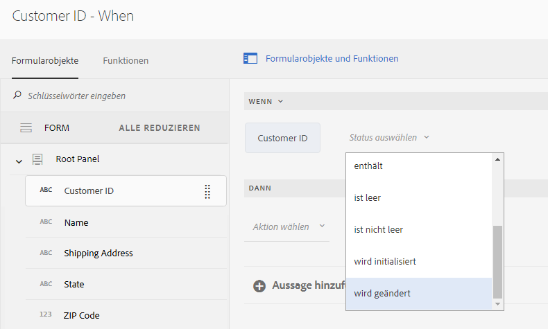
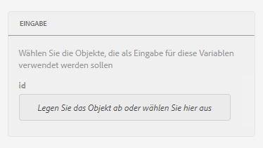
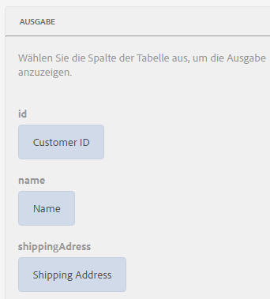
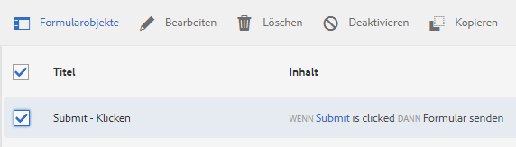
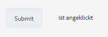
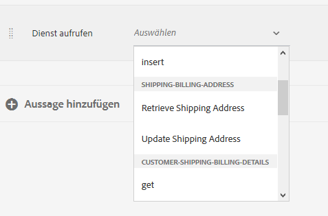
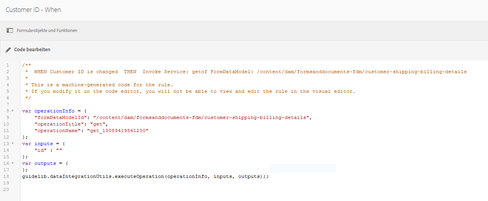

# Schulung: Wenden Sie Regeln auf adaptive Formularfelder an {#tutorial-apply-rules-to-adaptive-form-fields}


Dieses Tutorial ist ein Teil der Serie [Erstellen Ihres ersten adaptiven Formulars](/help/forms/using/create-your-first-adaptive-form.md). Adobe empfiehlt, die Serie in chronologischer Reihenfolge durchzugehen, um den vollständigen Anwendungsfall des Tutorials zu verstehen, auszuführen und zu demonstrieren.

## Über das Tutorial {#about-the-tutorial}

Sie können Regeln verwenden, um einem adaptiven Formular Interaktivität, Geschäftslogik und intelligente Validierungen hinzuzufügen. Adaptive Formulare verfügen über einen integrierten Regeleditor. Der Regeleditor bietet eine Drag-and-Drop-Funktionalität, ähnlich wie bei Einführungen.  Die Drag-and-Drop-Methode ist die schnellste und einfachste Methode zum Erstellen von Regeln.  Der Regeleditor bietet außerdem ein Code-Fenster für Benutzende, die ihre Programmierfähigkeiten testen oder die Regeln weiterentwickeln möchten.

Unter [Regeleditor für adaptive Formulare](/help/forms/using/rule-editor.md) erfahren Sie mehr über den Regeleditor.

Am Ende der Schulung lernen Sie Regeln zu erstellen, um Folgendes zu tun: 

* Aufrufen eines Formulardatenmodell-Dienstes zum Abrufen von Daten aus der Datenbank
* Aufrufen eines Formulardatenmodell-Dienstes zum Hinzufügen von Daten zur Datenbank
* Ausführen einer Validierungsprüfung und Anzeigen von Fehlermeldungen

Interaktive GIF-Bilder am Ende jedes Abschnitts der Schulung helfen Ihnen dabei, die Funktionalität des Formulars, das Sie gerade erstellen, schnell zu lernen und zu validieren. 

## Schritt 1: Abrufen eines benutzerdefinierten Eintrags aus der Datenbank {#retrieve-customer-record}

Sie haben ein Formulardatenmodell erstellt, wie im Artikel [Formulardatenmodell erstellen](/help/forms/using/create-form-data-model.md) beschrieben. Jetzt können Sie den Regeleditor verwenden, um die Formulardatenmodelldienste aufzurufen, um Informationen aus der Datenbank abzurufen und ihr hinzuzufügen.

Jeder Kundin und jedem Kunden ist eine eindeutige Kunden-ID-Nummer zugeordnet, anhand derer sich relevante Kundendaten in einer Datenbank identifizieren lassen.  Das folgende Verfahren verwendet die Kunden-ID, um Informationen aus der Datenbank abzurufen:

1. Öffnen Sie Ihr adaptives Formular zum Bearbeiten.

   [http://localhost:4502/editor.html/content/forms/af/change-billing-shipping-address.html](http://localhost:4502/editor.html/content/forms/af/change-billing-shipping-address.html)

1. Wählen Sie das Feld **[!UICONTROL Kunden-ID]** und dann das Symbol **[!UICONTROL Regeln bearbeiten]** aus. Das Fenster „Regeleditor“ wird geöffnet.
1. Wählen Sie das Symbol **[!UICONTROL + Erstellen]** aus, um eine Regel hinzuzufügen. Es öffnet den visuellen Editor.

   Im visuellen Editor ist die Anweisung **[!UICONTROL WHEN]** standardmäßig ausgewählt. Darüber hinaus wird das Formularobjekt (in diesem Fall **[!UICONTROL Kunden-ID]**), von dem aus Sie den Regeleditor gestartet haben, in der **[!UICONTROL WHEN]**-Anweisung angegeben.

1. Wählen Sie die Dropdown-Liste **[!UICONTROL Status auswählen]** und dann **[!UICONTROL wurde geändert]** aus.

   

1. Wählen Sie im Abschnitt **[!UICONTROL DANN]** die Option **[!UICONTROL Dienst aufrufen]** aus der Dropdown-Liste **[!UICONTROL Aktion auswählen]** aus. 
1. Wählen Sie den Dienst **[!UICONTROL Versandadresse abrufen]** aus der Dropdown-Liste **[!UICONTROL Auswählen]** aus.
1. Ziehen Sie das Feld **[!UICONTROL Kunden-ID]** per Drag-and-Drop von der Registerkarte „Formularobjekte“ in das Feld **[!UICONTROL Objekt hier einfügen oder auswählen]** im **[!UICONTROL INPUT]**-Bereich.

   

1. Ziehen Sie das Feld **[!UICONTROL Kunden-ID, Name, Versandadresse, Bundesland und Postleitzahl]** per Drag-and-Drop von der Registerkarte „Formularobjekte“ in das Feld **[!UICONTROL Objekt hier einfügen oder auswählen]** im Bereich **[!UICONTROL OUTPUT]**.

   

   Wählen Sie **[!UICONTROL Fertig]** aus, um die Regel zu speichern. Wählen Sie im Regeleditor-Fenster die Option **[!UICONTROL Schließen]** aus.

1. Zeigen Sie das adaptive Formular in der Vorschau an. Geben Sie eine ID in das Feld **[!UICONTROL Kunden-ID]** ein. Das Formular kann jetzt Kundendetails aus der Datenbank abrufen.

   

## Schritt 2: Hinzufügen der aktualisierten Kundenadresse zur Datenbank {#updated-customer-address}

Nachdem die Kundendaten aus der Datenbank abgerufen wurden, können Sie die Lieferadresse, das Bundesland und die Postleitzahl aktualisieren. Mit dem folgenden Verfahren wird ein Formulardatenmodelldienst aufgerufen, um Kundeninformationen in der Datenbank zu aktualisieren:

1. Wählen Sie das Feld **[!UICONTROL Absenden]** und dann das Symbol **[!UICONTROL Regeln bearbeiten]** aus. Das Fenster „Regeleditor“ wird geöffnet.
1. Wählen Sie die Regel **[!UICONTROL Senden – Klicken]** und dann das Symbol **[!UICONTROL Bearbeiten]** aus. Die Optionen zum Bearbeiten der Senden-Regel werden angezeigt.

   

   In der WHEN-Option sind die Optionen **[!UICONTROL Senden]** und **[!UICONTROL wurde angeklickt]** bereits ausgewählt.

   

1. Wählen Sie unter **[!UICONTROL DANN]** die Option **[!UICONTROL + Anweisung hinzufügen]** aus. Wählen Sie aus der Dropdown-Liste **[!UICONTROL Aktion auswählen]** die Option **[!UICONTROL Dienst aufrufen]** aus.
1. Wählen Sie aus der Dropdown-Liste **[!UICONTROL Auswählen]** den Dienst **[!UICONTROL Versandadresse aktualisieren]** aus.

   

   

1. Ziehen Sie das Feld **[!UICONTROL Versandadresse, Bundesland und Postleitzahl]** aus der Registerkarte [!UICONTROL Formularobjekte] auf die entsprechende Tabellennameneigenschaft (z. B. customerdetails.shippingAddress) des Feldes **[!UICONTROL Objekt hier einfügen oder auswählen]** im Bereich **[!UICONTROL INPUT]**. Alle Felder mit dem Präfix „tablename“ (in diesem Anwendungsbeispiel das Feld „customerdetails“) dienen als Eingabedaten für den Aktualisierungsservice. Der gesamte Inhalt in diesen Feldern wird in der Datenquelle aktualisiert.

   >[!NOTE]
   >
   >Ziehen Sie die Felder **[!UICONTROL Name]** und **[!UICONTROL Kunden-ID]** nicht auf die entsprechende tablename.property (z. B. customerdetails.name). Der Name und die ID des Kunden sollten nicht versehentlich aktualisiert werden.

1. Ziehen Sie das Feld **[!UICONTROL Kunden-ID]** per Drag-and-Drop von der Registerkarte [!UICONTROL Formularobjekte] in das Feld „ID“ im Feld **[!UICONTROL INPUT]**. Felder ohne vorangestellten Tabellennamen (in diesem Anwendungsbeispiel das Feld „customerdetails“) dienen als Suchparameter für den Aktualisierungsservice. Das Feld **[!UICONTROL ID]** in diesem Anwendungsfall identifiziert einen Datensatz in der Tabelle **customerdetails**.
1. Klicken Sie auf **[!UICONTROL Fertig]**, um die Regel zu speichern. Wählen Sie im Regeleditor-Fenster die Option **[!UICONTROL Schließen]** aus.
1. Zeigen Sie das adaptive Formular in der Vorschau an. Rufen Sie Details einer Kundin oder eines Kunden ab, aktualisieren Sie die Versandadresse und senden Sie das Formular ab. Wenn Sie Details derselben Person erneut abrufen, wird die aktualisierte Versandadresse angezeigt.

## Schritt 3: (Abschnitt „Bonus“) Ausführen von Validierungen und Anzeigen von Fehlermeldungen mit dem Code-Editor {#step-bonus-section-use-the-code-editor-to-run-validations-and-display-error-messages}

Sie sollten eine Validierung des Formulars durchführen, um sicherzustellen, dass die im Formular eingegebenen Daten korrekt sind und im Falle fehlerhafter Daten eine Fehlermeldung angezeigt wird. Wenn beispielsweise eine nicht vorhandene Kunden-ID in das Formular eingegeben wird, sollte eine Fehlermeldung angezeigt werden.

Adaptive Formulare bieten mehrere Komponenten mit integrierten Validierungen, z. B. E-Mail, sowie numerische Felder, die Sie für häufige Anwendungsfälle verwenden können. Verwenden Sie den Regeleditor für erweiterte Anwendungsfälle, um z. B. eine Fehlermeldung anzuzeigen, wenn die Datenbank null (0) Datensätze (keine Datensätze) zurückgibt. 

Das folgende Verfahren zeigt, wie eine Regel erstellt wird, um eine Fehlermeldung anzuzeigen, wenn die im Formular eingegebene Kunden-ID nicht in der Datenbank vorhanden ist. Die Regel bringt auch den Fokus auf das Feld **[!UICONTROL Kunden-ID]** und setzt es zurück. Die Regel verwendet [die dataIntegrationUtils-API des Formulardatenmodell-Services](/help/forms/using/invoke-form-data-model-services.md), um zu überprüfen, ob die Kunden-ID in der Datenbank vorhanden ist.

1. Wählen Sie das Feld **[!UICONTROL Kunden-ID]** und dann das Symbol `Edit Rules` aus. Das Fenster des [!UICONTROL Regeleditors] wird geöffnet.
1. Wählen Sie das Symbol **[!UICONTROL + Erstellen]** aus, um eine Regel hinzuzufügen. Es öffnet den visuellen Editor.

   Im visuellen Editor ist die Anweisung **[!UICONTROL WHEN]** standardmäßig ausgewählt. Darüber hinaus wird das Formularobjekt (in diesem Fall **[!UICONTROL Kunden-ID]**), von dem aus Sie den Regeleditor gestartet haben, in der **[!UICONTROL WHEN]**-Anweisung angegeben.

1. Wählen Sie die Dropdown-Liste **[!UICONTROL Status auswählen]** und dann **[!UICONTROL wurde geändert]** aus.

   

   Wählen Sie in der **[!UICONTROL DANN]**-Anweisung aus der Dropdown-Liste **[!UICONTROL Aktion auswählen]** die Option **[!UICONTROL Dienst aufrufen]** aus.

1. Wechseln Sie vom **[!UICONTROL Visual Editor]** zum **[!UICONTROL Code-Editor]**. Die Schaltersteuerung befindet sich auf der rechten Seite des Fensters. Der Code-Editor wird geöffnet und zeigt Code ähnlich dem Folgenden an:

   

1. Ersetzen Sie den Eingabevariablenabschnitt durch den folgenden Code:

   ```javascript
   var inputs = {
       "id" : this
   };
   ```

1. Ersetzen Sie den Abschnitt `guidelib.dataIntegrationUtils.executeOperation (operationInfo, inputs, outputs)` durch den folgenden Code:

   ```javascript
   guidelib.dataIntegrationUtils.executeOperation(operationInfo, inputs, outputs, function (result) {
     if (result) {
         result = JSON.parse(result);
       customer_Name.value = result.name;
       customer_Shipping_Address = result.shippingAddress;
     } else {
       if(window.confirm("Invalid Customer ID. Provide a valid customer ID")) {
             customer_Name.value = " ";
            guideBridge.setFocus(customer_ID);
       }
     }
   });
   ```

1. Zeigen Sie das adaptive Formular in der Vorschau an. Geben Sie eine falsche Kunden-ID ein. Eine Fehlermeldung wird angezeigt.

   
