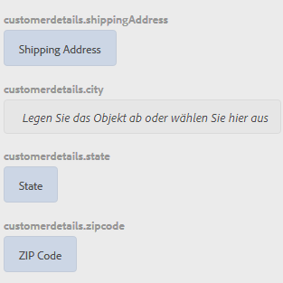

# Schulung: Wenden Sie Regeln auf adaptive Formularfelder an {#tutorial-apply-rules-to-adaptive-form-fields}


Diese Schulung ist ein Schritt in der Reihe [Erstellen Ihres ersten adaptives Formulars](/help/forms/using/create-your-first-adaptive-form.md). Adobe empfiehlt, die Serie in chronologischer Reihenfolge zu verfolgen, um den vollständigen Anwendungsfall der Schulung zu verstehen, auszuführen und zu demonstrieren.

## Über die Schulung {#about-the-tutorial}

Sie können Regeln erstellen, um einem adaptiven Formular Interaktivität, Geschäftslogik und intelligente Validierungen hinzuzufügen. Adaptive Formulare verfügen über einen integrierten Regeleditor. Der Regeleditor bietet eine Drag-and-Drop-Funktionalität, ähnlich wie bei Einführungen. Die Drag-and-Drop-Methode ist die schnellste und einfachste Methode zum Erstellen von Regeln. Der Regeleditor bietet außerdem ein Code-Fenster für Benutzer, die ihre Programmierfähigkeiten testen oder die Regeln weiterentwickeln möchten.

Sie können mehr über den Regeleditor unter [Regeleditor für adaptive Formulare](/help/forms/using/rule-editor.md) erfahren.

Am Ende der Schulung lernen Sie Regeln zu erstellen, um Folgendes zu tun: 

* Aufrufen eines Formulardatenmodell-Dienstes, um Daten aus der Datenbank abzurufen
* Aufrufen eines Formulardatenmodell-Dienstes, um Daten zur Datenbank hinzuzufügen
* Ausführen einer Validierungsprüfung und Anzeigen von Fehlermeldungen

Interaktive GIF-Bilder am Ende jedes Abschnitts der Schulung helfen Ihnen dabei, die Funktionalität des Formulars, das Sie gerade erstellen, schnell zu lernen und zu validieren. 

## Schritt 1: Abrufen eines benutzerdefinierten Datensatzes aus der Datenbank {#retrieve-customer-record}

Sie haben ein Formulardatenmodell erstellt wie im Artikel [Formulardatenmodell erstellen](/help/forms/using/create-form-data-model.md) beschrieben. Jetzt können Sie den Regeleditor verwenden, um die Formulardatenmodelldienste aufzurufen, um Informationen aus der Datenbank abzurufen und ihr hinzuzufügen.

Jedem Kunden ist eine eindeutige Kunden-ID-Nummer zugeordnet, anhand derer er relevante Kundendaten in einer Datenbank identifizieren kann. Das folgende Verfahren verwendet die Kunden-ID, um Informationen aus der Datenbank abzurufen:

1. Öffnen Sie Ihr adaptives Formular zum Bearbeiten.

   [http://localhost:4502/editor.html/content/forms/af/change-billing-shipping-address.html](http://localhost:4502/editor.html/content/forms/af/change-billing-shipping-address.html)

1. Tippen Sie auf das Feld **[!UICONTROL Kunden-ID]** und tippen Sie auf das Symbol **[!UICONTROL Regeln bearbeiten]**. Das Fenster „Regeleditor“ wird geöffnet.
1. Tippen Sie auf das Symbol **[!UICONTROL + Erstellen]**, um eine Regel hinzuzufügen. Es öffnet den visuellen Editor.

   In the Visual Editor, the **[!UICONTROL WHEN]** statement is selected by default. Also, the form object (in this case, **[!UICONTROL Customer ID]**) from where you launched the rule editor is specified in the **[!UICONTROL WHEN]** statement.

1. Tap the **[!UICONTROL Select State]** drop-down and select **[!UICONTROL is changed]**.

   

1. In der Anweisung **[!UICONTROL THEN]** wählen Sie **[!UICONTROL Dienst aufrufen]** aus der Dropdown-Liste **[!UICONTROL Aktion auswählen.]**
1. Wählen Sie den Dienst **[!UICONTROL Versandadresse abrufen]** aus der Dropdown-Liste **[!UICONTROL Auswählen]**.
1. Drag-and-drop the **[!UICONTROL Customer ID]** field from the Form Objects tab to the **[!UICONTROL Drop object or select here]** field in the **[!UICONTROL INPUT]** box.

   

1. Drag-and-drop the **[!UICONTROL Customer ID, Name, Shipping Address, State, and Zip Code]** field from the Form Objects tab to the **[!UICONTROL Drop object or select here]** field in the **[!UICONTROL OUTPUT]** box.

   

   Tippen Sie auf **[!UICONTROL Fertig]**, um die Regel zu speichern. On the rule editor window, tap **[!UICONTROL Close]**.

1. Zeigen Sie das adaptive Formular in der Vorschau an. Geben Sie eine ID im Feld **[!UICONTROL Kunden-ID]** ein. Das Formular kann nun Kundendaten aus der Datenbank abrufen.

   

## Schritt 2: Fügen Sie die aktualisierte Kundenadresse zur Datenbank hinzu {#updated-customer-address}

Nachdem die Kundendaten aus der Datenbank abgerufen wurden, können Sie die Lieferadresse, das Bundesland und die Postleitzahl aktualisieren. Das folgende Verfahren ruft einen Formulardatenmodelldienst auf, um Kundeninformationen in der Datenbank zu aktualisieren:

1. Wählen Sie das Feld **[!UICONTROL Senden]** und tippen Sie auf das Symbol **[!UICONTROL Regeln bearbeiten]**. Das Fenster „Regeleditor“ wird geöffnet.
1. Select the **[!UICONTROL Submit - Click]** rule and tap the **[!UICONTROL Edit]** icon. Die Optionen zum Bearbeiten der Übermittlungsregel werden angezeigt.

   

   In the WHEN option, the **[!UICONTROL Submit]** and **[!UICONTROL is clicked]** options are already selected.

   

1. Tippen Sie in der Option **[!UICONTROL THEN]** auf **[!UICONTROL + Anweisung hinzufügen]**. Wählen Sie **[!UICONTROL Dienst aufrufen]** aus der Dropdown-Liste **[!UICONTROL Aktion auswählen]**.
1. Wählen Sie den Dienst **[!UICONTROL Versandadresse aktualisieren]** aus der Dropdown-Liste **[!UICONTROL Auswählen]**.

   

1. 

   Ziehen Sie die Felder **[!UICONTROL Lieferadresse, Bundesland und Postleitzahl]** aus der Registerkarte &quot;Formularobjekte&quot;in die entsprechende Tabelleneigenschaft &quot;.property&quot;(z. B. customerdetails .shippingAddress) des **[!UICONTROL Drop-Objekts oder wählen Sie hier]** im Feld &quot; **[!UICONTROL INPUT]** &quot;aus. Alle Felder mit dem Präfix tableName (in diesem Anwendungsfall z. B. Kundendetails) dienen als Eingabedaten für den Updateservice. Der gesamte Inhalt in diesen Feldern wird in der Datenquelle aktualisiert.

   >[!NOTE]
   >
   >Do not drag-and-drop the **[!UICONTROL Name]** and **[!UICONTROL Customer ID]** fields to the corresponding tablename.property (for example, customerdetails.name). Der Name und die ID des Kunden sollten nicht versehentlich aktualisiert werden.

1. Ziehen Sie das Feld **[!UICONTROL Kunden-ID]** per Drag-and-Drop von der Registerkarte „Formularobjekte“ in das Feld „ID“ im Feld **[!UICONTROL INPUT]**. Felder ohne Präfix  tablename (z. B. Kundendetails in diesem Anwendungsfall) dient als Suchparameter für den Updateservice. The **[!UICONTROL id]** field in this use case uniquely identifies a record in the  customerdetails  table.
1. Tippen Sie auf **[!UICONTROL Fertig]**, um die Regel zu speichern. On the rule editor window, tap **[!UICONTROL Close]**.
1. Zeigen Sie das adaptive Formular in der Vorschau an. Rufen Sie Details eines Kunden ab, aktualisieren Sie die Lieferadresse und senden Sie das Formular ab. Wenn Sie Details des gleichen Kunden erneut abrufen, wird die aktualisierte Lieferadresse angezeigt.

## Schritt 3: (Abschnitt „Bonus“) Verwenden Sie den Code-Editor, um Validierungen auszuführen und Fehlermeldungen anzuzeigen {#step-bonus-section-use-the-code-editor-to-run-validations-and-display-error-messages}

Sie sollten die Validierung des Formulars durchführen, um sicherzustellen, dass die im Formular eingegebenen Daten korrekt sind und im Falle von fehlerhaften Daten eine Fehlermeldung angezeigt wird. Wenn beispielsweise eine nicht vorhandene Kunden-ID in das Formular eingegeben wird, sollte eine Fehlermeldung angezeigt werden.

Adaptive Formulare bieten mehrere Komponenten mit integrierten Validierungen, z. B. E-Mail, und numerische Felder, die Sie für häufige Anwendungsfälle verwenden können. Verwenden Sie den Regeleditor für erweiterte Anwendungsfälle, um z. B. eine Fehlermeldung anzuzeigen, wenn die Datenbank null (0) Datensätze (keine Datensätze) zurückgibt. 

Das folgende Verfahren zeigt, wie eine Regel erstellt wird, die eine Fehlermeldung anzeigt, wenn die im Formular eingegebene Kunden-ID nicht in der Datenbank vorhanden ist. Mit der Regel wird auch das Feld für die Kunden-ID aktiviert und zurückgesetzt. The rule uses [the dataIntegrationUtils API of the form data model service](/help/forms/using/invoke-form-data-model-services.md) to check if the Customer ID exists in the database.

1. Tap the **[!UICONTROL Customer ID]** field and tap the `Edit Rules` icon. Das Fenster „Regeleditor“ wird geöffnet.
1. Tippen Sie auf das Symbol **[!UICONTROL + Erstellen]**, um eine Regel hinzuzufügen. Es öffnet den visuellen Editor.

   In the Visual Editor, the **[!UICONTROL WHEN]** statement is selected by default. Also, the form object (in this case, **[!UICONTROL Customer ID]**) from where you launched the rule editor is specified in the **[!UICONTROL WHEN]** statement.

1. Tap the **[!UICONTROL Select State]** drop-down and select **[!UICONTROL is changed]**.

   

   In der Anweisung **[!UICONTROL THEN]** wählen Sie **[!UICONTROL Dienst aufrufen]** aus der Dropdown-Liste **[!UICONTROL Aktion auswählen.]**

1. Wechseln Sie von **[!UICONTROL Visual Editor]** zu **[!UICONTROL Code Editor]**. Die Schaltersteuerung befindet sich auf der rechten Seite des Fensters. Der Code-Editor wird geöffnet und zeigt Code ähnlich dem Folgenden an:

   

1. Ersetzen Sie den Eingabevariablenabschnitt durch den folgenden Code:

   ```javascript
   var inputs = {
       "id" : this
   };
   ```

1. Ersetzen Sie den Abschnitt guidelib.dataIntegrationUtils.executeOperation (operationInfo, Eingaben, Ausgaben) durch den folgenden Code:

   ```javascript
   guidelib.dataIntegrationUtils.executeOperation(operationInfo, inputs, outputs, function (result) {
     if (result) {
         result = JSON.parse(result);
       customer_Name.value = result.name;
       customer_Shipping_Address = result.shippingAddress;
     } else {
       if(window.confirm("Invalid Customer ID. Provide a valid customer ID")) {
             customer_Name.value = " ";
            guideBridge.setFocus(customer_ID);
       }
     }
   });
   ```

1. Zeigen Sie das adaptive Formular in der Vorschau an. Geben Sie eine falsche Kunden-ID ein. Eine Fehlermeldung wird angezeigt.

   

