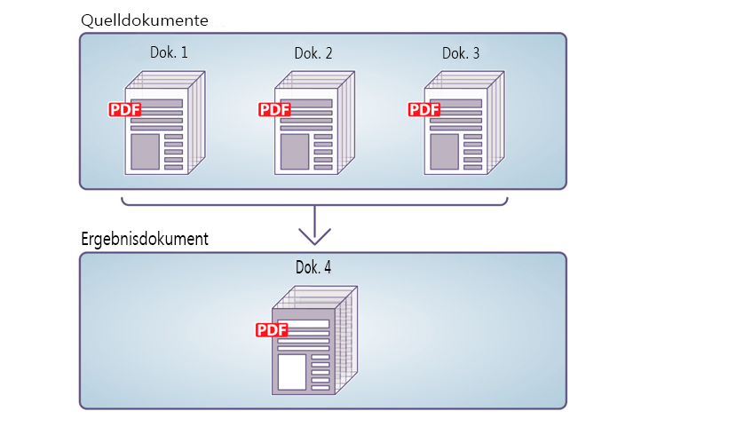
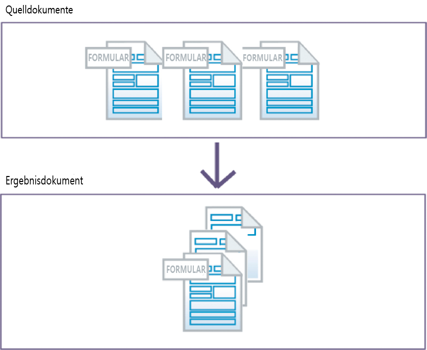
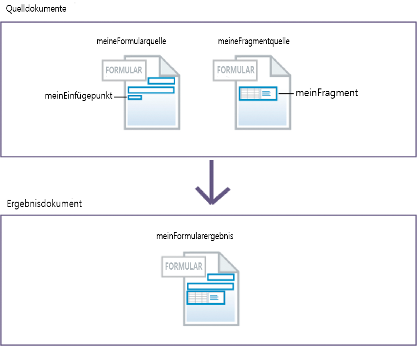
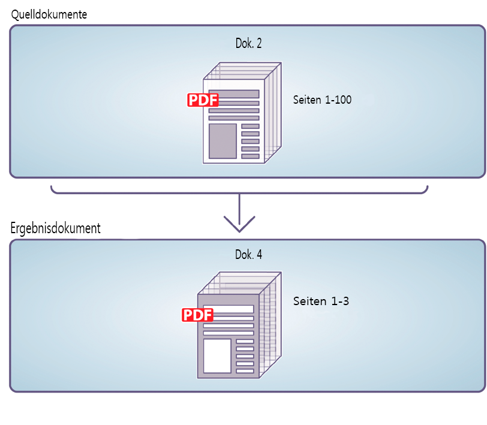
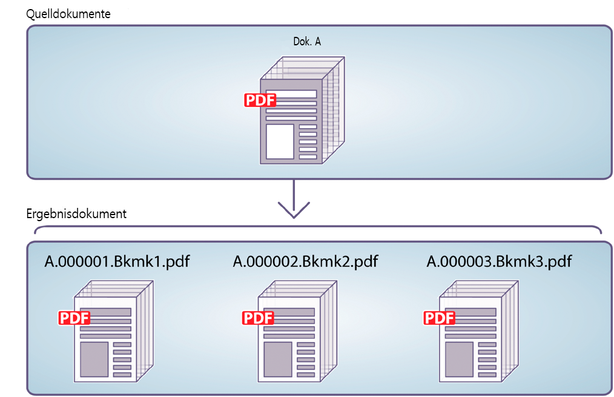

# Assembler-Dienst verwenden{#using-assembler-service}

Mit dem Assembler-Dienst können Sie PDF- und XDP-Dokumente kombinieren, neu anordnen und erweitern sowie Informationen zu PDF-Dokumenten erhalten. Jeder an den Assembler-Dienst übermittelte Auftrag umfasst ein DDX-Dokument (Document Description XML), Quelldokumente und externe Ressourcen (Zeichenfolgen und Grafiken). Weitere Informationen zum Assembler-Dienst finden Sie unter[ Übersicht über den Assembler-Dienst](../../forms/using/overview-aem-document-services.md#p-assembler-service-p).

Sie können den Assembler-Dienst für die folgenden Vorgänge verwenden:

## Zusammenführen von PDF-Dokumenten {#assemble-pdf-documents}

Mithilfe des Assembler-Dienstes können Sie mindestens zwei PDF-Dokumente in ein einziges PDF-Dokument oder PDF-Portfolio zusammenführen. Sie können dem PDF-Dokument auch Funktionen hinzufügen, die Navigation unterstützen oder die Sicherheit erhöhen. Im Folgenden finden Sie einige Möglichkeiten, wie Sie PDF-Dokumente zusammenführen können:

### Assemblieren eines einzelnen PDF-Dokuments {#assemble-a-simple-pdf-document}

Die folgende Abbildung zeigt, wie drei Quelldokumente zu einem einzelnen Zieldokument zusammengeführt werden.



Assemblieren eines einzelnen PDF-Dokuments aus mehreren PDF-Dokumenten

Das folgende Beispiel stellt ein einfaches DDX-Dokument dar, das zum Zusammenführen des Dokuments verwendet wird. Er gibt den Namen der Quelldokumente, mit deren Hilfe das Zieldokument generiert werden soll, sowie den Namen des Zieldokuments an.

```xml
<PDF result="Doc4">
<PDF source="Doc1"/>
<PDF source="Doc2"/>
<PDF source="Doc3"/>
</PDF>
```

Die Dokumentzusammenführung erzeugt ein Zieldokument, das den folgenden Inhalt enthält und\
Merkmale:

* Allen Quelldokumenten (vollständig oder teilweise).
* Lesezeichen aller Quelldokumente (vollständig oder teilweise), die für das zusammengeführte Zieldokument normalisiert wurden.
* Anderen aus dem Basisdokument (Doc1) übernommenen Merkmalen, einschließlich Metadaten, Seitenbeschriftungen und Seitengröße.
* Das Zieldokument enthält ein Inhaltsordner, das aus den Lesezeichen im Quelldokument erstellt wird.

### Erstellen eines PDF-Portfolios  {#create-a-pdf-portfolio}

Der Assembler-Dienst kann PDF-Portfolios erstellen, die eine Sammlung von Dokumenten und eine in sich geschlossene Benutzeroberfläche enthalten. Die Oberfläche wird als PDF-Portfolio-Layout oder als PDF-Portfolio-Navigator (Navigator) bezeichnet. PDF-Portfolios erweitern die Funktionen von PDF-Paketen durch Hinzufügen des Navigators, von Ordnern und Begrüßungsseiten. Die Oberfläche kann die Benutzererfahrung verbessern durch Nutzung von lokalisierten Textzeichenfolgen, benutzerdefinierten Farbschemas und grafischen Ressourcen. Das PDF-Portfolio kann außerdem Ordner zum Organisieren der Dateien im Portfolio enthalten.

Wenn der Assembler-Dienst das folgende DDX-Dokument interpretiert, führt er ein PDF-Portfolio zusammen, das einen PDF-Portfolio Navigator und ein Paket mit zwei Dateien enthält. Der Dienst ruft den Navigator von dem in der myNavigator-Quelle angegebenen Speicherort ab. Er ändert das standardmäßige Farbschema des Navigators in das pinkScheme-Farbschema.

```xml
<DDX xmlns="https://ns.adobe.com/DDX/1.0/">
<PDF result="Untitled 1">
<Portfolio>
<Navigator source="myNavigator"/>
<ColorScheme scheme="pinkScheme"/>
</Portfolio>
<PackageFiles>
<PDF source="sourcePDF1"/>
<PDF source="sourcePDF2"/>
</PackageFiles>
</PDF>
</DDX>
```

### Zusammenführen von verschlüsselten Dokumenten  {#assemble-encrypted-documents}

Beim Zusammenführen eines Dokuments kann das PDF-Dokument auch mit einem Kennwort verschlüsselt werden. Nachdem ein PDF-Dokument mit einem Kennwort verschlüsselt wurde, muss ein Benutzer das Kennwort angeben, damit das Dokument in Adobe Reader oder Acrobat angezeigt werden kann. Zum Verschlüsseln eines PDF-Dokuments mit einem Kennwort muss das DDX-Dokument encryption-Elementwerte enthalten, die für die Verschlüsselung eines PDF-Dokuments erforderlich sind.

Der Encryption-Dienst muss nicht Bestandteil Ihrer LiveCycle-Installation sein, um ein PDF-Dokument mit einem Kennwort verschlüsseln zu können.

Wenn mindestens eines der Eingabedokumente verschlüsselt ist, geben Sie zum Öffnen des Dokuments als Teil des DDX-Dokuments ein Kennwort an.

### Zusammenführen von Dokumenten mithilfe der Bates-Nummerierung  {#assemble-documents-using-bates-numbering}

Beim Zusammenführen eines Dokuments können Sie die Bates-Nummerierung verwenden, um für jede Seite einen eindeutigen Seitenbezeichner zu vergeben. Bei Verwendung der Bates-Nummerierung wird jeder Seite im Dokument (bzw. im Dokumentensatz) eine Zahl zugewiesen, die diese Seite eindeutig identifiziert. Beispielsweise Produktionsdokumente, die Materialaufstellungsinformationen enthalten und der Herstellung einer Baugruppe zugeordnet sind, können einen Bezeichner enthalten. Eine Bates-Nummer enthält einen sequenziell erhöhten numerischen Wert sowie ein optionales Präfix und Suffix. Die Abfolge „Präfix + numerischer Wert + Suffix“ wird als Bates-Musterbezeichnet.

Die folgende Illustration zeigt ein PDF-Dokument, das einen eindeutigen Bezeichner enthält, der sich in der Kopfzeile des Dokuments befindet.


Ein PDF-Dokument, das einen eindeutigen Bezeichner enthält, der sich in der Kopfzeile des Dokuments befindet

### Reduzieren und Zusammenführen von Dokumenten {#flatten-and-assemble-documents}

Mit dem Assembler-Dienst können Sie interaktive PDF-Dokumente (z. B. Formulare) in nicht interaktive PDF-Dokumente umwandeln. Interaktive PDF-Dokumente ermöglichen dem Benutzer, Daten in die PDF-Dokumentfelder einzugeben bzw. darin zu ändern. Die Umwandlung eines interaktiven PDF-Dokuments in ein nicht interaktives PDF-Dokument bezeichnet man als Reduzieren. Beim Reduzieren eines PDF-Dokuments behalten Formularfelder ihr grafisches Aussehen, sind aber nicht mehr interaktiv. Dies kann ein Grund dafür sein, PDF-Dokumente zu reduzieren. Darüber hinaus funktionieren den Feldern zugeordnete Skripte nicht mehr.

Wenn Sie ein PDF-Dokument erstellen, das aus interaktiven PDF-Dokumenten zusammengeführt wurde, reduziert der Assembler-Dienst diese Formulare, bevor er sie in dem Zieldokument zusammenführt.

>[!NOTE]
>
>Der Assembler-Dienst verwendet den Output-Dienst zum Reduzieren von dynamischen XFA-Formularen. Wenn der Assembler-Dienst eine DDX-Datei verarbeitet, die die Reduzierung eines dynamischen XFA-Formulars durch den Dienst erfordert, und der Output-Dienst nicht verfügbar ist, wird eine Ausnahme erzeugt. Der Assembler-Dienst kann ein Acrobat-Formular oder ein statisches XFA-Formular reduzieren, ohne den Output-Dienst zu verwenden.

## Zusammenführen von XDP-Dokumenten  {#assemble-xdp-documents}

Mithilfe des Assembler-Dienstes können Sie mehrere XDP-Dokumente in ein einziges XDP-Dokument oder in ein PDF-Dokument zusammenführen. Bei XDP-Quelldateien, die Einfügemarken enthalten, können Sie die einzufügenden Fragmente angeben.

Im Folgenden finden Sie einige Möglichkeiten, wie Sie XDP-Dokumente zusammenführen können:

### Assemblieren eines einzelnen XDP-Dokuments  {#assemble-a-simple-xdp-document}

Die folgende Abbildung zeigt, wie drei XDP-Quelldokumente zu einem einzelnen XDP-Zieldokument zusammengeführt werden. Das XDP-Zieldokument enthält drei XDP-Quelldokumente und die dazugehörigen Daten. Das Zieldokument ruft grundlegende Basisattribute von dem Basisdokument ab, bei dem es sich um das erste XDP-Quelldokument handelt.



Assemblieren eines einzelnen XDP-Dokuments aus mehreren XDP-Dokumenten

Nachfolgend finden Sie ein DDX-Dokument, das das oben gezeigte Ergebnis erzeugt.

```xml
<DDX xmlns="https://ns.adobe.com/DDX/1.0/">
<XDP result="MyXDPResult">
<XDP source="sourceXDP1"/>
<XDP source="sourceXDP2"/>
<XDP source="sourceXDP3"/>
</XDP>
</DDX>
```

### Auflösen von Verweisen während der Zusammenführung  {#resolving-references-during-assembly}

Normalerweise können XDP-Dokumente Bilder enthalten, auf die entweder durch absolute oder durch relative Verweise verwiesen wird. Der Assembler-Dienst behält standardmäßig die Verweise auf die referenzierten Bilder im resultierenden XDP-Dokument bei.

Sie können festlegen, wie der Assembler-Dienst die Bilder, auf die in den Quell-XDP-Dokumenten entweder durch absolute oder durch relative Verweise verwiesen wird, beim Zusammenführen in den XDP-Dateien verarbeitet. Sie können festlegen, dass alle Bilder im Endergebnis eingebettet werden, sodass es keine relativen oder absoluten Verweise enthält. Sie definieren dies, indem Sie den Wert des resolveAssets-Tags festlegen, das eine oder mehrere der folgenden Optionen annehmen kann. Standardmäßig werden keine Verweise im Ergebnisdokument aufgelöst.

<table>
 <tbody> 
  <tr> 
   <th>Wert</th> 
   <th>Beschreibung</th> 
  </tr> 
  <tr> 
   <td>keine</td> 
   <td>Löst keine Verweise auf.</td> 
  </tr> 
  <tr> 
   <td>alle</td> 
   <td>Bettet alle referenzierten Bilder im Quell-XDP-Dokument ein.</td> 
  </tr> 
  <tr> 
   <td>relative</td> 
   <td>Bettet alle Bilder, die durch relative Verweise referenziert werden, im Quell-XDP-<br />Dokument ein.</td> 
  </tr> 
  <tr> 
   <td>absolut oder</td> 
   <td>Bettet alle Bilder, die durch absolute Verweise referenziert werden, im Quell-XDP-<br />Dokument ein.</td> 
  </tr> 
 </tbody> 
</table>

Sie können den Wert des resolveAssets-Attributs entweder im XDP-Quell-Tag oder im Ergebnis-Tag des übergeordneten XDP-Elements angeben. Wenn das Attribut im XDP-Ergebnis-Tag angegeben ist, wird es von allen XDP-Quellelementen übernommen, die untergeordnete Objekte vom XDP-Ergebnis sind. Die explizite Angabe des Attributs für ein Quellelement überschreibt jedoch einzig die Einstellung des Ergebniselements für dieses Quelldokument.

#### Alle Quellverweise in einem XDP-Dokument auflösen  {#resolve-all-source-references-in-an-xdp-document}

Um alle Verweise in den Quell-XDP-Dokumenten aufzulösen, geben Sie das Attribut resolveAssets für die\
Zieldokument für alle, wie im Beispiel unten gezeigt:

```xml
<DDX xmlns="https://ns.adobe.com/DDX/1.0/">
<XDP result="result.xdp" resolveAssets="all">
<XDP source="input1.xdp" />
<XDP source="input2.xdp" />
<XDP source="input3.xdp" />
</XDP>
</DDX
```

Sie können auch das -Attribut für alle Quell-XDP-Dokumente unabhängig voneinander angeben, um dasselbe zu erhalten\
Ergebnis.

```xml
<DDX xmlns="https://ns.adobe.com/DDX/1.0/">
<XDP result="result.xdp">
<XDP source="input1.xdp" resolveAssets="all"/>
<XDP source="input2.xdp" resolveAssets="all"/>
<XDP source="input3.xdp" resolveAssets="all"/>
</XDP>
</DDX>
```

#### Auflösen ausgewählter Quellverweise in einem XDP-Dokument {#resolve-selected-source-references-in-an-xdp-document}

Sie können die Quellverweise selektiv angeben, die Sie auflösen möchten, indem Sie das Attribut resolveAssets für sie angeben. Die Attribute für einzelne Quelldokumente überschreiben die Einstellung des XDP-Ergebnisdokuments. In diesem Beispiel werden die enthaltenen Fragmente ebenfalls aufgelöst.

```xml
<DDX xmlns="https://ns.adobe.com/DDX/1.0/">
<XDP result="result.xdp" resolveAssets="all">
<XDP source="input1.xdp" >
<XDPContent source="fragment.xdp" insertionPoint="MyInsertionPoint"
fragment="myFragment"/>
</XDP>
<XDP source="input2.xdp" />
</XDP>
</DDX>
```

#### Selektives Auflösung absoluter oder relativer Verweise  {#selectively-resolve-absolute-or-relative-references}

Sie können die absoluten oder relativen Verweise in allen oder in einigen Quelldokumenten selektiv auflösen, wie im Beispiel unten dargestellt:

```xml
<DDX xmlns="https://ns.adobe.com/DDX/1.0/">
<XDP result="result.xdp" resolveAssets="absolute">
<XDP source="input1.xdp" />
<XDP source="input2.xdp" />
</XDP>
</DDX
```

### Dynamisches Einfügen von Formularfragmenten in ein XFA-Formular {#dynamically-insert-form-fragments-into-an-xfa-form}

Mit dem Assembler-Dienst können Sie ein XFA-Formular erstellen, das von einem anderen XFA-Formular, in das Fragmente eingefügt wurden, erstellt wurde. Mithilfe dieser Funktion können Sie Fragmente zum Erstellen mehrerer Formulare verwenden.

Unterstützung für dynamisches Einfügen von Formularfragmenten unterstützt die Steuerung durch eine Quelle. Sie verwalten eine einzige Quelle von häufig verwendeten Komponenten. Sie können beispielsweise ein Fragment für Ihr Firmenbanner erstellen. Wenn sich das Banner ändert, müssen Sie nur das Fragment ändern. Die anderen Formulare, die das Fragment enthalten, bleiben unverändert.

Formularentwickler verwenden LiveCycle Designer zum Erstellen von Formularfragmenten. Diese Fragmente sind Unterformulare mit eindeutigen Namen innerhalb eines XFA-Formulars. Formularentwickler verwenden Designer auch zum Erstellen von XFA-Formularen, die über Einfügemarken mit eindeutigem Namen verfügen. Sie (der Programmierer) schreiben DDX-Dokumente, die angeben, wie Fragmente in das XFA-Formular eingefügt werden.

Die folgende Abbildung zeigt zwei XML-Formulare (XFA-Vorlagen). Das Formular auf der linken Seite enthält eine Einfügemarke mit dem Namen myInsertionPoint. Das Formular auf der rechten Seite enthält ein Fragment mit dem Namen myFragment.



Einfügen von Formularfragmenten in ein XFA-Formular

Wenn der Assembler-Dienst das folgende DDX-Dokument interpretiert, erstellt er ein XML-Formular, das ein anderes XML-Formular enthält. Das myFragment-Unterformular aus dem myFragmentSource-Dokument wird an der Einfügemarke myInsertionPoint in dem Dokument myFormSource eingefügt.

```xml
<DDX xmlns="https://ns.adobe.com/DDX/1.0/">
<XDP result="myFormResult">
<XDP source="myFormSource">
<XDPContent fragment="myFragment" insertionPoint="myInsertionPoint"
source="myFragmentSource"/>
</XDP>
</XDP>
</DDX
```

### Verpacken eines XDP-Dokuments als PDF  {#package-an-xdp-document-as-pdf}

Mithilfe des Assembler-Dienstes können Sie ein XDP-Dokument als PDF-Dokument packen, wie in diesem DDX-Dokument gezeigt.

```xml
<DDX xmlns="https://ns.adobe.com/DDX/1.0/">
<PDF result="Untitled 1" encryption="passEncProfile1">
<XDP>
<XDP source="sourceXDP3"/>
<XDP source="sourceXDP4"/>
</XDP>
</PDF>
</DDX>
```

## Aufteilen von PDF-Dokumenten  {#disassemble-pdf-documents}

Mit dem Assembler-Dienst können Sie PDF-Dokumente aufteilen. Der Dienst kann Seiten aus dem Quelldokument extrahieren oder ein Quelldokument basierend auf Lesezeichen aufteilen. Diese Aufgabe ist normalerweise hilfreich, wenn das PDF-Dokument ursprünglich aus vielen Einzeldokumenten erstellt wurde, wie z. B. einer Sammlung von Aussagen.

### Extrahieren von Seiten aus einem Quelldokument  {#extract-pages-from-a-source-document}

In den folgenden Abbildungen werden die Seiten 1 bis 3 aus dem Quelldokument extrahiert und in einem neuen Zieldokument abgelegt.



Extrahieren von bestimmten Seiten aus einem Quelldokument

Das folgende Beispiel stellt ein DDX-Dokument dar, das zum Aufteilen des Dokuments verwendet wird.

```xml
<PDF result="Doc4">
<PDF source="Doc2" pages="1-3"/>
</PDF>
```

### Aufteilen eines Quelldokuments basierend auf Lesezeichen  {#divide-a-source-document-based-on-bookmarks}

In der folgenden Abbildung wird DocA in mehrere Zieldokumente aufgeteilt. Dabei gibt das erste Lesezeichen auf Ebene 1 auf einer Seite den Anfang eines neuen Zieldokuments an.



Aufteilen eines Quelldokuments in mehrere Dokumente basierend auf Lesezeichen

Das folgende Beispiel stellt ein DDX-Dokument dar, das zum Aufteilen eines Quelldokuments Lesezeichen verwendet.

```xml
<PDFsFromBookmarks prefix="A">
<PDF source="DocA"/>
</PDFsFromBookmarks>
```

## Bestimmen der PDF/A-Kompatibilität von Dokumenten  {#determine-whether-documents-are-pdf-a-compliant}

Mit dem Assembler-Dienst können Sie ermitteln, ob ein PDF-Dokument PDF/A-kompatibel ist. PDF/A ist ein Archivierungsformat für die langfristige Speicherung von Dokumentinhalten.  Die Schriftarten werden im Dokument eingebettet und die Datei bleibt unkomprimiert. PDF/A-Dokumente sind daher in der Regel größer als normale PDF-Dokumente. Außerdem enthalten PDF/A-Dokumente keine Audio- und Videoinhalte.

## Abrufen von Informationen zu PDF-Dokumenten  {#obtain-information-about-a-pdf-document}

Mit dem Assembler-Dienst können Sie die folgenden Informationen über PDF-Dokumente abrufen:

* Textinformationen.

   * Wörter auf jeder Seite des Dokuments
   * Position jedes Wortes auf jeder Seite des Dokuments
   * Sätze in jedem Absatz auf jeder Seite des Dokuments

* Lesezeichen, einschließlich der Seitenanzahl, des Titels, Ziels und Erscheinung. Sie können dies exportieren\
   Daten aus einem PDF-Dokument und importieren Sie es in ein PDF-Dokument.

* Dateianlagen, einschließlich Dateiinformationen. Bei Anlagen auf Seitenebene enthält er auch die\
   Speicherort der Dateianlageanmerkung. Sie können diese Daten aus einem PDF-Dokument exportieren und\
   in ein PDF-Dokument importieren.

* Paketdateien, einschließlich Dateiinformationen, Ordner-, Paket-, Schema- und Felddaten. Sie können diese Daten aus einem PDF-Dokument exportieren und in ein PDF-Dokument importieren.

## Überprüfen von DDX-Dokumenten  {#validate-ddx-documents}

Mit dem Assembler-Dienst können Sie ermitteln, ob ein DDX-Dokument gültig ist. Wenn Sie beispielsweise von einer früheren Version von LiveCycle aktualisiert haben, stellt die Überprüfung sicher, dass Ihr DDX-Dokument gültig ist.

## Andere Dienste aufrufen  {#call-other-services}

Sie können DDX-Dokumente verwenden, die dazu führen, dass der Assembler-Dienst die folgenden LiveCycle-Dienste aufruft. Der Assembler-Dienst kann nur die mit LiveCycle installierten Dienste aufrufen.

**Reader Extensions-Dienst**: Ermöglicht dem Adobe Reader-Benutzer, das erstellte PDF-Dokument mit einer digitalen Signatur zu versehen.

**Forms-Dienst**: Führt eine XDP-Datei und eine XML-Datendatei zusammen, um ein PDF-Dokument zu erstellen, das das ausgefüllte interaktive Formular enthält.

**Output-Dienst**: Konvertiert ein dynamisches XML-Formular in ein PDF-Dokument, das ein nicht interaktives Formular enthält (reduziert das Formular). Der Assembler-Dienst reduziert statische XML-Formulare und Acrobat-Formulare, ohne den Output-Dienst aufzurufen.

```xml
<?xml version="1.0" encoding="UTF-8"?>
<DDX xmlns="https://ns.adobe.com/DDX/1.0/">
<PDF result="outDoc">
<PDF source="doc1"/>
<PDF source="doc2"/>
<ReaderRights
credentialAlias="LCESCred"
digitalSignatures="true"/>
</PDF>
</DDX>
```

Die Verwendung von DDX und dem Assembler-Dienst zum Aufrufen anderer LiveCycle-Dienste kann Ihr Prozessdiagramm vereinfachen. Sie können sogar die Zeit und die Arbeit reduzieren, die Sie für das Anpassen Ihrer Workflows aufwenden. (Siehe auch
