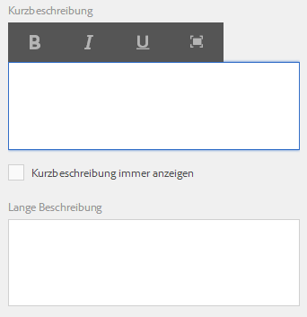
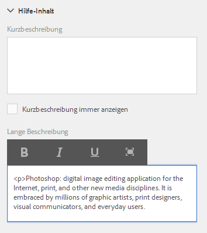
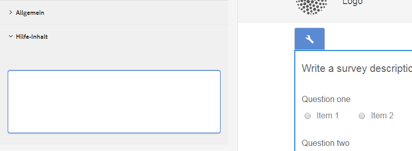

# Verfassen von kontextsensitiver Hilfe für Formularfelder{#authoring-in-context-help-for-form-fields}

 Adobe empfiehlt, die modernen und erweiterbaren [Kernkomponenten](https://experienceleague.adobe.com/docs/experience-manager-core-components/using/adaptive-forms/introduction.html?lang=de) zur Datenerfassung zu verwenden, um [neue adaptive Formulare zu erstellen](/help/forms/using/create-an-adaptive-form-core-components.md) oder [adaptive Formulare zu AEM Sites-Seiten hinzuzufügen](/help/forms/using/create-or-add-an-adaptive-form-to-aem-sites-page.md). Diese Komponenten stellen einen bedeutenden Fortschritt bei der Erstellung adaptiver Formulare dar und sorgen für beeindruckende Anwendererlebnisse. In diesem Artikel wird der ältere Ansatz zum Erstellen adaptiver Formulare mithilfe von Foundation-Komponenten beschrieben. 

## Einführung {#introduction}

Es gibt Situationen, in denen sich Endbenutzer, die ein Formular ausfüllen, nicht sicher sind, wie Informationen in ein bestimmtes Formularfeld einzugeben sind. Für solche Fälle bieten adaptive Formulare die Möglichkeit, Text oder dynamische kontextbezogene Hilfe zu einem Formularfeld hinzuzufügen. Dadurch werden das Ausfüllen des Formulars erleichtert und potenzielle Uneindeutigkeiten für Endbenutzende vermieden.

Dieser Artikel erläutert, wie Autorinnen und Autoren von Formularen kontextbezogene Hilfe beim Erstellen adaptiver Formulare hinzufügen können.

## Hinzufügen kontextbezogener Hilfe {#add-in-context-help}

Sie können kontextbezogene Hilfe mit den folgenden Optionen im Abschnitt „Hilfeinhalt“ der Registerkarte „Eigenschaften“ in der Seitenleiste angeben.

* [Kurzbeschreibung](../../forms/using/authoring-in-field-help.md#p-short-description-p)
* [Lange Beschreibung](../../forms/using/authoring-in-field-help.md#p-long-description-p)

>[!NOTE]
>
>Die lange Beschreibung überschreibt die Kurzbeschreibung. Wenn Sie beide Optionen angegeben haben, wird nur die lange Beschreibung angezeigt.

### Kurzbeschreibung {#short-description}

Das Feld „Kurzbeschreibung“ ermöglicht die Angabe schneller und kurzer Hinweise zum Ausfüllen eines Formularfelds. Der im Feld „Kurzbeschreibung“ eingegebene Text wird beim Bewegen des Mauszeigers über das Feld als QuickInfo angezeigt.

>[!NOTE]
>
>Wählen Sie **Kurzbeschreibung immer anzeigen** aus, um den Hilfetext unterhalb des Felds immer anzuzeigen.

### Lange Beschreibung {#long-description}

Sie können das Feld „Lange Beschreibung“ verwenden, um langen Text anzugeben oder Rich-Media-Inhalte (einschließlich Videos) als kontextbezogene Hilfe einzubetten. Beispiel: Das folgende Bild zeigt, wie Sie ein Video als kontextbezogene Hilfe einbetten können.

Wenn Sie eine lange Beschreibung hinzufügen, wird das Symbol **?** neben dem Feld angezeigt. Durch Klicken auf dieses Symbol wird der Inhalt angezeigt, der im Abschnitt „Lange Beschreibung“ hinzugefügt wurde.

### Hilfe auf Bereichsebene {#panel-level-help}

Zusätzlich zur kontextbezogenen Hilfe für Formularfelder können Sie auf der Registerkarte „Hilfeinhalt“ des Dialogfelds zum Bearbeiten von Bereichen auch Hilfe auf Bereichsebene angeben.

Wenn Sie Hilfe für ein Panel hinzufügen, wird das Symbol **?** neben der Beschreibung des Panels angezeigt. Durch Klicken auf das Symbol wird der Inhalt angezeigt, der im Abschnitt „Hilfeinhalt“ des Dialogfelds zur Bearbeitung des Panels hinzugefügt wurde.

