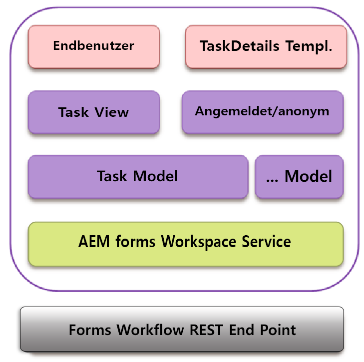

# Interaktion mit Backbone{#backbone-interaction}

Backbone ist eine Bibliothek, die beim Erstellen und Befolgen der MVC-Architektur in Web-Anwendungen hilft. Die Grundidee von Backbone besteht darin, Ihre Oberfläche in logischen Ansichten zu organisieren, die von Modellen gestützt werden und bei Änderungen des Modells unabhängig aktualisiert werden können, ohne dass die Seite neu gezeichnet werden muss. Weitere Informationen zu Backbone finden Sie unter [https://backbonejs.org](https://backbonejs.org/).

Einige Hauptkonzepte sind die folgenden:

**Backbone-Modell**: Enthält Daten und die meiste mit diesen Daten verknüpfte Logik.

**Backbone-Ansicht**: Wird verwendet, um den Status des jeweiligen Modells darzustellen. Eine Backbone-Ansicht verhält sich im Prinzip wie ein Controller, der Benutzeroberflächenereignisse wie Benutzerklicks oder Modellereignisse (wie Datenänderungen) erfasst und die Benutzeroberfläche entsprechend ändert.

**HTML-Vorlage**: Eine Wrapper-Vorlage mit Platzhaltern, die durch das Modell gefüllt werden.

**AEM Forms-Arbeitsbereich**: Enthält mehrere einzelne Komponenten. Jede Komponente:

* stellt ein einzelnes logisches Benutzeroberflächenelement dar.
* kann eine Sammlung ähnlicher Komponenten sein.
* besteht aus einem Backbone-Modell, einer Backbone-Ansicht und einer HTML-Vorlage.
* enthält einen Verweis auf einen Dienst.
* enthält einen Verweis auf erforderliche Dienstprogramme.

Wenn eine Komponente initialisiert wird, werden die folgenden Objekte erstellt:

* Eine neue Instanz des Backbone-Modells für die Komponente wird erstellt. Der Dienst wird in das Modell eingefügt.
* Eine neue Instanz der Backbone-Ansicht wird erstellt.
* Die Instanz des entsprechenden Modells, der HTML-Vorlage und der Dienstprogramme werden in die Ansicht eingefügt.

In der Backbone-Ansicht gibt es eine Ereigniszuordnung, die die verschiedenen Ereignisse zuordnet, die aufgrund von Benutzeroberflächeninteraktionen mit einem entsprechenden Handler auftreten können. Diese Zuordnung wird initialisiert, sobald eine Komponente initialisiert wurde.

Wenn eine Ansicht initialisiert wird, ruft die Ansicht das entsprechende Modell auf, um Daten vom Server abzurufen. Nachdem alle für eine Ansicht erforderlich Daten verfügbar sind, gibt die Ansicht die Daten in dem Format wieder, das in der HTML-Vorlage angegeben ist. Mehrere Ansichten können dasselbe Modell für die Kommunikation nutzen.

Ein Beispiel:

1. Die Benutzerin bzw. der Benutzer klickt auf eine Aufgabenvorlage in der Aufgabenliste.
1. Die Aufgabenansicht lauscht auf den Klick und ruft die Render-Funktion im Aufgabenmodell auf.
1. Das Task-Modell ruft daraufhin den Service auf, der ein gemeinsamer Punkt für die gesamte Kommunikation mit dem AEM Forms-Server ist.
1. Die Service-Klasse ruft den AEM Forms-REST-Endpunkt für die Render-Methode über Ajax auf.
1. Der Erfolgsrückruf für diesen Ajax-Aufruf wird im Aufgabenmodell definiert.
1. Das Aufgabenmodell löst ein Backbone-Ereignis als Benachrichtigung aus, dass der Render-Aufruf abgeschlossen ist.
1. Eine andere Ansicht, die Aufgabendetailansicht, lauscht auf dieses Ereignis aus dem Aufgabenmodell.
1. Die Ansicht „Aufgabendetails“ ändert dann die Vorlage „Aufgabendetails“, um die gerenderte Aufgabe (Formular, Details, Anhänge, Notizen usw.) für die Benutzerin bzw. den Benutzer anzuzeigen.
