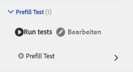

# Automatisieren von Tests von adaptiven Formularen{#automate-testing-of-adaptive-forms}

## Überblick {#overview}

Adaptive Formulare sind für die Interaktion mit Ihren Kunden von wesentlicher Bedeutung. Es ist wichtig, dass Sie Ihre adaptiven Formulare mit jeder Änderung testen, die Sie daran vornehmen, z. B. beim Rollout eines neuen Fixpack oder beim Ändern einer Regel im Formular. Allerdings kann das funktionelle Testen adaptiver Formen und jedes Feld in ihnen mühsam sein.

Calvin ermöglicht es Ihnen das automatische Testen der adaptiven Formulare im Webbrowser. Calvin utilizes [Hobbes](/help/sites-developing/hobbes.md)&#39;s user interface for running the tests and provides the following tools:

* Ein JavaScript-API für die Erstellung von Tests.
* Eine Benutzeroberfläche für das Ausführen von Tests.

Mit Calvin können Sie Testfälle in CRXDE erstellen und UI-Tests direkt im Webbrowser ausführen, um Ihre adaptiven Formulare gründlich zu testen.

<table>
 <tbody>
  <tr>
   <td><strong>Zu testende adaptiver Formularaspekte </strong></td>
   <td><strong>Beschreibung</strong></td>
  </tr>
  <tr>
   <td>Befüllen eines adaptiven Formulars</td>
   <td>
    <ul>
     <li>Wird das Formular erwartungsgemäß auf der Grundlage des Datenmodells befüllt?</li>
     <li>Werden die Vorschlagswerte von Formularobjekten erwartungsgemäß befüllt?</li>
    </ul> </td>
  </tr>
  <tr>
   <td>Senden Sie eines adaptiven Formulars</td>
   <td>
    <ul>
     <li>Werden bei der Übermittlung korrekte Daten generiert?</li>
     <li>Wird das Formular während des Sendens auf dem Server erneut validiert?</li>
     <li>Ist die Sendeaktion für das ausgeführte Formular konfiguriert?</li>
    </ul> </td>
  </tr>
  <tr>
   <td><p>Ausdrucksregeln</p> <p> </p> </td>
   <td>
    <ul>
     <li>Werden die mit Formularobjekten verknüpften Ausdrücke, wie z. B. rechnen, sichtbar machen, Skripte ausführen, nachdem ein Feld geschlossen wurde, ausgeführt, nachdem die entsprechenden UI-Vorgänge ausgeführt wurden?<br />  </li>
    </ul> </td>
  </tr>
  <tr>
   <td>Validierungen</td>
   <td>
    <ul>
     <li>Werden Feldvalidierungen nach Durchführung des Vorgang erwartungsgemäß ausgeführt?</li>
    </ul> </td>
  </tr>
  <tr>
   <td><p>Verzögertes Laden</p> <p> </p> </td>
   <td>
    <ul>
     <li>Wird beim Klicken Sie auf (oder auf ein Navigationselement eines Bereichs) der HTML-Code vom Server abgerufen, wie es in der Konfiguration für das langsame Laden der Dateien vorgesehen ist?</li>
    </ul></td>
  </tr>
  <tr>
   <td><p>UI-Interaktion</p> </td>
   <td>
    <ul>
     <li><a href="https://helpx.adobe.com/aem-forms/6-3/calvin-sdk-javascript-api/calvin.html#toc2__anchor" target="_blank">Testen von UI-Interaktion mit adaptiven Formularobjekten </a></li>
    </ul> </td>
  </tr>
 </tbody>
</table>

### Voraussetzungen {#prerequisites}

Bevor Sie diesen Artikel verwenden, um Ihre Testfälle zu erstellen, müssen Sie Folgendes wissen:

* Creating test suites and executing test cases using [Hobbes](https://docs.adobe.com/docs/en/aem/6-3/develop/components/hobbes.html)
* [Hobbes-Javascript-APIs](https://docs.adobe.com/docs/en/aem/6-2/develop/ref/test-api/index.html)
* [Calvin JavaScript-APIs](https://helpx.adobe.com/aem-forms/6-3/calvin-sdk-javascript-api/calvin.html)

## Beispiel: Erstellen Sie einen Test für ein adaptives Formular mit Hobbes als Tests-Rahmen {#example-create-a-test-suite-for-an-adaptive-form-using-hobbes-as-testing-framework}

Das folgende Beispiel führt Sie durch die Erstellung eines Testfalls zum Testen mehrerer adaptiver Formulare. Sie müssen einen separaten Testfall für jedes Formular erstellen, das Sie testen wollen. Wenn Sie die folgenden Schritte befolgen und den JavaScript-Code in Schritt 11 ändern, können Sie Ihre eigenen Testfälle erstellen, um Ihre adaptiven Formulare zu testen.

1. Go to CRXDE Lite in your web browser: `https://[server]:[port]/crx/de`.
1. Klicken Sie mit der rechten Maustaste auf den Unterordner /etc/clientlibs und dann auf **Erstellen** > **Knoten erstellen**. Geben Sie einen Namen (hier afTestRegistration) ein, geben Sie die Art des Knotens als cq:ClientLibraryFolder ein und klicken Sie auf **OK.** 

   Der Ordner „clientlibs“ enthält den Ausrichtungsaspekt Ihrer Anwendung (JS und Init). Es wird empfohlen, dass Sie alle Hobbes Test-Objekte, die für ein Formular spezifisch sind, im Clientlibs-Ordner registrieren.

1. Geben Sie folgende Werte im neu erstellten Knoten (hier afTestRegistration) ein und klicken Sie auf **Alle speichern**. Diese Eigenschaften helfen Hobbes dabei, den Ordner als Test zu erkennen. Um diese Client-Bibliothek als Abhängigkeit in anderen Client-Bibliotheken wiederzuverwenden, benennen Sie sie granite.testing.calvin.tests.

<table>
 <tbody>
  <tr>
   <td>Eigenschaft</td>
   <td>Typ</td>
   <td>Wert</td>
  </tr>
  <tr>
   <td><p>categories</p> </td>
   <td><p>Zeichenfolge[]</p> </td>
   <td><p>granite.testing.hobbes.tests, granite.testing.calvin.tests</p> </td>
  </tr>
  <tr>
   <td><p>dependencies</p> </td>
   <td><p>Zeichenfolge[]</p> </td>
   <td><p>granite.testing.hobbes.testrunner, granite.testing.calvin, apps.testframework.all</p> </td>
  </tr>
 </tbody>
</table>

>[!NOTE]
>
>Die granite.testing.calvin.af-clientlib enthält alle adaptiven Formular-APIs. Diese APIs sind Teil des Calvin-namespace.


1. Right-click the test node (here **afTestRegistration)** and then click **Create** > **Create File**. Nennen Sie die Datei js.txt und klicken Sie auf **OK**.
1. In der js.txt-Datei fügen Sie den folgenden Text ein:

   ```
   #base=.
   js.txt
   ```

1. Klicken Sie auf **Alle speichern** und schließen Sie dann die Datei js.txt.
1. Right-click the test node (here **afTestRegistration)** and click **Create** > **Create File**. Nennen Sie die Datei init.js und klicken Sie auf **OK**.
1. Copy the following code to the init.js file and click **Save All**:

   ```
   (function(window, hobs) {
       'use strict';
       window.testsuites = window.testsuites || {};
     // Registering the test form suite to the sytem
     // If there are other forms, all registration should be done here
       window.testsuites.testForm = new hobs.TestSuite("Adaptive Form - Demo Test", {
           path: '/etc/clientlibs/afTestRegistration/init.js',
           register: true
       });
    // window.testsuites.testForm1 = new hobs.TestSuite("testForm1");
   }(window, window.hobs));
   ```

   Der obige Code erstellt Testfälle, die **Adaptives Formular- Demo Test** heißen. Um Testfälle mit einem anderen Namen anzulegen, ändern Sie den Namen entsprechend.

1. Klicken Sie auf **Erstellen** >**Knoten erstellen**, um einen Knoten unter dem clientlib-Ordner für jedes Formular zu erstellen, das Sie testen möchten. This example uses a node named **testForm** to test an adaptive form named **testForm**.  Legen Sie die folgenden Eigenschaften fest und klicken Sie auf **OK**:

   * Name: testForm (Ihr Formularname)
   * Typ: cq:ClientLibraryFolder

1. Fügen Sie die folgenden Eigenschaften zum Testen eines adaptiven Formulars zum neu erstellten Knoten (hier &quot;testForm&quot;) hinzu:

   | **Eigenschaft** | **Typ** | **Wert** |
   |---|---|---|
   | categories | Zeichenfolge[] | granite.testing.hobbes.tests, granite.testing.hobbes.tests.testForm |
   | dependencies | Zeichenfolge[] | granite.testing.calvin.tests |

   >[!NOTE]
   >
   >In diesem Beispiel wird eine Abhängigkeit von der Client-lib-Granite.testing.calvin.tests verwendet, um eine bessere Verwaltung zu gewährleisten. Dieses Beispiel fügt auch eine Client-Lib-Kategorie, „granite.testing.hobbes.tests.testForm“ hinzu, um diese Client-Lib, falls erforderlich, wiederzuverwenden.

   

1. Klicken Sie mit der rechten Maustaste auf den Ordner, den Sie für das Testformular (hier testForm) erstellt haben und wählen Sie **Erstellen** > **Datei erstellen**. Nennen Sie die Datei scriptingTest.js und fügen Sie den folgenden Code zur Datei hinzu und klicken Sie auf **Alle speichern**.

   Um den folgenden Code zum Testen eines anderen adaptiven Formulars zu verwenden, ändern Sie den Pfad und den Namen des Formulars in **navigateTo** (Zeilen 11, 36 und 62) und die entsprechenden Testfälle. For more information on APIs for testing different aspects of forms and form objects, see [Calvin APIs](https://helpx.adobe.com/aem-forms/6-3/calvin-sdk-javascript-api/calvin.html).

   ```
   (function(window, hobs) {
       'use strict';
   
    var ts = new hobs.TestSuite("Script Test", {
           path: '/etc/clientlibs/testForm/scriptingTest.js',
     register: false
    })
   
       .addTestCase(new hobs.TestCase("Checking execution of calculate script")
           // navigate to the testForm which is to be tested
           .navigateTo("/content/forms/af/testForm.html?wcmmode=disabled")
           // check if adaptive form is loaded
           .asserts.isTrue(function () {
               return calvin.isFormLoaded()
           })
           .execSyncFct(function () {
               // create a spy before checking for the expression
               calvin.spyOnExpression("panel1.textbox1");
               // setValue would trigger enter, set the value and exit from the field
               calvin.setValueInDOM("panel1.textbox", "5");
           })
           // if the calculate expression was setting "textbox1" value to "5", let's also check that
           .asserts.isTrue(function () {
               return calvin.isExpressionExecuted("panel1.textbox1", "Calculate");
           })
           .execSyncFct(function () {
               calvin.destroySpyOnExpression("panel1.textbox1");
           })
           .asserts.isTrue(function () {
               return calvin.model("panel1.textbox1").value == "5"
           })
       )
   
       .addTestCase(new hobs.TestCase("Calculate script Test")
           // navigate to the testForm which is to be tested
           .navigateTo("/content/forms/af/cal/demoform.html?wcmmode=disabled&dataRef=crx:///content/forms/af/cal/prefill.xml")
           // check if adaptive form is loaded
           .asserts.isTrue(function () {
               return calvin.isFormLoaded()
           })
   
           .execSyncFct(function () {
               // create a spy before checking for the expression
               calvin.spyOnExpression("panel2.panel1488218690733.downPayment");
               // setValue would trigger enter, set the value and exit from the field
               calvin.setValueInDOM("panel2.panel1488218690733.priceProperty", "1000000");
           })
           .asserts.isTrue(function () {
               return calvin.isExpressionExecuted("panel2.panel1488218690733.downPayment", "Calculate");
           })
           .execSyncFct(function () {
               calvin.destroySpyOnExpression("panel2.panel1488218690733.downPayment");
           })
           .asserts.isTrue(function () {
               // if the calculate expression was setting "downPayment" value to "10000", let's also check that
      return calvin.model("panel2.panel1488218690733.downPayment").value == 10000
           })
       )
   
       .addTestCase(new hobs.TestCase("Checking execution of Value commit script")
           // navigate to the testForm which is to be tested
           .navigateTo("/content/forms/af/cal/demoform.html?wcmmode=disabled&dataRef=crx:///content/forms/af/cal/prefill.xml")
           // check if adaptive form is loaded
           .asserts.isTrue(function () {
               return calvin.isFormLoaded()
           })
   
           .execSyncFct(function () {
               // create a spy before checking for the expression
               calvin.spyOnExpression("panel2.panel1488218690733.priceProperty");
               // setValue would trigger enter, set the value and exit from the field
               calvin.setValueInDOM("panel2.panel1488218690733.priceProperty", "100");
           })
           .asserts.isTrue(function () {
               return calvin.isExpressionExecuted("panel2.panel1488218690733.priceProperty", "Value Commit");
           })
           .execSyncFct(function () {
               calvin.destroySpyOnExpression("panel2.panel1488218690733.priceProperty");
           })
           .asserts.isTrue(function () {
            // if the value commit expression was setting "textbox1488215618594" value to "0", let's also check that
               return calvin.model("panel2.panel1488218690733.textbox1488215618594").value == 0
           })
       );
   
    // register the test suite with testForm
     window.testsuites.testForm.add(ts);
   
    }(window, window.hobs));
   ```

   Der Testfall wird erstellt. Führen Sie den Testfall aus, um adaptive Formulare über Hobbes zu testen. For steps for running the test cases, see [Executing Tests in Testing Your UI Using Automated Tests](/help/sites-developing/hobbes.md).

Sie können das Paket auch in der angehängten Datei SampleTestPackage.zip installieren, um dieselben Ergebnisse zu erzielen wie im Beispiel: Erstellen einer Testsuite für ein adaptives Formular mit Hobbes als Testrahmen.

[Datei laden](assets/sampletestpackage.zip)

## Testen der UI mit automatisierten Tests {#testing-your-ui-using-automated-tests}

### Ausführen einer einzelnen Test-Suite {#running-a-single-test-suite}

Test-Suites können einzeln ausgeführt werden. Wenn Sie eine Test-Suite ausführen, ändert sich die Seite, während die Testfälle und ihre Aktion ausgeführt werden, und die Ergebnisse werden nach dem Abschluss des Tests angezeigt. Symbole zeigen die Ergebnisse an.

Das Häkchen-Symbol kennzeichnet einen erfolgreichen Test: 

An &quot;X&quot; icon indicates a failed test: 

So führen Sie eine Test-Suite aus:

1. Klicken oder tippen Sie im Testfeld auf den Namen des Testfalls, den Sie ausführen möchten, um die Details zu den Aktionen anzuzeigen.

   

1. Klicken Sie auf oder tippen Sie auf die Schaltfläche Tests ausführen. 

   

1. Der Platzhalter wird durch Seiteninhalte ersetzt, wenn der Test ausgeführt wird.

   

1. Um die Ergebnisse des Testfalls anzuzeigen, tippen oder klicken Sie auf die Beschreibung, um das Feld Ergebnis zu öffnen. Wenn Sie im Feld Ergebnis auf den Namen des Testfalls tippen oder klicken, werden alle Details angezeigt.

   

Die Schritte zum Testen Ihrer adaptiven AEM-Formulare sind ähnlich den Schritten zum Testen Ihrer AEM-Benutzeroberfläche. Weitere Informationen zum Testen der adaptiven Formulare finden Sie unter den folgenden Themen [Benutzeroberfläche testen](https://helpx.adobe.com//experience-manager/6-3/help/sites-developing/hobbes.html):

* Anzeigen von Test-Suites
* Ausführen mehrerer Tests

## Glossar   {#glossary}

<table>
 <tbody>
  <tr>
   <td><strong>Term</strong></td>
   <td><strong>Beschreibung</strong></td>
  </tr>
  <tr>
   <td><p>Testsuite</p> </td>
   <td><p>Eine Testsuite ist eine Sammlung zusammengehöriger Testfälle.</p> </td>
  </tr>
  <tr>
   <td><p>Testfall</p> </td>
   <td><p>Ein Testfall stellt eine Aufgabe dar, die ein Benutzer mithilfe der Benutzeroberfläche ausführt. Fügen Sie Testfälle zu Ihrer Testsuite hinzu, um die Aktivitäten zu testen, die Benutzer ausführen.</p> </td>
  </tr>
  <tr>
   <td><p>Aktionen</p> </td>
   <td><p>Aktionen sind Methoden, die eine Geste auf der Benutzeroberfläche ausführen, wie z. B. das Klicken auf eine Schaltfläche oder das Füllen eines Eingabefeldes mit einem Wert.</p> <p>Die Methoden der Klassen hobs.actions.Assets, hobs.actions.Core und hobs.utils.af sind Aktionen, die Sie in Ihren Tests verwenden können. Alle Aktionen werden synchron ausgeführt.</p> </td>
  </tr>
  <tr>
   <td><p>Autoren- oder Veröffentlichungsumgebung</p> </td>
   <td><p>Im Allgemeinen können Formulare entweder im Autoren- oder im Veröffentlichungsumgebung getestet werden. Im Falle der Veröffentlichungsumgebung ist der Zugriff auf die Testausführung standardmäßig eingeschränkt. Dies liegt daran, dass alle Client-Bibliotheken, die mit dem Test-Runner in Verbindung stehen, innerhalb der /libs in der JCR-Struktur liegen.</p> </td>
  </tr>
 </tbody>
</table>

