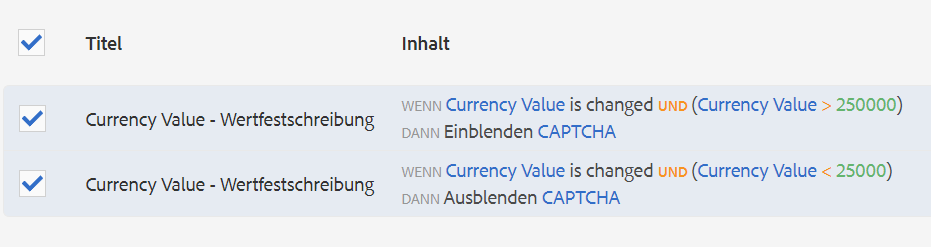

# Verwenden von CAPTCHA in adaptiven Formularen{#using-captcha-in-adaptive-forms}

CAPTCHA („Completely Automated Public Turing test to tell Computers and Humans Apart“ - „vollautomatischer öffentlicher Turing-Test zur Unterscheidung von Computern und Menschen“) ist ein Programm, das in Online-Transaktionen eingesetzt wird, um zwischen Personen oder Bots und automatisierten Programmen zu unterscheiden. Es bewertet die Benutzerantwort, um zu ermitteln, ob ein Mensch oder ein Bot mit der Website interagiert. Es verhindert, dass der Benutzer fortfährt, wenn der Test fehlschlägt, und macht Online-Transaktionen sicherer, weil Bots so keinen Spam veröffentlichen oder andere bösartige Zwecke verfolgen können.

AEM Forms unterstützt CAPTCHA in adaptiven Formularen. Sie können den reCAPTCHA-Dienst von Google verwenden, um CAPTCHA zu implementieren.

>[!NOTE]
>
>* AEM Forms unterstützt nur reCaptcha v2. Es werden keine anderen Versionen unterstützt.
>* Im Offline-Modus wird CAPTCHA in adaptiven Formularen in der AEM Forms-App nicht unterstützt.

>


## ReCAPTCHA-Dienst von Google konfigurieren {#google-recaptcha}

Formularautoren können den reCAPTCHA-Dienst von Google verwenden, um CAPTCHA in adaptive Formulare zu implementieren. Er bietet erweiterte CAPTCHA-Fähigkeiten, um Ihre Website zu schützen. Weitere Informationen dazu, wie reCAPTCHA funktioniert, finden Sie unter [Google reCAPTCHA](https://developers.google.com/recaptcha/).


Implementieren des reCAPTCHA-Diensts in AEM Forms:

1. Rufen Sie ein [reCAPTCHA-API-Schlüsselpaar](https://www.google.com/recaptcha/admin) von Google ab. Er enthält einen Site-Schlüssel und einen geheimen Schlüssel.
1. Erstellen Sie einen Konfigurationscontainer für Cloud-Dienste.

   1. Navigieren Sie zu **[!UICONTROL Tools > Allgemein > Konfigurations-Browser]**.
      * Weitere Informationen finden Sie in der Dokumentation zum [Konfigurations-Browser](/help/sites-administering/configurations.md) .
   1. Gehen Sie folgendermaßen vor, um den globalen Ordner für Cloud-Konfigurationen zu aktivieren, oder überspringen Sie diesen Schritt, um einen anderen Ordner für Cloud-Dienstkonfigurationen zu erstellen und zu konfigurieren.

      1. Wählen Sie im Konfigurationsbrowser  den Ordner **[!UICONTROL global]** und tippen Sie auf **[!UICONTROL Eigenschaften]**.

      1. Aktivieren Sie im Dialogfeld Konfigurationseigenschaften die Option **[!UICONTROL Cloud-Konfigurationen]**.
      1. Tippen Sie auf **[!UICONTROL Speichern und schließen]**, um die Konfiguration zu speichern und das Dialogfeld zu schließen.
   1. Tippen Sie im Konfigurationsbrowser auf **[!UICONTROL Erstellen]**.
   1. Legen Sie im Dialogfeld Konfiguration erstellen einen Titel für den Ordner fest und aktivieren Sie **[!UICONTROL Cloud-Konfigurationen]**.
   1. Tippen Sie auf **[!UICONTROL Erstellen]** , um den Ordner zu erstellen, der für Cloud Service-Konfigurationen aktiviert ist.


1. Konfigurieren Sie den Cloud-Dienst für reCAPTCHA.

   1. Wechseln Sie in Ihrer AEM-Autoreninstanz zu  > **Cloud Services**.
   1. Tippen Sie auf **[!UICONTROL reCAPTCHA]**. Die Konfigurationsseite wird geöffnet. Wählen Sie den im vorherigen Schritt erstellten Konfigurationscontainer und tippen Sie auf **[!UICONTROL Erstellen]**.
   1. Geben Sie den Namen, den Site-Schlüssel und den geheimen Schlüssel für den reCAPTCHA-Dienst an und tippen Sie auf **[!UICONTROL Erstellen]** , um die Cloud-Service-Konfiguration zu erstellen.
   1. Wählen Sie im Dialogfeld „Komponente bearbeiten“ und geben Sie die Website sowie den Site- und geheimen Schlüssel an, den Sie in Schritt 1 erhalten haben. Tippen Sie auf **Einstellungen speichern** und dann auf **OK**, um die Konfiguration abzuschließen.

   Sobald der reCAPTCHA-Dienst konfiguriert ist, kann er in adaptiven Formularen verwendet werden. Weitere Informationen finden Sie unter [Verwenden von CAPTCHA in adaptiven Formularen](#using-captcha).

## Verwenden von CAPTCHA in adaptiven Formularen  {#using-captcha}

Verwenden von CAPTCHA in adaptiven Formularen:

1. Öffnen Sie ein adaptives Formular im Bearbeitungsmodus.

   >[!NOTE]
   >
   >Stellen Sie sicher, dass der beim Erstellen des adaptiven Formulars ausgewählte Konfigurationscontainer den Cloud-Dienst reCAPTCHA enthält. Sie können auch adaptive Formulareigenschaften bearbeiten, um den Konfigurationscontainer zu ändern, der dem Formular zugeordnet ist.

1. Ziehen Sie im Komponenten-Browser per Drag&amp;Drop die **Captcha-Komponente** in das adaptive Formular.

   >[!NOTE]
   >
   >Die Verwendung von mehr als einer Captcha-Komponente in einem adaptiven Formular wird nicht unterstützt. Es wird nicht empfohlen, CAPTCHA in einem Fragment oder in einem Bedienfeld zu verwenden, für das verzögertes Laden konfiguriert wurde.

   >[!NOTE]
   >
   >Captcha ist zeitabhängig und läuft in etwa einer Minute ab. Daher wird empfohlen, die Captcha-Komponente unmittelbar vor der Sendeschaltfläche im adaptiven Formular zu platzieren.

1. Wählen Sie die hinzugefügte Captcha-Komponente aus und tippen Sie auf , um ihre Eigenschaften zu bearbeiten.
1. Geben Sie einen Titel für das CAPTCHA-Widget an. Der Standardwert ist **Captcha**. Wählen Sie **Titel ausblenden**, wenn der Titel nicht angezeigt werden soll.
1. Wählen Sie in der Dropdown-Liste **Captcha service** **reCaptcha** aus, um den reCAPTCHA-Dienst zu aktivieren, wenn Sie ihn wie in [reCAPTCHA-Dienst von Google](#google-recaptcha) beschrieben konfiguriert haben. Wählen Sie eine Konfiguration aus der Dropdown-Liste „Einstellungen“. Wählen Sie außerdem als Größe **Normal** oder **Kompakt** für das reCAPTCHA-Widget aus.

   >[!NOTE]
   >
   >Wählen Sie nicht die Option **[!UICONTROL Standard]** aus der Dropdownliste „Captcha-Dienst“ aus, da der AEM-CAPTCHA-Standarddienst nicht mehr unterstützt wird.

1. Speichern Sie die Eigenschaften.

Der reCAPTCHA-Dienst wird im adaptiven Formular aktiviert. Sie können das Formular in der Vorschau anzeigen und die CAPTCHA-Funktionsweise sehen.

### CAPTCHA-Komponente basierend auf Regeln anzeigen oder ausblenden {#show-hide-captcha}

Sie können festlegen, dass die CAPTCHA-Komponente basierend auf Regeln, die Sie auf eine Komponente in einem adaptiven Formular anwenden, ein- oder ausgeblendet wird. Tippen Sie auf die Komponente, wählen Sie  aus und tippen Sie auf **[!UICONTROL Erstellen]**, um eine Regel zu erstellen. Weitere Informationen zum Erstellen von Regeln finden Sie unter [Regel-Editor](rule-editor.md).

Beispielsweise darf die CAPTCHA-Komponente nur dann in einem adaptiven Formular angezeigt werden, wenn das Feld Währungswert im Formular einen Wert von mehr als 25000 aufweist.

Tippen Sie auf das Feld **[!UICONTROL Währungswert]** im Formular und erstellen Sie die folgenden Regeln:



### CAPTCHA überprüfen {#validate-captcha}

Sie können CAPTCHA in einem adaptiven Formular validieren, wenn Sie das Formular senden oder die CAPTCHA-Validierung auf Benutzeraktionen und -bedingungen basieren.

#### CAPTCHA bei Formularübermittlung validieren {#validation-form-submission}

So validieren Sie ein CAPTCHA automatisch, wenn Sie ein adaptives Formular senden:

1. Tippen Sie auf die CAPTCHA-Komponente und wählen Sie  aus, um die Komponenteneigenschaften anzuzeigen.
1. Wählen Sie im Abschnitt **[!UICONTROL CAPTCHA]** überprüfen **[!UICONTROL CAPTCHA bei Formularübermittlung überprüfen]** aus.
1. Tippen Sie auf , um die Komponenteneigenschaften zu speichern.

#### CAPTCHA für Benutzeraktionen und -bedingungen validieren {#validate-captcha-user-action}

So validieren Sie ein CAPTCHA basierend auf Bedingungen und Benutzeraktionen:

1. Tippen Sie auf die CAPTCHA-Komponente und wählen Sie  aus, um die Komponenteneigenschaften anzuzeigen.
1. Wählen Sie im Abschnitt **[!UICONTROL CAPTCHA]** überprüfen **[!UICONTROL CAPTCHA für eine Benutzeraktion überprüfen]** aus.
1. Tippen Sie auf , um die Komponenteneigenschaften zu speichern.

[!DNL Experience Manager Forms] stellt  `ValidateCAPTCHA` API zur Validierung von CAPTCHA mithilfe vordefinierter Bedingungen bereit. Sie können die API mithilfe einer benutzerdefinierten Übermittlungsaktion oder durch Definieren von Regeln für Komponenten in einem adaptiven Formular aufrufen.

Im Folgenden finden Sie ein Beispiel für eine `ValidateCAPTCHA`-API zur Validierung von CAPTCHA mithilfe vordefinierter Bedingungen:

```javascript
if (slingRequest.getParameter("numericbox1614079614831").length() >= 5) {
    	GuideCaptchaValidatorProvider apiProvider = sling.getService(GuideCaptchaValidatorProvider.class);
        String formPath = slingRequest.getResource().getPath();
        String captchaData = slingRequest.getParameter(GuideConstants.GUIDE_CAPTCHA_DATA);
        if (!apiProvider.validateCAPTCHA(formPath, captchaData).isCaptchaValid()){
            response.setStatus(400);
            return;
        }
    }
```

Das Beispiel zeigt, dass die API `ValidateCAPTCHA` das CAPTCHA im Formular nur dann validiert, wenn die Anzahl der Ziffern im numerischen Feld, das vom Benutzer beim Ausfüllen des Formulars angegeben wird, größer als 5 ist.

**Option 1: Verwenden Sie die  [!DNL Experience Manager Forms] ValidateCAPTCHA-API, um CAPTCHA mithilfe einer benutzerdefinierten Übermittlungsaktion zu validieren.**

Führen Sie die folgenden Schritte aus, um die `ValidateCAPTCHA`-API zur Validierung von CAPTCHA mithilfe einer benutzerdefinierten Übermittlungsaktion zu verwenden:

1. Fügen Sie das Skript hinzu, das die `ValidateCAPTCHA`-API zur benutzerdefinierten Übermittlungsaktion enthält. Weitere Informationen zu benutzerdefinierten Übermittlungsaktionen finden Sie unter [Erstellen einer benutzerdefinierten Übermittlungsaktion für adaptive Forms](custom-submit-action-form.md).
1. Wählen Sie den Namen der benutzerdefinierten Übermittlungsaktion aus der Dropdownliste **[!UICONTROL Übermittlungsaktion]** in den Eigenschaften **[!UICONTROL Übermittlung]** eines adaptiven Formulars aus.
1. Tippen Sie auf **[!UICONTROL Submit]**. Das CAPTCHA wird anhand der in der `ValidateCAPTCHA`-API der benutzerdefinierten Übermittlungsaktion definierten Bedingungen validiert.

**Option 2: Verwenden Sie die  [!DNL Experience Manager Forms] ValidateCAPTCHA-API, um CAPTCHA bei einer Benutzeraktion zu validieren, bevor Sie das Formular senden**

Sie können auch die `ValidateCAPTCHA`-API aufrufen, indem Sie Regeln auf eine Komponente in einem adaptiven Formular anwenden.

Sie fügen beispielsweise die Schaltfläche **[!UICONTROL CAPTCHA]** in einem adaptiven Formular hinzu und erstellen eine Regel, um einen Dienst durch Klicken auf eine Schaltfläche aufzurufen.

Die folgende Abbildung zeigt, wie Sie einen Dienst beim Klicken auf eine **[!UICONTROL CAPTCHA überprüfen]**-Schaltfläche aufrufen können:


Sie können das benutzerdefinierte Servlet, das die `ValidateCAPTCHA`-API enthält, mithilfe des Regeleditors aufrufen und die Senden-Schaltfläche des adaptiven Formulars basierend auf dem Überprüfungsergebnis aktivieren oder deaktivieren.

Ebenso können Sie mithilfe des Regeleditors eine benutzerdefinierte Methode zur Validierung von CAPTCHA in ein adaptives Formular einfügen.

### Hinzufügen benutzerdefinierter CAPTCHA-Dienste {#add-custom-captcha-service}

[!DNL Experience Manager Forms] stellt reCAPTCHA als CAPTCHA-Dienst bereit. Sie können jedoch einen benutzerdefinierten Dienst hinzufügen, der in der Dropdown-Liste **[!UICONTROL CAPTCHA-Dienst]** angezeigt wird.

Im Folgenden finden Sie eine Beispielimplementierung der Oberfläche zum Hinzufügen eines zusätzlichen CAPTCHA-Dienstes zu Ihrem adaptiven Formular:

```javascript
package com.adobe.aemds.guide.service;

import org.osgi.annotation.versioning.ConsumerType;

/**
 * An interface to provide captcha validation at server side in Adaptive Form
 * This interface can be used to provide custom implementation for different captcha services.
 */
@ConsumerType
public interface GuideCaptchaValidator {
    /**
     * This method should define the actual validation logic of the captcha
     * @param captchaPropertyNodePath path to the node with CAPTCHA configurations inside form container
     * @param userResponseToken  The user response token provided by the CAPTCHA from client-side
     *
     * @return  {@link GuideCaptchaValidationResult} validation result of the captcha
     */
     GuideCaptchaValidationResult validateCaptcha(String captchaPropertyNodePath, String userResponseToken);

    /**
     * Returns the name of the captcha validator. This should be unique among the different implementations
     * @return  name of the captcha validator
     */
     String getCaptchaValidatorName();
}
```

`captchaPropertyNodePath` bezieht sich auf den Ressourcenpfad der CAPTCHA-Komponente im Sling-Repository. Verwenden Sie diese Eigenschaft, um Details zur CAPTCHA-Komponente einzuschließen. `captchaPropertyNodePath` enthält beispielsweise Informationen für die in der CAPTCHA-Komponente konfigurierte reCAPTCHA-Cloud-Konfiguration. Die Cloud-Konfigurationsinformationen enthalten die Einstellungen **[!UICONTROL Site-Schlüssel]** und **[!UICONTROL Geheimer Schlüssel]** für die Implementierung des reCAPTCHA-Dienstes.

`userResponseToken` bezieht sich auf die  `g_recaptcha_response` , die nach dem Lösen eines CAPTCHA in einem Formular generiert wird.
