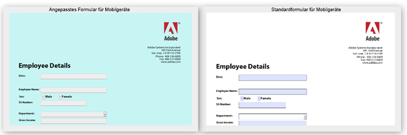

# Ändern von Standardstilen von HTML5-Formularen{#changing-default-styles-of-html-forms}

HTML5-Formulare werden mithilfe von HTML5-Funktionen gerendert. Der Stil des gerenderten Formulars wird mit CSS festgelegt. Das Standarderscheinungsbild von HTML5-Formularen ist der PDF-Darstellung ähnlich. Entwickler können benutzerdefinierte CSS verwenden, um das Standarderscheinungsbild von HTML5-Formularen zu ändern.

Dieser Artikel enthält Schritt-für-Schritt-Informationen zum Ändern des Stils eines HTML5-Formulars und der [Einführung in Stile](/help/forms/using/css-styles.md)-Artikel enthält detaillierte Informationen zu den verschiedenen Gestaltungsaspekten von HTML5-Formularen. Lesen Sie den Artikel &quot;Einführung zu Stilen&quot;, bevor Sie die in diesem Artikel genannten Schritte durchführen.

Die folgenden beiden Bilder zeigen den Unterschied zwischen Standard- und benutzerdefiniertem Stil.

## Gestalten Sie Ihre Formulare {#style-your-forms}

1. **Wählen Sie ein Profil, um benutzerdefinierte Stile hinzufügen**

   Greifen Sie auf die CRX DE-Schnittstelle unter der URL zu: **https://&lt;server>:&lt;port>/crx/de** und erstellen Sie ein Profil oder wählen Sie ein vorhandenes Profil. Informationen zum Erstellen eines Profils finden Sie unter [Erstellen eines neuen Profils](/help/forms/using/custom-profile.md)

1. **Erstellen Sie ein CSS-Stylesheet zum Gestalten der HTML5-Formulare**

   Navigieren Sie zu dem Ordner, in dem Sie den Profil-Renderer erstellt haben, und erstellen Sie eine CSS-Stylesheet-Datei. Die zu befolgenden Schritte:

   1. Klicken Sie mit der rechten Maustaste auf den Ordner und wählen Sie **create** > **create File** aus dem Menü

   1. Geben Sie im Dateierstellungsdialog den Namen des Stylesheets ein. Achten Sife darauf, die Erweiterung .css (z. B. stylesheet.css) zu verwenden.
   1. Öffnen Sie im Navigationsbereich die von Ihnen erstellte CSS-Datei.
   1. Definieren Sie die CSS-Klassen der Komponenten, die Sie gestalten wollen, und fügen Sie in diesen Klassen Stile hinzu.

   Welche CSS-Klassen für eine bestimmte Komponente in Ihrem HTML5-Formular zu erstellen sind, erfahren Sie unter [Einführung zu Stilen](/help/forms/using/css-styles.md).

1. **Schließen Sie das Stylesheet im Profil-Renderer ein.**

   Öffnen Sie die Profil-Renderer-Seite (JSP-Datei) in CRX DE und schließen Sie die CSS-Datei auf der Seite direkt unter der XFA-Clientbibliothek ein. Führen Sie diese Schritte durch, um die css-Datei im Profil einzuschließen.

   1. Suchen Sie auf der Renderer-Seite nach der folgenden Zeile:

      &lt;cq:includeClientLib categories=&quot;xfaforms.profile&quot; />

   1. Fügen Sie Folgendes unter der darüberstehenden Zeile ein, um das Stylesheet einzuschließen:

      &lt;link href=&quot;/path/to/stylesheet&quot; rel=&quot;stylesheet&quot; type=&quot;text/css&quot;/>

   1. Speichern Sie die Datei.
