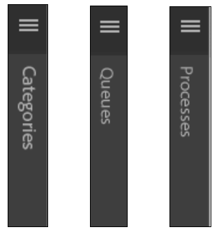

# Ändern des Gebietsschemas der AEM Forms Workspace-Benutzeroberfläche{#changing-the-locale-of-aem-forms-workspace-user-interface}

AEM Forms Workspace unterstützt standardmäßig Englisch, Französisch, Deutsch und Japanisch. Darüber hinaus bietet es die Möglichkeit, die Benutzeroberfläche von AEM Forms Workspace in eine andere Sprache zu lokalisieren.

So lokalisieren Sie die Benutzeroberfläche von AEM Forms Workspace in eine Sprache Ihrer Wahl:

* Lokalisieren des Texts von AEM Forms Workspace
* Lokalisieren von ausgeblendeten Kategorien, Warteschlangen und Prozessen
* Lokalisieren der Datumsauswahl

Bevor Sie die oben genannten Schritte ausführen, müssen Sie die unter [Generische Schritte zur Anpassung von AEM Forms Workspace](../../forms/using/generic-steps-html-workspace-customization.md) aufgeführten Schritte ausführen.

>[!NOTE]
>
>Informationen zum Ändern der Sprache des Anmeldebildschirms von AEM Forms Workspace finden Sie unter [Erstellen eines neuen Anmeldebildschirms](../../forms/using/creating-new-login-screen.md).

## Text lokalisieren {#localizing-text}

Führen Sie die folgenden Schritte aus, um Unterstützung für eine Sprache *Neu* und den Browser-Gebietsschema-Code *nw* hinzuzufügen.

1. Melden Sie sich bei CRXDE Lite an.
Die Standard-URL der CRXDE Lite ist `https://'[server]:[port]'/lc/crx/de/index.jsp`.
1. Navigieren Sie zum Speicherort `apps/ws/locales` und erstellen Sie einen neuen Ordner `nw.`
1. Kopieren Sie die Datei `translation.json`vom Speicherort `/apps/ws/locales/en-US` an den Speicherort `/apps/ws/locales/nw` .
1. Navigieren Sie zu `/apps/ws/locales/nw` und öffnen Sie `translation.json` zur Bearbeitung. Nehmen Sie gebietsschemaspezifische Änderungen an der Datei „translation.json“ vor.

   Die folgenden Beispiele enthalten die Datei „translation.json“ für die englischen und französischen Gebietsschemata von AEM Forms Workspace.

    

## Lokalisieren von ausgeblendeten Kategorien, Warteschlangen und Prozessen {#localizing-collapsed-categories-queues-and-processes}

AEM Forms Workspace verwendet Bilder, um Kopfzeilen von Kategorien, Warteschlangen und Prozessen anzuzeigen. Sie benötigen das Entwicklungspaket um diese Kopfzeilen zu lokalisieren. Detaillierte Informationen zum Erstellen eines Entwicklungspakets finden Sie unter [Erstellen von AEM Forms Workspace-Code.](introduction-customizing-html-workspace.md#building-html-workspace-code)

In den folgenden Schritten wird davon ausgegangen, dass es sich bei den neuen lokalisierten Bilddateien um *Categories_nw.png*, *Queue_nw.png* und *Processes_nw.png* handelt. Die empfohlene Breite der Bilder ist 19 px.

>[!NOTE]
>
>Den Browser-Sprachschema-Code Ihres Browsers finden Öffnen Sie `https://'[server]:[port]'/lc/libs/ws/Locale.html`.



Führen Sie die folgenden Schritte aus, um die Bilder zu lokalisieren:

1. Mit einem WebDAV-Client platzieren Sie die Bilddateien im Ordner */apps/ws/images*.
1. Navigieren Sie zu */apps/ws/css*. Öffnen Sie *newStyle.css* zur Bearbeitung und fügen Sie die folgenden Einträge hinzu:

   ```css
   #categoryListBar .content.nw {
        background: #3e3e3e url(../images/Categories_nw.png) no-repeat 10px 10px;
    }
   
   #filterListBar .content.nw {
       background: #3e3e3e url(../images/Queues_nw.png) no-repeat 10px 10px;
   }
   
   #processNameListBar .content.nw {
       background: #3e3e3e url(../images/Processes_nw.png) no-repeat 10px 10px;
   }
   ```

1. Führen Sie alle semantischen Änderungen durch, die im Artikel [Anpassung des Arbeitsbereichs](../../forms/using/introduction-customizing-html-workspace.md) aufgeführt sind.
1. Navigieren Sie zum Ordner */js/runtime/utility* und öffnen Sie die Datei *usersession.js* zur Bearbeitung.
1. Suchen Sie den Code, der im ursprünglichen Codeblock aufgeführt ist und fügen Sie die folgende Bedingung hinzu: *lang !== &#39;nw&#39;* to the if statement:

   ```javascript
   // Orignal code
   setLocale = function () {
           var lang = $.trim(i18n.lng());
           if (lang === null || lang === '' || (lang !== 'fr-FR' && lang !== 'de-DE' && lang !== 'ja-JP')) {
               window.lcWorkspace.locale = 'en-US';
           } else {
               window.lcWorkspace.locale = lang;
           }
       }
   ```

   ```javascript
   //new code
    setLocale = function () {
           var lang = $.trim(i18n.lng());
           if (lang === null || lang === '' || (lang !== 'fr-FR' && lang !== 'de-DE' && lang !== 'ja-JP' && lang !== 'nw')) {
               window.lcWorkspace.locale = 'en-US';
           } else {
               window.lcWorkspace.locale = lang;
           }
       }
   ```

## Datumsauswahl lokalisieren {#localizing-date-picker}

Sie benötigen das Entwicklungspaket, um die *Datumsauswahl*-API zu lokalisieren. Detaillierte Informationen zum Erstellen von Entwicklungspaketen finden Sie unter [Erstellen von AEM Forms Workspace-Code](introduction-customizing-html-workspace.md#building-html-workspace-code).

1. Laden Sie das [jQuery UI Package](https://jqueryui.com/download/all/) herunter und extrahieren Sie es, navigieren Sie zu *&lt;extrahiertes jQuery UI Package>*\jquery-ui-1.10.2.zip\jquery-ui-1.10.2\ui\i18n.
1. Kopieren Sie die Datei „jquery.ui.datepicker-nw.js“ für Gebietsschema-Code „nw“ nach „apps/ws/js/libs/jqueryui“ und nehmen Sie gebietsschemaspezifische Änderungen an der Datei vor.
1. Navigieren Sie zu `apps/ws/js` und öffnen Sie die Datei `jquery.ui.datepicker-nw.js` zur Bearbeitung.
1. Erstellen Sie in der Datei main.js einen Alias für `jquery.ui.datepicker-nw.js.` Der Code zum Erstellen eines Alias für die Datei `jquery.ui.datepicker-nw.js` lautet:

   ```javascript
   jqueryuidatepickernw : pathprefix + 'libs/jqueryui/jquery.ui.datepicker-nw'
   ```

1. Verwenden Sie den Alias `jqueryuidatepickernw` , um die `jquery.ui.datepicker-nw.js`-Datei in alle Dateien einzuschließen, die die Datumsauswahl verwenden. Die Datumsauswahl wird in den folgenden Dateien verwendet:

   * `js/runtime/views/outofoffice.js`
   * `js/runtime/views/searchtemplatedetails.js`

   Der Beispielcode unten zeigt, wie Sie den Eintrag aus „jquery.ui.datepicker-nw.js“ hinzufügen:

   ```json
   //Original Code
   define([
       'jquery',
       'underscore',
       'backbone',
       'jqueryui',
       'jqueryuidatepickerja',
       'jqueryuidatepickerde',
       'jqueryuidatepickerfr',
       'slimscroll',
       'usersearchview',
       'logmanagerutil',
       'loggerutil'
   ], function ($, _, Backbone, jQueryUI, jQueryUIDatePickerJA, jQueryUIDatePickerDE, jQueryUIDatePickerFR, slimScroll, UserSearch, LogManager, Logger) {
   ```

   ```json
   // Code with Date Picker alias for new language
   define([
       'jquery',
       'underscore',
       'backbone',
       'jqueryui',
       'jqueryuidatepickerja',
       'jqueryuidatepickerde',
       'jqueryuidatepickerfr',
       'jqueryuidatepickernw', // Date Picker alias
       'slimscroll',
       'usersearchview',
       'logmanagerutil',
       'loggerutil'
   ], function ($, _, Backbone, jQueryUI, jQueryUIDatePickerJA, jQueryUIDatePickerDE, jQueryUIDatePickerFR, jQueryUIDatePickerNW, slimScroll, UserSearch, LogManager, Logger) {
   ```

1. In allen Dateien, die die Datumsauswahl-API verwenden, ändern Sie die Standardeinstellungen der Datumsauswahl-API. Die Datumsauswahl-API wird in den folgenden Dateien verwendet:

   * apps\ws\js\runtime\views\searchtemplatedetails.js
   * apps\ws\js\runtime\views\outofoffice.js

   Ändern Sie den folgenden Code, um das neue Gebietsschema hinzuzufügen:

   ```javascript
   if (locale === 'ja-JP') {
      $.datepicker.setDefaults($.datepicker.regional.ja);
   } else if (locale === 'de-DE') {
      $.datepicker.setDefaults($.datepicker.regional.de);
   } else if (locale === 'fr-FR') {
      $.datepicker.setDefaults($.datepicker.regional.fr);
   } else {
      $.datepicker.setDefaults($.datepicker.regional['']);
   }
   ```

   ```javascript
   if (locale === 'ja-JP') {
       $.datepicker.setDefaults($.datepicker.regional.ja);
   } else if (locale === 'de-DE') {
       $.datepicker.setDefaults($.datepicker.regional.de);
   } else if (locale === 'fr-FR') {
       $.datepicker.setDefaults($.datepicker.regional.fr);
   } else if (locale === 'nw') {
       $.datepicker.setDefaults($.datepicker.regional.nw);
   } else {
       $.datepicker.setDefaults($.datepicker.regional['']);
   }
   ```
