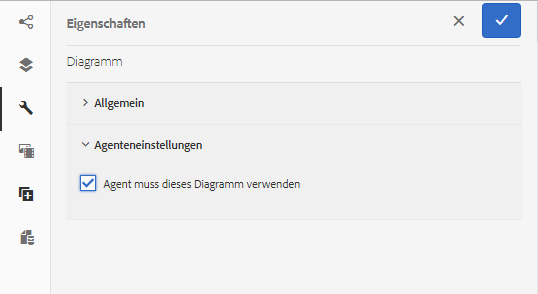

# Verwenden von Diagrammen mit interaktiver Kommunikation{#using-charts-in-interactive-communications}

Ein Diagramm ist eine visuelle Darstellung von Daten. Es verdichtet große Mengen an Informationen in ein leicht verständliches visuelles Format, sodass die Empfänger der interaktiven Kommunikation komplexe Daten besser visualisieren, interpretieren und analysieren können.

Beim Erstellen einer interaktiven Kommunikation können Sie Diagramme hinzufügen, um zweidimensionale Daten vom Formulardatenmodell der Vorlage für die interaktive Kommunikation visuell darzustellen. Mit der Diagrammkomponente können Sie die folgenden Diagrammtypen hinzufügen und konfigurieren: Torten, Spalten, Donut, Balken, Linie, Linie und Punkt, Punkt, Bereich und Quadrant.

## Add and configure chart in an Interactive Communication {#add-and-configure-chart-in-an-interactive-communication}

Führen Sie die folgenden Schritte aus, um ein Diagramm in einer interaktiven Kommunikation hinzuzufügen und zu konfigurieren:

1. Tippen Sie im Sidekick der interaktiven Kommunikation auf **Komponenten** .
1. Ziehen Sie die **Diagrammkomponente** per Drag &amp; Drop in eine der folgenden Komponenten:

   * Kanal drucken: Zielgruppen- oder Bildfeld
   * Web-Kanal: Bereich oder Zielgruppe

1. Tippen Sie im Editor für interaktive Kommunikation auf die Diagrammkomponente und wählen Sie in der Komponenten-Symbolleiste die Option &quot; **[!UICONTROL Konfigurieren&quot;(]** configure_icon ).

   Die Diagrammeigenschaften werden im linken Bereich angezeigt.

   

   Grundlegende Eigenschaften eines Zeilentypdiagramms im Druckkanal

   

   Grundlegende Eigenschaften eines Zeilentypdiagramms im Webkanal

1. Konfigurieren Sie die [Diagrammeigenschaften](../../forms/using/chart-component-interactive-communications.md#configure-chart-properties) auf Grundlage des Kanals.
1. (Print channel only) In the **[!UICONTROL Agent Settings]**, specify if it is mandatory for the agent to use this chart. If i **[!UICONTROL t Is Mandatory For the Agent To Use This Chart]** option is not selected, the agent can tap the eye icon for the chart in the **[!UICONTROL Content]** tab of Agent UI to show or hide the chart.

   

1. Tap  to save the chart properties.

   Tippen Sie auf **[!UICONTROL Vorschau]** , um das Erscheinungsbild und die mit dem Diagramm verknüpften Daten Ansicht. Tippen Sie auf **[!UICONTROL Bearbeiten]** , um die Eigenschaften des Diagramms neu zu konfigurieren.

## Diagrammeigenschaften konfigurieren {#configure-chart-properties}

Konfigurieren Sie beim Erstellen von Diagrammen für Druck- und Web-Kanal die folgenden Eigenschaften:

<table>
 <tbody>
  <tr>
   <td>Feld</td>
   <td>Beschreibung</td>
   <td>Kanaltyp</td>
  </tr>
  <tr>
   <td>Name</td>
   <td>Bezeichner für das Diagrammelement. Der Name des in diesem Feld angegebenen Diagramms ist im Diagramm nicht sichtbar. Es wird verwendet, wenn auf das Element von anderen Komponenten, Skripten und SOM-Ausdrücken verwiesen wird.</td>
   <td>Druck und Web</td>
  </tr>
  <tr>
   <td>Diagrammtyp</td>
   <td>Diagrammtyp, den Sie erstellen möchten. Die verfügbaren Optionen sind Tortendiagramm, Spalte, Donut, Balken, Linie, Linie und Punkt, Punkt und Bereich.</td>
   <td>Druck und Web</td>
  </tr>
  <tr>
   <td>Serie &gt; Mehrere Reihen</td>
   <td>Wählen Sie diese Option, um mehrere Serien für die auf der X- und Y-Achse dargestellten Sammlungselemente des Formulardatenmodells hinzuzufügen.</td>
   <td>Druck und Web</td>
  </tr>
  <tr>
   <td>Serie &gt; Datenmodellobjekt</td>
   <td>Name des Collection-Elements des Formulardatenmodells, das dem Diagramm mehrere Reihen hinzufügen soll.<br /> Wählen Sie eine Objekteigenschaft des übergeordneten Formulardatenmodells für die Eigenschaften, die auf der X- und Y-Achse dargestellt werden, um eine aussagekräftige Reihe zu bilden. Das Datenmodellobjekt, das Sie binden, muss vom Typ "Number", "String"oder "Date"sein.</td>
   <td>Druck und Web</td>
  </tr>
  <tr>
   <td>Gestapelt anzeigen</td>
   <td>Auswählen, um die Werte jeder Serie übereinander zu stapeln.</td>
   <td>Druck und Web</td>
  </tr>
  <tr>
   <td>X-Achse &gt; Titel</td>
   <td>Titel für die X-Achse.</td>
   <td>Druck und Web</td>
  </tr>
  <tr>
   <td>X-Achse &gt; Datenmodellobjekt</td>
   <td><p>Name des auf der X-Achse abzubildenden Collection-Elements des Formulardatenmodells.</p> <p>Wählen Sie zwei Eigenschaften für den Sammlungs-/Array-Typ des gleichen übergeordneten Datenmodellobjekts aus, die im Verhältnis zueinander aussagekräftig sind, um sie auf der X- und Y-Achse eines Diagramms darzustellen. Das Datenmodellobjekt, das Sie binden, muss vom Typ "Number", "String"oder "Date"sein.</p> </td>
   <td>Druck und Web</td>
  </tr>
  <tr>
   <td>Y-Achse &gt; Titel</td>
   <td>Titel für die Y-Achse. </td>
   <td>Druck und Web</td>
  </tr>
  <tr>
   <td>Y-Achse &gt; Datenmodellobjekt</td>
   <td><p>Auf der Y-Achse aufzuzeichnendes Element des Formulardatenmodells. Im Kanal "Drucken"sollte das Datenmodellobjekt für die Y-Achse vom Typ "Zahl"sein.</p> <p>Wählen Sie zwei Eigenschaften für den Sammlungs-/Array-Typ des gleichen übergeordneten Datenmodellobjekts aus, die im Verhältnis zueinander aussagekräftig sind, um sie auf der X- und Y-Achse eines Diagramms darzustellen. </p> </td>
   <td>Druck und Web</td>
  </tr>
  <tr>
   <td>Y-Achse &gt; Funktion</td>
   <td>Statistische/benutzerdefinierte Funktion zur Berechnung der Werte auf der y-Achse.</td>
   <td>Druck und Web</td>
  </tr>
  <tr>
   <td>Objekt ausblenden</td>
   <td>Wählen Sie diese Option, um das Diagramm in der endgültigen Ausgabe auszublenden.</td>
   <td>Druck und Web</td>
  </tr>
  <tr>
   <td>Titel</td>
   <td>Titel des Diagramms. </td>
   <td>Druck</td>
  </tr>
  <tr>
   <td>Höhe</td>
   <td>Höhe des Diagramms in Pixel.</td>
   <td>Druck</td>
  </tr>
  <tr>
   <td>Breite</td>
   <td>Breite des Diagramms in Pixel. Sie können die Breite des Diagramms im Webkanal mithilfe der Stil-Ebene oder durch Anwenden eines Designs steuern.</td>
   <td>Druck</td>
  </tr>
  <tr>
   <td>Obligatorischer Seitenumbruch vor</td>
   <td>Wählen Sie diese Option aus, um vor dem Diagramm einen obligatorischen Seitenumbruch hinzuzufügen und das Diagramm oben auf einer neuen Seite einzufügen. </td>
   <td>Druck</td>
  </tr>
  <tr>
   <td>Obligatorischer Seitenumbruch nach</td>
   <td>Wählen Sie diese Option aus, um vor dem Diagramm einen obligatorischen Seitenumbruch hinzuzufügen und das Diagramm oben auf einer neuen Seite einzufügen. </td>
   <td>Druck</td>
  </tr>
  <tr>
   <td>Einzug</td>
   <td>Einzug des Diagramms von links auf der Seite. </td>
   <td>Druck</td>
  </tr>
  <tr>
   <td>QuickInfo</td>
   <td><p>Format, in dem die QuickInfo auf einem Datenpunkt im Diagramm im Web Kanal angezeigt wird. Der Standardwert ist ${x}(${y}). Je nach Diagrammtyp werden die Variablen ${x}und ${y} dynamisch durch die entsprechenden Werte auf der X- und Y-Achse ersetzt und in der QuickInfo angezeigt, wenn Sie mit der Maus auf einen Punkt, eine Leiste oder ein Segment im Diagramm zeigen.</p> <p>To disable tool tip, leave the <span class="uicontrol">Tooltip</code> field blank. Diese Option ist nicht auf Linien- und Bereichsdiagramme anwendbar. For example, see <a href="#chartoutputprintweb">Example 1: Chart output in print and web</a>.</code></p> </td>
   <td>Web</td>
  </tr>
  <tr>
   <td>Diagrammspezifische Konfigurationen</td>
   <td><p>Neben den allgemeinen Konfigurationen sind die folgenden spezifischen Diagrammkonfiguration verfügbar:</p>
    <ul>
     <li><strong>Legende anzeigen: Zeigt eine Legende für das Kreisdiagramm oder Ringdiagramm </strong>an, wenn diese aktiviert ist.</li>
     <li><strong>Legendenposition: </strong>Gibt die Position der Legende in Bezug auf das Diagramm an. Die verfügbaren Optionen sind rechts, links, oben und unten. Es wird empfohlen, die rechte Legende im Kanal zu verwenden.</li>
     <li><strong>Innerer Radius</strong>: Verfügbar für Ringdiagramme, um den Radius (in Pixel) des inneren Kreises im Diagramm anzugeben.</li>
     <li><strong>Linienfarbe</strong>: Verfügbar für Linien-, Linien- und Punktdiagramme sowie Flächendiagramme, um die Farbe für die Linie im Diagramm anzugeben.</li>
     <li><strong>Punktfarbe</strong>: Verfügbar für Punkt- und Linien- und Punktdiagramme, um die Farbe für die Punkte im Diagramm anzugeben.<br /> </li>
     <li><strong>Bereichsfarbe</strong>: Verfügbar für Flächendiagramme, um die Farbe für den Bereich unter der Linie im Diagramm anzugeben.</li>
     <li><strong>Referenzpunkt &gt; Bindungstyp: Für Quadrantendiagramme </strong>verfügbar, um den Bindungstyp für den Referenzpunkt<strong> </strong>anzugeben. Verwenden Sie die Objekteigenschaft für statischen Text oder Datenmodell, um den Wert für den Referenzpunkt zu definieren.</li>
     <li><strong>Bezugspunkt &gt; X-Achse: Für Quadrantendiagramme </strong>verfügbar, wenn Sie in der Dropdown-Liste "Bindungstyp"die Option " <span class="uicontrol">Statisch</code> "auswählen, um den X-Achsen-Wert für den Referenzpunkt anzugeben.</code></li>
     <li><strong>Bezugspunkt &gt; Y-Achse: Für Quadrantendiagramme </strong>verfügbar, wenn Sie in der Dropdown-Liste "Bindungstyp"die Option " <span class="uicontrol">Statisch</code> "auswählen, um den Y-Achsenwert für den Referenzpunkt anzugeben.</code></li>
     <li><strong>Referenzpunkt &gt; Datenmodellobjekt für Serie: Für mehrere Serien </strong>verfügbare Quadrant-Diagramme, wenn Sie in der Dropdown-Liste "Bindungstyp"die Option " <span class="uicontrol">Datenmodellobjekt</code> "auswählen. Definieren Sie die Formulareigenschaft des Formdatenmodells, um die Serie für den Referenzpunkt zu identifizieren. </code></li>
     <li><strong>Referenzpunkt &gt; Datenmodellobjektwert für Serie: Für mehrere Serien </strong>verfügbare Quadrant-Diagramme, wenn Sie in der Dropdown-Liste "Bindungstyp"die Option " <span class="uicontrol">Datenmodellobjekt</code> "auswählen. Verwenden Sie die Objekteigenschaft des Formulardatenmodells für Reihen und den in diesem Feld definierten Wert, um die Reihe für den Referenzpunkt zu identifizieren.</code></li>
     <li><strong>Referenzpunkt &gt; Datenmodellobjekt für Referenzpunkt: Für Quadrantendiagramme </strong>verfügbar, wenn Sie in der Dropdown-Liste "Bindungstyp"die Option " <span class="uicontrol">Datenmodellobjekt</code> "auswählen. Definieren Sie eine Objekteigenschaft des Formulardatenmodells, die den auf der X- und Y-Achse dargestellten Eigenschaften gleicht. Definieren Sie außerdem für mehrere Reihen eine Datenmodellobjekteigenschaft, die eine untergeordnete Entität der für die Serie definierten Datenmodellobjekteigenschaft ist.</code></li>
     <li><strong>Referenzpunkt &gt; Datenmodellobjektwert für Referenzpunkt: Für Quadrantendiagramme </strong>verfügbar, wenn Sie in der Dropdown-Liste "Bindungstyp"die Option " <span class="uicontrol">Datenmodellobjekt</code> "auswählen. Verwenden Sie die Objekteigenschaft des Formulardatenmodells für den Referenzpunkt und den in diesem Feld definierten Wert, um den Referenzpunkt für das Diagramm zu identifizieren.<br /> <strong>Quadrante Beschriftungen &gt; Oben links:</strong> Verfügbar für Quadrantendiagramme, um den Namen für den Quadranten oben links anzugeben.</code></li>
     <li><strong>Quadrante Beschriftungen &gt; Oben rechts:</strong> Verfügbar für Quadrantendiagramme, um den Namen für den Quadranten rechts oben anzugeben.</li>
     <li><strong>Quadrante Beschriftungen &gt; Unten rechts: Für Quadrantendiagramme </strong>verfügbar, um den Namen für den Quadranten unten rechts anzugeben.</li>
     <li><strong>Quadrante Beschriftungen &gt; Unten links: Für Quadrantendiagramme </strong>verfügbar, um den Namen für den Quadranten unten links anzugeben.</li>
    </ul> </td>
   <td>Druck und Web</td>
  </tr>
 </tbody>
</table>

## Funktionen im Diagramm verwenden {#use-functions-in-chart}

Sie können das Diagramm so konfigurieren, dass Sie mit statistischen Funktionen Werte aus Quelldaten zur grafischen Darstellung im Diagramm berechnen können. Durch Anwenden von Funktionen in einem Diagramm können Sie Daten darstellen, die nicht direkt vom Formulardatenmodell bereitgestellt werden.


While the Chart component come with some in-built functions, you can write [custom functions](#customfunctionsweb) and make them available for use in the chart configuration in the web channel.

Die folgenden Funktionen sind standardmäßig in der Diagrammkomponente verfügbar:

**Mittelwert (Durchschnitt)** Gibt den Durchschnitt der Werte auf der X- oder Y-Achse für einen bestimmten Wert auf der anderen Achse zurück.

**Summe** Gibt die Summe aller Werte auf der X- oder Y-Achse für einen bestimmten Wert auf der anderen Achse zurück.

**Maximum** Gibt das Maximum der Werte auf der X- oder Y-Achse für einen bestimmten Wert auf der anderen Achse zurück.

**Frequenz** Gibt die Anzahl der Werte auf der X- oder Y-Achse für einen bestimmten Wert auf der anderen Achse zurück.

**Bereich** Gibt die Differenz zwischen dem Maximum und Minimum der Werte auf der X- oder Y-Achse für einen bestimmten Wert auf der anderen Achse zurück.

**Median** Gibt den Wert zurück, der auf der X- oder Y-Achse höhere und niedrigere Werte auf der anderen Achse halbiert.

**Minimum** Gibt das Minimum der Werte auf der X- oder Y-Achse für einen bestimmten Wert auf der anderen Achse zurück.

**Mode** Gibt den Wert mit den meisten Vorkommen auf der X- oder Y-Achse für einen bestimmten Wert auf der anderen Achse zurück.

Weitere Informationen finden Sie unter [Beispiel 2: Anwendung der Sum- und Frequenzfunktionen in einem Liniendiagramm](#applicationsumfrequency).

### Custom functions in web channel {#customfunctionsweb}

Neben der Verwendung der Standardfunktionen in Diagrammen können Sie benutzerdefinierte Funktionen in JavaScript™ schreiben und in der Liste der Funktionen in der Diagrammkomponente freigeben.

Eine Funktion akzeptiert ein Array oder Werte und einen Kategorienamen als Eingabe und gibt einen Wert zurück. Beispiel:

```
Multiply(valueArray, category) {
 var val = 1;
 _.each(valueArray, function(value) {
 val = val * value;
 });
 return val;
}
```

Wenn Sie eine benutzerdefinierte Funktion geschrieben haben, können Sie die folgenden Schritte ausführen, um sie für die Verwendung in der Diagrammkonfiguration freizugeben:

1. Fügen Sie die benutzerdefinierte Funktion in der Client-Bibliothek hinzu, die mit der entsprechenden interaktiven Kommunikation verknüpft ist. For more information, see [Configuring the Submit action](/help/forms/using/configuring-submit-actions.md) and [Using Client-Side Libraries](/help/sites-developing/clientlibs.md).

1. To display the custom function in Function drop-down, in CRXDe Lite, create an `nt:unstructured` node in the apps folder with the following properties:

   * Add property `guideComponentType` with value as `fd/af/reducer`. (mandatory)

   * Add property `value` to a fully qualified name of the custom JavaScript™ function. (obligatorisch) und setzen Sie den Wert auf den Namen der benutzerdefinierten Funktion, z. B. Multiplizieren, fest.
   * Add property `jcr:description` with the value you want to display as the name of the custom function that appears in the Function drop-down. Beispiel:**Multiplizieren**. 

   * Add property `qtip` with value that will be short description of the custom function. Es wird als QuickInfo angezeigt, wenn der Mauszeiger über den Funktionsnamen in der Dropdown-Liste **Funktion** bewegt wird.

1. Klicken Sie auf **Alle speichern**, um die Konfiguration zu speichern.

Die Funktion steht nun zur Verwendung im Diagramm zur Verfügung.

## Beispiel 1: Diagrammausgabe in Druck und Web {#chartoutputprintweb}

Auf der Registerkarte Einfach definieren Sie den Diagrammtyp, die Eigenschaften des Quellformulardaten-Modells, die Daten enthalten, die Beschriftungen, die auf der X- und Y-Achse des Diagramms dargestellt werden sollen, und optional die statistische Funktion, um die Werte für die Darstellung im Diagramm zu berechnen.

Anhand eines Kartenausweises, der mithilfe einer interaktiven Kommunikation generiert wurde, sollten wir uns ausführlich mit den erforderlichen Informationen in den grundlegenden Eigenschaften auskennen. Wenn Sie ein Diagramm generieren möchten, um die Höhe der verschiedenen Ausgaben in der Abrechnung darzustellen. Sie können verschiedene Diagrammarten für Druck- und Webausgabe der interaktiven Kommunikation verwenden.

### Säulendiagramm für Druck {#columnchartprint}

Geben Sie dazu die folgenden Eigenschaften an:

* **[!UICONTROL Name]** : Geben Sie den Namen für das Diagramm an.
* **[!UICONTROL Diagrammtyp]** : Wählen Sie in der Dropdown-Liste die Option **Spalte** aus.
* **[!UICONTROL Titel]** - Geben Sie den Ausgabentyp für die X-Achse und den Transaktionsbetrag für die Y-Achse an.
* **[!UICONTROL Datenmodellobjekte]** - Wählen Sie die Objekteigenschaften des Datenmodells aus, um Datenbindungen für die X-Achse (Ausgabetyp) und die Y-Achse (Transaktionsbetrag) zu erstellen.


Spaltendiagramm im Kanal &quot;Drucken&quot;einer interaktiven Kommunikation

### Ringdiagramm für das Web {#donutchartweb}

Geben Sie dazu die folgenden Eigenschaften an:

* **[!UICONTROL Name]** : Geben Sie den Namen für das Diagramm an.
* **[!UICONTROL Diagrammtyp]** : Wählen Sie **[!UICONTROL Donut]** aus der Dropdown-Liste.
* **[!UICONTROL Datenmodellobjekte]** - Wählen Sie die Objekteigenschaften des Datenmodells aus, um Datenbindungen für die X-Achse (Ausgabetyp) und die Y-Achse (Transaktionsbetrag) zu erstellen.
* **[!UICONTROL Innerer Radius]** : Geben Sie den Wert &quot;Innerer Radius&quot;als 150 an, um den Radius (in Pixel) des inneren Kreises im Diagramm anzugeben.
* **[!UICONTROL QuickInfo]** - Verwenden Sie das Standardformat ${x}(${y}), um die QuickInfo anzuzeigen. Die QuickInfo wird wie folgt angezeigt: Ausgabentyp(Transaktionsbetrag). Beispiel: Debit for Bitcoin(10000).


Ringdiagramm im Web-Kanal einer interaktiven Kommunikation

## Beispiel 2: Anwendung von Summen- und Häufigkeitsfunktionen in einem Liniendiagramm {#applicationsumfrequency}

Durch Anwenden von Funktionen in einem Diagramm können Sie Daten darstellen, die nicht direkt vom Formulardatenmodell bereitgestellt werden. In diesem Beispiel verwenden wir ein Beispiel für einen Kreditkartenauszug, um zu verstehen, wie Summen- und Häufigkeitsfunktionen auf das Diagramm angewendet werden können.


Liniendiagramm ohne Funktion mit zwei &quot;Debit for AirBnB&quot;-Transaktionen

### Summenfunktion {#sum-function}

Sie können die Summenfunktion anwenden, um Werte mehrerer Instanzen derselben Dateneigenschaft zusammenzufassen, und sie nur einmal anzeigen. Im folgenden Diagramm wird beispielsweise die Funktion Summe auf der Y-Achse angewendet, um den Betrag der beiden Debit-Vorgänge für AirBnB (2050 und 1050) hinzuzufügen und nur eine Transaktion (3100) anzuzeigen.

Die Summenfunktion kann Diagramme nützlicher machen, wenn Sie die Summe für viele Instanzen derselben Dateneigenschaft sortieren und anzeigen möchten.


### Häufigkeitsfunktion {#frequency-function}

Die Funktion Frequenz gibt die Anzahl der Werte der Y-Achse für einen bestimmten Wert auf der anderen Achse zurück. Mit der Anwendung der Funktion Häufigkeit auf der Y-Achse (Transaktionsbetrag) zeigt das Diagramm an, dass es zwei Vorfälle von Debit für AirBnB-Transaktionen und ein Vorkommen der übrigen Arten von Transaktionen gab.


## Beispiel 3: Quadrantendiagramm mehrerer Reihen im Web {#example-multi-series-quadrant-chart-in-web}

Das Diagramm zeigt den Betrag für Transaktionen in einem bestimmten Datumsbereich an. Das Quadrantendiagramm bietet die Möglichkeit, den Diagrammbereich in vier beschriftete Abschnitte zu unterteilen. Das Zeichen verwendet einen statischen Bezugspunkt für die X- und Y-Achse. Verwenden Sie die Funktion für mehrere Reihen, um Daten basierend auf dem Namen der Bank zu trennen.

Geben Sie dazu die folgenden Eigenschaften an:

* **Name:** Geben Sie den Namen für das Diagramm an.
* **Diagrammtyp:** Wählen Sie **Quadrant** aus der Dropdown-Liste.

* Aktivieren Sie das Kontrollkästchen **Mehrere Reihen** .
* **Datenmodellobjekt**: Geben Sie die Datenmodell-Objekteigenschaft für die Serie an. Die Datenmodell-Objekteigenschaft für den Banknamen ist eine übergeordnete Eigenschaft der Datenmodellobjekteigenschaften, die in der X- und Y-Achse dargestellt werden.
* **Datenmodellobjekte:** Wählen Sie die Objekteigenschaften des Datenmodells aus, um Datenbindungen für die X-Achse (Transaktionsdatum) und die Y-Achse (Transaktionsbetrag) zu erstellen.
* Wählen Sie im Abschnitt **Referenzpunkt** die Option **Statisch** als Bindungstyp.

* Geben Sie die Werte für die Referenzpunkte der X- und Y-Achse an.
* Geben Sie die quadranten Beschriftungen für Quadranten oben links, oben rechts, unten rechts und unten links an.
* Aktivieren Sie das Kontrollkästchen &quot; **Legenden** anzeigen&quot;, um die Farbcodes für die Banknamen anzuzeigen.


