# Inline-Bedingung und Wiederholung in der interaktiven Kommunikation und in Briefen{#inline-condition-and-repeat-in-interactive-communications-and-letters}

## Inline-Bedingungen {#inline-conditions}

AEM Forms ermöglicht es Ihnen, Inline-Bedingungen in Textmodulen zu verwenden, um das Rendern von Text zu automatisieren, der vom Kontext oder den Daten abhängt, die mit dem Fomulardatenmodell (in interaktiver Kommunikation) oder dem Datenwörterbuch verknüpft sind. Inline-Bedingung zeigt den spezifischen Inhalt an, der auf der Bedingungsbewertung basiert, die „true“ oder „false“ ist.

Bedingungen führen Berechnungen zu Datenwerten durch, die vom Datenmodell/Datenwörterbuch oder von Endbenutzern bereitgestellt werden. Wenn Sie Inline-Bedingungen verwenden, sparen Sie Zeit und verringern menschliches Versagen, während Sie hochgradige kontextabhängige und personalisierte interaktive Kommunikation/Briefe erstellen.

Weitere Informationen finden Sie unter:

* [Erstellen einer interaktiven Kommunikation](../../forms/using/create-interactive-communication.md)
* [Correspondence Management – Zusammenfassung](/help/forms/using/cm-overview.md)
* [Text in interaktiven Kommunikationen](../../forms/using/texts-interactive-communications.md)

### Beispiel: Verwenden von Regeln, um Inline-Text in der interaktiven Kommunikation Bedingungen festzulegen {#example-using-rules-to-conditionalize-inline-text-in-interactive-communication}

Um einen Satz, einen Absatz oder eine Textzeichenfolge in einer interaktiven Kommunikation mit Bedingungen zu versehen, können Sie im entsprechenden Textdokumentfragment eine Regel erstellen. Im folgenden Beispiel wird eine Regel verwendet, um eine gebührenfreie Nummer nur für die US-Empfänger der interaktiven Kommunikation anzuzeigen.

Weitere Informationen finden Sie unter Erstellen von Regeln im Text in [Texte in interaktiven Nachrichten](../../forms/using/texts-interactive-communications.md).

Wenn Sie das Textfragment in eine interaktive Kommunikation einbeziehen und der Agent die Agent-Benutzeroberfläche zur Erstellung einer interaktiven Kommunikation verwendet, werden die Daten (Formulardatenmodell) für die Empfänger ausgewertet und der Text wird nur den Empfängern in den USA angezeigt.

### Beispiel: Wenn die Inline-Bedingung in einem Brief verwendet wird, um die entsprechende Adresse zu rendern  {#example-using-inline-condition-in-a-letter-to-render-the-appropriate-address}

Sie können Inline-Bedingungen in einen Brief einfügen, indem Sie die Inline-Bedingung in das entsprechende Textmodul einzufügen. Im folgenden Beispiel werden zwei Bedingungen verwendet, um die entsprechende Anrede, Herr oder Frau, in einem Brief zu evaluieren, basierend auf dem DD-Element „Geschlecht“. Unter Verwendung ähnlicher Schritte können Sie andere Bedingungen erstellen.

>[!NOTE]
>
>Wenn Ihre vorhandenen Assets alte Bedingungs-/Wiederholungsausdrücke einbeziehen (vor 6.2 SP1 CFP 4), zeigen die Assets die alte Syntax der Bedingung und Wiederholung an. Die alte, die Bedingung oder Wiederholung funktioniert. Auch die neuen und alten Bedingungs- oder Wiederholungsausdrücke sind miteinander kompatibel, um eine verschachtelte Mischung aus alten und neuen Bedingungs-/Wiederholungsausdrücken zu erstellen.

1. Wählen Sie im entsprechenden Textmodul den Teil aus, für den Sie Bedingungen festlegen wollen und tippen Sie auf **Bedingung**.

   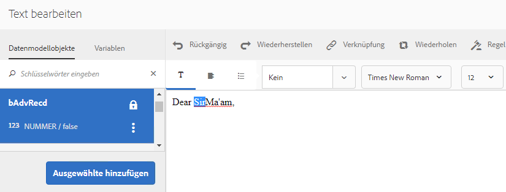

   Der Bedingungsdialog wird mit einer leeren Status.

   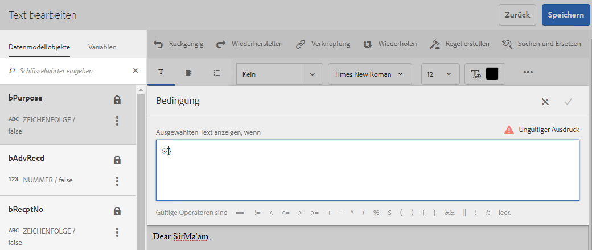

   >[!NOTE]
   >
   >Leerer oder ungültiger Bedingungsausdruck kann nicht gespeichert werden. Es muss einen gültigen bedingten Ausdruck innerhalb von `${}` geben, um den Ausdruck zu speichern.

1. Führen Sie folgende Schritte aus, um eine Bedingung für die Bewertung zu konstruieren, ob ausgewählter Text oder Text, für den Bedingungen erstellt werden, im Brief angezeigt wird, und tippen Sie auf das Häkchen, um den Ausdruck zu speichern:

   Doppeltippen Sie auf ein DD-Element, um es in die Bedingung einzufügen. Fügen Sie den entsprechenden Operator ein und erstellen Sie die folgende Bedingung im Dialogfeld.

   ```javascript
   ${DD_creditcard_Gender=="Male"}
   ```

   Weitere Informationen zum Erstellen eines Ausdrucks finden Sie unter **Erstellen von Ausdrücken und Remote-Funktionen mit dem Ausdrucksgenerator** im [Ausdrucksgenerator](../../forms/using/expression-builder.md).  Der im Ausdruck angegebene Wert muss für das Element im Datenwörterbuch unterstützt werden. Weitere Informationen finden Sie unter [Datenwörterbuch](../../forms/using/data-dictionary.md).

   Nachdem Sie die Bedingung eingefügt haben, können Sie den Mauszeiger über den Ziehgriff links neben der Bedingung bewegen, um die Bedingung anzuzeigen. Alternativ dazu können Sie auf den Ziehgriff tippen, um das Popupmenü der Bedingung anzuzeigen, die es Ihnen ermöglicht, die Bedingung zu bearbeiten oder zu entfernen.

    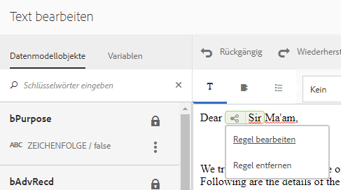

1. Fügen Sie eine ähnliche Bedingung ein, indem Sie den Text `Ma'am` auswählen.

   ```javascript
   ${DD_creditcard_Gender == "Female"}
   ```

1. Zeigen Sie den relevanten Brief in der Vorschau an und Sie werden bemerken, dass der Text gemäß der Inline-Bedingung gerendert wurde. Sie können den Wert des DD-Elements „Geschlecht“ wie folgt eingeben:

   * Eine XML-Beispieldatendatei, die basierend auf dem relevanten Datenwörterbuch erstellt wurde, während der Brief mit Beispieldaten in der Vorschau angezeigt wird.
   * Eine XML-Datendatei, am relevanten Datenwörterbuch angehängt ist.

   Weitere Informationen finden Sie unter [Datenwörterbuch](../../forms/using/data-dictionary.md).

   

## Wiederholen {#repeat}

Sie haben möglicherweise dynamische Daten in Ihren interaktiven Kommunikationen/Briefen, z. B. Transaktionen in einem Kreditkartenauszug, in der Instanz oder Vorkommen, die sich mit jedem erstellten Brief ändern können. Wenn Sie die Wiederholungsfunktion verwenden, können Sie solche dynamische Daten in Ihrem Textdokumentenfragment formatieren und strukturieren.

Außerdem können Sie eine Regel/Bedingung innerhalb des Wiederholungskonstrukts angeben, um die Daten/Einträge mit einer Bedingung zu versehen, die in der interaktiven Kommunikation/im Brief gerendert werden.

### Beispiel: Wenn Sie die Wiederholungsfunktion in einem Brief verwenden, um eine Liste von Kreditkartentransaktionen zu formatieren, strukturieren und anzuzeigen {#example-using-repeat-in-an-interactive-communication-to-format-structure-and-display-a-list-of-credit-card-transactions}

Das folgende Beispiel zeigt die Schritte für die Verwendung der Wiederholungsfunktion, um die Kreditkartentransaktionen in einer interaktiven Kommunikation zu strukturieren und zu rendern.

1. Fügen Sie in einem formulardatenmodellbasierten Textdokumentfragment die relevanten Formulardatenmodellobjekte (und eingebetteten Text, der für die Beschriftungen erforderlich ist, wie in diesem Beispiel gezeigt wird) ein:

   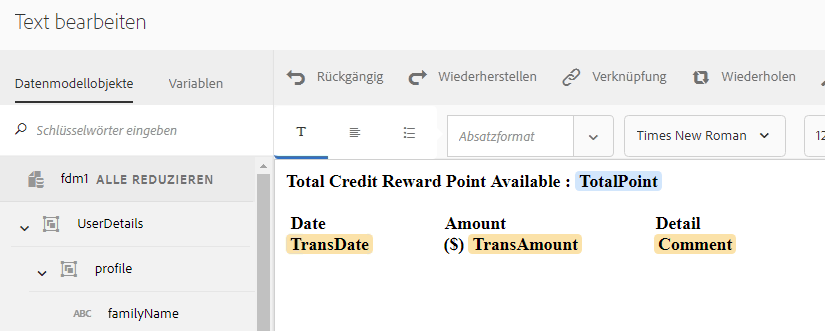

   >[!NOTE]
   >
   >Der wiederholbare Inhalt muss mindestens eine Eigenschaft des Typs „Sammlung“ enthalten.

1. Wählen Sie den Inhalt aus, auf den die Wiederholungsfunktion angewendet werden soll.

   

1. Tippen Sie auf „Wiederholen“.

   Das Dialogfeld „Wiederholung“ wird angezeigt.

   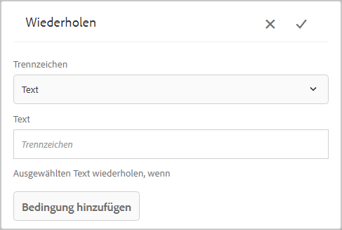

1. Wählen Sie Zeilenumbruch als Trennzeichen und tippen Sie ggf. auf „Bedingung hinzufügen“, um eine Regel zu erstellen. Sie können auch Text als Trennzeichen verwenden und die Textarten angeben, die als Trennzeichen verwendet werden sollen.

   Das Dialogfeld zum Erstellen der Regel wird angezeigt. 

1. Erstellen Sie eine Regel, um die Transaktionen anzuzeigen, die nach dem 28. Februar 2018 datiert sind, damit nur die Transaktionen für den Monat März in die interaktive Kommunikation einbezogen werden.

   >[!NOTE]
   >
   >In diesem Beispiel wird davon ausgegangen, dass der Agent die Anweisung Ende März 2018 erstellt. Andernfalls können Sie eine andere Regel erstellen, um Transaktionen vor dem 01.04.2018 einzubeziehen, um Transaktionen nach März 2018 auszuschließen.

   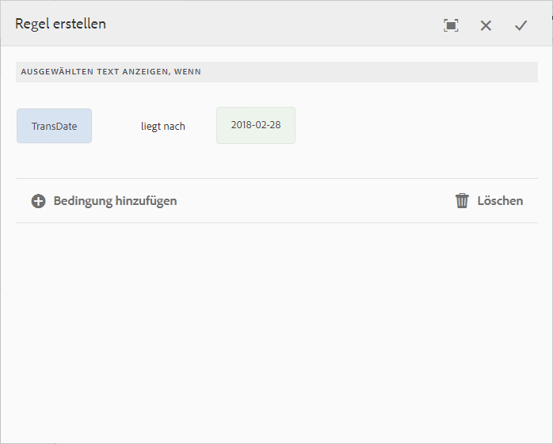

1. Speichern Sie die Bedingung/Regel und dann die Wiederholung. Die bedingte Wiederholung wird auf den ausgewählten Inhalt angewendet.

   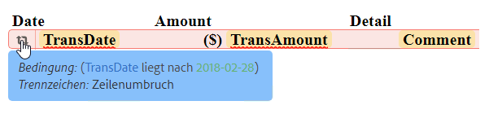

   Wenn Sie mit der Maus darüber fahren, zeigt das Textdokumentfragment die Bedingung und das Trennzeichen an, die bzw. das in der auf den Inhalt angewendeten Wiederholung verwendet wurde.

1. Speichern Sie das Textdokumentfragment und zeigen Sie die relevante interaktive Kommunikation in der Vorschau an. Abhängig von den Daten im Formulardatenmodell werden die Transaktionsdetails in der Vorschau durch die Wiederholung für die Elemente ähnlich dargestellt:

   

### Beispiel: Verwenden der Wiederholen-Funktion in einem Brief, um eine Liste von Kreditkartentransaktionen zu formatieren, strukturieren und anzuzeigen {#example-using-repeat-in-a-letter-to-format-structure-and-display-a-list-of-credit-card-transactions}

Das folgende Beispiel zeigt die Schritte für die Verwendung der Wiederholen-Funktion, um die Kreditkartentransaktionen in einem Brief zu strukturieren und zu rendern. Durch ähnliche Schritte können Sie die Wiederholen-Funktion in einem anderen Szenario verwenden.

1. Öffnen Sie (bei der Bearbeitung oder Erstellung) ein Textmodul, das DD-Elemente enthält, die die Wiederholungs-/dynamischen Daten rendern und den erforderlichen Text und die DD-Elemente einbetten. Beispielsweise hat ein Textmodul die folgenden DD-Elemente, um eine Umsatzabrechnung auf einer Kreditkarte zu erstellen:

   ```javascript
   {^DD_creditcard_TransactionDate^} {^DD_creditcard_TransactionAmount^}
   {^DD_creditcard_TransactionType^}
   ```

   Diese DD-Elemente rendern eine Liste der Transaktionen, die auf der Kreditkarte vorgenommen wurden, mit den folgenden Informationen:

   Transaktionsdatum, Transaktionsbetrag und Transaktionstyp (Debit oder Kredit)

1. Betten Sie den Text innerhalb der DD-Elemente ein, um die Umsatzabrechnung lesbarer zu machen, wie folgt:

   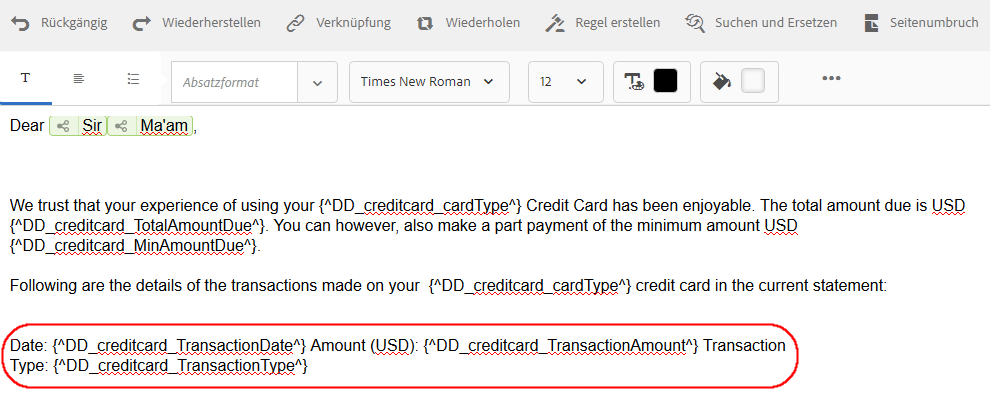

   ```javascript
   Date: {^DD_creditcard_TransactionDate^} Amount (USD): {^DD_creditcard_TransactionAmount^} Transaction Type: {^DD_creditcard_TransactionType^}
   ```

   Das Rendern einer gut formatierten Umsatzabrechnung ist jedoch noch nicht abgeschlossen. Wenn Sie einen Brief rendern, basierend auf bereits ausgeführten Schritten, wird er wie folgt angezeigt:

   

   Um den statischen Text zusammen mit den DD-Elementen zu wiederholen, müssen Sie die Wiederholen-Funktion anwenden, wie in den weiteren Schritten erläutert wird.

1. Wählen Sie den statischen Text sowie die DD-Elemente, die Sie wiederholen möchten, wie unten gezeigt:

   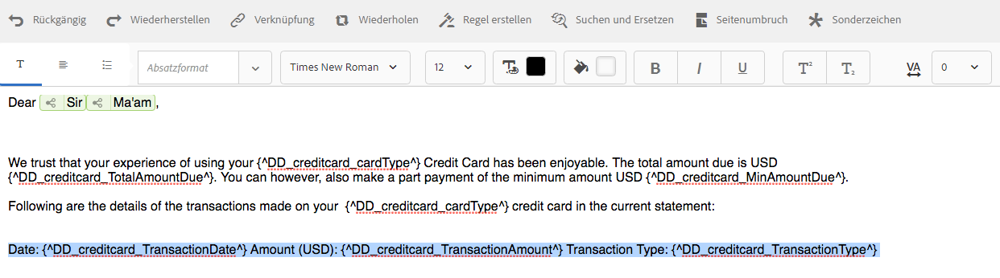

1. Tippen Sie auf **Wiederholen**. Das Dialogfeld „Wiederholen“ wird mit einer leeren Inline-Bedingung angezeigt.

   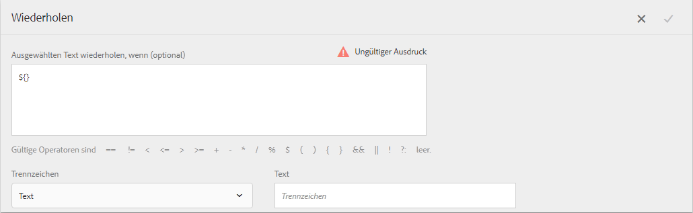

1. Falls erforderlich, fügen Sie eine Bedingung ein, um die Transaktionen zu rendern, wie zum Beispiel um Transaktionsbeträge größer als 50 Cent zu rendern:

   ```javascript
   ${DD_creditcard_TransactionAmount > 0.5}
   ```

   Andernfalls, wenn Sie die Informationen (hier Transaktionen) nicht selektiv rendern, halten Sie die Bedingung leer, indem Sie Folgendes im Dialog löschen: `${}`. Das Speichern eines Wiederholungsausdrucks wird aktiviert, wenn das Fenster für den Wiederholungsausdruck entweder leer ist (ohne ${}, wenn keine Wiederholung erforderlich ist) oder wenn es eine gültige Bedingung für die Wiederholung enthält.

1. Wählen Sie ein Trennzeichen für die Formatierung von dynamischen Texten aus und tippen Sie auf das Häkchen, um die zu speichern:

   * **Zeilenumbruch:** Einfügen eines Zeilenumbruchs nach jedem Transaktionseintrag im Ausgabebrief.
   * **Text:** Fügt das angegebene Textzeichen nach jedem Transaktionseintrag in den Ausgabebrief ein.

   Nachdem Sie die Bedingung eingefügt haben, wird der Text mit Wiederholung rot hervorgehoben und ein Ziehgriff wird auf der linken Seite angezeigt. Sie können die Maus über dem Ziehgriff auf der linken Seite der Wiederholung bewegen, um das Wiederholungskonstrukt anzuzeigen.

   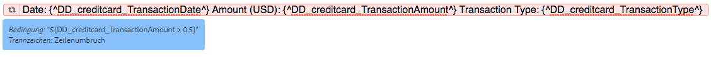

   Sie können auf den Ziehgriff tippen, um das Popupmenü der Wiederholung anzuzeigen, die es Ihnen ermöglicht, das Wiederholungskonstrukt zu bearbeiten oder zu entfernen.

   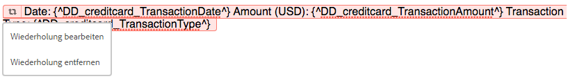

1. Zeigen Sie den relevanten Brief in der Vorschau an und Sie werden bemerken, dass der Text gemäß der Wiederholen-Funktion gerendert wird. Sie können den Wert der DD-Elemente mit Folgendem eingeben:

   * Eine XML-Beispieldatendatei, die basierend auf dem relevanten Datenwörterbuch erstellt wurde, während der Brief mit Beispieldaten in der Vorschau angezeigt wird
   * Eine XML-Datendatei, am relevanten Datenwörterbuch angehängt ist.

   Weitere Informationen finden Sie unter [Datenwörterbuch](https://helpx.adobe.com/aem-forms/6-2/data-dictionary.html).

   

   Die statischen Textwiederholungen mit den Transaktionsdetails. Die Wiederholung von statischem Text wird durch die Wiederholung des Textes in diesem Verfahren erleichtert. Die Bedingung ${DD_creditcard_TransactionAmount > 0.5} stellt sicher, dass die Transaktionen unter USD .5 nicht in dem Brief gerendert werden.

   >[!NOTE]
   >
   >Sie können die Bedingung und Wiederholung nur beim Erstellen oder Bearbeiten des relevanten Textmoduls einfügen. Beim Anzeigen des Briefs in der Vorschau können Sie keine Bedingung oder Wiederholung einfügen, obwohl Sie Bearbeitungen am Textmodul durchführen können.

## Verwenden der Inline-Bedingung und Wiederholung - einige Anwendungsfälle  {#using-inline-condition-and-repeat-some-use-cases}

### Wiederholen innerhalb der Bedingung {#repeat-within-condition}

Sie müssen die Bedingung möglicherweise innerhalb einer Bedingung verwenden. Correspondence Management ermöglicht es Ihnen, die Wiederholung innerhalb eines Inline-Bedingungskonstruktes zu verwenden.

Zum Beispiel ist Folgendes eine Wiederholung (rot formatiert) innerhalb einer Bedingung (grün formatiert).

Während die Wiederholung die Kreditkartentransaktionen rendert, stellt die Bedingung ${DD_creditcard_nooftransactions > 0} sicher, dass das Wiederholungskonstukt nur dann gerendert wird, wenn es mindestens eine Transaktion gibt.

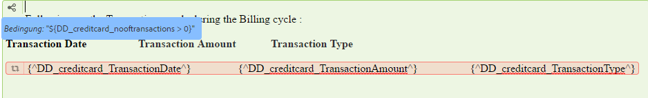

Entsprechend Ihren Anforderungen können Sie auch Folgendes erstellen:

* Eine oder mehrere Bedingungen innerhalb einer Bedingung
* Eine oder mehrere Bedingungen innerhalb einer Wiederholung
* Eine Kombination von Bedingungen und Wiederholungen innerhalb einer Bedingung oder Wiederholung

### Leere Inline-Bedingung  {#empty-inline-condition}

Möglicherweise müssen Sie leere Inline-Bedingungen einfügen und Text und DD-Elemente später einbetten. Correspondence Management ermöglicht es Ihnen.

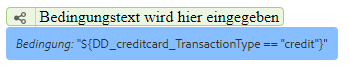

Es wird jedoch empfohlen, dass Sie, wenn möglich, den Text und die DD-Elemente zuerst in das Textmodul mit der beabsichtigten Formatierung einfügen, wie Aufzählungspunkte, und danach eine Inline-Bedingung anwenden.
