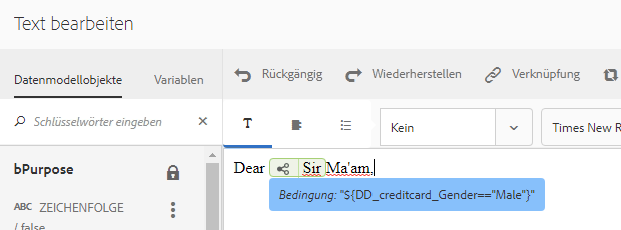

# Inline-Bedingung und Wiederholung in der interaktiven Kommunikation und in Briefen{#inline-condition-and-repeat-in-interactive-communications-and-letters}

## Inline-Bedingungen {#inline-conditions}

Mit AEM Forms können Sie Inline-Bedingungen in Textmodulen verwenden, um die Wiedergabe von Text zu automatisieren, der vom Kontext oder den Daten abhängt, die mit dem Formulardatenmodell (in der interaktiven Kommunikation) oder dem Datenwörterbuch (in Briefen) verknüpft sind. Die Inline-Bedingung zeigt bestimmten Inhalt an, je nachdem, ob die Auswertung der Bedingung wahr oder falsch ist.

Bedingungen führen Berechnungen zu Datenwerten durch, die vom Formulardatenmodell/Datenwörterbuch oder von Endbenutzern bereitgestellt werden. Durch die Verwendung von Inline-Bedingungen können Sie Zeit sparen und menschliche Fehler reduzieren und gleichzeitig eine stark kontextbezogene und personalisierte interaktive Kommunikation/-Briefe erstellen.

Weitere Informationen finden Sie unter:

* [Erstellen einer interaktiven Kommunikation](../../forms/using/create-interactive-communication.md)
* [Correspondence Management – Zusammenfassung](/help/forms/using/cm-overview.md)
* [Text in interaktiven Kommunikationen](../../forms/using/texts-interactive-communications.md)

### Beispiel: Verwenden von Regeln zum Konditionieren von Inline-Text in der interaktiven Kommunikation {#example-using-rules-to-conditionalize-inline-text-in-interactive-communication}

Um einen Satz, einen Absatz oder eine Zeichenfolge von Text in einer interaktiven Kommunikation mit Bedingungen zu versehen, können Sie eine Regel im entsprechenden Textdokumentfragment erstellen. Im folgenden Beispiel wird eine Regel verwendet, um nur den US-Empfängern der interaktiven Kommunikation eine gebührenfreie Nummer anzuzeigen.

Weitere Informationen finden Sie unter „Regel im Text erstellen“ in [Texte in interaktiven Kommunikationen](../../forms/using/texts-interactive-communications.md).

Sobald Sie das Textfragment in eine interaktive Kommunikation eingefügt haben und der Agent die Benutzeroberfläche des Agenten verwendet, um eine interaktive Kommunikation vorzubereiten, werden die Daten des Formulardatenmodells für die Empfänger ausgewertet, und der Text wird nur für Empfänger in den USA angezeigt.

### Beispiel: Verwendung der Inline-Bedingung in einem Brief zum Rendern der entsprechenden Adresse  {#example-using-inline-condition-in-a-letter-to-render-the-appropriate-address}

Sie können eine Inline-Bedingung in einen Brief einfügen, indem Sie die Inline-Bedingung in das entsprechende Textmodul einfügen. Im folgenden Beispiel werden zwei Bedingungen verwendet, um die entsprechende Adresse, Sir oder Ma&#39;am, in einem Brief zu bewerten und anzuzeigen, der auf dem DD-Element Geschlecht basiert. Mit ähnlichen Schritten können Sie weitere Bedingungen erstellen.

>[!NOTE]
>
>Wenn Ihre vorhandenen Assets alte Bedingungs-/Wiederholungsausdrücke einbeziehen (vor 6.2 SP1 CFP 4), zeigen die Assets die alte Syntax der Bedingung und Wiederholung an. Allerdings funktioniert die Bedingung oder Wiederholung. Die neuen und alten Bedingungs- oder Wiederholungsausdrücke sind miteinander kompatibel, um eine verschachtelte Mischung aus alten und neuen Bedingungs-/Wiederholungsausdrücken erstellen zu können.

1. Wählen Sie im entsprechenden Textmodul den Textteil aus, für den Sie Bedingungen festlegen möchten, und tippen Sie auf **Bedingung**.

   

   Das Dialogfeld „Bedingung“ wird mit einer leeren Bedingung angezeigt.

   

   >[!NOTE]
   >
   >Leerer oder ungültiger Bedingungsausdruck kann nicht gespeichert werden. Damit der Ausdruck gespeichert werden kann, muss `${}` einen gültigen Bedingungsausdruck enthalten.

1. Führen Sie die folgenden Schritte aus, um eine Bedingung für die Bewertung zu erstellen, ob der ausgewählte/bedingte Text im Brief angezeigt wird, und tippen Sie dann auf das Häkchen, um den Ausdruck zu speichern:

   Doppeltippen Sie auf ein DD-Element, um es in die Bedingung einzufügen. Fügen Sie den entsprechenden Operator ein und erstellen Sie die folgende Bedingung im Dialogfeld.

   ```javascript
   ${DD_creditcard_Gender=="Male"}
   ```

   Weitere Informationen zum Erstellen eines Ausdrucks finden Sie unter **Erstellen von Ausdrücken und Remote-Funktionen mit dem Ausdrucksgenerator** im [Ausdrucksgenerator](../../forms/using/expression-builder.md). Der im Ausdruck angegebene Wert muss für das Element im Datenwörterbuch unterstützt werden. Weitere Informationen finden Sie unter [Datenwörterbuch](../../forms/using/data-dictionary.md).

   Sobald die Bedingung eingefügt wurde, können Sie den Mauszeiger über den Griff auf der linken Seite der Bedingung bewegen, um die Bedingung anzuzeigen. Sie können auf den Handle tippen, um das Popup-Menü der Bedingung anzuzeigen, mit dem Sie die Bedingung bearbeiten oder entfernen können.

    

1. Fügen Sie ähnliche Bedingungen ein, indem Sie den Text `Ma'am` auswählen.

   ```javascript
   ${DD_creditcard_Gender == "Female"}
   ```

1. Zeigen Sie eine Vorschau des relevanten Briefs an und beachten Sie, dass der Text gemäß der Inline-Bedingung gerendert wird. Sie können den Wert des DD-Elements Geschlecht wie folgt eingeben:

   * Eine XML-Musterdatendatei, die basierend auf dem relevanten Datenwörterbuch erstellt wurde, während der Brief mit Beispieldaten in der Vorschau angezeigt wird.
   * Eine XML-Datendatei, die an das relevante Datenwörterbuch angehängt ist.

   Weitere Informationen finden Sie unter [Datenwörterbuch](../../forms/using/data-dictionary.md).

   

## Wiederholen {#repeat}

Sie haben möglicherweise dynamische Daten in Ihren interaktiven Kommunikationen/Briefen, z. B. Transaktionen in einem Kreditkartenauszug, in der Instanz oder Vorkommen, die sich mit jedem erstellten Brief ändern können. Mit der Wiederholungsfunktion können Sie solche dynamische Daten in Ihrem Textdokumentenfragment formatieren und strukturieren.

Außerdem können Sie eine Regel/Bedingung innerhalb des Wiederholungskonstrukts angeben, um die Daten/Einträge mit einer Bedingung zu versehen, die in der interaktiven Kommunikation/im Brief gerendert werden.

### Beispiel: Verwenden der Wiederholungsfunktion in einem Brief, um eine Liste von Kreditkartentransaktionen zu formatieren, strukturieren und anzuzeigen {#example-using-repeat-in-an-interactive-communication-to-format-structure-and-display-a-list-of-credit-card-transactions}

Im folgenden Beispiel erfahren Sie, wie Sie die Wiederholung verwenden, um die Kreditkartentransaktionen in einer interaktiven Kommunikation zu strukturieren und zu rendern.

1. Fügen Sie in ein auf einem Formulardatenmodell basierendes Textdokumentfragment die relevanten Formulardatenmodellobjekte (und den eingebetteten Text, der für die Beschriftungen erforderlich ist, wie in diesem Beispiel) ein:

   

   >[!NOTE]
   >
   >Der wiederholbare Inhalt muss mindestens eine Eigenschaft des Typs Sammlung enthalten.

1. Wählen Sie den Inhalt aus, auf den die Wiederholung angewendet werden soll.

   

1. Tippen Sie auf „Wiederholen“.

   Das Dialogfeld „Wiederholung“ wird angezeigt.

   

1. Wählen Sie Zeilenumbruch als Trennzeichen und tippen Sie ggf. auf „Bedingung hinzufügen“, um eine Regel zu erstellen. Sie können auch Text als Trennzeichen verwenden und die Textzeichen angeben, die als Trennzeichen verwendet werden sollen.

   Das Dialogfeld „Regel erstellen“ wird angezeigt. 

1. Erstellen Sie eine Regel, um die Transaktionen anzuzeigen, die nach dem 28. Februar 2018 datiert sind, damit nur die Transaktionen für den Monat März in die interaktive Kommunikation einbezogen werden.

   >[!NOTE]
   >
   >In diesem Beispiel wird davon ausgegangen, dass der Agent die Anweisung Ende März 2018 erstellt. Andernfalls können Sie eine weitere Regel erstellen, um Transaktionen vor 2018-04-01 einzubeziehen und Transaktionen nach März 2018 auszuschließen.

   

1. Speichern Sie die Bedingung/Regel und speichern Sie dann die Wiederholung. Bedingte Wiederholung wird auf den ausgewählten Inhalt angewendet.

   

   Wenn Sie die Maus darüber bewegen, zeigt das Textdokumentfragment die Bedingung und das Trennzeichen an, die in der auf den Inhalt angewendeten Wiederholung verwendet werden.

1. Speichern Sie das Textdokumentfragment und zeigen Sie eine Vorschau der relevanten interaktiven Kommunikation an. Abhängig von den Daten im Formulardatenmodell werden die Transaktionsdetails durch die Wiederholung, die auf die Elemente angewendet wird, ähnlich wie in der folgenden Vorschau dargestellt:

   

### Beispiel: Verwendung der Wiederholung in einem Brief zur Formatierung, Struktur und Anzeige einer Liste von Kreditkartentransaktionen {#example-using-repeat-in-a-letter-to-format-structure-and-display-a-list-of-credit-card-transactions}

Im folgenden Beispiel erfahren Sie, wie Sie mithilfe der Wiederholung die Kreditkartentransaktionen in einem Brief strukturieren und rendern. Mit ähnlichen Schritten können Sie die Wiederholung in einem anderen Szenario verwenden.

1. Öffnen Sie (beim Bearbeiten oder Erstellen) ein Textmodul mit DD-Elementen, die wiederholte/dynamische Daten rendern und den erforderlichen Text um die DD-Elemente einbetten. Beispielsweise verfügt ein Textmodul über die folgenden DD-Elemente, um eine Transaktionsabrechnung auf einer Kreditkarte zu erstellen:

   ```javascript
   {^DD_creditcard_TransactionDate^} {^DD_creditcard_TransactionAmount^}
   {^DD_creditcard_TransactionType^}
   ```

   Diese DD-Elemente geben eine Liste der auf der Kreditkarte getätigten Transaktionen mit den folgenden Informationen wieder:

   Transaktionsdatum, Transaktionsbetrag und Transaktionstyp (Schuld oder Kredit)

1. Betten Sie den Text in die DD-Elemente ein, um die Anweisung lesbarer zu machen, z. B.:

   

   ```javascript
   Date: {^DD_creditcard_TransactionDate^} Amount (USD): {^DD_creditcard_TransactionAmount^} Transaction Type: {^DD_creditcard_TransactionType^}
   ```

   Die Aufgabe, eine gut formatierte Anweisung zu rendern, ist jedoch noch nicht abgeschlossen. Wenn Sie einen Brief basierend auf der bisher durchgeführten Arbeit rendern, wird er wie folgt angezeigt:

   

   Um den statischen Text zusammen mit den DD-Elementen zu wiederholen, müssen Sie eine Wiederholung wie in den weiteren Schritten beschrieben anwenden.

1. Wählen Sie den statischen Text sowie die DD-Elemente aus, die Sie wiederholen möchten, wie unten dargestellt:

   

1. Tippen Sie auf **Wiederholen**. Das Dialogfeld „Wiederholung“ wird mit einer leeren Inline-Bedingung angezeigt.

   

1. Falls erforderlich, fügen Sie eine Bedingung ein, um Transaktionen selektiv zu rendern, zum Beispiel um Transaktionsbeträge größer als 50 Cent zu rendern:

   ```javascript
   ${DD_creditcard_TransactionAmount > 0.5}
   ```

   Andernfalls, wenn Sie die Informationen (hier Transaktionen) nicht selektiv rendern müssen, lassen Sie die Bedingung leer, indem Sie im Dialogfeld Folgendes löschen: `${}`. Das Speichern eines Wiederholungsausdrucks wird aktiviert, wenn das Fenster für den Wiederholungsausdruck leer ist (ohne ${} wenn keine Wiederholung erforderlich ist) oder wenn sie eine gültige Bedingung für die Wiederholung enthält.

1. Wählen Sie ein Trennzeichen zur Formatierung des dynamischen Texts aus und tippen Sie zum Speichern auf das Häkchen:

   * **Zeilenumbruch**: Fügt nach jedem Transaktionseintrag im Ausgabebrief einen Zeilenumbruch ein.
   * **Text**: Fügt das angegebene Textzeichen nach jedem Transaktionseintrag im Ausgabebrief ein.

   Sobald die Bedingung eingefügt wurde, wird der Text mit Wiederholung rot hervorgehoben und links wird ein Ziehpunkt angezeigt. Sie können den Mauszeiger über den Griff auf der linken Seite der Wiederholung bewegen, um das Wiederholungskonstrukt anzuzeigen.

   

   Sie können auf den Handle tippen, um das Popup-Menü der Wiederholung anzuzeigen, mit dem Sie das Wiederholungskonstrukt bearbeiten oder entfernen können.

   

1. Sehen Sie sich den relevanten Brief in der Vorschau an und beachten Sie, dass der Text wiederholt wiedergegeben wird. Sie können den Wert von DD-Elementen wie folgt eingeben:

   * Eine XML-Musterdatendatei, die basierend auf dem relevanten Datenwörterbuch erstellt wurde, während der Brief mit Beispieldaten in der Vorschau angezeigt wird.
   * Eine XML-Datendatei, die an das relevante Datenwörterbuch angehängt ist.

   Weitere Informationen finden Sie unter [Datenwörterbuch](https://helpx.adobe.com/de/aem-forms/6-2/data-dictionary.html).

   

   Die statischen Textwiederholungen mit den Transaktionsdetails. Das Wiederholen von statischem Text wird durch die Wiederholung, die auf den Text in diesem Prozess angewendet wird, erleichtert. Die Bedingung, ${DD_creditcard_TransactionAmount > 0.5}stellt sicher, dass die Transaktionen unter USD .5 nicht im Brief gerendert werden.

   >[!NOTE]
   >
   >Sie können Bedingungen einfügen und nur wiederholen, während Sie das relevante Textmodul erstellen oder bearbeiten. Bei der Vorschau des Briefs können Sie zwar Änderungen am Textmodul vornehmen, jedoch keine Bedingung oder Wiederholung einfügen.

## Verwendung von Inline-Bedingung und Wiederholung - einige Anwendungsfälle  {#using-inline-condition-and-repeat-some-use-cases}

### Wiederholen innerhalb der Bedingung {#repeat-within-condition}

Unter Umständen müssen Sie die Wiederholung innerhalb einer Bedingung verwenden. Mit Correspondence Management können Sie die Wiederholung innerhalb eines Inline-Bedingungskonstrukts verwenden.

Folgendes ist beispielsweise eine Wiederholung (rot formatiert) innerhalb einer Bedingung (grün formatiert).

Während die Wiederholung die Kreditkartentransaktionen rendert, wird die Bedingung ${DD_creditcard_nooftransactions > 0} stellt sicher, dass das Wiederholungskonstrukt nur gerendert wird, wenn mindestens eine Transaktion vorliegt.


Entsprechend Ihren Anforderungen können Sie Folgendes erstellen:

* Eine oder mehrere Bedingungen innerhalb einer Bedingung
* Eine oder mehrere Bedingungen innerhalb einer Wiederholung
* Kombination von Bedingungen und Wiederholung innerhalb einer Bedingung oder Wiederholung

### Leere Inline-Bedingung {#empty-inline-condition}

Möglicherweise müssen Sie später leere Inline-Bedingungen einfügen und Text und DD-Elemente einbetten. Correspondence Management ermöglicht Ihnen dies.


Es wird jedoch empfohlen, dass Sie, wenn möglich, den Text und die DD-Elemente zuerst in das Textmodul mit der beabsichtigten Formatierung einfügen, wie Aufzählungspunkte, und danach eine Inline-Bedingung anwenden.
