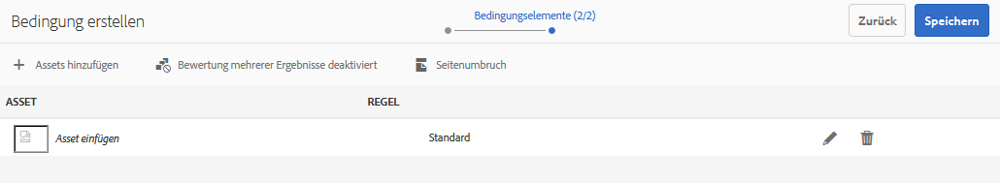
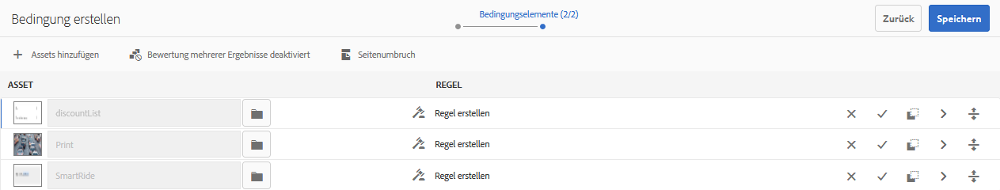
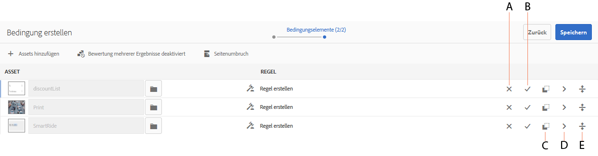
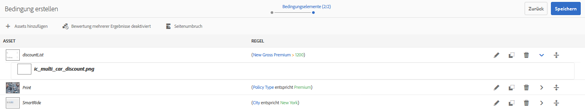
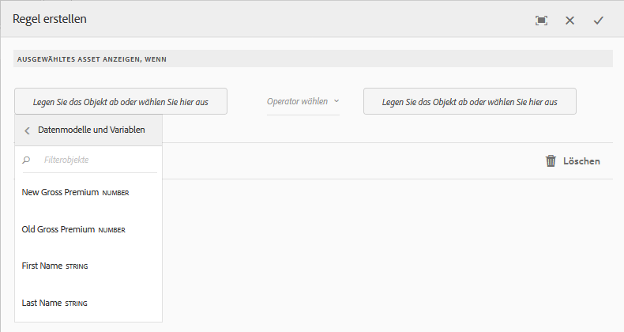
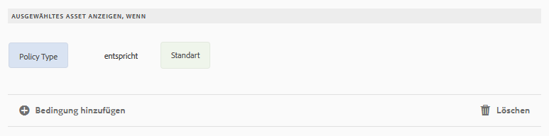
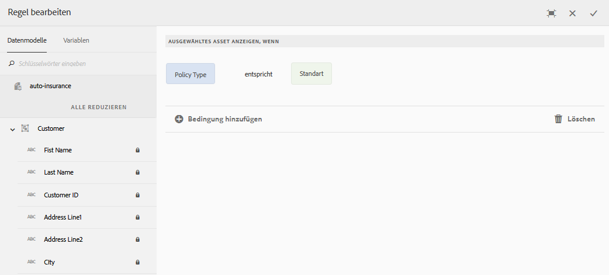
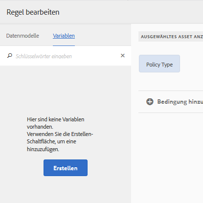

# Bedingungen in interaktiver Kommunikation{#conditions-in-interactive-communications}

Erstellen und Bearbeiten von Bedingungsfragmenten zur Verwendung in interaktiver Kommunikation. Bedingung ist eine der vier Arten von Dokumentfragmenten, die zum Erstellen von interaktiver Kommunikation verwendet werden. Die anderen drei sind Texte, Listen und Layoutfragmente.

## Überblick {#overview}

Bedingung ist ein Dokumentfragment, das Sie in eine interaktive Kommunikation einfügen können. Die anderen Dokumentfragmente sind [Text](../../forms/using/texts-interactive-communications.md), Liste und Layout-Fragment. Mithilfe von Bedingungen können Sie ein oder mehrere kontextbezogene Elemente definieren, die basierend auf den bereitgestellten Daten und Regeln in eine interaktive Kommunikation einbezogen werden.

Beispiele:

* Zeigen Sie in einer Kreditkartenabrechnung die Kreditkarten-Jahresgebühr und das Kreditkartenabbild basierend auf der Art der Kreditkarte des Kunden an.
* Zeigen Sie in einer fälligen Versicherungsprämie die Steuerberechnungen basierend auf den Steuern des Kunden an.

Die Assets in den Bedingungen, die basierend auf den angewendeten Regeln und den an die Regel übergebenen Werten gerendert werden. Die Regeln in den Bedingungen können Werte in den folgenden Datentypen prüfen:

* Eigenschaft des zugeordneten Formulardatenmodells
* Alle Variablen, die Sie in der Bedingung erstellen
* Zeichenfolgen
* Zahlen
* Mathematischer Ausdrücke
* Datumswerte

## Bedingung erstellen {#createcondition}

1. Wählen Sie **[!UICONTROL Formulare]** > **[!UICONTROL Dokumentfragmente]**.
1. Wählen Sie **[!UICONTROL Erstellen]** > **[!UICONTROL Bedingung]**.
1. Geben Sie die folgenden Daten an:

   * **[!UICONTROL Titel]**: (Optional) Geben Sie den Titel für die Bedingung ein. Titel müssen nicht eindeutig sein und dürfen Sonderzeichen und nichtenglische Zeichen enthalten. Bedingungen werden durch ihren Titel (falls verfügbar) wie etwa in Miniaturen und Eigenschaften referenziert.
   * **[!UICONTROL Name]**: Der eindeutige Name für die Bedingung in einem Ordner. Es ist nicht möglich, dass zwei Dokumentfragmente (Text, Bedingung oder Liste) mit demselben Namen vorhanden sind, ungeachtet ihres jeweiligen Status. Im Feld „Name“ können Sie nur englische Sprachzeichen, Zahlen und Bindestriche eingeben. Das Feld „Name“ wird automatisch basierend auf dem Feld „Titel“ ausgefüllt. Die im Feld &quot;Titel&quot;eingegebenen Sonderzeichen, Leerzeichen, Zahlen und nichtenglischen Zeichen werden durch Bindestriche im Feld &quot;Name&quot;ersetzt. Obwohl der Wert im Feld „Titel“ automatisch in das Feld „Name“ kopiert wird, können Sie den Wert bearbeiten.

   * **[!UICONTROL Beschreibung]**: Geben Sie eine Beschreibung der Dokumentfragmente ein.
   * **[!UICONTROL Formulardatenmodell]**: Wählen Sie optional das Optionsfeld „Formulardatenmodell“ aus, um die Bedingung basierend auf einem Formulardatenmodell zu erstellen. Wenn Sie auf die Optionsschaltfläche &quot;Formulardatenmodell&quot;klicken, wird das Feld **[!UICONTROL Formulardatenmodell]** angezeigt. Suchen Sie ein Formulardatenmodell und wählen Sie es aus. Stellen Sie beim Erstellen der Bedingung für eine interaktive Kommunikation sicher, dass Sie dasselbe Datenmodell verwenden, das Sie in der interaktiven Kommunikation verwenden möchten. Weitere Informationen zum Formulardatenmodell finden Sie unter [Datenintegration](../../forms/using/data-integration.md).

   * **[!UICONTROL Tags]**: Um optional einen benutzerdefinierten Tag zu erstellen, geben Sie einen Wert in das Textfeld ein und drücken Sie die Eingabetaste. Wenn Sie diese Bedingung speichern, werden die neu hinzugefügten Tags auch erstellt.

1. Tippen Sie auf **[!UICONTROL Weiter]**.

   Die Seite „Bedingung erstellen“ wird angezeigt.

   

1. Tippen Sie auf **[!UICONTROL Assets hinzufügen]**.

   Die Seite „Assets auswählen“ wird angezeigt und zeigt die verfügbaren Texte, Listen, Bedingungen und Bilder an, die in der Bedingung hinzugefügt werden können.

   >[!NOTE]
   >
   >Nur nicht-basierte, neu erstellte Assets und FDM-basierte Assets (erstellt mit demselben FDM wie die zu erstellende Bedingung) werden auf der Seite „Assets auswählen“ angezeigt.

1. Tippen Sie auf die entsprechenden Assets, um sie in die Bedingung aufzunehmen, und tippen Sie dann auf **[!UICONTROL Fertig]**.

   Die Seite „Bedingung erstellen“ wird angezeigt und listet die hinzugefügten Assets auf.

   

   Sie können die folgenden Optionen verwenden, um Assets in einer Bedingung zu verwalten:

   

   **[] AReject-Änderung.** Tippen Sie auf dieses Symbol, um die Änderungen abzulehnen, die Sie möglicherweise an dem Asset und der Regel in der Bedingung vorgenommen haben.
   **[BAccept ] Change.** Tippen Sie auf dieses Symbol, um die Änderungen zu akzeptieren, die Sie an dem Asset und der Regel in der Bedingung vorgenommen haben.
   **[Asset ] CDuplizieren.**Tippen Sie auf dieses Symbol, um eine Kopie des Assets zusammen mit der angewendeten Regel (falls vorhanden) in der Bedingung zu erstellen. Anschließend können Sie die Regel und das Asset für das duplizierte Asset bearbeiten. Das Duplizieren eines Assets ist nützlich, um ähnliche Regeln zum Anzeigen alternativer Assets basierend auf einem bestimmten Kontext zu erstellen.
   **[Vorschau ] DShow.** Tippen Sie auf dieses Symbol, um auf der Seite „Bedingungen erstellen/bearbeiten“ eine Vorschau des Assets anzuzeigen.
   **&#39;server&#39; neu anordnen.** Tippen und halten Sie dieses Symbol, um Assets per Drag &amp; Drop in einer Bedingung neu anzuordnen.

   Sie können mithilfe der folgenden Optionen festlegen, wie sich die Bedingung zur Laufzeit verhält:

   * **Bewertung mehrerer Ergebnisse deaktiviert/Bewertung mehrerer Ergebnisse aktiviert**: Wenn diese Option aktiviert ist (angezeigt als „Bewertung mehrerer Ergebnisse aktiviert”), werden alle Bedingungen ausgewertet und das Ergebnis ist die Summe aller Bedingungen, die den Status „true“ haben. Wenn diese Option deaktiviert ist (angezeigt als „Bewertung mehrerer Ergebnisse deaktiviert“), wird nur die erste Bedingung, die „true“ ergibt, ausgewertet und wird zur Ausgabe der Bedingung.

   * **Seitenumbruch**: Wählen Sie diese Option (&quot; &quot;), um zwischen den Assets der Bedingungen einen Seitenumbruch hinzuzufügen. Wenn diese Option nicht ausgewählt ist ( ) und eine Bedingung in der Druckausgabe auf die nächste Seite überläuft, wird die gesamte Bedingung auf die nächste Seite verschoben, anstatt die Seite zwischen den Assets in der Bedingung zu wechseln.

1. Tippen Sie auf **[!UICONTROL Regel erstellen]**, um Regeln hinzuzufügen, um die Assets nach Bedarf ein- oder auszublenden. Um Variablen in den Regeln zu verwenden, siehe [Erstellen von Variablen](#variables). Weitere Informationen finden Sie unter: [Hinzufügen von Regeln zur Bedingung](#ruleeditor).

   Die erstellten Regeln erscheinen in der Spalte REGEL im Bildschirm „Bedingung erstellen“.

   

   >[!NOTE]
   >
   >Sie können Assets in Ihre Bedingung einfügen, für die bereits Regeln oder Wiederholungen gelten.

1. Tippen Sie auf **[!UICONTROL Speichern]**.

   Die Bedingung wird erstellt. Jetzt können Sie die Bedingung als Baustein verwenden, während Sie eine interaktive Kommunikation erstellen.

   >[!NOTE]
   >
   >Um eine neue oder bearbeitete Bedingung zu speichern, müssen Sie mindestens eine Regel für jedes der in der Bedingung hinzugefügten Assets haben.

## Bearbeiten einer Bedingung {#edit-a-condition}

Sie können eine Bedingung mithilfe der folgenden Schritte bearbeiten. Sie können eine Bedingung auch in einer interaktiven Kommunikation bearbeiten, indem Sie im Popupmenü &quot;Fragment bearbeiten&quot;wählen.

1. Wählen Sie **[!UICONTROL Formulare]** > **[!UICONTROL Dokumentfragmente]**.
1. Navigieren Sie zu der Bedingung und wählen Sie sie aus.
1. Tippen Sie auf **[!UICONTROL Bearbeiten]**.
1. Nehmen Sie die erforderlichen Änderungen an der Bedingung vor. Weitere Informationen zu den Informationen, die Sie in einer Bedingung ändern können, finden Sie unter [Bedingung erstellen](#createcondition).
1. Tippen Sie auf **[!UICONTROL Speichern]** und dann auf **[!UICONTROL Schließen]**.

## Erstellen von Regeln in der Bedingung {#ruleeditor}

Wenn Sie den Regeleditor in einer Bedingung verwenden, können Sie Regeln zum Anzeigen oder Ausblenden von Assets, basierend auf **Vorgabebedingungen**, erstellen. Diese Bedingungen können basierend auf Folgendem erstellt werden:

* Zeichenfolgen
* Zahlen
* Mathematischer Ausdrücke
* Datumswerte
* Eigenschaft des zugeordneten Formulardatenmodells
* Beliebige [Variablen](#variables), die Sie erstellt haben.

### Regel in der Bedingung erstellen  {#create-rule-in-condition}

1. Tippen Sie beim Erstellen oder Bearbeiten einer Bedingung auf das  (Regeleditor)-Symbol für das relevante Asset.

   Das Dialogfeld zum Erstellen der Regel wird angezeigt. Zusätzlich zu Zeichenfolge, Zahl, mathematischem Ausdruck und Datum stehen im Regeleditor folgende Regeln zum Erstellen von Anweisungen der Regeln zur Verfügung:

   * Eigenschaft des zugeordneten Formulardatenmodells
   * Beliebige [Variablen](#variables), die Sie erstellt haben.

   

   Wählen Sie die geeignete Option aus, die ausgewertet werden soll.

   >[!NOTE]
   >
   >Die Sammlungseigenschaft wird nicht zum Erstellen von Regeln zum Anzeigen von Assets unterstützt. 

1. Wählen Sie den entsprechenden Operator aus, um die Regel auszuwerten, z. B. Gleich ist, Enthält und Beginnt mit.
1. Fügen Sie den auswertenden Ausdruck, die Zeichenfolge, das Datenmodell, die Eigenschaft, die Variable oder das Datum ein.

   

   Regel, um ein Asset anzuzeigen, wenn der Richtlinientyp „Standard“ ist

   * Beim Erstellen oder Bearbeiten einer Regel können Sie auch auf  (Größe ändern) tippen, um das Dialogfeld Regel erstellen/Regel bearbeiten zu erweitern. Der erweiterte Vollbildansichtsdialog ermöglicht das Erstellen von [Variablen](#variables) zum Erstellen von Regeln. Tippen Sie erneut auf „Größe ändern“, um zum regulären Dialogfeld „Regel erstellen“ zurückzukehren.

   * Sie können auch mehrere Bedingungen in einer Regel erstellen.

1. Tippen Sie auf **[!UICONTROL Fertig]**.

   Die Regel wird auf das Asset angewendet.

## Erstellen und Verwenden von Variablen in einer Bedingung  {#variables}

Beim Erstellen oder Bearbeiten einer Regel in einer Bedingung können Sie auf  (Größe ändern) tippen, um das Dialogfeld Regel erstellen\Regel bearbeiten zu erweitern. Der erweiterte Vollbildansichtsdialog ermöglicht Folgendes:

* Erstellen und Verwenden von Variablen in der Regel
* Ziehen der Eigenschaften und Variablen des Datenmodells per Drag-and-Drop in die Regel

Tippen Sie erneut auf „Größe ändern“, um zum regulären Dialogfeld „Regel erstellen/Regel bearbeiten“ zurückzukehren.

### Variablen erstellen {#create-variables}

1. Beim Erstellen oder Bearbeiten einer Regel in einer Bedingung können Sie auf  (Größe ändern) tippen, um das Dialogfeld Regel erstellen\Regel bearbeiten zu erweitern.

   Der erweiterte Vollbildansichtsdialog erscheint.

   

1. Tippen Sie im linken Bereich auf **[!UICONTROL Variablen]**.

   Der Variablenbereich wird angezeigt.

   

1. Tippen Sie auf **[!UICONTROL Erstellen]**.

   Bereich „Variablen erstellen“ wird angezeigt.

1. Geben Sie die folgenden Informationen ein und tippen Sie auf **[!UICONTROL Erstellen]**:

   * **[!UICONTROL Name]**: Name der Variablen.
   * **[!UICONTROL Beschreibung]**: Geben Sie optional eine Beschreibung der Variablen ein.
   * **[!UICONTROL Typ]**: Wählen Sie einen Variablentyp aus: Zeichenfolge, Zahl, Boolescher Wert oder Datum.
   * **[!UICONTROL Nur bestimmte Werte zulassen]**: Bei Zeichenfolge- und Zahl-Variablen können Sie sicherstellen, dass der Agent aus einem bestimmten Satz von Werten für einen Platzhalter in der Agent-UI auswählt. Um den Satz von Werten anzugeben, wählen Sie diese Option und geben Sie dann kommagetrennte Werte an, die im Feld **[!UICONTROL Werte]** zulässig sind.

1. Tippen Sie auf **[!UICONTROL Erstellen]**.

   Die Variable wird erstellt und im Bereich „Variablen“ aufgelistet.

1. Um eine Variable in die Regel einzufügen, ziehen Sie sie in einen Platzhalter für eine Option in der Regel.
1. Nachdem Sie eine gültige Regel erstellt haben, tippen Sie auf **[!UICONTROL Fertig]**.

   Nehmen Sie ggf. weitere Änderungen in der Bedingung vor, und speichern Sie sie.

