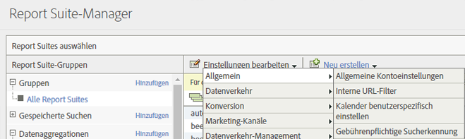
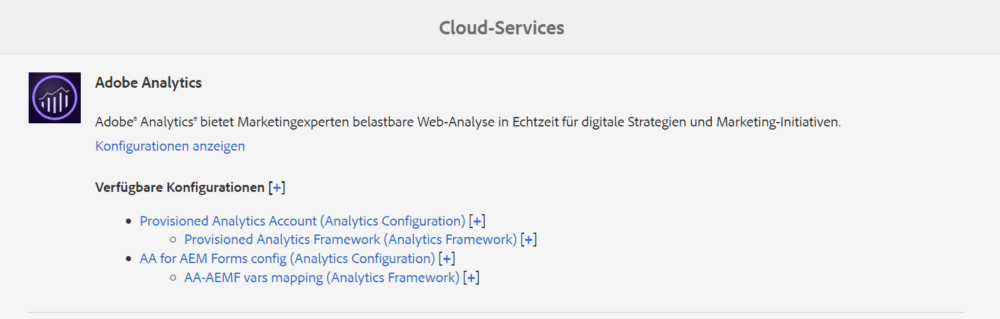
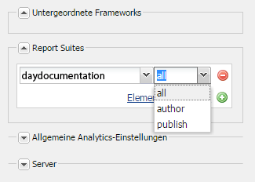
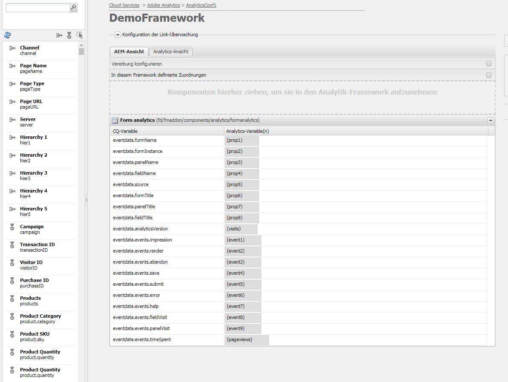
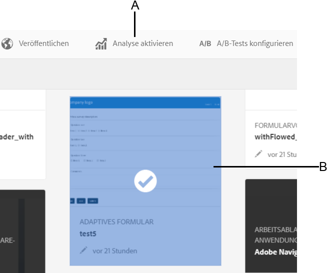

# Konfigurieren von Analytics und Berichten{#configuring-analytics-and-reports}

AEM Forms ermöglicht die Integration in Adobe Analytics, sodass Sie Leistungsmetriken für Ihre veröffentlichten Formulare und Dokumente erfassen und verfolgen können. Ziel dieser Analyse ist es, informierte, auf Daten basierende Entscheidungen zu erforderlichen Formularänderungen treffen zu können, durch die Formulare oder Dokumente benutzerfreundlicher werden.

>[!NOTE]
>
>Die Analysefunktion in AEM Forms ist als Teil des AEM Forms-Add-On-Pakets verfügbar. Weitere Informationen zum Installieren des Add-On-Pakets finden Sie unter [Installieren und Konfigurieren von AEM Forms](../../forms/using/installing-configuring-aem-forms-osgi.md).
>
>Zusätzlich zum Add-On-Paket benötigen Sie ein Adobe Analytics-Konto und Administratorrechte auf der AEM-Instanz. Informationen zur Lösung finden Sie unter [Adobe Analytics](https://www.adobe.com/solutions/digital-analytics.html).

## Überblick {#overview}

Sie können Adobe Analytics verwenden, um Interaktionsmuster und Probleme zu ermitteln, die Benutzer bei der Verwendung adaptiver Formulare, HTML5-Formulare und interaktiver Kommunikation haben. Adobe Analytics ist so vorkonfiguriert, dass Informationen zu den folgenden Parametern nachverfolgt und gespeichert werden:

* **Durchschnittliche Füllzeit**: Durchschnittliche Zeit für das Ausfüllen des Formulars.
* **Ausgaben**: Angabe, wie oft ein Formular geöffnet wurde.
* **Entwürfe**: Angabe, wie oft ein Formular als Entwurf gespeichert wird.
* **Übermittlungen**: Angabe, wie oft ein Formular übermittelt wird.
* **Abbruch**: Gibt an, wie oft Benutzer das Formular wieder verlassen haben, ohne es auszufüllen.

Sie können Adobe Analytics anpassen und Parameter hinzufügen/entfernen. Außer den oben aufgeführten Informationen enthält der Bericht die folgenden Informationen zu jedem Bereich des HTML5- und adaptiven Formulars:

* **Zeit**: Zeit, die im Bedienfeld und in dessen Feldern verbracht wird.
* **Fehler**: Anzahl der Fehler im Bedienfeld und in dessen Feldern.
* **Hilfe**: Anzahl der Hilfeaufrufe eines Benutzers in einem Bedienfeld und in dessen Feldern.

## Erstellen einer Report Suite {#creating-report-suite}

Analysedaten werden in kundenspezifischen Repositorys gespeichert, die als Report Suites bezeichnet werden. Um eine Report Suite zu erstellen und Adobe Analytics zu verwenden, müssen Sie über ein gültiges Adobe Marketing Cloud-Konto verfügen. Stellen Sie vor den nachfolgenden Schritten sicher, dass Sie über ein gültiges Adobe Marketing Cloud-Konto verfügen.

Führen Sie die folgenden Schritte aus, um eine Report Suite zu erstellen: 

1. Melden Sie sich bei [https://sc.omniture.com/login/](https://sc.omniture.com/login/) an.
1. Wählen Sie im Marketing Cloud **Admin** > **Admin Console** > **Report Suites** aus.
1. Wählen Sie im Report Suite-Manager **Neu erstellen** > **Report Suite.**

   

   Erstellen einer neuen Report Suite

1. Stellen Sie sicher, dass in der ersten Dropdown-Liste **Von einer Vorlage erstellen** ausgewählt ist und wählen Sie **Handel**.
1. Suchen Sie das Feld **Report Suite-ID** und fügen Sie eine neue Report Suite-ID hinzu. Beispiel: JJEsquire. Unter dem Feld „Report Suite-ID“ wird eine Report Suite-ID angezeigt. Sie enthält ein automatisches Präfix, bei dem es sich häufig um den Firmennamen handelt.
1. Fügen Sie einen neuen **Website-Titel** hinzu. Beispiel: Erste Schritte mit JJEsquire. Dieser Name wird in der Benutzeroberfläche von Analytics verwendet. Verwenden Sie die Report Suite-ID in Ihrem Code.
1. Wählen Sie im Dropdownmenü eine **Zeitzone** aus. Alle Daten, die in diese Report Suite aufgenommen werden, werden basierend auf der definierten Zeitzone erfasst.
1. Lassen Sie die Felder **Basis-URL** und **Standardseite** leer. Diese beiden Werte werden nur in der Oberfläche der Adobe Marketing Cloud verwendet, um eine Verknüpfung zu Ihrer Website herzustellen.
1. Belassen Sie das Feld **Aufschaltdatum** auf „Heute“. Das Aufschaltdatum bestimmt den Tag, an dem die Report Suite aktiviert wird.
1. Geben Sie in das Feld **Geschätzte Seitenansichten pro Tag** den Wert „100“ ein. Verwenden Sie dieses Feld, um die Anzahl der Seitenansichten zu schätzen, die Sie für Ihre Website pro Tag erwarten. Anhand dieser Schätzung kann Adobe die entsprechende Hardware zur Verarbeitung der gesammelten Daten bereitstellen.
1. Wählen Sie in der Dropdownliste eine **Basiswährung**. Alle Währungsdaten, die bei dieser Report Suite eingehen, werden in dieses Währungsformat konvertiert und darin gespeichert.
1. Klicken Sie auf **„Report Suite erstellen“**. Die Seite sollte nun aktualisiert und eine Meldung angezeigt werden, dass Ihre Report Suite erfolgreich erstellt wurde.
1. Wählen Sie die neu erstellte Report Suite aus. Wählen Sie **Einstellungen bearbeiten** > **Allgemein** > **Allgemeine Kontoeinstellungen**.

   

   Allgemeine Kontoeinstellungen

1. Aktivieren Sie im Bildschirm &quot;Allgemeine Kontoeinstellungen&quot;die Option **Geografische Berichterstellung** und klicken Sie auf **Speichern.**
1. Navigieren Sie zu **Einstellungen bearbeiten** > **Traffic** > **Traffic-Variablen**.
1. Konfigurieren und aktivieren Sie in der Report Suite die folgenden Traffic-Variablen.

   * **formName**: Bezeichner für ein adaptives Formular.
   * **formInstance**: Bezeichner einer Instanz eines adaptiven Formulars. Aktivieren Sie Pfadberichte für diese Variable.
   * **fieldName**: Kennung eines adaptiven Formularfelds. Aktivieren Sie Pfadberichte für diese Variable.
   * **panelName**: Kennung eines Bereichs eines adaptiven Formulars. Aktivieren Sie Pfadberichte für diese Variable.
   * **formTitle**: Titel des Formulars.
   * **fieldTitle**: Titel des Formularfelds.
   * **panelTitle**: Titel des Formularbereichs.
   * **analyticsVersion**: Version der Formular-Analytics.

1. Navigieren Sie zu **Einstellungen bearbeiten** > **Konversion** > **Erfolgsereignisse**. Definieren und aktivieren Sie die folgenden Erfolgsereignisse:

   | Erfolgsereignis | Typ |
   |---|---|
   | abandon | Zähler |
   | render | Zähler |
   | panelVisit | Zähler |
   | fieldVisit | Zähler |
   | Speichern | Zähler |
   | Fehler | Zähler |
   | help | Zähler |
   | submit | Zähler |
   | timeSpent | Nummerisch |

   >[!NOTE]
   >
   >Eine Ereignisnummer und Eigenschaftsnummer, die zur Konfiguration der AEM Forms-Analyse verwendet werden, müssen sich von der Ereignisnummer und der Prop-Nummer unterscheiden, die in der [AEM Analytics](/help/sites-administering/adobeanalytics.md)-Konfiguration verwendet werden.

1. Melden Sie sich bei Ihrem Adobe Marketing Cloud-Konto ab.

## Erstellen einer Cloud-Service-Konfiguration {#creating-cloud-service-configuration}

Bei einer Cloud-Service-Konfiguration handelt es sich um Informationen zu Ihrem Adobe Analytics-Konto. Anhand der Konfiguration kann Adobe Experience Manager (AEM) eine Verbindung zu Adobe Analytics herstellen. Erstellen Sie für jedes verwendete Analytics-Konto eine separate Konfiguration.

1. Melden Sie sich bei Ihrer AEM-Autoreninstanz als Administrator an.
1. Klicken Sie oben links auf **Adobe Experience Manager** > **Tools**  > **Cloud Services** > **Alte Cloud Services**.
1. Suchen Sie das Symbol **Adobe Analytics**. Klicken Sie auf **Konfigurationen anzeigen** und klicken Sie dann auf **[+]**, um eine neue Konfiguration hinzuzufügen.

   Wenn Sie ein Erstbenutzer sind, klicken Sie auf **Jetzt konfigurieren**.

1. Fügen Sie Ihrer neuen Konfiguration einen Titel hinzu (das Ausfüllen des Feldes „Name“ ist optional). Beispiel: „Meine Analytics-Konfiguration“. Klicken Sie auf **Erstellen**.

1. Wenn das Bedienfeld „Bearbeiten“ auf der Konfigurationsseite geöffnet wird, füllen Sie die Felder aus:

   * **Unternehmen**: Der Name Ihres Unternehmens, wie er in Adobe Analytics verwendet wird.
   * **Benutzername**: Der Name, den Sie für die Anmeldung bei Adobe Analytics verwenden.
   * **Kennwort**: Das Adobe Analytics-Kennwort für das obige Konto.
   * **Rechenzentrum**: Das Rechenzentrum Ihres Adobe Analytics-Kontos.

1. Klicken Sie auf **Verbindung zu Analytics herstellen**. In einem Dialogfeld wird bestätigt, dass die Verbindung erfolgreich hergestellt wurde. Klicken Sie auf **OK**.

## Erstellen eines Cloud-Service-Frameworks {#creating-cloud-service-framework}

Bei einem Adobe Analytics-Framework handelt es sich um eine Reihe von Zuordnungen zwischen Adobe Analytics-Variablen und AEM-Variablen. Verwenden Sie ein Framework, um zu konfigurieren, wir Ihre Formulare Daten in Adobe Analytics-Berichte einfügen. Frameworks sind einer Adobe Analytics-Konfiguration zugeordnet. Sie können mehrere Frameworks für jede Konfiguration erstellen.

1. Klicken Sie auf der AEM Cloud-Services-Konsole unter Adobe Analytics auf **Konfigurationen anzeigen.**
1. Klicken Sie auf den Link **[+]** neben Ihrer Analytics-Konfiguration.

   

   Adobe Analytics-Konfiguration

1. Geben Sie einen **Titel** und einen **Namen** für das Framework ein, wählen Sie **Adobe Analytics** Framework und klicken Sie auf **Erstellen**. Das Framework wird zur Bearbeitung geöffnet.
1. Klicken Sie im Seitenbereich im Abschnitt „Report Suites“ auf **Element hinzufügen** und verwenden Sie die Dropdownliste, um die Report Suite-ID auszuwählen (z. B. „JJEsquire“), mit der das Framework interagieren soll.
1. Wählen Sie neben der Report Suite-ID die Server-Instanzen, die Informationen an die Report Suite senden sollen.

   

1. Ziehen Sie eine **Form Analytics-Komponente** aus der **anderen** Kategorie aus dem Sidekick in das Framework.
1. Um Analytics-Variablen solche Variablen zuzuordnen, die in der Komponente definiert sind, ziehen Sie eine Variable aus der AEM-Inhaltssuche auf ein Feld der Nachverfolgungskomponente.

   

1. Aktivieren Sie das Framework über die **Registerkarte „Seite“** im Sidekick und klicken Sie auf **Framework aktivieren**.

## Konfigurieren des Analytics-Konfigurationsservices von AEM Forms {#configuring-aem-forms-analytics-configuration-service}

1. Öffnen Sie in der Autoreninstanz AEM Web Console Configuration Manager unter `https://<server>:<port>;/system/console/configMgr`.
1. AEM Forms Analytics-Konfiguration suchen und öffnen

   

   Analytics-Konfigurationsservice von AEM Forms

1. Legen Sie die entsprechenden Werte für die folgenden Felder fest und klicken Sie auf **Speichern**.

   * **SiteCatalyst-Framework**: Wählen Sie das Framework/die Konfiguration aus, das bzw. die Sie im Abschnitt „Einrichten eines Frameworks für die Verfolgung“ definiert haben.
   * **Verfolgungsgrundlinie der Feldzeit**: Legen Sie die Dauer in Sekunden fest, nach dem der Feldaufruf nachverfolgt werden muss. Der Standardwert ist 0. Ist der Wert größer als 0 (Null), werden zwei separate Verfolgungsereignisse an den Adobe Analytics-Server gesendet. Mit dem ersten Ereignis wird der Analytics-Server angewiesen, die Verfolgung für das Feld beim Verlassen zu beenden. Das zweite Ereignis wird nach Ablauf der angegebenen Zeit gesendet. Das zweite Ereignis weist den Analytics-Server an, mit der Verfolgung des besuchten Felds zu beginnen. Durch die Verwendung zweier separater Ereignisse können Sie präzise messen, wie lange das Feld verwendet wurde. Wenn der Wert 0 (Null) ist, wird ein einzelnes Verfolgungsereignis an den Adobe Analytics-Server gesendet.

   * **Berichtsynchronisierungs-cron für Analytics**: Geben Sie einen cron-Ausdruck für das Abrufen von Berichten aus Adobe Analytics an. Der Standardwert ist 0 0 2 ? * *.

   * **Zeitlimit für Berichtsabruf:** Geben Sie die Dauer in Sekunden an, die auf den Server für den Abruf des Analyseberichts gewartet werden soll. Der Standardwert ist 120 Sekunden.
   >[!NOTE]
   >
   >Es kann bis zu 10 Sekunden länger dauern, bis der Abrufvorgang für den Bericht über die Zeitüberschreitung abgeschlossen ist und dann die angegebene Anzahl von Sekunden.

1. Wiederholen Sie die Schritte 1-3 in der Veröffentlichungsinstanz, um Analysen zu konfigurieren.

Jetzt können Sie Analysen für Formulare aktivieren und einen Analysebericht erstellen.

## Aktivieren der Analyse für ein Formular oder Dokument  {#enabling-analytics-for-a-form-or-document}

1. Melden Sie sich bei AEM Portal unter `https://[hostname]:'port'` an.
1. Klicken Sie auf **Formulare > Formulare und Dokumente**, wählen Sie ein Formular oder ein Dokument aus und klicken Sie auf **Analyse aktivieren**. Die Analyse ist aktiviert.

   

   Aktivieren der Analyse für ein Formular

   **A.** Analytics-Schaltfläche aktivieren  **B.** Ausgewähltes Formular

   Detaillierte Informationen zum Anzeigen von Formularanalyseberichten finden Sie unter [Anzeigen und Verstehen von AEM Forms-Analyseberichten](../../forms/using/view-understand-aem-forms-analytics-reports.md)
