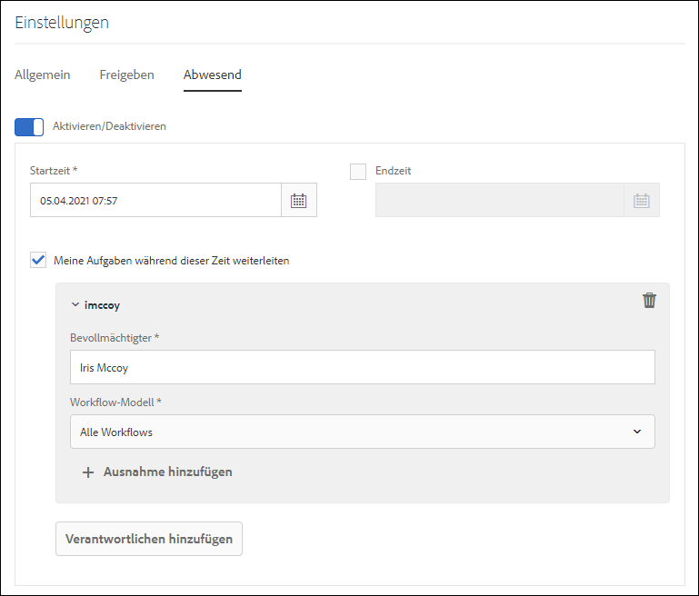

# Abwesenheitseinstellung konfigurieren {#configure-out-of-office-settings}

Wenn Sie planen, abwesend zu sein, können Sie angeben, was mit Artikeln passiert, die Ihnen für diesen Zeitraum zugewiesen werden.

Sie haben die Möglichkeit, ein Anfangs- und Enddatum sowie eine Anfangs- und Enduhrzeit für die Gültigkeit der Abwesenheitseinstellungen anzugeben. Wenn Sie sich in einer anderen Zeitzone als der Server befinden, wird die Zeitzone des Clients verwendet.

Sie können eine Standardperson festlegen, an die alle Elemente gesendet werden. Sie können auch Ausnahmen für Elemente aus bestimmten Prozessen festlegen, die an einen anderen Benutzer gesendet werden oder bis zu Ihrer Rückkehr im Posteingang bleiben sollen. Wenn die angegebene Person auch nicht im Büro ist, wird der Artikel an den von ihr benannten Benutzer weitergeleitet. Wenn das Element keinem Benutzer zugewiesen werden kann, der nicht abwesend ist, bleibt das Element in Ihrem Posteingang.

Sie können die Elementdelegierung auf der Grundlage der Workflow-Modelle trennen. Sie können beispielsweise ein Element im Zusammenhang mit Workflow A Benutzer A zuweisen und ein Element im Zusammenhang mit Workflow B Benutzer B zuweisen.

>[!NOTE]
>
>* Wenn Sie die Einstellung &quot;Abwesenheit&quot;aktivieren, bleiben alle in Ihrem Posteingang verfügbaren Elemente, bevor Sie die Einstellung aktivieren, in Ihrem Posteingang. Nur Elemente, die nach Aktivierung der Einstellung empfangen wurden, werden delegiert.
>* Wenn Sie die Einstellung &quot;Abwesenheit&quot;deaktivieren, werden die zugewiesenen Elemente nicht automatisch wieder Ihnen zugewiesen. Sie können die Anforderungsfunktion verwenden, um Ihnen Elemente zuzuweisen.
>* Wenn Benutzer A Elemente an Benutzer B delegiert und Benutzer B weiter an Benutzer C delegiert, werden Elemente nur dem Benutzer C und nicht dem Benutzer B zugewiesen.
>* Wenn eine Schleife in der Zuweisung vorhanden ist, bleiben die Aufgaben beim ursprünglichen Benutzer. Wenn beispielsweise Benutzer A Elemente an Benutzer B Benutzer B delegiert, an Benutzer C delegiert, Benutzer C an Benutzer D delegiert und Benutzer D an Benutzer B delegiert, wird eine Schleife erstellt. In diesem Fall bleibt der Artikel beim ursprünglichen Benutzer. Benutzer A ist der ursprüngliche Benutzer im obigen Beispiel.

## Aktivieren Sie die Abwesenheitseinstellung für Ihr Konto {#enable-out-of-office}

Führen Sie die folgenden Schritte aus, um die Abwesenheitseinstellung für Ihr Konto zu aktivieren und Ihre Posteingangselemente an einen anderen Benutzer zu delegieren:

1. Melden Sie sich bei Ihrer AEM-Instanz an. Tippen Sie auf das Symbol  und dann auf **[!UICONTROL Alle anzeigen]**. Eine Liste Ihrer Posteingangselemente wird angezeigt.
1. Tippen Sie auf das Symbol  oder  neben der Schaltfläche **[!UICONTROL Create]** und tippen Sie auf **[!UICONTROL Settings]**. Das Dialogfeld &quot;Einstellungen&quot;wird angezeigt.
1. Öffnen Sie die Registerkarte **[!UICONTROL Abwesenheit]** im Dialogfeld &quot;Einstellungen&quot;.
1. Tippen Sie auf die Schaltfläche **[!UICONTROL Aktivieren/Deaktivieren]**, um die Abwesenheitseinstellung zu aktivieren.
1. Geben Sie die **[!UICONTROL Startzeit]** und die **[!UICONTROL Endzeit]** für die Einstellung an. Die Elemente werden nur während des festgelegten Zeitraums delegiert. Lassen Sie das Feld **[!UICONTROL Endzeit]** leer, um Elemente für einen unbegrenzten Zeitraum zuzuweisen.
1. Aktivieren Sie das Kontrollkästchen **[!UICONTROL Meine Elemente während dieses Zeitraums weiterleiten]** . Wenn Sie die Option nicht auswählen und keinen Verantwortlichen angeben, werden Ihre Elemente nicht an einen Benutzer weitergeleitet. Obwohl Sie weg sind und die Einstellung aktiviert ist, bleiben die Elemente in Ihrem Posteingang.
1. Tippen Sie auf **[!UICONTROL Zuweisung hinzufügen]**. Geben Sie einen Benutzer im Feld **[!UICONTROL Assignee]** an, an den die Elemente delegiert werden sollen. Geben Sie das **[!UICONTROL Workflow-Modell]** an, das an den angegebenen Benutzer delegiert werden soll. Sie können mehrere Workflow-Modelle auswählen.

   Um alle Elemente unabhängig vom Workflow-Modell einem bestimmten Benutzer zuzuweisen, wählen Sie außerdem **[!UICONTROL Alle Workflows]** aus der Dropdown-Liste Workflow-Modell aus.  

   Um einem bestimmten Benutzer Elemente für alle Workflow-Modelle außer einigen zuzuweisen, wählen Sie **[!UICONTROL Alle Workflows]** aus der Dropdown-Liste Workflow-Modell aus, tippen Sie auf **[!UICONTROL + Ausnahmen hinzufügen]** und geben Sie die Workflow-Modelle an, die ausgeschlossen werden sollen.
    

   Wiederholen Sie diesen Schritt, um weitere Zuweisungsdaten hinzuzufügen.  

   >[!NOTE]
   >
   >Die Reihenfolge der Bevollmächtigten ist wichtig. Wenn ein Element einem Benutzer zugewiesen wird, der die Abwesenheitseinstellung aktiviert hat, wird das Element anhand der angegebenen Zielgruppenliste ausgewertet, in der die Bestellzuweisungen hinzugefügt werden. Wenn ein Element den Kriterien entspricht, wird es dem Bevollmächtigten zugewiesen und der nächste Bevollmächtigte wird nicht überprüft.

1. Tippen Sie auf **[!UICONTROL Speichern]**. Die Einstellung wird am angegebenen Startdatum und zur festgelegten Startzeit wirksam. Selbst wenn Sie sich während Ihrer Abwesenheit am System anmelden, gelten Sie erst wieder als anwesend, wenn Sie die Einstellungen ändern.

Jetzt werden Ihnen während des Abwesenheitszeitraums zugewiesene Elemente automatisch dem angegebenen Bevollmächtigten zugewiesen.

>[!NOTE]
>
>(Nur für Forms-zentrierte Workflow-Elemente) Aktivieren Sie die Option **Bevollmächtigten erlauben, die Zuweisung mithilfe der &#39;Abwesenheitseinstellungen&#39;** im Schritt **Aufgabe zuweisen** des Workflows zu delegieren. Nur Elemente, für die die oben genannte Option aktiviert ist, werden an andere Benutzer delegiert.

## Beschränkungen {#limitations}

* Das Zuweisen von Elementen zu einer Gruppe wird nicht unterstützt.
* Die Aktivierung von Abwesenheitsstellen für Projektaufgaben wird derzeit nicht unterstützt.
