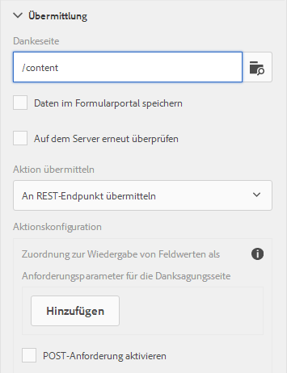

# Konfigurieren der Umleitungsseite{#configuring-redirect-page}

Formularersteller können für jedes Formular eine Seite konfigurieren, zu der die Formularbenutzer nach dem Senden eines Formulars umgeleitet werden.

1. Wählen Sie im Bearbeitungsmodus eine Komponente aus, klicken Sie dann auf  > **Container des adaptiven Formulars** und klicken Sie dann auf .

1. Klicken Sie in der Randleiste auf **Senden**.

1. Geben Sie die URL der Umleitungsseite unter der Danksagung im Bereich „Senden“ an.
1. Optional können Sie unter „Übermittlungsaktion“ für die Übermittlungsaktion „An REST-Endpunkt übermitteln“ den Parameter konfigurieren, der zur Umleitungsseite geleitet werden soll.

Konfigurieren der Umleitungsseite

Formularersteller können folgende Parameter verwenden, die zur Dankeseite weitergeleitet werden. Für alle verfügbaren Übermittlungsaktionen werden die Parameter `status` und `owner` übergeben. Neben diesen beiden Parametern werden für die folgenden Übermittlungsaktionen einige weitere Parameter weitergeleitet:

* **Aktion**  zum Speichern von Inhalten (nicht mehr unterstützt):  `contentPath`—der Pfad des Knotens im Repository, in dem die gesendeten Daten gespeichert werden, wird übergeben.

* **PDF-Aktion**  speichern (nicht mehr unterstützt):  `contentPath`—der gesendeten Daten und des Pfades zum Knoten, der die PDF-Datei im Repository speichert, weitergeleitet werden.

* **An Formular-Workflow übermitteln**: Ausgabeparameter, die aus dem Formular-Workflow zurückgegeben wurden, werden weitergeleitet.

* **An REST-Endpunkt übermitteln**: Parameter, die für die Zuordnung feldinterner Werte zu Parametern hinzugefügt wurden, werden weitergeleitet. Die Parameter `status` und `owner` werden bei dieser Übermittlungsaktion nicht weitergeleitet. Weitere Informationen finden Sie unter [Konfigurieren der Übermittlungsaktion „An REST-Endpunkt übermitteln“](../../forms/using/configuring-submit-actions.md). 

