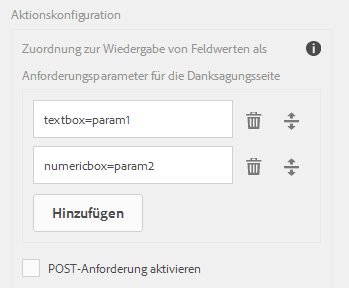
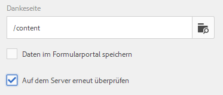
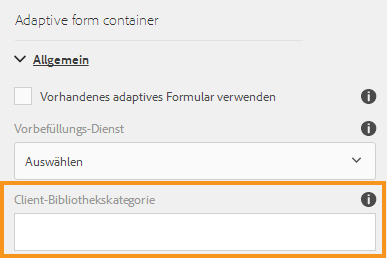

# Konfigurieren der Sendeaktion{#configuring-the-submit-action}

## Einführung in die Übermittlungsaktionen {#introduction-to-submit-actions}

Eine Übermittlungsaktion wird ausgelöst, wenn ein Benutzer in einem adaptiven Formular auf die Schaltfläche „Senden“ klickt. Sie können die Übermittlungsaktion in einem adaptiven Formular konfigurieren. Adaptive Formulare umfassen auch einige Übermittlungsaktionen für den sofortigen Einsatz. Sie können die standardmäßigen Übermittlungsaktionen kopieren und erweitern, um eine eigene Übermittlungsaktion zu erstellen. Basierend auf Ihre Anforderungen können Sie eine eigene Übermittlungsaktion schreiben und registrieren, um Daten im gesendeten Formular zu verarbeiten. Die Übermittlungsaktion kann [synchrone oder asynchrone Übermittlung](../../forms/using/asynchronous-submissions-adaptive-forms.md) verwenden.

Sie können eine Sendeaktion in der Seitenleiste im Bereich **Senden** des „Container für adaptive Formulare“ konfigurieren.

Konfigurieren der Sendeaktion

Die folgenden Übermittlungsaktionen stehen in adaptiven Formularen standardmäßig zur Verfügung:

* An REST-Endpunkt übermitteln
* E-Mail senden
* PDF mittels E-Mail senden
* Workflow für Formulare aufrufen
* Senden mit Formulardatenmodell
* Übermittlungsaktion für Forms Portal
* Aufrufen eines AEM Workflows

>[!NOTE]
>
>Die Übermittlungsaktion „PDF mittels E-Mail senden“ steht nur in adaptiven Formularen zur Verfügung, die als Formularmodell XFA-Vorlagen verwenden.

>[!NOTE]
>
>Stellen Sie sicher, dass [AEM_Installationsverzeichnis]\crx-quickstart\temp\datamanager\ASM folder
>vorhanden. Das Verzeichnis wird benötigt, um Anhänge vorübergehend zu speichern. Wenn der Ordner nicht vorhanden ist, erstellen Sie ihn.

>[!CAUTION]
>
>Wenn Sie eine Formularvorlage, ein Formulardatenmodell oder ein Schema-basiertes adaptives Formular mit XML- oder JSON-Daten an ein Schema (XML-Schema, JSON-Schema, Formularvorlage oder Formulardatenmodell) ausfüllen, das keine Daten enthält, die die Tags &lt;afData>, &lt;afBoundData> und &lt;/afUnboundData> enthalten, dann die Daten ungebundene Felder (Nicht gebundene Felder sind adaptive Formularfelder ohne [bindref](../../forms/using/prepopulate-adaptive-form-fields.md)-Eigenschaft) des adaptiven Formulars gehen verloren.

Sie können eine benutzerdefinierte Übermittlungsaktion für adaptive Formulare schreiben, um Ihren Verwendungsfall zu erfüllen. Weitere Informationen finden Sie unter[ Schreiben von benutzerdefinierten Übermittlungsaktionen für ein adaptives Formular](../../forms/using/custom-submit-action-form.md).

## An REST-Endpunkt übermitteln {#submit-to-rest-endpoint}

Die Übermittlungsoption **An REST-Endpunkt übermitteln** wird verwendet, wenn Sie die im Formular eingetragenen Daten zu einer konfigurierten Bestätigungsseite im Rahmen der http GET-Anforderung weiterleiten möchten. Sie können den Namen der Felder der Anforderung hinzufügen. Das Format der Anforderung lautet:

`{fieldName}={request parameter name}`

Wie in der Abbildung unten dargestellt, werden `param1` und `param2` als Parameter mit Werten übergeben, die für die nächste Aktion aus den Feldern **textbox** und **numeric box** kopiert wurden.

Sie können auch **POST-Anforderungen aktivieren** und eine URL eingeben, um die Anforderung zu veröffentlichen. Um Daten an den Experience Manager-Server zu senden, auf dem das Formular gehostet wird, verwenden Sie einen relativen Pfad, der dem Stammpfad des Experience Manager-Servers entspricht. Beispiel: /content/Forms/af/SampleForm.html. Wenn Sie Daten an einen Server senden, verwenden Sie den absoluten Pfad. 

Konfigurieren der Sendeaktion „An REST-Endpunkt übermitteln“

>[!NOTE]
Alle Felder müssen über verschiedene Elementnamen verfügen, um als Parameter in der REST-URL weitergeleitet zu werden, und zwar auch dann, wenn die Felder in verschiedene Bereiche platziert wurden.

### Veröffentlichen Sie übertragene Daten an eine Ressource oder an einen externen REST-Endpunkt  {#post-submitted-data-to-a-resource-or-external-rest-end-point-nbsp}

Verwenden Sie die Aktion **An REST-Endpunkt übermitteln**, um die übertragenen Daten an eine Rest-URL zu veröffentlichen. Die URL kann sich auf einem internen (der Server, auf dem das Formular wiedergegeben wird) oder auf einem externen Server befinden.

Stellen Sie den Pfad der Ressource bereit, um Daten an einen internen Server zu veröffentlichen. Die Daten werden an den Pfad der Ressource veröffentlicht. Beispiel: /content/restEndPoint. Für diese POST-Anforderungen werden die Authentifizierungsinformationen der Versandanfrage verwendet.

Stellen Sie die URL bereit, um Daten an einen externen Server zu veröffentlichen. Das Format der URL lautet https://host:port/path_to_rest_end_point. Stellen Sie sicher, dass Sie den Pfad zum Konfigurieren der POST-Anforderung anonym bearbeiten.

Im obigen Beispiel wird der in `textbox` eingegebene Benutzer mithilfe des Parameters `param1` erfasst. Die Syntax zum Posten von mit `param1` erfassten Daten lautet:

`String data=request.getParameter("param1");`

Gleichermaßen sind Parameter, die Sie zum Posten von XML-Daten und -Anlagen verwenden, `dataXml` und `attachments`.

Beispielsweise können Sie diese beiden Parameter in Ihrem Skript verwenden, um Daten an einem Restendpunkt zu analysieren. Verwenden Sie die folgende Syntax, um Daten zu speichern und zu analysieren: 

`String data=request.getParameter("dataXml");`
`String att=request.getParameter("attachments");`

In diesem Beispiel speichert `data` die XML-Daten und `att` speichert Anlagendaten.

## E-Mail senden {#send-email}

Bei der Übermittlungsaktion **E-Mail senden** wird nach erfolgreicher Übermittlung des Formulars eine E-Mail an einen oder mehrere Empfänger gesendet. Die generierte E-Mail kann Formulardaten in einem vordefinierten Formaten enthalten.

>[!NOTE]
Alle Formularfelder müssen über verschiedene Elementnamen verfügen, auch wenn sie in verschiedene Fenster platziert werden, um in eine E-Mail Formulardaten einzubinden.

## PDF mittels E-Mail senden {#send-pdf-via-email}

Bei der Übermittlungsaktion **PDF mittels E-Mail senden** wird bei erfolgreicher Übermittlung des Formulars an einen oder mehrere Empfänger eine mit einer PDF-Datei gesendet, die Formulardaten enthält.

>[!NOTE]
Diese Übermittlungsaktion ist für XFA-basierte adaptive Formulare und XSD-basierte adaptive Formulare mit dem Dokument Datensatzvorlage verfügbar.

## Workflow für Formulare aufrufen {#invoke-a-forms-workflow}

Die Option **An Forms Workflow senden** sendet eine Daten-XML und Dateianlagen (falls vorhanden) an einen vorhandenen Adobe-LiveCycle- oder AEM Forms on JEE-Prozess.

Informationen zum Konfigurieren der Sendeaktion &quot;An Forms Workflow übermitteln&quot;finden Sie unter [Senden und Verarbeiten Ihrer Formulardaten mit Formularen Workflows](../../forms/using/submit-form-data-livecycle-process.md).

## Senden mit Formulardatenmodell {#submit-using-form-data-model}

Die Übermittlungsaktion **Mit Formulardatenmodell senden** schreibt gesendete adaptive Formulardaten für das angegebene Datenmodellobjekt in einem Formulardatenmodell in seine Datenquelle. Beim Konfigurieren der Übermittlungsaktion können Sie ein Datenmodellobjekt auswählen, dessen übermittelte Daten in die Datenquelle zurückgeschrieben werden sollen.

Darüber hinaus können Sie einen Formularanhang mit einem Formulardatenmodell und einem Datensatzdokument (Document of Record) an die Datenquelle senden.

Weitere Informationen zum Formulardatenmodell finden Sie unter [Datenintegration für AEM Forms](../../forms/using/data-integration.md).

## Übermittlungsaktion für Forms Portal  {#forms-portal-submit-action}

Mit der Option **Forms Portal-Übermittlungsaktion** werden Formulardaten über ein AEM Forms Portal verfügbar gemacht.

Weitere Informationen zur Übermittlungsaktion für Forms Portal finden Sie unter [Komponente für Formular und übermittelte Formulare](../../forms/using/draft-submission-component.md).

## AEM-Workflow aufrufen  {#invoke-an-aem-workflow}

Die Übermittlungsaktion **AEM-Workflow aufrufen** verknüpft ein adaptives Formular mit einem AEM-Workflow. Wenn ein Formular gesendet wird, startet der verknüpfte Workflow automatisch auf dem Verarbeitungsknoten. Darüber hinaus speichert er die Datendatei, Anhänge und das Datensatzdokument (falls vorhanden) im Nutzlastspeicherort des Workflows.

Bevor Sie die Übermittlungsaktion **Einen AEM Workflow aufrufen** verwenden, konfigurieren Sie [die Experience Manager-DS-Einstellungen](../../forms/using/configuring-the-processing-server-url-.md). Weitere Informationen zum Erstellen eines AEM-Workflow finden Sie unter [Formularorientierte Workflows auf OSGi](../../forms/using/aem-forms-workflow.md).

## Serverseitige Überprüfung im adaptiven Formular {#server-side-revalidation-in-adaptive-form}

Normalerweise platzieren Entwickler in jedem Online-Datenerfassungssystem einige JavaScript-Überprüfungen auf Clientseite, um einige Geschäftsregeln durchzusetzen. Moderne Browser bieten Endbenutzern Möglichkeiten, diese Validierungen zu umgehen und Übermittlungen mithilfe verschiedener Techniken wie beispielsweise die Web Browser DevTools-Konsole manuell durchzuführen. Solche Techniken sind auch für adaptive Formulare gültig. Ein Formularentwickler kann verschiedene Validierungslogiken erstellen, aber Endbenutzer können diese Validierungslogiken technisch umgehen und ungültige Daten an den Server leiten. Ungültige Daten verstoßen gegen die Geschäftsregeln, die der Formularautor durchgesetzt hat.

Die Funktion für erneute serverseitige Überprüfung enthält die Möglichkeit, auch Validierungen durchzuführen, die von einem Autor für adaptive Formulare beim Entwerfen eines adaptiven Formulars auf dem Server bereitgestellt wurden. Sie verhindert jede mögliche Beeinträchtigung von Datenübertragungen und Verstöße gegen Geschäftsregeln, die in Form von Formularvalidierungen auftreten können.

### Was soll auf dem Server validiert werden? {#what-to-validate-on-server-br}

Alle standardmäßig (OOTB) durchgeführten Feldvalidierungen eines adaptiven Formulars, die erneut auf dem Server ausgeführt werden, sind:

* Erforderlich
* Validierung-Picture-Klausel
* Überprüfungsausdruck

### Aktivieren von serverseitiger Validierung {#enabling-server-side-validation-br}

Verwenden Sie das Kontrollkästchen **Auf dem Server erneut überprüfen** im „Container für adaptive Formulare“ in der Seitenleiste, um die serverseitige Validierung für das aktuelle Formular zu aktivieren oder zu deaktivieren.

Aktivieren von serverseitiger Validierung

Wenn der Endbenutzer diese Validierungen umgeht und die Formulare übermittelt, führt der Server die Validierung erneut aus. Wenn die Überprüfung serverseitig fehlschlägt, wird die Übermittlung abgebrochen. Dem Endbenutzer wird das Originalformular erneut angezeigt. Die erfassten Daten und die gesendeten Daten werden dem Benutzer als Fehler angezeigt. 

>[!NOTE]
Serverseitige Überprüfung überprüft das Formularmodell. Es wird empfohlen, eine separate Client-Bibliothek für Überprüfungen zu erstellen und sie nicht mit anderen Elementen wie HTML-Stil und DOM-Manipulation in derselben Client-Bibliothek zu mischen.

### Unterstützende benutzerdefinierte Funktionen in Überprüfungsausdrücken {#supporting-custom-functions-in-validation-expressions-br}

Wenn es komplexe Validierungsregeln gibt, befindet sich das exakte Überprüfungsskript gelegentlich in benutzerdefinierten Funktionen und der Autor ruft diese benutzerdefinierten Funktionen aus dem Ausdruck zur Feldüberprüfung auf. Um diese benutzerdefinierte Funktionsbibliothek bei serverseitigen Überprüfungen bekannt und verfügbar zu machen, kann der Formularverfasser den Namen AEM Client-Bibliothek auf der Registerkarte **Einfach** der Eigenschaften des adaptiven Formular-Containers konfigurieren, wie unten dargestellt.

Unterstützende benutzerdefinierte Funktionen in Überprüfungsausdrücken

Autor kann benutzerdefinierte JavaScript-Bibliothek pro adaptives Formular konfigurieren. Behalten Sie in der Bibliothek nur die wiederverwendbaren Funktionen bei, die von Drittanbieterbibliotheken jquery und underscore.js abhängig sind.

## Verhalten bei fehlerhaften Übermittlungsaktionen {#error-handling-on-submit-action}

Konfigurieren Sie im Rahmen der Richtlinien zur Sicherheit und zum Härten von Experience Managern benutzerdefinierte Fehlerseiten wie 404.jsp und 500.jsp. Diese Handler werden aufgerufen, wenn beim Übermitteln des Formulars 404 oder 500 Fehler auftreten. Die Handler werden auch aufgerufen, wenn diese Fehlercodes auf einem Veröffentlichungsknoten ausgelöst werden.

Weitere Informationen finden Sie unter [Anpassen der vom Fehler-Handler](/help/sites-developing/customizing-errorhandler-pages.md) angezeigten Seiten.
