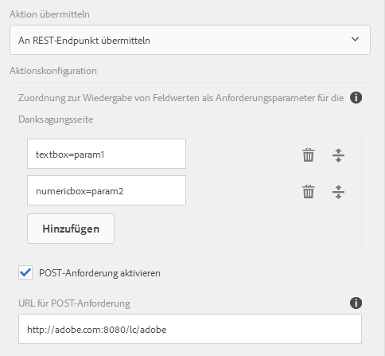

# Konfigurieren der Sendeaktion {#configuring-the-submit-action}

 Adobe empfiehlt, die modernen und erweiterbaren [Kernkomponenten](https://experienceleague.adobe.com/docs/experience-manager-core-components/using/adaptive-forms/introduction.html?lang=de) zur Datenerfassung zu verwenden, um [neue adaptive Formulare zu erstellen](/help/forms/using/create-an-adaptive-form-core-components.md) oder [adaptive Formulare zu AEM Sites-Seiten hinzuzufügen](/help/forms/using/create-or-add-an-adaptive-form-to-aem-sites-page.md). Diese Komponenten stellen einen bedeutenden Fortschritt bei der Erstellung adaptiver Formulare dar und sorgen für beeindruckende Anwendererlebnisse. In diesem Artikel wird der ältere Ansatz zum Erstellen adaptiver Formulare mithilfe von Foundation-Komponenten beschrieben. 

| Version | Artikel-Link |
| -------- | ---------------------------- |
| AEM as a Cloud Service | [Hier klicken](https://experienceleague.adobe.com/docs/experience-manager-cloud-service/content/forms/adaptive-forms-authoring/authoring-adaptive-forms-foundation-components/configure-submit-actions-and-metadata-submission/configuring-submit-actions.html?lang=de) |
| AEM 6.5 | Dieser Artikel |

## Einführung in die Übermittlungsaktionen {#introduction-to-submit-actions}

Eine Übermittlungsaktion wird ausgelöst, wenn eine Benutzerin bzw. ein Benutzer in einem adaptiven Formular auf die Schaltfläche „Absenden“ klickt. Sie können die Übermittlungsaktion in einem adaptiven Formular konfigurieren. Adaptive Formulare umfassen auch einige Übermittlungsaktionen für den sofortigen Einsatz. Sie können die standardmäßigen Übermittlungsaktionen kopieren und erweitern und so eine eigene Übermittlungsaktion erstellen. Basierend auf Ihre Anforderungen können Sie eine eigene Übermittlungsaktion schreiben und registrieren, um Daten im gesendeten Formular zu verarbeiten. Die Übermittlungsaktion kann [synchrone oder asynchrone Übermittlung](../../forms/using/asynchronous-submissions-adaptive-forms.md) verwenden.

Sie können eine Sendeaktion in der Seitenleiste im Bereich **Senden** des „Container für adaptive Formulare“ konfigurieren.

Konfigurieren der Übermittlungsaktion

Dies sind die standardmäßigen Übermittlungsaktionen, die für adaptive Formulare verfügbar sind:

* An REST-Endpunkt übermitteln
* E-Mail senden
* PDF mittels E-Mail senden
* Aufrufen eines Formular-Workflows
* Senden mit Formulardatenmodell
* Übermittlungsaktion für Forms Portal
* Aufrufen eines AEM-Workflows
* An Power Automate übermitteln

>[!NOTE]
>
>Die Übermittlungsaktion „PDF mittels E-Mail senden“ steht nur in adaptiven Formularen zur Verfügung, die als Formularmodell XFA-Vorlagen verwenden.

>[!NOTE]
>
>Stellen Sie sicher, dass der Ordner „[AEM-Installationsverzeichnis]\crx-quickstart\temp\datamanager\ASM“ vorhanden ist.
>vorhanden. Das Verzeichnis wird benötigt, um Anhänge vorübergehend zu speichern. Wenn das Verzeichnis nicht vorhanden ist, erstellen Sie es.

>[!CAUTION]
>
>Wenn Sie eine Formularvorlage, ein Formulardatenmodell oder ein schemabasiertes adaptives Formular mit XML- oder JSON-Daten [vorbefüllen](../../forms/using/prepopulate-adaptive-form-fields.md), die einem Schema (XML-Schema, JSON-Schema, Formularvorlage oder Formulardatenmodell) entsprechen, d.h. die Daten enthalten keine &lt;afData>-, &lt;afBoundData>- und &lt;/afUnboundData>-Tags, dann gehen die Daten von nicht gebundenen Feldern (nicht gebundene Felder sind adaptive Formularfelder ohne die Eigenschaft [bindref](../../forms/using/prepopulate-adaptive-form-fields.md)) des adaptiven Formulars verloren.

Sie können eine benutzerdefinierte Übermittlungsaktion für adaptive Formulare entsprechend Ihres Anwendungsfalls schreiben. Weitere Informationen finden Sie unter[ Schreiben von benutzerdefinierten Übermittlungsaktionen für ein adaptives Formular](../../forms/using/custom-submit-action-form.md).

## An REST-Endpunkt übermitteln {#submit-to-rest-endpoint}

Die Übermittlungsoption **An REST-Endpunkt übermitteln** wird verwendet, wenn Sie die im Formular eingetragenen Daten zu einer konfigurierten Bestätigungsseite im Rahmen der HTTP GET-Anfrage weiterleiten möchten. Sie können den Namen der Felder hinzufügen, die angefordert werden sollen. Das Format der Anfrage lautet:

`{fieldName}={request parameter name}`

Wie in der Abbildung unten gezeigt, werden `param1` und `param2` als Parameter mit Werten übergeben, die aus den Feldern **textbox** und **numeric box** für die nächste Aktion kopiert werden.

Sie können auch **POST-Anforderungen aktivieren** und eine URL eingeben, um die Anforderung zu veröffentlichen. Um Daten an den Experience Manager-Server zu übermitteln, der das Formular hostet, verwenden Sie einen relativen Pfad, der dem Stammpfad des Experience Manager-Servers entspricht. Zum Beispiel /content/forms/af/SampleForm.html.  Wenn Sie Daten an irgendeinen anderen Server senden, verwenden Sie den absoluten Pfad.

Konfigurieren der Übermittlungsaktion „An REST-Endpunkt übermitteln“

>[!NOTE]
>
Alle Felder müssen über verschiedene Elementnamen verfügen, um als Parameter in der REST-URL weitergeleitet zu werden, auch dann, wenn die Felder in verschiedenen Bereichen platziert sind.

### Post hat Daten an eine Ressource oder einen externen REST-Endpunkt übermittelt  {#post-submitted-data-to-a-resource-or-external-rest-end-point-nbsp}

Verwenden Sie die Aktion **An REST-Endpunkt übermitteln**, um die übertragenen Daten an eine Rest-URL zu veröffentlichen. Die URL kann sich auf einem internen Server (dem Server, auf dem das Formular gerendert wird) oder auf einem externen Server befinden.

Um Daten auf einem internen Server zu senden, geben Sie den Pfad der Ressource an. Die Daten werden an den Pfad der Ressource gesendet. Beispiel: /content/restEndPoint. Für solche Sende-Anfragen werden die Authentifizierungsinformationen der Versandanfrage verwendet.

Geben Sie eine URL an, um Daten an einen externen Server zu senden. Das Format der URL ist https://host:port/path_to_rest_end_point. Stellen Sie sicher, dass Sie den Pfad zum Handhaben der POST-Anforderung anonym konfigurieren.

Im obigen Beispiel hat der Benutzer Informationen in die `textbox` eingegeben, die mithilfe von Parameter `param1` erfasst werden. Die Syntax zur Veröffentlichung erfasster Daten mithilfe von `param1` lautet:

`String data=request.getParameter("param1");`

Auch Parameter, die Sie für die Veröffentlichung von XML-Daten und Anlagen verwenden, sind `dataXml` und `attachments`.

Beispielsweise können Sie diese beiden Parameter in Ihrem Skript verwenden, um Daten an einem REST-Endpunkt zu analysieren. Verwenden Sie die folgende Syntax, um Daten zu speichern und zu analysieren:

`String data=request.getParameter("dataXml");`
`String att=request.getParameter("attachments");`

In diesem Beispiel speichert `data` die XML-Daten, und `att` speichert Anlagendaten.

## E-Mail senden {#send-email}

Bei der Übermittlungsaktion **E-Mail senden** wird nach erfolgreicher Übermittlung des Formulars eine E-Mail an einen oder mehrere Empfänger gesendet. Die generierte E-Mail kann Formulardaten in einem vordefinierten Format enthalten.

>[!NOTE]
>
Alle Formularfelder müssen unterschiedliche Elementnamen haben, auch wenn sie in verschiedenen Bereichen platziert werden, um Formulardaten in eine E-Mail aufnehmen zu können.

## PDF mittels E-Mail senden {#send-pdf-via-email}

Bei der Übermittlungsaktion **PDF mittels E-Mail senden** wird bei erfolgreicher Übermittlung des Formulars an einen oder mehrere Empfänger eine mit einer PDF-Datei gesendet, die Formulardaten enthält.

>[!NOTE]
>
Diese Übermittlungsaktion ist für XFA-basierte adaptive Formulare und XSD-basierte adaptive Formulare verfügbar, die die Datensatzdokument-Vorlage haben.

## Workflow für Formulare aufrufen {#invoke-a-forms-workflow}

Bei der Übermittlungsoption **An Forms Workflow übermitteln** werden eine Daten-XML und Dateianlagen (falls vorhanden) an einen vorhandenen Prozess von Adobe LiveCycle oder AEM Forms auf JEE gesendet.

Weitere Informationen zum Konfigurieren der Übermittlungsaktion „An Forms Workflow übermitteln“ finden Sie unter [Senden und Verarbeiten Ihrer Formulardaten mit Formular-Workflows](../../forms/using/submit-form-data-livecycle-process.md).

## Senden mit Formulardatenmodell {#submit-using-form-data-model}

Die Übermittlungsaktion **Senden mit Formulardatenmodell** schreibt gesendete Daten eines adaptiven Formulars für das angegebene Datenmodellobjekt in einem Formulardatenmodell in seine Datenquelle. Beim Konfigurieren der Sendeaktion können Sie ein Datenmodellobjekt auswählen, dessen übermittelte Daten in die Datenquelle zurückgeschrieben werden sollen.

Darüber hinaus können Sie einen Formularanhang mit einem Formulardatenmodell und einem Datensatzdokument (Document of Record, DoR) an die Datenquelle senden.

Weitere Informationen zum Formulardatenmodell finden Sie unter [Datenintegration für AEM Forms](../../forms/using/data-integration.md).

## Übermittlungsaktion für Forms Portal {#forms-portal-submit-action}

Mit der Option **Übermittlungsaktion für Forms Portal** werden über das AEM Forms-Portal Formulardaten zur Verfügung gestellt.

Weitere Informationen über das Formularportal und die Übermittlungsaktion finden Sie unter [Komponente für Entwurf und Übermittlung](../../forms/using/draft-submission-component.md).

## Aufrufen eines AEM-Workflows {#invoke-an-aem-workflow}

Die Übermittlungsaktion **[!UICONTROL AEM-Workflow aufrufen]** verknüpft ein adaptives Formular mit einem [AEM-Workflow](/help/sites-developing/workflows-models.md). Wenn ein Formular gesendet wird, startet der verknüpfte Workflow automatisch auf der Autoreninstanz. Sie können die Datendatei, die Anhänge und das Datensatzdokument am Payload-Speicherort des Workflows, in einem entsprechenden relativen Ordner oder in einer Variablen speichern. Wenn der Workflow für die externe Datenspeicherung markiert ist, ist die Variablenoption verfügbar und nicht die Payload-Option. Sie können aus der Liste der für das Workflow-Modell verfügbaren Variablen auswählen. Wenn der Workflow für die externe Datenspeicherung zu einem späteren Zeitpunkt und nicht zum Zeitpunkt der Workflow-Erstellung markiert ist, stellen Sie sicher, dass die erforderlichen Variablenkonfigurationen vorhanden sind.

Bevor Sie die Übermittlungsaktion **AEM-Workflow aufrufen** verwenden, [konfigurieren Sie die DS-Einstellungen von Experience Manager](../../forms/using/configuring-the-processing-server-url.md). Weitere Informationen zum Erstellen eines AEM-Workflow finden Sie unter [Formularorientierte Workflows auf OSGi](../../forms/using/aem-forms-workflow.md).

Die Übermittlungsaktion platziert Folgendes am Payload-Speicherort des Workflows. Beachten Sie jedoch, dass nur die Option „Variable“ angezeigt wird, wenn das Workflow-Modell für die externe Datenspeicherung markiert ist, und nicht die Payload-Option.

* **Datendatei**: Sie enthält Daten, die an das adaptive Formular gesendet werden. Mit der Option **[!UICONTROL Datendateipfad]** können Sie den Dateinamen und den Dateipfad relativ zur Payload angeben. Beispielsweise erstellt der Pfad `/addresschange/data.xml` einen Ordner mit dem Namen `addresschange` und platziert ihn relativ zur Payload. Sie können auch nur `data.xml` angeben, um nur die übermittelten Daten zu senden, ohne die Erstellung einer Ordnerhierarchie. Verwenden Sie die Option „Variable“ und wählen Sie die Variable aus der Liste der für das Workflow-Modell verfügbaren Variablen aus.

>[!NOTE]
>
Variablen können unabhängig davon verwendet werden, ob das Workflow-Modell für die externe Datenspeicherung markiert ist oder nicht.

* **Anlagen**: Mit der Option **[!UICONTROL Anlagenpfad]** können Sie den Ordnernamen zum Speichern der in das adaptive Formular hochgeladenen Anlagen angeben. Der Ordner wird immer relativ zur Payload erstellt. Wenn der Workflow für die externe Datenspeicherung markiert ist, verwenden Sie die Variablenoption und wählen Sie die Variable aus der Liste der Variablen aus, die für das Workflow-Modell verfügbar sind.

* **Datensatzdokument**: Es enthält das Datensatzdokument, das für das adaptive Formular generiert wurde. Mit der Option **[!UICONTROL Pfad des Datensatzdokuments]** können Sie den Dateinamen des Datensatzdokuments sowie den Dateipfad relativ zur Payload angeben. Beispiel: Der Pfad `/addresschange/DoR.pdf` erstellt einen Ordner mit dem Namen `addresschange` relativ zur Payload und platziert `DoR.pdf` relativ zur Payload. Um nur das Datensatzdokument zu speichern, ohne eine Ordnerhierarchie zu erstellen, reicht die Angabe `DoR.pdf`. Wenn der Workflow für die externe Datenspeicherung markiert ist, verwenden Sie die Variablenoption und wählen Sie die Variable aus der Liste der Variablen aus, die für das Workflow-Modell verfügbar sind.

## An Power Automate übermitteln {#microsoft-power-automate}

Sie können ein adaptives Formular so konfigurieren, dass bei der Übermittlung ein Cloud-Fluss bei Microsoft® Power Automate ausgeführt wird. Das konfigurierte adaptive Formular sendet erfasste Daten, Anhänge und das Datensatzdokument zur Verarbeitung an den Cloud-Fluss von Power Automate. Dies hilft Ihnen beim Erstellen benutzerdefinierter Datenerfassungsprozesse und nutzt gleichzeitig die Leistungsfähigkeit von Microsoft® Power Automate, um Geschäftslogiken zu erfassten Daten zu erstellen und Kunden-Workflows zu automatisieren. Im Folgenden finden Sie einige Beispiele dafür, was Sie nach der Integration eines adaptiven Formulars in Microsoft® Power Automate tun können:

* Verwenden Sie Daten von adaptiven Formularen in einem Power Automate-Geschäftsprozess
* Verwenden Sie Power Automate, um erfasste Daten an mehr als 500 Datenquellen oder eine beliebige öffentlich verfügbare API zu senden
* Führen Sie komplexe Berechnungen für erfasste Daten durch
* Speichern Sie die Daten von adaptiven Formularen in Speichersystemen nach einem vordefinierten Zeitplan

Der Editor für adaptive Formulare verfügt über die Übermittlungsaktion **Aufrufen eines Microsoft® Power Automate-Flusses** zum Senden von Daten, Anhängen und Datensatzdokumenten für adaptive Formulare an den Cloud-Fluss von Power Automate. Um mithilfe der Übermittlungsaktion erfasste Daten an Microsoft® Power Automate zu senden, [verbinden Sie Ihre Instanz von AEM Forms mit Microsoft® Power Automate](/help/forms/using/forms-microsoft-power-automate-integration.md).

Verwenden Sie nach der erfolgreichen Konfiguration die Übermittlungsaktion [Microsoft® Power Automate-Fluss aufrufen](/help/forms/using/forms-microsoft-power-automate-integration.md#use-the-invoke-a-microsoft&reg;-power-automate-flow-submit-action-to-send-data-to-a-power-automate-flow-use-the-invoke-microsoft-power-automate-flow-submit-action), um Daten an einen Power Automate-Fluss zu senden.

## Übermitteln an eine Microsoft® SharePoint-Liste{#submit-to-sharedrive}

>[!NOTE]
>
Die Funktion „An eine Microsoft® SharePoint-Liste übermitteln“ wurde mit AEM 6.5 Forms Service Pack 19 (6.5.19.0) eingeführt.

Die Sendeaktion **[!UICONTROL An SharePoint senden]** verbindet ein adaptives Formular mit einem Microsoft® SharePoint-Speicher. Sie können die Formulardatendatei, die Anlagen oder das Datensatzdokument an den verbundenen Microsoft® Sharepoint-Speicher senden. 

### Verbinden eines adaptiven Formulars mit der Microsoft® SharePoint-Liste {#connect-af-sharepoint-list}

Verbinden eines adaptiven Formulars mit der Microsoft® SharePoint-Liste:

1. [Erstellen einer SharePoint-Listenkonfiguration](#create-sharepoint-list-configuration): Dadurch wird AEM Forms mit Ihrem Microsoft® Sharepoint-Listenspeicher verbunden.
1. [Verwenden der Sendeaktion **Mit Formulardatenmodell senden** in einem adaptiven Formular](#use-submit-using-fdm): Dadurch werden die Daten Ihres adaptiven Formulars an den konfigurierten Microsoft® SharePoint gesendet.

#### Erstellen einer Microsoft SharePoint-Listenkonfiguration {#create-sharepoint-list-configuration}

So verbinden Sie AEM Forms mit Ihrer Microsoft® SharePoint-Liste:

1. Wechseln Sie zu **[!UICONTROL Tools]** > **[!UICONTROL Cloud Services]** > **[!UICONTROL Microsoft® SharePoint]**.
1. Wählen Sie einen **Konfigurations-Container**. Die Konfiguration wird im ausgewählten Konfigurations-Container gespeichert.
1. Klicken Sie in der Dropdown-Liste auf **[!UICONTROL Erstellen]** > **[!UICONTROL SharePoint-Liste]**. Der SharePoint-Konfigurationsassistent wird angezeigt.
1. Geben Sie **[!UICONTROL Titel]**, **[!UICONTROL Client-ID]**, **[!UICONTROL Client-Geheimnis]** und **[!UICONTROL OAuth-URL]** an. Informationen zum Abrufen der Client-ID, des Client-Geheimnisses und der Mandanten-ID für die OAuth-URL finden Sie in der [Dokumentation von Microsoft®](https://learn.microsoft.com/de-de/graph/auth-register-app-v2).
   * Sie können die `Client ID` und das `Client Secret` Ihrer App über das Microsoft® Azure-Portal abrufen.
   * Fügen Sie im Microsoft® Azure-Portal den Umleitungs-URI als `https://[author-instance]/libs/cq/sharepointlist/content/configurations/wizard.html` hinzu. Ersetzen Sie `[author-instance]` durch die URL Ihrer Autoreninstanz.
   * Fügen Sie die API-Berechtigungen `offline_access` und `Sites.Manage.All` auf der Registerkarte **Microsoft® Graph** hinzu, um Lese- und Schreibberechtigungen bereitzustellen. Fügen Sie auf der Registerkarte **Sharepoint** die Berechtigung `AllSites.Manage` hinzu, um remote mit den SharePoint-Daten zu interagieren.
   * Verwenden der OAuth-URL: `https://login.microsoftonline.com/tenant-id/oauth2/v2.0/authorize`. Ersetzen Sie `<tenant-id>` durch die `tenant-id` Ihrer App aus dem Microsoft® Azure-Portal.

     >[!NOTE]
     >
     Ob das Feld **Client-Geheimnis** obligatorisch oder optional ist, hängt von der Konfiguration Ihrer Azure Active Directory-Anwendung ab. Wenn Ihre Anwendung so konfiguriert ist, dass sie ein Client-Geheimnis verwendet, ist die Angabe des Client-Geheimnisses obligatorisch.

1. Klicken Sie auf **[!UICONTROL Verbinden]**. Bei erfolgreicher Verbindung erscheint die Meldung `Connection Successful`.
1. Wählen Sie **[!UICONTROL SharePoint-Site]** und **[!UICONTROL SharePoint-Liste]** aus der Dropdown-Liste.
1. Tippen Sie auf **[!UICONTROL Erstellen]**, um die Cloud-Konfiguration für die Microsoft® SharePoint-Liste zu erstellen.

#### Verwenden von „Absenden mit Formulardatenmodell“ in einem adaptiven Formular {#use-submit-using-fdm}

Sie können die erstellte SharePoint-Listenkonfiguration in einem adaptiven Formular verwenden, um Daten zu speichern oder das generierte Datensatzdokument in einer SharePoint-Liste zu speichern. Führen Sie die folgenden Schritte aus, um eine SharePoint-Listenspeicherkonfiguration in einem adaptiven Formular zu verwenden:

1. [Erstellen eines Formulardatenmodells mithilfe von Microsoft](/help/forms/using/create-form-data-model.md)
1. [Konfigurieren des Formulardatenmodells zum Abrufen und Senden von Daten](/help/forms/using/work-with-form-data-model.md#configure-services)
1. [Erstellen eines adaptiven Formulars](/help/forms/using/create-adaptive-form.md)
1. [Konfigurieren einer Übermittlungsaktion mit einem Formulardatenmodell](/help/forms/using/configuring-submit-actions.md#submit-using-form-data-model-submit)

Wenn Sie das Formular absenden, werden die Daten im angegebenen Microsoft® Sharepoint-Listenspeicher gespeichert.

>[!NOTE]
>
Die folgenden Spaltentypen werden in der Microsoft® SharePoint-Liste nicht unterstützt:
* Bildspalte
* Metadatenspalte
* Personenspalte
* Externe Datenspalte

>[!NOTE]
>
Um Konfigurationswerte festzulegen, [generieren Sie OSGi-Konfigurationen mit dem AEM-SDK](https://experienceleague.adobe.com/docs/experience-manager-cloud-service/implementing/deploying/configuring-osgi.html?lang=de#generating-osgi-configurations-using-the-aem-sdk-quickstart) und [stellen Sie die Konfiguration in Ihrer Cloud Service-Instanz bereit](https://experienceleague.adobe.com/docs/experience-manager-cloud-service/implementing/using-cloud-manager/deploy-code.html?lang=de#deployment-process).

## Server-seitige Überprüfung im adaptiven Formular {#server-side-revalidation-in-adaptive-form}

Normalerweise platzieren Entwickler in jedem Online-Datenerfassungssystem einige Javascript-Validierungen auf Client-Seite, um Geschäftsregeln durchzusetzen. Moderne Browser bieten Endbenutzern jedoch Möglichkeiten, diese Validierungen zu umgehen und Übermittlungen mithilfe verschiedener Techniken wie beispielsweise die Web Browser DevTools-Konsole manuell durchzuführen. Diese Techniken sind auch für adaptive Formulare gültig. Entwicklerinnen und Entwickler von Formularen können verschiedene Validierungslogiken erstellen, aber aus technischer Sicht können Endbenutzerinnen und -benutzer diese Validierungslogiken umgehen und ungültige Daten an den Server senden. Ungültige Daten verstoßen gegen die Geschäftsregeln, die eine Formularautorin bzw. ein -autor durchgesetzt hat.

Die Funktion für eine erneute Server-seitige Validierung enthält die Möglichkeit, auch Validierungen durchzuführen, die von einer Autorin bzw. einem Autor für adaptive Formulare beim Entwerfen eines adaptiven Formulars auf dem Server bereitgestellt wurden. Sie verhindert jede mögliche Beeinträchtigung von Datenübertragungen und Verstöße gegen Geschäftsregeln, die hinsichtlich Formularvalidierungen auftreten können.

### Was soll auf dem Server validiert werden? {#what-to-validate-on-server-br}

Alle standardmäßig einsetzbaren Feldvalidierungen eines adaptiven Formulars, die erneut auf dem Server ausgeführt werden, sind:

* Erforderlich
* Validierungbild-Klausel
* Validierungsausdruck

### Aktivieren von Server-seitiger Validierung {#enabling-server-side-validation-br}

Verwenden Sie das Kontrollkästchen **Auf dem Server erneut überprüfen** im Container für adaptive Formulare in der Seitenleiste, um die Server-seitige Validierung für das aktuelle Formular zu aktivieren oder zu deaktivieren.

Aktivieren von Server-seitiger Validierung

Wenn Endbenutzerinnen oder -benutzer diese Validierungen umgehen und die Formulare senden, führt der Server die Validierung erneut durch. Wenn die Validierung Server-seitig fehlschlägt, wird die Übermittlung abgebrochen. Dem Endbenutzer wird das ursprüngliche Formular erneut präsentiert. Die erfassten Daten und die gesendeten Daten werden dem Benutzer als Fehler angezeigt.

>[!NOTE]
>
Die Server-seitige Validierung prüft das Formularmodell. Es wird empfohlen, eine separate Client-Bibliothek für Validierungen zu erstellen und sie nicht mit anderen Elementen wie HTML-Stil und DOM-Manipulation in derselben Client-Bibliothek zu mischen.

### Unterstützende benutzerdefinierte Funktionen in Validierungsausdrücken {#supporting-custom-functions-in-validation-expressions-br}

Bisweilen befindet sich bei komplexen Validierungsregeln das exakte Validierungsskript in den benutzerdefinierten Funktionen. Der Autor kann diese benutzerdefinierten Funktionen über den Ausdruck für die Feldvalidierung abrufen. Um diese benutzerdefinierte Funktionsbibliothek bei Server-seitigen Validierungen bekannt und verfügbar zu machen, kann der Formularautor den Namen der AEM-Client-Bibliothek auf der Registerkarte **Allgemein** des Dialogfelds „Container für adaptive Formulare bearbeiten“, wie nachfolgend dargestellt konfigurieren.

Unterstützende benutzerdefinierte Funktionen in Validierungsausdrücken

Der Autor kann für jedes adaptive Formular eine benutzerdefinierte JavaScript-Bibliothek konfigurieren. Legen Sie in der Bibliothek nur die wiederverwendbaren Funktionen ab, die von den Drittanbieter-Bibliotheken „jquery“ und „underscore“ abhängen.

## Verhalten bei fehlerhaften Übermittlungsaktionen {#error-handling-on-submit-action}

Konfigurieren Sie im Rahmen der Experience Manager-Richtlinien für Sicherheit und Beschränkungen benutzerdefinierte Seiten für Fehler wie 404.jsp und 500.jsp. Diese Handler werden aufgerufen, wenn beim Senden eines Formulars die Fehler-Codes 404 oder 500 auftreten. Die Handler werden auch aufgerufen, wenn diese Fehler-Codes auf einem Veröffentlichungsknoten ausgelöst werden.

Weitere Informationen finden Sie unter [Anpassen der vom Fehler-Handler angezeigten Seiten](/help/sites-developing/customizing-errorhandler-pages.md).
