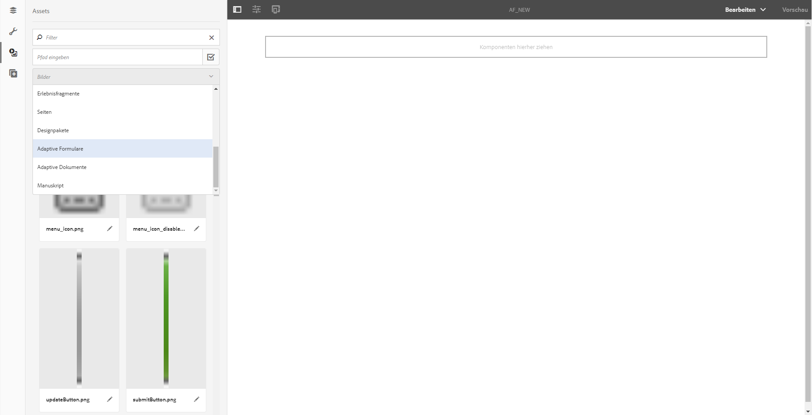
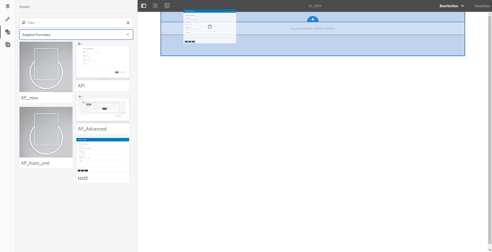

# Erstellen eines adaptiven Formulars mit einem Satz adaptiver Formulare{#create-an-adaptive-form-using-a-set-of-adaptive-forms}

## Überblick {#overview}

In einem Workflow wie einer Anwendung zum Eröffnen eines Bankkontos müssen Ihre Benutzer mehrere Formulare ausfüllen. Anstatt sie zu bitten, einen Satz von Formularen auszufüllen, können Sie die Formulare zusammenfassen und ein großes Formular (übergeordnetes Formular) erstellen. Wenn Sie ein adaptives Formular zu dem größeren Formular hinzufügen, wird sie in Form eines Bereichs angezeigt hinzugefügt (Formular des untergeordneten Elements). Sie fügen eine Reihe von untergeordneten Formularen hinzu, um ein übergeordnetes Formular zu erstellen. Sie können die Bereiche je nach Benutzereingabe anzeigen oder ausblenden. Schaltflächen im übergeordneten Formular, z. B. „Senden“ und „Zurücksetzen“, setzen die Schaltflächen im untergeordneten Formular außer Kraft. Um ein adaptives Formular im übergeordneten Formular hinzuzufügen, können Sie das adaptive Formular per Drag&amp;Drop aus dem Assets-Browser verschieben (wie adaptive Formularfragmente).

Die verfügbaren Funktionen lauten:

* Unabhängige Inhaltserstellung
* Anzeigen/Ausblenden von relevanten Formularen
* Lazy Loading (langsames Laden)

Funktionen wie die unabhängige Inhaltserstellung und verzögertes Laden bieten im Vergleich zur Verwendung von einzelnen Komponenten, um die übergeordneten Formulare zu erstellen, eine verbesserte Leistung.

>[!NOTE]
>
>Sie können adaptive XFA-basierte Formulare/Fragmente nicht als untergeordnete oder übergeordnete Formulare verwenden.

## Hinter den Kulissen {#behind-the-scenes}

Sie können XSD-basierte adaptive Formulare und Fragmente zum übergeordneten Formular hinzufügen. Die Struktur des übergeordneten Formulars ist dieselbe wie diejenige eines [beliebigen adaptiven Formulars](../../forms/using/prepopulate-adaptive-form-fields.md). Wenn Sie ein adaptives Formular als untergeordnetes Formular hinzufügen, wird es als Bereich im übergeordneten Formular hinzugefügt. Daten eines gebundenen untergeordneten Formulars werden unter dem `data`Stamm des `afBoundData`-Abschnitts des XML-Schemas des übergeordneten Formulars gespeichert.

Ihre Kunden füllen zum Beispiel ein Antragsformular aus. Die ersten beiden Felder des Formulars sind „Name“ und „Identität“. Die XML lautet:

```xml
<afData>
    <afUnboundData>
        <data />
    </afUnboundData>
    <afBoundData>
        <data xmlns:xfa="https://www.xfa.org/schema/xfa-data/1.0/">
            <applicantName>Sarah Rose</applicantName>
            <applicantId>1234</applicantId>
        </data>
    </afBoundData>
</afData>
```

Sie können ein anderes Formular in der Anwendung hinzufügen, sodass Ihre Kunden ihre Geschäftsadresse ausfüllen können. Der Schemastamm des Formulars des untergeordneten Elements ist `officeAddress`. Wenden Sie `bindref` `/application/officeAddress` oder `/officeAddress` an. Wenn `bindref` nicht angegeben wird, wird das Formular des untergeordneten Elements als Unterstruktur von `officeAddress` hinzugefügt. So sehen Sie die „XML“ im unten stehenden Formular:

```xml
<afData>
    <afUnboundData>
        <data />
    </afUnboundData>
    <afBoundData>
        <data xmlns:xfa="https://www.xfa.org/schema/xfa-data/1.0/">
            <applicantName>Sarah Rose</applicantName>
            <applicantId>1234</applicantId>
            <officeAddress>
                <addressLine>1, Geometrixx City</addressLine>
                <zip>11111</zip>
            </officeAddress>
        </data>
    </afBoundData>
</afData>
```

Wenn Sie ein anderes Formular einfügen, mit dem Ihre Kunden Hausadresse angeben können, wenden Sie `bindref` `/application/houseAddress or /houseAddress.`Die XML-Datei wie folgt an:

```xml
<afData>
    <afUnboundData>
        <data />
    </afUnboundData>
    <afBoundData>
        <data xmlns:xfa="https://www.xfa.org/schema/xfa-data/1.0/">
            <applicantName>Sarah Rose</applicantName>
            <applicantId>1234</applicantId>
            <officeAddress>
                <addressLine>1, Geometrixx City</addressLine>
                <zip>11111</zip>
            </officeAddress>
            <houseAddress>
                <addressLine>2, Geometrixx City</addressLine>
                <zip>11111</zip>
            </houseAddress>
        </data>
    </afBoundData>
</afData>
```

Wenn Sie denselben Substammnamen wie den Schema-Stammordner ( `Address`in diesem Beispiel) beibehalten möchten, verwenden Sie indizierte bindrefs.

Wenden Sie beispielsweise bindrefs `/application/address[1]` oder `/address[1]` und `/application/address[2]` oder `/address[2]` an. Die XML des Formulars lautet:

```xml
<afData>
    <afUnboundData>
        <data />
    </afUnboundData>
    <afBoundData>
        <data xmlns:xfa="https://www.xfa.org/schema/xfa-data/1.0/">
            <applicantName>Sarah Rose</applicantName>
            <applicantId>1234</applicantId>
            <address>
                <addressLine>1, Geometrixx City</addressLine>
                <zip>11111</zip>
            </address>
            <address>
                <addressLine>2, Geometrixx City</addressLine>
                <zip>11111</zip>
            </address>
        </data>
    </afBoundData>
</afData>
```

Sie können die Standardunterstruktur des adaptiven Formulars/Fragments mithilfe der Eigenschaft `bindRef` ändern. Mit der Eigenschaft `bindRef` können Sie den Pfad, der auf einen Ordner in der Ordnerstruktur des XML-Schemas zeigt, angeben.

Wenn das untergeordnete Formular ungebunden ist, werden seine Daten im `data`Stammordner des `afUnboundData`-Schemas des übergeordneten Formulars gespeichert.

Sie können ein adaptives Formular mehrmals als untergeordnetes Formular hinzufügen. Stellen Sie sicher, dass das `bindRef` ordnungsgemäß geändert wird, sodass jede verwendete Instanz des adaptiven Formulars auf einen anderen untergeordneten Stamm des Datenstamms zeigt.

>[!NOTE]
>
>Wenn andere Formulare/Fragmente demselben untergeordneten Stamm zugeordnet sind, werden Daten überschrieben.

## Hinzufügen eines adaptiven Formulars als untergeordnetes Formular mit dem Asset Browser  {#adding-an-adaptive-form-as-a-child-form-using-asset-browser}

Führen Sie die folgenden Schritte durch, um ein adaptives Formular als untergeordnetes Formular mit dem Asset Browser hinzuzufügen.

1. Öffnen Sie das übergeordnete Formular im Bearbeitungsmodus.
1. Klicken Sie in der Seitenleiste auf **Assets** . Wählen Sie **Adaptives Formular** aus der Dropdown-Liste.
   [](assets/asset-1.png)

1. Ziehen Sie das adaptive Formular, das Sie als untergeordnetes Formular hinzufügen möchten.
   [ ](assets/drag-drop-1.png)SiteDas adaptive Formular, das Sie ablegen, wird als untergeordnetes Formular hinzugefügt.

