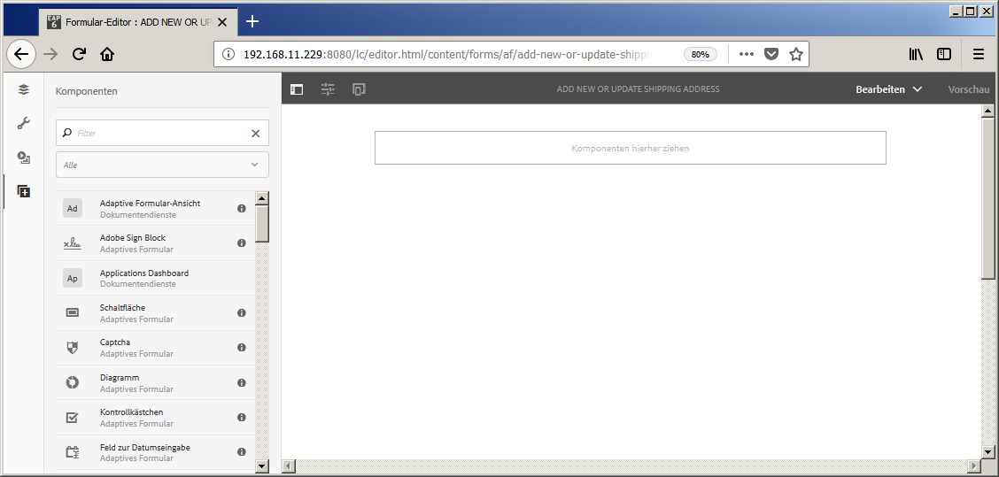
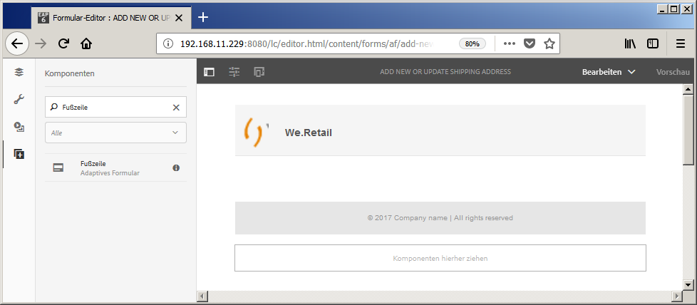
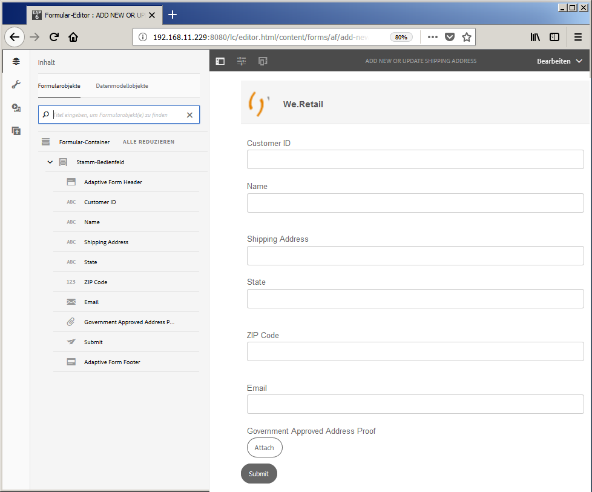

# Schulung: Erstellen eines adaptiven Formulars {#do-not-publish-tutorial-create-an-adaptive-form}

Diese Schulung ist ein Schritt in der Serie [Erstellen Sie Ihr erstes adaptives Formular](/help/forms/using/create-your-first-adaptive-form.md). Es wird empfohlen, der Serie in chronologischer Reihenfolge zu folgen, um den vollständigen Anwendungsfall zu verstehen, auszuführen und zu demonstrieren.

## Über die Schulung {#about-the-tutorial}

Adaptive Formulare sind Formulare der neuen Generation, die dynamisch und responsiv sind. Sie können adaptive Formulare verwenden, um ein personalisiertes Benutzererlebnis zu schaffen. Sie können adaptive Formulare auch mit [!DNL Adobe Analytics] für Nutzungsstatistiken und [!DNL Adobe Campaign] für die Kampagnenverwaltung integrieren. Weitere Informationen zu den Funktionen adaptiver Formulare finden Sie unter [Einführung in das Authoring adaptiver Formulare](/help/forms/using/introduction-forms-authoring.md).

Es ist einfacher, Formulare zu erstellen und zu verwalten, wenn ein ordnungsgemäßer Prozess eingehalten wird. In diesem Artikel lernen Sie Folgendes: 

* [Erstellen Sie ein adaptives Formular, mit dem ein Kunde eine Versandadresse hinzufügen kann](/help/forms/using/create-adaptive-form.md#step-create-the-adaptive-form)

* [Layout-Felder eines adaptiven Formulars zum Anzeigen und Akzeptieren von Informationen eines Kunden](/help/forms/using/create-adaptive-form.md#step-add-header-and-footer)

* [Erstellen Sie eine Sendeaktion zum Senden einer E-Mail mit Formularinhalt](/help/forms/using/create-adaptive-form.md#step-add-components-to-capture-and-display-information)
* [Anzeigen und Senden eines adaptiven Formulars in der Vorschau](/help/forms/using/create-adaptive-form.md)

Am Ende des Artikels haben Sie ein Formular, was so ähnlich wie Folgendes aussieht:\

## Schritt 1: Adaptives Formular erstellen {#step-create-the-adaptive-form}

1. Melden Sie sich bei Ihrer AEM-Autoreninstanz an und navigieren Sie zu **[!UICONTROL Adobe Experience Manager]** > **[!UICONTROL Formulare]** > **[!UICONTROL Formulare und Dokumente]**. Die Standard-URL lautet [http://localhost:4502/aem/forms.html/content/dam/formsanddocuments](http://localhost:4502/aem/forms.html/content/dam/formsanddocuments).
1. Tippen Sie auf **[!UICONTROL Erstellen]** und wählen Sie **[!UICONTROL Adaptives Formular]**. Eine Option zum Auswählen einer Vorlage wird angezeigt. Tippen Sie auf die **[!UICONTROL leere]** Vorlage, um sie auszuwählen, und dann auf **[!UICONTROL Weiter]**.

1. Eine Option **[!UICONTROL Eigenschaften hinzufügen]** wird angezeigt. Die Felder **[!UICONTROL Titel]** und **[!UICONTROL Name]** sind obligatorisch.

   * **Titel:** Geben Sie  `Add new or update shipping address` im Feld &quot; **** Titel&quot;an. Das Feld „Titel“: Gibt den Anzeigenamen des Formulars an. Der Titel erleichtert Ihnen die Identifizierung des Formulars in der AEM [!DNL Forms]-Benutzeroberfläche.
   * **Name:** Geben Sie  `shipping-address-add-update-form` im Feld &quot; **** Name&quot;an. Das Feld „Name“ gibt den Namen des Formulars an. Im Repository wird ein Knoten mit dem angegebenen Namen erstellt. Wenn Sie mit der Eingabe des Titels beginnen, wird automatisch ein Wert für das Feld „Name“ vorgeschlagen. Sie können den vorgeschlagenen Wert gegebenenfalls ändern. Im Feld „Name“ dürfen nur alphanumerische Zeichen, Bindestriche und Unterstriche eingegeben werden. Ungültige Eingaben werden durch Bindestriche ersetzt.

1. Tippen Sie auf **[!UICONTROL Erstellen]**. Ein adaptives Formular wird erstellt und es wird ein Dialogfeld zum Öffnen des Formulars zur Bearbeitung angezeigt. Tippen Sie auf **[!UICONTROL Öffnen]** , um das neu erstellte Formular in einer neuen Registerkarte zu öffnen. Das Formular wird zur Bearbeitung geöffnet. Es zeigt auch die Seitenleiste an, um das neu erstellte Formular entsprechend den Anforderungen anzupassen.

   Weitere Informationen zur Authoring-Benutzeroberfläche für adaptive Formulare und zu verfügbaren Komponenten finden Sie unter [Einführung in das Authoring adaptiver Formulare](/help/forms/using/creating-adaptive-form.md).

   

## Schritt 2: Kopf- und Fußzeile hinzufügen {#step-add-header-and-footer}

AEM [!DNL Forms] stellt viele Komponenten zur Anzeige von Informationen in einem adaptiven Formular bereit. Kopfzeilen- und Fußzeilen-Komponenten sorgen für ein konsistentes Erscheinungsbild eines Formulars. Eine Kopfzeile enthält normalerweise das Logo eines Unternehmens, den Titel des Formulars und eine Zusammenfassung. Eine Fußzeile enthält meist Copyright-Informationen und Links zu anderen Seiten.

1. Tippen Sie auf  > . Der Komponentenbrowser wird geöffnet. Ziehen Sie die Komponente **[!UICONTROL Kopfzeile]** aus dem Komponentenbrowser in das adaptive Formular.
1. Tippen Sie auf **[!UICONTROL Logo]**. Der Symbolleiste wird angezeigt. Tippen Sie in der Symbolleiste auf , geben Sie **We.Retail** ein und tippen Sie auf .

1. Tippen Sie auf „Bild“. Der Symbolleiste wird angezeigt. Tippen Sie auf . Der Eigenschaften-Browser wird auf der linken Seite des Bildschirms geöffnet. **[!UICONTROL Suchen Sie]** das Logo und laden Sie es hoch. Tippen Sie auf . Das Bild erscheint in der Kopfzeile.

   Sie können auf „Datei abrufen“ tippen, um das in diesem Artikel verwendete Logo herunterzuladen, falls Sie keines haben.

[Datei laden](assets/logo.png)

1. Ziehen Sie die Komponente **[!UICONTROL Footer]** aus  in das adaptive Formular. Nach diesem Schritt sieht das Formular wie folgt aus:

   

## Schritt 3: Komponenten hinzufügen, um Informationen zu erfassen und anzuzeigen {#step-add-components-to-capture-and-display-information}

Komponenten sind Bausteine &#x200B;&#x200B;eines adaptiven Formulars. AEM [!DNL Forms] bietet viele Komponenten zum Erfassen und Anzeigen von Informationen in einem adaptiven Formular. Sie können die Komponenten von  in ein Formular ziehen. Weitere Informationen zu verfügbaren Komponenten und entsprechenden Funktionen finden Sie unter [Einführung in das Authoring adaptiver Formulare](/help/forms/using/introduction-forms-authoring.md).

1. Ziehen Sie die Komponente **[!UICONTROL Numerisches Feld]** in das adaptive Formular. Platzieren Sie sie vor der Fußzeilenkomponente. Öffnen Sie die Eigenschaften der Komponente, ändern Sie **[!UICONTROL Titel]** der Komponente in **`Customer ID`**, ändern Sie **[!UICONTROL Elementname]** in **`customer_ID`**, aktivieren Sie die Option **[!UICONTROL Erforderliches Feld]**, aktivieren Sie die Option **[!UICONTROL HTML5-Nummerneingabetyp]** und tippen Sie auf .
1. Ziehen Sie drei Textfeldkomponenten in das adaptive Formular. Platzieren Sie diese vor die Fußzeilenkomponente. Legen Sie die folgenden Eigenschaften für diese Textfelder fest:

   <table> 
    <tbody> 
     <tr> 
      <td><b>Property</b></td> 
      <td><b>Textfeld 1 </b></td> 
      <td><b>Textfeld 2 </b></td> 
      <td><b>Textfeld 3</b></td> 
     </tr> 
     <tr> 
      <td>Titel</td> 
      <td>Name  </td> 
      <td>Lieferadresse</td> 
      <td>Bundesland/Kanton</td> 
     </tr> 
     <tr> 
      <td>Elementname</td> 
      <td>customer_Name  </td> 
      <td>customer_Shipping_Address</td> 
      <td>customer_State</td> 
     </tr> 
     <tr> 
      <td>Erforderliches Feld</td> 
      <td>Aktiviert</td> 
      <td>Aktiviert</td> 
      <td>Aktiviert</td> 
     </tr> 
     <tr> 
      <td>Mehrere Zeilen zulassen  </td> 
      <td>Deaktiviert</td> 
      <td>Aktiviert</td> 
      <td>Deaktiviert</td> 
     </tr> 
    </tbody> 
   </table>

1. Ziehen Sie eine **[!UICONTROL Numerisches Feld]**-Komponente vor die Fußzeilenkomponente. Öffnen Sie die Eigenschaften der Komponente, legen Sie die in der folgenden Tabelle aufgeführten Werte fest, tippen Sie auf .

   | Eigenschaft | Wert |
   |---|---|
   | Titel | Postleitzahl |
   | Elementname | customer_ZIPCode |
   | Maximale Anzahl von Ziffern | 6 |
   | Erforderliches Feld | Aktiviert |
   | Mustertyp anzeigen | Kein Muster |

1. Ziehen Sie eine **[!UICONTROL E-Mail]**-Komponente vor die Fußzeilenkomponente. Öffnen Sie die Eigenschaften der Komponente, legen Sie die in der folgenden Tabelle aufgeführten Werte fest und tippen Sie auf .

   | Eigenschaft | Wert |
   |---|---|
   | Titel | E-Mail |
   | Elementname | customer_Email |
   | Erforderliches Feld | Aktiviert |

1. Ziehen Sie eine **[!UICONTROL Dateianhang]**-Komponente vor die Fußzeilenkomponente. Öffnen Sie die Eigenschaften der Komponente, legen Sie die in der folgenden Tabelle aufgeführten Werte fest und tippen Sie auf .

   <table> 
    <tbody> 
     <tr> 
      <td><b>Eigenschaft</b></td> 
      <td><b>Wert</b></td> 
     </tr> 
     <tr> 
      <td>Titel</td> 
      <td>Von Behörden anerkannter Adressnachweis  </td> 
     </tr> 
     <tr> 
      <td>Elementname</td> 
      <td>customer_Address_Proof</td> 
     </tr> 
     <tr> 
      <td>Erforderliches Feld</td> 
      <td>Aktiviert</td> 
     </tr> 
    </tbody> 
   </table>

1. Ziehen Sie eine **[!UICONTROL Sendeschaltfläche]**-Komponente in das adaptive Formular. Platzieren Sie sie vor der Fußzeilenkomponente. Öffnen Sie die Eigenschaften der Komponente, ändern Sie den Elementnamen in `address_addition_update_submit` und tippen Sie auf . Das Layout des Formulars ist vollständig und das Formular sieht wie folgt aus:

   

## Schritt 4: Sendeaktion für das adaptive Formular konfigurieren {#step-configure-submit-action-for-the-adaptive-form}

Eine Sendeaktion wird ausgelöst, wenn ein Benutzer in einem adaptiven Formular auf die Schaltfläche „Senden“ klickt. Sie können eine Sendeaktion verwenden, um Formulardaten im lokalen Repository zu speichern, Formulardaten an einen REST-Endpunkt zu senden, Formulardaten als E-Mail zu senden und mehr. Adaptive Formulare bieten einige weitere vordefinierte Übermittlungsaktionen. Weitere Informationen finden Sie unter [Konfigurieren der Sendeaktion](/help/forms/using/configuring-submit-actions.md).

Mit den folgenden Schritten können Sie die E-Mail-Sendeaktion und die Demo-Sendeaktion des Formulars konfigurieren:

1. Konfigurieren Sie den E-Mail-Server. Weitere Informationen finden Sie unter [Konfigurieren von E-Mail-Benachrichtigungen.](/help/sites-administering/notification.md).

1. Tippen Sie im Inhaltsbrowser auf **[!UICONTROL Formularcontainer]** und dann auf . Der Eigenschaften-Browser wird auf der linken Seite geöffnet.
1. Navigieren Sie zu **[!UICONTROL Übermittlung]** > **[!UICONTROL Übermittlungsaktion]**. Wählen Sie **[!UICONTROL E-Mail senden]**. Geben Sie die folgenden Werte an und tippen Sie auf .

   | Eigenschaft | Wert |
   |--- |--- |
   | Von | `donotreply@weretail.com` |
   | To | `${customer_Email}` |
   | Betreff | Bestätigung: Sie haben die Lieferadresse auf der We.Retail-Website hinzugefügt. |
   | E-Mail-Vorlage | Hallo `${customer_Name}` Die folgende Adresse wird als Lieferadresse für Ihr Konto hinzugefügt:  `${customer_Name}`, `${customer_Shipping_Address}`, `${customer_State}`, `${customer_ZIPCode}`  in Bezug, We.Retail |
   | Anlagen einschließen | Aktiviert |

   Ihr Formular ist jetzt bereit. Jetzt können Sie das Formular in der Vorschau anzeigen und die Funktionalität testen. Wenn Sie den im Tutorial erwähnten Namen verwendet haben und auf das Formular auf dem Computer zugreifen, auf dem AEM [!DNL Forms] Server ausgeführt wird, ist das Formular unter [http://localhost:4502/editor.html/content/forms/af/shipping-address-add-update-form.html](http://localhost:4502/editor.html/content/forms/af/shipping-address-add-update-form.html) verfügbar.

## Schritt 5: Adaptives Formular in der Vorschau ansehen und senden {#step-preview-and-submit-the-adaptive-form}

Sie können die Option **[!UICONTROL Vorschau]** verwenden, um das Erscheinungsbild und Verhalten eines Formulars zu bewerten. Sie können ein Formular im Vorschaumodus senden und auch die für ein Formular geltenden Validierungen prüfen. Zum Beispiel, wenn ein Fehler angezeigt wird, weil ein Pflichtfeld leer ist.

Adaptive Formulare bieten auch eine Option zum Emulieren des Benutzererlebnisses bei einem Formular für verschiedene Geräte. Beispiel: iPhone, iPad und Desktop. Sie können die Optionen **[!UICONTROL Vorschau]** und **[!UICONTROL Emulator]**  gemeinsam verwenden, um ein Formular für Geräte mit unterschiedlichen Bildschirmgrößen in der Vorschau anzuzeigen.

1. Tippen Sie auf die Option **[!UICONTROL Vorschau]** auf der rechten Seite des Formulareditors. Das Formular wird im Bearbeitungsmodus geöffnet. Wenn Sie den Namen verwendet haben, der in der Schulung benutzt wird, dann lautet die Vorschau-URL des Formulars [http://localhost:4502/content/dam/formsanddocuments/shipping-address-add-update-form/jcr:content?wcmmode=disabled](http://localhost:4502/content/dam/formsanddocuments/shipping-address-addition-updation-form/jcr:content?wcmmode=disabled)
1. Verwenden Sie , um zu sehen, wie das Formular auf verschiedenen Geräten aussieht.
1. Füllen Sie die Felder des Formulars aus und tippen Sie auf **[!UICONTROL Senden]**. Das Formular wird gesendet und Sie werden zur standardmäßigen **Dankeseite** weitergeleitet. Sie können auch eine benutzerdefinierte Danke-Seite angeben. Einzelheiten finden Sie unter [Konfigurieren der Weiterleitungsseite](/help/forms/using/configuring-redirect-page.md).

Das adaptive Formular zum Hinzufügen einer Adresse ist fertig. Wenn Sie den im Tutorial erwähnten Namen verwendet haben und auf das Formular auf dem Computer zugreifen, auf dem der AEM Forms-Server ausgeführt wird, ist das Formular unter [http://localhost:4502/editor.html/content/forms/af/shipping-address-add-update-form.html](http://localhost:4502/editor.html/content/forms/af/shipping-address-add-update-form.html) verfügbar.
