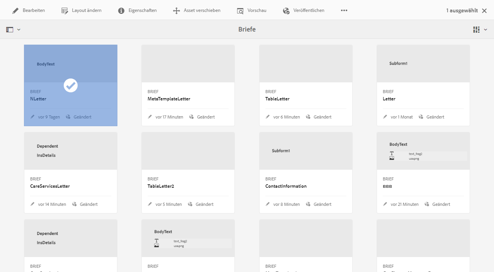
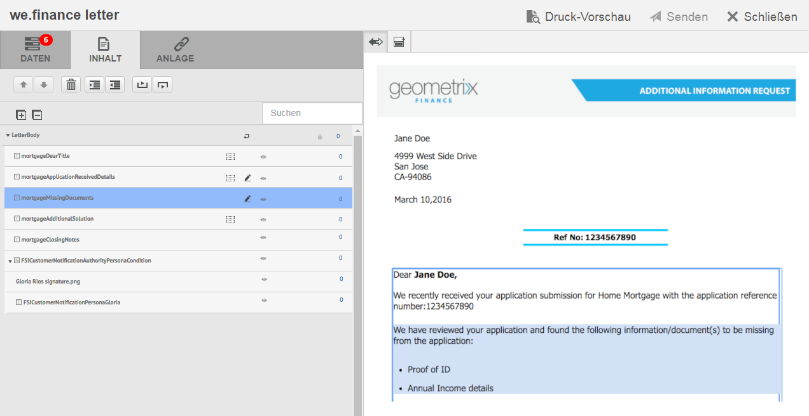
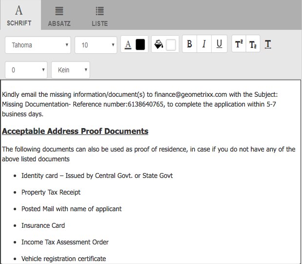

# Korrespondenz erstellen{#create-correspondence}

## Verwenden Sie zum Erstellen von Korrespondenz die Benutzeroberfläche „Korrespondenz erstellen“. {#create-correspondence-in-the-create-correspondence-user-interface}

Nachdem [in Correspondence Management eine Briefvorlage erstellt wurde](../../forms/using/create-letter.md), kann der Endbenutzer/Agent/Schadensregulierer den Brief in der Benutzeroberfläche „Korrespondenz erstellen“ öffnen und durch Eingabe von Daten, Einrichten von Inhalten und Verwalten von Anlagen eine Korrespondenz erstellen. Schließlich kann der Schadensregulierer oder Agent den Inhalt im Vorschaumodus verwalten und den Brief senden.

### Vorschau von Korrespondenz {#preview-a-correspondence}

Wählen Sie den Brief für die Vorschau wie folgt aus:

1. Tippen Sie auf der Seite „Briefe“ auf **Auswählen**.
1. Wählen Sie den entsprechenden Brief aus, indem Sie darauf tippen.

   

   Brief auswählen

1. Wählen Sie für einen auf einem Datenwörterbuch basierenden Brief **Vorschau** > **Vorschau**. Oder wählen Sie für einen auf ein Nicht-Daten-Wörterbuch basierenden Brief **Vorschau**. Sie können auch die Maus über einen Brief bewegen (ohne ihn auszuwählen) und auf das Symbol „Briefvorschau“ tippen, um davon eine Vorschau anzuzeigen.

   >[!NOTE]
   >
   >Wenn kein Datenwörterbuch mit den Brief verknüpft ist, wird die Briefvorschau geöffnet. Wenn der Brief jedoch auf einem Datenwörterbuch basiert, zeigt Correspondence Management im Menü „Vorschau“ die Optionen „Vorschau“ und „Benutzerdefiniert“ an, zwischen denen Sie wählen können. Sie können auch Testdaten mit einem Datenwörterbuch verknüpfen. Wenn [Testdaten mit dem Datenwörterbuch verbunden sind](../../forms/using/data-dictionary.md#p-working-with-test-data-p), wird bei Auswahl der Option „Vorschau“ die normale Vorschau, ausgefüllt mit den Testdaten, angezeigt.

1. Damit Sie eine Korrespondenz während der Vorschau rendern können, sollten Sie entweder ein Administrator oder Teil einer der folgenden Gruppen sein:

   * forms-users (zur Vorschau auf der Autoreninstanz)
   * cm-agent-users (für Rendering auf Veröffentlichungsinstanz)

   Wenn Sie nicht über die erforderlichen Berechtigungen verfügen, bitten Sie den Administrator um den entsprechenden Zugriff. Weitere Informationen zum Erstellen und Hinzufügen von Benutzern zu Gruppen finden Sie unter [Hinzufügen von Benutzern oder Gruppen zu einer Gruppe](/help/sites-administering/security.md). Wenn Sie versuchen, ohne die entsprechende Berechtigung eine Korrespondenz zu rendern, wird die Fehlerseite 404 angezeigt.

1. Wenn Sie **Vorschau** > **Benutzerdefiniert** wählen, wird ein Dialogfeld geöffnet. Wählen Sie in diesem Dialogfeld eine dem Datenwörterbuch entsprechende Dateidatei für die Vorschau des Briefs und dann **Vorschau**. Eine Datendatei wird basierend auf einem Datenwörterbuch für einen bestimmten Brief erstellt: Weitere Informationen zur Datendatei finden Sie unter [Datenwörterbuch](../../forms/using/data-dictionary.md#p-working-with-test-data-p).

   

1. Die HTML-Vorschau des Briefs (Vorschau für Formulare auf Mobilgeräten) wird geöffnet, wobei die Registerkarte „Daten“ standardmäßig aktiv ist.

   Weitere Informationen zu Formularen auf Mobilgeräten und den hierfür unterstützen Funktionen finden Sie unter[ Funktionsunterschiede zwischen Mobile Forms und PDF-Formularen](https://helpx.adobe.com/de/livecycle/help/mobile-forms/feature-differentiation-mobile-forms-pdf.html).

   Es gibt drei Registerkarten: Daten, Inhalt und Anlagen. Wenn keine Datenelemente (Platzhaltervariablen und Layout-Felder) vorhanden sind, wird der Brief direkt in der Inhaltsansicht geöffnet. Die Registerkarte „Anlagen“ ist nur verfügbar, wenn Anlagen vorhanden sind oder der Bibliothekszugriff aktiviert ist.

   >[!NOTE]
   >
   >Weitere Informationen zum Umschalten der Briefvorschau zwischen HTML- und PDF-Darstellungsmodus finden Sie unter [Ändern des Darstellungsmodus des Briefs](#changerenditionmode). Weitere Informationen zur PDF-Unterstützung in Correspondence Management und AEM finden Sie unter [Auslauf der Unterstützung für das NPAPI-Browser-Plug-in und seine Auswirkungen](https://helpx.adobe.com/de/aem-forms/kb/discontinuation-of-npapi-plugins-impact-on-aem-forms.html) und [PDF-Formulare in HTML5-Formulare](https://helpx.adobe.com/de/aem-forms/kb/pdf-forms-to-html5-forms.html).

### Daten eingeben {#enterdata}

Füllen Sie auf der Registerkarte „Daten“ die verfügbaren Layout-Felder und Platzhalter aus.

1. Geben Sie die Daten und Inhaltsvariablen wie benötigt in den Feldern ein. Füllen Sie alle Pflichtfelder aus, die mit einem Sternchen (&#42;), um die **Einsenden** Schaltfläche.

   Tippen Sie auf einen Datenfeldwert in der HTML-Briefvorschau, um das entsprechende Datenfeld in der Registerkarte „Daten“ zu markieren.

    

### Inhalt verwalten {#managecontent}

In der Registerkarte verwalten Sie den Inhalt, z. B. Dokumentfragmente und die Inhaltsvariablen im Brief.

1. Wählen Sie **Inhalt**. Correspondence Management zeigt die Registerkarte „Inhalt“ des Briefes an.

   

1. Bearbeiten Sie auf der Registerkarte „Inhalt“ die Inhaltsmodule wie benötigt. Um den Fokus auf das relevante Inhaltsmodul in der Inhaltshierarchie zu verlegen, können Sie entweder auf die betreffende Zeile oder den betreffenden Absatz in der Briefvorschau oder direkt auf das Inhaltsmodul in der Inhaltshierarchie tippen.

   Beispielsweise ist die Zeile „Wir haben … geprüft“ in der unten stehenden Grafik ausgewählt und das zutreffenden Inhaltsmodul wird auf der Registerkarte „Inhalt“ ausgewählt.

   

   Auf der Registerkarte „Inhalt“ oder „Daten“ können Sie durch Tippen auf „Ausgewählte Module hervorheben“ () oben links in der HTML-Briefvorschau die Funktionalität deaktivieren oder aktivieren, zum Inhalts-/Datenmodul zu wechseln, wenn der entsprechende Text, Absatz oder das Datenfeld in der Briefvorschau ausgewählt wird.

   Weitere Informationen zu Aktionen, die für verschiedene Module in der Benutzeroberfläche „Korrespondenz erstellen“ verfügbar sind, finden Sie unter [In der Benutzeroberfläche „Korrespondenz erstellen“ verfügbare Vorgehensweisen und Informationen](#actions-and-info-available-in-the-create-correspondence-content-tab).

1. Verwenden Sie zum Suchen nach Inhaltsmodulen das Suchfeld. Geben den Namen oder Titel des Inhaltsmoduls ganz oder teilweise ein, um in der Korrespondenz nach diesem zu suchen.
1. Tippen Sie auf das Symbol „Anzeigen“ () vor einer Liste, einem Text, einer Bedingung oder einem Zielbereich, um diese(n) in einem Brief zu zeigen oder auszublenden.
1. Um ein Inline- oder editierbares Textmodul zu bearbeiten, tippen Sie auf das entsprechende Symbol zum **Bearbeiten** () oder doppelklicken Sie auf das entsprechende Textmodul in der Briefvorschau.

   Das System zeigt einen Texteditor zum Bearbeiten und Formatieren des Textes an.

   Die normale Rechtschreibprüfung Ihres Browsers überprüft die Rechtschreibung im Texteditor. Um die Rechtschreib- und Grammatikprüfung zu verwalten, können Sie die Einstellungen für die Rechtschreibprüfung in Ihrem Browser bearbeiten oder Browser-Plugins/-Addons für die Prüfung von Rechtschreibung und Grammatik installieren.

   Sie können die verschiedenen Tastaturbefehle im Texteditor verwenden, um Text zu verwalten, zu bearbeiten und zu formatieren. Weitere Informationen zu den Tastaturbefehlen für den [Texteditor](/help/forms/using/keyboard-shortcuts.md#correspondence-management) finden Sie unter „Correspondence Management-Tastaturbefehle“.

   

   Möglicherweise möchten Sie einen Absatz des Textes, der in einer anderen Anwendung des Dokuments vorhanden ist, wiederverwenden. Sie können Text direkt kopieren und einfügen, z. B. von MS Word, HTML-Seiten oder von einer anderen Anwendung.

   Sie können einen Textabsatz in ein Textmodul kopieren. Beispielsweise haben Sie ein MS-Word-Dokument mit einer Liste mit Aufzählungszeichen mit Aufenthaltsnachweisen:

   

   Sie können den Text direkt aus dem MS Word-Dokument in ein bearbeitbares Textmodul kopieren. Die Formatierung wie die Liste mit Aufzählungszeichen, die Schriftart und Textfarbe wird im Textmodul beibehalten.

   

   >[!NOTE]
   >
   >Die Formatierung des eingefügten Textes hat jedoch einige[ Einschränkungen](https://helpx.adobe.com/de/aem-forms/kb/cm-copy-paste-text-limitations.html).

   Sie können den Text und die Zahlen im Brief mithilfe der Tabulatortaste einziehen. Beispielsweise können Sie die Tabulatortaste verwenden, um mehrere Textspalten in einer Liste in einem tabellarischen Format auszurichten.

   

   Beispielsweise können Sie die Tabulatortaste verwenden, um mehrere Textspalten in einer Liste in einem tabellarischen Format auszurichten.

   >[!NOTE]
   >
   >Weitere Informationen zum Einrichten von Tabulatorabständen für Ihre Textmodule und Briefe finden Sie unter [Weitere Informationen zur Verwendung von Tabulatorabständen zum Anordnen von Text](https://helpx.adobe.com/de/aem-forms/kb/aem-forms-releases.html).

1. Falls erforderlich, fügen Sie Sonderzeichen in die Korrespondenz ein. Beispielsweise können Sie über die Sonderzeichenpalette die folgenden Zeichen einfügen:

   * Währungssymbole wie €,￥ und £
   * Mathematische Symbole wie ∑, √, ∂ und ^
   * Satzzeichen wie ‟ und &quot;

   

   Correspondence Management enthält integrierte Unterstützung für 210 Sonderzeichen. Der Administrator kann [Unterstützung für mehr/benutzerdefinierte Sonderzeichen durch Anpassung hinzufügen](../../forms/using/custom-special-characters.md).

1. Um Teile eines Textes in einem bearbeitbaren Inline-Modul hervorzuheben, wählen Sie den Text aus und tippen Sie auf „Hervorhebungsfarbe“.

   

   Sie können entweder direkt auf eine Grundfarbe `**[A]**` in der Grundfarbenpalette tippen oder auf **Auswählen**, nachdem Sie mithilfe des Schiebereglers `**[B]**` den gewünschten Farbton ausgewählt haben.

   Optional können Sie auch auf der Registerkarte „Erweitert“ die gewünschten Werte für Farbton, Helligkeit und Sättigung `**[C]**` wählen, um die Farbe präzise festzulegen, und dann auf „Auswählen“ `**[D]**` tippen, um diese Farbe zum Hervorheben des Textes anzuwenden.

   

1. Nehmen Sie die benötigten Änderungen an Inhalt und Format vor und tippen Sie auf **Speichern**. Durch Tippen auf  wechseln Sie zwischen den bearbeitbaren Textmodulen, durch Tippen auf **Speichern und weiter** speichern Sie die Änderungen und wechseln zum nächsten bearbeitbaren Textmodul.
1. Das System zeigt auch die nicht ausgefüllten Variablen für jeden der Zweige an. Wenn es keine nicht ausgefüllten Variablen gibt, werden nicht ausgefüllte Variablen als „0“ angegeben. Wenn eine nicht ausgefüllte Variable vorhanden ist, können Sie auf einen Zweig tippen, um ihn zu erweitern und die nicht ausgefüllte Variable zu finden. Verwenden Sie die Symbolleiste „Inhalt“, um Inhalte zu löschen, den Einzug eines Inhalts zu vergrößern oder zu verringern und Seitenumbrüche vor oder nach einem Inhalt einzufügen.

   Sie können Seitenumbrüche sowohl vor als auch nach den Datenmodulen einfügen, selbst wenn sie Teil von Listen und Bedingungen sind.

1. Tippen Sie auf „Inhaltsvariable öffnen/schließen“ (), um die Inhaltsvariablen zu öffnen und sie entsprechend zu füllen.
1. Nachdem Sie die nicht ausgefüllte Variable korrekt ausgefüllt haben, wird die Anzahl der nicht ausgefüllten Variablen auf „0“ eingestellt.

   In der Benutzeroberfläche „Korrespondenz erstellen“ wird die Anzahl nicht ausgefüllter Variablen auf jeder Ebene der Hierarchie der Module angezeigt, die mindestens eine Variable enthalten. Wenn ein Modul nicht ausgefüllte Variablen enthält, wird deren Anzahl auf Variablen-, Modul-, Zielbereichs- und Briefvorlagenebene angezeigt.

   Die Anzahl der nicht ausgefüllten Variablen umfasst:

   * Nur ungeschützte Datenwörterbuch und Platzhaltervariablen. Die Variablenanzahl umfasst nicht Layout- oder geschützte Datenwörterbuchvariablen.
   * Obligatorische Felder.
   * Layout-Felder, wenn sie obligatorisch und an den Benutzer gebunden sind.
   * Nur eindeutige Variableninstanzen. Wenn ein Modul, Zielbereich oder eine Briefvorlage zwei oder mehr Instanzen derselben Variable enthält, wird die Anzahl als „1“ (eins) angezeigt. Allerdings wird für jede der Instanzen „1“ als Anzahl angezeigt.

   Die Anzahl der nicht ausgefüllten Variablen umfasst keine deaktivierten Module. Wenn ein Modul in einer Briefvorlage aber nicht im Brief enthalten ist, wird die Anzahl der nicht ausgefüllten Variablen in diesem Modul nicht angezeigt.

   Für Zielbereich, Modul und Variable wird die Anzahl auf der rechten Seite jedes Objekts in der Briefvorlage angezeigt. Für die gesamte Vorlage wird die Anzahl jedoch in der Statusleiste von „Korrespondenz erstellen“ angezeigt.

   Die Module in einer Briefvorlage zeigen die Anzahl nicht ausgefüllter Variable an wie folgt:

   * **Text**: Zeigt die Anzahl der eindeutigen nicht ausgefüllten Platzhaltervariablen und Datenwörterbuchelemente an, die im Textmodul enthalten sind.
   * **Bedingung**: Zeigt die Anzahl der eindeutigen nicht ausgefüllten Bedingungsvariablen an, die in der Bedingung enthalten sind, und der Variablen, die in den resultierenden Modulen enthalten sind.
   * **Liste**: Zeigt die Anzahl aller eindeutigen nicht ausgefüllten Variablen an, die in den Modulen enthalten sind, die der Liste zugewiesen wurden.
   * **Zielbereich**: Gibt die Anzahl aller eindeutigen nicht ausgefüllten Variablen an, die in den Modulen enthalten sind, die dem Zielbereich zugewiesen wurden.

   Beachten Sie Folgendes zu Variablen mit Standardwerten:

   * Ein boolesches Variablenfeld ergibt standardmäßig *false*. Die Variable wird jedoch als nicht ausgefüllt erfasst. Dies bedeutet, dass die Variablenanzahl alle booleschen Variablenfelder mit dem Wert *false* umfasst.

   * Ein numerisches Variablenfeld ergibt standardmäßig *0 (Null)*. Die Variable wird jedoch als nicht ausgefüllt erfasst. Dies bedeutet, dass die Variablenanzahl alle numerischen Variablenfelder mit dem Wert *0 (Null)* umfasst.

#### Aktionen und Informationen auf der Registerkarte „Inhalt“ in „Korrespondenz erstellen“ {#actions-and-info-available-in-the-create-correspondence-content-tab}

**Zielbereich**

* Leere Linie einfügen: Fügt eine neue leere Linie ein.
* Inline-Text einfügen: Fügt neues Textmodul ein.
* Reihenfolge sperren (Info): Gibt an, dass die Reihenfolge der Inhalte nicht geändert werden kann.
* Nicht ausgefüllte Werte (Info): Gibt die Anzahl der nicht ausgefüllten Variablen im Zielbereich an.

**Modul**

* Auswahl (Augenauswahl): Schließt Modul aus dem Brief ein oder aus.
* Aufzählungszeichen überspringen (gilt für Listenmodule und ihre untergeordneten Module): Überspringt Aufzählungszeichen in einem bestimmten Modul.
* Seitenumbruch bevor (anwendbar für untergeordnete Module des Zielbereichs): Fügt Seitenumbruch vor dem Modul ein.
* Seitenumbruch nach (anwendbar für untergeordnete Module des Zielbereichs): Fügt nach dem Modul einen Seitenumbruch ein.
* Nicht ausgefüllte Werte (Info): Gibt die Anzahl der nicht ausgefüllten Variablen im Zielbereich an.
* Bearbeiten (nur Textmodule): Öffnen Sie den Rich-Text-Editor zum Bearbeiten des Textmoduls.
* Datenformat (Text- und Bedingungsmodule): Öffnen Sie alle Variablen des Moduls.

**Listenmodul**

* Leere Linie einfügen: Fügt eine neue leere Linie ein.
* Inhaltsbibliothek: Öffnet die Inhaltsbibliothek, um der Liste Module hinzuzufügen.
* Liste einrichten (nur verschachtelte Liste):
* Reihenfolge sperren (Info): Gibt an, dass die Reihenfolge der Listenelemente nicht geändert werden kann.

### Anlagen verwalten {#manage-attachments}

1. Wählen Sie **Anlagen**. Correspondence Management zeigt die verfügbaren Anhänge an, wie sie beim Erstellen der Briefvorlage eingerichtet wurden.
1. Sie können festlegen, dass keine Anhänge mit dem Brief versendet werden sollen, indem Sie auf das Symbol für Anzeige tippen, und Sie können auf das Kreuz im Anhang tippen, um ihn aus dem Brief zu entfernen. Für Anhänge, die beim Erstellen der Briefvorlage als Obligatorisch definiert wurden, sind die Symbole „Anzeigen“ und „Löschen“ deaktiviert.
1. Tippen Sie auf das Symbol „Bibliothekszugriff“ (), um auf die Inhaltsbibliothek zuzugreifen und DAM-Assets als Anhänge einzufügen.

   >[!NOTE]
   >
   >Das Symbol „Bibliothekszugriff“ ist nur verfügbar, wenn der Bibliothekszugriff beim Verfassen des Briefes aktiviert wurde.

1. Wenn die Reihenfolge der Anlagen beim Erstellen der Korrespondenz nicht gesperrt war, können Sie die Reihenfolge der Anlagen neu anordnen, indem Sie eine Anlage auswählen und auf die Pfeile nach unten oder nach oben tippen.

   Weitere Informationen finden Sie unter[ Anlagenübermittlung](#attachmentdelivery).

### Inhalte in der Vorschau verwalten und Brief übermitteln {#manage-content-in-preview-and-submit-the-letter}

Sie können Ihren Zwecken entsprechende Änderungen an Layout und Inhalt des Briefs vornehmen und diesen an verschiedene nachfolgende Prozesse übermitteln.

1. Um den gesamten bearbeitbaren Inhalt des Brief zu markieren, tippen Sie auf **Bearbeitbare Bereiche markieren**.

   Die bearbeitbaren Inhalte des Briefs werden mit grauem Hintergrund markiert.

   

1. Bearbeiten Sie auf der Registerkarte „Inhalt“ die Inhaltsmodule wie benötigt. Um den Fokus auf das relevante Inhaltsmodul in der Inhaltshierarchie zu verlegen, können Sie entweder auf die betreffende Zeile oder den betreffenden Absatz in der Briefvorschau oder direkt auf das Inhaltsmodul in der Inhaltshierarchie tippen.

   Beispielsweise wurde in der unten gezeigten Abbildung auf die Zeile „Um uns Zugriff zu gewähren...“ ausgewählt und das dazugehörige Inhaltsmodul auf der Registerkarte „Inhalt“ ausgewählt.

   Durch Tippen auf „Ausgewählte Module im Inhalt hervorheben“ () können Sie eine Funktion aktivieren oder deaktivieren, die bewirkt, dass beim Tippen auf den relevanten Text oder Absatz bzw. das Datenfeld in der Briefvorschau das dazugehörige Inhaltsmodul auf der Registerkarte „Inhalt“ markiert wird.

   Weitere Informationen zu Aktionen, die für verschiedene Module in der Benutzeroberfläche „Korrespondenz erstellen“ verfügbar sind, finden Sie unter [In der Benutzeroberfläche „Korrespondenz erstellen“ verfügbare Vorgehensweisen und Informationen](#actions-and-info-available-in-the-create-correspondence-content-tab).

1. Um dem Brief einen Seitenumbruch hinzuzufügen, tippen Sie auf die Stelle, an der Sie den Seitenumbruch einfügen möchten, und wählen Sie „Seitenumbruch vor“ oder „Seitenumbruch nach“ ().

   Ein Platzhalter für einen expliziten Seitenumbruch wird in den Brief eingefügt. Sie können die Wirkung eines expliziten Seitenumbruchs anzeigen, indem Sie die reduzierte PDF-Vorschau aufrufen.

   >[!NOTE]
   >
   >Da -Mobile Forms Seitenumbrüche nicht unterstützen, werden Kopf- und Fußzeilen nur einmal angezeigt. Es ist allerdings möglich, Kopf- und Fußzeilen explizit im Layout (pro Seite) festzulegen, sodass sie in der Mobile Forms-Vorschau angezeigt werden. Auch leere Seiten im Brief (falls vorhanden) werden nicht in der Vorschau für Mobile Forms angezeigt.

   

1. Um den Brief als Entwurf zu speichern, an dem Sie später weiter arbeiten können, tippen Sie auf „Als Entwurf speichern“. Diese Option können Sie nur verwenden, wenn der Brief[ veröffentlicht werden soll](../../forms/using/publishing-unpublishing-forms.md#publishanasset). Weitere Informationen finden Sie unter[ Speichern von Entwürfen und Einreichen von Entwurfsinstanzen](#savingdrafts).

   

   Das Dialogfeld „Entwurfsbriefname“ wird mit der Briefinstanz-ID angezeigt. Sie können optional diese ID bearbeiten. Notieren Sie sich die Brief-ID und tippen Sie anschließend auf **Fertig**. Sie können diese ID später verwenden, um den [Briefentwurf neu zu laden](submit-letter-topostprocess.md#reloaddraft).

1. Um den Brief als reduzierte PDF-Datei mit Layout und Seitenumbrüchen exakt so anzuzeigen, wie er gesendet werden wird, tippen Sie auf „Vorschau“ ().

   Der Brief wird als reduzierte PDF-Datei angezeigt. Das reduzierte PDF ist die genaue Darstellung des Briefs mit den richtigen Schriftarten, Umbrüchen und dem Layout in der Form, in der er gesendet wird.  

   >[!NOTE]
   >
   >Wenn Sie Mozilla Firefox und den HTML-Darstellungstyp verwenden, achten Sie für die Vorschau des Briefs als reduzierte PDF-Datei darauf, nicht das Acrobat-Plugin, sondern das native Browser-Plugin zu verwenden. Um das native Browser-Plugin auszuwählen, wählen Sie in den Einstellungen von Mozilla Firefox die Option „Vorschau in Firefox“ für den PDF-Inhaltstyp.

1. Wenn die reduzierte PDF-Vorschau Ihren Vorstellungen entspricht, tippen Sie auf **Senden**, um den Brief zu senden. Wenn Sie Änderungen am Brief vornehmen möchten, tippen Sie stattdessen auf **Vorschau beenden**, um zur Vorschau des Briefs in der Benutzeroberfläche „Korrespondenz erstellen“ zurückzukehren und dort die Änderungen vorzunehmen. Wenn Sie auf „Senden“ tippen, wird die Instanz „Brief senden“ erstellt, falls die Konfiguration „Briefinstanz verwalten“ in der Instanz „Veröffentlichen“ aktiviert ist.

   Weitere Informationen finden Sie unter Speichern von Entwürfen und Einreichen von Entwurfsinstanzen.

   Sie können den Brief auch als Entwurf speichern, um später Änderungen daran vorzunehmen.

   Nachdem Sie die erforderlichen Änderungen vorgenommen haben, können Sie den Brief von der HTML5-Vorschau aus senden oder erneut auf „Vorschau“ klicken, um die reduzierte PDF-Ausgabe zu prüfen.

   Weitere Informationen zu den Unterschieden zwischen HTML5-Formularen und PDF-Formularen finden Sie unter [Funktionsunterschiede zwischen HTML5-Formularen und PDF-Formularen](../../forms/using/feature-differentiation-html5-forms-pdf-forms.md).

## Speichern von Entwürfen und Senden von Briefinstanzen {#savingdrafts}

Wenn ein Brief in der Benutzeroberfläche „Korrespondenz erstellen“ gerendert wird, können Sie den Brief so speichern, wie er angezeigt wird.

Es gibt zwei Arten von Briefinstanzen, die gespeichert werden können: Entwurfsinstanz und Sendeinstanz.

* **Entwurfsinstanz**: Entwurfsinstanz erfasst den aktuellen Status des Briefs, den Sie in der Vorschau anzeigen. Um eine Entwurfsinstanz zu speichern, muss zuerst sichergestellt werden, dass der Brief und alle Assets, die der Brief referenziert im Status „Veröffentlicht“ sind. Weitere Informationen zum Veröffentlichen eines Briefs finden Sie unter[ Veröffentlichen von Assets](../../forms/using/publishing-unpublishing-forms.md#publishanasset). Sie müssen einen Brief veröffentlichen, bevor Sie ihn als Entwurf speichern können, da Sie, wenn Sie einen Brief veröffentlichen, eine Version des Briefs, der abhängige Assets und Daten erstellen. Die veröffentlichte Version eines Briefs kann nicht von Ihnen oder einem anderen Benutzer bearbeitet werden und kann ohne unerwartete Diskrepanzen von der veröffentlichten Version zu einem späteren Zeitpunkt wiederhergestellt werden. Sie können zu einem späteren Zeitpunkt zu dieser Instanz zurückkehren und von Ihrem Schritt aus fortfahren.

* **Sendeinstanz**: Sendeinstanzen erfassen den Status des Briefes zum Sendezeitpunkt. Die Sendeinstanz speichert den PDF-Status der Briefinstanz, nachdem sie zusammen mit den vom Benutzer in der Benutzeroberfläche „Korrespondenz erstellen“ eingegebenen Daten nachbearbeitet wurde.

Solche Instanzen können nur gespeichert werden, wenn der Brief in der öffentlichen Instanz angezeigt wird. Das Speichern von Instanzen ist standardmäßig deaktiviert. Führen Sie die folgenden Schritte durch, um das Speichern von Briefinstanzen zu aktivieren.

1. Öffnen Sie in AEM die Adobe Experience Manager Web Console-Konfiguration für Ihren Server mit der folgenden URL: https://&lt;server>:&lt;port>/&lt;contextpath>/system/console/configMgr
1. Suchen Sie nach **[!UICONTROL Correspondence Management-Konfigurationen]** und klicken Sie darauf.
1. Überprüfen Sie die Konfiguration **[!UICONTROL Briefinstanzen im Veröffentlichungsmodus verwalten]** und klicken Sie dann auf **[!UICONTROL Speichern]**.

### Funktion zum Speichern von Entwürfen aktivieren {#enable-save-draft-feature}

Führen Sie vor dem Veröffentlichen von Briefen oder Speichern von Entwürfen in der Veröffentlichungsinstanz die folgenden Schritte aus, um die Funktion &quot;Als Entwurf speichern&quot;zu aktivieren:

1. Öffnen Sie die Web-Konsolenkonfiguration für Ihren Server mithilfe der folgenden URL: https://&lt;server>:&lt;port>/&lt;contextpath>/system/console/configMgr.

1. Klicken Sie auf **Bearbeiten** neben der Einstellung *com.adobe.livecycle.content.activate.impl.VersionRestoreManagerImpl.name*.

1. Im *Autoren-URL für VersionRestoreManager* Geben Sie die URL für die entsprechende Autoreninstanz an.

1. Klicken Sie auf Speichern .

Die *cq:lastReplicationAction*, *cq:lastreplicated* und *cq:lastReplicatedBy* -Eigenschaften werden nicht standardmäßig in die Veröffentlichungsinstanz übertragen. Um das erneute Laden von Entwürfen in der Veröffentlichungsinstanz zu aktivieren, sind diese Eigenschaften in der Veröffentlichungsinstanz erforderlich.

Übertragung *cq:lastReplicationAction*, *cq:lastreplicated* und *cq:lastReplicatedBy* Eigenschaften für die Veröffentlichungsinstanz verwenden, deaktivieren Sie die Komponente als *com.day.cq.replication.impl.ReplicationPropertiesFilterFactory* in der -Autoreninstanz mithilfe der URL:`http://server:port/system/console/components`

Wenn das Speichern von Briefinstanzen gespeichert ist, können Sie wählen, wo Sie die Briefinstanzen speichern möchten. Zum Speichern der Briefinstanzen gibt es zwei Optionen: „Lokal speichern“ oder „Remote speichern“.

### Lokal speichern {#local-save}

Briefinstanzen werden in der Veröffentlichungsinstanz gespeichert und in der Autorinstanz rückwärtsrepliziert.

### Remote Speichern {#remote-save}

Diese Option ist für Personen vorgesehen, die bezüglich des Speicherns von Daten in Veröffentlichungsinstanzen haben, die sich normalerweise außerhalb der Firewall des Unternehmens befinden. Wenn die Option „Remote Speichern“ aktiviert ist, werden die Instanzen nicht in der Veröffentlichungsoptionen gespeichert. Sie werden remote vom verarbeitenden Autor gespeichert, der über die LiveCycle Client SDK-Konfigurationen angegeben wird.

#### Aktivieren von „Remote Speichern“ {#enable-remote-save}

1. Öffnen Sie in AEM die Adobe Experience Manager Web Console-Konfiguration für Ihren Server mit der folgenden URL: `https://<server>:<port>/<contextpath>/system/console/configMgr`
1. Suchen Sie nach **[!UICONTROL Correspondence Management-Konfigurationen]** und klicken Sie darauf.
1. Suchen Sie die Konfiguration **[!UICONTROL Remote Speichern]**, überprüfen Sie sie und klicken Sie auf **[!UICONTROL Speichern]**.

#### Angeben der Einstellungen für Prozessautor {#specify-processing-author-settings}

1. Öffnen Sie in AEM die Adobe Experience Manager Web Console-Konfiguration für Ihren Server mit der folgenden URL: `https://<server>:<port>/<contextpath>/system/console/configMgr`

   

1. Suchen Sie auf dieser Seite Adobe LiveCycle Client SDK-Konfiguration und erweitern Sie sie durch Klicken auf.

1. Geben Sie in im Feld für die Verarbeitung der Server-URL den Namen Ihres LiveCycle-Servers sowie die Anmeldeinformationen ein und klicken Sie dann auf **Speichern**.

   

1. Legen Sie bei Bedarf den Benutzernamen und das Kennwort fest, mit dem Sie auf den Server zugreifen möchten.

#### Anlagenübermittlung {#attachmentdelivery}

* Die Briefanlagen sind verfügbare Nachbearbeitungen in der PDF-Datei, die nach der Briefsendung erstellt wird.
* Wenn der Brief mit serverseitigen APIs als interaktive oder nicht interaktive PDF gerendert wird, enthält er PDF-Anlagen.
* Wenn ein mit einer Briefvorlage verknüpfter Nachbearbeitungsprozess beim Senden oder Abschließen der Korrespondenz in der Benutzeroberfläche „Korrespondenz erstellen“ aufgerufen wird, werden die Anlagen als Parameter List&lt;com.adobe.idp.Document> in AttachmentDocs übergeben.
* Vordefinierte Übermittlungsmechanismen, wie z. B. E-Mail und Drucken, übermitteln Anhänge zusammen mit einer PDF der generierten Korrespondenz.

## Darstellungsmodi der Briefvorschau: Mobile Forms- und PDF-Vorschau {#rendition-modes-of-letter-preview-mobile-forms-preview-and-pdf-preview}

AEM Forms Correspondence Management zeigt Briefe in der Benutzeroberfläche „Korrespondenz erstellen“ im HTML-Format an. Correspondence Management unterstützt jedoch weiterhin die Wiederherstellung der PDF-Vorschau anstelle der HTML-Vorschau. Weitere Informationen zum Wechseln zwischen HTML- und PDF-Modus für die Vorschau finden Sie unter [Ändern des Darstellungsmodus des Briefs](#changerenditionmode).

Die folgenden Vorteile und Funktionen stehen jeweils bei der HTML- und PDF-Vorschau zur Verfügung.

**Vorteile der Mobile Forms-/HTML-Vorschau**

* **Markieren des zugehörigen Datenfelds durch Tippen auf einen Datenfeldwert**: Indem Sie in der Benutzeroberfläche „Korrespondenz erstellen“ auf den Wert eines Datenfelds im Brief tippen, können Sie das dazugehörige Datenfeld auf der Registerkarte „Daten“ markieren. Weitere Informationen finden Sie unter [Daten eingeben](#enterdata).

* **Browserunterstützung**: In Browsern wird NPAPI immer weniger unterstützt, was sich auf die PDF-Vorschau von Briefen auswirkt. Die HTML-/Mobile Forms-Vorschau von Briefen ist davon nicht betroffen.
* **Markieren bearbeitbarer Inhalte in einem Brief**: In der Benutzeroberfläche „Korrespondenz erstellen“ können Sie durch Klicken auf „Bearbeitbare Inhalte markieren“ den gesamten bearbeitbaren Inhalt in Grau hervorheben. Weitere Informationen finden Sie unter [Inhalt verwalten](#managecontent).

`<li>` `<li>Benefits of HTML preview  <ul>   <li>Right to left</li>   <li>NPAPI</li>   <li>Highlight Editable Content</li>  </ul> </li>` `<li>Benefits of PDF preview  <ul>   <li>Page Break</li>   <li>Final Preview</li>  </ul> </li>`
`<li>` `<li>Benefits of HTML preview  <ul>   <li>Right to left</li>   <li>NPAPI</li>   <li>Highlight Editable Content</li>  </ul> </li>` `<li>Benefits of PDF preview  <ul>   <li>Page Break</li>   <li>Final Preview</li>  </ul> </li>`  **Vorteile der PDF-Vorschau**

* **Seitenumbruch**: In der PDF-Vorschau eine Vorschau können Sie genau erkennen, wie die Seitenumbrüche im Brief sich auf dessen Ausgabe auswirken.
* **Abschließende Vorschau**: In der PDF-Vorschau können die genaue Formatierung und das Erscheinungsbild des Briefs für die Ausgabe angezeigt werden.

Weitere Informationen zur Skriptunterstützung in PDF-Formularen finden Sie unter [Skriptunterstützung](https://help.adobe.com/de_DE/livecycle/11.0/ScriptingSupport/index.html).

Weitere Informationen zur Skriptunterstützung in HTML5-Formularen finden Sie unter [Skriptunterstützung für HTML5-Formulare](/help/forms/using/scripting-support.md).

### Ändern des Darstellungsmodus des Briefs {#changerenditionmode}

In der Benutzeroberfläche „Korrespondenz erstellen“ wird standardmäßig HTML oder Mobile Forms zum Rendern der Briefvorschau verwendet. Die Mobile Forms-Vorschau kann in beliebigen Browsern problemlos gerendert werden, da sie das native Plugin des Browsers verwendet und daher keine zusätzlichen Plugins benötigt werden. Sie können zum Briefvorschaumodus PDF wechseln. Allerdings können aufgrund von Browserbeschränkungen Probleme bei verschiedenen Funktionen der interaktiven PDF-Vorschau des Briefs auftreten.

Weitere Informationen zur Browserkompatibilität bei der Briefvorschau finden Sie unter [Auslauf der Unterstützung für das NPAPI-Browser-Plugin und Auswirkungen](https://helpx.adobe.com/aem-forms/kb/discontinuation-of-npapi-plugins-impact-on-aem-forms.html).

Um den Vorschaumodus des Briefs zu ändern, führen Sie die folgenden Schritte aus:

1. Navigieren Sie zu `https://[system]:'port'/system/console/configMgr` und melden Sie sich nötigenfalls als Administrator an.
1. Navigieren Sie zu **[!UICONTROL Correspondence Management-Konfigurationen]** > **[!UICONTROL Wiedergabe-Typ]** und wählen Sie **HTML-Wiedergabe** (Standard) oder **PDF-Wiedergabe**.
1. Klicken Sie auf **[!UICONTROL Speichern]**.
