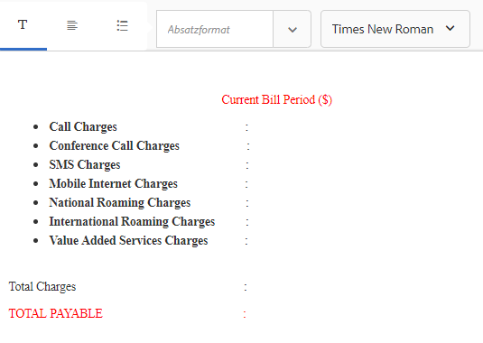

# Tutorial: Erstellen Sie Dokumentfragmente{#tutorial-create-document-fragments}

Dieses Lernprogramm ist ein Schritt in der Reihe [Erstellen Sie Ihre erste interaktive Kommunikation](/help/forms/using/create-your-first-interactive-communication.md). Es wird empfohlen, der Serie in chronologischer Reihenfolge zu folgen, um den vollständigen Anwendungsfall zu verstehen, auszuführen und zu demonstrieren.

Dokumentfragmente sind wiederverwendbare Komponenten einer Korrespondenz, die zum Erstellen einer interaktiven Kommunikation verwendet werden. Es gibt Dokumentfragmente der folgenden Typen:

* Text - Ein Textelement ist ein Inhaltselement, das aus einem oder mehreren Textabsätzen besteht. Ein Absatz kann statisch oder dynamisch sein.
* Liste - Liste ist eine Gruppe von Dokument-Fragmenten, einschließlich Text, Listen, Bedingungen und Bildern.
* Bedingung - Mithilfe von Bedingungen können Sie festlegen, welche Inhalte auf der Grundlage der vom Formulardatenmodell erhaltenen Daten in die interaktive Kommunikation einbezogen werden sollen.

Dieses Lernprogramm führt Sie durch die Schritte zum Erstellen mehrerer Textfragmente, die auf der Anatomie basieren, die im Abschnitt [Interaktive Dokumente planen](/help/forms/using/planning-interactive-communications.md) bereitgestellt wird. Am Ende dieser Schulung können Sie Folgendes:

* Erstellen Sie Dokumentfragmente
* Variablen erstellen
* Regeln erstellen und anwenden

Im Folgenden finden Sie eine Liste der Dokumentfragmente, die in diesem Lernprogramm erstellt werden:

* [Rechnungsdetails](../../forms/using/create-document-fragments.md#step-create-bill-details-text-document-fragment)
* [Kundendetails](../../forms/using/create-document-fragments.md#step-create-customer-details-text-document-fragment)
* [Rechnungszusammenfassung](../../forms/using/create-document-fragments.md#step-create-bill-summary-text-document-fragment)
* [Zusammenfassung der Gebühren](../../forms/using/create-document-fragments.md#step-create-summary-of-charges-text-document-fragment)

Jedes Dokumentfragment enthält Felder mit statischem Text, Daten, die vom Formulardatenmodell empfangen wurden, und Daten, die über die Agentenbenutzeroberfläche eingegeben wurden. Alle diese Felder wurden im Abschnitt [Interaktive Kommunikation planen](/help/forms/using/planning-interactive-communications.md) dargestellt.

Beim Erstellen von Dokumentfragmenten in diesem Tutorial werden Variablen für Felder erstellt, die Daten über die Agentenbenutzeroberfläche empfangen.

Verwenden Sie **FDM_Create_First_IC**, wie im Abschnitt [Formulardatenmodell erstellen](../../forms/using/create-form-data-model0.md) beschrieben, als Formulardatenmodell, um Formularfragmente in diesem Lernprogramm zu erstellen.

## Schritt 1: Erstellen Sie ein Textdokumentfragment für Rechnungsdetails {#step-create-bill-details-text-document-fragment}

Das Dokumentfragment „Rechnungsdetails“ enthält die folgenden Felder:

| Feld | Datenquelle |
|---|---|
| Rechnungsnr. | Agent-Benutzeroberfläche |
| Rechnungszeitraum | Agent-Benutzeroberfläche |
| Rechnungsdatum | Agent-Benutzeroberfläche |
| Ihr Plan | Formulardatenmodell |

Führen Sie die folgenden Schritte aus, um Variablen für Felder mit Agentenbenutzeroberfläche als Datenquelle zu erstellen, statischen Text zu erstellen und Formulardatenmodellelemente im Dokumentfragment zu verwenden:

1. Wählen Sie **[!UICONTROL Formulare]** > **[!UICONTROL Dokumentfragmente]**.

1. Wählen Sie **Erstellen** > **Text**.
1. Geben Sie die folgenden Daten an:

   1. Geben Sie **bill_details_first_ic** als Name im Feld **Titel** ein. Der Titel wird im Feld **Name** automatisch ausgefüllt.

   1. Wählen Sie **Formulardatenmodell** im Abschnitt **Datenmodell** aus.

   1. Wählen Sie **FDM_Create_First_IC** als Formulardatenmodell und tippen Sie auf **Auswählen**.

   1. Tippen Sie auf **Weiter**.

1. Wählen Sie die Registerkarte **Variablen** im linken Fensterbereich und tippen Sie auf **Erstellen**.
1. Im Abschnitt **Variable erstellen**:

   1. Geben Sie als Name der Variablen **Invoicenumber** ein.
   1. Wählen Sie als Typ **String**.
   1. Tippen Sie auf **Erstellen**.

   

   Wiederholen Sie die Schritte 4 und 5, um die folgenden Variablen zu erstellen:

   * Rechnungszeitraum: String-Typ
   * Rechnungsdatum: Datumstyp

   

1. Erstellen Sie statischen Text für die folgenden Felder mit dem rechten Fensterbereich:

   * Rechnungsnr.
   * Rechnungszeitraum
   * Rechnungsdatum
   * Ihr Plan

   

1. Setzen Sie den Cursor neben dem Feld **Rechnungsnr.** und doppelklicken Sie auf die Variable **InvoiceNumber** auf der Registerkarte **Variablen** im linken Fensterbereich.
1. Platzieren Sie den Cursor neben dem Feld **Bill Period** und klicken Sie mit der Dublette auf die Variable **Billperiod**.
1. Platzieren Sie den Cursor neben dem Feld **Rechnungsdatum** und klicken Sie mit der Dublette auf die Variable **Rechnungsdatum**.
1. Wählen Sie die Registerkarte **Datenmodellobjekte** im linken Fensterbereich.
1. Platzieren Sie den Cursor neben dem Feld **Ihr Plan** und klicken Sie mit der Dublette auf die Eigenschaft **customer** > **customerplan**.

   

1. Klicken Sie auf **Speichern**, um das Textdokumentfragment „Rechnungsdetails“ zu erstellen.

## Schritt 2: Erstellen Sie ein Textdokumentfragment für Kundendetails {#step-create-customer-details-text-document-fragment}

Das Dokumentfragment „Kundendetails“ enthält die folgenden Felder:

| Feld | Datenquelle |
|---|---|
| Name des Kunden | Formulardatenmodell |
| Adresse | Formulardatenmodell |
| Ort der Lieferung | Agent-Benutzeroberfläche |
| Status-Code | Agent-Benutzeroberfläche |
| Mobilfunknummer | Formulardatenmodell |
| Alternative Kontaktnummer | Formulardatenmodell |
| Verhältnis-Nummer | Formulardatenmodell |
| Anzahl von Verbindungen | Agent-Benutzeroberfläche |

Führen Sie die folgenden Schritte aus, um Variablen für Felder mit Agentenbenutzeroberfläche als Datenquelle zu erstellen, statischen Text zu erstellen und Formulardatenmodellelemente im Dokumentfragment zu verwenden:

1. Wählen Sie **[!UICONTROL Formulare]** > **[!UICONTROL Dokumentfragmente]**.
1. Wählen Sie **Erstellen** > **Text**.
1. Geben Sie die folgenden Daten an:

   1. Geben Sie **customer_details_first_ic** als Namen in das Feld **Title** ein. Der Titel wird im Feld **Name** automatisch ausgefüllt.

   1. Wählen Sie **Formulardatenmodell** im Abschnitt **Datenmodell** aus.

   1. Wählen Sie **FDM_Create_First_IC** als Formulardatenmodell und tippen Sie auf **Auswählen**.

   1. Tippen Sie auf **Weiter**.

1. Wählen Sie die Registerkarte **Variablen** im linken Fensterbereich und tippen Sie auf **Erstellen**.
1. Im Abschnitt **Variable erstellen**:

   1. Geben Sie **Placesupply** als Namen der Variablen ein.
   1. Wählen Sie als Typ **String**.
   1. Tippen Sie auf **Erstellen**.

   Wiederholen Sie die Schritte 4 und 5, um die folgenden Variablen zu erstellen:

   * Statuscode: Zahlentyp
   * Anzahl von Verbindungen: Nummerntyp

1. Wählen Sie die Registerkarte **Datenmodellobjekte**, platzieren Sie den Cursor im rechten Bereich und klicken Sie bei Dublette auf die Eigenschaft **customer** > **name**.
1. Drücken Sie die Eingabetaste, um den Cursor zur nächsten Zeile zu bewegen, und klicken Sie bei gedrückter Dublette auf die Eigenschaft **customer** > **address**.
1. Erstellen Sie statischen Text für die folgenden Felder mit dem rechten Fensterbereich:

   * Mobilfunknummer
   * Alternative Kontaktnummer
   * Ort der Lieferung
   * Verhältnis-Nummer
   * Status-Code
   * Anzahl von Verbindungen

   

1. Platzieren Sie den Cursor neben dem Feld **Mobiltelefonnummer** und klicken Sie mit der Dublette auf die Eigenschaft **customer** > **mobilenum**.
1. Platzieren Sie den Cursor neben dem Feld **Alternative Kontaktnummer** und klicken Sie mit der Dublette auf die Eigenschaft** customer* > **alternatemobilenumber**.
1. Platzieren Sie den Cursor neben dem Feld **Beziehungsnummer** und klicken Sie mit der Dublette auf die Eigenschaft **customer** > **relation number**.
1. Klicken Sie auf die Registerkarte **Variablen**, platzieren Sie den Cursor neben dem Feld **Ort der Lieferung** und klicken Sie bei Dublette auf die Variable **Platzierung**.
1. Platzieren Sie den Cursor neben dem Feld **Statuscode** und klicken Sie bei Dublette auf die Variable **Statuscode**.
1. Platzieren Sie den Cursor neben dem Feld **Anzahl der Verbindungen** und klicken Sie bei Dublette auf die Variable **Numberverbindungen**.

   

1. Klicken Sie auf **Speichern**, um das Textfragment &quot;Kundendetails&quot;zu erstellen.

## Schritt 3: Erstellen Sie ein Textdokumentfragment für Rechnungszusammenfassung {#step-create-bill-summary-text-document-fragment}

Das Fragment &quot;Bill Summary Dokument&quot;enthält die folgenden Felder:

| Feld | Datenquelle |
|---|---|
| Vorheriger Saldo | Agent-Benutzeroberfläche |
| Zahlungen | Agent-Benutzeroberfläche |
| Anpassungen | Agent-Benutzeroberfläche |
| Gebühren des aktuellen Rechnungszeitraums | Formulardatenmodell |
| Fälliger Betrag | Agent-Benutzeroberfläche |
| Fälligkeitsdatum | Agent-Benutzeroberfläche |

Führen Sie die folgenden Schritte aus, um Variablen für Felder mit Agentenbenutzeroberfläche als Datenquelle zu erstellen, statischen Text zu erstellen und Formulardatenmodellelemente im Dokumentfragment zu verwenden:

1. Wählen Sie **[!UICONTROL Formulare]** > **[!UICONTROL Dokumentfragmente]**.
1. Wählen Sie **Erstellen** > **Text**.
1. Geben Sie die folgenden Daten an:

   1. Geben Sie **bill_summary_first_ic** als Namen in das Feld **title** ein. Der Titel wird im Feld **Name** automatisch ausgefüllt.

   1. Wählen Sie **Formulardatenmodell** im Abschnitt **Datenmodell** aus.

   1. Wählen Sie **FDM_Create_First_IC** als Formulardatenmodell und tippen Sie auf **Auswählen**.

   1. Tippen Sie auf **Weiter**.

1. Wählen Sie die Registerkarte **Variablen** im linken Fensterbereich und tippen Sie auf **Erstellen**.
1. Im Abschnitt **Variable erstellen**:

   1. Geben Sie **Previousbalance** als Namen der Variablen ein.
   1. Wählen Sie **Number** als Typ.
   1. Tippen Sie auf **Erstellen**.

   Wiederholen Sie die Schritte 4 und 5, um die folgenden Variablen zu erstellen:

   * Zahlungen: Zahlentyp
   * Anpassungen: Zahlentyp
   * Fälliger Betrag: Zahlentyp
   * Fälligkeitsdatum: Datumstyp

1. Erstellen Sie statischen Text für die folgenden Felder mit dem rechten Fensterbereich:

   * Vorheriger Saldo
   * Zahlungen
   * Anpassungen
   * Gebühren des aktuellen Rechnungszeitraums
   * Fälliger Betrag
   * Fälligkeitsdatum
   * Gebühren für verspätete Zahlungen nach Fälligkeitsdatum betragen 20 USD

   

1. Platzieren Sie den Cursor neben dem Feld **Vorheriger Saldo** und klicken Sie bei Dublette auf die Variable **Vorheriger Saldo**.
1. Platzieren Sie den Cursor neben dem Feld **Zahlungen** und klicken Sie bei Dublette auf die Variable **Zahlungen**.
1. Platzieren Sie den Cursor neben dem Feld **Adjustments** und klicken Sie bei Dublette auf die Variable **Adjustments**.
1. Platzieren Sie den Cursor neben dem Feld **Betrag fällig** und klicken Sie bei Dublette auf die Variable **Überfällig**.
1. Platzieren Sie den Cursor neben dem Feld **Fälligkeitsdatum** und klicken Sie bei Dublette auf die Variable **Duedate**.
1. Klicken Sie auf die Registerkarte **Datenmodellobjekte**, platzieren Sie den Cursor im rechten Bereich neben dem Feld **Aktueller Rechnungszeitraum** und klicken Sie mit der Dublette auf die Eigenschaft **Rechnungswerte** > **Benutzergebühren**.

   

1. Klicken Sie auf **Speichern**, um das Textfragment &quot;Kundendetails&quot;zu erstellen.

## Schritt 4: Erstellen Sie ein Textdokumentfragment für „Zusammenfassung der Kosten“{#step-create-summary-of-charges-text-document-fragment}

Das Fragment &quot;Summary of Ladungs&quot;-Dokument enthält die folgenden Felder:

| Feld | Datenquelle |
|---|---|
| Anrufgebühren | Formulardatenmodell |
| Gebühren für Telefonkonferenz | Formulardatenmodell |
| SMS-Gebühren | Formulardatenmodell |
| Mobile Internetgebühren | Formulardatenmodell |
| Nationale Roaming-Gebühren | Formulardatenmodell |
| Internationale Roaming-Gebühren | Formulardatenmodell |
| Mehrwert - Service-Gebühren | Formulardatenmodell |
| Gesamgebühren | Formulardatenmodell |
| GESAMT ZAHLBAR | Formulardatenmodell |

Führen Sie die folgenden Schritte aus, um statischen Text zu erstellen und Formulardatenmodellelemente im Dokumentfragment zu verwenden:

1. Wählen Sie **[!UICONTROL Formulare]** > **[!UICONTROL Dokumentfragmente]**.
1. Wählen Sie **Erstellen** > **Text**.
1. Geben Sie die folgenden Daten an:

   1. Geben Sie **summary_Ladungen_first_ic** als Namen in das Feld **Title** ein. Der Titel wird im Feld Name automatisch ausgefüllt.

   1. Wählen Sie **Formulardatenmodell** im Abschnitt **Datenmodell** aus.

   1. Wählen Sie **FDM_Create_First_IC** als Formulardatenmodell und tippen Sie auf **Auswählen**.

   1. Tippen Sie auf **Weiter**.

1. Erstellen Sie statischen Text für die folgenden Felder mit dem rechten Fensterbereich:

   * Anrufgebühren
   * Gebühren für Telefonkonferenz
   * SMS-Gebühren
   * Mobile Internetgebühren
   * Nationale Roaming-Gebühren
   * Internationale Roaming-Gebühren
   * Mehrwert - Service-Gebühren
   * Gesamgebühren
   * GESAMT ZAHLBAR

   

1. Wählen Sie die Registerkarte **Datenmodellobjekte**.
1. Platzieren Sie den Cursor neben dem Feld **Aufrufkosten** und klicken Sie mit der Dublette auf die Eigenschaft **Rechnungswerte** > **Aufrufe**.
1. Platzieren Sie den Cursor neben dem Feld **Konferenzaufruf-Gebühren** und klicken Sie mit der Dublette auf die Eigenschaft **Rechnungswerte** > **concall-Ladungen**.
1. Platzieren Sie den Cursor neben dem Feld **SMS Charges** und klicken Sie mit der Dublette auf die Eigenschaft **bills** > **smscharges**.
1. Platzieren Sie den Cursor neben dem Feld **Mobilfunk-Internetgebühren** und klicken Sie mit der Dublette auf die Eigenschaft **Rechnungswerte** > **internetloads**.
1. Platzieren Sie den Cursor neben dem Feld **Nationale Roaming-Gebühren** und klicken Sie mit der Dublette auf die Eigenschaft **bills** > **roamingnational**.
1. Platzieren Sie den Cursor neben dem Feld **Internationale Roaming-Gebühren** und klicken Sie mit der Dublette auf die Eigenschaft **bills** > **roamingintnl**.
1. Platzieren Sie den Cursor neben dem Feld **Wertzuwachs für Dienste** und klicken Sie bei Dublette auf die Eigenschaft **Rechnungswerte** > **vas**.
1. Platzieren Sie den Cursor neben dem Feld **Gesamtkosten** und klicken Sie mit der Dublette auf die Eigenschaft **Rechnungswerte** > **Benutzungsgebühren**.
1. Platzieren Sie den Cursor neben dem Feld **TOTAL PAYABLE** und klicken Sie mit der Dublette auf die Eigenschaft **bills** > **usageLadungen**.

   

1. Wählen Sie den Text in der Zeile **Wertzuwachs für Dienste** aus und tippen Sie auf **Regel erstellen**, um eine Bedingung zu erstellen, auf der die Zeile in der interaktiven Kommunikation angezeigt wird:
1. Im Popup-Fenster **Regel erstellen**:

   1. Wählen Sie **Datenmodelle und Variablen** und dann **Rechnungen** > **callcharges**.

   1. Wählen Sie **ist weniger als** als Betreiber.
   1. Wählen Sie **Anzahl** und geben Sie den Wert als **60** ein.

   Basierend auf dieser Bedingung wird die Zeile „Mehrwert - Service-Gebühren“ nur angezeigt, wenn der Wert für das Feld „Anrufkosten“ unter 60 liegt.

   

1. Klicken Sie auf **Speichern**, um das Textfeld für die Zusammenfassung der Dokumente zu erstellen.
