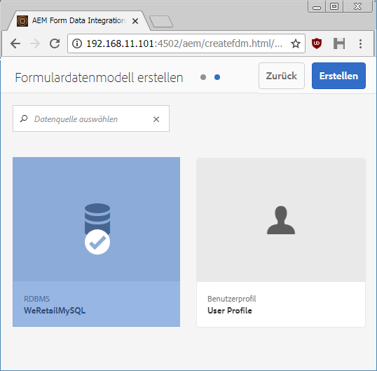
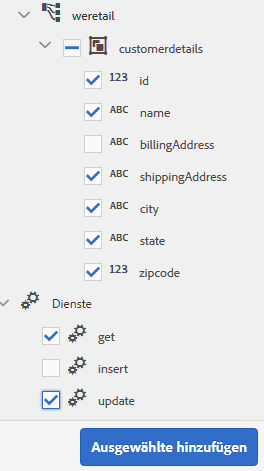

# Schulung: Formulardatenmodell erstellen {#tutorial-create-form-data-model}

Diese Schulung ist ein Schritt in der Serie [Erstellen Sie Ihr erstes adaptives Formular](../../forms/using/create-your-first-adaptive-form.md). Es wird empfohlen, der Serie in chronologischer Reihenfolge zu folgen, um den vollständigen Anwendungsfall zu verstehen, auszuführen und zu demonstrieren.

## Über die Schulung {#about-the-tutorial}

Mit dem AEM Forms-Datenintegrationsmodul können Sie ein Formulardatenmodell aus unterschiedlichen Back-End-Datenquellen wie AEM-Profil, RESTful-Webdiensten, SOAP-basierten Webdiensten, OData-Diensten und relationalen Datenbanken erstellen. Sie können Datenmodellobjekte und -Dienste in einem Formulardatenmodell konfigurieren und einem adaptiven Formular zuordnen. Adaptive Formularfelder sind an Datenmodellobjekteigenschaften gebunden. Mit den Diensten können Sie das adaptive Formular vorab befüllen und gesendete Formulardaten zurück an das Datenmodellobjekt schreiben.

Weitere Informationen zum Formulardatenmodell und zur Formulardatenintegration finden Sie unter [Datenintegration für AEM Forms](../../forms/using/data-integration.md).

Diese Schulung führt Sie durch die Schritte zum Vorbereiten, Erstellen, Konfigurieren und Zuordnen eines Formulardatenmodells mit einem adaptiven Formular. Am Ende dieser Schulung können Sie Folgendes:

* [Konfigurieren der MySQL-Datenbank als Datenquelle](#config-database)
* [Erstellen eines Formulardatenmodells mit der MySQL-Datenbank](#create-fdm)
* [Konfigurieren eines Formulardatenmodells](#config-fdm)
* [Testen eines Formulardatenmodells](#test-fdm)

Das Formulardatenmodell sieht etwa wie folgt aus:

**A.** Konfigurierte Datenquellen **B.** Datenquellen-Schema **C.** Verfügbare Dienste **D.** Datenmodellobjekte **E.** Konfigurierte Dienste

## Voraussetzungen {#prerequisites}

Bevor Sie beginnen, stellen Sie Folgendes sicher:

* MySQL-Datenbank mit Beispieldaten wie im Abschnitt „Voraussetzungen“ von [Erstellen Sie Ihr erstes adaptives Formular ](../../forms/using/create-your-first-adaptive-form.md) beschrieben
* OSGi bundle for MySQL JDBC driver as explained in [Bundling the JDBC Database Driver](/help/sites-developing/jdbc.md#bundling-the-jdbc-database-driver)
* Adaptive form as explained in the first tutorial [Create an adaptive form](/help/forms/using/create-adaptive-form.md)

## Schritt 1: Konfigurieren der MySQL-Datenbank als Datenquelle {#config-database}

Sie können verschiedene Arten von Datenquellen konfigurieren, um ein Formulardatenmodell zu erstellen. Für diese Schulung werden wir die MySQL-Datenbank, die Sie konfiguriert und mit Beispieldaten befüllt haben, konfigurieren. Informationen zu anderen unterstützten Datenquellen und deren Konfiguration finden Sie unter [AEM Forms-Datenintegration](../../forms/using/data-integration.md).

Gehen Sie folgendermaßen vor, um Ihre MySQL-Datenbank zu konfigurieren:

1. Installieren Sie den JDBC-Treiber für die MySQL-Datenbank als OSGi-Bundle:

   1. Melden Sie sich bei der AEM Forms-Autoreninstanz als Administrator an und wechseln Sie zu den AEM-Webkonsolen-Paketen. The default URL is [https://localhost:4502/system/console/bundles](https://localhost:4502/system/console/bundles).

   1. Tap **Install/Update**. Ein Dialogfeld **Pakete hochladen/installieren** wird angezeigt.

   1. Tippen Sie auf **Datei auswählen**, um das OSBi-Paket für den MySQL-JDBC-Treiber auszuwählen. Select **Start Bundle** and **Refresh Packages**, and tap **Install or Update**. Stellen Sie sicher, dass der JDBC-Treiber der Oracle Corporation für MySQL aktiv ist. Der Treiber wird installiert.

1. Konfigurieren der MySQL-Datenbank als Datenquelle:

   1. Go to AEM web console at [https://localhost:4502/system/console/configMgr](https://localhost:4502/system/console/configMgr).
   1. Suchen Sie die Konfiguration **Apache Sling Connection Pooled DataSource**. Tippen Sie, um die Konfiguration im Bearbeitungsmodus zu öffnen.
   1. Geben Sie im Konfigurationsdialog die folgenden Details an:

      * **Datenquellenname:** Sie können einen beliebigen Namen angeben, beispielsweise **WeRetailMySQL**.
      * **Name der DataSource-Diensteigenschaft**: Geben Sie den Namen der Diensteigenschaft an, die den DataSource-Namen enthält. Er wird beim Registrieren der Datenquelleninstanz als OSGi-Dienst angegeben. Zum Beispiel: **datasource.name**.
      * **JDBC-Treiberklasse**: Geben Sie den Java-Klassennamen des JDBC-Treibers an. For MySQL database, specify **com.mysql.jdbc.Driver**.
      * **JDBC-Verbindungs-URI**: Geben Sie die Verbindungs-URL der Datenbank an. For MySQL database running on port 3306 and schema weretail, the URL is: `jdbc:mysql://'server':3306/weretail?autoReconnect=true&useUnicode=true&characterEncoding=utf-8`
      * **Benutzername:** Benutzername der Datenbank. Es ist erforderlich, den JDBC-Treiber zu aktivieren, um eine Verbindung mit der Datenbank herzustellen.
      * **Kennwort:** Kennwort für die Datenbank. Es ist erforderlich, den JDBC-Treiber zu aktivieren, um eine Verbindung mit der Datenbank herzustellen.
      * **Test auf Borge:** Aktivieren Sie die Option **Test on Borrow** .
      * **Test on Return:** Aktivieren Sie die Option **Test on Return.**
      * **Validation Query:** Geben Sie eine SQL SELECT-Abfrage ein, damit Verbindungen aus dem Pool validiert werden. Die Abfrage muss mindestens eine Zeile zurückgeben. Beispiel: **Wählen Sie * aus Kundendaten**.
      * **Transaktions-Isolierung**: Setzen Sie den Wert auf **READ_COMMITTED**.
      Leave other properties with default [values](https://tomcat.apache.org/tomcat-7.0-doc/jdbc-pool.html) and tap **Save**.
   Eine Konfiguration ähnlich der folgenden wird erstellt.

   

## Schritt 2: Erstellen eines Formulardatenmodells {#create-fdm}

AEM Forms provides an intuitive user interface to [create a form data model](data-integration.md) from configured data sources. Sie können mehrere Datenquellen in einem Formulardatenmodell verwenden. Für unseren Anwendungsfall verwenden wir die konfigurierte MySQL-Datenquelle.

Gehen Sie folgendermaßen vor, um ein Formulardatenmodell zu erstellen:

1. Navigieren Sie in der AEM-Autoreninstanz zu **Formulare** > **Datenintegration**.
1. Tippen Sie auf **Erstellen** > **Formulardatenmodell**.
1. Geben Sie im Dialogfeld „Formulardatenmodell erstellen“ einen **Namen** für das Formulardatenmodell ein. Zum Beispiel **customer-shipping-billing-details**. Tippen Sie auf **Weiter**.
1. Im Bildschirm „Datenquelle auswählen“ werden alle konfigurierten Datenquellen angezeigt. Select **WeRetailMySQL** data source and tap **Create**.

   

The **customer-shipping-billing-details** form data model is created.

## Schritt 3: Konfigurieren eines Formulardatenmodells {#config-fdm}

Zum Konfigurieren eines Formulardatenmodells gehört Folgendes:

* Hinzufügen von Datenmodellobjekten und Diensten
* Konfigurieren von Lese- und Schreibdiensten für Datenmodellobjekte

Gehen Sie folgendermaßen vor, um das Formulardatenmodell zu konfigurieren:

1. On AEM author instance, navigate to **Forms** > **Data Integrations**. The default URL is [https://localhost:4502/aem/forms.html/content/dam/formsanddocuments-fdm](https://localhost:4502/aem/forms.html/content/dam/formsanddocuments-fdm).
1. The **customer-shipping-billing-details** form data model you created earlier is listed here. Öffnen Sie es im Bearbeitungsmodus.

   Die ausgewählte Datenquelle **WeRetailMySQL** wird im Formulardatenmodell konfiguriert.

   

1. Erweitern Sie den WeRailMySQL-Datenquellenbaum. Select the following data model objects and services from **weretail** > **customerdetails** schema to form data model:

   * **Datenmodellobjekte**:

      * id
      * name
      * shippingAddress
      * city
      * state
      * zipcode
   * **Dienste:**

      * get
      * Aktualisieren
   Tippen Sie auf **Ausgewählte hinzufügen**, um dem Formulardatenmodell ausgewählte Datenmodellobjekte und Dienste hinzuzufügen.

   

   >[!NOTE]
   >
   >Die standardmäßigen get-, update- und insert-Dienste für JDBC-Datenquellen werden standardmäßig mit dem Formulardatenmodell bereitgestellt.

1. Konfigurieren Sie Lese- und Schreibdienste für Datenmodellobjekte.

   1. Wählen Sie das Datenmodellobjekt **customerdetails** und tippen Sie auf **Eigenschaften bearbeiten**.
   1. Wählen Sie aus dem Dropdown-Menü „Lesedienst“ **get.** Das Argument **id**, das der Primärschlüssel im Datenmodellobjekt des „customerdetails“ ist, wird automatisch hinzugefügt. Tippen Sie auf  und konfigurieren Sie das Argument wie folgt.

      

   1. Wählen Sie ebenfalls **update** als Schreibdienst. Das Objekt **customerdetails** wird automatisch als Argument hinzugefügt. Das Argument ist wie folgt konfiguriert.

      

      Fügen Sie das Argument **id** hinzu und konfigurieren Sie es wie folgt.

      

   1. Tippen Sie auf **Fertig**, um die Eigenschaften des Datenmodellobjekts zu speichern. Then, tap **Save** to save the form data model.

      Die Dienste **get** und **update** werden als Standarddienste für das Datenmodellobjekt hinzugefügt.

      

1. Wechseln Sie zur Registerkarte **Dienste** und konfigurieren Sie die Dienste **get** und **update**.

   1. Select the **get** service and tap **Edit Properties**. Das Dialogfeld „Eigenschaften“ wird geöffnet.
   1. Geben Sie im Dialogfeld „Eigenschaften bearbeiten“ Folgendes an:

      * **Titel**: Geben Sie den Titel des Dienstes an. Beispiel: Lieferadresse abrufen.
      * **Beschreibung**: Geben Sie eine Beschreibung an, die das detaillierte Funktionieren des Dienstes enthält. Beispiel:

         Dieser Dienst ruft Versandadresse und andere Kundendetails aus der MySQL-Datenbank ab

      * **Ausgabemodellobjekt**: Wählen Sie ein Schema mit Kundendaten. Beispiel:

         customerdetail Schema

      * **Array zurückgeben**: Deaktivieren Sie die Option **Array zurückgeben**.
      * **Argumente**: Wählen Sie das Argument mit dem Namen **ID**.
      Tippen Sie auf **Fertig**. Der Dienst zum Abrufen von Kundendaten aus der MySQL-Datenbank ist konfiguriert.

      

   1. Select the **update** service and tap **Edit Properties**. Das Dialogfeld „Eigenschaften“ wird geöffnet.

   1. Geben Sie im Dialogfeld „Eigenschaften bearbeiten“ Folgendes an:

      * **Titel**: Geben Sie den Titel des Dienstes an. Beispiel: Lieferadresse aktualisieren.
      * **Beschreibung**: Geben Sie eine Beschreibung an, die das detaillierte Funktionieren des Dienstes enthält. Beispiel:

         Dieser Dienst aktualisiert die Lieferadresse und die zugehörigen Felder in der MySQL-Datenbank

      * **Eingabemodellobjekt**: Wählen Sie ein Schema mit Kundendaten. Beispiel:

         customerdetail Schema

      * **Ausgabetyp**: Wählen Sie **BOOLEAN**.

      * **Argumente**: Wählen Sie das Argument mit dem Namen **ID** und **customerdetails**.
      Tippen Sie auf **Fertig**. Der Dienst **update** zum Aktualisieren von Kundendetails in der MySQL-Datenbank ist konfiguriert.

      

Das Datenmodellobjekt und die Dienste im Formulardatenmodell sind konfiguriert. Sie können nun das Formulardatenmodell testen.

## Schritt 4: Testen eines Formulardatenmodells {#test-fdm}

Sie können das Datenmodellobjekt und die Datendienste testen, um sicherzustellen, dass das Formulardatenmodell ordnungsgemäß konfiguriert ist.

Führen Sie folgende Schritte aus, um den Test durchzuführen:

1. Wechseln Sie auf die Registerkarte **Modell**, wählen Sie das Datenmodellobjekt **customerdetails** und tippen Sie auf **Modellobjekt testen**.
1. Wählen Sie im Fenster **Modell/Dienst testen** **Modellobjekt lesen** aus der Dropdown-Liste **Modell/Dienst auswählen** auswählen.
1. Geben Sie im Abschnitt **customerdetails** einen Wert für das Argument **id** in der konfigurierten MySQL-Datenbank an und tippen Sie auf **Testen**.

   Die Kundendetails, die der angegebenen ID zugeordnet sind, werden abgerufen und im Abschnitt **Ausgabe** angezeigt, wie unten gezeigt.

   

1. In ähnlicher Weise können Sie das Schreibmodellobjekt und die Dienste testen.

   Im folgenden Beispiel aktualisiert der Aktualisierungsdienst die Adressdetails für die ID 7102715 in der Datenbank erfolgreich.

   

   Wenn Sie nun den Lesemodelldienst für die ID 7107215 erneut testen, werden die aktualisierten Kundendetails abgerufen und angezeigt (siehe unten).

   
