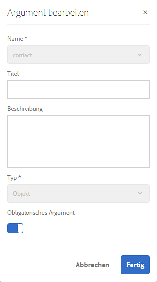

# Schulung: Formulardatenmodell erstellen {#tutorial-create-form-data-model}

Diese Schulung ist ein Schritt in der Serie [Erstellen Sie Ihr erstes adaptives Formular](../../forms/using/create-your-first-adaptive-form.md). Es wird empfohlen, der Serie in chronologischer Reihenfolge zu folgen, um den vollständigen Anwendungsfall zu verstehen, auszuführen und zu demonstrieren.

## Über die Schulung {#about-the-tutorial}

AEM [!DNL Forms]-Datenintegrationsmodul ermöglicht die Erstellung eines Formulardatenmodells aus unterschiedlichen Backend-Datenquellen wie AEM Benutzerprofil, RESTful-Webservices, SOAP-basierten Webdiensten, OData-Diensten und relationalen Datenbanken. Sie können Datenmodellobjekte und -Dienste in einem Formulardatenmodell konfigurieren und einem adaptiven Formular zuordnen. Adaptive Formularfelder sind an Datenmodellobjekteigenschaften gebunden. Mit den Diensten können Sie das adaptive Formular vorab befüllen und gesendete Formulardaten zurück an das Datenmodellobjekt schreiben.

Weitere Informationen zum Formulardatenmodell und zur Formulardatenintegration finden Sie unter [Datenintegration für AEM Forms](../../forms/using/data-integration.md).

Diese Schulung führt Sie durch die Schritte zum Vorbereiten, Erstellen, Konfigurieren und Zuordnen eines Formulardatenmodells mit einem adaptiven Formular. Am Ende dieser Schulung können Sie Folgendes:

* [Konfigurieren der MySQL-Datenbank als Datenquelle](#config-database)
* [Erstellen eines Formulardatenmodells mit der MySQL-Datenbank](#create-fdm)
* [Konfigurieren eines Formulardatenmodells](#config-fdm)
* [Testen eines Formulardatenmodells](#test-fdm)

Das Formulardatenmodell sieht etwa wie folgt aus:

**A.** Konfigurierte Datenquellen  **B.** Datenquellenschemata  **C.** Verfügbare Dienste  **D.** Datenmodellobjekte  **E.** Konfigurierte Dienste

## Voraussetzungen {#prerequisites}

Bevor Sie beginnen, stellen Sie Folgendes sicher:

* [!DNL MySQL] Datenbank mit Beispieldaten, wie im Abschnitt &quot;Voraussetzungen&quot;unter Erstellen Ihres ersten adaptiven Formulars  [beschrieben.](../../forms/using/create-your-first-adaptive-form.md)
* OSGi-Bundle für [!DNL MySQL] JDBC-Treiber, wie unter [Bundling des JDBC-Datenbanktreibers](/help/sites-developing/jdbc.md#bundling-the-jdbc-database-driver) beschrieben
* Adaptives Formular, wie im ersten Tutorial [Erstellen eines adaptiven Formulars](/help/forms/using/create-adaptive-form.md) erläutert

## Schritt 1: Konfigurieren der MySQL-Datenbank als Datenquelle {#config-database}

Sie können verschiedene Arten von Datenquellen konfigurieren, um ein Formulardatenmodell zu erstellen. Für diese Schulung werden wir die MySQL-Datenbank, die Sie konfiguriert und mit Beispieldaten befüllt haben, konfigurieren. Informationen zu anderen unterstützten Datenquellen und deren Konfiguration finden Sie unter [AEM Forms-Datenintegration](../../forms/using/data-integration.md).

Gehen Sie wie folgt vor, um Ihre [!DNL MySQL]-Datenbank zu konfigurieren:

1. Installieren Sie den JDBC-Treiber für die [!DNL MySQL]-Datenbank als OSGi-Bundle:

   1. Melden Sie sich bei AEM [!DNL Forms] -Autoreninstanz als Administrator an und gehen Sie zu AEM Webkonsolen-Bundles. Die Standard-URL lautet [https://localhost:4502/system/console/bundles](https://localhost:4502/system/console/bundles).

   1. Tippen Sie auf **[!UICONTROL Installieren/Aktualisieren]**. Ein Dialogfeld [!UICONTROL Pakete hochladen/installieren] wird angezeigt.

   1. Tippen Sie auf **[!UICONTROL Wählen Sie Datei]** , um das OSGi-Bundle [!DNL MySQL] JDBC-Treiber-OSGi-Bundle zu durchsuchen und auszuwählen. Wählen Sie **[!UICONTROL Paket starten]** und **[!UICONTROL Pakete aktualisieren]** und tippen Sie auf **[!UICONTROL Installieren oder Aktualisieren]**. Stellen Sie sicher, dass der [!DNL Oracle Corporation's] JDBC-Treiber für [!DNL MySQL] aktiv ist. Der Treiber wird installiert.

1. [!DNL MySQL]-Datenbank als Datenquelle konfigurieren:

   1. Rufen Sie AEM Webkonsole unter [https://localhost:4502/system/console/configMgr](https://localhost:4502/system/console/configMgr) auf.
   1. Suchen Sie die Konfiguration **Apache Sling Connection Pooled DataSource**. Tippen Sie, um die Konfiguration im Bearbeitungsmodus zu öffnen.
   1. Geben Sie im Konfigurationsdialog die folgenden Details an:

      * **Datenquellenname:** Sie können einen beliebigen Namen angeben, beispielsweise **WeRetailMySQL**.
      * **Name der DataSource-Diensteigenschaft**: Geben Sie den Namen der Diensteigenschaft an, die den DataSource-Namen enthält. Er wird beim Registrieren der Datenquelleninstanz als OSGi-Dienst angegeben. Zum Beispiel: **datasource.name**.
      * **JDBC-Treiberklasse**: Geben Sie den Java-Klassennamen des JDBC-Treibers an. Geben Sie für die Datenbank [!DNL MySQL] **com.mysql.jdbc.Driver** an.
      * **JDBC-Verbindungs-URI**: Geben Sie die Verbindungs-URL der Datenbank an. Für die [!DNL MySQL]-Datenbank, die auf Port 3306 und Schema-E-Mail ausgeführt wird, lautet die URL: `jdbc:mysql://'server':3306/weretail?autoReconnect=true&useUnicode=true&characterEncoding=utf-8`
      * **Benutzername:** Benutzername der Datenbank. Es ist erforderlich, den JDBC-Treiber zu aktivieren, um eine Verbindung mit der Datenbank herzustellen.
      * **Kennwort:** Kennwort für die Datenbank. Es ist erforderlich, den JDBC-Treiber zu aktivieren, um eine Verbindung mit der Datenbank herzustellen.
      * **Test on Borrow:** Aktivieren Sie die Option  **[!UICONTROL Test on]** Borrowrow .
      * **Test on Return:** Aktivieren Sie die Option **[!UICONTROL Test on Return.]**
      * **Validation Query:** Geben Sie eine SQL SELECT-Abfrage ein, damit Verbindungen aus dem Pool validiert werden. Die Abfrage muss mindestens eine Zeile zurückgeben. Beispiel: **Wählen Sie * aus Kundendaten**.
      * **Transaktions-Isolierung**: Setzen Sie den Wert auf **READ_COMMITTED**.

         Belassen Sie andere Eigenschaften mit den Standardwerten [Werte](https://tomcat.apache.org/tomcat-7.0-doc/jdbc-pool.html) und tippen Sie auf **[!UICONTROL Speichern]**.

         Eine Konfiguration ähnlich der folgenden wird erstellt.

         

## Schritt 2: Erstellen eines Formulardatenmodells {#create-fdm}

AEM [!DNL Forms] bietet eine intuitive Benutzeroberfläche zum Erstellen eines Formulardatenmodells](data-integration.md) aus konfigurierten Datenquellen. [ Sie können mehrere Datenquellen in einem Formulardatenmodell verwenden. Für unser Anwendungsbeispiel verwenden wir die konfigurierte [!DNL MySQL] Datenquelle.

Gehen Sie folgendermaßen vor, um ein Formulardatenmodell zu erstellen:

1. Navigieren Sie in der AEM-Autoreninstanz zu **[!UICONTROL Formulare]** > **[!UICONTROL Datenintegration]**.
1. Tippen Sie auf **[!UICONTROL Erstellen]** > **[!UICONTROL Formulardatenmodell]**.
1. Geben Sie im Dialogfeld „Formulardatenmodell erstellen“ einen **Namen** für das Formulardatenmodell ein. Zum Beispiel **customer-shipping-billing-details**. Tippen Sie auf **[!UICONTROL Weiter]**.
1. Im Bildschirm „Datenquelle auswählen“ werden alle konfigurierten Datenquellen angezeigt. Wählen Sie die Datenquelle **WeRetailMySQL** und tippen Sie auf **[!UICONTROL Erstellen]**.

   

Das Formulardatenmodell **customer-shipping-billing-details** wird erstellt.

## Schritt 3: Konfigurieren eines Formulardatenmodells {#config-fdm}

Zum Konfigurieren eines Formulardatenmodells gehört Folgendes:

* Hinzufügen von Datenmodellobjekten und Diensten
* Konfigurieren von Lese- und Schreibdiensten für Datenmodellobjekte

Gehen Sie folgendermaßen vor, um das Formulardatenmodell zu konfigurieren:

1. Navigieren Sie in AEM Autoreninstanz zu **[!UICONTROL Forms]** > **[!UICONTROL Datenintegrationen]**. Die Standard-URL lautet [https://localhost:4502/aem/forms.html/content/dam/formsanddocuments-fdm](https://localhost:4502/aem/forms.html/content/dam/formsanddocuments-fdm).
1. Das zuvor erstellte Formulardatenmodell **customer-shipping-billing-details** ist hier aufgeführt. Öffnen Sie es im Bearbeitungsmodus.

   Die ausgewählte Datenquelle **WeRetailMySQL** wird im Formulardatenmodell konfiguriert.

   

1. Erweitern Sie den WeRailMySQL-Datenquellenbaum. Wählen Sie die folgenden Datenmodellobjekte und Dienste aus dem Schema **weretail** > **customerdetails** aus, um das Datenmodell zu bilden:

   * **Datenmodellobjekte**:

      * id
      * name
      * shippingAddress
      * city
      * state
      * zipcode
   * **Dienste:**

      * get
      * Aktualisieren

   Tippen Sie auf **Ausgewählte hinzufügen**, um dem Formulardatenmodell ausgewählte Datenmodellobjekte und Dienste hinzuzufügen.

   

   >[!NOTE]
   >
   >Die standardmäßigen get-, update- und insert-Dienste für JDBC-Datenquellen werden standardmäßig mit dem Formulardatenmodell bereitgestellt.

1. Konfigurieren Sie Lese- und Schreibdienste für Datenmodellobjekte.

   1. Wählen Sie das Datenmodellobjekt **customerdetails** und tippen Sie auf **[!UICONTROL Eigenschaften bearbeiten]**.
   1. Wählen Sie aus dem Dropdown-Menü „Lesedienst“ **[!UICONTROL get.]** Das Argument **id**, das der Primärschlüssel im Datenmodellobjekt des „customerdetails“ ist, wird automatisch hinzugefügt. Tippen Sie auf  und konfigurieren Sie das -Argument wie folgt.

      

   1. Wählen Sie ebenfalls **[!UICONTROL update]** als Schreibdienst. Das Objekt **customerdetails** wird automatisch als Argument hinzugefügt. Das Argument ist wie folgt konfiguriert.

      

      Fügen Sie das Argument **id** hinzu und konfigurieren Sie es wie folgt.

      

   1. Tippen Sie auf **[!UICONTROL Fertig]**, um die Eigenschaften des Datenmodellobjekts zu speichern. Tippen Sie dann auf **[!UICONTROL Speichern]**, um das Formulardatenmodell zu speichern.

      Die Dienste **[!UICONTROL get]** und **[!UICONTROL update]** werden als Standarddienste für das Datenmodellobjekt hinzugefügt.

      

1. Wechseln Sie zur Registerkarte **[!UICONTROL Dienste]** und konfigurieren Sie die Dienste **[!UICONTROL get]** und **[!UICONTROL update]**.

   1. Wählen Sie den Dienst **[!UICONTROL get]** und tippen Sie auf **[!UICONTROL Eigenschaften bearbeiten]**. Das Dialogfeld „Eigenschaften“ wird geöffnet.
   1. Geben Sie im Dialogfeld „Eigenschaften bearbeiten“ Folgendes an:

      * **Titel**: Geben Sie den Titel des Dienstes an. Beispiel: Lieferadresse abrufen.
      * **Beschreibung**: Geben Sie eine Beschreibung an, die das detaillierte Funktionieren des Dienstes enthält. Beispiel:

         Dieser Dienst ruft Lieferadresse und andere Kundendetails von der [!DNL MySQL]-Datenbank ab

      * **Ausgabemodellobjekt**: Wählen Sie ein Schema mit Kundendaten. Beispiel:

         customerdetail-Schema

      * **Array zurückgeben**: Deaktivieren Sie die Option **Array zurückgeben**.
      * **Argumente**: Wählen Sie das Argument mit dem Namen **ID**.

      Tippen Sie auf **[!UICONTROL Fertig]**. Der Dienst zum Abrufen von Kundendaten aus der MySQL-Datenbank ist konfiguriert.

      

   1. Wählen Sie den Dienst **[!UICONTROL update]** und tippen Sie auf **[!UICONTROL Eigenschaften bearbeiten]**. Das Dialogfeld „Eigenschaften“ wird geöffnet.

   1. Geben Sie Folgendes im Dialogfeld [!UICONTROL Eigenschaften bearbeiten] an:

      * **Titel**: Geben Sie den Titel des Dienstes an. Beispiel: Lieferadresse aktualisieren.
      * **Beschreibung**: Geben Sie eine Beschreibung an, die das detaillierte Funktionieren des Dienstes enthält. Beispiel:

         Dieser Dienst aktualisiert Lieferadresse und zugehörige Felder in der MySQL-Datenbank

      * **Eingabemodellobjekt**: Wählen Sie ein Schema mit Kundendaten. Beispiel:

         customerdetail-Schema

      * **Ausgabetyp**: Wählen Sie **BOOLEAN**.

      * **Argumente**: Wählen Sie das Argument mit dem Namen **ID** und **customerdetails**.
      Tippen Sie auf **[!UICONTROL Fertig]**. Der Dienst **[!UICONTROL update]** zum Aktualisieren von Kundendetails in der [!DNL MySQL]-Datenbank ist konfiguriert.

      

Das Datenmodellobjekt und die Dienste im Formulardatenmodell sind konfiguriert. Sie können nun das Formulardatenmodell testen.

## Schritt 4: Testen eines Formulardatenmodells  {#test-fdm}

Sie können das Datenmodellobjekt und die Dienste testen, um zu überprüfen, ob das Formulardatenmodell ordnungsgemäß konfiguriert ist.

Führen Sie folgende Schritte aus, um den Test durchzuführen:

1. Wechseln Sie auf die Registerkarte **[!UICONTROL Modell]**, wählen Sie das Datenmodellobjekt **customerdetails** und tippen Sie auf **[!UICONTROL Modellobjekt testen]**.
1. Wählen Sie im Fenster [!UICONTROL Modell/Dienst testen] **[!UICONTROL Modellobjekt lesen]** aus der Dropdown-Liste **[!UICONTROL Modell/Dienst auswählen]** auswählen.
1. Geben Sie im Abschnitt **customerdetails** einen Wert für das **id**-Argument an, das in der konfigurierten [!DNL MySQL]-Datenbank vorhanden ist, und tippen Sie auf **[!UICONTROL Test]**.

   Die Kundendetails, die der angegebenen ID zugeordnet sind, werden abgerufen und im Abschnitt **[!UICONTROL Ausgabe]** angezeigt, wie unten gezeigt.

   

1. In ähnlicher Weise können Sie das Schreibmodellobjekt und die Dienste testen.

   Im folgenden Beispiel aktualisiert der Aktualisierungsdienst die Adressdetails für die ID 7102715 in der Datenbank erfolgreich.

   

   Wenn Sie nun den Lesemodelldienst für die ID 7107215 erneut testen, werden die aktualisierten Kundendetails abgerufen und angezeigt (siehe unten).

   
