# Schulung: Formulardatenmodell erstellen{#tutorial-create-form-data-model}


Dieses Tutorial ist ein Schritt in der Reihe [Erstellen Ihrer ersten interaktiven Kommunikation](/help/forms/using/create-your-first-interactive-communication.md). Es wird empfohlen, der Serie in chronologischer Reihenfolge zu folgen, um den vollständigen Anwendungsfall zu verstehen, auszuführen und zu demonstrieren.

## Über die Schulung {#about-the-tutorial}

Mit dem AEM Forms-Datenintegrationsmodul können Sie ein Formulardatenmodell aus unterschiedlichen Backend-Datenquellen wie AEM Benutzerprofil, RESTful-Webservices, SOAP-basierten Webdiensten, OData-Diensten und relationalen Datenbanken erstellen. Sie können Datenmodellobjekte und -Dienste in einem Formulardatenmodell konfigurieren und einem adaptiven Formular zuordnen. Adaptive Formularfelder sind an Datenmodellobjekteigenschaften gebunden. Mit den Diensten können Sie das adaptive Formular vorab befüllen und gesendete Formulardaten zurück an das Datenmodellobjekt schreiben.

Weitere Informationen zum Formulardatenmodell und zur Formulardatenintegration finden Sie unter [Datenintegration für AEM Forms](https://helpx.adobe.com/experience-manager/6-3/forms/using/data-integration.html).

Dieses Tutorial führt Sie durch die Schritte zum Vorbereiten, Erstellen, Konfigurieren und Zuordnen eines Formulardatenmodells mit einem adaptiven Formular. Am Ende dieser Schulung können Sie Folgendes:

* [Einrichten der Datenbank](../../forms/using/create-form-data-model0.md#step-set-up-the-database)
* [Konfigurieren der MySQL-Datenbank als Datenquelle](../../forms/using/create-form-data-model0.md#step-configure-mysql-database-as-data-source)
* [Formulardatenmodell erstellen](../../forms/using/create-form-data-model0.md#step-create-form-data-model)
* [Konfigurieren eines Formulardatenmodells](../../forms/using/create-form-data-model0.md#step-configure-form-data-model)
* [Testen eines Formulardatenmodells](../../forms/using/create-form-data-model0.md#step-test-form-data-model-and-services)

Das Formulardatenmodell sieht etwa wie folgt aus:

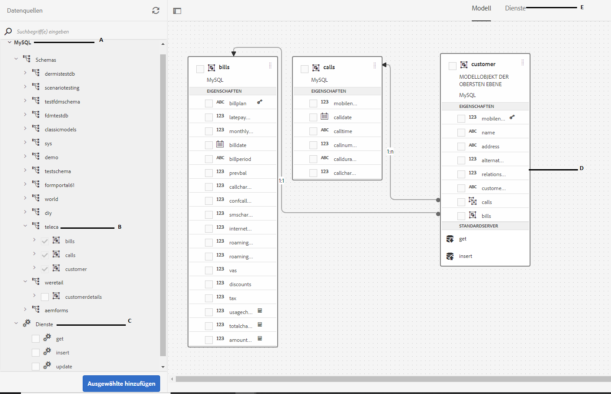

**A.** Konfigurierte Datenquellen  **B.** Datenquellenschemata  **C.** Verfügbare Dienste  **D.** Datenmodellobjekte  **E.** Konfigurierte Dienste

## Voraussetzungen {#prerequisites}

Bevor Sie beginnen, stellen Sie Folgendes sicher:

* MySQL-Datenbank mit Beispieldaten wie im Abschnitt [Einrichten der Datenbank](../../forms/using/create-form-data-model0.md#step-set-up-the-database) beschrieben.
* OSGi-Bundle für den MySQL JDBC-Treiber, wie unter [Bundling des JDBC-Datenbanktreibers](https://helpx.adobe.com/experience-manager/6-3/help/sites-developing/jdbc.html#bundling-the-jdbc-database-driver) beschrieben

## Schritt 1: Richten Sie die Datenbank ein {#step-set-up-the-database}

Eine Datenbank ist für die Erstellung einer interaktiven Kommunikation unerlässlich. In diesem Tutorial wird eine Datenbank zur Demonstration der Formulardatenmodell- und Persistenzfunktionen von AEM Forms verwendet. Richten Sie eine Datenbank mit Tabellen für Kunden, Rechnungen und Aufrufe ein.
Die folgende Abbildung zeigt Beispieldaten für die Kundentabelle:


Verwenden Sie die folgende DDL-Anweisung, um die Tabelle **customer** in der Datenbank zu erstellen.

```sql
CREATE TABLE `customer` (
   `mobilenum` int(11) NOT NULL,
   `name` varchar(45) NOT NULL,
   `address` varchar(45) NOT NULL,
   `alternatemobilenumber` int(11) DEFAULT NULL,
   `relationshipnumber` int(11) DEFAULT NULL,
   `customerplan` varchar(45) DEFAULT NULL,
   PRIMARY KEY (`mobilenum`),
   UNIQUE KEY `mobilenum_UNIQUE` (`mobilenum`)
 ) ENGINE=InnoDB DEFAULT CHARSET=utf8
```

Verwenden Sie die folgende DDL-Anweisung, um die Tabelle **bills** in der Datenbank zu erstellen.

```sql
CREATE TABLE `bills` (
   `billplan` varchar(45) NOT NULL,
   `latepayment` decimal(4,2) NOT NULL,
   `monthlycharges` decimal(4,2) NOT NULL,
   `billdate` date NOT NULL,
   `billperiod` varchar(45) NOT NULL,
   `prevbal` decimal(4,2) NOT NULL,
   `callcharges` decimal(4,2) NOT NULL,
   `confcallcharges` decimal(4,2) NOT NULL,
   `smscharges` decimal(4,2) NOT NULL,
   `internetcharges` decimal(4,2) NOT NULL,
   `roamingnational` decimal(4,2) NOT NULL,
   `roamingintnl` decimal(4,2) NOT NULL,
   `vas` decimal(4,2) NOT NULL,
   `discounts` decimal(4,2) NOT NULL,
   `tax` decimal(4,2) NOT NULL,
   PRIMARY KEY (`billplan`)
 ) ENGINE=InnoDB DEFAULT CHARSET=utf8
```

Verwenden Sie die folgende DDL-Anweisung, um die Tabelle **calls** in der Datenbank zu erstellen.

```sql
CREATE TABLE `calls` (
   `mobilenum` int(11) DEFAULT NULL,
   `calldate` date DEFAULT NULL,
   `calltime` varchar(45) DEFAULT NULL,
   `callnumber` int(11) DEFAULT NULL,
   `callduration` varchar(45) DEFAULT NULL,
   `callcharges` decimal(4,2) DEFAULT NULL,
   `calltype` varchar(45) DEFAULT NULL
 ) ENGINE=InnoDB DEFAULT CHARSET=utf8
```

Die Tabelle **calls** enthält die Aufrufdetails wie das Aufrufdatum, die Aufrufzeit, die Rufnummer, die Aufrufdauer und die Anrufgebühren. Die Tabelle **customer** wird mithilfe des Felds Mobiltelefonnummer (mobilenum) mit der Aufruftabelle verknüpft. Für jede in der Tabelle **customer** aufgelistete Mobiltelefonnummer gibt es mehrere Datensätze in der Tabelle **calls**. Sie können beispielsweise die Anrufdetails für die Mobilfunknummer **1457892541** abrufen, indem Sie sich auf die Anruftabelle beziehen.****

Die Tabelle **Rechnungen** enthält die Rechnungsdetails wie Rechnungsdatum, Rechnungszeitraum, monatliche Gebühren und Anrufgebühren. Die Tabelle **customer** ist mithilfe des Felds &quot;Bill Plan&quot;mit der Tabelle **bills** verknüpft. In der Tabelle **customer** ist jedem Kunden ein Plan zugeordnet. Die Tabelle **bills** enthält die Preisdetails für alle bestehenden Pläne. Sie können beispielsweise die Plandetails für **Sarah** aus der Kundentabelle abrufen und diese Details verwenden, um Preisdetails aus der Rechnungstabelle abzurufen.********

## Schritt 2: Konfigurieren der MySQL-Datenbank als Datenquelle {#step-configure-mysql-database-as-data-source}

Sie können verschiedene Arten von Datenquellen konfigurieren, um ein Formulardatenmodell zu erstellen. Für dieses Tutorial werden wir die MySQL-Datenbank, die Sie konfiguriert und mit Beispieldaten befüllt haben, konfigurieren. Informationen zu anderen unterstützten Datenquellen und deren Konfiguration finden Sie unter [AEM Forms-Datenintegration](https://helpx.adobe.com/experience-manager/6-3/forms/using/data-integration.html).

Gehen Sie folgendermaßen vor, um Ihre MySQL-Datenbank zu konfigurieren:

1. Installieren Sie den JDBC-Treiber für die MySQL-Datenbank als OSGi-Bundle:

   1. Melden Sie sich bei der AEM Forms-Autoreninstanz als Administrator an und wechseln Sie zu den AEM-Webkonsolen-Paketen. Die Standard-URL lautet [https://localhost:4502/system/console/bundles](https://localhost:4502/system/console/bundles).
   1. Tippen Sie auf **Installieren/Aktualisieren**. Ein Dialogfeld **Pakete hochladen/installieren** wird angezeigt.

   1. Tippen Sie auf **Datei auswählen**, um das OSBi-Paket für den MySQL-JDBC-Treiber auszuwählen. Wählen Sie **Paket starten** und **Pakete aktualisieren** und tippen Sie auf **Installieren** oder **Aktualisieren**. Stellen Sie sicher, dass der JDBC-Treiber der Oracle Corporation für MySQL aktiv ist. Der Treiber wird installiert.

1. Konfigurieren der MySQL-Datenbank als Datenquelle:

   1. Rufen Sie AEM Webkonsole unter [https://localhost:4502/system/console/configMgr](https://localhost:4502/system/console/configMgr) auf.
   1. Suchen Sie die Konfiguration **Apache Sling Connection Pooled DataSource**. Tippen Sie, um die Konfiguration im Bearbeitungsmodus zu öffnen.
   1. Geben Sie im Konfigurationsdialog die folgenden Details an:

      * **Datenquellenname:** Sie können einen beliebigen Namen angeben, Geben Sie beispielsweise **MySQL** an.

      * **Name der DataSource-Diensteigenschaft**: Geben Sie den Namen der Diensteigenschaft an, die den DataSource-Namen enthält. Er wird beim Registrieren der Datenquelleninstanz als OSGi-Dienst angegeben. Zum Beispiel: **datasource.name**.

      * **JDBC-Treiberklasse**: Geben Sie den Java-Klassennamen des JDBC-Treibers an. Geben Sie für die MySQL-Datenbank **com.mysql.jdbc.Driver** an.

      * **JDBC-Verbindungs-URI**: Geben Sie die Verbindungs-URL der Datenbank an. Für MySQL-Datenbanken, die auf Port 3306 und Schema Teleca ausgeführt werden, lautet die URL: `jdbc:mysql://'server':3306/teleca?autoReconnect=true&useUnicode=true&characterEncoding=utf-8`
      * **Benutzername:** Benutzername der Datenbank. Es ist erforderlich, den JDBC-Treiber zu aktivieren, um eine Verbindung mit der Datenbank herzustellen.
      * **Kennwort:** Kennwort für die Datenbank. Es ist erforderlich, den JDBC-Treiber zu aktivieren, um eine Verbindung mit der Datenbank herzustellen.
      * **Test on Borrow:** Aktivieren Sie die Option  **Test on** Borrowrow .

      * **Test on Return:** Aktivieren Sie die Option **Test on Return.**

      * **Validation Query:** Geben Sie eine SQL SELECT-Abfrage ein, damit Verbindungen aus dem Pool validiert werden. Die Abfrage muss mindestens eine Zeile zurückgeben. Beispiel: **Wählen Sie * von customer** aus.

      * **Transaktions-Isolierung**: Setzen Sie den Wert auf **READ_COMMITTED**.
   Belassen Sie andere Eigenschaften mit den Standardwerten [Werte](https://tomcat.apache.org/tomcat-7.0-doc/jdbc-pool.html) und tippen Sie auf **Speichern**.

   Eine Konfiguration ähnlich der folgenden wird erstellt.

   

## Schritt 3: Erstellen eines Formulardatenmodells {#step-create-form-data-model}

AEM Forms bietet eine intuitive Benutzeroberfläche zum Erstellen eines Formulardatenmodus](https://helpx.adobe.com/experience-manager/6-3/forms/using/data-integration.html#main-pars_header_1524967585)l aus konfigurierten Datenquellen. [ Sie können mehrere Datenquellen in einem Formulardatenmodell verwenden. Für den Anwendungsfall in diesem Tutorial verwenden Sie MySQL als Datenquelle.

Gehen Sie folgendermaßen vor, um ein Formulardatenmodell zu erstellen:

1. Navigieren Sie in der AEM-Autoreninstanz zu **Formulare** > **Datenintegration**.
1. Tippen Sie auf **Erstellen** > **Formulardatenmodell**.
1. Geben Sie im Assistenten &quot;Formulardatenmodell erstellen&quot;einen **Namen** für das Formulardatenmodell an. Beispiel: **FDM_Create_First_IC**. Tippen Sie auf **Weiter**.
1. Im Bildschirm „Datenquelle auswählen“ werden alle konfigurierten Datenquellen angezeigt. Wählen Sie die Datenquelle **MySQL** und tippen Sie auf **Erstellen**.

   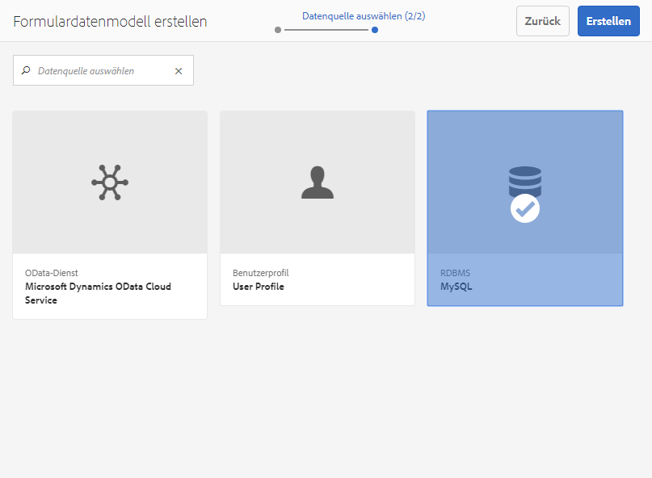

1. Klicken Sie auf **Fertig**. Das Formulardatenmodell **FDM_Create_First_IC** wird erstellt.

## Schritt 4: Konfigurieren eines Formulardatenmodells {#step-configure-form-data-model}

Konfigurieren eines Formulardatenmodells umfasst Folgendes:

* [Hinzufügen von Datenmodellobjekten und Diensten](#add-data-model-objects-and-services)
* [Erstellen von berechneten untergeordneten Eigenschaften für das Datenmodellobjekt](#create-computed-child-properties-for-data-model-object)
* [Hinzufügen von Assoziationen zwischen Datenmodellobjekten](#add-associations-between-data-model-objects)
* [Eigenschaften des Datenmodellobjekts bearbeiten](#edit-data-model-object-properties)
* [Konfigurieren von Diensten für Datenmodellobjekte](#configure-services)

### Datenmodellobjekte und Dienste hinzufügen {#add-data-model-objects-and-services}

1. Navigieren Sie in AEM Autoreninstanz zu **Forms** > **Datenintegrationen**. Die Standard-URL lautet [https://localhost:4502/aem/forms.html/content/dam/formsanddocuments-fdm](https://localhost:4502/aem/forms.html/content/dam/formsanddocuments-fdm).
1. Das zuvor erstellte Formulardatenmodell **FDM_Create_First_IC** ist hier aufgelistet. Wählen Sie es aus und tippen Sie auf **Bearbeiten**.

   Die ausgewählte Datenquelle **MySQL** wird im Bereich **Data Sources** angezeigt.

   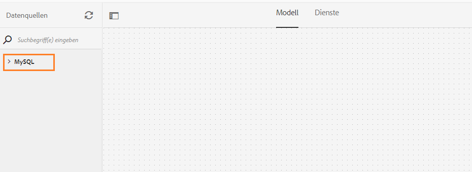

1. Erweitern Sie die Datenquellstruktur **MySQL**. Wählen Sie die folgenden Datenmodellobjekte und Dienste aus dem Schema **Teleca** aus:

   * **Datenmodellobjekte**:

      * Rechnungen
      * abrufe
      * Kunde
   * **Dienste:**

      * get
      * Aktualisieren

   Tippen Sie auf **Ausgewählte hinzufügen**, um dem Formulardatenmodell ausgewählte Datenmodellobjekte und Dienste hinzuzufügen.

   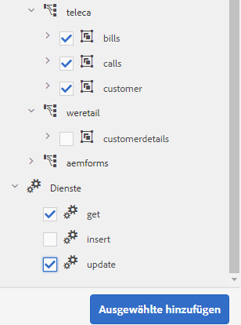

   Die Rechnungen, Anrufe und Kundendatenmodellobjekte werden im rechten Bereich auf der Registerkarte **Modell** angezeigt. Die Abruf- und Aktualisierungsdienste werden auf der Registerkarte **Dienste** angezeigt.

   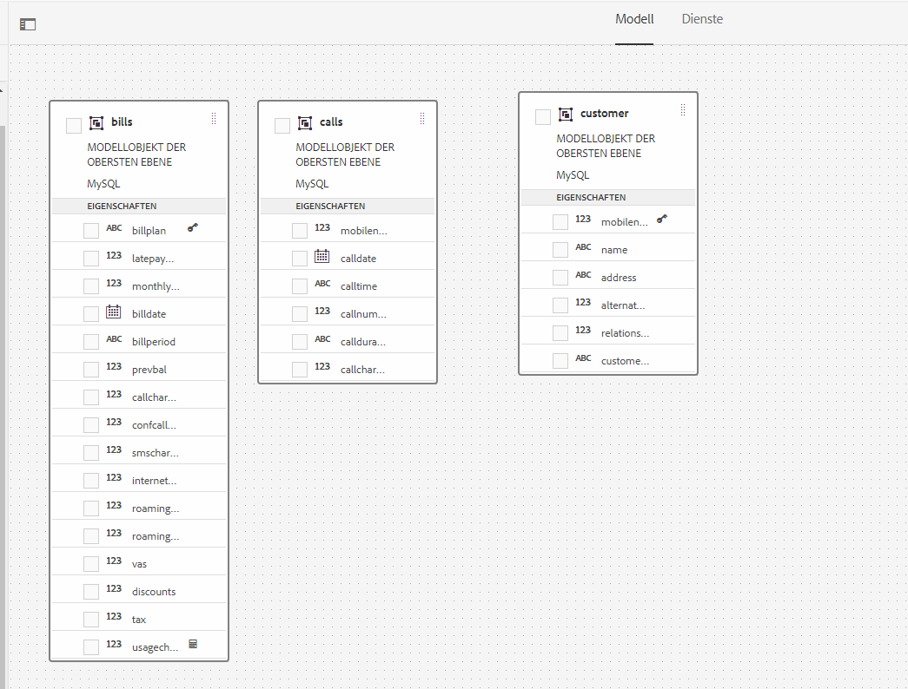

### Erstellen Sie berechnete untergeordnete Eigenschaften für das Datenmodellobjekt {#create-computed-child-properties-for-data-model-object}

Eine berechnete Eigenschaft ist diejenige, deren Wert basierend auf einer Regel oder einem Ausdruck berechnet wird. Mithilfe einer Regel können Sie den Wert einer berechneten Eigenschaft auf eine Literalzeichenfolge, eine Zahl, das Ergebnis eines mathematischen Ausdrucks oder den Wert einer anderen Eigenschaft im Formulardatenmodell festlegen.

Basierend auf dem Anwendungsfall, erstellen Sie die untergeordnete berechnete Eigenschaft **usagecharges** im Datenmodellobjekt **Rechnungen** mit folgendem mathematischem Ausdruck:

* Nutzungsgebühren = Anrufgebühren + Konferenzanrufgebühren + SMS-Gebühren + mobile Internetgebühren + Roaming national + Roaming international + VAS (alle diese Eigenschaften sind im Datenmodellobjekt Rechnungen vorhanden)
Weitere Informationen zur untergeordneten berechneten Eigenschaft **usagecharges** finden Sie unter [Planen der interaktiven Kommunikation](/help/forms/using/planning-interactive-communications.md).

Führen Sie die folgenden Schritte durch, um untergeordnete berechnete Eigenschaften für das Datenmodellobjekt „Rechnungen“ zu erstellen:

1. Aktivieren Sie das Kontrollkästchen oben im Datenmodellobjekt **bills**, um es auszuwählen, und tippen Sie auf **Untergeordnete Eigenschaft erstellen**.
1. Im Bereich **Untergeordnete Eigenschaft erstellen**:

   1. Geben Sie als Namen der untergeordneten Eigenschaft **usagecharges** ein.
   1. Aktivieren Sie **Berechnete**.
   1. Wählen Sie **Float** als Typ und tippen Sie auf **Fertig** , um die untergeordnete Eigenschaft zum Datenmodellobjekt **bills** hinzuzufügen.

   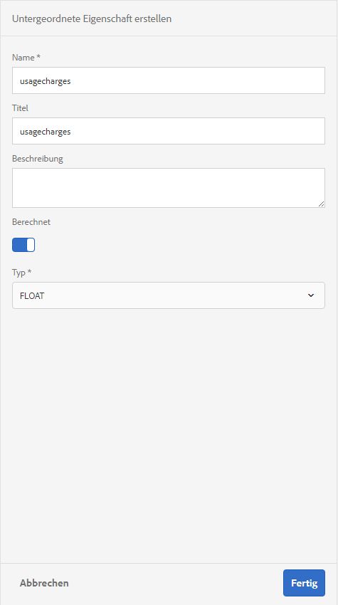

1. Tippen Sie auf **Regel bearbeiten** , um den Regeleditor zu öffnen.
1. Tippen Sie auf **Erstellen**. Das Regelfenster **Wert festlegen** wird geöffnet.
1. Wählen Sie in der Dropdown-Liste die **Mathematischer Ausdruck**.

   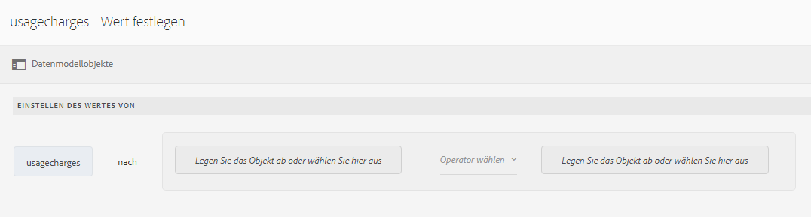

1. Wählen Sie im mathematischen Ausdruck **callcharges** und **concallcharges** als erstes bzw. zweites Objekt aus. Wählen Sie **plus** als Bediener. Tippen Sie innerhalb des mathematischen Ausdrucks auf **Ausdruck erweitern**, um die Objekte **smscharges**, **internetcharges**, **roamingnational**, **roamingintnl** und **vas** hinzuzufügen.

   Das folgende Bild zeigt den mathematischen Ausdruck im Regeleditor:

   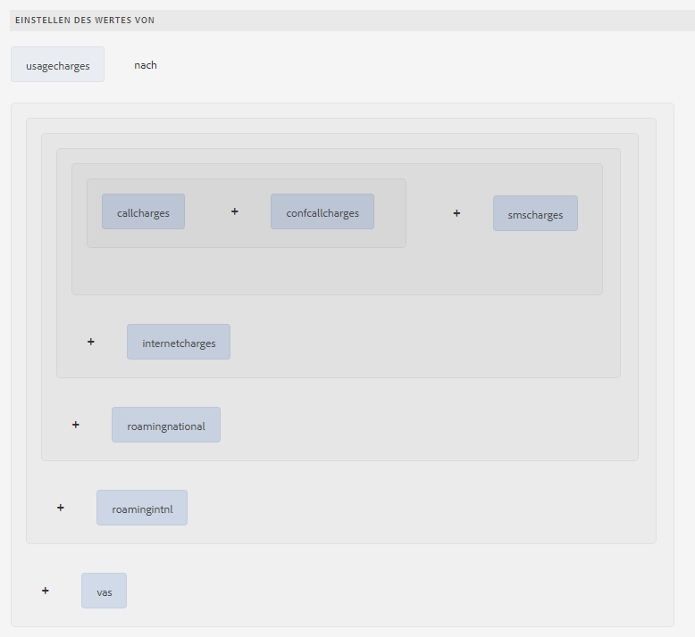

1. Tippen Sie auf **Fertig**. Die Regel wird im Regeleditor erstellt.
1. Tippen Sie auf **Schließen** , um das Fenster &quot;Regeleditor&quot;zu schließen.

### Hinzufügen von Assoziationen zwischen Datenmodellobjekten {#add-associations-between-data-model-objects}

Nachdem die Datenmodellobjekte definiert wurden, können Sie Verknüpfungen zwischen ihnen erstellen. Dies können Eins-zu-Eins- oder Eins-zu-Viele-Verknüpfungen sein. So könnten mehrere Angehörige mit einem Mitarbeiter verknüpft sein. Dies wird als Eins-zu-Viele-Verknüpfung bezeichnet und in der Form 1:n auf der Linie dargestellt, die die zugeordneten Datenmodellobjekte verbindet. Wenn jedoch eine Verknüpfung einen eindeutigen Mitarbeiternamen für eine gegebene Mitarbeiter-ID zurückgibt, wird dies als Eins-zu-Eins-Verknüpfung bezeichnet.

Wenn Sie verknüpfte Datenmodellobjekte in einer Datenquelle zu einem Formulardatenmodell hinzufügen, werden deren Verknüpfungen beibehalten und über Pfeillinien als verbunden angezeigt.

Erstellen Sie basierend auf dem Anwendungsfall die folgenden Verknüpfungen zwischen den Datenmodellobjekten:

| Verknüpfungen  | Datenmodellobjekte |
|---|---|
| 1:n | Kunde:Anrufe (in einer monatlichen Rechnung können einem Kunden mehrere Anrufe zugeordnet werden) |
| 1:1 | Kunde:Rechnungen (Eine Rechnung ist einem Kunden für einen bestimmten Monat zugeordnet.) |

Führen Sie die folgenden Schritte aus, um Verknüpfungen zwischen Datenmodellobjekten zu erstellen:

1. Aktivieren Sie das Kontrollkästchen oben im Datenmodellobjekt **customer** , um es auszuwählen, und tippen Sie auf **Verknüpfung hinzufügen**. Der Eigenschaftenbereich **Verknüpfung hinzufügen** wird geöffnet.
1. Im Bereich **Verknüpfung hinzufügen**:

   * Geben Sie einen Titel für die Verknüpfung an. Dies ist ein optionales Feld.
   * Wählen Sie **1:n** aus der **Typ** Dropdown-Liste.

   * Wählen Sie **Anrufe** aus der Dropdown-Liste **Modellobjekt**.

   * Wählen Sie **get** aus der Dropdown-Liste **Service**.

   * Tippen Sie auf **Hinzufügen**, um das Datenmodellobjekt **customer** mit dem Datenmodellobjekt **calls** zu verknüpfen, das eine Eigenschaft verwendet. Basierend auf dem Anwendungsfall muss das Datenmodellobjekt „call“ mit der Eigenschaft der Mobilfunknummer im Datenmodellobjekt „customer“ verknüpft sein. Das Dialogfeld **Argument** hinzufügen wird geöffnet.

   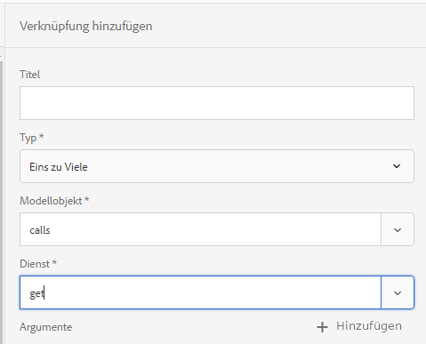

1. Im Dialogfeld **Argument hinzufügen**:

   * Wählen Sie **mobilenum** aus der Dropdown-Liste **Name** aus . Die Mobilfunknummer ist eine allgemeine Eigenschaft, die in Datenmodellobjekten „customer“ und „calls“ verfügbar ist. Infolgedessen wird eine Verbindung zwischen Datenmodellobjekten „customer“ und „calls“ erstellt.
Für jede im Datenmodellobjekt „customer“ verfügbare Mobilfunknummer stehen mehrere „call“-Datensätze in der Anruftabelle zur Verfügung.

   * Geben Sie einen optionalen Titel und eine Beschreibung für das Argument an.
   * Wählen Sie **customer** aus der Dropdown-Liste **Bindung an** aus.

   * Wählen Sie **mobilenum** aus der Dropdown-Liste **Bindungswert** aus.

   * Tippen Sie auf **Hinzufügen**.

   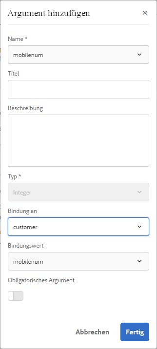

   Die Eigenschaft „mobilenum“ wird im Abschnitt **Argumente** angezeigt.

   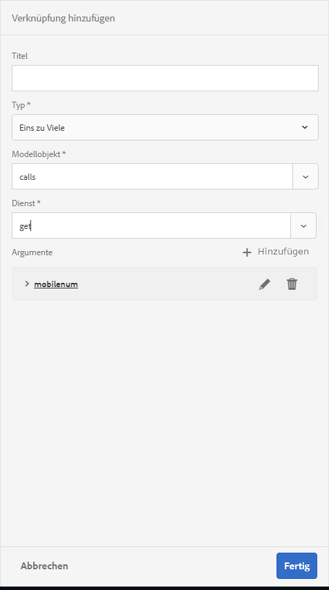

1. Tippen Sie auf **Fertig** , um eine 1:n-Zuordnung zwischen Datenmodellobjekten &quot;customer&quot;und &quot;calls&quot;zu erstellen.

   Nachdem Sie eine Zuordnung zwischen Kunden- und Anrufdatenmodellobjekten erstellt haben, erstellen Sie eine 1:1-Verknüpfung zwischen den Datenmodellobjekten „customer“ und „bills“.

1. Aktivieren Sie das Kontrollkästchen oben im Datenmodellobjekt **customer** , um es auszuwählen, und tippen Sie auf **Verknüpfung hinzufügen**. Der Eigenschaftenbereich **Verknüpfung hinzufügen** wird geöffnet.
1. Im Bereich **Verknüpfung hinzufügen**:

   * Geben Sie einen Titel für die Verknüpfung an. Dies ist ein optionales Feld.
   * Wählen Sie **One to One** aus der Dropdownliste **Typ** aus.

   * Wählen Sie **bills** aus der Dropdownliste **Modellobjekt** aus.

   * Wählen Sie **get** aus der Dropdown-Liste **Service.** Die Eigenschaft **billplan**, die den Primärschlüssel für die Abrechnungstabelle darstellt, ist bereits im Abschnitt **Argumente** verfügbar.
Die Datenmodellobjekte „bills“ und „customer“ werden jeweils mit den Eigenschaften „billplan“ (Rechnungen und „customerplan“ (Kunde) verknüpft. Erstellen Sie eine Bindung zwischen diesen Eigenschaften, um die Plandetails für jeden in der MySQL-Datenbank verfügbaren Kunden abzurufen.

   * Wählen Sie **customer** aus der Dropdown-Liste **Bindung an** aus.

   * Wählen Sie **customerplan** aus der Dropdown-Liste **Bindungswert**.

   * Tippen Sie auf **Fertig** , um eine Bindung zwischen den Eigenschaften billplan und customerplan zu erstellen.

   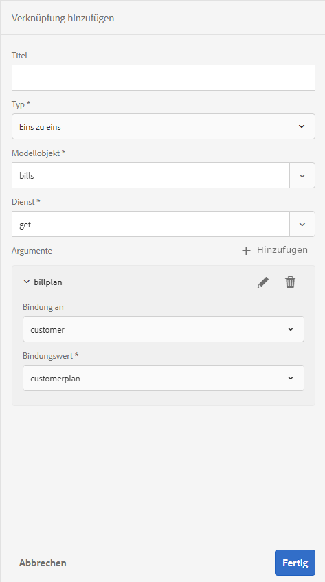

   Das folgende Bild zeigt die Zuordnungen zwischen den Datenmodellobjekten und den Eigenschaften, die zum Erstellen von Zuordnungen zwischen ihnen verwendet werden:

   

### Eigenschaften des Datenmodellobjekts bearbeiten {#edit-data-model-object-properties}

Bearbeiten Sie nach dem Erstellen von Zuordnungen zwischen den Datenmodellobjekten „customer“ und anderen Datenmodellobjekten die Kundeneigenschaften, um die Eigenschaft zu definieren, auf deren Grundlage die Daten aus dem Datenmodellobjekt abgerufen werden. Basierend auf dem Anwendungsfall wird die Mobilfunknummer als Eigenschaft zum Abrufen von Daten aus dem Datenmodellobjekt „customer“ verwendet.

1. Aktivieren Sie das Kontrollkästchen oben im Datenmodellobjekt **customer** , um es auszuwählen, und tippen Sie auf **Eigenschaften bearbeiten**. Der Bereich **Eigenschaften bearbeiten** wird geöffnet.
1. Geben Sie **customer** als **Modellobjekt der obersten Ebene** an.
1. Wählen Sie **get** aus der Dropdown-Liste **Lese-Service**.
1. Im Abschnitt **Argumente**:

   * Wählen Sie **Anforderungsattribut** aus der Dropdown-Liste **Bindung an**.

   * Geben Sie **mobilenum** als Bindungswert an.

1. Wählen Sie **Update** aus der **Dropdown-Liste** Schreib-Service.
1. Im Abschnitt **Argumente**:

   * Wählen Sie die Eigenschaft **mobilenum**, wählen Sie **customer** aus der Dropdown-Liste **Bindung an** aus.

   * Wählen Sie **mobilenum** aus der Dropdown-Liste **Bindungswert** aus.

1. Tippen Sie auf **Fertig**, um die Eigenschaften zu speichern.

   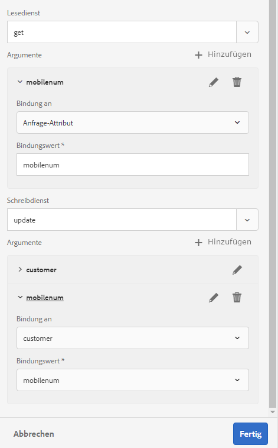

1. Aktivieren Sie das Kontrollkästchen oben im Datenmodellobjekt **calls** , um es auszuwählen, und tippen Sie auf **Eigenschaften bearbeiten**. Der Bereich **Eigenschaften bearbeiten** wird geöffnet.
1. Deaktivieren Sie das **Modellobjekt der obersten Ebene** für das Datenmodellobjekt **calls**.
1. Tippen Sie auf **Fertig**.

   Wiederholen Sie die Schritte 8 bis 10, um die Eigenschaften für das Datenmodellobjekt **bills** zu konfigurieren.

### Dienste konfigurieren  {#configure-services}

1. Wechseln Sie zur Registerkarte **Services**.
1. Wählen Sie den Dienst **get** und tippen Sie auf **Eigenschaften bearbeiten**. Der Bereich **Eigenschaften bearbeiten** wird geöffnet.
1. Im Bereich **Eigenschaften bearbeiten**:

   * Geben Sie optional einen Titel und eine Beschreibung ein.
   * Wählen Sie **customer** aus der Dropdown-Liste **Ausgabemodellobjekt**.

   * Tippen Sie auf **Fertig**, um die Eigenschaften zu speichern.

   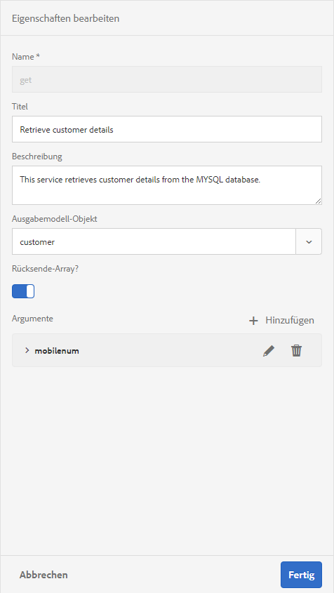

1. Wählen Sie den Dienst **update** und tippen Sie auf **Eigenschaften bearbeiten**. Der Bereich **Eigenschaften bearbeiten** wird geöffnet.
1. Im Bereich **Eigenschaften bearbeiten**:

   * Geben Sie optional einen Titel und eine Beschreibung ein.
   * Wählen Sie **customer** aus der Dropdownliste **Input Model Object** aus.

   * Tippen Sie auf **Fertig**.
   * Tippen Sie auf **Speichern**, um das Formulardatenmodell zu speichern.

   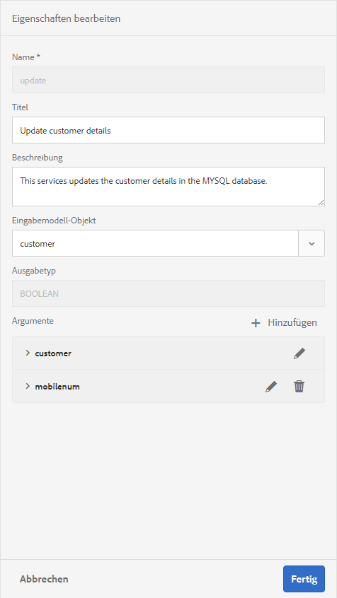

## Schritt 5: Testen von Formulardatenmodellen und Services {#step-test-form-data-model-and-services}

Sie können das Datenmodellobjekt und die Dienste testen, um zu überprüfen, ob das Formulardatenmodell ordnungsgemäß konfiguriert ist.

Führen Sie folgende Schritte aus, um den Test durchzuführen:

1. Gehen Sie zur Registerkarte **Modell**, wählen Sie das Datenmodellobjekt **customer** und tippen Sie auf **Testmodellobjekt**.
1. Wählen Sie im Fenster **Formulardatenmodell testen** die Option **Modellobjekt lesen** aus der Dropdownliste **Modell/Dienst auswählen**.
1. Geben Sie im Abschnitt **Input** einen Wert für die Eigenschaft **mobilenum** an, die in der konfigurierten MySQL-Datenbank vorhanden ist, und tippen Sie auf **Test**.

   Die Kundendetails, die mit der angegebenen Eigenschaft mobilenum verknüpft sind, werden abgerufen und im Abschnitt &quot;Ausgabe&quot;angezeigt, wie unten dargestellt. Schließen Sie das Dialogfeld.

   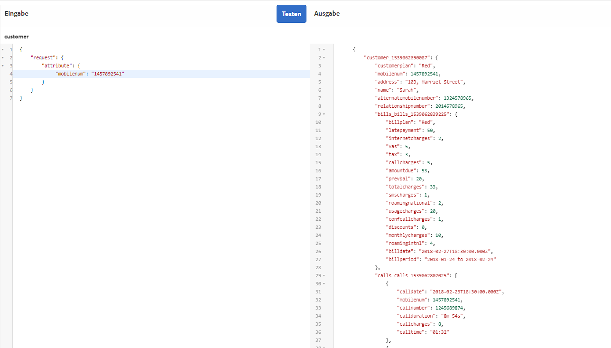

1. Wechseln Sie zur Registerkarte **Services**.
1. Wählen Sie den Dienst **get** aus und tippen Sie auf **Testdienst.**
1. Geben Sie im Abschnitt **Input** einen Wert für die Eigenschaft **mobilenum** an, die in der konfigurierten MySQL-Datenbank vorhanden ist, und tippen Sie auf **Test**.

   Die Kundendetails, die mit der angegebenen Eigenschaft mobilenum verknüpft sind, werden abgerufen und im Abschnitt &quot;Ausgabe&quot;angezeigt, wie unten dargestellt. Schließen Sie das Dialogfeld.

   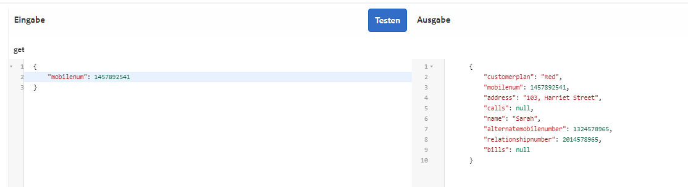

### Bearbeiten und speichern Sie Beispieldaten {#edit-and-save-sample-data}

Mit dem Formulardatenmodell-Editor können Sie Beispieldaten für alle Datenmodellobjekteigenschaften, einschließlich berechneter Eigenschaften, in einem Formulardatenmodell generieren. Es ist eine Gruppe von zufälligen Werten, die dem für jede Eigenschaft konfigurierten Datentyp entsprechen. Sie können auch Daten bearbeiten und speichern, die auch dann beibehalten werden, wenn Sie die Beispieldaten neu generieren.

Gehen Sie folgendermaßen vor, um Beispieldaten zu generieren, zu bearbeiten und zu speichern:

1. Tippen Sie auf der Formulardatenmodellseite auf **Beispieldaten bearbeiten**. Es werden Beispieldaten im Fenster „Beispieldaten bearbeiten“ generiert und angezeigt.

   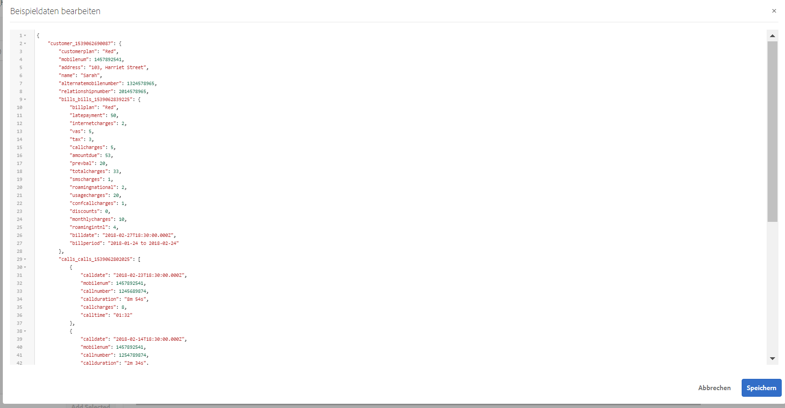

1. Bearbeiten Sie im Fenster **Beispieldaten bearbeiten** Daten je nach Bedarf und tippen Sie auf **Speichern**. Schließen Sie das Fenster.
