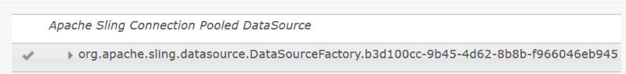

# Schulung: Formulardatenmodell erstellen{#tutorial-create-form-data-model}

This tutorial is a step in the [Create your first Interactive Communication](/help/forms/using/create-your-first-interactive-communication.md) series. Es wird empfohlen, der Serie in chronologischer Reihenfolge zu folgen, um den vollständigen Anwendungsfall zu verstehen, auszuführen und zu demonstrieren.

## Über die Schulung {#about-the-tutorial}

Mit dem AEM Forms-Datenintegrationsmodul können Sie ein Formulardatenmodell aus unterschiedlichen Back-End-Datenquellen wie AEM-Benutzerprofil, RESTful-Webdienste, SOAP-basierten Webdiensten, OData-Diensten und relationalen Datenbanken erstellen. Sie können Datenmodellobjekte und -Dienste in einem Formulardatenmodell konfigurieren und einem adaptiven Formular zuordnen. Adaptive Formularfelder sind an Datenmodellobjekteigenschaften gebunden. Mit den Diensten können Sie das adaptive Formular vorab befüllen und gesendete Formulardaten zurück an das Datenmodellobjekt schreiben.

Weitere Informationen zum Formulardatenmodell und zur Formulardatenintegration finden Sie unter [Datenintegration für AEM Forms](https://helpx.adobe.com/experience-manager/6-3/forms/using/data-integration.html).

Dieses Tutorial führt Sie durch die Schritte zum Vorbereiten, Erstellen, Konfigurieren und Zuordnen eines Formulardatenmodells mit einem adaptiven Formular. Am Ende dieser Schulung können Sie Folgendes:

* [Einrichten der Datenbank](../../forms/using/create-form-data-model0.md#step-set-up-the-database)
* [Konfigurieren der MySQL-Datenbank als Datenquelle](../../forms/using/create-form-data-model0.md#step-configure-mysql-database-as-data-source)
* [Formulardatenmodell erstellen](../../forms/using/create-form-data-model0.md#step-create-form-data-model)
* [Konfigurieren eines Formulardatenmodells](../../forms/using/create-form-data-model0.md#step-configure-form-data-model)
* [Testen eines Formulardatenmodells](../../forms/using/create-form-data-model0.md#step-test-form-data-model-and-services)

Das Formulardatenmodell sieht etwa wie folgt aus:

**********A. Konfigurierte Datenquellen** B. Datenquellenschemata **C.** Verfügbare Dienste **D. Datenmodellobjekte** E. Konfigurierte Dienste

## Voraussetzungen {#prerequisites}

Bevor Sie beginnen, stellen Sie Folgendes sicher:

* MySQL-Datenbank mit Beispieldaten wie im Abschnitt [Einrichten der Datenbank](../../forms/using/create-form-data-model0.md#step-set-up-the-database) beschrieben.
* OSGi bundle for MySQL JDBC driver as explained in [Bundling the JDBC Database Driver](https://helpx.adobe.com/experience-manager/6-3/help/sites-developing/jdbc.html#bundling-the-jdbc-database-driver)

## Schritt 1: Richten Sie die Datenbank ein {#step-set-up-the-database}

Eine Datenbank ist für die Erstellung einer interaktiven Kommunikation unerlässlich. In diesem Tutorial wird eine Datenbank zur Demonstration der Formulardatenmodell- und Persistenzfunktionen von AEM Forms verwendet. Richten Sie eine Datenbank mit Tabellen für Kunden, Rechnungen und Aufrufe ein.
Die folgende Abbildung zeigt Beispieldaten für die Kundentabelle:

Die Anrufliste enthält die Anrufdetails, wie z. B. Anrufdatum, Anrufzeit, Anrufnummer, Anrufdauer und Gebühren. Die Kundentabelle ist über das Feld „Mobilfunknummer (mobilenum)“ mit der Anruftabelle verknüpft. Für jede in der Kundentabelle aufgeführte Mobilfunknummer gibt es mehrere Datensätze in der Anruftabelle. Sie können beispielsweise die Anrufdetails für die Mobilfunknummer **1457892541** abrufen, indem Sie sich auf die Anruftabelle beziehen.

Die Rechnungstabelle enthält die Rechnungsdetails wie Rechnungsdatum, Rechnungszeitraum, Monatsgebühren und Verbindungskosten. Die Kundentabelle ist mit der Rechnungstabelle über das Feld „Rechnungsplan“ verknüpft. In der Kundentabelle ist jedem Kunden ein Plan zugeordnet. Die Rechnungstabelle enthält die Preisangaben für alle vorhandenen Pläne. Sie können beispielsweise die Plandetails für **Sarah** aus der Kundentabelle abrufen und diese Details verwenden, um Preisdetails aus der Rechnungstabelle abzurufen.

## Schritt 2: Konfigurieren der MySQL-Datenbank als Datenquelle {#step-configure-mysql-database-as-data-source}

Sie können verschiedene Arten von Datenquellen konfigurieren, um ein Formulardatenmodell zu erstellen. Für dieses Tutorial werden wir die MySQL-Datenbank, die Sie konfiguriert und mit Beispieldaten befüllt haben, konfigurieren. Informationen zu anderen unterstützten Datenquellen und deren Konfiguration finden Sie unter [AEM Forms-Datenintegration](https://helpx.adobe.com/experience-manager/6-3/forms/using/data-integration.html).

Gehen Sie folgendermaßen vor, um Ihre MySQL-Datenbank zu konfigurieren:

1. Installieren Sie den JDBC-Treiber für die MySQL-Datenbank als OSGi-Bundle:

   1. Melden Sie sich bei der AEM Forms-Autoreninstanz als Administrator an und wechseln Sie zu den AEM-Webkonsolen-Paketen. The default URL is [https://localhost:4502/system/console/bundles](https://localhost:4502/system/console/bundles).
   1. Tap **Install/Update**. Ein Dialogfeld **Pakete hochladen/installieren** wird angezeigt.

   1. Tippen Sie auf **Datei auswählen**, um das OSBi-Paket für den MySQL-JDBC-Treiber auszuwählen. Select **Start Bundle** and **Refresh Packages**, and tap **Install** or **Update**. Stellen Sie sicher, dass der JDBC-Treiber der Oracle Corporation für MySQL aktiv ist. Der Treiber wird installiert.

1. Konfigurieren der MySQL-Datenbank als Datenquelle:

   1. Go to AEM web console at [https://localhost:4502/system/console/configMgr](https://localhost:4502/system/console/configMgr).
   1. Suchen Sie die Konfiguration **Apache Sling Connection Pooled DataSource**. Tippen Sie, um die Konfiguration im Bearbeitungsmodus zu öffnen.
   1. Geben Sie im Konfigurationsdialog die folgenden Details an:

      * **Datenquellenname:** Sie können einen beliebigen Namen angeben, For example, specify **MySQL**.

      * **Name der DataSource-Diensteigenschaft**: Geben Sie den Namen der Diensteigenschaft an, die den DataSource-Namen enthält. Er wird beim Registrieren der Datenquelleninstanz als OSGi-Dienst angegeben. Zum Beispiel: **datasource.name**.

      * **JDBC-Treiberklasse**: Geben Sie den Java-Klassennamen des JDBC-Treibers an. For MySQL database, specify **com.mysql.jdbc.Driver**.

      * **JDBC-Verbindungs-URI**: Geben Sie die Verbindungs-URL der Datenbank an. For MySQL database running on port 3306 and schema teleca, the URL is: jdbc:mysql://[server]:3306/teleca?autoReconnect=true&amp;useUnicode=true&amp;characterEncoding=utf-8
      * **Benutzername:** Benutzername der Datenbank. Es ist erforderlich, den JDBC-Treiber zu aktivieren, um eine Verbindung mit der Datenbank herzustellen.
      * **Kennwort:** Kennwort für die Datenbank. Es ist erforderlich, den JDBC-Treiber zu aktivieren, um eine Verbindung mit der Datenbank herzustellen.
      * **** Test auf Borge: Aktivieren Sie die Option **Test on Borrow** .

      * **Test on Return:** Aktivieren Sie die Option **Test on Return.**

      * **Validation Query:** Geben Sie eine SQL SELECT-Abfrage ein, damit Verbindungen aus dem Pool validiert werden. Die Abfrage muss mindestens eine Zeile zurückgeben. For example, **select * from customer**.

      * **Transaktions-Isolierung**: Setzen Sie den Wert auf **READ_COMMITTED**.
   Leave other properties with default [values](https://tomcat.apache.org/tomcat-7.0-doc/jdbc-pool.html) and tap **Save**.

   Eine Konfiguration ähnlich der folgenden wird erstellt.

   

## Schritt 3: Erstellen eines Formulardatenmodells {#step-create-form-data-model}

AEM Forms provide an intuitive user interface to [create a form data mode](https://helpx.adobe.com/experience-manager/6-3/forms/using/data-integration.html#main-pars_header_1524967585)l from configured data sources. Sie können mehrere Datenquellen in einem Formulardatenmodell verwenden. Für den Anwendungsfall in diesem Tutorial verwenden Sie MySQL als Datenquelle.

Gehen Sie folgendermaßen vor, um ein Formulardatenmodell zu erstellen:

1. In AEM author instance, navigate to **Forms** > **Data Integrations**.
1. Tap **Create** > **Form Data Model**.
1. In the Create Form Data Model wizard, specify a **name** for the form data model. For example, **FDM_Create_First_IC**. Tippen Sie auf **Weiter**.
1. Im Bildschirm „Datenquelle auswählen“ werden alle konfigurierten Datenquellen angezeigt. Select **MySQL** data source and tap **Create**.

   

1. Klicken Sie auf **Fertig**. The **FDM_Create_First_IC** form data model is created.

## Schritt 4: Konfigurieren eines Formulardatenmodells {#step-configure-form-data-model}

Konfigurieren eines Formulardatenmodells umfasst Folgendes:

* [Hinzufügen von Datenmodellobjekten und Diensten](#add-data-model-objects-and-services)
* [Erstellen von berechneten untergeordneten Eigenschaften für das Datenmodellobjekt](#create-computed-child-properties-for-data-model-object)
* [Hinzufügen von Assoziationen zwischen Datenmodellobjekten](#add-associations-between-data-model-objects)
* [Eigenschaften des Datenmodellobjekts bearbeiten](#edit-data-model-object-properties)
* [Konfigurieren von Diensten für Datenmodellobjekte](#configure-services)

### Datenmodellobjekte und Dienste hinzufügen {#add-data-model-objects-and-services}

1. On AEM author instance, navigate to **Forms** > **Data Integrations**. The default URL is [https://localhost:4502/aem/forms.html/content/dam/formsanddocuments-fdm](https://localhost:4502/aem/forms.html/content/dam/formsanddocuments-fdm).
1. The **FDM_Create_First_IC** form data model you created earlier is listed here. Wählen Sie es aus und tippen Sie auf **Bearbeiten**.

   The selected data source **MySQL** is displayed in the **Data Sources** pane.

   

1. Erweitern Sie die Datenquellstruktur **MySQL**. Select the following data model objects and services from **teleca** schema:

   * **Datenmodellobjekte**:

      * Rechnungen
      * abrufe
      * Kunde
   * **Dienste:**

      * get
      * Aktualisieren
   Tippen Sie auf **Ausgewählte hinzufügen**, um dem Formulardatenmodell ausgewählte Datenmodellobjekte und Dienste hinzuzufügen.

   

   Die Rechnungen, Anrufe und Kundendatenmodellobjekte werden im rechten Bereich auf der Registerkarte **Modell** angezeigt. Die Abruf- und Aktualisierungsdienste werden auf der Registerkarte **Dienste** angezeigt.

   

### Erstellen Sie berechnete untergeordnete Eigenschaften für das Datenmodellobjekt {#create-computed-child-properties-for-data-model-object}

Eine berechnete Eigenschaft ist diejenige, deren Wert basierend auf einer Regel oder einem Ausdruck berechnet wird. Mithilfe einer Regel können Sie den Wert einer berechneten Eigenschaft auf eine Literalzeichenfolge, eine Zahl, das Ergebnis eines mathematischen Ausdrucks oder den Wert einer anderen Eigenschaft im Formulardatenmodell festlegen.

Basierend auf dem Anwendungsfall, erstellen Sie die untergeordnete berechnete Eigenschaft **usagecharges** im Datenmodellobjekt **Rechnungen** mit folgendem mathematischem Ausdruck:

* usage charges = call charges + conference call charges + SMS charges + mobile internet charges + roaming national + roaming international + VAS (all these properties exist in the bills data model object)
For more information on the **usagecharges** child computed property, see [Plan the Interactive Communication](/help/forms/using/planning-interactive-communications.md).

Führen Sie die folgenden Schritte durch, um untergeordnete berechnete Eigenschaften für das Datenmodellobjekt „Rechnungen“ zu erstellen:

1. Select the check box at the top of the **bills** data model object to select it and tap **Create Child Property**.
1. Im Bereich **Untergeordnete Eigenschaft erstellen**:

   1. Geben Sie als Namen der untergeordneten Eigenschaft **usagecharges** ein.
   1. Aktivieren Sie **Berechnete**.
   1. Select **Float** as the type and tap **Done** to add the child property to the **bills** data model object.
   

1. Tap **Edit Rule** to open the Rule Editor.
1. Tippen Sie auf **Erstellen**. The **Set Value** rule window opens.
1. Wählen Sie in der Dropdown-Liste die **Mathematischer Ausdruck**.

   

1. In the mathematical expression, select **callcharges** and **confcallcharges** as first and second objects, respectively. Wählen Sie **plus** als Bediener. Tippen Sie innerhalb des mathematischen Ausdrucks auf **Ausdruck erweitern**, um die Objekte **smscharges**, **internetcharges**, **roamingnational**, **roamingintnl** und **vas** hinzuzufügen.

   Das folgende Bild zeigt den mathematischen Ausdruck im Regeleditor:

   

1. Tippen Sie auf **Done** (Fertig). Die Regel wird im Regeleditor erstellt.
1. Tap **Close** to close the Rule Editor window.

### Hinzufügen von Assoziationen zwischen Datenmodellobjekten {#add-associations-between-data-model-objects}

Nachdem die Datenmodellobjekte definiert wurden, können Sie Verknüpfungen zwischen ihnen erstellen. Dies können Eins-zu-Eins- oder Eins-zu-Viele-Verknüpfungen sein. So könnten mehrere Angehörige mit einem Mitarbeiter verknüpft sein. Dies wird als Eins-zu-Viele-Verknüpfung bezeichnet und in der Form 1:n auf der Linie dargestellt, die die zugeordneten Datenmodellobjekte verbindet. Wenn jedoch eine Verknüpfung einen eindeutigen Mitarbeiternamen für eine gegebene Mitarbeiter-ID zurückgibt, wird dies als Eins-zu-Eins-Verknüpfung bezeichnet.

Wenn Sie verknüpfte Datenmodellobjekte in einer Datenquelle zu einem Formulardatenmodell hinzufügen, werden deren Verknüpfungen beibehalten und als durch Pfeilzeilen verbundene Elemente angezeigt.

Erstellen Sie basierend auf dem Anwendungsfall die folgenden Verknüpfungen zwischen den Datenmodellobjekten:

| Verknüpfungen  | Datenmodellobjekte |
|---|---|
| 1:n | Kunde:Anrufe (in einer monatlichen Rechnung können einem Kunden mehrere Anrufe zugeordnet werden) |
| 1:1 | Kunde:Rechnungen (Eine Rechnung ist einem Kunden für einen bestimmten Monat zugeordnet.) |

Führen Sie die folgenden Schritte aus, um Verknüpfungen zwischen Datenmodellobjekten zu erstellen:

1. Select the check box at the top of the **customer** data model object to select it and tap **Add Association**. The **Add Association** property pane opens.
1. Im Bereich **Verknüpfung hinzufügen**:

   * Geben Sie einen Titel für die Verknüpfung an. Dies ist ein optionales Feld.
   * Wählen Sie **1:n** aus der **Typ** Dropdown-Liste.

   * Wählen Sie **Anrufe** aus der Dropdown-Liste **Modellobjekt**.

   * Wählen Sie **get** aus der Dropdown-Liste **Service**.

   * Tap **Add** to link the **customer** data model object to **calls** data model object using a property. Basierend auf dem Anwendungsfall muss das Datenmodellobjekt „call“ mit der Eigenschaft der Mobilfunknummer im Datenmodellobjekt „customer“ verknüpft sein. The **Add Argument** dialog box opens.
   

1. Im Dialogfeld **Argument hinzufügen**:

   * Wählen Sie **mobilenum** aus der Dropdown-Liste **Name** aus . Die Mobilfunknummer ist eine allgemeine Eigenschaft, die in Datenmodellobjekten „customer“ und „calls“ verfügbar ist. Infolgedessen wird eine Verbindung zwischen Datenmodellobjekten „customer“ und „calls“ erstellt.
Für jede im Datenmodellobjekt „customer“ verfügbare Mobilfunknummer stehen mehrere „call“-Datensätze in der Anruftabelle zur Verfügung.

   * Geben Sie einen optionalen Titel und eine Beschreibung für das Argument an.
   * Wählen Sie **customer** aus der Dropdown-Liste **Bindung an** aus.

   * Wählen Sie **mobilenum** aus der Dropdown-Liste **Bindungswert** aus.

   * Tippen Sie auf **Hinzufügen**.
   

   Die Eigenschaft „mobilenum“ wird im Abschnitt **Argumente** angezeigt.

   

1. Tap **Done** to create a 1:n association between customer and calls data model objects.

   Nachdem Sie eine Zuordnung zwischen Kunden- und Anrufdatenmodellobjekten erstellt haben, erstellen Sie eine 1:1-Verknüpfung zwischen den Datenmodellobjekten „customer“ und „bills“.

1. Select the check box at the top of the **customer** data model object to select it and tap **Add Association**. The **Add Association** property pane opens.
1. Im Bereich **Verknüpfung hinzufügen**:

   * Geben Sie einen Titel für die Verknüpfung an. Dies ist ein optionales Feld.
   * Select **One to One** from the **Type** drop-down list.

   * Select **bills** from the **Model Object** drop-down list.

   * Wählen Sie **get** aus der Dropdown-Liste **Service.** The **billplan** property, which is the primary key for the bills table, is already available in the **Arguments** section.
Die Datenmodellobjekte „bills“ und „customer“ werden jeweils mit den Eigenschaften „billplan“ (Rechnungen und „customerplan“ (Kunde) verknüpft. Erstellen Sie eine Bindung zwischen diesen Eigenschaften, um die Plandetails für jeden in der MySQL-Datenbank verfügbaren Kunden abzurufen.

   * Wählen Sie **customer** aus der Dropdown-Liste **Bindung an** aus.

   * Wählen Sie **customerplan** aus der Dropdown-Liste **Bindungswert**.

   * Tap **Done** to create a binding between the billplan and customerplan properties.
   

   Das folgende Bild zeigt die Zuordnungen zwischen den Datenmodellobjekten und den Eigenschaften, die zum Erstellen von Zuordnungen zwischen ihnen verwendet werden:

   

### Eigenschaften des Datenmodellobjekts bearbeiten {#edit-data-model-object-properties}

Bearbeiten Sie nach dem Erstellen von Zuordnungen zwischen den Datenmodellobjekten „customer“ und anderen Datenmodellobjekten die Kundeneigenschaften, um die Eigenschaft zu definieren, auf deren Grundlage die Daten aus dem Datenmodellobjekt abgerufen werden. Basierend auf dem Anwendungsfall wird die Mobilfunknummer als Eigenschaft zum Abrufen von Daten aus dem Datenmodellobjekt „customer“ verwendet.

1. Select the check box at the top of the **customer** data model object to select it and tap **Edit Properties**. Der Bereich **Eigenschaften bearbeiten** wird geöffnet.
1. Geben Sie **customer** als **Modellobjekt der obersten Ebene** an.
1. Wählen Sie **get** aus der Dropdown-Liste **Lese-Service**.
1. Im Abschnitt **Argumente**:

   * Wählen Sie **Anforderungsattribut** aus der Dropdown-Liste **Bindung an**.

   * Geben Sie **mobilenum** als Bindungswert an.

1. Wählen Sie **Update** aus der **Dropdown-Liste** Schreib-Service.
1. Im Abschnitt **Argumente**:

   * Wählen Sie die Eigenschaft **mobilenum**, wählen Sie **customer** aus der Dropdown-Liste **Bindung an** aus.

   * Wählen Sie **mobilenum** aus der Dropdown-Liste **Bindungswert** aus.

1. Tap **Done** to save the properties.

   

1. Select the check box at the top of the **calls** data model object to select it and tap **Edit Properties**. Der Bereich **Eigenschaften bearbeiten** wird geöffnet.
1. Deaktivieren Sie das **Modellobjekt der obersten Ebene** für das Datenmodellobjekt **calls**.
1. Tippen Sie auf **Done** (Fertig).

   Wiederholen Sie die Schritte 8 bis 10, um die Eigenschaften für das Datenmodellobjekt **bills** zu konfigurieren.

### Dienste konfigurieren {#configure-services}

1. Wechseln Sie zur Registerkarte **Services**.
1. Select the **get** service and tap **Edit Properties**. Der Bereich **Eigenschaften bearbeiten** wird geöffnet.
1. Im Bereich **Eigenschaften bearbeiten**:

   * Geben Sie optional einen Titel und eine Beschreibung ein.
   * Wählen Sie **customer** aus der Dropdown-Liste **Ausgabemodellobjekt**.

   * Tap **Done** to save the properties.
   

1. Select the **update** service and tap **Edit Properties**. Der Bereich **Eigenschaften bearbeiten** wird geöffnet.
1. Im Bereich **Eigenschaften bearbeiten**:

   * Geben Sie optional einen Titel und eine Beschreibung ein.
   * Select **customer** from the **Input Model Object** drop-down list.

   * Tippen Sie auf **Done** (Fertig).
   * Tippen Sie auf **Speichern**, um das Formulardatenmodell zu speichern.
   

## Schritt 5: Testen von Formulardatenmodellen und Services {#step-test-form-data-model-and-services}

Sie können das Datenmodellobjekt und die Datendienste testen, um sicherzustellen, dass das Formulardatenmodell ordnungsgemäß konfiguriert ist.

Führen Sie folgende Schritte aus, um den Test durchzuführen:

1. Go to the **Model** tab, select the **customer** data model object, and tap **Test Model Object**.
1. In the **Test Form Data Model** window, select **Read model object** from the **Select Model/Service** drop-down list.
1. In the **Input** section, specify a value for the **mobilenum** property that exists in the configured MySQL database and tap **Test**.

   Die mit der angegebenen mobilenum-Eigenschaft verknüpften Kundendetails werden abgerufen und im Abschnitt &quot;Ausgabe&quot;angezeigt, wie unten dargestellt. Schließen Sie das Dialogfeld.

   

1. Wechseln Sie zur Registerkarte **Services**.
1. Select the **get** service and tap **Test Service.**
1. In the **Input** section, specify a value for the **mobilenum** property that exists in the configured MySQL database and tap **Test**.

   Die mit der angegebenen mobilenum-Eigenschaft verknüpften Kundendetails werden abgerufen und im Abschnitt &quot;Ausgabe&quot;angezeigt, wie unten dargestellt. Schließen Sie das Dialogfeld.

   

### Bearbeiten und speichern Sie Beispieldaten {#edit-and-save-sample-data}

Mit dem Formulardatenmodell-Editor können Sie Beispieldaten für alle Datenmodellobjekteigenschaften, einschließlich berechneter Eigenschaften, in einem Formulardatenmodell generieren. Es ist eine Gruppe von zufälligen Werten, die dem für jede Eigenschaft konfigurierten Datentyp entsprechen. Sie können auch Daten bearbeiten und speichern, die auch dann beibehalten werden, wenn Sie die Beispieldaten neu generieren.

Gehen Sie folgendermaßen vor, um Beispieldaten zu generieren, zu bearbeiten und zu speichern:

1. On the form data model page, tap **Edit Sample Data**. Es werden Beispieldaten im Fenster „Beispieldaten bearbeiten“ generiert und angezeigt.

   

1. Bearbeiten Sie im Fenster **Beispieldaten bearbeiten** Daten je nach Bedarf und tippen Sie auf **Speichern**. Schließen Sie das Fenster.

