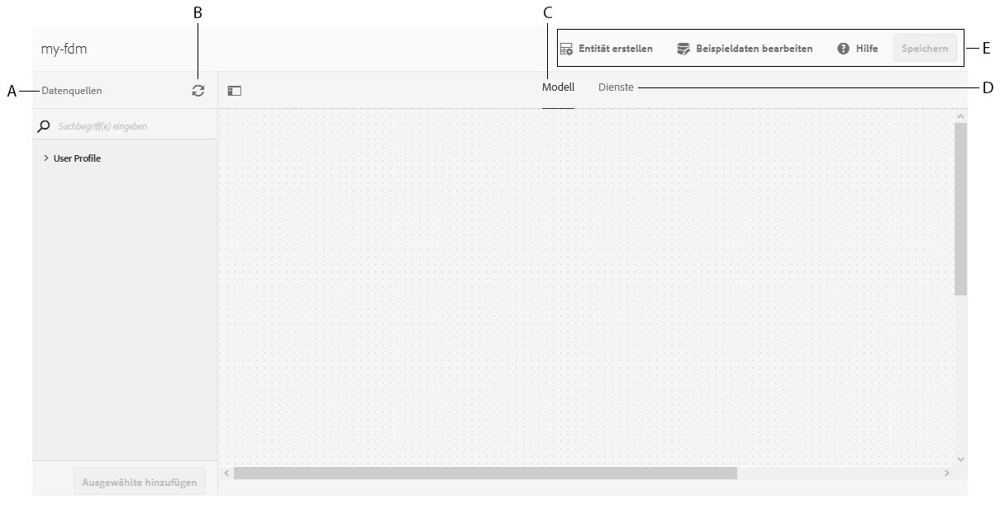
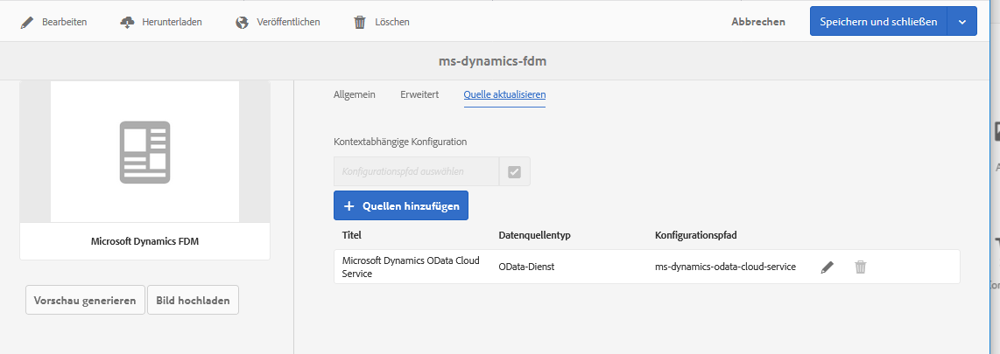

# Formulardatenmodell erstellen{#create-form-data-model}

Die AEM Forms-Datenintegration bietet eine intuitive Benutzeroberfläche zum Erstellen von und Arbeiten mit Formulardatenmodellen. Ein Formulardatenmodell stützt sich auf Datenquellen für den Austausch von Daten; Sie können jedoch ein Formulardatenmodell mit oder ohne Datenquelle erstellen. Je nachdem, ob Sie Datenquellen konfiguriert haben, gibt es zwei Möglichkeiten, ein Formulardatenmodell zu erstellen:

* **Verwenden vorkonfigurierter Datenquellen**: Wenn Sie Datenquellen wie unter  [Datenquellen konfigurieren](../../forms/using/configure-data-sources.md) beschrieben konfiguriert haben, können Sie sie beim Erstellen eines Formulardatenmodells auswählen. Es stellt alle Datenmodellobjekte, Eigenschaften und Dienste aus den ausgewählten Datenquellen zur Verwendung im Formulardatenmodell zur Verfügung.

* **Ohne Datenquellen**: Wenn Sie für Ihr Formulardatenmodell keine Datenquellen konfiguriert haben, können Sie es auch ohne Datenquellen erstellen. Sie können das Formulardatenmodell verwenden, um adaptive Formulare und interaktive Kommunikation zu erstellen und sie anhand von Beispieldaten zu testen. Wenn Datenquellen verfügbar sind, können Sie das Formulardatenmodell mit Datenquellen verknüpfen, die automatisch in den zugehörigen adaptiven Formularen und interaktiven Kommunikationen reflektiert werden.

>[!NOTE]
>
>Sie müssen Mitglied der Gruppen **fdm-author** und **forms-user** sein, um Formulardatenmodell erstellen und verwenden zu können. Wenden Sie sich an Ihren AEM-Administrator, um Mitglied der Gruppe zu werden.

## Formulardatenmodell erstellen {#data-sources}

Stellen Sie sicher, dass Sie die Datenquellen konfiguriert haben, die Sie im Formulardatenmodell verwenden möchten, wie unter [Datenquellen konfigurieren](../../forms/using/configure-data-sources.md) beschrieben. Führen Sie die folgenden Schritte aus, um ein Formulardatenmodell basierend auf konfigurierten Datenquellen zu erstellen:

1. Navigieren Sie in der AEM-Autoreninstanz zu **[!UICONTROL Formulare > Datenintegration]**.
1. Tippen Sie auf **[!UICONTROL Erstellen > Formulardatenmodell]**.
1. Im Dialogfeld „Formulardatenmodell erstellen“:

   * Geben Sie einen Namen für das Formulardatenmodul ein.
   * (**Optional**) Geben Sie Titel, Beschreibung und Tags für das Formulardatenmodell an.
   * (**Optional und nur anwendbar, wenn Datenquellen konfiguriert sind**) Tippen Sie auf das Häkchen-Symbol neben dem Feld **[!UICONTROL Datenquellenkonfiguration]** und wählen Sie den Konfigurationsknoten, in dem sich die Cloud-Dienste für die Datenquellen befinden, die Sie verwenden möchten. Das beschränkt die Liste der Datenquellen, die auf der nächsten Seite zur Auswahl stehen, auf diejenigen, die im ausgewählten Konfigurationsknoten verfügbar sind. JDBC-Datenbank- und AEM-Benutzerprofildatenquellen werden jedoch standardmäßig aufgelistet. Wenn Sie keinen Konfigurationsknoten auswählen, werden Datenquellen von allen Konfigurationsknoten aufgelistet.

   Tippen Sie auf **[!UICONTROL Weiter]**.

1. (**Nur anwendbar, wenn Datenquellen konfiguriert sind**) Der Bildschirm **[!UICONTROL Datenquelle auswählen]** listet verfügbare Datenquellen auf, falls vorhanden. Wählen Sie Datenquellen aus, die Sie im Formulardatenmodell verwenden möchten.
1. Tippen Sie auf **[!UICONTROL Erstellen]** und tippen Sie im Bestätigungsdialogfeld auf **[!UICONTROL Öffnen]** , um den Formulardatenmodelleditor zu öffnen.

Sehen wir uns die verschiedenen Komponenten der Benutzeroberfläche des Formulardatenmodell-Editors an.

**A. Data** SourcesListet Datenquellen in einem Formulardatenmodell auf. Erweitern Sie eine Datenquelle, um ihre Datenmodellobjekte und Dienste anzuzeigen.

**B. Datenquellendefinitionen aktualisieren** Ruft alle Änderungen in Datenquellendefinitionen aus konfigurierten Datenquellen ab und aktualisiert sie auf der Registerkarte Datenquellen des Formulardatenmodelleditors.

**C.** Bereich &quot;ModelContent&quot;, in dem hinzugefügte Datenmodellobjekte angezeigt werden.

**D.** ServicesContent-Bereich, in dem hinzugefügte Datenquellenvorgänge oder Dienste angezeigt werden.

**E.** ToolbarTools zum Arbeiten mit dem Formulardatenmodell. Die Symbolleiste zeigt mehr Optionen, abhängig vom ausgewählten Objekt im Formulardatenmodell.

**F.** Hinzufügen von SelectedFügt ausgewählte Datenmodellobjekte und Dienste zum Formulardatenmodell hinzu.

Weitere Informationen zum Formulardatenmodell-Editor und dazu, wie Sie damit Formulardatenmodell bearbeiten und konfigurieren können, finden Sie unter [Arbeiten mit Formulardatenmodell](../../forms/using/work-with-form-data-model.md).

## Datenquellen aktualisieren {#update}

Führen Sie die folgenden Schritte aus, um Datenquellen zu einem vorhandenen Formulardatenmodell hinzuzufügen oder zu aktualisieren.

1. Navigieren Sie zu **[!UICONTROL Forms > Datenintegrationen]**, wählen Sie das Formulardatenmodell aus, dem Sie Datenquellen hinzufügen oder aktualisieren möchten, und tippen Sie auf **[!UICONTROL Eigenschaften]**.
1. Wechseln Sie in den Eigenschaften des Formulardatenmodells zur Registerkarte **[!UICONTROL Quelle aktualisieren]**.

   Auf der Registerkarte „Quelle aktualisieren“:

   * Tippen Sie auf das Symbol „Durchsuchen“ im Feld **[!UICONTROL Kontextsensitive Konfiguration]** und wählen Sie einen Konfigurationsknoten aus, in dem sich die Cloud-Konfiguration für die hinzuzufügende Datenquelle befindet. Wenn Sie keinen Knoten auswählen, werden Cloud-Konfigurationen, die sich nur im Knoten `global` befinden, aufgelistet, wenn Sie auf **[!UICONTROL Quellen hinzufügen]** tippen.

   * Um eine neue Datenquelle hinzuzufügen, tippen Sie auf **[!UICONTROL Quellen hinzufügen]** und wählen Sie die Datenquellen aus, die dem Formulardatenmodell hinzugefügt werden sollen. Alle in `global` konfigurierten Datenquellen und ggf. der ausgewählte Konfigurationsknoten werden angezeigt.

   * Um eine vorhandene Datenquelle durch eine andere Datenquelle desselben Typs zu ersetzen, tippen Sie auf das Symbol **[!UICONTROL Bearbeiten]** für die Datenquelle und wählen Sie diese aus der Liste der verfügbaren Datenquellen aus.
   * Um eine vorhandene Datenquelle zu löschen, tippen Sie auf das Symbol **[!UICONTROL Löschen]** für die Datenquelle. Das Symbol „Löschen“ ist deaktiviert, wenn ein Datenmodellobjekt in der Datenquelle im Formulardatenmodell hinzugefügt wird.

   

1. Tippen Sie auf **[!UICONTROL Speichern und schließen]**, um die Aktualisierungen zu speichern.

>[!NOTE]
>
>Nachdem Sie neue Datenquellen hinzugefügt oder vorhandene Datenquellen in einem Formulardatenmodell aktualisiert haben, müssen Sie die Bindungsreferenzen gegebenenfalls in adaptiven Formularen und interaktiven Kommunikationen aktualisieren, die das aktualisierte Formulardatenmodell verwenden.

## Nächste Schritte {#next-steps}

Sie haben jetzt ein Formulardatenmodell mit hinzugefügten Datenquellen. Als Nächstes können Sie das Formulardatenmodell bearbeiten, um Datenmodellobjekte und -dienste hinzuzufügen und zu konfigurieren, Verknüpfungen zwischen Datenmodellobjekten hinzuzufügen, Eigenschaften zu bearbeiten, benutzerdefinierte Datenmodellobjekte und -eigenschaften hinzuzufügen, Beispieldaten zu generieren und so weiter.

Weitere Informationen finden Sie unter [Arbeiten mit dem Formulardatenmodell](../../forms/using/work-with-form-data-model.md).
