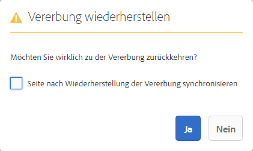

# Erstellen einer interaktiven Kommunikation{#create-an-interactive-communication}

## Übersicht {#overview}

Interaktive Kommunikationen zentralisieren und verwalten die Erstellung, Zusammenstellung und Bereitstellung personalisierter und interaktiver Schriftstücke. Wenn Sie Druck als primären Kanal für das Web verwenden, können Sie die Aufwandsduplizierung beim Erstellen der Web-Ausgabe der interaktiven Kommunikation minimieren.

### Voraussetzungen {#prerequisites}

Die folgenden Voraussetzungen müssen erfüllt sein, um eine interaktive Kommunikation zu erstellen:

* Richten Sie ein [Formulardatenmodell](/help/forms/using/data-integration.md) ein, das Testdaten oder eine tatsächliche Datenquelle enthält, z. B. eine Instanz von Microsoft® Dynamics.
* Vergewissern Sie sich, dass Sie die [Dokumentfragmente](/help/forms/using/document-fragments.md) haben. 
* Stellen Sie sicher, dass Sie [Vorlagen für Druck- und Web-Kanal](/help/forms/using/web-channel-print-channel.md) haben.
* Stellen Sie sicher, dass Sie über das erforderliche [Design](/help/forms/using/themes.md) für den Web-Kanal verfügen.

## Erstellen einer interaktiven Kommunikation {#createic}

1. Melden Sie sich bei Ihrer AEM-Autoreninstanz an und navigieren Sie zu **[!UICONTROL Adobe Experience Manager]** > **[!UICONTROL Formulare]** > **[!UICONTROL Formulare und Dokumente]**.
1. Tippen Sie auf **[!UICONTROL Erstellen]** und wählen Sie **[!UICONTROL Interaktive Kommunikation]** aus. Die Seite „Interaktive Kommunikation erstellen“ wird angezeigt. 

   

1. Geben Sie folgende Informationen ein. :

   * **[!UICONTROL Titel]**: Geben Sie den Titel der interaktiven Kommunikation ein.
   * **[!UICONTROL Name]**: Der Name der interaktiven Kommunikation wird aus dem von Ihnen eingegebenen Titel abgeleitet. Bearbeiten Sie ihn gegebenenfalls.
   * **[!UICONTROL Beschreibung]**: Geben Sie eine Beschreibung der interaktiven Kommunikation ein.
   * **[!UICONTROL Formulardatenmodell]**: Durchsuchen und wählen Sie das Formulardatenmodell aus. Weitere Informationen zum Formulardatenmodell finden Sie unter [AEM Forms-Datenintegration](/help/forms/using/data-integration.md). 

   * **[!UICONTROL Vorbefüllungs-Service]**: Wählen Sie den Vorbefüllungs-Service, um die Daten abzurufen und die interaktive Kommunikation vorzufüllen.
   * **[!UICONTROL Nachbearbeitungstyp]**: Wählen Sie den AEM- oder Forms-Workflow aus, der ausgelöst werden soll, wenn die interaktive Kommunikation veröffentlicht wird. Wählen Sie den Typ des auszulösenden Workflows aus.

   * **[!UICONTROL Nachbearbeitung]**: Wählen Sie den Namen des Workflows aus, der ausgelöst werden soll. Wenn Sie den AEM-Workflow auswählen, geben Sie den jeweiligen Pfad für die Anhänge, das Layout, die PDF-Datei, die Druckdaten und die Web-Daten an.
   * **[!UICONTROL Tags]**: Wählen Sie die Tags aus, die auf die interaktive Kommunikation angewendet werden sollen. Sie können auch einen neuen/benutzerdefinierten Tag-Namen eingeben und die Eingabetaste drücken, um ihn zu erstellen.
   * **[!UICONTROL Autor]**: Der Name des Autors wird automatisch aus dem Benutzernamen des angemeldeten Benutzers übernommen.
   * **[!UICONTROL Veröffentlichungsdatum:]** Geben Sie das Datum ein, an dem die interaktive Kommunikation veröffentlicht werden soll.
   * **[!UICONTROL Datum der Aufhebung der Veröffentlichung]**: Geben Sie das Datum ein, an dem die Veröffentlichung der interaktiven Kommunikation aufgehoben werden soll.

1. Wählen Sie **[!UICONTROL Weiter]** aus. Der Bildschirm zur Angabe von Druck- und Webkanal-Details wird angezeigt.
1. Geben Sie Folgendes ein:

   * **[!UICONTROL Drucken]**: Wählen Sie diese Option, um den Druckkanal der interaktiven Kommunikation zu generieren.
   * **[!UICONTROL Druckvorlage]**: Durchsuchen und wählen Sie ein XDP als Druckvorlage.
   * **[!UICONTROL Web]**: Wählen Sie diese Option, um den Web-Kanal oder die responsive Ausgabe der interaktiven Kommunikation zu generieren.
   * **[!UICONTROL Web-Vorlage für interaktive Kommunikation]**: Durchsuchen Sie die Web-Vorlagen und wählen Sie eine aus.
   * **[!UICONTROL Design]** und **[!UICONTROL Design auswählen]**: Durchsuchen Sie die Designs und wählen Sie eines aus, um den Web-Kanal der interaktiven Kommunikation zu gestalten. Weitere Informationen finden Sie unter [Designs in AEM Forms](/help/forms/using/themes.md).

   * **[!UICONTROL Druck als Master für Webkanal verwenden]**: Wählen Sie diese Option, um den Web-Kanal synchron mit dem Druckkanal zu erstellen. Die Verwendung des Druckkanals als primärer Kanal für den Web-Kanal stellt sicher, dass der Inhalt und die Datenbindung des Web-Kanals vom Druckkanal abgeleitet werden und die im Druckkanal vorgenommenen Änderungen im Web-Kanal übernommen werden, wenn Sie „Synchronisieren“ auswählen. Die Autorinnen und Autoren dürfen jedoch ggf. die Vererbung für Komponenten im Web-Kanal aufheben. Weitere Informationen finden Sie unter [Synchronisieren des Webkanals mit dem Druckkanal](../../forms/using/create-interactive-communication.md#synchronize).
Wenn Sie die Option **[!UICONTROL Drucken als Übergeordnet für Webkanal verwenden]** auswählen, können Sie einen der folgenden Modi auswählen, um den Webkanal zu erzeugen:

      * **[!UICONTROL Auto-Layout]**: Wählen Sie diesen Modus aus, um automatisch Platzhalter, Inhalte und Datenbindung für den Webkanal aus dem Druckkanal zu generieren.
      * **[!UICONTROL Manuelles Organisieren]**: Wählen Sie diesen Modus aus, um die Elemente des Druckkanals manuell auszuwählen und dem Webkanal mithilfe der übergeordneten Inhalte hinzuzufügen, die in der Registerkarte **[!UICONTROL Datenquellen]** verfügbar sind. Weitere Informationen finden Sie unter [Auswählen von Druckkanalelementen, um Webkanalinhalte zu erstellen](#selectprintchannelelements).

   Weitere Informationen zu Druckkanal und Webkanal finden Sie unter [Druckkanal und Webkanal](/help/forms/using/web-channel-print-channel.md).

1. Wählen Sie **[!UICONTROL Erstellen]**. Die interaktive Kommunikation wird erstellt und eine Warnmeldung erscheint. Wählen Sie **[!UICONTROL Bearbeiten]** aus, um mit dem Erstellen der Inhalte der interaktiven Kommunikation zu beginnen, wie in [Hinzufügen von Inhalten mit der Benutzeroberfläche zum Erstellen der interaktiven Kommunikation](#step2) beschrieben. Alternativ können Sie **[!UICONTROL Fertig]** auswählen und die interaktive Kommunikation später bearbeiten.

## Fügen Sie der interaktiven Kommunikation Inhalte hinzu {#step2}

Nachdem Sie eine interaktive Kommunikation erstellt haben, können Sie die Authoring-Oberfläche zum Erstellen der interaktiven Kommunikation verwenden, um ihre Inhalte zu erstellen.

Weitere Informationen zur Authoring-Oberfläche zum Erstellen der interaktiven Kommunikation finden Sie unter [Einführung in die Bearbeitung der interaktiven Kommunikation](/help/forms/using/introduction-interactive-communication-authoring.md).

1. Die Authoring-Oberfläche zum Erstellen der interaktiven Kommunikation wird gestartet, wenn Sie „Bearbeiten“ auswählen, wie in [Erstellen einer interaktiven Kommunikation](#createic) beschrieben. Alternativ können Sie zu einem vorhandenen Asset der interaktiven Kommunikation auf AEM navigieren, es auswählen und dann **[!UICONTROL Bearbeiten]** auswählen, um die Authoring-Oberfläche zum Erstellen der interaktiven Kommunikation zu starten.

   Standardmäßig wird der Druckkanal der interaktiven Kommunikation angezeigt, es sei denn, die interaktive Kommunikation ist nur für Webkanal. Der Druckkanal der interaktiven Kommunikation zeigt Zielbereiche an, die in der ausgewählten XDP/Druckkanalvorlage verfügbar sind. In diesen Zielbereichen und Feldern können Sie Komponenten oder Assets hinzufügen.

1. Wählen Sie bei ausgewähltem Druckkanal die Registerkarte **[!UICONTROL Komponenten]**. Die folgenden Komponenten sind im Druckkanal verfügbar:

   | **Komponente** | **Funktionalität** |
   |---|---|
   | Diagramm | Fügt ein Diagramm hinzu, das Sie in der interaktiver Kommunikation zur visuellen Darstellung von zweidimensionalen Daten verwenden können, die aus einer Formulardatenmodellsammlung abgerufen werden. Weitere Informationen finden Sie unter [Verwenden von Diagrammen mit interaktiver Kommunikation](/help/forms/using/chart-component-interactive-communications.md). |
   | Dokumentfragment | Ermöglicht das Hinzufügen einer wiederverwendbaren Komponente, wie z. B. eines Textes, einer Liste oder einer Bedingung, zu einer interaktiven Kommunikation. Die hinzugefügte Komponente kann auf einem Formulardatenmodell basieren oder nicht. |
   | Bild | Ermöglicht das Einfügen eines Bildes. |

   Ziehen Sie die Komponenten per Drag-and-Drop in Ihre interaktive Kommunikation und konfigurieren Sie sie nach Bedarf.

   Sie können beim Verfassen einer interaktiven Kommunikation für den Druck- und den Webkanal auch die Vorgänge „Rückgängig machen“ und „Wiederholen“ verwenden.

   Verwenden Sie den Vorgang „Rückgängig machen“, um die zuletzt durchgeführte Aktion zu verwerfen, und den Vorgang „Wiederholen“, um die verworfene Aktion erneut einzubinden. Wenn Sie z. B. ein Bild eingefügt oder eine Datenbindung in einer interaktiven Kommunikation erstellt haben und dies wieder rückgängig machen wollen, verwenden Sie den Vorgang „Rückgängig machen“.

   

   Die Optionen „Rückgängig machen“ und „Wiederholen“ werden in der Seitensymbolleiste der Authoring-Oberfläche angezeigt. Die Option „Rückgängig machen“ wird erst nach Durchführung einer Aktion angezeigt. Die Option „Wiederholen“ wird nur nach Durchführung eines„ Rückgängig machen“-Vorgangs in der Seitensymbolleiste angezeigt. Diese Aktionen werden beim Aktualisieren der Seite zurückgesetzt.

1. Wenn der Druckkanal ausgewählt ist, wechseln Sie zur Registerkarte **[!UICONTROL Assets]** und wenden Sie den Filter an, um nur die Assets anzuzeigen, die Sie sehen möchten.

   Mit dem Assets-Browser können Sie Assets auch direkt per Drag-and-Drop in die Zielbereiche der interaktiven Kommunikation ziehen.

   

1. Ziehen Sie die Dokumentfragmente per Drag-and-Drop in die interaktive Kommunikation. Im Folgenden finden Sie die Arten von Dokumentfragmenten, die Sie im Druckkanal der interaktiven Kommunikation verwenden können.

<table>
 <tbody>
  <tr>
   <td><strong>Dokumentfragmenttyp</strong></td>
   <td><strong>Beispielzweck</strong></td>
  </tr>
  <tr>
   <td><a href="/help/forms/using/texts-interactive-communications.md" target="_blank">Text</a></td>
   <td>Text zum Hinzufügen der Adresse, der E-Mail-Adresse des Empfängers und des Nachrichtentexts des Briefs </td>
  </tr>
  <tr>
   <td><a href="/help/forms/using/conditions-interactive-communications.md" target="_blank">Bedingung</a></td>
   <td>Bedingung, um der Kommunikation basierend auf dem Typ der Richtlinie das entsprechende Kopfzeilenbild hinzuzufügen: Standard oder Premium. <br /> </td>
  </tr>
  <tr>
   <td>Liste</td>
   <td>Gruppe von Dokumentfragmenten, einschließlich Text, Bedingungen, anderen Listen und Bildern. <br /> </td>
  </tr>
 </tbody>
</table>

Sie können die Bindung zwischen einem Zielbereich und einem Dokumentfragment auch ersetzen, indem Sie das neue Fragment mithilfe der Registerkarte **[!UICONTROL Assets]** auf dem Zielbereich ablegen. Die blaue Farbschattierung des Zielbereichs beim Ziehen des Fragments zeigt an, dass das Dokumentfragment in den Zielbereich abgelegt werden kann.

Weitere Informationen zu Dokumentfragmenten finden Sie unter [Dokumentfragmente](/help/forms/using/document-fragments.md).

Die Authoring-Oberfläche ermöglicht es Ihnen, in einer interaktiven Kommunikation zwischen ungebundenen und gebundenen Feldern und Variablen zu unterscheiden. In der Benutzeroberfläche werden die ungebundenen Felder und Variablen mit einem orangefarbenen Rahmen hervorgehoben.


Wenn Sie den Mauszeiger über diese Elemente bewegen, wird außerdem eine QuickInfo mit der Meldung „Feld“ (Ungebunden) oder „Variable“ (Ungebunden) angezeigt.

Eine in einem Dokumentfragment verwendete ungebundene Variable wird in der Authoring-Oberfläche manchmal nicht angezeigt. Dies kann aufgrund einer Inline-Textregel in einem Dokumentfragment oder im Fall eines Bedingungsfragments geschehen. In solchen Fällen wird eine in Blau hervorgehobene QuickInfo als Teil des Dokumentfragments angezeigt. Die QuickInfo zeigt die Anzahl der ungebundenen Variablen an, die in einem Dokumentfragment verwendet werden.


Wählen Sie das Dokumentfragment, dann  (Konfigurieren) und schließlich **[!UICONTROL Eigenschaften]** aus dem Sidekick der interaktiven Kommunikation aus. Im Abschnitt **[!UICONTROL Variablen und Datenmodellobjekte]** werden die Variablen, einschließlich der ausgeblendeten Variablen, und die Datenmodellobjekte aufgelistet, die in den Dokumentfragmenten verwendet werden. Verwenden Sie das Symbol  (Bearbeiten) neben einem Datenmodellobjekt oder einer Variablen, um die Eigenschaften zu bearbeiten.

1. Wenn Sie die Bindung von Variablen einrichten möchten, wählen Sie eine Variable und anschließend  (Konfigurieren). Legen Sie dann im Bedienfeld „Eigenschaften“ der Seitenleiste die Bindungseigenschaften fest.

   * **Keine**: Der Wert für die Variable wird vom Agenten ausgefüllt.
   * **Textfragment**: Wenn ausgewählt, können Sie ein Textdokumentfragment suchen und auswählen, dessen Inhalt in dem Feld gerendert wird. Nur die Textdokumentfragmente können an Variablen gebunden werden, die keine Variablen enthalten.
   * **Datenmodellobjekt**: Wählen Sie eine Formulardatenmodell-Eigenschaft aus, deren Wert in das Feld gefüllt wird.
   * **Standardwert**: Sie können mithilfe dieses Felds einen Standardwert für die Variable definieren. Der Wert wird in der Vorschau der interaktiven Kommunikation oder in der Agenten-Benutzeroberfläche angezeigt.
   * **Anzeigemuster**: Sie können auch ein Anzeigeformat für eine Variable definieren. Wählen Sie eine der vordefinierten Optionen aus der Dropdown-Liste **Typ**, um ein Anzeigeformat auf eine Variable anzuwenden. Wählen Sie **Benutzerdefiniert**, um ein Anzeigemuster zu definieren, das nicht in der Liste verfügbar ist. Weitere Informationen finden Sie unter [Datenanzeigemuster](../../forms/using/create-interactive-communication.md#datadisplaypatterns).

   Navigieren Sie zu [Variablen und Datenmodellobjekte](../../forms/using/create-interactive-communication.md#hiddenvariables), um die Bindung von ausgeblendeten Variablen im Dokumentfragment einzurichten.

   Sie können auch Datenquellenelemente oder Textdokumentfragmente per Drag-und-Drop verschieben, um die Bindung von Variablen einzurichten.  Um eine Bindung mit einem der Datenquellenelemente zu erstellen, wählen Sie die Registerkarte **Datenquellen** und ziehen das Element per Drag-and-Drop auf den Variablennamen. Das Datenquellenelement und die Variable müssen vom gleichen Typ sein, damit die Bindung erfolgreich eingerichtet werden kann. Wenn Sie ein Datenquellelement per Drag-and-Drop auf eine bereits gebundene Variable ziehen, ersetzt das neue Element das vorherige, um eine Bindung mit der Variablen zu erstellen. Wählen Sie auf ähnliche Weise die Registerkarte **Assets** und ziehen Sie das Textdokumentfragment per Drag-and-Drop auf den Variablennamen, um die Bindung zwischen ihnen einzurichten. Das Textdokumentfragment darf keine Variablen enthalten.

1. Um eine Tabelle mit ausgewähltem Druckkanal auf der Registerkarte **[!UICONTROL Assets]** hinzuzufügen, wenden Sie den Filter an, um nur die Layout-Fragmente anzuzeigen. Ziehen Sie das gewünschte Layout-Fragment per Drag-and-Drop in die interaktive Kommunikation. Ein Layout-Fragment basiert auf einem XDP und kann verwendet werden, um in der interaktiven Kommunikation grafische Layouts oder statische und dynamische Tabellen zu erstellen, die mit dynamischen Daten gefüllt werden.

   Beispiel: Eine Layout-Tabelle zur Anzeige von Bruttoprämie, Treuerabatt % und Notfall-Pannenhilfe für alte und neue Richtlinien.

   Weitere Informationen zu Layout-Fragmenten finden Sie unter [Dokumentfragmente](/help/forms/using/document-fragments.md).

1. Verwenden Sie bei ausgewähltem Druckkanal auf der Registerkarte **[!UICONTROL Assets]** den Filter, um Bilder anzuzeigen. Ziehen Sie die erforderlichen Bilder per Drag-and-Drop auf die interaktive Kommunikation, z. B. für ein Firmenlogo. 

   Verwalten Sie außerdem Folgendes in der interaktiven Kommunikation:

   * [Hinzufügen und Konfigurieren von Diagrammen](/help/forms/using/chart-component-interactive-communications.md)
   * [Synchronisieren des Webkanals mit dem Druckkanal](../../forms/using/create-interactive-communication.md#synchronize)

      * Automatische Synchronisierung
      * Abbrechen der Vererbung
      * Erneutes Aktivieren der Vererbung
      * Synchronisieren

   * [Anlagen und Bibliothekszugriff](../../forms/using/create-interactive-communication.md#attachmentslibrary)
   * [XDP-/Layout-Feldeigenschaften](../../forms/using/create-interactive-communication.md#xdplayoutfieldproperties)
   * [Fügen Sie Regeln zu Komponenten hinzu](../../forms/using/create-interactive-communication.md#rules)

1. Wechseln Sie zu **[!UICONTROL Webkanal]**. Der Webkanal wird im Editor für interaktive Kommunikation angezeigt. Wenn Sie zum ersten Mal vom Druckkanal zum Webkanal wechseln, findet die automatische Synchronisierung statt. Weitere Informationen finden Sie unter [Synchronisieren des Webkanals mit dem Druckkanal](../../forms/using/create-interactive-communication.md#synchronize).

   Da wir in diesem Beispiel Druck als Master für das Web verwenden, werden die Platzhalter, der Inhalt und die Datenbindung des Druckkanals mit dem Webkanal synchronisiert. Sie können jedoch bestimmte Inhalte im Webkanal ändern und anpassen. Um Inhalte anpassen zu können, müssen Sie für die Zielbereiche und Variablen, die mithilfe des Druckkanals generiert wurden, die [Vererbung abbrechen](#cancelinheritance).

   

   Wählen Sie das Dokumentfragment,  (Konfigurieren) und dann **[!UICONTROL Eigenschaften]** im Sidekick der interaktiven Kommunikation aus. Der Abschnitt **[!UICONTROL Variablen und Datenmodellobjekte]** listet die Variablen auf, einschließlich der verborgenen Variablen und Datenmodellobjekte, die in den Dokumentfragmenten verwendet werden. Verwenden Sie das Symbol  (Bearbeiten) neben jedem Datenmodellobjekt bzw. jeder Variablen, um die Eigenschaften zu bearbeiten. Darüber hinaus können Sie bei Dokumentfragmenten, die im Webkanal mithilfe des Druckkanals [automatisch generiert](#synchronize) worden sind, mit dem Symbol  (Vererbung abbrechen) neben jedem Datenmodellobjekt und jeder Variablen die [Vererbung abbrechen](#cancelinheritance), um die Dokumentfragmente bearbeiten zu können.

1. Um weitere Komponenten im Web-Kanal hinzuzufügen, wählen Sie bei ausgewähltem Web-Kanal **[!UICONTROL Komponenten]** aus. Ziehen Sie Komponenten nach Bedarf per Drag-and-Drop in den Webkanal Ihrer interaktiven Kommunikation und fahren Sie mit der Konfiguration fort.

   | Komponenten | Funktionalität |
   |---|---|
   | Diagramm | Fügt ein Diagramm hinzu, das Sie in der interaktiver Kommunikation zur visuellen Darstellung von zweidimensionalen Daten verwenden können, die aus einer Formulardatenmodellsammlung abgerufen werden. Weitere Informationen finden Sie unter [Verwenden der Diagrammkomponente](../../forms/using/chart-component-interactive-communications.md). |
   | Dokumentfragment | Ermöglicht Ihnen das Hinzufügen einer wiederverwendbaren Komponente, eines Textes, einer Liste oder einer Bedingung zu einer interaktiven Kommunikation. Die wiederverwendbare Komponente, die Sie einer interaktiven Kommunikation hinzufügen, kann entweder formulardatenmodellbasiert sein oder ohne ein Formulardatenmodell sein. |
   | Bild | Ermöglicht das Einfügen eines Bildes. |
   | Bedienfeld | Ermöglicht Ihnen das Hinzufügen eines [Bedienfelds](../../forms/using/create-interactive-communication.md#add-panel-component-to-the-web-channel) zu der interaktiven Kommunikation. |
   | Tabelle | Fügt eine Tabelle hinzu, mit der Sie Daten in Zeilen und Spalten organisieren können. |
   | Zielbereich | Fügt einen Zielbereich in einen Web-Kanal ein, um die Web-kanalspezifischen Komponenten zu organisieren. Der Zielbereich ist ein einfacher Container, mit dem Sie Web-kanalspezifische Komponenten gruppieren können. |
   | Text | Fügt Rich-Text zum Web-Kanal einer interaktiven Kommunikation hinzu. Text kann auch Formulardatenmodellobjekte verwenden, um den Inhalt dynamisch zu gestalten. |
   | Schaltfläche | Ermöglicht das Hinzufügen einer [Schaltfläche](../../forms/using/create-interactive-communication.md#add-button-component-to-the-web-channel) zu der interaktiven Kommunikation. Sie können die Schaltflächenkomponente dazu verwenden, zu anderen interaktiven Kommunikationen, adaptiven Formularen, anderen Elementen (wie Bildern oder Dokumentfragmenten) oder zu einer externen URL zu navigieren. |
   | Trennzeichen | Ermöglicht das Einfügen einer horizontalen Linie in eine interaktive Kommunikation. Verwenden Sie diese Komponente, um Abschnitte in einer Korrespondenz auseinanderzuhalten. Beispielsweise können Sie in einem Kreditkartenauszug mithilfe der Trennzeichenkomponente zwischen den Abschnitten „Kundendetails“ und „Kreditkartendetails“ unterscheiden. |

1. Fügen Sie nach Bedarf Assets in Ihren Webkanal ein.

   Sie können [Ihre interaktive Kommunikation in der Vorschau anzeigen](#previewic), um zu sehen, wie die Druck- und Webausgaben der interaktiven Kommunikation aussehen, und Sie können gegebenenfalls weitere Änderungen vornehmen.

## Interaktive Kommunikation in der Vorschau anzeigen {#previewic}

Sie können die **Vorschauoption** verwenden, um das Aussehen der interaktiven Kommunikation zu beurteilen. Der Webkanal der interaktiven Kommunikation bietet auch eine Option zum Emulieren des Erlebnisses einer interaktiven Kommunikation für verschiedene Geräte. Beispiel: iPhone, iPad und Desktop. Sie können **Vorschau** und **Emulator**--Optionen in Kombination verwenden, um die Webausgaben für Geräte mit unterschiedlichen Bildschirmgrößen in der Vorschau anzuzeigen. Die Beispieldaten in der Vorschau werden aus dem angegebenen Formulardatenmodell befüllt. 

1. Wählen Sie den (Druck- oder Web-)Kanal aus, um eine Vorschau anzuzeigen und die Vorschau auszuwählen. Die interaktive Kommunikation wird angezeigt.

   >[!NOTE]
   >
   >Die Vorschau wird mit den Beispieldaten des Formulardatenmodells befüllt. Weitere Informationen zur Vorschau der interaktiven Kommunikation mit anderen Daten oder zur Verwendung des Vorbefüllungs-Services finden Sie unter [Verwenden eines Formular-Datenmodells](/help/forms/using/using-form-data-model.md) und [Arbeiten mit dem Formular-Datenmodell](/help/forms/using/work-with-form-data-model.md).

1. Für den Webkanal verwenden Sie , um sich anzusehen, wie die interaktive Kommunikation auf verschiedenen Geräten aussieht.

   

Weiterhin können Sie die [Interaktive Kommunikation mithilfe der Benutzeroberfläche für Agenten vorbereiten und senden](/help/forms/using/prepare-send-interactive-communication.md).

## Konfigurieren von Eigenschaften bei interaktiven Kommunikationen  {#configure-properties-in-interactive-communication}

### Anlagen und Bibliothekszugriff {#attachmentslibrary}

Im Druckkanal können Sie die Anhänge und den Bibliothekszugriff so konfigurieren, dass der Agent Anhänge in der Agenten-Benutzeroberfläche für die interaktive Kommunikation verwalten kann:

1. Markieren Sie im Druckkanal den Dokumenten-Container und wählen Sie **Eigenschaften** aus.

   

   Der Bereich „Eigenschaften“ wird in der Seitenleiste angezeigt.

   

1. Öffnen Sie **Anhänge** und geben Sie die folgenden Eigenschaften an:

   * **[!UICONTROL Bibliothekszugriff zulassen]**: Wählen Sie diese Option, um den Bibliothekszugriff für den Agenten in der Agenten-Benutzeroberfläche zu aktivieren. Wenn diese Option aktiviert ist, kann der Agent Dateien aus der Bibliothek hinzufügen, während die interaktive Kommunikation vorbereitet wird.
   * **[!UICONTROL Neuanordnen von Anhängen zulassen]**: Wählen Sie diese Option aus, um dem Agenten zu ermöglichen, die Anhänge mit der interaktiven Kommunikation neu anzuordnen.
   * **[!UICONTROL Maximale Anzahl zulässiger Anhänge]**: Geben Sie die maximal zulässige Anzahl von Anhängen für die interaktive Kommunikation an.
   * **[!UICONTROL Anzuhängende Dateien]**: Wählen Sie **[!UICONTROL Hinzufügen]** und durchsuchen Sie die Dateien, um diejenigen auszuwählen, die angehängt werden sollen. Geben Sie Folgendes an:

      * **[!UICONTROL Diese Datei standardmäßig an das Dokument anhängen]**: Sie können diese Option nur ändern, wenn der Anhang nicht obligatorisch ist.
      * **[!UICONTROL Obligatorisch:]** Der Agent kann den Anhang in der Agenten-Benutzeroberfläche nicht entfernen.

   

1. Wählen Sie **[!UICONTROL Fertig]**.

### XDP-/Layout-Feldeigenschaften {#xdplayoutfieldproperties}

1. Beim Bearbeiten des Druckkanals einer interaktiven Kommunikation bewegen Sie die Maus über ein Feld, das in der Druckkanalvorlage erstellt wurde, und wählen Sie das Symbol  (Konfigurieren) aus.

   Das Dialogfeld „Eigenschaften“ wird in der Seitenleiste angezeigt.

   

1. Geben Sie Folgendes an:

   * **[!UICONTROL Name]**: JCR Knotenname.
   * **[!UICONTROL Titel]**: Geben Sie einen Titel ein, der für den Agenten in der Benutzeroberfläche für Agenten und in der Struktur des Dokumentcontainers sichtbar ist.
   * **[!UICONTROL Bindungstyp]**: Wählen Sie einen der folgenden Bindungstypen für das Feld aus.

      * Keine: Agent füllt den Wert für die Eigenschaft aus.
      * Textfragment: Wenn ausgewählt, können Sie ein Textdokumentfragment durchsuchen und auswählen, dessen Inhalt in dem Feld gerendert wird. Alternativ können Sie das Textdokumentfragment per Drag-and-Drop zum Feldnamen ziehen, um die Bindung zwischen beiden herzustellen. Das Textdokumentfragment darf keine Variablen enthalten.
      * Datenmodellobjekt: Wählen Sie eine Formulardatenmodell-Eigenschaft aus, deren Wert in das Feld gefüllt wird. Alternativ wählen Sie die Registerkarte **Datenquellen** aus und ziehen die Eigenschaft per Drag-and-Drop in das Feld.

   * **[!UICONTROL Standardwerte]**: Der Standardwert stellt sicher, dass das Feld nicht leer ist, wenn vom angegebenen Datenmodellobjekt oder Textfragment kein Wert bereitgestellt wird. Wenn der Datenbindungstyp „Keine“ ist, wird der Standardwert im Feld vorbefüllt.
   * **[!UICONTROL Anzeigemuster]**: Sie können auch ein Anzeigeformat für ein Feld definieren. Um ein Anzeigeformat auf ein Feld anzuwenden, wählen Sie eine der vordefinierten Optionen aus der Dropdown-Liste **Typ** aus. Um ein Anzeigemuster zu definieren, das nicht in der Liste verfügbar ist, wählen Sie **Benutzerdefiniert** aus. Weitere Informationen finden Sie unter [Datenanzeigemuster](../../forms/using/create-interactive-communication.md#datadisplaypatterns).

   * **[!UICONTROL Bearbeitbar nach Agent]**: Wählen Sie diese Option aus, damit der Agent den Wert in dem Feld in der Benutzeroberfläche für Agenten bearbeiten kann. Diese Einstellung ist nicht anwendbar, wenn der Bindungstyp „Textfragment“ ist.
   * **[!UICONTROL Beschriftung:]** Geben Sie eine Textzeichenfolge ein, die in dem Feld in der Benutzeroberfläche für Agenten angezeigt wird. Diese Einstellung ist nicht anwendbar, wenn der Bindungstyp „Textfragment“ ist.
   * **[!UICONTROL QuickInfo]**: Geben Sie eine Textzeichenfolge ein, die sichtbar wird, wenn die Maus über den Agenten in der Benutzeroberfläche für Agenten bewegt wird. Diese Einstellung ist nicht anwendbar, wenn der Bindungstyp „Textfragment“ ist.
   * **[!UICONTROL Erforderlich:]** Wählen Sie diese Option, um das Feld zu einem Pflichtfeld für den Agenten zu machen. Diese Einstellung ist nicht anwendbar, wenn der Bindungstyp „Textfragment“ ist.
   * **[!UICONTROL Mehrere Zeilen zulassen]**: Wählen Sie dieses Feld aus, um mehrere Textzeilen als Eingabe in das Feld zuzulassen. Diese Einstellung ist nicht anwendbar, wenn der Bindungstyp „Textfragment“ ist.

1. Wählen Sie  aus.

### Datenanzeigemuster {#datadisplaypatterns}

Über die Authoring-Oberfläche können Sie Datenanzeigemuster für Felder, Variablen und Formulardatenmodell-Elemente definieren, die beim Erstellen einer interaktiven Kommunikation für Druck- und Webkanäle verfügbar sind.

Um das Datenanzeigemuster zu konfigurieren, wählen Sie das Element und dann  (Konfigurieren) aus und richten Sie das Anzeigemuster im Bedienfeld **[!UICONTROL Eigenschaften]** in der Seitenleiste ein. Wählen Sie eine vordefinierte Option aus der Dropdown-Liste **[!UICONTROL Typ]**, um das mit dem ausgewählten Typ verknüpfte Muster anzuzeigen. Wählen Sie **[!UICONTROL Benutzerdefiniert]** aus der Dropdown-Liste **[!UICONTROL Typ]**, um ein Muster zu definieren, das nicht in der Liste verfügbar ist. Das Bearbeiten von Werten im Feld **[!UICONTROL Muster]** ändert den Typ automatisch in **[!UICONTROL Benutzerdefiniert]**.

Um das Anzeigemuster anzuwenden, muss die Anzahl der im Feld „Muster“ definierten Zeichen oder Ziffern mit den Zeichen oder Ziffern übereinstimmen oder diese überschreiten, die im Wert für Felder, Variablen und Formulardatenmodell-Elemente definiert sind. Weitere Informationen finden Sie unter [Beispiel](../../forms/using/create-interactive-communication.md#greaternumberofdigits).


Sie können das Anzeigemuster für ein Feld, eine Variable oder ein Formulardatenmodell-Element neu definieren, nachdem Sie Webinhalte aus dem Druckkanal generiert haben. Daher können für ein Element unterschiedliche Anzeigemuster für Druck- und Webkanäle definiert sein. Wenn Sie kein Anzeigemuster für ein Element im Druckkanal definieren und Webinhalte mithilfe des Druckkanals automatisch generieren, definiert die für das Element im Druckkanal definierte Datenbindung die in der Dropdown-Liste **[!UICONTROL Typ]** verfügbaren Optionen für das Anzeigemuster. Wenn für das Element keine Bindung definiert ist, definiert der Datentyp des Elements die verfügbaren Anzeigemuster-Optionen. Wenn Sie z. B. eine Datenbindung vom Typ Zahl für ein Element im Druckkanal erstellen, sind die Optionen für das Anzeigemuster in der Dropdown-Liste **[!UICONTROL Typ]** vom Typ Zahl in verschiedenen Formaten.

Wechseln Siein den **Vorschau**-Modus oder öffnen Sie die Benutzeroberfläche für Agenten, um das auf diese Elemente angewendete Anzeigemuster anzuzeigen.

In der folgenden Tabelle finden Sie ein Beispiel für die Werte, die durch Festlegen des Datenanzeigemusters für eine Variable angezeigt werden:

| Typ | Standardwert | Anzeigemuster | Wert anzeigen | Beschreibung |
|---|---|---|---|---|
| Sozialversicherungsnummer | 123456789 | text{999-99-9999} | 123-45-6789 | Die Anzahl der Stellen im Feld „Standardwert“ entspricht der Anzahl der Stellen im Feld „Muster“. Der auf dem Muster basierende Wert wird erfolgreich angezeigt. |
| Sozialversicherungsnummer | 1234567 | text{999-99-9999} | 1-23-4567 | Die Anzahl der Stellen im Feld „Standardwert“ ist kleiner als die Anzahl der Stellen im Feld „Muster“. Das Muster gilt für die 7 verfügbaren Stellen. |
| Sozialversicherungsnummer | 1234567890 | text{999-99-9999} | 1234567890 | Die Anzahl der Stellen im Feld „Standardwert“ ist größer als die Anzahl der Stellen im Feld „Muster“. Daher ändert sich der Anzeigewert nicht. |

Wenn kein Anzeigemuster für eine Variable oder ein Formulardatenmodell-Element angegeben ist, wird standardmäßig die [Konfiguration globaler Dokumentfragmente](https://helpx.adobe.com/de/experience-manager/6-5/forms/using/interactive-communication-configuration-properties.html) verwendet.

Wenn Sie kein Anzeigemuster auf eine Variable des Datentyps Zahl anwenden, zeigt die Druckvorschau das Muster entsprechend der Konfiguration globaler Dokumentfragmente an. Wenn Sie Änderungen an der Standardkonfiguration für globale Dokumentfragmente vornehmen, zeigt die Benutzeroberfläche für Agenten das Muster weiterhin gemäß den für das Gebietsschema definierten Standardtrennzeichen an.

Wenn für Felder kein Anzeigemuster angegeben ist, wird das beim Erstellen der Druckvorlage (XDP) definierte Muster auf das Feld angewendet. Wenn beim Erstellen der Druckvorlage kein Muster vorhanden ist, werden die Standardmuster, die auf XFA-Spezifikationen basieren, auf die Felder angewendet.

Wenn das angegebene Anzeigemuster falsch ist oder nicht angewendet werden kann, werden die Standardmuster, die auf XFA-Spezifikationen basieren, auf die Felder, Variablen oder Formulardatenmodell-Elemente angewendet.

## Regeln auf interaktive Kommunikationskomponenten anwenden {#rules}

Um Komponenten oder Inhalte in der interaktiven Kommunikation zu konditionieren, wählen Sie die Komponente/den Inhalt und dann  (Regel erstellen) aus, um den Regel-Editor zu starten.

Weitere Informationen finden Sie unter:

* [Regeleditor](/help/forms/using/rule-editor.md)
* [Einführung in die Erstellung interaktiver Kommunikationen](/help/forms/using/introduction-interactive-communication-authoring.md)

## Verwenden von Tabellen {#tables}

### Dynamische Tabellen in einer interaktiven Kommunikation {#dynamic-tables-in-interactive-communication}

Sie können in einer interaktiven Kommunikation dynamische Tabellen mithilfe von Layout-Fragmenten hinzufügen. In den folgenden Schritten wird anhand eines Beispiels einer Kreditkartenabrechnung die Verwendung eines Layout-Fragments zum Erstellen einer dynamischen Tabelle in einer interaktiven Kommunikation veranschaulicht.

1. Stellen Sie sicher, dass das erforderliche Layout-Fragment zum Erstellen der Tabelle in AEM verfügbar ist.
1. Ziehen Sie im Druckkanal Ihrer interaktiven Kommunikation ein Layout-Fragment (mit einer mehrspaltigen Tabelle) per Drag-und-Drop aus dem Asset-Browser in einen Zielbereich.

   

   Eine Tabelle wird im Layout-Bereich der interaktiven Kommunikation angezeigt.

   

1. Geben Sie die Datenbindung für jede Zelle der Tabelle an. Um eine wiederholbare Zeile zu erstellen, fügen Sie die Eigenschaften eines Formulardatenmodells in die Zeile ein, die zu einer allgemeinen Sammlungseigenschaft gehört.

   1. Wählen Sie eine Zelle in der Tabelle und dann  (Konfigurieren) aus.

      Das Dialogfeld „Eigenschaften“ wird in der Seitenleiste angezeigt.

      

   1. Konfigurieren Sie die Eigenschaften:

      * **[!UICONTROL Name]**: JCR Knotenname.
      * **[!UICONTROL Titel]**: Geben Sie einen Titel ein, der im Editor für interaktive Kommunikation angezeigt werden wird.
      * **[!UICONTROL Bindungstyp]**: Wählen Sie einen der folgenden Bindungstypen für das Feld aus.

         * **[!UICONTROL Ohne]**
         * **[!UICONTROL Datenmodellobjekt]**: Wählen Sie eine Formulardatenmodell-Eigenschaft aus, mit deren Wert das Feld befüllt wird. Alternativ können Sie auch die Registerkarte **Datenquellen** auswählen und die Eigenschaft per Drag-and-Drop in das Feld ziehen.

      * **[!UICONTROL Datenmodellobjekt]**: Die Formulardatenmodell-Eigenschaft, mit deren Wert das Feld befüllt wird.
      * **[!UICONTROL Standardwert]**: Der Standardwert stellt sicher, dass das Feld nicht leer ist, wenn vom angegebenen Datenmodellobjekt oder Textfragment kein Wert bereitgestellt wird. Der Standardwert wird im Feld vorbefüllt.

      * **[!UICONTROL Bearbeitbar nach Agent]**: Wählen Sie diese Option aus, damit der Agent den Wert in dem Feld in der Benutzeroberfläche für Agenten bearbeiten kann.

   1. Wählen Sie  aus.

1. Zeigen Sie eine Vorschau der interaktiven Kommunikation an, um die mit den Daten gerenderte Tabelle anzuzeigen.

   

### Nur Webkanal-Tabellen {#webchanneltables}

Wählen Sie den Stammbereich in der Web-Vorlage und dann **+** aus, um eine Komponente **Tabelle** zur interaktiven Kommunikation hinzuzufügen. Eine Tabelle mit zwei Zeilen wird in die interaktive Kommunikation eingefügt. Die erste Zeile der Tabelle stellt deren Kopfzeile dar.

#### Hinzufügen von Zeilen und Spalten zur Tabelle {#addrowscolumnstable}

**So fügen Sie Spalten hinzu oder löschen sie:**

1. Wählen Sie das Standardtextfeld in der Kopfzeile der Tabelle aus, um die Komponentensymbolleiste anzuzeigen.
1. Wählen Sie **Spalte hinzufügen** oder **Spalte löschen**, um Tabellenspalten hinzuzufügen bzw. zu löschen.


**So fügen Sie Zeilen hinzu oder löschen sie:**

1. Wählen Sie eine der Tabellenzeilen aus, um die Komponentensymbolleiste anzuzeigen. Sie können die Tabelle auch mithilfe des Inhalts-Browsers im Sidekick der interaktiven Kommunikation auswählen.
1. Wählen Sie **Zeile hinzufügen** oder **Zeile löschen**, um Tabellenzeilen hinzuzufügen bzw. zu löschen. Verwenden Sie die in der Symbolleiste verfügbaren Optionen **Nach oben** und **Nach unten** zum Neuanordnen der Zeilen in der Tabelle.


**A.** Zeile hinzufügen **B.** Zeile löschen **C.** Nach oben **D.** Nach unten

#### Hinzufügen oder Bearbeiten von Text in Tabellenzellen {#addedittexttable}

1. Wählen Sie das standardmäßige Textfeld in der Tabellenzelle und dann  (Bearbeiten) aus.
1. Geben Sie den Text in die Tabellenzelle ein und wählen Sie  aus, um ihn zu speichern.

#### Erstellen von Bindungen zwischen Tabellenzellen und Datenmodellobjektelementen {#createbindingtablecells}

1. Wählen Sie das standardmäßige Textfeld in der Tabellenzeile und dann  (Bearbeiten) aus.
1. Wählen Sie die Dropdownliste „Datenmodellobjekte“ und dann die Eigenschaft aus.
1. Treffen Sie eine Auswahl zum Speichern und Erstellen einer Bindung zwischen der Tabellenzelle und der Datenmodellobjekteigenschaft.


#### Erstellen eines Hyperlinks für Text in der Tabellenzelle {#createhyperlinktable}

1. Wählen Sie das standardmäßige Textfeld in der Tabellenzelle  (Bearbeiten) aus.
1. Wählen Sie den Text in der Tabellenzelle und das Hyperlink-Symbol aus.
1. Geben Sie die URL in das Feld **Pfad** ein.
1. Wählen Sie  aus, um die Hyperlink-Eigenschaften zu speichern.


#### Erstellen dynamischer Tabellen {#createdynamictables}

Sie können eine dynamische Webkanal-Tabelle in einer interaktiven Kommunikation mithilfe einer Datenmodelleigenschaft vom Typ „Sammlung“ erstellen. Eine derartige Tabelle ist eine Darstellung der untergeordneten Eigenschaften einer Sammlungseigenschaft. Sie können nur die Formatierungseigenschaften der verschiedenen Zellen in der Tabelle bearbeiten.

1. Wechseln Sie zum Webkanal und wählen Sie dann den Datenquellen-Browser.
1. Ziehen Sie ein Sammlungseigenschaft in ein Teilformular. Eine Tabelle wird im Teilformular erstellt.
1. Zeigen Sie die Tabelle in der Webvorschau der interaktiven Kommunikation in der Vorschau an.

#### Sortieren von Spalten in einer Tabelle {#sortcolumns}

Sie können Daten auf Grundlage einer beliebigen Spalte in einer Tabelle in der interaktiven Kommunikation sortieren. Die Werte in der Spalte können in auf- oder absteigender Reihenfolge sortiert werden.

Die Sortierung kann auf Tabellenspalten angewendet werden, die Folgendes enthalten:

* Statischer Text
* Datenmodell-Objekteigenschaften
* Kombination von statischem Text und Datenmodell-Objekteigenschaften

So aktivieren Sie die Sortierung:

1. Wählen Sie die Tabelle und dann  (Konfigurieren) aus. Sie können die Tabelle auch mithilfe des **Inhalts-Browsers** in der Seitenleiste der interaktiven Kommunikation auswählen.
1. Wählen Sie **Sortierung aktivieren** aus.
1. Wählen Sie  aus, um die Tabelleneigenschaften zu speichern. Die Sortiersymbole (Auf- und Ab-Pfeile) in Spaltenüberschriften zeigen an, dass die Sortierung aktiviert wurde.

   

1. Wechseln Sie in den **Vorschau**-Modus, um die Ausgabe anzuzeigen. Die Tabelle wird automatisch nach der ersten Spalte der Tabelle sortiert.
1. Klicken Sie auf die Spaltenüberschrift, um die Werte anhand dieser Spalte zu sortieren.

   Eine Spaltenüberschrift mit einem Pfeil nach oben stellt Folgendes dar:

   * Tabelle ist anhand dieser Spalte sortiert.
   * Werte in der Spalte werden in aufsteigender Reihenfolge angezeigt.

   

   Entsprechend bedeutet eine mit einem Abwärtspfeil versehene Spaltenüberschrift, dass die Werte in der Spalte in absteigender Reihenfolge angezeigt werden.

## Bearbeiten von Eigenschaften für interaktive Kommunikation {#edit-interactive-communication-properties}

Nachdem Sie eine interaktive Kommunikation erstellt haben, können Sie deren Eigenschaften in einem späteren Schritt bearbeiten.

Verwenden Sie die Seite **Eigenschaften**, um Folgendes zu tun:

* Bearbeiten von Werten für die Felder, die beim Erstellen der interaktiven Kommunikation angegeben wurden, z. B. Titel und Beschreibung.
* Hinzufügen oder Löschen eines Webkanals für eine vorhandene interaktive Kommunikation.
* Anzeigen einer Vorschau, Herunterladen oder Löschen der interaktiven Kommunikation
* Öffnen Sie die [Benutzeroberfläche des Agenten](/help/forms/using/prepare-send-interactive-communication.md).

So greifen Sie auf die Seite **Eigenschaften** zu:

1. Melden Sie sich bei Ihrer AEM-Autoreninstanz an und navigieren Sie zu **Adobe Experience Manager** > **Formulare** > **Formulare und Dokumente**.
1. Wählen Sie die interaktive Kommunikation und dann **Eigenschaften** aus.
1. Wählen Sie die Registerkarte **Allgemein** aus, um die Felder **Titel** und **Beschreibung** zu bearbeiten.

### Hinzufügen oder Löschen des Webkanals {#add-or-delete-the-web-channel}

Führen Sie die folgenden Schritte aus, um den Webkanal für eine vorhandene interaktive Kommunikation hinzuzufügen:

1. Auf der Seite **Eigenschaften** wählen Sie die Registerkarte **Kanäle** aus.
1. Aktivieren Sie das Kontrollkästchen **Web** und wählen Sie eine Vorlage für den Webkanal aus.
1. Wählen Sie **Druck als Master für Webkanal verwenden**, um eine Synchronisierung zwischen dem Webkanal und dem Druckkanal zu aktivieren.
1. Wählen Sie **Speichern und schließen** aus, um die Änderungen zu speichern.

   Entsprechend können Sie zum Löschen des Web-Kanals aus der interaktiven Kommunikation auf der Registerkarte **Kanäle** das Kontrollkästchen **Web** auswählen.

## Hinzufügen einer Schaltflächenkomponente zum Webkanal {#add-button-component-to-the-web-channel}

Sie können eine Schaltfläche als Komponente zum Webkanal der interaktiven Kommunikation hinzufügen. Definieren Sie mithilfe des [Regeleditors](../../forms/using/rule-editor.md) Regeln, um durch Auswählen der Schaltfläche zu anderen interaktiven Kommunikationen, adaptiven Formularen, anderen Elementen wie Bildern oder Dokumentfragmenten oder einer externen URL navigieren zu können.

So fügen Sie eine Schaltfläche hinzu und definieren Regeln dafür:

1. Wählen Sie den Stammbereich in der Web-Vorlage und dann **+** aus, um der interaktiven Kommunikation die **Schaltflächenkomponente** hinzuzufügen.
1. Wählen Sie die Schaltflächenkomponente und dann  aus, um Regeln für das Auswählen der Schaltfläche zu definieren.
1. Wählens Sie im Abschnitt **Wenn** aus der Dropdown-Liste „Zustand der Schaltfläche“ **geklickt** aus.
1. Im Abschnitt **Dann**

   1. wählen Sie eine Aktion aus der Dropdown-Liste aus. Wählen Sie als Aktionstyp beispielsweise **Navigieren zu** aus.

   1. geben Sie die URL der interaktiven Kommunikation, des adaptiven Formulars, eines Elements oder einer Web-Seite an. Geben Sie beispielsweise die URL im folgenden Format an, um zu einer anderen interaktiven Kommunikation zu navigieren: https://&lt;Name des Servers>:&lt;port>/editor.html/content/forms/af/&lt;Name der interaktiven Kommunikation>/channels/&lt;Name des Kanals – Druck oder Web>.html
   1. geben Sie die Option zum Öffnen des Elements auf derselben Registerkarte, auf einer neuen Registerkarte oder in einem neuen Fenster an.
   1. Wählen Sie **Fertig** und dann **Schließen** aus, um die Regel zu speichern.

   Auf ähnliche Weise können Sie andere verfügbare Optionen aus der Dropdown-Liste „Aktionstyp“ auswählen, z. B. „Service aufrufen“ und „Formular senden“. Weitere Informationen finden Sie unter [Regel-Editor](../../forms/using/rule-editor.md).

1. Zeigen Sie eine Vorschau der interaktiven Kommunikation an und wählen Sie die Schaltfläche aus, um sich die interaktive Kommunikation, das adaptive Formular, ein Element oder eine Web-Seite, wie in Schritt 4(b) festgelegt, anzuschauen.

## Hinzufügen der Bedienfeldkomponente zum Webkanal {#add-panel-component-to-the-web-channel}

Die Bedienfeldkomponente ist ein Platzhalter zum Gruppieren anderer Komponenten und steuert, wie eine Gruppe von Komponenten, etwa Akkordeon oder Registerkarten, in der interaktiven Kommunikation angeordnet wird. Mit einer Bedienfeldkomponente können Sie auch eine Gruppe von Komponenten für Endbenutzende wiederholbar machen, z. B. wenn mehrere Einträge zum Ausfüllen von Unterrichtsberechtigungen erforderlich sind.

Gehen Sie wie folgt vor, um eine Bedienfeldkomponente zum Webkanal hinzuzufügen:

1. Fügen Sie die **Bedienfeld**-Komponente im Webkanal entsprechend einer der folgenden Möglichkeiten ein:

   * Wählen Sie eine Komponente, dann **+** und die **Bedienfeldkomponente** aus.

   * Ziehen Sie aus dem Browser-Bedienfeld **Komponente** die **Bedienfeldkomponente** per Drag-and-Drop auf die interaktive Kommunikation.

   * Wählen Sie im **Inhalts-Browser-Bedienfeld** das **Bedienfeld** und dann **Untergeordnetes Bedienfeld hinzufügen** aus. Infolge der Auswahl der Option **Untergeordnetes Bedienfeld hinzufügen** wird das Dialogfeld **Untergeordnetes Bedienfeld hinzufügen** angezeigt. Geben Sie den Titel sowie eine optionale Beschreibung und einen Namen für die Bedienfeldkomponente ein.

1. Wählen Sie das Bedienfeld aus dem **Inhalts-Browser** aus, um zusätzliche Aktionen am Bedienfeld auszuführen, z. B. zum Konfigurieren, Bearbeiten von Regeln, Kopieren, Löschen und Einfügen von Komponenten.

   Sie können ein Bedienfeld auch innerhalb des **Inhalt** -Browsers ziehen und ablegen, um die Änderung in der Struktur der interaktiven Kommunikation im rechten Bereich widerzuspiegeln.

## Synchronisierung des Webkanals mit dem Druckkanal. {#synchronize}

Die Verwendung von „Druck“ als primäres Element für den Web-Kanal stellt sicher, dass der Inhalt und die Datenbindung des Web-Kanals aus dem Druckkanal abgeleitet werden und dass die im Druckkanal vorgenommenen Änderungen im Web-Kanal widergespiegelt werden können, wenn Sie „Synchronisieren“ auswählen.

Die Autoren dürfen jedoch ggf. die Vererbung für Komponenten im Webkanal aufheben.

 

### Autom. Synchronisierung {#autosync}

Wenn Sie die Option **[!UICONTROL Druck als Master für Webkanal verwenden]** auswählen, können Sie einen der folgenden Modi auswählen, um den Webkanal zu generieren:

* **[!UICONTROL Automatisches Layout]**: Wählen Sie diesen Modus aus, um automatisch Platzhalter, Inhalte und Datenbindung für den Webkanal ausgehend vom Druckkanal zu generieren.
* **[!UICONTROL Manuell organisieren]**: Wählen Sie diesen Modus aus, um mithilfe des übergeordneten Inhalts auf der Registerkarte „Datenquellen“ manuell Druckkanalelemente auszuwählen und zum Webkanal hinzuzufügen. Weitere Informationen finden Sie unter [Auswählen von Druckkanalelementen zum Erstellen von Inhalten für Webkanäle](#selectprintchannelelements).


>[!NOTE]
>
>Durch das Synchronisieren der Kanäle werden nur die Dokumentfragmente, Bilder, Bedingungen, Listen und Layout-Fragmente vom Druckkanal zum Webkanal synchronisiert. Die Unterformulare oder übergeordneten Knoten dieser Elemente werden nicht synchronisiert.

### Wählen Sie die Druckkanal-Elemente aus, um Web-Kanalinhalte zu erstellen {#selectprintchannelelements}

Wenn Sie beim Erstellen der interaktiven Kommunikation die Option „Drucken“ als übergeordnet festlegen und die Option für die automatische Synchronisierung nicht auswählen, können Sie die Druckkanalelemente auch per Drag &amp; Drop in die Web-Kanal-Authoring-Oberfläche ziehen.

Navigieren Sie zu **Datenquellen** > **Übergeordnete Inhalte**, um die Elemente des Druckkanals anzuzeigen. Ziehen Sie die Zielbereiche, Felder oder Tabellen per Drag &amp; Drop in die Authoring-Oberfläche des Web-Kanals. Ein blaues Kreissymbol neben dem Elementnamen zeigt an, dass das Druckkanal-Element bereits im Web-Kanal enthalten ist.


### Abbrechen der Vererbung {#cancelinheritance}

Im Web-Kanal sind die Komponenten in die Zielgruppen eingebettet.

Bewegen Sie den Mauszeiger über den entsprechenden Zielbereich oder die entsprechende Variable im Web-Kanal, wählen Sie  (Vererbung abbrechen) und dann im Dialogfeld „Vererbung abbrechen“ die Option **[!UICONTROL Ja]** aus.

Die Vererbung der Komponenten innerhalb des Zielbereichs wird aufgehoben und Sie können sie nun nach Bedarf bearbeiten.

### Erneutes Aktivieren der Vererbung {#re-enable-inheritance}

Wenn Sie im Web-Kanal die Vererbung einer Komponente abgebrochen haben, können Sie sie erneut aktivieren. Um die Vererbung erneut zu aktivieren, bewegen Sie die Maus über die Grenze des entsprechenden Zielbereichs, der die Komponente enthält, und wählen Sie  aus.

Das Dialogfeld „Vererbung zurücksetzen“ wird angezeigt.



Wählen Sie bei Bedarf die Option **[!UICONTROL Seite nach dem Zurücksetzen der Vererbung synchronisieren]** aus. Wählen Sie diese Option, um die gesamte interaktive Kommunikation zu synchronisieren. Wenn Sie diese Option nicht auswählen, wird beim Wiederherstellen der Vererbung nur der relevante Zielbereich synchronisiert.

Wählen Sie **[!UICONTROL Ja]** aus.

### Synchronisieren {#synchronize-1}

Wenn Sie „Print als Master für Web-Kanal verwenden“ nutzen und Änderungen am Druckkanal vornehmen, können Sie Inhalte synchronisieren, um die neuen Änderungen auf den Web-Kanal zu übertragen.

1. Um den Web-Kanal mit dem Druckkanal zu synchronisieren, wechseln Sie zum Web-Kanal und wählen Sie das Symbol „Weitere Optionen“ aus.

   

1. Wählen Sie eine der folgenden Optionen aus:

   * **[!UICONTROL Mit Drucken synchronisieren]**: Synchronisiert den Inhalt nur für die Zielbereiche, in denen die Vererbung nicht abgebrochen wird.
   * **[!UICONTROL Zurücksetzen]**: Synchronisiert den Webkanalinhalt mit dem Druckkanal und verwirft alle am Webkanal vorgenommenen Änderungen.

### Verwenden der Komponentensymbolleiste zum Ausführen von Aktionen für vererbte Komponenten {#componenttoolbar}

Sobald Sie über automatisch generierte Inhalte im Webkanal mit der Option Synchronisieren verfügen, können Sie weitere Aktionen für Komponenten durchführen, ohne die Vererbung abzubrechen.


Wählen Sie die Komponente aus, um die folgenden Optionen anzuzeigen:

* **Kopieren:** Kopieren einer Komponente und Einfügen an anderen Stellen in der interaktiven Kommunikation.
* **Ausschneiden:** Verschieben einer Komponente an eine andere Stelle in der interaktiven Kommunikation.
* . **Komponente einfügen**: Einfügen einer Komponente oberhalb der ausgewählten Komponente. 
* **Einfügen**: Einfügen der mithilfe der oben genannten Optionen ausgeschnittenen oder kopierten Komponente.
* **Gruppieren**: Auswahl mehrerer Komponenten, um mehr als eine Komponente zusammen auszuschneiden, zu kopieren oder einzufügen.
* **Übergeordnet**: Auswahl des übergeordneten Elements einer Komponente.
* **SOM-Ausdruck anzeigen:** Anzeigen des [SOM-Ausdrucks](../../forms/using/using-som-expressions-adaptive-forms.md) für die Komponente.

* **Objekte in Bedienfeld gruppieren:** Gruppieren von Komponenten in einem Bedienfeld, um Vorgänge für diese Komponenten gleichzeitig durchführen zu können. Weitere Informationen finden Sie unter [Objekte in Bedienfeld gruppieren](#groupobjectspanel).

* **Vererbung abbrechen:** [Abbruch der Vererbung](#cancelinheritance) von Komponenten innerhalb des Zielbereichs, um sie zu bearbeiten.

### Gruppieren von Objekten in Bedienfeld {#groupobjectspanel}

Die Authoring-Oberfläche des Webkanals erleichtert die Gruppierung der Komponenten in einem Bedienfeld, damit diese Komponenten gleichzeitig bearbeitet werden können. Die Registerkarte **Inhalt** listet die gruppierten Komponenten als untergeordnete Elemente des Bedienfelds in der Inhaltsstruktur auf.

1. Wählen Sie eine Komponente und dann den Vorgang „Gruppieren“ () aus.
1. Wählen Sie mehrere Komponenten und dann **Objekte in Bereich gruppieren** aus.

   

1. Geben Sie im Dialogfeld **Objekte im Bedienfeld gruppieren** einen Namen für das Bedienfeld ein.
1. Geben Sie einen optionalen Titel und eine Beschreibung für das Bedienfeld ein.
1. Klicken Sie auf .

   Die gruppierten Komponenten werden als untergeordnete Elemente des Bedienfelds in der Inhaltsstruktur angezeigt.

   

## Ausgabeformat für Druckkanal {#output-format-print-channel}

Verwenden Sie die PrintChannel-API, um das Ausgabeformat für den Druckkanal einer interaktiven Kommunikation zu definieren. Wenn Sie kein Ausgabeformat definieren, generiert AEM Forms die Ausgabe im PDF-Format.

```javascript
//options for rendering print channel of a multi-channel document
PrintChannelRenderOptions renderOptions = new PrintChannelRenderOptions();
PrintDocument printDocument = printChannel.render(renderOptions);
```

Um die Ausgabe in einem anderen Format zu generieren, geben Sie den Typ des Ausgabeformats an. Unter [PrintChannel-API](https://helpx.adobe.com/de/experience-manager/6-5/forms/javadocs/com/adobe/fd/output/api/PrintConfig.html) finden Sie die Liste der unterstützten Typen von Ausgabeformaten.

Beispielsweise können Sie das folgende Beispiel verwenden, um PCL als Ausgabeformat für eine interaktive Kommunikation zu definieren:

```javascript
//options for rendering print channel of a multi-channel document
PrintChannelRenderOptions renderOptions = new PrintChannelRenderOptions();
renderOptions.setRenderFormat(PrintConfig.HP_PCL_5e);
PrintDocument printDocument = printChannel.render(renderOptions);
```
