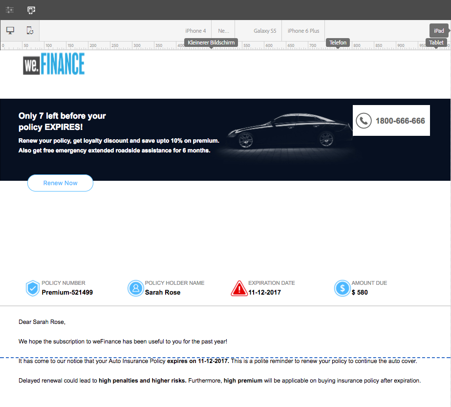

# Erstellen einer interaktiven Kommunikation{#create-an-interactive-communication}

## Überblick {#overview}

Mit der interaktiven Kommunikation lässt sich die Generierung, Zusammenstellung und Verteilung sicherer, personalisierter und interaktiver Schriftstücke zentralisieren und verwalten. Wenn Sie den Druck als Master-Kanal für das Web verwenden, können Sie die Aufwandsduplikation beim Erstellen der Webausgabe der interaktiven Kommunikation minimieren.

### Voraussetzungen {#prerequisites}

Die folgenden Voraussetzungen sind Voraussetzung für die Erstellung einer interaktiven Kommunikation:

* Richten Sie ein [Formulardatenmodell](/help/forms/using/data-integration.md) ein, das Testdaten oder eine tatsächliche Datenquelle enthält, z. B. eine Instanz von Microsoft® Dynamics.
* Stellen Sie sicher, dass Sie über die [Dokumentfragmente](/help/forms/using/document-fragments.md) verfügen.
* Stellen Sie sicher, dass Sie [Vorlagen für Druck- und Webkanal](/help/forms/using/web-channel-print-channel.md) haben.
* Stellen Sie sicher, dass Sie das erforderliche [Design](/help/forms/using/themes.md) für den Webkanal haben.

## Erstellen einer interaktiven Kommunikation {#createic}

1. Melden Sie sich bei Ihrer AEM-Autoreninstanz an und navigieren Sie zu **[!UICONTROL Adobe Experience Manager]** > **[!UICONTROL Formulare]** > **[!UICONTROL Formulare und Dokumente]**.
1. Tippen Sie auf **[!UICONTROL Erstellen]** und wählen Sie **[!UICONTROL Interaktive Kommunikation]** aus. Die Seite &quot;Interaktive Kommunikation erstellen&quot;wird angezeigt.

   

1. Geben Sie die folgenden Informationen ein. :

   * **[!UICONTROL Titel]**: Geben Sie den Titel der interaktiven Kommunikation ein.
   * **[!UICONTROL Name]**: Der Name der interaktiven Kommunikation wird aus dem eingegebenen Titel abgeleitet. Bearbeiten Sie ihn gegebenenfalls.
   * **[!UICONTROL Beschreibung]**: Geben Sie eine Beschreibung der interaktiven Kommunikation ein.
   * **[!UICONTROL Formulardatenmodell]**: Suchen Sie das Formulardatenmodell und wählen Sie es aus. Weitere Informationen zum Formulardatenmodell finden Sie unter [AEM Forms Data Integration](/help/forms/using/data-integration.md).

   * **[!UICONTROL Vorbefüllungsdienst]**: Wählen Sie den Vorbefüllungs-Dienst aus, um die Daten abzurufen und die interaktive Kommunikation vorab auszufüllen.
   * **[!UICONTROL Nachbearbeitungstyp]**: Sie können AEM oder Forms-Workflow auswählen, der beim Senden der interaktiven Kommunikation ausgelöst werden soll. Wählen Sie den Typ des auszulösenden Workflows aus.

   * **[!UICONTROL Nachbearbeitung]**: Wählen Sie den Namen des Workflows aus, der ausgelöst werden soll. Wenn Sie AEM Workflow auswählen, geben Sie Anlagenpfad, Layoutpfad, PDF-Pfad, Druckdatenpfad und Webdatenpfad an.
   * **[!UICONTROL Tags]**: Wählen Sie die Tags aus, die auf die interaktive Kommunikation angewendet werden sollen. Sie können auch einen neuen/benutzerdefinierten Tag-Namen eingeben und die Eingabetaste drücken, um ihn zu erstellen.
   * **[!UICONTROL Autor]**: Der Name des Autors wird automatisch aus dem Benutzernamen des angemeldeten Benutzers übernommen.
   * **[!UICONTROL Veröffentlichungsdatum:]** Geben Sie das Datum ein, an dem die interaktive Kommunikation veröffentlicht werden soll.
   * **[!UICONTROL Veröffentlichungsdatum rückgängig machen]**: Geben Sie das Datum ein, an dem die Veröffentlichung der interaktiven Kommunikation rückgängig gemacht werden soll.

1. Tippen Sie auf **[!UICONTROL Weiter]**. Der Bildschirm zur Angabe von Druck- und Webkanal-Details wird angezeigt.
1. Geben Sie Folgendes ein:

   * **[!UICONTROL Drucken]**: Wählen Sie diese Option, um den Druckkanal der interaktiven Kommunikation zu generieren.
   * **[!UICONTROL Druckvorlage]**: Suchen Sie nach einer XDP als Druckvorlage und wählen Sie sie aus.
   * **[!UICONTROL Web]**: Wählen Sie diese Option, um den Webkanal oder die responsive Ausgabe der interaktiven Kommunikation zu generieren.
   * **[!UICONTROL Webvorlage für interaktive Kommunikation]**: Wählen Sie die Webvorlage aus.
   * **** Design und Design  **[!UICONTROL auswählen]**: Suchen Sie das Design und wählen Sie es aus, um den Webkanal der interaktiven Kommunikation zu gestalten. Weitere Informationen finden Sie unter [Designs in AEM Forms](/help/forms/using/themes.md).

   * **[!UICONTROL Verwenden Sie Druck wie Übergeordnet für Webkanal]**: Wählen Sie diese Option, um den Webkanal synchron mit dem Druckkanal zu erstellen. Die Verwendung des Druckkanals als Master für den Webkanal stellt sicher, dass der Inhalt und die Datenbindung des Webkanals aus dem Druckkanal abgeleitet werden und dass die im Druckkanal vorgenommenen Änderungen im Webkanal widergespiegelt werden können, wenn Sie auf „Synchronisieren“ tippen. Die Autoren dürfen jedoch ggf. die Vererbung für bestimmte Komponenten im Webkanal aufheben. Weitere Informationen finden Sie unter [Synchronisieren des Webkanals mit dem Druckkanal](../../forms/using/create-interactive-communication.md#synchronize).
Wenn Sie die Option **[!UICONTROL Druck als Übergeordnet für Webkanal verwenden]** auswählen, können Sie einen der folgenden Modi auswählen, um den Webkanal zu generieren:

      * **[!UICONTROL Automatisches Layout]**: Wählen Sie diesen Modus aus, um automatisch Platzhalter, Inhalte und Datenbindung für den Webkanal aus dem Druckkanal zu generieren.
      * **[!UICONTROL Manuelles Organisieren]**: Wählen Sie diesen Modus aus, um die Elemente des Druckkanals manuell auszuwählen und dem Webkanal mithilfe des Übergeordneten Inhalts hinzuzufügen, der im  **[!UICONTROL Data]** Sourcestab verfügbar ist. Weitere Informationen finden Sie unter [Wählen Sie &quot;Print channel elements&quot;, um Webkanalinhalte zu erstellen](#selectprintchannelelements).

   Weitere Informationen zu Druckkanälen und Webkanälen finden Sie unter [Druckkanal und Webkanal](/help/forms/using/web-channel-print-channel.md).

1. Tippen Sie auf **[!UICONTROL Erstellen]**. Die interaktive Kommunikation wird erstellt und ein Warnhinweis wird angezeigt. Tippen Sie auf **[!UICONTROL Bearbeiten]**, um mit der Erstellung des Inhalts der interaktiven Kommunikation zu beginnen, wie unter [Hinzufügen von Inhalten mithilfe der Benutzeroberfläche zum Erstellen der interaktiven Kommunikation](#step2) beschrieben. Alternativ können Sie auf **[!UICONTROL Fertig]** tippen und die interaktive Kommunikation später bearbeiten.

## Fügen Sie der interaktiven Kommunikation Inhalte hinzu {#step2}

Nachdem Sie eine interaktive Kommunikation erstellt haben, können Sie die Authoring-Oberfläche für interaktive Kommunikation verwenden, um deren Inhalte zu erstellen.

Weitere Informationen zur Authoring-Oberfläche für interaktive Kommunikation finden Sie unter [Einführung in die Erstellung interaktiver Kommunikation](/help/forms/using/introduction-interactive-communication-authoring.md).

1. Die Authoring-Benutzeroberfläche für interaktive Kommunikation wird gestartet, wenn Sie auf Bearbeiten tippen, wie unter [Interaktive Kommunikation erstellen](#createic) beschrieben. Alternativ können Sie zu einem vorhandenen Asset für interaktive Kommunikation auf AEM navigieren, es auswählen und auf **[!UICONTROL Bearbeiten]** tippen, um die Authoring-Oberfläche für interaktive Kommunikation zu starten.

   Standardmäßig wird der Druckkanal der interaktiven Kommunikation angezeigt, es sei denn, die interaktive Kommunikation ist nur Web-Kanal. Der Druckkanal der interaktiven Kommunikation zeigt Zielbereiche an, wie in der ausgewählten XDP-/Druckkanalvorlage verfügbar. In diesen Zielbereichen und Feldern können Sie Komponenten oder Assets hinzufügen.

1. Wählen Sie bei ausgewähltem Druckkanal die Registerkarte **[!UICONTROL Komponenten]** aus. Folgende Komponenten sind im Druckkanal verfügbar:

   | **Komponente** | **Funktion** |
   |---|---|
   | Diagramm | Fügt ein Diagramm hinzu, das Sie in der interaktiven Kommunikation für die visuelle Darstellung zweidimensionaler Daten verwenden können, die aus einer Formulardatenmodellsammlung abgerufen werden. Weitere Informationen finden Sie unter [Verwenden von Diagrammen in interaktiver Kommunikation](/help/forms/using/chart-component-interactive-communications.md). |
   | Dokumentfragment | Ermöglicht das Hinzufügen einer wiederverwendbaren Komponente wie Text, Liste oder Bedingung zu einer interaktiven Kommunikation. Die hinzugefügte Komponente könnte entweder auf einem Formulardatenmodell basieren oder nicht. |
   | Bild | Ermöglicht es Ihnen, ein Bild einzufügen. |

   Ziehen Sie die Komponenten per Drag-and-Drop in Ihre interaktive Kommunikation und konfigurieren Sie sie nach Bedarf.

   Sie können auch die Vorgänge &quot;Rückgängig&quot;und &quot;Wiederholen&quot;beim Erstellen einer interaktiven Kommunikation sowohl für Druck- als auch Webkanäle verwenden.

   Verwenden Sie den Vorgang &quot;Rückgängig&quot;, um die zuletzt ausgeführte Aktion zu verwerfen, und den Vorgang &quot;Wiederholen&quot;, um die verworfene Aktion erneut einzubinden. Wenn Sie beispielsweise ein Bild eingefügt oder eine Datenbindung in eine interaktive Kommunikation erstellt haben und dieses verwerfen müssen, verwenden Sie den Vorgang &quot;Rückgängig&quot;.

   

   Die Optionen &quot;Rückgängig&quot;und &quot;Wiederholen&quot;werden in der Seitensymbolleiste der Authoring-Benutzeroberfläche angezeigt. Die Option &quot;Rückgängig&quot;wird erst nach Durchführung einer Aktion angezeigt. Die Option &quot;Wiederholen&quot;wird nur nach Durchführung eines Rückgängig-Vorgangs in der Seitensymbolleiste angezeigt. Diese Aktionen werden beim Aktualisieren der Seite zurückgesetzt.

1. Wenn der Druckkanal ausgewählt ist, wechseln Sie zur Registerkarte **[!UICONTROL Assets]** und wenden Sie den Filter an, um nur die Assets anzuzeigen, die Sie sehen möchten.

   Mithilfe des Assets-Browsers können Sie Assets auch direkt in Zielbereiche der interaktiven Kommunikation ziehen.

   

1. Ziehen Sie die Dokumentfragmente per Drag-and-Drop in die interaktive Kommunikation. Im Folgenden sind die Arten von Dokumentfragmenten aufgeführt, die Sie im Druckkanal der interaktiven Kommunikation verwenden können.

<table>
 <tbody>
  <tr>
   <td><strong>Dokumentfragmenttyp</strong></td>
   <td><strong>Beispielzweck</strong></td>
  </tr>
  <tr>
   <td><a href="/help/forms/using/texts-interactive-communications.md" target="_blank">Text</a></td>
   <td>Text zum Hinzufügen der Adresse, der E-Mail-Adresse des Empfängers und des Nachrichtentexts des Briefs </td>
  </tr>
  <tr>
   <td><a href="/help/forms/using/conditions-interactive-communications.md" target="_blank">Bedingung</a></td>
   <td>Bedingung, um das entsprechende Kopfzeilenbild zur Kommunikation basierend auf dem Typ der Richtlinie hinzuzufügen: Standard oder Premium. <br /> </td>
  </tr>
  <tr>
   <td>Liste</td>
   <td>Gruppe von Dokumentfragmenten, einschließlich Text, Bedingungen, anderen Listen und Bildern. <br /> </td>
  </tr>
 </tbody>
</table>

Sie können die Bindung zwischen einem Zielbereich und einem Dokumentfragment auch ersetzen, indem Sie das neue Fragment mithilfe der Registerkarte **[!UICONTROL Assets]** im Zielbereich ablegen. Die blaue Farbschattierung des Zielbereichs beim Ziehen des Fragments zeigt an, dass das Dokumentfragment in den Zielbereich abgelegt werden kann.

Weitere Informationen zu Dokumentfragmenten finden Sie unter [Dokumentfragmente](/help/forms/using/document-fragments.md).

Die Authoring-Oberfläche ermöglicht es Ihnen, in einer interaktiven Kommunikation zwischen ungebundenen und gebundenen Feldern und Variablen zu unterscheiden. In der Benutzeroberfläche werden die ungebundenen Felder und Variablen mit einem orangefarbenen Rahmen hervorgehoben.


Wenn Sie den Mauszeiger über diese Elemente bewegen, wird außerdem eine QuickInfo mit der Meldung Feld (Ungebunden) oder Variable (Ungebunden) angezeigt.

Eine in einem Dokumentfragment verwendete ungebundene Variable wird in der Authoring-Oberfläche manchmal nicht angezeigt. Dies kann durch eine Inline-Textregel in einem Dokumentfragment oder im Fall eines Bedingungsfragments geschehen. In solchen Fällen wird eine in Blau hervorgehobene QuickInfo als Teil des Dokumentfragments angezeigt. Die QuickInfo zeigt die Anzahl der ungebundenen Variablen an, die in einem Dokumentfragment verwendet werden.


Tippen Sie auf das Dokumentfragment, tippen Sie auf  (Konfigurieren) und dann im Sidekick der interaktiven Kommunikation auf **[!UICONTROL Eigenschaften]** . Im Abschnitt **[!UICONTROL Variablen und Datenmodellobjekte]** werden die Variablen aufgelistet, einschließlich der ausgeblendeten Variablen und Datenmodellobjekte, die in den Dokumentfragmenten verwendet werden. Verwenden Sie das Symbol  (Bearbeiten) neben jedem Datenmodellobjekt oder jeder Variablen, um die Eigenschaften zu bearbeiten.

1. Um die Bindung von Variablen einzurichten, tippen Sie auf eine Variable, wählen Sie  (Konfigurieren) und richten Sie dann die Bindungseigenschaften im Bereich Eigenschaften in der Seitenleiste ein.

   * **Keine:** Agent füllt hier den Wert für die Variable aus.
   * **Textfragment**: Wenn ausgewählt, können Sie ein Textdokumentfragment durchsuchen und auswählen, dessen Inhalt in dem Feld gerendert wird. Nur die Textdokumentfragmente können an Variablen gebunden werden, die keine Variablen enthalten.
   * **Datenmodellobjekt**: Wählen Sie eine Formulardatenmodell-Eigenschaft aus, deren Wert in das Feld gefüllt wird.
   * **Standardwert:** Sie können mithilfe dieses Felds einen Standardwert für die Variable definieren. Der Wert wird angezeigt, wenn Sie die interaktive Kommunikation oder die Benutzeroberfläche für Agenten in der Vorschau anzeigen.
   * **Anzeigemuster:** Sie können auch ein Anzeigeformat für eine Variable definieren. Wählen Sie eine der vordefinierten Optionen aus der Dropdownliste **Typ** aus, um ein Anzeigeformat auf eine Variable anzuwenden. Wählen Sie **Benutzerdefiniert** aus, um ein Anzeigemuster zu definieren, das nicht in der Liste verfügbar ist. Weitere Informationen finden Sie unter [Datenanzeigemuster](../../forms/using/create-interactive-communication.md#datadisplaypatterns).

   Navigieren Sie zu [Variablen und Datenmodellobjekte](../../forms/using/create-interactive-communication.md#hiddenvariables) , um die Bindung der ausgeblendeten Variablen im Dokumentfragment einzurichten.

   Sie können auch Datenquellenelemente oder Textdokumentfragmente per Drag &amp; Drop verschieben, um die Bindung von Variablen einzurichten.  Um eine Bindung mit einem der Datenquellenelemente zu erstellen, wählen Sie die Registerkarte **Data Sources** aus und ziehen Sie das Element in den Variablennamen. Das Datenquellenelement und die Variable müssen vom gleichen Typ sein, damit die Bindung erfolgreich eingerichtet werden kann. Wenn Sie ein Datenquellenelement per Drag-and-Drop in eine bereits gebundene Variable ziehen, ersetzt das neue Element das vorherige, um eine neue Bindung mit der Variablen zu erstellen. Wählen Sie auf ähnliche Weise die Registerkarte **Assets** aus und ziehen Sie das Textdokumentfragment in den Variablennamen, um die Bindung zwischen ihnen einzurichten. Das Textdokumentfragment darf keine Variablen enthalten.

1. Um eine Tabelle hinzuzufügen, verwenden Sie bei ausgewähltem Druckkanal auf der Registerkarte **[!UICONTROL Assets]** den Filter, um nur die Layout-Fragmente anzuzeigen. Ziehen Sie das gewünschte Layoutfragment per Drag-and-Drop in die interaktive Kommunikation. Ein Layout-Fragment basiert auf einer XDP und kann verwendet werden, um grafische Layouts oder statische und dynamische Tabellen in der interaktiven Kommunikation zu erstellen, die mit dynamischen Daten gefüllt werden.

   Beispiel: Eine Layout-Tabelle zur Anzeige von Bruttoprämie, Treuerabatt % und Notfall-Pannenhilfe für alte und neue Richtlinien.

   Weitere Informationen zu Layout-Fragmenten finden Sie unter [Dokumentfragmente](/help/forms/using/document-fragments.md).

1. Verwenden Sie bei ausgewähltem Druckkanal auf der Registerkarte **[!UICONTROL Assets]** den Filter, um Bilder anzuzeigen. Ziehen Sie die erforderlichen Bilder per Drag-and-Drop in die interaktive Kommunikation, z. B. für das Firmenlogo.

   Verwalten Sie außerdem Folgendes in der interaktiven Kommunikation:

   * [Hinzufügen und Konfigurieren von Diagrammen](/help/forms/using/chart-component-interactive-communications.md)
   * [Synchronisieren des Webkanals mit dem Druckkanal](../../forms/using/create-interactive-communication.md#synchronize)

      * Autom. Synchronisierung
      * Vererbung abbrechen
      * Vererbung erneut aktivieren
      * Synchronisieren
   * [Anlagen und Bibliothekszugriff](../../forms/using/create-interactive-communication.md#attachmentslibrary)
   * [XDP-/Layout-Feldeigenschaften](../../forms/using/create-interactive-communication.md#xdplayoutfieldproperties)
   * [Fügen Sie Regeln zu Komponenten hinzu](../../forms/using/create-interactive-communication.md#rules)


1. Wechseln Sie zu **[!UICONTROL Webkanal]**. Der Webkanal wird im Editor für interaktive Kommunikation angezeigt. Wenn Sie zum ersten Mal vom Druckkanal zum Webkanal wechseln, erfolgt die automatische Synchronisierung. Weitere Informationen finden Sie unter [Synchronisieren des Webkanals vom Druckkanal](../../forms/using/create-interactive-communication.md#synchronize).

   Da wir in diesem Beispiel Druck als Master für das Web verwenden, werden die Platzhalter, der Inhalt und die Datenbindung des Druckkanals mit dem Webkanal synchronisiert. Sie können jedoch den spezifischen Inhalt im Webkanal ändern und anpassen. [Die ](#cancelinheritance) Vererbung für die Zielbereiche und Variablen abbrechen, die mithilfe des Druckkanals generiert wurden, um Inhalte anpassen zu können.

   

   Tippen Sie auf das Dokumentfragment, tippen Sie auf  (Konfigurieren) und dann im Sidekick der interaktiven Kommunikation auf **[!UICONTROL Eigenschaften]** . Im Abschnitt **[!UICONTROL Variablen und Datenmodellobjekte]** werden die Variablen aufgelistet, einschließlich der ausgeblendeten Variablen und Datenmodellobjekte, die in den Dokumentfragmenten verwendet werden. Verwenden Sie das Symbol  (Bearbeiten) neben jedem Datenmodellobjekt oder jeder Variablen, um die Eigenschaften zu bearbeiten. Darüber hinaus verwenden Sie für Dokumentfragmente, die im Webkanal mithilfe des Druckkanals [automatisch generiert](#synchronize) wurden, das Symbol  (Vererbung abbrechen) neben jedem Datenmodellobjekt und jeder Variablen zu [Vererbung abbrechen](#cancelinheritance) und können sie bearbeiten.

1. Um weitere Komponenten im Webkanal hinzuzufügen, tippen Sie bei dem ausgewählten Webkanal auf **[!UICONTROL Komponenten]**. Ziehen Sie Komponenten per Drag-and-Drop in den Webkanal Ihrer interaktiven Kommunikation und fahren Sie mit der Konfiguration fort.

   | Komponenten  | Funktion |
   |---|---|
   | Diagramm | Fügt ein Diagramm hinzu, das Sie in der interaktiven Kommunikation für die visuelle Darstellung zweidimensionaler Daten verwenden können, die aus einer Formulardatenmodellsammlung abgerufen werden. Weitere Informationen finden Sie unter [Verwenden der Diagrammkomponente](../../forms/using/chart-component-interactive-communications.md). |
   | Dokumentfragment | Ermöglicht das Hinzufügen einer wiederverwendbaren Komponente, eines Texts, einer Liste oder einer Bedingung zu einer interaktiven Kommunikation. Die wiederverwendbare Komponente, die Sie einer interaktiven Kommunikation hinzufügen, kann entweder auf einem Formulardatenmodell oder ohne Formulardatenmodell basieren. |
   | Bild | Ermöglicht es Ihnen, ein Bild einzufügen. |
   | Fenster | Ermöglicht das Hinzufügen eines [Panels](../../forms/using/create-interactive-communication.md#add-panel-component-to-the-web-channel) zur interaktiven Kommunikation. |
   | Tabelle | Fügt eine Tabelle hinzu, mit der Sie Daten in Zeilen und Spalten organisieren können. |
   | Zielbereich | Fügt einen Zielbereich in einen Webkanal ein, um die webkanalspezifischen Komponenten zu organisieren. Zielbereich ist ein einfacher Container, in dem Sie webkanalspezifische Komponenten gruppieren können. |
   | Text | Fügt dem Webkanal einer interaktiven Kommunikation Rich Text hinzu. Text kann auch Formulardatenmodellobjekte verwenden, um den Inhalt dynamisch zu gestalten. |
   | Schaltfläche | Ermöglicht das Hinzufügen einer [Schaltfläche](../../forms/using/create-interactive-communication.md#add-button-component-to-the-web-channel) zur interaktiven Kommunikation. Sie können die Komponente Schaltfläche verwenden, um zu anderen interaktiven Kommunikationen, adaptiven Formularen, anderen Assets wie Bildern oder Dokumentfragmenten oder einer externen URL zu navigieren. |
   | Trennzeichen | Ermöglicht das Einfügen einer horizontalen Linie in eine interaktive Kommunikation. Verwenden Sie diese Komponente, um zwischen Abschnitten in einer Korrespondenz zu unterscheiden. Beispielsweise können Sie mit der Trennzeichenkomponente zwischen den Abschnitten &quot;Kundendetails&quot;und &quot;Kreditkartendetails&quot;in einem Kreditkartenauszug unterscheiden. |

1. Fügen Sie nach Bedarf Assets in Ihren Webkanal ein.

   Sie können [Ihre interaktive Kommunikation in der Vorschau anzeigen](#previewic), um zu sehen, wie die Druck- und Webausgaben der interaktiven Kommunikation aussehen, und nach Bedarf weitere Änderungen vornehmen.

## Interaktive Kommunikation in der Vorschau anzeigen {#previewic}

Sie können die **Vorschauoption** verwenden, um das Erscheinungsbild der interaktiven Kommunikation zu bewerten. Der Webkanal der interaktiven Kommunikation bietet außerdem eine Option zum Emulieren des Erlebnisses einer interaktiven Kommunikation für verschiedene Geräte. Beispiel: iPhone, iPad und Desktop. Sie können die Optionen **Vorschau** und **Emulator**  gemeinsam verwenden, um die Webausgaben für Geräte mit unterschiedlichen Bildschirmgrößen in der Vorschau anzuzeigen. Die Beispieldaten in der Vorschau werden aus dem angegebenen Formulardatenmodell gefüllt.

1. Wählen Sie den (Druck- oder Web-)Kanal aus, um eine Vorschau anzuzeigen und auf die Vorschau zu tippen. Die interaktive Kommunikation wird angezeigt.

   >[!NOTE]
   >
   >Die Vorschau wird mit den Beispieldaten des Formulardatenmodells befüllt. Weitere Informationen zur Vorschau der interaktiven Kommunikation mit anderen Daten oder zur Verwendung des Vorbefüllungs-Dienstes finden Sie unter [Verwenden des Formulardatenmodells](/help/forms/using/using-form-data-model.md) und [Arbeiten mit dem Formulardatenmodell](/help/forms/using/work-with-form-data-model.md).

1. Verwenden Sie für den Webkanal , um zu sehen, wie die interaktive Kommunikation auf verschiedenen Geräten aussieht.

   

Außerdem können Sie [Interaktive Kommunikation mithilfe der Benutzeroberfläche für Agenten](/help/forms/using/prepare-send-interactive-communication.md) vorbereiten und senden.

## Eigenschaften in interaktiver Kommunikation konfigurieren {#configure-properties-in-interactive-communication}

### Anlagen und Bibliothekszugriff {#attachmentslibrary}

Im Druckkanal können Sie die Anhänge und den Bibliothekszugriff so konfigurieren, dass der Agent Anlagen in der Benutzeroberfläche für Agenten für die interaktive Kommunikation verwalten kann:

1. Markieren Sie im Druckkanal den Dokumentcontainer und tippen Sie auf **Eigenschaften**.

   

   Der Bereich „Eigenschaften“ wird in der Seitenleiste angezeigt.

   

1. Erweitern Sie **Anlagen** und geben Sie folgende Eigenschaften an:

   * **[!UICONTROL Bibliothekszugriff zulassen]**: Wählen Sie diese Option, um den Bibliothekszugriff für den Agenten in der Benutzeroberfläche für Agenten zu aktivieren. Wenn diese Option aktiviert ist, kann der Agent während der Vorbereitung der interaktiven Kommunikation Dateien aus der Bibliothek hinzufügen.
   * **[!UICONTROL Neuanordnung von Anlagen zulassen]**: Wählen Sie diese Option, damit der Agent die Anlagen mit der interaktiven Kommunikation neu ordnen kann.
   * **[!UICONTROL Maximale Anzahl der zulässigen Anlagen]**: Geben Sie die maximale Anzahl der Anhänge an, die mit der interaktiven Kommunikation zulässig sind.
   * **[!UICONTROL Anzuhängende]** Dateien: Tippen Sie auf  **** Hinzufügen , wählen Sie die anzuhängenden Dateien aus und geben Sie Folgendes an:

      * **[!UICONTROL Diese Datei standardmäßig an das Dokument anhängen]**: Sie können diese Option ändern, wenn nur der Anhang nicht zwingend ist.
      * **[!UICONTROL Obligatorisch:]** Der Agent kann den Anhang nicht in der Benutzeroberfläche für Agenten entfernen.

   

1. Tippen Sie auf **[!UICONTROL Fertig]**.

### XDP-/Layout-Feldeigenschaften {#xdplayoutfieldproperties}

1. Bewegen Sie beim Bearbeiten des Druckkanals einer interaktiven Kommunikation den Mauszeiger über ein Feld, das in der Druckkanalvorlage erstellt ist, und wählen Sie  (Konfigurieren).

   Das Dialogfeld „Eigenschaften“ wird in der Seitenleiste angezeigt.

   

1. Geben Sie Folgendes an:

   * **[!UICONTROL Name]**: JCR Knotenname.
   * **[!UICONTROL Titel]**: Geben Sie einen Titel ein, der für den Agenten in der Benutzeroberfläche für Agenten und in der Struktur des Dokumentcontainers sichtbar ist.
   * **[!UICONTROL Bindungstyp]**: Wählen Sie einen der folgenden Bindungstypen für das Feld aus.

      * Keine: Agent füllt den Wert für die Eigenschaft aus.
      * Textfragment: Wenn ausgewählt, können Sie ein Textdokumentfragment durchsuchen und auswählen, dessen Inhalt in dem Feld gerendert wird. Alternativ können Sie das Textdokumentfragment per Drag-and-Drop in den Feldnamen ziehen, um die Bindung zwischen ihnen einzurichten. Das Textdokumentfragment darf keine Variablen enthalten.
      * Datenmodellobjekt: Wählen Sie eine Formulardatenmodell-Eigenschaft aus, deren Wert in das Feld gefüllt wird. Alternativ können Sie die Registerkarte **Data Sources** auswählen und die Eigenschaft per Drag-and-Drop in das Feld ziehen.
   * **[!UICONTROL Standardwerte]**: Der Standardwert stellt sicher, dass das Feld nicht leer ist, wenn vom angegebenen Datenmodellobjekt oder Textfragment kein Wert bereitgestellt wird. Wenn der Datenbindungstyp „Keine“ ist, wird der Standardwert im Feld vorbefüllt.
   * **[!UICONTROL Anzeigemuster]**: Sie können auch ein Anzeigeformat für ein Feld definieren. Wählen Sie eine der vordefinierten Optionen aus der Dropdownliste **Typ** aus, um ein Anzeigeformat auf ein Feld anzuwenden. Wählen Sie **Benutzerdefiniert** aus, um ein Anzeigemuster zu definieren, das nicht in der Liste verfügbar ist. Weitere Informationen finden Sie unter [Datenanzeigemuster](../../forms/using/create-interactive-communication.md#datadisplaypatterns)

   * **[!UICONTROL Bearbeitbar nach Agent]**: Wählen Sie diese Option aus, damit der Agent den Wert in dem Feld in der Benutzeroberfläche für Agenten bearbeiten kann. Diese Einstellung ist nicht anwendbar, wenn der Bindungstyp „Textfragment“ ist.
   * **[!UICONTROL Beschriftung:]** Geben Sie eine Textzeichenfolge ein, die in dem Feld in der Benutzeroberfläche für Agenten angezeigt wird. Diese Einstellung ist nicht anwendbar, wenn der Bindungstyp „Textfragment“ ist.
   * **[!UICONTROL QuickInfo]**: Geben Sie eine Textzeichenfolge ein, die beim Bewegen der Maus über den Agenten in der Benutzeroberfläche für Agenten sichtbar ist. Diese Einstellung ist nicht anwendbar, wenn der Bindungstyp „Textfragment“ ist.
   * **[!UICONTROL Erforderlich:]** Wählen Sie diese Option, um das Feld zu einem Pflichtfeld für den Agenten zu machen. Diese Einstellung ist nicht anwendbar, wenn der Bindungstyp „Textfragment“ ist.
   * **[!UICONTROL Mehrere Zeilen zulassen]**: Wählen Sie dieses Feld aus, um mehrere Textzeilen als Eingabe in das Feld zuzulassen. Diese Einstellung ist nicht anwendbar, wenn der Bindungstyp „Textfragment“ ist.


1. Tippen Sie auf .

### Datenanzeigemuster {#datadisplaypatterns}

Über die Authoring-Oberfläche können Sie Anzeigemuster für Daten für Felder, Variablen und Formulardatenmodellelemente definieren, die beim Erstellen einer interaktiven Kommunikation für Druck- und Webkanäle verfügbar sind.

Um das Datenanzeigemuster zu konfigurieren, tippen Sie auf das Element, wählen Sie  (Konfigurieren) und richten Sie das Anzeigemuster im Bereich **[!UICONTROL Eigenschaften]** in der Seitenleiste ein. Wählen Sie eine vordefinierte Option aus der Dropdownliste **[!UICONTROL Typ]** aus, um das mit dem ausgewählten Typ verknüpfte Muster anzuzeigen. Wählen Sie **[!UICONTROL Benutzerdefiniert]** aus der Dropdownliste **[!UICONTROL Typ]** aus, um ein Muster zu definieren, das nicht in der Liste verfügbar ist. Durch die Bearbeitung von Werten im Feld **[!UICONTROL Muster]** wird der Typ automatisch in **[!UICONTROL Benutzerdefiniert]** geändert.

Um das Anzeigemuster anzuwenden, muss die Anzahl der im Feld &quot;Muster&quot;definierten Zeichen oder Ziffern mit den Zeichen oder Ziffern übereinstimmen oder diese überschreiten, die im Wert für Felder, Variablen und Formulardatenmodellelemente definiert sind. Weitere Informationen finden Sie unter [example](../../forms/using/create-interactive-communication.md#greaternumberofdigits).


Sie können das Anzeigemuster für ein Feld, eine Variable oder ein Formulardatenmodellelement neu definieren, nachdem Sie Webinhalte aus dem Druckkanal generiert haben. Daher können für ein Element unterschiedliche Anzeigemuster für Druck- und Webkanäle definiert sein. Wenn Sie kein Anzeigemuster für ein Element im Druckkanal definieren und Webinhalte mithilfe des Druckkanals automatisch generieren, definiert die für das Element im Druckkanal definierte Datenbindung die in der Dropdown-Liste **[!UICONTROL Typ]** verfügbaren Anzeigemusteroptionen. Wenn für das Element keine Bindung definiert ist, definiert der Datentyp des Elements die verfügbaren Anzeigemuster-Optionen. Wenn Sie beispielsweise eine Datenbindung vom Typ Zahl für ein Element im Druckkanal erstellen, sind die in der Dropdown-Liste **[!UICONTROL Typ]** verfügbaren Anzeigemuster-Optionen vom Typ Zahl in verschiedenen Formaten.

Wechseln Sie zum Modus **Vorschau** oder öffnen Sie die Benutzeroberfläche für Agenten , um das auf diese Elemente angewendete Anzeigemuster anzuzeigen.

In der folgenden Tabelle finden Sie ein Beispiel für die Werte, die durch Festlegen des Datenanzeigemusters für eine Variable angezeigt werden:

| Typ | Standardwert | Anzeigemuster | Anzeigewert | Beschreibung |
|---|---|---|---|---|
| Sozialversicherungsnummer | 123456789 | text{999-99-9999} | 123-45-6789 | Die Anzahl der Ziffern im Feld Standardwert entspricht der Anzahl der Ziffern im Feld Muster . Der auf dem Muster basierende Wert wird erfolgreich angezeigt. |
| Sozialversicherungsnummer | 1234567 | text{999-99-9999} | 1-23-4567 | Die Anzahl der Ziffern im Feld Standardwert ist kleiner als die Anzahl der Ziffern im Feld Muster . Das Muster gilt für die 7 verfügbaren Stellen. |
| Sozialversicherungsnummer | 1234567890 | text{999-99-9999} | 1234567890 | Die Anzahl der Ziffern im Feld Standardwert ist größer als die Anzahl der Ziffern im Feld Muster . Daher ändert sich der Anzeigewert nicht. |

Wenn kein Anzeigemuster für eine Variable oder ein Formulardatenmodellelement angegeben ist, wird standardmäßig die [globale Dokumentfragmentkonfiguration](https://helpx.adobe.com//experience-manager/6-5/forms/using/interactive-communication-configuration-properties.html) verwendet.

Wenn Sie kein Anzeigemuster auf eine Variable des Datentyps Zahl anwenden, zeigt die Druckvorschau das Muster entsprechend der Konfiguration des globalen Dokumentfragments an. Wenn Sie Änderungen auf die standardmäßige Konfiguration globaler Dokumentfragmente anwenden, zeigt die Benutzeroberfläche für Agenten das Muster weiterhin entsprechend den für das Gebietsschema definierten Standardtrennzeichen an.

Gleichermaßen wird bei Feldern, bei denen kein Anzeigemuster angegeben ist, das beim Erstellen der Druckvorlage (XDP) definierte Muster auf das Feld angewendet. Wenn beim Erstellen der Druckvorlage kein Muster vorhanden ist, werden die Standardmuster, die auf XFA-Spezifikationen basieren, auf die Felder angewendet.

Wenn das angegebene Anzeigemuster falsch ist oder nicht angewendet werden kann, werden die Standardmuster, die auf XFA-Spezifikationen basieren, auf die Felder, Variablen oder Formulardatenmodellelemente angewendet.

## Regeln auf interaktive Kommunikationskomponenten anwenden {#rules}

Um Komponenten oder Inhalte in der interaktiven Kommunikation mit Bedingungen zu versehen, tippen Sie auf die Komponente/das Inhaltselement und wählen Sie  (Regel erstellen), um den Regel-Editor zu starten.

Weitere Informationen finden Sie unter:

* [Regeleditor](/help/forms/using/rule-editor.md)
* [Einführung in das Authoring interaktiver Kommunikation](/help/forms/using/introduction-interactive-communication-authoring.md)

## Tabellen verwenden {#tables}

### Dynamische Tabellen in interaktiver Kommunikation {#dynamic-tables-in-interactive-communication}

Sie können dynamische Tabellen in der interaktiven Kommunikation mithilfe von Layout-Fragmenten hinzufügen. In den folgenden Schritten wird anhand eines Beispiels einer Kreditkartenabrechnung die Verwendung eines Layout-Fragments zum Erstellen einer dynamischen Tabelle in einer interaktiven Kommunikation veranschaulicht.

1. Stellen Sie sicher, dass das erforderliche Layout-Fragment zum Erstellen der Tabelle in AEM verfügbar ist.
1. Ziehen Sie im Druckkanal Ihrer interaktiven Kommunikation ein Layout-Fragment (mit einer mehrspaltigen Tabelle) aus dem Asset-Browser in einen Zielbereich.

   

   Eine Tabelle wird im Layout-Bereich der interaktiven Kommunikation angezeigt.

   

1. Geben Sie die Datenbindung für jede Zelle der Tabelle an. Um eine wiederholbare Zeile zu erstellen, fügen Sie die Eigenschaften des Formulardatenmodells in die Zeile ein, die zu einer gemeinsamen Sammlungseigenschaft gehört.

   1. Tippen Sie auf eine Zelle in der Tabelle und wählen Sie  (Konfigurieren).

      Das Dialogfeld „Eigenschaften“ wird in der Seitenleiste angezeigt.

      

   1. Konfigurieren Sie die Eigenschaften:

      * **[!UICONTROL Name]**: JCR Knotenname.
      * **[!UICONTROL Titel]**: Geben Sie einen Titel ein, der im Editor für interaktive Kommunikation sichtbar ist.
      * **[!UICONTROL Bindungstyp]**: Wählen Sie einen der folgenden Bindungstypen für das Feld aus.

         * **[!UICONTROL Kein]**
         * **[!UICONTROL Datenmodellobjekt]**: Der Wert einer Formulardatenmodelleigenschaft wird in das Feld eingefügt. Alternativ können Sie die Registerkarte **Data Sources** auswählen und die Eigenschaft per Drag-and-Drop in das Feld ziehen.
      * **[!UICONTROL Datenmodellobjekt]**: Die Eigenschaft des Formulardatenmodells, deren Wert in das Feld eingefügt wird.
      * **[!UICONTROL Standardwert]**: Der Standardwert stellt sicher, dass das Feld nicht leer ist, wenn vom angegebenen Datenmodellobjekt kein Wert bereitgestellt wird. Der Standardwert wird im Feld vorbefüllt.

      * **[!UICONTROL Bearbeitbar nach Agent]**: Wählen Sie diese Option aus, damit der Agent den Wert in dem Feld in der Benutzeroberfläche für Agenten bearbeiten kann.
   1. Tippen Sie auf .


1. Zeigen Sie eine Vorschau der interaktiven Kommunikation an, um die mit den Daten gerenderte Tabelle anzuzeigen.

   

### Nur Webkanal-Tabellen {#webchanneltables}

Tippen Sie auf das Stammbedienfeld in der Webvorlage und tippen Sie auf **+**, um der interaktiven Kommunikation eine Komponente **Tabelle** hinzuzufügen. Eine Tabelle mit zwei Zeilen wird in die interaktive Kommunikation eingefügt. Die erste Zeile der Tabelle stellt die Tabellenüberschrift dar.

#### Zeilen und Spalten zur Tabelle hinzufügen {#addrowscolumnstable}

**So fügen Sie Spalten hinzu oder löschen sie:**

1. Tippen Sie auf das Standardtextfeld in der Tabellenüberschriftenzeile, um die Komponenten-Symbolleiste anzuzeigen.
1. Wählen Sie **Spalte hinzufügen** oder **Spalte löschen** aus, um Tabellenspalten hinzuzufügen bzw. zu löschen.


**So fügen Sie Zeilen hinzu oder löschen diese:**

1. Tippen Sie auf eine der Tabellenzeilen, um die Komponenten-Symbolleiste anzuzeigen. Sie können Tabellenzeilen auch über den Inhaltsbrowser im Sidekick der interaktiven Kommunikation auswählen.
1. Wählen Sie **Zeile hinzufügen** oder **Zeile löschen** aus, um Tabellenzeilen hinzuzufügen bzw. zu löschen. Verwenden Sie die in der Symbolleiste verfügbaren Optionen **Nach oben** und **Nach unten**, um die Zeilen in der Tabelle neu anzuordnen.


**A.** Zeile hinzufügen  **B.** Zeile löschen  **C.** Nach oben  **D verschieben.** Nach unten

#### Text in Tabellenzellen hinzufügen oder bearbeiten {#addedittexttable}

1. Wählen Sie das Standardtextfeld in der Tabellenzelle aus und tippen Sie auf  (Bearbeiten).
1. Geben Sie den Text in die Tabellenzelle ein und tippen Sie auf , um ihn zu speichern.

#### Erstellen von Bindungen zwischen Tabellenzellen und Datenmodellobjektelementen {#createbindingtablecells}

1. Wählen Sie das standardmäßige Textfeld in der Tabellenzeile aus und tippen Sie auf  (Bearbeiten).
1. Tippen Sie auf die Dropdownliste Datenmodellobjekte und wählen Sie die Eigenschaft aus.
1. Tippen Sie auf , um eine Bindung zwischen der Tabellenzelle und der Datenmodellobjekteigenschaft zu speichern und zu erstellen.


#### Erstellen eines Hyperlinks für Text in der Tabellenzelle {#createhyperlinktable}

1. Wählen Sie das Standardtextfeld in der Tabellenzelle aus und tippen Sie auf  (Bearbeiten).
1. Wählen Sie den Text in der Tabellenzelle aus und tippen Sie auf das Symbol Hyperlink .
1. Geben Sie die URL im Feld **Pfad** an.
1. Tippen Sie auf , um die Hyperlink-Eigenschaften zu speichern.


#### Dynamische Tabellen erstellen {#createdynamictables}

Sie können eine dynamische Tabelle nur für Webkanäle in einer interaktiven Kommunikation erstellen, indem Sie eine Datenmodelleigenschaft vom Typ Sammlung verwenden. Eine solche Tabelle ist eine Darstellung der untergeordneten Eigenschaften einer Sammlungseigenschaft. Sie können nur die Formatierungseigenschaften der verschiedenen Zellen in der Tabelle bearbeiten.

1. Wechseln Sie zum Webkanal und wählen Sie dann die Anzeige des Data Sources-Browsers aus.
1. Ziehen Sie ein Sammlungseigenschaft in ein Teilformular. Eine Tabelle wird im Teilformular erstellt.
1. Zeigen Sie die Tabelle in der Webvorschau der interaktiven Kommunikation in der Vorschau an.

#### Sortieren von Spalten in einer Tabelle {#sortcolumns}

Sie können Daten basierend auf einer beliebigen Spalte in einer Tabelle in der interaktiven Kommunikation sortieren. Die Werte in der Spalte können in auf- oder absteigender Reihenfolge sortiert werden.

Die Sortierung kann auf Tabellenspalten mit folgenden Elementen angewendet werden:

* Statischer Text
* Eigenschaften von Datenmodellobjekten
* Kombination von statischen Text- und Datenmodellobjekteigenschaften

So aktivieren Sie die Sortierung:

1. Wählen Sie die Tabelle aus und tippen Sie auf  (Konfigurieren). Sie können die Tabelle auch mithilfe des Browsers **Content** im Sidekick der interaktiven Kommunikation auswählen.
1. Wählen Sie **Sortierung aktivieren.**
1. Tippen Sie auf  , um die Tabelleneigenschaften zu speichern. Die Sortierungssymbole (Pfeile nach oben und unten) in Spaltenüberschriften zeigen, dass die Sortierung aktiviert wurde.

   

1. Wechseln Sie zum Modus **Vorschau** , um die Ausgabe anzuzeigen. Die Tabelle wird automatisch nach der ersten Spalte der Tabelle sortiert.
1. Klicken Sie auf die Spaltenüberschrift, um die Werte anhand der Spalte zu sortieren.

   Eine Spaltenüberschrift mit einem Pfeil nach oben stellt Folgendes dar:

   * -Tabelle anhand dieser Spalte sortiert.
   * -Werte in der Spalte werden in aufsteigender Reihenfolge angezeigt.

   

   Gleichermaßen bedeutet eine Spaltenüberschrift mit einem Abwärtspfeil, dass die Werte in der Spalte in absteigender Reihenfolge angezeigt werden.

## Eigenschaften der interaktiven Kommunikation bearbeiten {#edit-interactive-communication-properties}

Nachdem Sie eine interaktive Kommunikation erstellt haben, können Sie deren Eigenschaften zu einem späteren Zeitpunkt bearbeiten.

Verwenden Sie die Seite **Properties** , um:

* Bearbeiten Sie Werte für die Felder, die beim Erstellen der interaktiven Kommunikation angegeben wurden, z. B. Titel und Beschreibung.
* Fügen Sie einen Webkanal für eine vorhandene interaktive Kommunikation hinzu oder löschen Sie ihn.
* Anzeigen einer Vorschau, Herunterladen oder Löschen der interaktiven Kommunikation
* Öffnen Sie die [Benutzeroberfläche für Agenten](/help/forms/using/prepare-send-interactive-communication.md).

So greifen Sie auf die Seite **Properties** zu:

1. Melden Sie sich bei Ihrer AEM-Autoreninstanz an und navigieren Sie zu **Adobe Experience Manager** > **Formulare** > **Formulare und Dokumente**.
1. Wählen Sie die interaktive Kommunikation aus und tippen Sie auf **Eigenschaften**.
1. Wählen Sie die Registerkarte **Allgemein** aus, um die Felder **Titel** und **Beschreibung** zu bearbeiten.

### Webkanal {#add-or-delete-the-web-channel} hinzufügen oder löschen

Führen Sie die folgenden Schritte aus, um den Webkanal für eine vorhandene interaktive Kommunikation hinzuzufügen:

1. Wählen Sie auf der Seite **Eigenschaften** die Registerkarte **Kanäle** aus.
1. Aktivieren Sie das Kontrollkästchen **Web** und wählen Sie eine Vorlage für den Webkanal aus.
1. Wählen Sie **Druck als Übergeordnet für Webkanal** verwenden aus, um die Synchronisierung zwischen Webkanal und Druckkanal zu aktivieren.
1. Tippen Sie auf **Speichern und schließen**, um die Änderungen zu speichern.

   Auf ähnliche Weise können Sie auf der Registerkarte **Web** auf das Kontrollkästchen **Kanäle** tippen, um den Webkanal aus der interaktiven Kommunikation zu löschen.

## Komponente &quot;Schaltfläche&quot;zum Webkanal hinzufügen {#add-button-component-to-the-web-channel}

Sie können eine Schaltfläche als Komponente zum Webkanal der interaktiven Kommunikation hinzufügen. Definieren Sie Regeln mithilfe des [Regel-Editors](../../forms/using/rule-editor.md) , um zu anderen interaktiven Kommunikationen, adaptiven Formularen, anderen Assets wie Bildern oder Dokumentfragmenten oder einer externen URL zu navigieren, die Sie auf die Schaltfläche tippen.

So fügen Sie eine Schaltfläche hinzu und definieren Regeln:

1. Tippen Sie auf das Stammbedienfeld in der Webvorlage und tippen Sie auf **+**, um die Komponente **Schaltfläche** zur interaktiven Kommunikation hinzuzufügen.
1. Tippen Sie auf die Schaltflächenkomponente und tippen Sie auf  , um Regeln für das Tippen auf die Schaltfläche zu definieren.
1. Wählen Sie im Abschnitt **Wenn** die Option **Angeklickt** aus dem Status der Dropdown-Liste der Schaltfläche .
1. Im Abschnitt **Then** :

   1. Wählen Sie eine Aktion aus der Dropdownliste aus. Wählen Sie beispielsweise **Navigieren Sie zu** als Aktionstyp.

   1. Geben Sie die URL der interaktiven Kommunikation, des adaptiven Formulars, eines Assets oder einer Webseite an. Geben Sie beispielsweise die URL im folgenden Format an, um zu einer anderen interaktiven Kommunikation zu navigieren: https://&lt;Servername>:&lt;Port>/editor.html/content/forms/af/&lt;Name der interaktiven Kommunikation>/channels/&lt;Name des Kanals - print oder web>.html
   1. Geben Sie die Option zum Öffnen des Assets auf derselben Registerkarte, auf einer neuen Registerkarte oder in einem neuen Fenster an.
   1. Tippen Sie auf **Fertig** und dann auf **Schließen**, um die Regel zu speichern.

   Auf ähnliche Weise können Sie andere verfügbare Optionen aus der Dropdownliste Aktionstyp auswählen, z. B. &quot;Dienst aufrufen&quot;und &quot;Formular senden&quot;. Weitere Informationen finden Sie unter [Regeleditor](../../forms/using/rule-editor.md).

1. Zeigen Sie eine Vorschau der interaktiven Kommunikation an und tippen Sie auf die Schaltfläche, um die interaktive Kommunikation, das adaptive Formular, ein Asset oder eine Webseite anzuzeigen, die bzw. die in Schritt 4 Buchstabe b angegeben wurde.

## Fügen Sie dem Webkanal die Bereichskomponente hinzu. {#add-panel-component-to-the-web-channel}

Die Bereichskomponente ist ein Platzhalter zum Gruppieren anderer Komponenten und steuert, wie eine Gruppe von Komponenten in einer interaktiven Kommunikation angeordnet wird. Mit einer Bereichskomponente können Sie auch eine Gruppe von Komponenten für den Endbenutzer wiederholbar machen, z. B. mehrere Einträge zum Ausfüllen von Bildungsnachweisen.

Führen Sie die folgenden Schritte aus, um dem Webkanal eine Bedienfeldkomponente hinzuzufügen:

1. Fügen Sie die Komponente **Panel** mithilfe einer der folgenden Optionen in den Webkanal ein:

   * Tippen Sie auf eine Komponente, tippen Sie auf **+** und wählen Sie die Komponente **Bedienfeld** aus.

   * Ziehen Sie die Komponente **Bedienfeld** aus dem Browser-Bedienfeld **Komponente** in die interaktive Kommunikation.

   * Tippen Sie auf das **Bedienfeld** im Browser-Bedienfeld **Inhalt** und tippen Sie auf **Untergeordnetes Bedienfeld hinzufügen**. Wenn Sie die Option **Untergeordnetes Bedienfeld hinzufügen** auswählen, wird das Dialogfeld **Untergeordnetes Bedienfeld hinzufügen** angezeigt. Geben Sie den Titel sowie eine optionale Beschreibung und einen Namen für die Bedienfeldkomponente ein.

1. Tippen Sie im Browser **Content** auf das Bedienfeld, um zusätzliche Aktionen im Bedienfeld auszuführen, z. B. zum Konfigurieren, Bearbeiten von Regeln, Kopieren, Löschen und Einfügen von Komponenten.

   Sie können ein Bedienfeld auch per Drag-and-Drop in den Browser **Inhalt** ziehen, um die Änderung der Struktur der interaktiven Kommunikation im rechten Bereich widerzuspiegeln.

## Synchronisierung des Webkanals mit dem Druckkanal. {#synchronize}

Wenn Sie bei der Erstellung einer interaktiven Kommunikation &quot;Druck&quot;als Übergeordnet für Webkanal auswählen, wird der Webkanal synchron mit dem Druckkanal erstellt und der Inhalt und die Datenbindung des Webkanals wird aus dem Druckkanal abgeleitet. Die im Druckkanal vorgenommenen Änderungen können sich im Webkanal widerspiegeln, wenn Sie auf &quot;Synchronisieren&quot;tippen.

Die Autoren dürfen jedoch ggf. die Vererbung für Komponenten im Webkanal aufheben.

 

### Autom. Synchronisierung {#autosync}

Wenn Sie die Option **[!UICONTROL Druck als Übergeordnet für Webkanal verwenden]** auswählen, können Sie einen der folgenden Modi auswählen, um den Webkanal zu generieren:

* **[!UICONTROL Automatisches Layout]**: Wählen Sie diesen Modus aus, um automatisch Platzhalter, Inhalte und Datenbindung für den Webkanal aus dem Druckkanal zu generieren.
* **[!UICONTROL Manuelles Organisieren]**: Wählen Sie diesen Modus aus, um mithilfe des Übergeordneten Inhalts auf der Registerkarte Datenquellen manuell Druckkanalelemente auszuwählen und zum Webkanal hinzuzufügen. Weitere Informationen finden Sie unter [Wählen Sie &quot;Print channel elements&quot;, um Webkanalinhalte zu erstellen](#selectprintchannelelements).


>[!NOTE]
>
>Durch das Synchronisieren der Kanäle werden nur die Dokumentfragmente, Bilder, Bedingungen, Listen und Layout-Fragmente vom Druckkanal zum Webkanal synchronisiert. Die Unterformulare oder übergeordneten Knoten, die solche Elemente enthalten, werden nicht synchronisiert.

### Wählen Sie die Elemente Druckkanal aus, um Webkanalinhalte zu erstellen {#selectprintchannelelements}

Wenn Sie beim Erstellen der interaktiven Kommunikation die Option Drucken als Übergeordnet auswählen und die Option für die automatische Synchronisierung nicht auswählen, können Sie auch die Druckkanalelemente per Drag-and-Drop in die Webkanal-Authoring-Oberfläche ziehen.

Navigieren Sie zu **Data Sources** > **Übergeordnet Content** , um die Elemente des Druckkanals anzuzeigen. Ziehen Sie die Zielbereiche, Felder oder Tabellen per Drag-and-Drop in die Erstellungsoberfläche des Webkanals. Ein blaues Kreissymbol neben dem Elementnamen zeigt an, dass das Element Druckkanal bereits im Webkanal enthalten war.


### Vererbung abbrechen {#cancelinheritance}

Im Webkanal sind die Komponenten in den Zielbereichen eingebettet.

Bewegen Sie den Mauszeiger über den relevanten Zielbereich oder die Variable im Webkanal, wählen Sie  (Vererbung abbrechen) und tippen Sie dann im Dialogfeld &quot;Vererbung abbrechen&quot;auf **[!UICONTROL Ja]**.

Die Vererbung der Komponenten innerhalb des Zielbereichs wird aufgehoben und Sie können sie nun nach Bedarf bearbeiten.

### Vererbung erneut aktivieren {#re-enable-inheritance}

Wenn Sie im Webkanal die Vererbung einer Komponente abgebrochen haben, können Sie sie erneut aktivieren. Um die Vererbung erneut zu aktivieren, bewegen Sie den Mauszeiger über die Grenze des relevanten Zielbereichs, der die Komponente enthält, und tippen Sie auf .

Das Dialogfeld „Vererbung zurücksetzen“ wird angezeigt.


Wählen Sie bei Bedarf **[!UICONTROL Synchronisieren der Seite nach dem Zurücksetzen der Vererbung]**. Wählen Sie diese Option, um die gesamte interaktive Kommunikation zu synchronisieren. Wenn Sie diese Option nicht auswählen, wird nur der relevante Zielbereich bei der erneuten Aktivierung der Vererbung synchronisiert.

Tippen Sie auf **[!UICONTROL Ja]**.

### Synchronisieren {#synchronize-1}

Wenn Sie &quot;Drucken&quot;als Übergeordnet für den Webkanal verwenden und Änderungen am Druckkanal vornehmen, können Sie den Inhalt synchronisieren, um die neu vorgenommenen Änderungen an den Webkanal zu übertragen.

1. Um den Webkanal mit dem Druckkanal zu synchronisieren, wechseln Sie zum Webkanal und tippen Sie auf das Symbol Weitere Optionen .

   

1. Tippen Sie auf eine der folgenden Optionen:

   * **[!UICONTROL Mit Drucken synchronisieren]**: Synchronisiert Inhalte nur für die Zielbereiche, in denen die Vererbung nicht abgebrochen wird.
   * **[!UICONTROL Zurücksetzen]**: Synchronisiert den Webkanalinhalt mit dem Druckkanal und verwirft alle am Webkanal vorgenommenen Änderungen.

### Verwenden der Komponentensymbolleiste zum Ausführen von Aktionen für vererbte Komponenten {#componenttoolbar}

Sobald Sie über automatisch generierte Inhalte im Webkanal mit der Option Synchronisieren verfügen, können Sie weitere Aktionen für Komponenten durchführen, ohne die Vererbung abzubrechen.


Tippen Sie auf die Komponente, um die folgenden Optionen anzuzeigen:

* **Kopieren:** Kopieren Sie eine Komponente und fügen Sie sie an anderen Stellen in der interaktiven Kommunikation ein.
* **Ausschneiden:** Verschieben Sie eine Komponente von einer Stelle an eine andere in der interaktiven Kommunikation.
* **Komponente einfügen:** Fügen Sie eine Komponente über der ausgewählten Komponente ein.
* **Einfügen:** Fügen Sie die Komponente ein, die Sie mit den oben beschriebenen Optionen ausgeschnitten oder kopiert haben.
* **Gruppe:** Wählen Sie mehrere Komponenten aus, wenn Sie mehrere Komponenten gleichzeitig ausschneiden, kopieren oder einfügen möchten.
* **Übergeordnetes Element:** Wählen Sie das übergeordnete Element einer Komponente aus.
* **SOM-Ausdruck anzeigen:** Zeigen Sie den  [SOM-](../../forms/using/using-som-expressions-adaptive-forms.md) Ausdruck für die Komponente an.

* **Gruppenobjekte im Bedienfeld:** Gruppieren Sie die Komponenten in einem Bedienfeld, um Vorgänge für diese Komponenten gleichzeitig durchführen zu können. Weitere Informationen finden Sie unter [Gruppieren von Objekten im Bedienfeld](#groupobjectspanel).

* **Vererbung abbrechen:** [Abbrechen der ](#cancelinheritance) Vererbung der Komponenten im Zielbereich, um sie zu bearbeiten.

### Objekte in Bedienfeld gruppieren {#groupobjectspanel}

Die Authoring-Oberfläche des Webkanals erleichtert die Gruppierung der Komponenten in einem Bedienfeld, damit diese Komponenten gleichzeitig bearbeitet werden können. Auf der Registerkarte **Inhalt** werden die gruppierten Komponenten als untergeordnete Elemente des Bedienfelds in der Inhaltsstruktur aufgelistet.

1. Tippen Sie auf eine Komponente und wählen Sie den Vorgang Gruppe ( ) aus.
1. Wählen Sie mehrere Komponenten aus und tippen Sie auf **Objekte in Bedienfeld** gruppieren.

   

1. Geben Sie im Dialogfeld **Group Objects in Panel** einen Namen für das Bedienfeld ein.
1. Geben Sie einen optionalen Titel und eine Beschreibung für das Bedienfeld ein.
1. Klicken Sie auf .

   Die gruppierten Komponenten werden als untergeordnete Elemente des Bedienfelds in der Inhaltsstruktur angezeigt.

   

## Ausgabeformat für Druckkanal {#output-format-print-channel}

Verwenden Sie die PrintChannel-API, um das Ausgabeformat für den Druckkanal einer interaktiven Kommunikation zu definieren. Wenn Sie kein Ausgabeformat definieren, generiert AEM Forms die Ausgabe im PDF-Format.

```javascript
//options for rendering print channel of a multi-channel document
PrintChannelRenderOptions renderOptions = new PrintChannelRenderOptions();
PrintDocument printDocument = printChannel.render(renderOptions);
```

Um die Ausgabe in einem anderen Format zu generieren, geben Sie den Typ des Ausgabeformats an. Eine Liste der unterstützten Ausgabeformattypen finden Sie unter [PrintChannel API](https://helpx.adobe.com/experience-manager/6-5/forms/javadocs/com/adobe/fd/output/api/PrintConfig.html) .

Beispielsweise können Sie das folgende Beispiel verwenden, um PCL als Ausgabeformat für eine interaktive Kommunikation zu definieren:

```javascript
//options for rendering print channel of a multi-channel document
PrintChannelRenderOptions renderOptions = new PrintChannelRenderOptions();
renderOptions.setRenderFormat(PrintConfig.HP_PCL_5e);
PrintDocument printDocument = printChannel.render(renderOptions);
```
