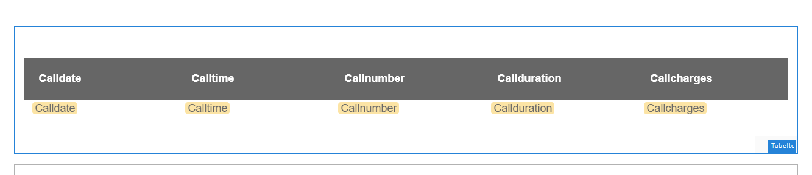
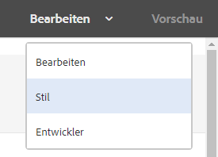
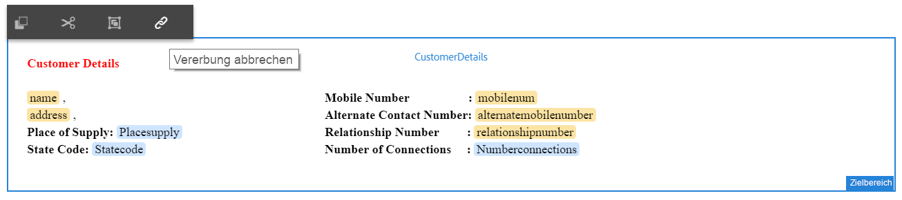
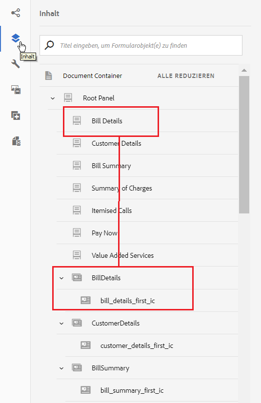

# Tutorial: Erstellen einer interaktiven Kommunikation {#tutorial-create-interactive-communication}

Dieses Tutorial ist ein Schritt in der Reihe [Erstellen Sie Ihre erste interaktive Kommunikation](/help/forms/using/create-your-first-interactive-communication.md). Es wird empfohlen, der Serie in chronologischer Reihenfolge zu folgen, um den vollständigen Anwendungsfall zu verstehen, auszuführen und zu demonstrieren.

Nachdem Sie alle Bausteine &#x200B;&#x200B;wie Formulardatenmodell, Dokumentfragmente und Vorlagen und Themen für die Webversion erstellt haben, können Sie mit der Erstellung einer interaktiven Kommunikation beginnen.

Interaktive Kommunikation kann über zwei Kanäle erfolgen: Druck und Web. Sie können auch eine interaktive Kommunikation mit dem Druckkanal als Master erstellen. Druck als Master-Option für Webkanal stellt sicher, dass Inhalt, Vererbung und Datenbindung des Webkanals vom Druckkanal abgeleitet werden. Außerdem wird sichergestellt, dass die im Druckkanal vorgenommenen Änderungen im Webkanal synchronisiert werden. Die Autoren der interaktiven Kommunikation dürfen jedoch ggf. die Vererbung für bestimmte Komponenten im Webkanal aufheben.

In diesem Tutorial werden Sie durch die Schritte zum Erstellen interaktiver Kommunikationen für Druck- und Webkanäle geführt. Am Ende dieser Schulung können Sie Folgendes:

* Erstellen Sie interaktive Kommunikation für den Druckkanal
* Erstellen Sie interaktive Kommunikation für den Webkanal
* Erstellen Sie interaktive Kommunikation für den Druck- und Webkanal mit Druck als Master

## Erstellen Sie interaktive Kommunikation für Druck und Web ohne Synchronisierung {#create-interactive-communications-for-print-and-web-with-no-synchronization}

### Erstellen einer interaktiven Kommunikation für Druckkanal {#create-interactive-communication-for-print-channel}

Im Folgenden finden Sie eine Liste der Ressourcen, die bereits in diesem Tutorial erstellt wurden und beim Erstellen der interaktiven Kommunikation für den Druckkanal benötigt werden:

**Druckvorlage:** [create_first_ic_print_template](../../forms/using/create-templates-print-web.md)

**Formulardatenmodell:** [FDM_Create_First_IC](../../forms/using/create-form-data-model0.md)

**Dokumentfragmente:** [bill_details_first_ic, customer_details_first_ic, bill_summary_first_ic, summary_charges_first_ic](../../forms/using/create-document-fragments.md)

**Layout-Fragmente:** [table_lf](../../forms/using/create-templates-print-web.md)

**Bilder:** PayNow und ValueAddedServices

1. Melden Sie sich bei Ihrer AEM-Autoreninstanz an und navigieren Sie zu **[!UICONTROL Adobe Experience Manager]** > **[!UICONTROL Formulare]** > **[!UICONTROL Formulare und Dokumente]**.
1. Tippen Sie auf **Erstellen** und wählen Sie **Interaktive Kommunikation** aus. Der Assistent **Interaktive Kommunikation erstellen** wird angezeigt.
1. Geben Sie **create_first_ic** im Feld **Titel** und im Feld **Name** an. Wählen Sie **FDM_Create_First_IC** als Formulardatenmodell aus und tippen Sie auf **Weiter**.
1. Im Assistenten **Kanäle**:

   1. Geben Sie **create_first_ic_print_template** als Druckvorlage an und tippen Sie auf **Auswählen**. Stellen Sie sicher, dass das Kontrollkästchen **Druck als Master für Webkanal verwenden** nicht aktiviert ist.

   1. Geben Sie den Ordner **Create_First_IC_templates** > **Create_First_IC_Web_Template** als Web-Vorlage an und tippen Sie auf **Auswählen**.

   1. Tippen Sie auf **Erstellen**.

   Eine Bestätigungsmeldung wird angezeigt, dass die interaktive Kommunikation erfolgreich erstellt wurde.

1. Tippen Sie auf **Bearbeiten**, um die interaktive Kommunikation im rechten Bereich zu öffnen.
1. Wechseln Sie zur Registerkarte **Assets** und wenden Sie den Filter an, um nur die Dokumentfragmente im linken Bereich anzuzeigen.
1. Ziehen Sie die folgenden Dokumentfragmente per Drag &amp; Drop in ihre Zielbereiche in der interaktiven Kommunikation:

   | Dokumentfragment | Zielbereich |
   |---|---|
   | bill_details_first_ic | BillDetails |
   | customer_details_first_ic | CustomerDetails |
   | bill_summary_first_ic | BillSummary |
   | summary_charges_first_interactive_communication | Gebühren |

   

1. Tippen Sie auf den Zielbereich **Diagramme** und anschließend auf **+**, um eine Komponente **Diagramm** hinzuzufügen.
1. Tippen Sie auf die Diagrammkomponente und wählen Sie  (Konfigurieren) aus. Die Diagrammeigenschaften werden im linken Bereich angezeigt:

   1. Geben Sie einen Namen für das Diagramm an.
   1. Wählen Sie **Kreis** aus der Dropdownliste **Diagrammtyp**.
   1. Wählen Sie die Eigenschaft **calltype** aus dem Datenmodellobjekt **calls** im Abschnitt **X-Achse** Tippen Sie auf .
   1. Wählen Sie **Frequenz** aus der Dropdown-Liste **Funktion**.
   1. Wählen Sie die Eigenschaft **calltype** aus dem Datenmodellobjekt **calls** im Abschnitt **Y-Achse** aus. Tippen Sie auf .
   1. Durch das Tippen auf  werden die Diagrammeigenschaften gespeichert.

1. Wechseln Sie zur Registerkarte **Elemente** und wenden Sie den Filter an, um nur die Layout-Fragmente im linken Bereich anzuzeigen. Ziehen Sie das Layout **table_lf** per Drag-and-Drop in den Zielbereich **Einzeln aufgeführte Anrufe**.
1. Wählen Sie das Textfeld in der Spalte **Datum** aus und tippen Sie auf  (Konfigurieren).
1. Wählen Sie **Datenmodellobjekt** aus der Dropdown-Liste **Bindungstyp** und wählen Sie **calls** > **calldate**. Zum Speichern der Eigenschaften tippen Sie zweimal auf .

   Erstellen Sie eine Bindung mit **calltime**, **callnumber**, **callduration** und **callcharges** für Textfelder in den Spalten **Zeit**, **Anzahl**, **Dauer** und **Kosten**.

1. Um eine **Bild**-Komponente hinzuzufügen, tippen Sie auf den Zielbereich **PayNow** und anschließend auf **+**.
1. Tippen Sie auf die Bildkomponente und wählen Sie  (Konfigurieren) aus. Die Bildeigenschaften werden im linken Bereich angezeigt:

   1. Geben Sie **PayNow** als Namen des Bildes im Feld **Name** ein.
   1. Tippen Sie auf **Hochladen**, wählen Sie das im lokalen Dateisystem gespeicherte Bild aus und tippen Sie auf **Öffnen**.
   1. Zum Speichern der Bildeigenschaften tippen Sie auf .

1. Um das Bild **ValueAddedServices** dem Zielbereich **ValueAddedServices** hinzuzufügen, wiederholen Sie die Schritte 13 und 14.

### Erstellen Sie interaktive Kommunikation für den Webkanal {#create-interactive-communication-for-web-channel}

Im Folgenden finden Sie eine Liste der Ressourcen, die bereits in diesem Tutorial erstellt wurden und beim Erstellen der interaktiven Kommunikation für den Webkanal benötigt werden:

**Webvorlage:** [Create_First_IC_Web_Template](../../forms/using/create-templates-print-web.md)

**Formulardatenmodell:** [FDM_Create_First_IC](../../forms/using/create-form-data-model0.md)

**Dokumentfragmente:** [bill_details_first_ic, customer_details_first_ic, bill_summary_first_ic, summary_charges_first_ic](../../forms/using/create-document-fragments.md)

**Bilder:** PayNowWeb und ValueAddedServicesWeb

1. Melden Sie sich bei Ihrer AEM-Autoreninstanz an und navigieren Sie zu **[!UICONTROL Adobe Experience Manager]** > **[!UICONTROL Formulare]** > **[!UICONTROL Formulare und Dokumente]**.
1. Tippen Sie auf **Erstellen** und wählen Sie **Interaktive Kommunikation** aus. Der Assistent **Erstellen einer interaktiven Kommunikation** wird angezeigt.
1. Geben Sie **create_first_ic** im Feld **Titel** und im Feld **Name** an. Wählen Sie als Formulardatenmodell **FDM_Create_First_IC** aus und tippen Sie auf **Weiter**.
1. Im Assistenten **Kanäle**:

   1. Geben Sie als Druckvorlage **create_first_ic_print_template** an und tippen Sie auf **Auswählen**. Stellen Sie sicher, dass das Kontrollkästchen **Druck als Master für Webkanal verwenden** nicht aktiviert ist.

   1. Geben Sie als Webvorlage den Ordner **Create_First_IC_templates** folder > **Create_First_IC_Web_Template** an und tippen Sie auf **Auswählen**.

   1. Tippen Sie auf **Erstellen**.

   Eine Bestätigungsmeldung wird angezeigt, dass die interaktive Kommunikation erfolgreich erstellt wurde.

1. Tippen Sie auf **Bearbeiten**, um die interaktive Kommunikation im rechten Bereich zu öffnen.
1. Tippen Sie auf die Registerkarte **Kanäle** im linken Bereich, und tippen Sie auf **Web**.
1. Wechseln Sie zur Registerkarte **Elemente** und wenden Sie den Filter an, um nur die Dokumentfragmente im linken Bereich anzuzeigen.
1. Ziehen Sie die folgenden Dokumentfragmente per Drag &amp; Drop in ihre Zielbereiche in der interaktiven Kommunikation:

   | Dokumentfragment | Zielbereich |
   |---|---|
   | bill_details_first_ic | BillDetails |
   | customer_details_first_ic | CustomerDetails |
   | bill_summary_first_ic | BillSummary |
   | summary_charges_first_interactive_communication | Gebühren |

1. Tippen Sie auf den Zielbereich **Zusammenfassung der Gebühren** und anschließend auf **+**, um eine Komponente **Diagramm** hinzuzufügen.
1. Tippen Sie auf die Diagrammkomponente und wählen Sie  (Konfigurieren) aus. Die Diagrammeigenschaften werden im linken Bereich angezeigt:

   1. Geben Sie einen Namen für das Diagramm an.
   1. Wählen Sie **Kreis** aus der Dropdownliste **Diagrammtyp**.

   1. Wählen Sie die Eigenschaft **calltype** aus dem Datenmodellobjekt **calls** im Abschnitt **X-Achse** Tippen Sie auf .

   1. Wählen Sie **Frequenz** aus der Dropdown-Liste **Funktion**.

   1. Wählen Sie die Eigenschaft **calltype** aus dem Datenmodellobjekt **calls** im Abschnitt **Y-Achse** aus. Tippen Sie auf .

   1. Tippen Sie auf , um die Diagrammeigenschaften zu speichern.

1. Wählen Sie die Registerkarte **Datenquellen** aus dem linken Bereich und ziehen Sie das Datenmodellobjekt **calls** in den Zielbereich **Einzeln aufgeführte Anrufe**. Alle Eigenschaften im Datenmodellobjekt **calls** werden als Tabellenspalten im Zielbereich **Einzeln aufgeführte Anrufe** im rechten Bereich angezeigt.

   Basierend auf dem Anwendungsfall benötigen Sie die Spalten „Anrufdatum“, „Anrufzeit“, „Rufnummer“, „Anrufdauer“ und „Anrufkosten“ in der Tabelle.

   

1. Wählen Sie die Tabellenspaltenüberschrift **Mobilenum** und dann **Weitere Optionen** > **Spalte löschen** aus. Löschen Sie auf ähnliche Weise die Spalte **Anruftyp**.
1. Wählen Sie die Tabellenspaltenüberschrift **Calldate** aus und tippen Sie auf  (Bearbeiten), um den Text in **Anrufdatum** umzubenennen. Benennen Sie andere Spaltenüberschriften in der Tabelle um.
1. Fügen Sie je nach Anwendungsfall die Schaltfläche **Jetzt bezahlen** in die interaktive Kommunikation ein, die dem Benutzer die Option bietet, die Zahlung durch Klicken auf die Schaltfläche vorzunehmen. Führen Sie die folgenden Schritte aus, um die Schaltfläche einzufügen:

   1. Tippen Sie auf den Zielbereich **Jetzt bezahlen** und anschließend auf **+**, um eine Komponente **Text** hinzuzufügen.

   1. Tippen Sie auf die Textkomponente und anschließend auf  (Bearbeiten).
   1. Benennen Sie den Text in **Jetzt bezahlen** um.
   1. Wählen Sie den Text aus und tippen Sie auf das Hyperlink-Symbol.
   1. Geben Sie die Zahlungs-URL in das Feld **Pfad** ein.
   1. Wählen Sie **Neue Registerkarte** aus der Dropdown-Liste **Ziel**.

   1. Tippen Sie auf , um die Hyperlink-Eigenschaften zu speichern.

1. Wählen Sie **Style** aus der Dropdown-Liste neben der Option **Vorschau**.

   

1. Gestalten Sie den Hyperlink-Text so, dass er als Schaltfläche in der interaktiven Kommunikation angezeigt wird. Gehen Sie dazu wie folgt vor:

   1. Tippen Sie auf die Textkomponente und wählen Sie  (Bearbeiten) aus.
   1. Geben Sie im Abschnitt **Rahmen** **1.5px** als **Rahmenbreite** ein, wählen Sie **Durchgehend** als **Rahmenstil** ein und geben Sie **46px** als **Rahmenradius** ein.

   1. Wählen Sie Rot als Hintergrundfarbe für die Schaltfläche im Abschnitt **Hintergrund**.
   1. Im Feld **Rand** für **Abmessungen und Position**, tippen Sie auf das Symbol **Gleichzeitig bearbeiten**, und setzen Sie den **rechten** Rand auf **450px**. Die Felder Oben, Unten und Links werden leer gelassen.

   

1. Tippen Sie auf den Zielbereich **Jetzt bezahlen** und anschließend auf **+**, um eine Komponente **Bild** hinzuzufügen.
1. Tippen Sie auf die Bildkomponente und wählen Sie  (Konfigurieren) aus. Die Bildeigenschaften werden im linken Bereich angezeigt:

   1. Geben Sie **PayNow** als Namen des Bildes im Feld **Name** ein.

   1. Tippen Sie auf **Hochladen**, wählen Sie das im lokalen Dateisystem gespeicherte Bild **PayNowWeb** aus und tippen Sie auf **Öffnen**.

   1. Tippen Sie auf , um die Bildeigenschaften zu speichern.

1. Fügen Sie je nach Anwendungsfall die Schaltfläche **Abonnieren** in die interaktive Kommunikation ein, die dem Benutzer die Option bietet, den Mehrwert-Service durch Klicken auf die Schaltfläche zu abonnieren.

   Wiederholen Sie die Schritte 13 bis 17, um eine Schaltfläche **Abonnieren** zum Zielbereich **Mehrwert - Service** hinzuzufügen und das Bild **ValueAddedServicesWeb** hinzufügen.

## Erstellen Sie interaktive Kommunikation für Druck und Web mit automatischer Synchronisierung {#create-interactive-communications-for-print-and-web-with-auto-synchronization}

Sie können auch eine interaktive Kommunikation erstellen, indem Sie die automatische Synchronisierung zwischen Druck- und Webkanälen aktivieren. Um die automatische Synchronisierung zu aktivieren, wählen Sie beim Erstellen der interaktiven Kommunikation die Option „Als Master drucken“. Die Option „Druck als Master“ stellt sicher, dass Inhalt, Vererbung und Datenbindung des Webkanals vom Druckkanal abgeleitet werden. Außerdem wird sichergestellt, dass die im Druckkanal vorgenommenen Änderungen im Webkanal vorhanden sind.

Führen Sie die folgenden Schritte aus, um den Webkanal-Inhalt mithilfe des Druckkanals abzuleiten:

1. Melden Sie sich bei Ihrer AEM-Autoreninstanz an und navigieren Sie zu **[!UICONTROL Adobe Experience Manager]** > **[!UICONTROL Formulare]** > **[!UICONTROL Formulare und Dokumente]**.
1. Tippen Sie auf **Erstellen** und wählen Sie **Interaktive Kommunikation** aus. Der Assistent **Erstellen einer interaktiven Kommunikation** wird angezeigt.
1. Geben Sie **create_first_ic** im Feld **Titel** und im Feld **Name** an. Wählen Sie **FDM_Create_First_IC** als Formulardatenmodell und tippen Sie auf **Weiter**.
1. Im Assistenten **Kanäle**:

   1. Geben Sie **create_first_ic_print_template** als Druckvorlage an und tippen Sie auf **Auswählen**.

   1. Aktivieren Sie das Kontrollkästchen **Druck als Master für Webkanal verwenden**.
   1. Geben Sie den Ordner **Create_First_IC_templates** > **Create_First_IC_Web_Template** als Webvorlage ein und tippen Sie auf **Auswählen**.

   1. Tippen Sie auf **Erstellen**.

   Eine Bestätigungsmeldung wird angezeigt, dass die interaktive Kommunikation erfolgreich erstellt wurde.

1. Tippen Sie auf **Bearbeiten**, um die interaktive Kommunikation im rechten Bereich zu öffnen.
1. Führen Sie die Schritte 6–15 des Abschnitts [Erstellen einer interaktiven Kommunikation für den Druckkanal](../../forms/using/create-interactive-communication0.md#create-interactive-communication-for-print-channel) aus.
1. Tippen Sie auf die Registerkarte **Kanäle** im linken Bereich und tippen Sie auf **Web**, um automatisch generieren Inhalte für den Webkanal aus dem Druckkanal zu generieren.
1. Da Sie in Schritt 4 das Kontrollkästchen **Druck als Master für Webkanal verwenden** aktiviert haben, werden Inhalt und Bindungen für den Webkanal automatisch aus dem Druckkanal generiert.

   Der Druckkanalinhalt wird unter dem Inhalt der Webkanalvorlage eingefügt. Um den automatisch aus dem Druckkanal generierten Webkanalinhalt zu ändern, können Sie die Vererbung für einen beliebigen Zielbereich abbrechen.

   Bewegen Sie den Mauszeiger über den entsprechenden Zielbereich im Webkanal und wählen Sie  (Vererbung abbrechen), tippen Sie dann im Dialogfeld **Vererbung abbrechen** auf **Ja**.

   

   Wenn Sie die Vererbung einer Komponente abgebrochen haben, können Sie sie erneut aktivieren. Um die Vererbung wieder zu aktivieren, bewegen Sie die Maus über die Grenze des relevanten Zielbereichs, der die Komponente enthält, und tippen Sie auf .

1. Wählen Sie die Registerkarte **Inhalt** im linken Bereich.
1. Ziehen Sie den automatisch generierten Webkanal-Inhalt mithilfe der Inhaltsstruktur in die vorhandenen Bereiche der Webvorlage. Im folgenden finden Sie die Liste der Komponenten, die neu angeordnet werden müssen:

   * Komponente „Rechnungsdetails“ im Bereich „Rechnungsdetails“
   * Komponente „Kundendetails“ im Bereich „Kundendetails“
   * Komponente „Rechnungszusammenfassung“ im Bereich „Rechnungszusammenfassung“
   * Komponente „Zusammenfassung der Gebühren“ im Bereich „Zusammenfassung der Gebühren“
   * Layoutfragment (Tabelle) für den Bereich „Einzeln aufgeführte Anrufe“

   

1. Wiederholen Sie die Schritte 13 - 18 von [Interaktive Kommunikation für Webkanal erstellen](../../forms/using/create-interactive-communication0.md#create-interactive-communication-for-web-channel), um die Hyperlinks **Jetzt bezahlen** und **Abonnieren** in den Webkanal der interaktiven Kommunikation einzufügen.
