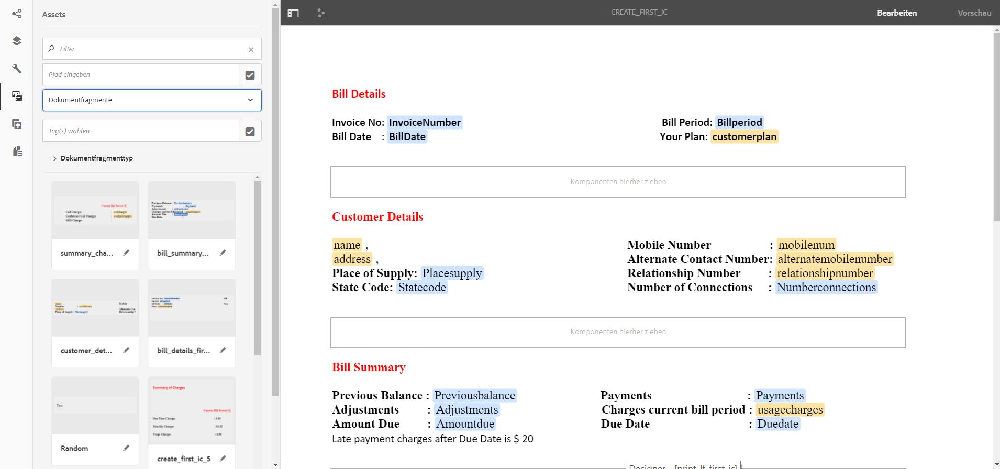

# Tutorial: Erstellen einer interaktiven Kommunikation {#tutorial-create-interactive-communication}

Dieses Tutorial ist ein Schritt in der Reihe [Erstellen Sie Ihre erste interaktive Kommunikation](/help/forms/using/create-your-first-interactive-communication.md). Es wird empfohlen, die Serie in chronologischer Reihenfolge zu durchlaufen, um den vollständigen Anwendungsfall des Tutorials zu verstehen, durchzuführen und zu demonstrieren.

Nachdem Sie alle Bausteine wie Formulardatenmodell, Dokumentfragmente, Vorlagen und Designs für die Webversion erstellt haben, können Sie mit der Erstellung einer interaktiven Kommunikation beginnen.

Interaktive Kommunikation kann über zwei Kanäle bereitgestellt werden: Druck und Web. Sie können auch eine interaktive Kommunikation mit dem Druckkanal als Master erstellen. Die Option &quot;Als Master drucken&quot;für den Webkanal stellt sicher, dass der Inhalt, die Vererbung und die Datenbindung des Webkanals vom Druckkanal abgeleitet werden. Außerdem wird sichergestellt, dass die im Druckkanal vorgenommenen Änderungen im Webkanal synchronisiert werden. Die Autoren der interaktiven Kommunikation dürfen jedoch die Vererbung für bestimmte Komponenten im Webkanal unterbrechen.

Dieses Tutorial führt Sie durch die Schritte zum Erstellen interaktiver Kommunikation für Druck- und Webkanäle. Am Ende dieses Tutorials können Sie Folgendes:

* Erstellen der interaktiven Kommunikation für den Druckkanal
* Erstellen der interaktiven Kommunikation für den Webkanal
* Erstellen Sie Print- und Web-interaktive Kommunikation mit Print als Master.

## Erstellen interaktiver Kommunikation für Druck und Web ohne Synchronisierung {#create-interactive-communications-for-print-and-web-with-no-synchronization}

### Erstellen einer interaktiven Kommunikation für den Druckkanal {#create-interactive-communication-for-print-channel}

Im Folgenden finden Sie eine Liste der Ressourcen, die bereits in diesem Tutorial erstellt wurden und beim Erstellen der interaktiven Kommunikation für den Druckkanal benötigt werden:

**Druckvorlage:** [create_first_ic_print_template](../../forms/using/create-templates-print-web.md)

**Formulardatenmodell:** [FDM_Create_First_IC](../../forms/using/create-form-data-model0.md)

**Dokumentfragmente:** [bill_details_first_ic, customer_details_first_ic, bill_summary_first_ic, summary_charges_first_ic](../../forms/using/create-document-fragments.md)

**Layout-Fragmente:** [table_lf](../../forms/using/create-templates-print-web.md)

**Bilder:** PayNow und ValueAddedServices

1. Melden Sie sich bei Ihrer AEM-Autoreninstanz an und navigieren Sie zu **[!UICONTROL Adobe Experience Manager]** > **[!UICONTROL Formulare]** > **[!UICONTROL Formulare und Dokumente]**.
1. Auswählen **Erstellen** und wählen **Interaktive Kommunikation**. Der Assistent **Erstellen einer interaktiven Kommunikation** wird angezeigt.
1. Geben Sie **create_first_ic** im Feld **Titel** und im Feld **Name** an. Auswählen **FDM_Create_First_IC** als Formulardatenmodell und wählen Sie **Nächste**.
1. Im Assistenten **Kanäle**:

   1. Angeben **create_first_ic_print_template** als Druckvorlage verwenden und wählen Sie **Auswählen**. Stellen Sie sicher, dass das Kontrollkästchen **Druck als Master für Webkanal verwenden** nicht aktiviert ist.

   1. Angeben **Create_First_IC_templates** Ordner > **Create_First_IC_Web_Template** als Webvorlage zu verwenden und wählen Sie **Auswählen**.

   1. Wählen Sie **Erstellen** aus.

   Es wird eine Bestätigungsmeldung angezeigt, dass die interaktive Kommunikation erfolgreich erstellt wurde.

1. Auswählen **Bearbeiten** , um die interaktive Kommunikation im rechten Bereich zu öffnen.
1. Wechseln Sie zur Registerkarte **Assets** und wenden Sie den Filter an, um nur die Dokumentfragmente im linken Bereich anzuzeigen.
1. Ziehen Sie die folgenden Dokumentfragmente per Drag-and-Drop in die Zielbereiche der interaktiven Kommunikation:

   | Dokumentfragment | Zielbereich |
   |---|---|
   | bill_details_first_ic | BillDetails |
   | customer_details_first_ic | CustomerDetails |
   | bill_summary_first_ic | BillSummary |
   | summary_charges_first_interactive_communication | Gebühren |

   

1. Auswählen **Diagramme** Zielbereich und wählen Sie **+** , um **Diagramm** -Komponente.
1. Wählen Sie die Diagrammkomponente aus und wählen Sie  (Konfigurieren). Die Diagrammeigenschaften werden im linken Bereich angezeigt:

   1. Geben Sie einen Namen für das Diagramm an.
   1. Wählen Sie **Kreis** aus der Dropdownliste **Diagrammtyp**.
   1. Wählen Sie die Eigenschaft **calltype** aus dem Datenmodellobjekt **calls** im Abschnitt **X-Achse** Auswählen .
   1. Wählen Sie **Frequenz** aus der Dropdown-Liste **Funktion**.
   1. Wählen Sie die Eigenschaft **calltype** aus dem Datenmodellobjekt **calls** im Abschnitt **Y-Achse** aus. Auswählen .
   1. Auswählen  , um die Diagrammeigenschaften zu speichern.

1. Wechseln Sie zur Registerkarte **Elemente** und wenden Sie den Filter an, um nur die Layout-Fragmente im linken Bereich anzuzeigen. Ziehen Sie das Layout **table_lf** per Drag-and-Drop in den Zielbereich **Einzeln aufgeführte Anrufe**.
1. Wählen Sie das Textfeld im **Datum** und wählen Sie  (Konfigurieren).
1. Wählen Sie **Datenmodellobjekt** aus der Dropdown-Liste **Bindungstyp** und wählen Sie **calls** > **calldate**. Auswählen  zweimal speichern, um die Eigenschaften zu speichern.

   Erstellen Sie eine Bindung mit **calltime**, **callnumber**, **callduration** und **callcharges** für Textfelder in den Spalten **Zeit**, **Anzahl**, **Dauer** und **Kosten**.

1. Auswählen **PayNow** Zielbereich und wählen Sie **+** , um **Bild** -Komponente.
1. Wählen Sie die Bildkomponente aus und wählen Sie  (Konfigurieren). Die Bildeigenschaften werden im linken Bereich angezeigt:

   1. Angeben **PayNow** als Name des Bildes im **Name** -Feld.
   1. Auswählen **Hochladen**, wählen Sie das im lokalen Dateisystem gespeicherte Bild aus und wählen Sie **Öffnen**.
   1. Auswählen  , um die Bildeigenschaften zu speichern.

1. Um das Bild **ValueAddedServices** dem Zielbereich **ValueAddedServices** hinzuzufügen, wiederholen Sie die Schritte 13 und 14.

### Erstellen interaktiver Kommunikation für den Webkanal {#create-interactive-communication-for-web-channel}

Im Folgenden finden Sie eine Liste der Ressourcen, die bereits in diesem Tutorial erstellt wurden und beim Erstellen der interaktiven Kommunikation für den Webkanal benötigt werden:

**Webvorlage:** [Create_First_IC_Web_Template](../../forms/using/create-templates-print-web.md)

**Formulardatenmodell:** [FDM_Create_First_IC](../../forms/using/create-form-data-model0.md)

**Dokumentfragmente:** [bill_details_first_ic, customer_details_first_ic, bill_summary_first_ic, summary_charges_first_ic](../../forms/using/create-document-fragments.md)

**Bilder:** PayNowWeb und ValueAddedServicesWeb

1. Melden Sie sich bei Ihrer AEM-Autoreninstanz an und navigieren Sie zu **[!UICONTROL Adobe Experience Manager]** > **[!UICONTROL Formulare]** > **[!UICONTROL Formulare und Dokumente]**.
1. Auswählen **Erstellen** und wählen **Interaktive Kommunikation**. Der Assistent **Erstellen einer interaktiven Kommunikation** wird angezeigt.
1. Geben Sie **create_first_ic** im Feld **Titel** und im Feld **Name** an. Auswählen **FDM_Create_First_IC** als Formulardatenmodell und wählen Sie **Nächste**.
1. Im Assistenten **Kanäle**:

   1. Angeben **create_first_ic_print_template** als Druckvorlage verwenden und wählen Sie **Auswählen**. Stellen Sie sicher, dass das Kontrollkästchen **Druck als Master für Webkanal verwenden** nicht aktiviert ist.

   1. Angeben **Create_First_IC_templates** Ordner > **Create_First_IC_Web_Template** als Webvorlage zu verwenden und wählen Sie **Auswählen**.

   1. Wählen Sie **Erstellen** aus.

   Es wird eine Bestätigungsmeldung angezeigt, dass die interaktive Kommunikation erfolgreich erstellt wurde.

1. Auswählen **Bearbeiten** , um die interaktive Kommunikation im rechten Bereich zu öffnen.
1. Wählen Sie die **Kanäle** Registerkarte im linken Bereich aus und wählen Sie **Web**.
1. Wechseln Sie zur Registerkarte **Assets** und wenden Sie den Filter an, um nur die Dokumentfragmente im linken Bereich anzuzeigen.
1. Ziehen Sie die folgenden Dokumentfragmente per Drag-and-Drop in die Zielbereiche der interaktiven Kommunikation:

   | Dokumentfragment | Zielbereich |
   |---|---|
   | bill_details_first_ic | BillDetails |
   | customer_details_first_ic | CustomerDetails |
   | bill_summary_first_ic | BillSummary |
   | summary_charges_first_interactive_communication | Gebühren |

1. Auswählen **Zusammenfassung der Gebühren** Zielbereich und wählen Sie **+** , um **Diagramm** -Komponente.
1. Wählen Sie die Diagrammkomponente aus und wählen Sie  (Konfigurieren). Die Diagrammeigenschaften werden im linken Bereich angezeigt:

   1. Geben Sie einen Namen für das Diagramm an.
   1. Wählen Sie **Kreis** aus der Dropdownliste **Diagrammtyp**.

   1. Wählen Sie die Eigenschaft **calltype** aus dem Datenmodellobjekt **calls** im Abschnitt **X-Achse** Auswählen .

   1. Wählen Sie **Frequenz** aus der Dropdown-Liste **Funktion**.

   1. Wählen Sie die Eigenschaft **calltype** aus dem Datenmodellobjekt **calls** im Abschnitt **Y-Achse** aus. Auswählen .

   1. Auswählen  , um die Diagrammeigenschaften zu speichern.

1. Wählen Sie die Registerkarte **Datenquellen** aus dem linken Bereich und ziehen Sie das Datenmodellobjekt **calls** in den Zielbereich **Einzeln aufgeführte Anrufe**. Alle Eigenschaften im Datenmodellobjekt **calls** werden als Tabellenspalten im Zielbereich **Einzeln aufgeführte Anrufe** im rechten Bereich angezeigt.

   Basierend auf dem Anwendungsfall benötigen Sie die Spalten „Anrufdatum“, „Anrufzeit“, „Rufnummer“, „Anrufdauer“ und „Anrufkosten“ in der Tabelle.

   

1. Wählen Sie die Tabellenspaltenüberschrift **Mobilenum** und dann **Weitere Optionen** > **Spalte löschen** aus. Löschen Sie auf ähnliche Weise die Spalte **Anruftyp**.
1. Wählen Sie die **Calldate** Tabellenspaltenüberschrift und Auswahl  (Bearbeiten), um den Text in **Anrufdatum**. Benennen Sie auf ähnliche Weise andere Spaltenüberschriften in der Tabelle um.
1. Fügen Sie je nach Anwendungsfall eine **Jetzt bezahlen** in der interaktiven Kommunikation, die dem Benutzer die Möglichkeit bietet, die Zahlung durch Klicken auf die Schaltfläche vorzunehmen. Führen Sie die folgenden Schritte aus, um die Schaltfläche einzufügen:

   1. Auswählen **Jetzt bezahlen** Zielbereich und wählen Sie **+** , um **Text** -Komponente.

   1. Wählen Sie die Textkomponente aus und wählen Sie  (Bearbeiten).
   1. Benennen Sie den Text in **Jetzt bezahlen**.
   1. Wählen Sie den Text aus und klicken Sie auf das Symbol Hyperlink .
   1. Geben Sie die Zahlungs-URL im **Pfad** -Feld.
   1. Auswählen **Neue Registerkarte** von **Target** Dropdown-Liste.

   1. Auswählen  , um die Eigenschaften des Hyperlinks zu speichern.

1. Wählen Sie **Style** aus der Dropdown-Liste neben der Option **Vorschau**.

   

1. Gestalten Sie den Hyperlink-Text so, dass er als Schaltfläche in der interaktiven Kommunikation angezeigt wird. Gehen Sie dazu wie folgt vor:

   1. Wählen Sie die Textkomponente aus und wählen Sie  (Bearbeiten).
   1. Geben Sie im Abschnitt **Rahmen** **1.5px** als **Rahmenbreite** ein, wählen Sie **Durchgehend** als **Rahmenstil** ein und geben Sie **46px** als **Rahmenradius** ein.

   1. Wählen Sie Rot als Hintergrundfarbe für die Schaltfläche aus dem **Hintergrund** Abschnitt.
   1. Im **Marge** -Feld für **Dimensionen und Position** auswählen, wählen Sie die **Gleichzeitig bearbeiten** und legen Sie die **Right** margin as **450 px**. Die Felder Oben, Unten und Links werden leer gelassen.

   

1. Auswählen **Jetzt bezahlen** Zielbereich und wählen Sie **+** , um **Bild** -Komponente.
1. Wählen Sie die Bildkomponente aus und wählen Sie  (Konfigurieren). Die Bildeigenschaften werden im linken Bereich angezeigt:

   1. Angeben **PayNow** als Name des Bildes im **Name** -Feld.

   1. Auswählen **Hochladen**, wählen Sie die **PayNowWeb** Bild, das im lokalen Dateisystem gespeichert ist, und wählen Sie **Öffnen**.

   1. Auswählen  , um die Bildeigenschaften zu speichern.

1. Fügen Sie je nach Anwendungsfall die Schaltfläche **Abonnieren** in die interaktive Kommunikation ein, die dem Benutzer die Option bietet, den Mehrwert-Service durch Klicken auf die Schaltfläche zu abonnieren.

   Wiederholen Sie die Schritte 13 bis 17, um eine Schaltfläche **Abonnieren** zum Zielbereich **Mehrwert - Service** hinzuzufügen und das Bild **ValueAddedServicesWeb** hinzufügen.

## Erstellen interaktiver Kommunikation für Druck und Web mit automatischer Synchronisierung {#create-interactive-communications-for-print-and-web-with-auto-synchronization}

Sie können auch eine interaktive Kommunikation erstellen, indem Sie die automatische Synchronisierung zwischen Druck- und Webkanälen aktivieren. Um die automatische Synchronisierung zu aktivieren, wählen Sie beim Erstellen der interaktiven Kommunikation die Option Als Master drucken aus. Durch Auswahl der Option Als Master drucken wird sichergestellt, dass der Inhalt, die Vererbung und die Datenbindung des Webkanals vom Druckkanal abgeleitet werden. Außerdem wird sichergestellt, dass die im Druckkanal vorgenommenen Änderungen im Webkanal übernommen werden.

Führen Sie die folgenden Schritte aus, um den Webkanalinhalt mithilfe des Druckkanals abzuleiten:

1. Melden Sie sich bei Ihrer AEM-Autoreninstanz an und navigieren Sie zu **[!UICONTROL Adobe Experience Manager]** > **[!UICONTROL Formulare]** > **[!UICONTROL Formulare und Dokumente]**.
1. Auswählen **Erstellen** und wählen **Interaktive Kommunikation**. Der Assistent **Erstellen einer interaktiven Kommunikation** wird angezeigt.
1. Geben Sie **create_first_ic** im Feld **Titel** und im Feld **Name** an. Auswählen **FDM_Create_First_IC** als Formulardatenmodell und wählen Sie **Nächste**.
1. Im Assistenten **Kanäle**:

   1. Angeben **create_first_ic_print_template** als Druckvorlage verwenden und wählen Sie **Auswählen**.

   1. Aktivieren Sie das Kontrollkästchen **Druck als Master für Webkanal verwenden**.
   1. Angeben **Create_First_IC_templates** Ordner > **Create_First_IC_Web_Template** als Webvorlage zu verwenden und wählen Sie **Auswählen**.

   1. Wählen Sie **Erstellen** aus.

   Es wird eine Bestätigungsmeldung angezeigt, dass die interaktive Kommunikation erfolgreich erstellt wurde.

1. Auswählen **Bearbeiten** , um die interaktive Kommunikation im rechten Bereich zu öffnen.
1. Führen Sie die Schritte 6–15 des Abschnitts [Erstellen einer interaktiven Kommunikation für den Druckkanal](../../forms/using/create-interactive-communication0.md#create-interactive-communication-for-print-channel) aus.
1. Wählen Sie die **Kanäle** Registerkarte im linken Bereich aus und wählen Sie **Web** , um automatisch Inhalte für den Webkanal über den Druckkanal zu generieren.
1. Da Sie in Schritt 4 das Kontrollkästchen **Druck als Master für Webkanal verwenden** aktiviert haben, werden Inhalt und Bindungen für den Webkanal automatisch aus dem Druckkanal generiert.

   Der Inhalt des Druckkanals wird unter dem Inhalt der Webkanal-Vorlage eingefügt. Um den Webkanalinhalt zu ändern, der automatisch vom Druckkanal generiert wurde, können Sie die Vererbung für einen beliebigen Zielbereich abbrechen.

   Bewegen Sie den Mauszeiger über den relevanten Zielbereich im Webkanal und wählen Sie  (Vererbung abbrechen) und dann im **Vererbung abbrechen** Dialogfeld auswählen **Ja**.

   

   Wenn Sie die Vererbung einer Komponente abgebrochen haben, können Sie sie erneut aktivieren. Um die Vererbung erneut zu aktivieren, bewegen Sie den Mauszeiger über die Grenze des relevanten Zielbereichs, der die Komponente enthält, und wählen Sie .

1. Wählen Sie die **Inhalt** im linken Bereich.
1. Ziehen Sie den automatisch generierten Webkanalinhalt per Drag-and-Drop in die vorhandenen Bedienfelder in der Webvorlage unter Verwendung der Inhaltsstruktur. Im Folgenden finden Sie eine Liste der Komponenten, die neu angeordnet werden müssen:

   * Komponente &quot;Rechnungsdetails&quot;im Bedienfeld &quot;Rechnungsdetails&quot;
   * Komponente &quot;Kundendetails&quot;im Bereich &quot;Kundendetails&quot;
   * Komponente &quot;Rechnungszusammenfassung&quot;im Bedienfeld &quot;Rechnungszusammenfassung&quot;
   * Komponente &quot;Zusammenfassung der Gebühren&quot;im Bedienfeld &quot;Zusammenfassung der Gebühren&quot;
   * Layout-Fragment (Tabelle) in das Bedienfeld &quot;Auflistungen&quot;

   

1. Wiederholen Sie die Schritte 13 - 18 von [Interaktive Kommunikation für Webkanal erstellen](../../forms/using/create-interactive-communication0.md#create-interactive-communication-for-web-channel), um die Hyperlinks **Jetzt bezahlen** und **Abonnieren** in den Webkanal der interaktiven Kommunikation einzufügen.
