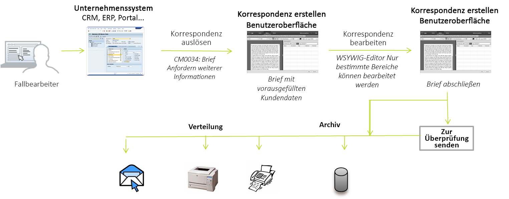

# Brief erstellen {#create-letter}

## Ablauf der Korrespondenzverwaltung {#correspondence-management-workflow}

Der Correspondence Management-Arbeitsablauf besteht aus vier Phasen:

1. Vorlagen erstellen
1. Dokumentfragmenterstellung
1. Brieferstellung
1. Nachbearbeitung

### Vorlagenerstellung {#template-creation}

Die folgende Grafik zeigt einen typischen Workflow zur Erstellung einer Korrespondenzvorlage.

Die einzelnen Workflow-Schritte:

1. Formularentwickler erstellen Layouts und Fragmentlayouts mit Adobe Forms Designer und laden sie in ein CRX-Repository hoch. Die Layouts enthalten typische Formularfelder, Layoutmerkmale wie Kopf- und Fußzeilen sowie leere „Zielbereiche“ zum Einfügen des Inhalts. Zu einem späteren Zeitpunkt ordnen Anwendungsspezialisten die Inhalte den jeweiligen Zielbereichen zu. Weitere Informationen zum[ Entwickeln eines Layouts](/help/forms/using/layout-design-details.md).
1. Subject Matter Experts aus Rechts-, Finanz- oder Marketingabteilungen erstellen und Inhalte und laden sie hoch, etwa Textklauseln, Verzichte, Nutzungsbedingungen und Bilder, z. B. Logos, die in verschiedenen Korrespondenzvorlagen wiederverwendet werden.
1. Anwendungsspezialisten erstellen Korrespondenzvorlagen. Der Anwendungsspezialist

   * ordnet den Zielbereichen in den Layoutvorlagen Textbausteine und Bilder zu
   * legt Bedingungen/Regeln für die Einbeziehung von Inhalten fest
   * verknüpft Layout-Felder und Variablen mit zu Grunde liegenden Datenmodellen

1. Verfasser zeigt den Brief in einer Vorschau an und reicht ihn zur Nachbearbeitung ein. Weitere Informationen zur [Nachbearbeitung](/help/forms/using/submit-letter-topostprocess.md).

#### Verwenden der im Lieferumfang von Correspondence Management enthaltenen Briefvorlagen {#using-letter-templates-provided-with-correspondence-management}

Anstatt eine völlig neue Layoutvorlage zu erstellen, können Sie die von Correspondence Management bereitgestellten Vorlagen ändern und wiederverwenden. Sie können in Designer rasch das Branding und die Daten- und Inhaltsfelder in den Vorlagen ändern wie für die Zwecke Ihres Unternehmens benötigt. Weitere Informationen finden Sie unter [Referenzieren von Briefvorlagen](/help/forms/using/reference-cm-layout-templates.md).

### Dokumentfragmenterstellung  {#document-fragment-creation}

Dokument-Fragmente sind wiederverwendbare Bestandteile\Komponenten einer Korrespondenz, mit denen Sie Briefe/Korrespondenz zusammenstellen können.

Es gibt Dokumentfragmente der folgenden Typen:

#### Text {#text}

Ein Text-Asset ist eine Inhaltskomponente, die aus einem oder mehreren Textabsätzen besteht. Ein Absatz kann statisch oder dynamisch sein. Ein dynamischer Absatz enthält Verweise auf Datenelemente, deren Werte zur Laufzeit bereitgestellt werden.

#### Liste {#list}

Liste ist eine Reihe von Dokument-Fragmenten, einschließlich Text, Listen (die gleiche Liste kann nicht &quot;an sich hinzugefügt werden), Bedingungen und Bilder. Die Reihenfolge der Listenelemente kann festgelegt sein oder bearbeitet werden. Beim Erstellen eines Briefs können Sie einige oder alle Listenelemente verwenden, um ein wiederverwendbares Muster von Elementen zu replizieren.

#### Bedingung  {#condition}

Mit Hilfe von Bedingungen können Sie festlegen, welche Inhalte zum Zeitpunkt der Dokumenterstellung je nach den bereitgestellten Daten in das Schriftstück einbezogen werden sollen. Die Beschreibung der Bedingung beruht auf Steuerungsvariablen. Die Variablen können entweder ein Datenwörterbuchelement oder ein Platzhalter sein. Beim Hinzufügen einer Bedingung haben Sie die Möglichkeit, ein Asset einzubeziehen, das auf dem Wert beruht, den die Steuerungsvariable hat. Bedingungen führen zu einer einzelnen Ausgabe, die von einem Ausdruck abhängt. Der erste Ausdruck wird basierend auf der aktuellen Bedingungsvariable als „true“ gefunden. Ihr Wert wird zur Ausgabe der Bedingung.

#### Layout-Fragment {#layout-fragment}

Unter einem Layout-Fragment versteht man ein Layout, das mit einem oder mehreren Briefen verwendet werden kann. Mit einem Layout-Fragment werden wiederholbare Muster, insbesondere dynamische Tabellen erstellt. Das Layout kann typische Formularfelder wie „Adresse“ und „Referenz“ enthalten. Es enthält auch leere Unterformulare, die Zielbereiche kennzeichnen. Die Layouts (XDPs) werden in Designer erstellt und dann [nach Forms und Dokumente](/help/forms/using/get-xdp-pdf-documents-aem.md) hochgeladen.

### Brieferstellung {#letter-creation}

Es gibt zwei Möglichkeiten zur Erstellung der Korrespondenz, die an Ihre Kunden geht: benutzergesteuerte und systemgesteuerte Erstellung.

#### Benutzergesteuert {#user-driven}

Mitarbeiter mit regulärem Kundenkontakt, wie z. B. Schadensregulierer oder Sachverständige, können benutzerdefinierte Schriftstücke erstellen. Über eine einfache und intuitiv bedienbare Benutzeroberfläche zur Brieferstellung können die Anwender dem Schriftstück optionalen Text hinzufügen, editierbare Inhalte personalisieren und dabei das Ergebnis in einer Echtzeit-Vorschau überprüfen. Anschließend lässt sich das angepasste Schriftstück an einen Back-End-Prozess übermitteln.

#### Systemgesteuert {#system-driven}

Die Erstellung von Schriftstücken wird durch sogenannte Ereignistrigger ausgelöst und erfolgt automatisch. So wird beispielsweise eine Erinnerung an einen Bürger gesendet, in der er aufgefordert wird, eine Vorabregistrierung zu beantragen, indem die vordefinierte Vorlage mit den Daten der Bürger zusammengeführt wird. Der endgültige Brief kann per E-Mail gesendet, ausgedruckt, als Fax verschickt oder archiviert werden.

### Nachbearbeitung {#post-processing}

Das endgültige Schriftstück kann zur Nachbearbeitung an einen Back-End-Prozess übermittelt werden. Das Schriftstück kann dann:

1. Für den Versand per E-Mail oder Fax bzw. für den Stapeldruck verarbeitet sowie zwecks Druck oder E-Mail-Versand in einem Ordner abgelegt werden.
1. Zur Überprüfung oder Genehmigung eingereicht werden.
1. Durch Anwendung von digitalen Unterschriften, Zertifikaten, Verschlüsselung oder Rechteverwaltung gesichert werden.
1. In eine durchsuchbare PDF-Datei konvertiert werden, die alle zu Archivierungs- und Auditing-Zwecken notwendigen Metadaten enthält.
1. In ein PDF-Portfolio einbezogen werden, das zusätzliche Dokumente enthält, z. B. Marketingmaterial. Das PDF-Portfolio kann dann als endgültiges Schriftstück gesendet werden.

### Architektur der Correspondence Management Solution {#correspondence-management-solution-architecture}

Die folgende Grafik bietet eine Übersicht über eine Beispielarchitektur der Brieflösung.

## Einzelkomponenten eines Briefs {#deconstructing-a-letter}

Dieses Dokument zur Kündigung einer Kündigung ist ein Beispiel für eine typische Korrespondenz:

<table> 
 <tbody> 
  <tr> 
   <td><strong>Briefelemente</strong></td> 
   <td><strong>Beschreibung</strong></td> 
   <td><strong>Formuliert mit</strong></td> 
  </tr> 
  <tr> 
   <td>Bezug von Daten aus Back-End-Unternehmenssystemen</td> 
   <td>Daten, die aus Back-End-Unternehmenssystemen bezogen werden. Diese Daten werden dynamisch mit der Korrespondenzvorlage kombiniert.</td> 
   <td>Die  auf Datenwörterbuch basierende Datendatei erstellen</td> 
  </tr> 
  <tr> 
   <td>Daten,  die von einem in Kundenkontakt stehenden Mitarbeiter eingegeben wurden</td> 
   <td>Daten, die von einem im Kundenkontakt stehenden Mitarbeiter bereitgestellt werden; dieser Mitarbeiter kann den Brief vor dem Versand individuell anpassen.  </td> 
   <td>
Nicht geschützte DD-Elemente  Bearbeitbare Textabschnitte  Variablen/Platzhalter  
 </td> 
  </tr> 
  <tr> 
   <td>Vorab genehmigte  Absätze</td> 
   <td>Vorab genehmigte Textinhalte. In der Regel verfassen so genannte Experts (SME), d. h. fachkundige Mitarbeiter aus der Rechts-, Finanz- oder einer anderen Abteilung, die über den geschäftlichen Kontext des Briefs Bescheid wissen, die Textinhalte. Dabei sind Inhalte wie Kopf- und Fußzeile, Haftungsausschlüsse und Grußformeln gängige Bestandteile der meisten Briefe. Andere Inhalte jedoch, so etwa der Grund für die aktuelle Kündigung, wären spezifisch für den jeweils zu erstellenden Brief.</td> 
   <td>
Text\Listen\  Bedingungen\Layout
 
 
 </td> 
  </tr> 
  <tr> 
   <td>Daten  basierend auf benutzerspezifischer Logik ?</td> 
   <td>Für einige Briefe, z. B. einen Brief, in dem weitere Informationen zu einer Forderung angefordert werden, können Benutzer wie der Schadensregulierer benutzerdefinierte Textinhalte hinzufügen.</td> 
   <td>Dokument -Fragment der Typenbedingung </td> 
  </tr> 
  <tr> 
   <td>Gespeicherte  Bilder aus dem zentralen Repository</td> 
   <td>Bilder wie Logos und Abbildungen von Unterschriften. Bilder wie das Unternehmenslogo sind in den meisten oder in allen Schriftstücken unverändert enthalten. Abbildungen von Unterschriften sind spezifisch für den jeweiligen Brief und richten sich nach der Person, in deren Namen der Brief verschickt wird.</td> 
   <td>
Gespeicherte Bilder in AEM-Assets (DAM)  
 
 
 </td> 
  </tr> 
 </tbody> 
</table>

## Analysieren Sie einen Brief, bevor Sie ihn erstellen {#analyze-a-letter-before-you-construct-it}

Analysieren Sie jeden Brief, um die verschiedenen Teile freizulegen, die den Brief bilden. Der Anwendungsspezialist analysiert die generierten Schriftstücke.

* Welche Komponenten des Schriftstücks sind statisch und welche sind dynamisch? Die Variablen, die von Back-End-Datenquellen oder von Endbenutzern gefüllt werden.
* Die Reihenfolge, in der die einzelnen Absätze in dem Schriftstück aufgeführt sind. Kann beispielsweise ein Geschäftsbenutzer die Absätze bei der Erstellung des Schriftstücks ändern?
* Wird das Schriftstück systemseitig erstellt oder ist zur Bearbeitung des Schriftstücks ein Endbenutzer erforderlich? Wie viele Schriftstücke werden systemseitig erstellt und wie viele erfordern das Eingreifen eines Benutzers?
* Wie häufig ändert sich die Korrespondenzvorlage? Wird sie jährlich, vierteljährlich oder nur bei neuen gesetzlichen Vorgaben geändert? Welche Art von Änderungen ist zu erwarten? Geht es um die Korrektur von Rechtschreibfehlern, um eine Änderung des Layouts, kommen neue Felder oder Absätze hinzu usw.
* Wenn Sie Ihre Korrespondenzanforderungen planen, stellen Sie die Liste der neuen Korrespondenzvorlagen zusammen. Für jede Korrespondenzvorlage benötigen Sie Folgendes:

   * Textbausteine, Bilder und Tabellen
   * Datenwerte aus Back-End-Systemen
   * Das Layout und das Fragmentlayout der Korrespondenz
   * Die Reihenfolge, in der die Inhalte in dem Brief angezeigt werden, sowie Regeln für Einbeziehung und Auslassung von Inhalten

* Die Bedingungen, unter denen gewerbliche Benutzer, zum Beispiel Regulierer oder Fallarbeiter, Inhalte oder Teile davon im Brief ändern.
* Szenarien beschreiben die Erfahrungen der Benutzer, ihre Anforderungen sowie die Vorteile, die sich durch die Verwendung der Brieflösung ergeben.
* Szenarien beinhalten auch Folgendes: Die erforderlichen Fertigkeiten und Werkzeuge, die Sie für Ihr Projekt benötigen
* Empfohlene Vorgehensweisen für die Planung Ihrer Implementierung ``Allgemeine Übersicht über die Implementierung.

## Vorteile der Analyse {#benefits-of-performing-the-analysis}

**Wiederverwendung** von InhaltenSie benötigen eine konsolidierte Liste von neuen Inhalten, um Korrespondenz zu generieren. Viele Inhalt, wie Kopf- und Fußzeilen, Haftungsausschlüsse und Einleitungen, kommen in vielen Briefen vor und können daher für zahlreiche Briefe wiederholt verwendet werden. Solche gemeinsam genutzten Inhalte können einmalig von Fachleuten erstellt und genehmigt und dann in vielen Schriftstücken wiederholt verwendet werden.

**Erstellen des** Datenwörterbuchs Es gibt Datenwerte wie &quot;Kunden-ID&quot;und &quot;Kundenname&quot;, die in vielen Briefen verwendet werden. Sie können eine konsolidierte Liste mit all diesen Datenwerten vorbereiten. Normalerweise wird jemand aus dem Middleware-Team des Unternehmens hinzugezogen, wenn die Struktur geplant wird. Diese Liste bildet die Grundlage für den Aufbau des Datenwörterbuchs.

**Datenquellen aus Back-End-** UnternehmenssystemenSie werden auch alle erforderlichen Datenwerte kennen und wissen, von wo aus die Daten des Unternehmenssystems abgerufen werden. Sie können dann die Architektur so einrichten, dass die Daten aus dem Unternehmenssystem extrahiert und an die Brieflösung übermittelt werden.

**Schätzung der Komplexität von** Briefen Es ist wichtig zu bestimmen, wie komplex die Erstellung einer bestimmten Korrespondenz sein wird. Mit Hilfe der entsprechenden Analyse lässt sich bestimmen, wie viel Zeit und Fachwissen zur Erstellung der Briefvorlagen erforderlich sein wird. Dies wiederum erleichtert die Schätzung des Ressourcenbedarfs und der Kosten zur Implementierung der Brieflösung.

## Komplexität der Schriftstücke  {#correspondence-complexity}

Die Komplexität der einzelnen Schriftstücke lässt sich durch eine Analyse der folgenden Parameter ermitteln:

**Layout-** KomplexitätWie komplex ist das Layout? Briefe wie Kündigungsmitteilungen verfügen über einfache Layouts. Anderseits haben Briefe, wie z. B. Anspruchsabdeckungsbestätigungen, ein komplexes Layout mit mehreren Tabellen und mehr als 60 Formularfeldern. Die Erstellung komplexer Layouts nimmt mehr Zeit in Anspruch und erfordert fortgeschrittenes Fachwissen zur Layoutentwicklung.

**Anzahl der Textabsätze und** BedingungenEin Darlehensvertrag kann 10 Seiten lang sein und mehr als 40 Textbausteine enthalten. Viele dieser Klauseln wären von &quot;Darlehensparametern&quot;abhängig. Je nach den genauen Vertragsbedingungen würden die einzelnen Bausteine in den Vertrag aufgenommen oder nicht. Die Erstellung solcher Briefe erfordert sorgfältige Planung und eine umsichtige Festlegung der komplexen Bedingungen.

Die folgende Tabelle enthält einige Richtlinien, die Sie bei der Einteilung Ihrer Briefe zu Grunde legen können:

<table> 
 <tbody> 
  <tr> 
   <td>
<strong>Komplexitätsstufe</strong>
 </td> 
   <td>
<strong>Komplexität des Layouts (subjektiv)</strong>
 </td> 
   <td>
<strong>Anzahl der Textabsätze</strong>
 </td> 
   <td>
<strong>Anzahl bedingter Textbausteine oder Bilder</strong>
 </td> 
   <td>
<strong>Erforderliche Kompetenz</strong>
 </td> 
  </tr> 
  <tr> 
   <td>
Geringe Komplexität
 </td> 
   <td>
Niedrig. Layout hat nur wenige Formularfelder (unter 15).
 
Normalerweise eine Seite.
 </td> 
   <td>
8
 </td> 
   <td>
1
 </td> 
   <td>
Mittleres Kenntnisniveau von Designer.
 </td> 
  </tr> 
  <tr> 
   <td>
Mittlere Komplexität
 </td> 
   <td>
Layout von mittlerer Komplexität. Enthält Strukturen wie beispielsweise Tabellen. In der Regel länger als eine Seite.
 </td> 
   <td>
16
 </td> 
   <td>
2
 </td> 
   <td>
Mittleres Kenntnisniveau von Designer.
 
 
 
Möglichkeit, komplexe Ausdrücke mithilfe der Benutzeroberflächen zu erstellen.
 </td> 
  </tr> 
  <tr> 
   <td>
Hohe Komplexität
 </td> 
   <td>
Komplexes Layout. Kann mehr als drei Seiten umfassen. Enthält Tabellen und mehr als 60 Formularfelder.
 </td> 
   <td>
40
 </td> 
   <td>
8
 </td> 
   <td>
Kenntnisse von Designer auf Expertenniveau.
 
 
 
Möglichkeit, komplexe Ausdrücke mithilfe der Benutzeroberflächen zu erstellen.
 </td> 
  </tr> 
 </tbody> 
</table>

## Übersicht zum Erstellen von Briefen {#overview-of-creating-a-letter}

1. Wählen Sie das entsprechende Layout als Grundlage des Briefes und erstellen Sie einen Brief.
1. Fügen Sie dem Brief Datenmodule oder Layout-Fragmente hinzu und konfigurieren Sie diese.
1. Wählen Sie die Vorschau der ausgewählten Korrespondenz an.
1. Bearbeiten Sie die Felder, Variablen, Inhalte und Anlagen und richten Sie sie ein.

### Voraussetzungen {#prerequisites}

Sie müssen zunächst Folgendes einrichten, um eine Korrespondenz zu erstellen:

* [Kompatibilitätspaket](compatibility-package.md). Installieren Sie das Kompatibilitätspaket, um die Option **Briefe** auf der **Forms**-Seite Ansicht.
* Die XDP-Datei des Briefs ([Layout](/help/forms/using/document-fragments.md)).
* Andere XDP-Dateien ([Layoutfragmente](document-fragments.md#document-fragments)), die Bestandteile des Briefs bilden. Die XDPs\Layouts werden unter [Designer](https://help.adobe.com/en-US/AEMForms/6.1/DesignerHelp/) erstellt.
* Das relevante [Datenwörterbuch](/help/forms/using/data-dictionary.md) (Optional).
* Die [Datenmodule](/help/forms/using/document-fragments.md), die Sie in der Korrespondenz verwenden möchten.
* [&quot;](/help/forms/using/data-dictionary.md#p-working-with-test-data-p) Testdaten&quot;ist die XML-Datei mit den darin enthaltenen Testdaten. Testdaten sind erforderlich, wenn Sie ein Datenwörterbuch verwenden.

## Erstellen Sie eine Briefvorlage  {#create-a-letter-template}

### Auswählen eines Layouts und Eingabe der Briefeigenschaften {#select-a-layout-and-enter-the-letter-properties}

1. Wählen Sie **Formulare** > **Briefe**.

1. Wählen Sie **Erstellen > Brief**. Correspondence Management zeigt die verfügbaren Layouts (XDPs) an. Diese Layouts stammen von Designer. Die Layouts umfassen auch die Briefvorlagen, die in Correspondence Management standardmäßig bereitgestellt werden. Weitere Informationen finden Sie unter [Referenzieren von Briefvorlagen](/help/forms/using/reference-cm-layout-templates.md). Um Ihre eigenen Layouts hinzuzufügen, erstellen Sie XDP-Dateien (Layout) in Designer und laden Sie sie dann [in AEM Forms](/help/forms/using/get-xdp-pdf-documents-aem.md) hoch.

   

1. Wählen Sie ein Layout aus, indem Sie darauf tippen und auf **Weiter** tippen.

   

1. Geben Sie die Eigenschaften für die Korrespondenz ein und tippen Sie auf **Speichern:**

   * **Titel (optional):** Geben Sie den Titel für den Brief ein. Der Titel muss nicht eindeutig sein und darf Sonderzeichen und nichtenglische Zeichen enthalten.
   * **Name:** Der eindeutige Name des Briefs. Es darf immer nur ein Brief mit einem bestimmten Namen in einem Status vorhanden sein. Im Feld „Name“ können Sie nur englische Sprachzeichen, Zahlen und Bindestriche eingeben. Das Feld „Name“ wird automatisch basierend auf dem Feld „Titel“ ausgefüllt. Die im Feld &quot;Titel&quot;eingegebenen Sonderzeichen, Leerzeichen, Zahlen und nichtenglischen Zeichen werden durch Bindestriche im Feld &quot;Name&quot;ersetzt. Obwohl der Wert im Feld „Titel“ automatisch in das Feld „Name“ kopiert wird, können Sie den Wert bearbeiten.
   * **Beschreibung (optional):** Geben Sie eine Beschreibung des Briefs als Referenz ein.
   * **Datenwörterbuch (optional)**: Das Datenwörterbuch kann mit der Korrespondenz verknüpft werden. Die Assets, die Sie später in diese Korrespondenz einfügen, sollten entweder dasselbe Datenwörterbuch wie Sie es für die Korrespondenz hier auswählen, oder gar kein Datenwörterbuch enthalten.
   * **Tags (Optional):** Wählen Sie die Tags aus, die auf die Korrespondenz angewendet werden sollen. Sie können auch einen neuen/benutzerdefinierten Tag-Namen eingeben und die Eingabetaste drücken, um ihn zu erstellen.
   * **Nachbearbeitung (optional):** Wählen Sie den Nachbearbeitungsprozess aus, der auf die Briefvorlage angewendet werden soll. Es gibt sowohl standardmäßige Nachbearbeitungsprozesse als auch jene, die Sie mithilfe von AEM wie E-Mail und Druck erstellt haben.

   

1. Das System zeigt eine Nachricht an: „Brief erfolgreich erstellt.“ (in der Warnmeldung) Tippen Sie auf **Öffnen**, um die Datenmodule und Layout-Fragmente darin zu konfigurieren. Oder tippen Sie auf **Fertig**, um zur vorherigen Seite zurückzukehren.

   

   **Nächste**: Wenn Sie auf  **Öffnen** tippen, zeigt Correspondence Management eine Darstellung des Layouts mit allen im Layout (XDP) aufgelisteten Komponenten an. Fahren Sie fort mit dem Einfügen von [Datenmodulen und Layout-Fragmenten und konfigurieren Sie sie](/help/forms/using/create-letter.md#p-insert-data-modules-and-layout-fragments-in-a-letter-and-configure-them-p).

### Fügen Sie Datenmodule und Layout-Fragmente in einen Brief ein und konfigurieren Sie sie  {#insert-data-modules-and-layout-fragments-in-a-letter-and-configure-them}

Wenn Sie nach dem Erstellen einer Korrespondenz auf &quot;Öffnen&quot;tippen, zeigt Correspondence Management eine Darstellung des Layouts mit allen im Layout (XDP) aufgelisteten Teilformulare/Zielgruppen an. Sie können in jeden der Zielbereiche entweder ein Datenmodul oder ein Layout-Fragment einfügen (und dann Datenmodule in das Layout-Fragment).

>[!NOTE]
>
>Auf der Seite „Daten“ können Sie auch auf das Symbol „Bearbeiten“ für einen Brief tippen, um Datenmodule und Layout-Fragmente in einen Brief einzufügen und sie zu konfigurieren.

1. Tippen Sie für jedes der Teilformulare auf **Einfügen** und wählen Sie &quot;Datenmodule&quot;oder &quot;Layout-Fragment&quot;, die in die einzelnen Teilformulare eingefügt werden sollen.

   

1. Wählen Sie für diese Optionen für jeweils jedes der Unterformulare „Datenmodul“ oder „Layout-Fragment“ aus und wählen Sie dann die einzufügenden Datenmodule oder Layout-Fragmente aus. Mit einem Layout-Fragment können Sie entsprechend seines Entwurfs weitere Datenmodule oder Layout-Fragmente einfügen (bis zu vier Stufen).

   

1. Wenn Sie ein Layout-Fragment einfügen, wird der Name des Layout-Fragments im Teilformular angezeigt. Und je nach dem ausgewählten Fragment erscheinen verschachtelte Teilformulare im Teilformular.
1. Nach Eingabe der ausgewählten Datenmodule in das Layout können Sie nach dem Tippen auf das Symbol „Bearbeiten“ auf „Modus konfigurieren“ tippen und für jedes der Module folgende Optionen einstellen:

   1. **Bearbeitbar:** Wenn diese Option aktiviert ist, kann der Inhalt in der Benutzeroberfläche „Korrespondenz erstellen“ bearbeitet werden. Markieren Sie Inhalte nur dann als bearbeitbar, wenn eine Änderung durch einen Benutzer (z. B. einen Schadensregulierer) erforderlich ist.
   1. **Obligatorisch:** Wenn diese Option aktiviert ist, ist der Inhalt in der Benutzeroberfläche „Korrespondenz erstellen“ erforderlich.
   1. **Ausgewählt:** Nach Auswahl dieser Option wird der Inhalt standardmäßig in der Benutzeroberfläche „Korrespondenz erstellen“ ausgewählt.
   1. **Einzug:** Vergrößern oder verringern Sie den Einzug des Moduls/Inhalts im Brief. Einzüge werden in Form von Ebenen angegeben, beginnend bei null. Jede Ebene wird um 36 pts eingezogen. Weitere Informationen zum Anpassen von Formularen finden Sie unter **[!UICONTROL Correspondence Management-Konfigurationen]** im [Forms-Workflow](submit-letter-topostprocess.md#formsworkflow).
   1. **Seitenumbruch vor:** Wenn Sie die Funktion „Seitenumbruch vor“ einstellen, werden die Inhalte DIESES Moduls stets auf einer neuen Seite angezeigt.
   1. **Seitenumbruch nach:** Wenn Sie die Funktion „Seitenumbruch nach“ für ein bestimmtes Modul einstellen, werden die Inhalte des Moduls „WEITER“ stets auf der neuen Seite angezeigt.

   

1. Tippen Sie zum Bearbeiten eines Moduls auf das Symbol „Bearbeiten“ daneben. Tippen Sie nach dem Bearbeiten der Module auf **Speichern**.

   Auf dieser Seite können Sie für die Unterformulare auch die folgenden Optionen einstellen:

   1. **Freien Text** zulassen: Wenn &quot;Freien Text zulassen&quot;aktiviert ist, kann der Benutzer in der CCR-Ansicht Inline-Text im Brief hinzufügen. In der CCR-Ansicht wird die Aktion ‚T‘ für jene Zielbereiche aktiviert, für die „Freien Text zulassen“ aktiviert wurde. Wenn der Benutzer darauf tippt, wird er nach einem Namen und einer Beschreibung des Textes gefragt. Anschließend tippt der Benutzer auf „OK“ und dieser Text wird im Bearbeitungsmodus geöffnet, damit der Benutzer Text hinzufügen kann. Das funktioniert wie andere Textmodule
   1. **Sperrungsreihenfolge:** Sperrt die Reihenfolge der Unterformulare im Brief. Der Autor ist nicht befugt, die Reihenfolge der Unterformulare/Komponenten beim Erstellen des Briefs zu ändern.

   Auf dieser Seite können Sie für jedes der Assets der Unterformulare auch die folgenden Optionen einstellen:

   1. **Reihenfolge der Assets** ändern: Ziehen Sie ein Asset per Drag &amp; Drop, indem Sie das Symbol &quot;Neu anordnen&quot;für ein Asset gedrückt halten ( ).
   1. **Assets löschen:** Tippen Sie neben dem Asset auf das Symbol „Löschen“, um das Asset zu löschen.
   1. **Vorschauen-Assets**: Tippen Sie auf das Symbol Vorschau anzeigen (   anzeigen) neben einem Asset.

1. Tippen Sie auf **Weiter**.
1. Aus der Seite „Daten“ geht hervor, wie Datenfelder und Variablen in der Vorlage verwendet werden. Daten können mit Datenquellen wie einem Datenlexikon oder einer Benutzereingabe verknüpft werden. Jedes Feld legt Eigenschaften fest, beispielsweise aus welchem Datenwörterbuch Daten zugeordnet werden oder welche Beschriftungen für Benutzereingabefelder angezeigt werden.

   Linkage:

   * Die **Feldelemente** können mit einem Literal, einem Datenwörterbuchelement, einem Asset oder einem vom Benutzer angegebenen Wert verknüpft werden. Sie können ein Feldelement ignorieren, indem Sie es an die Option „Ignorieren“ binden.
   * Die **Variablenelemente** können mit einem Literal, mit Datenwörterbuchelementen, mit einem Feld, einer Variablen, einem Asset oder einem vom Benutzer angegebenen Wert verknüpft werden.

   Es folgen einige Hauptfelder in der Verknüpfung:

   * **Mehrzeilig**: Sie können angeben, ob der Dateneintrag für ein Feld oder eine Variable mehrzeilig ist. Wenn Sie diese Option auswählen, wird ein mehrzeiliges Eingabefeld für das Feld oder die Variable in der Datenbearbeitungsansicht angezeigt. Das Feld oder die Variable werden auch mehrzeilig in den Daten- und Inhaltsansichten der Benutzeroberfläche „Korrespondenz erstellen“ angezeigt. Das mehrzeilige Eingabefeld ähnelt dem Feld zur Eingabe von Kommentaren in einem Textmodul. Die Option „Mehrzeilig“ ist nur für Felder und Variablen mit Verbindungstyp „Benutzer“ oder nicht geschützte Datenlexikonelemente verfügbar.
   * **Optional**: Sie können angeben, ob der Wert für field oder variable optional ist. Die Option „Optional“ ist für Felder und Variablen mit Verbindungstyp Benutzer oder nicht geschützte Datenlexikonelemente verfügbar.

   * **Validierung** von Feldern/Variablen: Um eine erweiterte Validierung des Werts eines Felds oder einer Variablen zu ermöglichen, können Sie dem Feld oder der Variablen einen Validator zuweisen. Die Option ist nur für Felder und Variablen mit Verbindungstyp „Benutzer“ oder nicht geschützte Datenlexikonelemente verfügbar.
   * ******Beschriftung und QuickInfo:** Beschriftung ist die Beschreibung des Feldes, das in der CRR-Benutzeroberfläche vor dem Feld angezeigt wird. Diese Option ist für Felder und Variablen mit Verbindungstyp &quot;Benutzer&quot;oder ungeschützte Datenwörterbuchelemente verfügbar.

   Es folgen die Validierungstypen, die Sie für die Felder verwenden können:

   * **Validator für Zeichenfolge:** Verwenden Sie den Validator für Zeichenfolge, um die minimale und maximale Länge der in ein Feld oder eine Variable eingegebenen Zeichenfolge festzulegen. Wenn Sie einen Validator für Zeichenfolge erstellen, stellen Sie sicher, dass Sie gültige Überprüfungsparameter angeben. Geben Sie eine gültige Länge für Mindest- und Höchstwerte ein. Für den Validator für Zeichenfolge können Sie die Mindest- und Höchstlänge des Wertes angeben, der eingegeben werden kann. Wenn der eingegebene Wert nicht der angegebenen Mindest- und Höchstlänge entspricht, wird das entsprechende Feld in der CCR-Benutzeroberfläche rot markiert.

   * **Zahlenvalidator:** Verwenden Sie den Zahlenvalidator, um den minimalen und maximalen in ein Feld oder eine Variable eingegebenen numerischen Wert festzulegen. Wenn Sie einen Zahlenvalidator erstellen, stellen Sie sicher, dass Sie gültige Überprüfungsparameter angeben. Geben Sie numerische Werte für Mindest- und Höchstwerte ein.

   * **Validator für regulären Ausdruck:** Verwenden Sie den Validator für regulären Ausdruck, um einen regulären Ausdruck festzulegen, mit dem der Wert eines Felds oder einer Variablen validiert wird. Darüber hinaus können Sie die Fehlermeldung anpassen. Wenn Sie einen Validator für regulären Ausdruck erstellen, stellen Sie sicher, dass Sie einen gültigen regulären Ausdruck angeben.
   >[!NOTE]
   >
   >Die Validatoren für Feld und Variable sind nur für Felder und Variablen mit Verbindungstyp Benutzer oder nicht geschützte Datenlexikonelemente verfügbar.

   

1. Nachdem Sie die Verknüpfung angegeben haben, tippen Sie auf **Weiter**. Correspondence Management zeigt den Bildschirm &quot;Anlagen&quot;an.

### Richten Sie die Anlagen ein {#set-up-the-attachments}

1. Wählen Sie **Hinzufügen Asset**.
1. Tippen Sie im Bildschirm &quot;Asset auswählen&quot;auf die Assets, die mit dem Brief verbunden werden sollen, und tippen Sie auf **Fertig**. Sie müssen die Anlagen zuerst in „Anlagen“ hochladen“. Es wird empfohlen, nur PDF- und Microsoft Office-Dokumente anzuhängen, aber Sie können auch Bilder anhängen. Weitere Informationen über das Hochladen von Assets in DAM finden Sie unter [Assets hochladen](/help/assets/manage-assets.md).
1. Um die Reihenfolge der Assets in der Liste zu sperren, sodass der Schadensregulierer die Reihenfolge nicht ändern kann, tippen Sie auf **Reihenfolge sperren**. Wenn Sie diese Option nicht aktivieren, kann der Schadensregulierer die Reihenfolge der Listenelemente ändern.
1. Um die Reihenfolge der Assets zu ändern, ziehen Sie per Drag &amp; Drop ein Asset, indem Sie das Symbol &quot;Neu anordnen&quot;für ein Asset gedrückt halten ( ).
1. Tippen Sie auf **Bearbeiten** vor einer Anlage und geben Sie eine Anlage als obligatorisch an, wenn Sie nicht möchten, dass der Autor sie löschen kann. Geben Sie eine Anlage als „Ausgewählt“ an, wenn sie in der CCR-Benutzeroberfläche vorausgewählt werden soll.
1. Wählen Sie **Bibliothekszugriff** aus, um Zugriff auf die Bibliothek zu gewähren. Bei Aktivierung des Bibliothekszugriffs kann der Schadensregulierer beim Erstellen eines Briefes auf die Inhaltsbibliothek zugreifen und Anlagen einfügen.
1. Wählen Sie **Anlagenkonfiguration** und geben Sie die maximale Anzahl von Anlagen an.

1. Tippen Sie auf **Speichern**. Ihre Korrespondenz wird erstellt und auf der Seite &quot;Briefe&quot;aufgelistet.

Nachdem in Correspondence Management eine Briefvorlage erstellt wurde, kann der Endbenutzer/Agent/Schadensregulierer den Brief in der CCR-Benutzeroberfläche öffnen und durch Eingabe von Daten, Einrichten von Inhalten und Verwalten von Anlagen eine Korrespondenz erstellen. Weitere Informationen finden Sie unter [ Korrespondenz erstellen](/help/forms/using/create-correspondence.md).

## Linkage-Arten, die für jedes der Felder verfügbar sind {#types-of-linkage-available-for-each-of-the-fields}

Die folgende Tabelle beschreibt, welche Arten von Linkage für verschiedene Arten von Feldern verfügbar sind.

Die folgenden Werte in der Tabelle

* **Ja:** Feldtyp in der Spalte ganz links unterstützt diesen Typ der Zuordnung
* **Nein**: Feldtyp in der Spalte ganz links unterstützt diesen Zuordnungstyp nicht
* **entfällt**: Feldtyp in der Spalte ganz links ist nicht anwendbar

<table> 
 <tbody> 
  <tr> 
   <td> </td> 
   <td><strong>Literal</strong></td> 
   <td><strong>Asset</strong></td> 
   <td><strong>Datenwörterbuch</strong></td> 
   <td><strong>Groß-/Kleinschreibung</strong></td> 
   <td><strong>User</strong></td> 
   <td><strong>Feld</strong></td> 
   <td><strong>Variable</strong></td> 
  </tr> 
  <tr> 
   <td><strong>date</strong></td> 
   <td>Ja</td> 
   <td>Nein</td> 
   <td>Ja</td> 
   <td>Ja</td> 
   <td>Ja</td> 
   <td>Nicht zutreffend</td> 
   <td>Nicht zutreffend</td> 
  </tr> 
  <tr> 
   <td><strong>Zeit </strong></td> 
   <td>Ja</td> 
   <td>Nein</td> 
   <td>Ja</td> 
   <td>Ja</td> 
   <td>Ja</td> 
   <td>Nicht zutreffend</td> 
   <td>Nicht zutreffend</td> 
  </tr> 
  <tr> 
   <td><strong>datetime</strong></td> 
   <td>Ja</td> 
   <td>Nein</td> 
   <td>Ja</td> 
   <td>Ja</td> 
   <td>Ja</td> 
   <td>Nicht zutreffend</td> 
   <td>Nicht zutreffend</td> 
  </tr> 
  <tr> 
   <td><strong>integer</strong></td> 
   <td>Ja</td> 
   <td>Nein</td> 
   <td>Ja</td> 
   <td>Ja</td> 
   <td>Ja  </td> 
   <td>Nicht zutreffend</td> 
   <td>Nicht zutreffend</td> 
  </tr> 
  <tr> 
   <td><strong>float</strong></td> 
   <td>Ja</td> 
   <td>Nein</td> 
   <td>Ja</td> 
   <td>Ja</td> 
   <td>Ja  </td> 
   <td>Nicht zutreffend</td> 
   <td>Nicht zutreffend  </td> 
  </tr> 
  <tr> 
   <td><strong>richtext</strong></td> 
   <td>Ja</td> 
   <td>Nur Text</td> 
   <td>Ja</td> 
   <td>Ja</td> 
   <td>Ja</td> 
   <td>Nicht zutreffend</td> 
   <td>Nicht zutreffend</td> 
  </tr> 
  <tr> 
   <td><strong></strong> <strong>Nur Text</strong></td> 
   <td>Ja</td> 
   <td>Nur Text</td> 
   <td>Ja</td> 
   <td>Ja</td> 
   <td>Ja</td> 
   <td>Nicht zutreffend</td> 
   <td>Nicht zutreffend</td> 
  </tr> 
  <tr> 
   <td><strong>image</strong></td> 
   <td>Nein</td> 
   <td>Nur Bild</td> 
   <td>Nein</td> 
   <td>Ja</td> 
   <td>Nein</td> 
   <td>Nicht zutreffend</td> 
   <td>Nicht zutreffend</td> 
  </tr> 
  <tr> 
   <td><strong>signature</strong></td> 
   <td>Nein</td> 
   <td>Nein</td> 
   <td>Nein  </td> 
   <td>Ja</td> 
   <td>Nein</td> 
   <td>Nicht zutreffend</td> 
   <td>Nicht zutreffend  </td> 
  </tr> 
 </tbody> 
</table>

## Erstellen Sie eine Kopie einer Briefvorlage {#createcopylettertemplate}

Sie können eine vorhandene Briefvorlage verwenden, um eine Briefvorlage mit ähnlichen Eigenschaften, Inhalten und übernommenen Assets schnell zu erstellen, wie z. B. Dokumentfragmente und Datenwörterbuch. Dazu müssen Sie einen Brief kopieren und einfügen.

1. Wählen Sie auf der Seite „Briefe“ einen oder mehrere Briefe aus. Auf der Benutzeroberfläche wird das Symbol „Kopieren“ angezeigt.
1. Tippen Sie auf Kopieren. Auf der Benutzeroberfläche wird das Symbol „Einfügen“ angezeigt. Sie haben auch die Möglichkeit, vor dem Einfügen in einen Ordner zu wechseln. Verschiedene Ordner können Assets mit demselben Namen enthalten. Weitere Informationen zu Ordnern finden Sie unter [Ordner und Organisieren von Assets](/help/forms/using/import-export-forms-templates.md#folders-and-organizing-assets).
1. Wählen Sie „Einfügen“. Das Dialogfeld „Einfügen“ wird angezeigt. Wenn Sie die Briefe kopieren und an derselben Stelle einfügen, weist das System den neuen Kopien automatisch Namen und Titel zu, Sie können diese jedoch ändern.
1. Bearbeiten Sie gegebenenfalls den Titel und den Namen, mit denen Sie die Kopie des Briefs speichern möchten.
1. Wählen Sie „Einfügen“. Die Kopie des Briefs wird erstellt. Jetzt können Sie die erforderlichen Änderungen an Ihrem neu erstellten Brief vornehmen.

