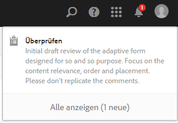
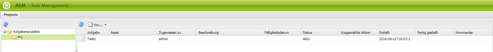
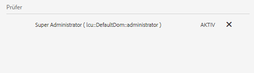
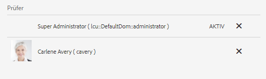

# Erstellen und Verwalten von Überprüfungen von Assets in Formularen{#creating-and-managing-reviews-for-assets-in-forms}

## Überprüfung {#review}

Bei einer Überprüfung handelt es sich um einen Mechanismus, bei dem ein oder mehrere Überprüfer zu einem Asset, das in einem Formular verfügbar ist, Kommentare abgeben können.

## Einrichten einer Überprüfung {#setting-up-a-review}

1. Navigieren Sie zur Formularregisterkarte und wählen Sie ein Formular aus.
1. Wenn für das Asset keine Überprüfung ausgeführt wird, wird in der Aktionsleiste das Symbol zum Überprüfen des Beginns  angezeigt. Klicken Sie auf das Symbol zum Überprüfen des Beginns .
1. Geben Sie die folgenden Informationen ein:

   * Überprüfungsname: obligatorisch – kann alphanumerische Zeichen, Bindestriche oder Unterstriche enthalten.
   * Überprüfungsbeschreibung: optional – Beschreibung des Zwecks/des Inhalts der Überprüfung.
   * Überprüfungstermin: optional – Datum, an dem die Überprüfung beendet wird. Wenn der Termin bereits abgelaufen ist, wird die Aufgabe als „überfällig“ angezeigt.
   * Überprüfer: Es muss mindestens ein Wert angegeben werden. Verwenden Sie das Kombinationsfeld, um Überprüfer hinzuzufügen. Beim Eingeben eines Namens werden alle passenden Namen angezeigt. Wählen Sie einen Namen aus und klicken Sie auf „Hinzufügen“.

1. Füllen Sie alle weiteren Details und klicken Sie dann auf „Start“.

### Aktionen beim Einrichten von Überprüfungen {#actions-that-occur-when-a-review-is-set-up}

In diesem Abschnitt wird beschrieben, was passiert, wenn eine Überprüfung erstellt bzw. eingerichtet wird.

1. Eine neue Überprüfungsaufgabe wird erstellt und dem Initiator der Überprüfung zugewiesen.
1. Allen Überprüfern wird eine Überprüfungsaufgabe zugeteilt. Die Aufgabe wird in ihrem Benachrichtigungsabschnitt angezeigt. Überprüfer können auf eine Benachrichtigung klicken oder zum Posteingang wechseln, um die Aufgabe anzuzeigen. Überprüfer können klicken, um die Überprüfungsaufgabe zu öffnen, das Formular anzuzeigen und Kommentare hinzuzufügen.

   

   Warnung bei Überprüferbenachrichtigungen

1. Das Kommentarfeld ist für den Initiator und die Überprüfer der Assets verfügbar. Andere können die Kommentare anzeigen, jedoch keine Kommentare schreiben.

## Verwalten von Überprüfungen {#managing-a-review}

>[!NOTE]
>
>Es können nur Überprüfungen geändert werden, die noch nicht abgeschlossen sind. Abgeschlossene Überprüfungen können nicht geändert werden.

1. Navigieren Sie zur Formularregisterkarte und wählen Sie ein Formular aus.

1. Wenn ein Asset derzeit eine Überprüfung durchführt und Sie der Initiator der Überprüfung sind, werden in der Aktionsleiste Symbole zum Verwalten von Überprüfungen  angezeigt. Nur Initiatoren von Überprüfungen können die Überprüfung verwalten (aktualisieren/beenden).

   Klicken Sie auf das Symbol zum Verwalten der Überprüfung .

   Für Benutzer, die nicht der Initiator sind, ist das Symbol zum Verwalten von Überprüfungen deaktiviert.

1. Es wird ein Bildschirm mit den folgenden Informationen anzeigt:

   * **Überprüfungsname**: Kann nicht bearbeitet werden.

   * **Überprüfungsbeschreibung**: Kann bearbeitet werden.

   * **Überprüfungstermin**: Kann bearbeitet werden. Die Werte für Datum und Uhrzeit des Termins können geändert werden, wenn sie in der Zukunft liegen.

   * **Überprüfer**: Kann bearbeitet werden. Sie können Überprüfer hinzufügen oder entfernen. Wenn eine Aufgabe überfällig ist, können Sie Überprüfer erst hinzufügen, wenn Sie den Termin verlängern und er über das aktuelle Datum hinausgeht.

1. Bearbeiten Sie die erforderlichen Felder und klicken Sie dann auf „Aktualisieren“.

   

   Überprüfen des aktuellen Status im Task Manager

1. Zum Beenden der Überprüfung klicken auf „Ende“.

### Aktionen beim Bearbeiten von Überprüfungen  {#actions-that-occur-when-a-review-is-modified}

In diesem Abschnitt wird beschrieben, was beim Beenden/Bearbeiten von Überprüfungen passiert:

1. Wenn die Überprüfungsbeschreibung geändert wird, wird die entsprechende Aufgabe der Überprüfer und des Initiators aktualisiert.
1. Wenn der Überprüfungstermin geändert wird, wird zugehörige jeweilige Aufgabe der Überprüfer mit dem neuen Datum aktualisiert.

1. Wenn ein Überprüfer entfernt wird:

   

   Entfernen von Überprüfern

   1. Falls die zugewiesene Aufgabe unvollständig ist, wird sie beendet.
   1. Der Überprüfer kann das Asset nicht mehr kommentieren.

1. Wenn ein Überprüfer hinzugefügt wird:

   

   Hinzufügen von Überprüfern

   1. Eine Überprüfungsaufgabe wird erstellt und dem neu hinzugefügten Überprüfer zugewiesen.
   1. Der neu hinzugefügte Überprüfer kann Kommentare zu Assets hinzufügen.

1. Wenn eine Überprüfung abgeschlossen wird:

   1. **Überprüfer**: Bei allen Überprüfern werden zugewiesene Aufgaben, die unvollständig sind, beendet. Die Aufgabe wird im Benachrichtigungsabschnitt des Überprüfers nicht mehr als „Ausstehend“ angezeigt.
   1. **Initiator**: Die dem Initiator der Überprüfung zugewiesene Aufgabe wird als abgeschlossen markiert. Die Aufgabe wird aus dem Benachrichtigungsabschnitt des Initiators von Überprüfungen entfernt.
   1. **Alle**: Die Überprüfung wird im Abschnitt für die vorherigen Überprüfungen angezeigt. Es können keine weiteren Kommentare hinzugefügt werden.

